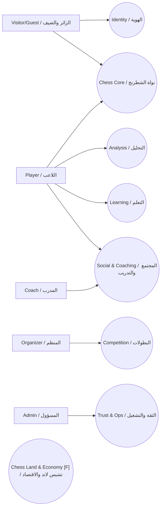
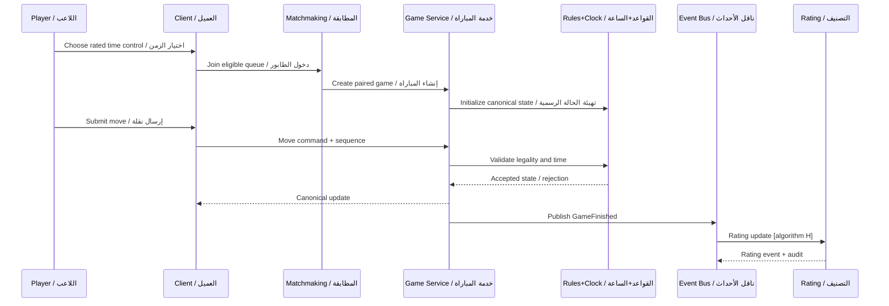
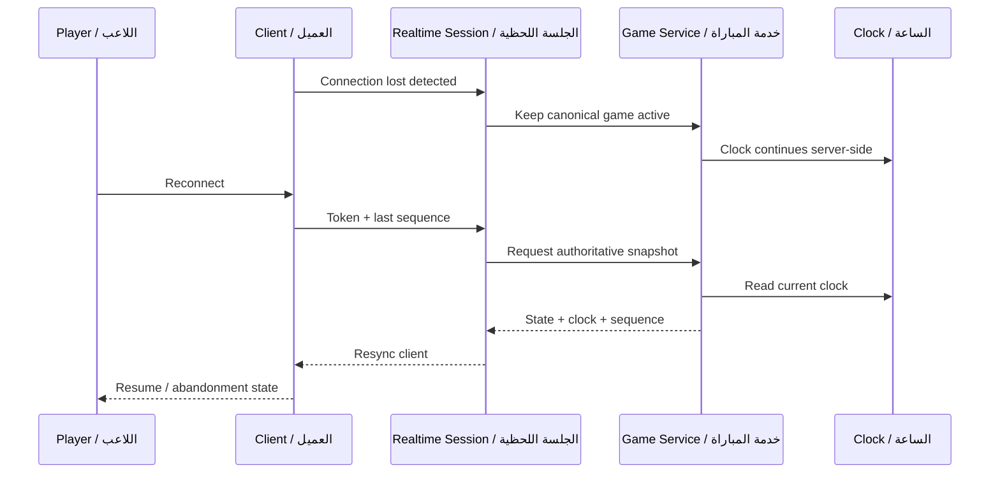
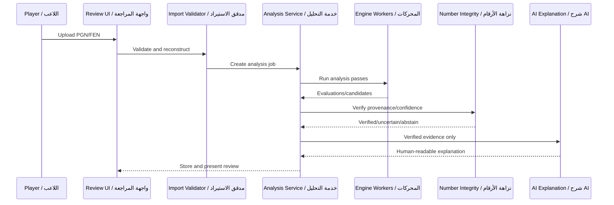
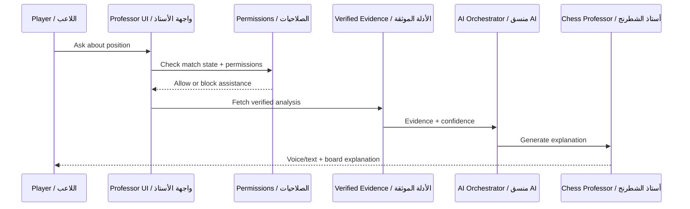
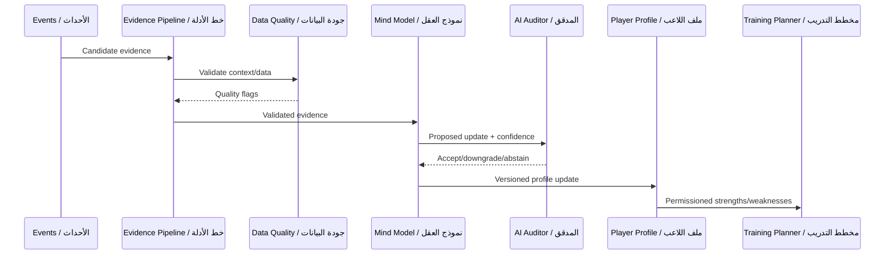
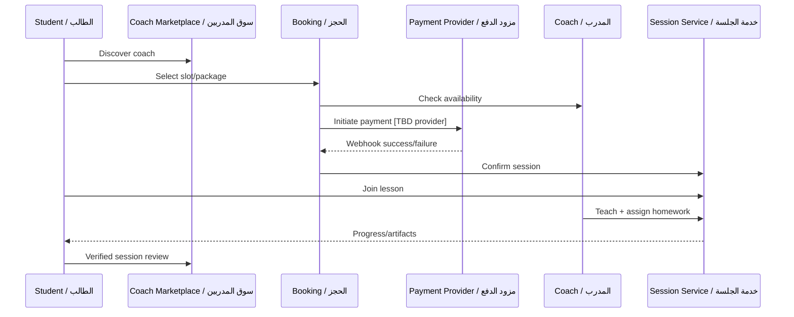
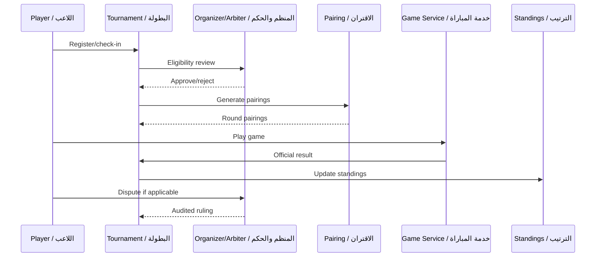
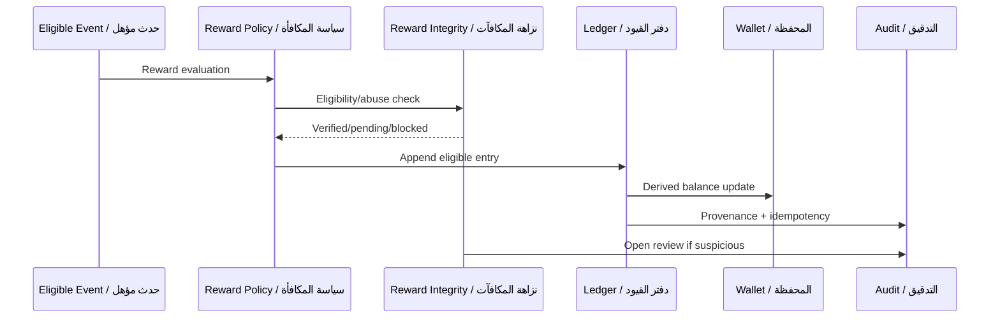
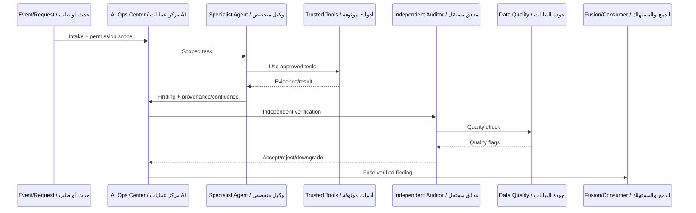

# CHESS ONE — FINAL PROGRAMMING SPECIFICATION v6.0 — WEB FIRST / PLATFORM FIRST — CODE READY BASELINE
## المواصفة المرجعية — عربي + English — الأساس جاهز للعقد، والمرحلة 1 لم تُفتح في هذه الدفعة

**Status / الحالة:** PHASE 0.6 DOCUMENTATION BASELINE. Candidate A is an approved starting stack family. NO APPLICATION CODE in this batch. Phase 1 is not opened by this file.  
**الحالة:** خط أساس المرحلة 0.6. عائلة المرشح A معتمدة للبداية. لا شيفرة تطبيق في هذه الدفعة. هذا الملف لا يفتح المرحلة 1.

**CURRENT EXECUTION STATUS / حالة التنفيذ الحالية:** the status line above is historical for Phase 0.6.  
- Phase 1 is opened for controlled, owner-authorized batches only. / المرحلة 1 مفتوحة لدفعات محكومة يأذن بها المالك فقط.
- Phase 1 Batch 1 (foundation bootstrap) is completed. / الدفعة 1 مكتملة.
- Batch 1.1 (foundation hardening) was independently reviewed and passed. / الدفعة 1.1 روجعت مراجعة مستقلة ونجحت.
- Batch 2 (standard chess move-legality core) was independently reviewed, passed, and committed locally. / الدفعة 2 روجعت ونجحت وحُفظت محليًا.
- Batch 3 (canonical SAN and checkmate/stalemate rule facts) was independently reviewed, passed, and committed locally. / الدفعة 3 روجعت ونجحت وحُفظت محليًا.
- Batch 4 and review correction 4.1 (repetition identity, draw claims, fivefold, 50/75-move rules) were independently reviewed, passed, and committed locally. / الدفعة 4 والتصحيح 4.1 روجعا ونجحا وحُفظا محليًا.
- Toolchain maintenance (Node 24.21.0 LTS, pnpm 12.7.0) was reviewed, passed, and committed locally. / صيانة الأدوات روجعت ونجحت وحُفظت محليًا.
- ENV-NODE-001 is resolved: the active runtime is Node 24.21.0 with pnpm 12.7.0. / ENV-NODE-001 محلول.
- Batch 5 with corrections 5.1 and 5.2 (authoritative live game foundation, in memory, no transport or database) was reviewed, approved, and committed locally. / الدفعة 5 وتصحيحاتها روجعت واعتُمدت وحُفظت محليًا.
- Batch 6 (one-sided mating capability, timeout and resignation adjudication) with correction 6.1 was reviewed, passed, and committed locally. / الدفعة 6 والتصحيح 6.1 روجعا ونجحا وحُفظا محليًا.
- Batch 7 (draw-offer state machine, live-game core completion) was reviewed and passed; with LIVE-OFFER-006 resolved (one draw offer per committed move) it is committed locally. / الدفعة 7 روجعت ونجحت، ومع حسم LIVE-OFFER-006 حُفظت محليًا.
- Batch 8 (persistence foundation: PostgreSQL 18 + Kysely, transactions, outbox) and Batch 8.1 (real PostgreSQL verification, crash clock recovery policy) passed review and are committed locally as `b220a00`. The PostgreSQL integration tests pass on a local PostgreSQL 18.6 test database. LIVE-RECOVERY-CLOCK-001 is RESOLVED: on writer clock-domain loss the game is recovery-paused at its committed balances, and no player is charged for server/process downtime. / الدفعتان 8 و8.1 روجعتا ونجحتا وحُفظتا محليًا (`b220a00`)؛ حُسم LIVE-RECOVERY-CLOCK-001.
- Batch 9 (realtime transport foundation: Fastify 5 + `ws` edge, protocol `chess_one.realtime.v1`, one in-process writer per game with writer-stamped receipt, reconnect and sync, flow control) is implemented, uncommitted, and awaiting review. It is not a public production release: there is no production session resolver, so a production endpoint refuses to start. LIVE-WRITER-OWNERSHIP-001, LIVE-MULTI-CONNECTION-001, LIVE-RECOVERY-RESUME-001, and LIVE-VIEW-ONLY-001 are open. Batch 9.1 (infrastructure pause + writer activation hardening) is implemented, uncommitted, and awaiting review with Batch 9. It RESOLVED LIVE-RETRY-RECEIPT-001 ("Database/persistence outage pauses the game at the last durably committed balances. Infrastructure downtime is never charged to a player.") and LIVE-WRITER-ACTIVATION-001 (explicit idempotent `GameWriterRegistry.activate`; every running game is watched by its writer or paused). Batch 9.2 (writer ownership correction) is implemented, uncommitted, and awaiting review with them: a concurrency conflict pauses the game as `CONCURRENCY_OWNERSHIP_UNCERTAIN` and stops its writer with no automatic re-activation; a create reported failed is reconciled by a fresh read; `WRITER_FAULT` and the `writer_bypass` rule are approved. Batch 10 is NOT authorized. / الدفعة 9 (أساس النقل الفوري) والدفعة 9.1 (إيقاف البنية التحتية وتفعيل الكاتب) والدفعة 9.2 (تصحيح ملكية الكاتب ومطابقة الإنشاء غير المؤكد) نُفذت ولم تُحفظ وتنتظر المراجعة، وليست إصدارًا إنتاجيًا عامًا. أُغلقت LIVE-RETRY-RECEIPT-001 وLIVE-WRITER-ACTIVATION-001، وبقية الفجوات المذكورة مفتوحة. الدفعة 10 غير مأذونة.
- GAP-MATE-004b remains open. / الفجوة GAP-MATE-004b ما زالت مفتوحة.
- v5 remains historical and unchanged. / v5 تاريخي ولا يُعدَّل.
- All open gates remain binding. / كل البوابات المفتوحة ما زالت ملزمة.
- Progress is recorded in `PHASE_1_IMPLEMENTATION_LOG.md`. / التقدم مسجل في سجل تنفيذ المرحلة 1.

**Historical baseline / الخط التاريخي:** `CHESS_ONE_FINAL_PROGRAMMING_SPEC_BILINGUAL_v5_WEB_FIRST_HARDENED.md` يبقى كما أُغلق في المرحلة 0.5. لا يُعدَّل. عند تعارض v5 مع هذه المقدمة، هذه المقدمة هي العقد.

**Supersedes as normative reading / يعلو في القراءة على:** conflicting statements inside the preserved v4 text appended below. The preserved text is kept so IDEA-001 through IDEA-342 and prior diagrams remain traceable. It is not deleted.

**Official domain / النطاق الرسمي (DEC-038):** `chess-one.com` and `www.chess-one.com`.  
`chessone.uk` is D — Superseded, retained only as history.

**Normative annexes / ملاحق معيارية:** إذا اختلف ملحق مع قرار حالته A في السجل أدناه، القرار A هو الأعلى ويُرفع التعارض بدل حسمه بصمت.

- `PHASE_0_DECISION_CHANGELOG.md`
- `DOMAIN_DATA_OWNERSHIP_MATRIX.md`
- `CONTRACT_CATALOG_V1.md`
- `FAILURE_DOMAIN_AND_DEGRADATION_MATRIX.md`
- `SECURITY_THREAT_MODEL_V1.md`
- `TRACEABILITY_MATRIX_V2.md`
- `TEST_ARCHITECTURE_AND_GATES_V1.md`
- `PHASE_0_5_CONTRACT_CORRECTIONS.md` — تصحيحات المرحلة 0.5، ما لم تعدّلها المرحلة 0.6 صراحة.
- `ENGINEERING_CONSTITUTION_V1.md`
- `STACK_DECISION_RECORD_V1.md`
- `CHESS_RULES_AUTHORITY_PACK_V1.md`
- `MATING_POSSIBILITY_AND_DEAD_POSITION_RESEARCH_V1.md`
- `CHESS_ONE_ONLINE_PLAY_POLICY_V1.md`
- `CHESS_RULES_GOLDEN_TEST_LEDGER_V1.md`
- `LIVE_GAME_EVENT_ORDERING_V1.md`

تحليل المرحلة 0.5 يبقى سجلًا. DEC-056 أعلى من جملة «التوصية ليست A» داخل ذلك التحليل:

- `TECHNOLOGY_DECISION_ANALYSIS_V1.md`
- `PROPOSED_REPOSITORY_ARCHITECTURE_V1.md` — اتجاه التبعية؛ شكل المجلدات المعتمد في DEC-058.

---

## 1. Source and decision precedence / أسبقية المصادر والقرارات

هذه القاعدة قرار DEC-049 بحالة A.

من الأعلى إلى الأدنى:

1. آخر توجيه صريح من المالك، ومقدمة v6 الإلزامية هذه. مقدمة v5 المحفوظة في ملفها التاريخي أدنى من هذه المقدمة.
2. البنود ذات الحالة A في سجل القرارات.
3. قواعد العمل والمتطلبات وحالات الاستخدام المعتمدة عندما تتفق مع 1 و2.
4. عقود المعمارية والمخططات عندما تتفق مع ما سبق.
5. السجلات المقترحة أو قيد الدراسة: B وC.
6. الأفكار المستقبلية وأرشيف IDEA.

مصدر أدنى لا يلغي قرارًا أعلى معتمدًا.  
إذا تعارض عنصران معتمدان في المستوى نفسه: تُعلَّم الحالة G ويُرفع الأمر للمالك. لا حل صامت.

أرشيف الأفكار سجل تتبع. حالته هناك لا تلغي DEC.  
القسم 48 داخل النص المحفوظ غير صالح للتنفيذ. المرجع `TRACEABILITY_MATRIX_V2.md`.  
عمود المالك في القسم 11 داخل النص المحفوظ غير صالح. المرجع `DOMAIN_DATA_OWNERSHIP_MATRIX.md`.  
الملحق I داخل النص المحفوظ يقول إن أساس التنفيذ يمكن أن يبدأ. هذا القول أدنى من هذه المقدمة: الشيفرة لم تُفتح.

## 2. Decision register additions / إضافات سجل القرارات

السجل التاريخي DEC-001 حتى DEC-037 يبقى في النص المحفوظ. الإضافات التالية جزء من السجل الرسمي.

| ID | Status | القرار |
|---|---|---|
| DEC-038 | A | النطاق الرسمي `chess-one.com` و`www.chess-one.com`. `chessone.uk` تاريخ مستبدل. فحص العلامة ما زال مطلوبًا. اسم Chess One في DEC-001 يبقى A. |
| DEC-039 | A | Web First, Platform First مؤكَّد. الويب أول عميل. Windows وmacOS وAndroid وiOS/iPhone/iPad ضمن النطاق. ترتيب ما بعد الويب H/TBD. لا ترتيب مخترع. |
| DEC-040 | A | `game.finished.v1` معماري أساسي. تُحفظ النتيجة المرجعية أولًا. يُنشر الحدث بعد الالتزام الدائم. فشل Rating أو Analysis أو Rewards أو Statistics أو Notifications أو Chess Land أو AI لا يلغي النتيجة ولا يكون داخل المعاملة الحرجة. |
| DEC-041 | A | قدرة الضيف معتمدة: لعب، تحدٍ، هوية مؤقتة، وتثبيت مستقبلي آمن. ترتيب الإطلاق H/TBD وليس التزامًا بأول MVP عام. طريقة إثبات ملكية التاريخ H/TBD. |
| DEC-042 | A | الساعة تبقى على الخادم أثناء فقد الاتصال. تحديث المتصفح وسقوط المقبس وخلفية الهاتف لا يوقفونها. إعادة الاتصال تطلب لقطة الخادم والتسلسل. حالة العميل لا تكتب فوق الخادم. لا مدة هجر رقمية. العتبة قابلة للتهيئة وTBD. |
| DEC-043 | A | متحكم نشط واحد لكل لاعب في المباراة التنافسية النشطة. الأجهزة الأخرى للعرض. أي استلام لاحق للتحكم: تحقق من الهوية والجلسة، عقد تحكم جديد، إلغاء القديم، رفض الأوامر القديمة، تدقيق، ثم Sync من الخادم. |
| DEC-044 | A | نتيجة اللعب المحلي/دون اتصال ليست نتيجة خادمية رسمية ولا تعدّل مباشرة التصنيف الرسمي ولا ترتيب البطولة ولا المكافآت التنافسية ولا السجل المرجعي للمسيرة. المزامنة اللاحقة عبر عقد استيراد/تحقق صريح. |
| DEC-045 | A | ثلاث حدود: Chess Rules Library (مكتبة قواعد حتمية بلا آثار جانبية قدر الإمكان)، Authoritative Live Game Service (تملك الحالة والتسلسل والساعة والنتيجة وإعادة الاتصال)، Engine/Bot Worker (منفصل). تعطل العامل لا يوقف إنسان ضد إنسان. مباراة ضد روبوت قد تعتمد العامل لتلك المباراة فقط. |
| DEC-046 | A | مصفوفة Tier 0 وTier 1 وTier 2 وسلوك التدهور ملزمة كما في ملحق الفشل. |
| DEC-047 | A | أثناء مباراة مصنفة/تنافسية نشطة، Chess One لا يقدم للاعب المشارك تقييم محرك أو مساعدة نقلة لمواقف تلك المباراة عبر أي شاشة أو واجهة أو أداة أو تبويب أو وكيل داخلي. المنع خادمي. هذا لا يدّعي منع برنامج خارج سيطرة Chess One. لا يُحزم محرك تحليل قوي داخل عميل الويب التنافسي إذا فتح مسار غش داخلي. قواعد الشطرنج منفصلة عن قدرة البحث والتحليل. |
| DEC-048 | A | ممنوع تعديل جداول/تخزين الحقيقة لمجال آخر مباشرة. التواصل بأوامر وواجهات وأحداث ذات إصدارات وعقود صريحة. |
| DEC-049 | A | قاعدة الأسبقية في القسم 1. |
| DEC-050 | A | PostgreSQL وRedis وRust وTauri وReact وSQLite وGlicko-2 وStockfish ليست اختيارات دائمة معتمدة إلا بقرار A لاحق لكل اسم. لا بديل يُختار هنا. |
| DEC-051 | A | البوابة RULESET-FIDE-VERSION مغلقة على خط الأساس الحالي: FIDE Laws of Chess النافذة في 2023-01-01. المعرّف الهندسي `FIDE-E01-2023`. المصدر الرسمي: FIDE Handbook chapter E01، النص الإنجليزي الأصيل المعتمد في 2022-08-07 والنافذ في 2023-01-01، والصفحة `https://handbook.fide.com/chapter/e012023`. المباريات تحتفظ بمعرّف القوانين الذي لُعبت به. أي قوانين FIDE لاحقة تحتاج إصدارًا جديدًا موثّقًا ومجموعة انحدار خاصة. لا تُعاد قراءة مباراة قديمة بقوانين أحدث. المعرّف يُختار من سجل إصدارات داخل مكتبة القواعد، ولا يُنثر كنص ثابت عشوائي في بقية المنطق. نص القوانين لا يُنسخ داخل المواصفة. |
| DEC-052 | A | حدود MVP النهائية تبقى H/TBD. مقترح القسم 36 ليس اعتمادًا. الأساس يُبنى بحيث يُختار MVP لاحقًا دون إعادة تصميمه. |
| DEC-053 | A | فشل علم الميزة لا يعتمد عليه كل أمر نقلة. لقطة محلية أو ما يعادلها. الافتراض الآمن: الشطرنج الأساسي متاح والميزة الاختيارية مخفية. |
| DEC-054 | A | التدقيق الأمني إلحقي وذو حدود تكشف العبث مفاهيميًا. المسؤول العادي لا يمسح تاريخه الحساس بصمت. تقنية التخزين TBD. |
| DEC-055 | A | دستور الهندسة: تقنية حديثة مستقرة، الأمن من البداية، أقل كود لازم، الوضوح فوق الاختصار في القواعد والساعة والأمن والصلاحية والمال والتصنيف والعقود، وحدات صغيرة، تقليل الاعتماديات، بلا سحر مخفي، أداء مقاس، قابلية الاستبدال، ملاحظة من التصميم، وصيانة بشرية. ميزانيات المراجعة لينة وليست تقسيمًا مصطنعًا بعدد الأسطر. |
| DEC-056 | A | المرشح A خط بداية معتمد: TypeScript 7 وNode.js 24 LTS وNext.js 16 Active LTS وReact 19 المستقر وFastify 5 وPostgreSQL 18 المستقر وKysely وpnpm 12 وBiome وVitest وfast-check وPlaywright لاحقًا للمسار الشامل، مع قياس متوافق مع OpenTelemetry. هذا التعليم الفردي الذي كانت DEC-050 تشترطه لهذه الأسماء فقط. |
| DEC-057 | A | عائلة الإصدار الكبرى هي قرار المعمارية. رقم التصحيح يُثبَّت لاحقًا في ملف القفل وليس ثابتًا معماريًا. ترقيع الأمن إلزامي. لا ترقية كبرى تلقائية. تاريخ مراجعة العملة 2026-09-28. |
| DEC-058 | A | مستودع واحد بـ pnpm workspaces. لا Nx ولا Turborepo في البداية. لا مجلدات فارغة لعملاء سطح المكتب والهاتف داخل الشيفرة. فحص الحدود لاحقًا جزء من الاختبار. |
| DEC-059 | A | Go مرشح استخراج مستقبلي لسلطة المباراة الحية فقط بعد قياس. Rust مرشح تخصصي مستقبلي لنواة صغيرة أو WASM أو عامل، وليس لغة منتج في اليوم الأول. لا Redis ولا وسيط رسائل ولا Kubernetes بالعادة. |
| DEC-060 | A | سياسة اللعب الشبكي سياسة Chess One وليست مادة FIDE. القيم الرقمية غير المحسومة تبقى TBD. |
| DEC-061 | A | مقارنة الساعة بزمن استلام رتيب. تأخير المعالجة بعد استلام وقع قبل الموعد لا يُخصم من اللاعب. ساعة الحائط للعرض والتدقيق. تعويض التأخير الشبكي TBD. |
| DEC-062 | A | الموضع الميت وإمكانية الكش مات لا يُختزلان إلى قائمة مادة ناقصة. تعادل كاذب ممنوع. الدالة الجزئية غير المثبتة تبقى BLOCKED/PARTIAL. |
| DEC-063 | A | `received_at` يُختم داخل مجال الساعة الرتيبة لكاتب المباراة الحية المرجعي، عند المدخل، قبل فحص القواعد وقبل طابوره الداخلي. لا ختم رتيب من عميل الويب. لا ختم رتيب من عملية المدخل يُعامل كقابل للمقارنة. بروتوكول نقل زمن الاستلام بين العمليات غير معتمد. ساعة الحائط تنتقل بين العمليات للتدقيق فقط. |
| DEC-064 | A | `UNKNOWN` من دالة إمكانية الكش مات لا تحوّله شيفرة المرحلة 1 إلى فوز أو خسارة أو تعادل رسمي. الحالة `MATING_POSSIBILITY_UNRESOLVED` غير محسومة: لا `game.finished.v1` ولا تصنيف ولا مكافأة ولا ترتيب بطولة ولا نتيجة مسيرة رسمية. سياسة الحسم النهائية بوابة لاحقة. يعلو على النص الأقدم الذي جعل `UNKNOWN` خسارة. |

DEC-051 أصبح A في المرحلة 0.5 بخط الأساس `FIDE-E01-2023`. مسودات أو إعادة صياغة لاحقة، ومنها نقاشات لجنة القواعد بعد 2023، ليست قانونًا نافذًا لهذا المعرّف.

## 3. Business rules added / قواعد عمل مضافة

| ID | Rule |
|---|---|
| BR-021 | Live Game commits the official result before any `game.finished.v1` publication. |
| BR-022 | Guest play, guest challenge, temporary identity, and future secure claim are confirmed capabilities. Release order is not implied. Claim proof is not chosen. |
| BR-023 | Connectivity loss does not pause the server clock and does not let the client own time. |
| BR-024 | Abandonment duration is configuration with no number in this specification. |
| BR-025 | One active controller lease per player per active competitive game. |
| BR-026 | A local result is not a server GameResult and does not directly change rating, standings, competitive rewards, or canonical career. |
| BR-027 | Rules library, live authority, and engine worker are separate failure domains. |
| BR-028 | A domain does not write another domain's authoritative storage. |
| BR-029 | Competitive chess help for positions in an active rated game is denied on the server across Chess One surfaces. |
| BR-030 | Client timestamps do not own the clock. |
| BR-031 | Feature-flag unavailability hides optional features and leaves core chess available. |
| BR-032 | Sensitive audit history is append-only at the security boundary. |
| BR-033 | Every official game stores `ruleset_id`. New implementation baseline is `FIDE-E01-2023`. Later FIDE laws need a new id and a new regression suite. Historical games keep the id they were played under. |
| BR-034 | `SubmitMoveCommand.v1` authority is the authenticated session, the control lease, the server-derived seat, and structured squares. Client SAN and client `actor_id` are not authority. A stored binding decision replays with `replayed_response` and does not apply a second move. |
| BR-035 | Critical-path code prefers clarity over a shorter obscure form. Dependencies need a written reason. Hidden cross-domain writes are forbidden. |
| BR-036 | Elapsed game time uses server monotonic time up to command receipt. Processing after a timely receipt is not player time. Wall-clock time is for display and audit. |
| BR-037 | Online disconnect, refresh, background, abandonment, premove, lag, spectator delay, and server-outage behavior are Chess One policy. They are not FIDE articles. |
| BR-038 | A dead-position draw is emitted only for `PROVEN_DEAD`. A no-mate draw after resignation or flag needs a reviewed one-sided proof (GAP-MATE-004). `UNKNOWN` must not become a draw, a win, or a loss (DEC-064). Later approved correction (LIVE-CONTRACT-001, Phase 1 Batch 6): the flag or resignation result follows the opponent's one-sided capability, `PROVEN_CAN_MATE` a win for the opponent and `PROVEN_CANNOT_MATE` a no-mate draw, only for the reviewed classes of research section 9. Everything else stays `UNKNOWN` (GAP-MATE-004b). |

## 4. Requirements added / متطلبات مضافة

الحالة A تعني أن المتطلب المعماري معتمد. الحقول المعلّمة H داخله تبقى مفتوحة.

| ID | Requirement | Status |
|---|---|---|
| FR-P0-001 | Persist GameResult, then publish `game.finished.v1` via the outbox contract. | A |
| FR-P0-002 | Guest capability exists as specified in DEC-041. | A, release H |
| FR-P0-003 | Guest claim proof method is an open gate. | H |
| FR-P0-004 | Reconnect uses the server state machine in the contract catalog. | A |
| FR-P0-005 | No hard-coded abandonment duration. | A as a prohibition; threshold H |
| FR-P0-006 | Enforce one active controller. | A |
| FR-P0-007 | Takeover, if later enabled, follows the lease rotation rules. | A as rules; product switch not an MVP grant |
| FR-P0-008 | Local results stay unofficial until an explicit import contract, which is not opened as a product here. | A |
| FR-P0-009 | Split rules library, live game service, and engine worker. | A |
| FR-P0-010 | Tier degradation behaves as the failure annex. | A |
| FR-P0-011 | Server-side competitive safe mode covers every Chess One surface for that live game's positions. | A |
| FR-P0-012 | Do not ship a powerful analysis engine inside the competitive Web client as an internal cheating path. | A |
| FR-P0-013 | No cross-domain authoritative writes. | A |
| FR-P0-014 | `SubmitMoveCommand.v1` is the move contract. | A |
| FR-P0-015 | Feature flags use a snapshot and the safe default. | A |
| FR-P0-016 | AuditEvent ownership and append-only boundary. | A; storage H |
| FR-P0-017 | Ruleset version is explicit. Current baseline is `FIDE-E01-2023` under DEC-051. | A |
| FR-P0-018 | Precedence rule DEC-049. | A |
| FR-P0-019 | Names not listed in DEC-056 stay unapproved under DEC-050. DEC-056 is the individual approval for the starting stack families. | A |
| FR-P0-020 | Official domains in DEC-038. | A |
| FR-P06-001 | Engineering constitution DEC-055. | A |
| FR-P06-002 | Starting stack families DEC-056. Patch numbers are not architectural constants. | A |
| FR-P06-003 | Version currency policy DEC-057. Currency date 2026-09-28. | A |
| FR-P06-004 | pnpm workspace monorepo and future boundary tests DEC-058. | A |
| FR-P06-005 | FIDE article classification in the rules authority pack. | A |
| FR-P06-006 | Dead-position detector is partial. False draws are forbidden. | A as a prohibition; full algorithm BLOCKED |
| FR-P06-007 | Draw, offer, and resignation command contracts. | A as contracts; no code |
| FR-P06-008 | Monotonic receipt ordering. Server processing delay is not player time. | A |
| FR-P06-009 | Online play policy is separate from FIDE. Numeric thresholds stay TBD. | A |
| FR-P06-010 | Security development gates. No remote optional control on the move path. | A |
| FR-P06-011 | Third-party chess code needs a license decision before use. | A as a gate; no library chosen |

## 5. Architecture contract (short form) / العقد المعماري المختصر

التفصيل في الملاحق. هذا الملخص ملزم معها.

**Clients / العملاء.** منصة واحدة. أول تنفيذ: Web. الباقي نطاق مؤكد بترتيب H. ما يُشارك: قواعد الشطرنج ونماذج المجال، العقود، الواجهات، التحقق، مفاهيم الهوية، سياسات الأمن، مخططات الأحداث، ورموز التصميم حيث تناسب. ما يبقى لكل عميل: التنقل، تكامل الجهاز، أسلوب الإدخال، إشعارات الجهاز، التغليف، متطلبات المتجر والتوزيع، ودورة حياة نظام التشغيل. لا واجهة متطابقة مفروضة بين العملاء.

**Tier 0.** أمر النقلة، الشرعية، الحالة الحية، الساعة، التسلسل، حسم النتيجة، الحفظ والاستعادة.  
**Tier 1.** الهوية لبدء الجلسة، إنشاء المباراة، المطابقة، التصنيف بعد النهاية، السجل. مباراة قائمة لا تنتظر عمل طبقة 1 غير لازم.  
**Tier 2.** التحليل، الذكاء، التدريب، الشهادات، Chess Land، الاقتصاد، المجتمع، الدردشة، المحتوى، البحث، الإشعارات، الإحصاء، إثراء المشاهدة. كل واحد يتدهور وحده كما في ملحق الفشل.

**Guest / الضيف.** UC-ID-01 وUC-ID-02 وFR-ID-001 وFR-ID-002 أصبحت القدرة فيها A. SQ-DGM-10 يصف القدرة. إثبات الملكية وترتيب الإطلاق مفتوحان. لا يُستنتج من ذلك أن الضيف داخل أول إصدار عام.

**Local play / اللعب المحلي.** UC-GM-05 يبقى قدرة لعب محلي معتمدة، ونتيجتها ليست نتيجة رسمية.

## 6. Cross-platform sharing / المشاركة بين المنصات

| May be shared / يجوز مشاركته | Stays client-specific / يبقى لكل عميل |
|---|---|
| Chess rules and domain models | Navigation |
| Protocol contracts and APIs | Native device integration |
| Validation | Input methods |
| Identity concepts | Push notification shell |
| Security policies | Packaging |
| Event schemas | Store/distribution requirements |
| Design tokens where appropriate | OS lifecycle integration |

Web failure does not change Windows, macOS, Android, or iOS packages, and does not change server truth.

## 7. Technology names / أسماء التقنيات

DEC-056 يعتمد عائلات البداية المذكورة في سجل الحزمة. DEC-050 يبقى حاجزًا على Redis وSQLite وTauri وGlicko-2 وStockfish، وعلى Rust وGo كاعتماد يوم أول. PostgreSQL 18 المستقر وReact 19 المستقر داخلان في DEC-056. PostgreSQL 19 التجريبي ممنوع. رقم التصحيح ليس ثابتًا معماريًا (DEC-057). CON-005 يبقى G/H. CON-006 يُغلق فقط في جزء React كواجهة ويب؛ Tauri وSQLite وRust كيوم أول يبقيان غير معتمدين.

## 8. Ruleset gate / بوابة القوانين

`RULESET-FIDE-VERSION` = DEC-051 = A.  
خط الأساس الحالي: قوانين FIDE النافذة في 2023-01-01، والمعرّف `FIDE-E01-2023`.  
قائمة السلوك والاختبار في `TEST_ARCHITECTURE_AND_GATES_V1.md` مرتبطة بأرقام مواد المصدر الرسمي، بلا نسخ حرفي لنص القانون.  
عبارة «adopted FIDE version» في النص المحفوظ تعني هذا المعرّف للمباريات الجديدة بعد المرحلة 0.5. مباراة محفوظة تُفسَّر بمعرّفها المخزّن فقط.

## 9. MVP

DEC-052. القسم 36 في النص المحفوظ يبقى اقتراحًا غير معتمد. الاعتمادات رُتبت بحيث يمكن لاحقًا اختيار شريحة إطلاق دون دمج Tier 2 داخل معاملة النقلة، ودون جعل الضيف أو التصنيف النهائي أو العالم جزءًا صامتًا من الأساس.

## 10. What was corrected inside the preserved text / ما صُحح داخل النص المحفوظ

التصحيحات الآلية المطبقة على النص أدناه، في النسختين العربية والإنجليزية حيث يتكرر النص:

- UC-GM-10 من C إلى A مع DEC-040.
- UC-ID-01 وUC-ID-02 من C إلى A كقدرة، مع إبقاء الإطلاق والإثبات H.
- جملة النطاق في DEC-001: الاسم A، والنطاق القديم D.
- FR-ID-001 وFR-ID-002 عليهما حاشية DEC-041.
- بعد مخطط SQ-DGM-10 حاشية أن الإثبات غير مغلق.
- القسم 11 والقسم 48 موسومان بأن الملاحق تحل محلهما في التنفيذ.
- ذكر PostgreSQL موسوم بأنه ليس قرارًا A (DEC-050).
- كل `chessone.uk` المتبقي موسوم بأنه نطاق مستبدل.
- جمل «جاهز لبدء تنفيذ الأساس» موسومة بأن v5 لا تفتح الشيفرة.
- قسم MVP موسوم بأن DEC-052 يبقيه H.

لم تُحذف IDEA-001…IDEA-342. لم تُرفع اقتصاد أو Chess Land أو مراسلة أو معادلات الجودة إلى A.

## 11. Still open / ما زال مفتوحًا

خوارزمية التصنيف، معادلات الجودة والعقل، حدود MVP، ترخيص توزيع Chess One نفسه، الأطفال، SLO، السحابة، التسعير، أرقام الاقتصاد، سياسة الشهادات، استئناف اللعب النظيف، الاحتفاظ بالبيانات، مزودو الذكاء والصوت، العلامة القانونية، ترتيب العملاء بعد الويب، رقم الهجر، طريقة إثبات الضيف، تعويض التأخير، والنقلة المسبقة. ملكية الكيانات الستة الملتبسة تبقى H. إمكانية الكش مات الكاملة BLOCKED/PARTIAL. أي إصدار FIDE بعد `FIDE-E01-2023` بوابة جديدة. عائلة الحزمة لم تعد مفتوحة؛ أرقام التصحيح تُراجع عند السقالة لاحقًا.

## 12. Preserved source banner / لافتة النص المحفوظ

يبدأ تحت هذا السطر النص الكامل لـ v4، مع التصحيحات المذكورة فقط. عند التعارض مع الأقسام 1–11 هنا، الأقسام 1–11 هي العقد. تصحيحات المرحلة 0.5 داخل هذه الأقسام وفهرس العقود أعلى من أي جملة أقدم عن SAN أو عن بقاء DEC-051 مفتوحًا.

---

# CHESS ONE — FINAL PROGRAMMING SPECIFICATION & AI/CURSOR HANDOFF v4.0 — WEB FIRST / PLATFORM FIRST
## المواصفات النهائية للبرمجة وتسليم Cursor/فريق البرمجة — Web First / Platform First — Arabic + English

**Status / الحالة:** READY FOR WEB-FIRST PLATFORM FOUNDATION AUDIT — جاهز لمراجعة تأسيس Web-First / Platform-First. لا يبدأ Cursor كتابة الكود قبل اجتياز Read-Only Architecture Compliance Audit؛ وبعد اعتماد نتيجة التدقيق يبدأ Phase 0 ثم Phase 1 فقط. Production gates and H/C decisions remain binding.

**Authority / المرجعية:** This v4 preserves every prior idea and diagram, supersedes only the previous Windows-first execution order, and records the owner-approved Web First / Platform First architecture. Historical replaced decisions remain traceable as D; B/C/F/H are not silently promoted.

## Programming Start Rules / قواعد بدء البرمجة
- A = Confirmed / معتمد. B/C/H are not final production behavior. D/E are not implemented. F remains future scope unless promoted by the owner.
- Chess legality, canonical state, clock and official result are deterministic/server-authoritative.
- AI/LLM never owns chess truth and cannot give move assistance during active competitive play.
- Do not hard-code unresolved rating, economy, Move Quality, Chess Mind or calibration constants.
- Cursor must read this whole file before changing code; after every batch it must self-review, lint, type-check/build, run tests, fix its own errors, and update traceability.
- No deployment, paid-provider activation, production secrets, or production migration without explicit owner authorization.
- Arabic RTL and English LTR are first-class from the first component.

## OWNER DECISION v4 — WEB FIRST, PLATFORM FIRST / قرار المالك: الويب أولًا والمنصة أولًا

**A — Confirmed / معتمد.** Chess One is one central multi-device platform, not five separate products. The first implementation client is **Web**, while Windows, macOS, Android and iOS/iPhone/iPad consume the same platform contracts and shared core wherever technically correct.

### Fixed architecture principles / المبادئ المعمارية الثابتة
- **Web First — الويب أولًا:** Web is the first implementation and validation surface.
- **Platform First — المنصة أولًا:** domain boundaries, shared contracts, server authority, data ownership, security, observability and fault boundaries are designed before client-specific expansion.
- **Shared Core with Independent Clients — نواة مشتركة مع تطبيقات مستقلة:** share accounts, chess rules/state contracts, services, APIs, realtime protocols, data models, security policies and events; keep client UI/runtime/platform integrations independent.
- **Loose Coupling — ترابط منخفض:** cross-domain communication uses explicit versioned contracts/events; no hidden cross-module database writes.
- **Fault Isolation — عزل الأعطال:** contain failures at the smallest practical boundary: component → feature → page/route → client → service/worker → domain.
- **Graceful Degradation — تدهور تدريجي آمن:** optional subsystem failure must degrade only that capability and must not synchronously block active core play.
- **Independent Deployability — نشر مستقل:** clients and deployment units can be released/rolled back independently as far as technically practical; this does not require turning every module into a microservice.
- **High Availability — توفر عالٍ:** critical gameplay services avoid single points of failure where technically/economically justified; exact SLO/RTO/RPO values remain TBD until measured.
- **Security by Design — الحماية من أصل التصميم:** clients are untrusted; authorization and critical validation remain server-side; least privilege, secret isolation, secure sessions/transport, auditing, abuse controls and incident response are architectural requirements.
- **No Monolithic Failure — لا فشل شامل:** code may use a modular-monolith approach where safe, but the active-game critical path must be isolated from optional heavy or failure-prone workloads such as AI, analysis, media, store and notifications.

### Shared vs client-specific responsibility / المشترك وما يخص كل منصة
**Shared platform:** Identity/account model; Chess Core truth; authoritative game state/clock; APIs; realtime contracts; rating/tournament/analysis service contracts; data ownership; security policies; event schemas; audit; feature flags; observability; localization data contracts.

**Per-client:** UI composition/navigation; device/native integrations; local cache; renderer/performance profile; input methods; notification shell; accessibility adaptation; platform-specific packaging/update behavior. A client may fail or be updated without changing canonical server truth.

### Fault-criticality model / طبقات أهمية الخدمات
- **Tier 0 — Active Game Continuity:** canonical game state, legal-move validation, authoritative clock, realtime session continuity and durable active-game persistence. Must be protected from optional subsystem failures.
- **Tier 1 — Core Access:** identity/account, matchmaking/game creation, rating pipeline and core history. Failure may block new work but should not terminate healthy active games when technically safe.
- **Tier 2 — Optional Experience:** store, notifications, certificates, training, statistics, Chess Land, AI, chat, creator/media and similar non-critical systems. Failure must not drop Tier 0.

### New diagrams / الرسومات الجديدة
- `ARCH-WF-001` — One Platform, Independent Clients / منصة واحدة وعملاء مستقلون.
- `FAULT-WF-001` — Fault Isolation Keyboard Model / نموذج لوحة المفاتيح لعزل الأعطال.
- `DEPLOY-WF-001` — Independent Deployability & Versioned Contracts / النشر المستقل والعقود ذات الإصدارات.


## Actual UML Use Case Diagrams / مخططات حالات الاستخدام الفعلية
### UC-DGM-01 — Platform Overview / النظرة العامة للمنصة

### UC-DGM-02

### UC-DGM-03

### UC-DGM-04

### UC-DGM-05

### UC-DGM-06

### UC-DGM-07

### UC-DGM-08


## Actual UML Sequence Diagrams / مخططات التسلسل الفعلية
### SQ-DGM-01

v5 DEC-040: the Rating arrow is an asynchronous consumer of `game.finished.v1` after the durable result commit. It is not inside the critical game transaction. The rating algorithm remains H.


### SQ-DGM-02



### SQ-DGM-03



### SQ-DGM-04



### SQ-DGM-05



### SQ-DGM-06



### SQ-DGM-07



### SQ-DGM-08



### SQ-DGM-09



### SQ-DGM-10
```mermaid
sequenceDiagram
participant A as Guest A / الضيف أ
participant L as Challenge Link / رابط التحدي
participant B as Guest B / الضيف ب
participant I as Guest Identity / هوية الضيف
participant G as Game Service / خدمة المباراة
participant C as Account Claim / تثبيت الحساب
participant P as Permanent Account / الحساب الدائم
A->>L: Create/share challenge
B->>L: Open challenge
L->>I: Resolve temporary identities
I->>G: Start guest game
G->>I: Store eligible temporary history
A->>C: Secure claim request
C->>I: Verify ownership proof
I->>P: Attach eligible history
P-->>A: Permanent identity/history
Note v5 DEC-041: guest capability is A. The ownership-proof step is H/TBD. This diagram does not approve a claim method or put guest play into the public MVP.
```


## v4 CHANGE AUDIT — مراجعة التغيير من Windows-First إلى Web-First
- Platform order: Desktop-first marked **D — Replaced**; Web-first marked **A — Confirmed**.
- Architecture: one central platform + five independent clients; no per-platform backend rebuild.
- MVP recommendation: first shell changed from Windows/Desktop to Web.
- Development phases/order: shared platform foundation precedes Web client; Web Online Core follows; other clients consume same contracts later.
- Reliability: new fault-isolation, graceful-degradation, client-isolation and Tier 0/1/2 requirements added.
- Delivery: independent client/service releases use versioned contracts; no requirement to make every module a microservice.
- Security: server-side authority and least privilege reinforced across every client.
- Traceability: old Windows-first decision remains in history as replaced; no previous feature/idea was deleted.
- Diagrams: all previous 8 Use Case + 10 Sequence diagrams preserved, plus 3 Web-First/Fault-Isolation architecture diagrams.

---
## COMPLETE SOURCE — FULL ARABIC MASTER SPECIFICATION / النص العربي الكامل
# 10. FULL ARABIC MASTER SPECIFICATION — النص الكامل للمواصفات العربية

```text
CHESS ONE
المواصفات الرئيسية الكاملة للمشروع
Single Source of Truth — المرجع الوحيد المعتمد قبل التخطيط البرمجي

الحقل | القيمة
الإصدار | 2.0 — 23 سبتمبر 2026 — UML + Cursor Handoff
الحالة | Final Engineering Handoff — تسليم هندسي نهائي / يمكن بدء التنفيذ المحكوم؛ عوائق Section 50 تبقى ملزمة
المصدر الأساسي | Full conversation file beginning with “اريد انشاء موقع للعب الشطرنج”
تعليمات المهمة | تم لصق markdown(20260923-041928).md
قاعدة الدقة | No proposal is silently promoted to an approved owner decision.
إضافات الإصدار | UML Use Case Diagrams + UML Sequence Diagrams + عقد تنفيذ Cursor بالذكاء الاصطناعي


منهج المصدر والمراجعة
اعتمدت هذه الوثيقة ملف المحادثة الذي يبدأ حرفيًا برسالة المستخدم «اريد انشاء موقع للعب الشطرنج» باعتباره المصدر الأساسي الذي أكده صاحب المشروع، وملف تعليمات المهمة باعتباره معيار البناء. استُخدمت ملفات SRS والسجل الشامل والمخطط التقني كطبقة تحقق ثانوية، مع إدخال آخر القرارات التي ظهرت في المحادثة الحالية بعد تلك الوثائق.
قاعدة التفسير: لا تتحول أي توصية سابقة من المساعد إلى قرار مالك ما لم يوجد قبول واضح أو أصبحت قاعدة ثابتة لاحقًا. عند الشك تم استخدام C أو H بدل الادعاء بالاعتماد.
Code | Meaning
A | Confirmed / معتمد نهائيًا
B | Proposed / مقترح
C | Under Discussion / قيد الدراسة
D | Replaced / تم استبداله
E | Rejected / مرفوض
F | Future / مستقبلي
G | Conflict / تعارض
H | Missing Decision / يحتاج قرار

1. Project Vision — رؤية المشروع
Chess One ليس مجرد موقع لعب؛ الرؤية الحالية هي نظام حياة/تشغيل متكامل للاعب الشطرنج يربط اللعب، الفهم، التعلم، التدريب، الذاكرة، المنافسة، المجتمع، المسيرة، الذكاء الاصطناعي والعالم التفاعلي.
المشكلة التي يحلها: أدوات الشطرنج الحالية مجزأة بين اللعب والتحليل والتدريب وقواعد البيانات والمدربين والبطولات. Chess One يهدف إلى تحويل نشاط اللاعب كله إلى ملف مترابط: كل مباراة تنتج معرفة، وكل خطأ يمكن أن يتحول إلى تدريب، وكل إنجاز يصبح جزءًا من المسيرة.
المستخدمون المستهدفون: الزائر، اللاعب المبتدئ، اللاعب التنافسي، المحترف، المدرب، الطفل وولي الأمر، المدرسة/الأكاديمية، منظم البطولة والحكم، صانع المحتوى، المشاهد، المجتمع والإدارة.
التميّز الأحدث: Chess Mind Core، AI Department، Universal Game Review، Precision Game Intelligence، Chess Professor، ونظام نزاهة الأرقام الذي يجعل الدقة وقابلية الإثبات جزءًا من المنتج نفسه.
2. Project Principles — مبادئ المشروع
ID | المبدأ
PR-001 | النواة التنافسية أولًا
PR-002 | الأنظمة معيارية ومعزولة الأعطال
PR-003 | لا إعلانات
PR-004 | لا دفع مقابل الفوز
PR-005 | الخادم مرجع اللعب الحي
PR-006 | الذكاء لا يملك الحقيقة الشطرنجية
PR-007 | لا مساعدة AI في اللعب التنافسي
PR-008 | كل رقم مهم قابل للتتبع
PR-009 | عدم اليقين ظاهر ولا يخفى
PR-010 | التقدم يعتمد على الإثبات
PR-011 | العربية والإنجليزية من اليوم الأول
PR-012 | 2D/3D اختياريان
PR-013 | الخصوصية حسب الحقول
PR-014 | أقل صلاحيات ممكنة
PR-015 | لا scraping غير مصرح
PR-016 | التوسع يثبت بالاختبار
PR-017 | كل شيء يعود في النهاية إلى الشطرنج
PR-018 | لا أرقام اقتصادية نهائية بلا محاكاة
PR-019 | المكونات المدفوعة لا تمنح قوة تنافسية
PR-020 | يمكن تعطيل الميزة دون إسقاط النواة

3. User Types & Roles — أنواع المستخدمين والأدوار
ID | الدور | الوصف
ACT-01 | الزائر / الضيف (الضيف) | مستخدم غير مسجل يمكنه التصفح واللعب كتجربة ضيف ضمن الحدود.
ACT-02 | اللاعب المسجل (Registered اللاعب) | المستخدم الأساسي الذي يمتلك جواز الشطرنج وتقدمًا دائمًا.
ACT-03 | اللاعب التنافسي (Competitive اللاعب) | لاعب يشارك في مصنّف، بطولات ومنافسات خاضعة لـاللعب النظيف.
ACT-04 | المشاهد (المشاهد) | يشاهد المباريات والبث والـreplays دون التأثير على اللعب.
ACT-05 | المدرب / المرشد (Coach / المرشد) | يقدم تدريبًا، دراسات، خططًا وتعليقات ضمن صلاحيات المستخدم.
ACT-06 | صانع المحتوى (صانع المحتوى / Streamer) | ينشئ التحدي Rooms وفيديوهات وبثًا بموافقة المشاركين.
ACT-07 | منظم البطولة / الحكم (Organizer / Arbiter) | ينشئ البطولات، يدير التسجيل والقرعة والنتائج والبث.
ACT-08 | قائد القبيلة / المملكة | يدير الكيان الجماعي ضمن صلاحيات محددة ولا يملك حسابات الأعضاء.
ACT-09 | عضو القبيلة / المملكة | يشارك في الوظائف والتدريب والحروب والمهام الجماعية.
ACT-10 | ولي الأمر (Parent / Guardian) | يدير اعتبارات الأمان والخصوصية والمشتريات للحسابات المؤهلة.
ACT-11 | المشرف / فريق الدعم (Moderator / Support) | يعالج البلاغات والمحتوى والنزاعات وفق Audit.
ACT-12 | مسؤول النظام (Administrator) | يشغّل المنصة، مفاتيح تفعيل الميزات، السياسات والتعافي بصلاحيات محكومة.
ACT-13 | مزود الدفع (الدفع المزود) | طرف خارجي لعمليات الشراء، الاسترداد والتسوية.
ACT-14 | مزود بيانات/خدمة خارجية | FIDE/Lichess/YouTube/البريد الإلكتروني/البحث/التخزين وغيرها عبر واجهات برمجة التطبيقات وترخيص مناسب.
ACT-15 | محرك الشطرنج / محرك الشطرنج Workers | مكون حسابي موثوق للتحليل والحقيقة الشطرنجية، منفصل عن نموذج اللغة الذكي.
ACT-16 | الطفل / اللاعب القاصر | حساب مؤهل لسياسات أطفال أشد وحوكمة ولي الأمر.
ACT-17 | المعلم / مدير الأكاديمية | يدير الصفوف والواجبات والتقدم ضمن صلاحيات تعليمية.
ACT-18 | وكيل الذكاء الاصطناعي الداخلي | عامل رقمي محدود الصلاحيات: مراقب أو محلل أو مدقق أو مخطط وفق هوية وصلاحيات مسجلة.

قاعدة صلاحيات عامة: لا يحصل أي دور — بشري أو AI — على وصول شامل. العرض والتنفيذ والتعديل والحذف والموافقة والتصدير والإدارة تُمنح على مستوى المجال والعملية وبحسب الخصوصية والعمر وحالة المباراة.
4. Complete Module Map — خريطة الوحدات الكاملة
Module ID | الاسم العربي | English | النطاق
MOD-001 | الهوية والحساب | Identity & Account | الحساب، الضيف، الجلسات، الأجهزة، الجواز، المسيرة، الخصوصية، الشهادات.
MOD-002 | نواة الشطرنج والمباراة | Chess Core & Game | قواعد FIDE، الحالة القانونية، النقلات، الساعات، النتائج، PGN/FEN/SAN، اللعب المحلي والروبوت.
MOD-003 | اللعب اللحظي والمطابقة والتصنيف | Realtime, Matchmaking & Rating | جلسات اللعب، reconnect، queue، pairing، rating pools، عدم اليقين، سجل التحديثات.
MOD-004 | المنافسة والبطولات وOTB | Competition, Tournaments & OTB | البطولات، الجولات، pairing، standings، arbiters، OTB Companion، البث.
MOD-005 | التحليل والذكاء الدقيق للمباراة | Analysis & Precision Game Intelligence | المحركات، tablebases، Game Review، Universal Review، Move Quality، الثقة، إعادة التحليل.
MOD-006 | ذكاء اللاعب والتعلم | Player Intelligence & Learning | Chess Mind، DNA، Memory، Mastery، Training Planner، Academy، التكرار المتباعد.
MOD-007 | منظومة الذكاء الاصطناعي | AI Department & Chess Professor | وكلاء متخصصون، orchestrator، audit، AI Coach، Chess Professor، Safe Mode.
MOD-008 | مختبرات وأدوات الشطرنج | Chess Labs & Tools | Puzzles، Opening Lab، Endgame Lab، Study، Library، Scanner، Video Chess، PGN/FEN tools.
MOD-009 | المجتمع والتعليم البشري | Social, Coaches, Clubs & Schools | Friends، Groups، Clubs، Clans، Alliances، Coaches، Kids، Schools، Messaging.
MOD-010 | تشيس لاند والبرج والجزر | Chess Land, Tower & Islands | العالم التفاعلي، القرى، الأبطال، الجزر، Tower، chronicles، المغامرات.
MOD-011 | الممالك والأراضي والقلاع | Realms, Land & Castles | الأرض، المدينة، القصر، الوظائف، الأكاديمية، المجلس، الخزينة، الحروب.
MOD-012 | الاقتصاد والمقتنيات والتجارة | Economy, Collectibles & Commerce | العملات، ledger، rewards، store، billing، cosmetics، forge، mastery assets.
MOD-013 | المشاهدة وصناعة المحتوى | Watch, Broadcast & Creator | spectating، highlights، creator mode، video، live events، news/content.
MOD-014 | البحث والإشعارات والمنصة | Search, Notifications & Platform | global search، notifications، localization، settings، analytics، integrations.
MOD-015 | الثقة والأمن والخصوصية | Trust, Security, Privacy & Legal | Fair Play، reward integrity، moderation، child safety، security، privacy، licensing.
MOD-016 | الإدارة والتشغيل | Admin & Operations | Admin console، feature flags، AI ops، monitoring، incidents، audit logs، DR.

5. Feature Inventory — سجل الميزات
تم تطبيع ميزات SRS السابقة كحالات استخدام قابلة للتتبع، ثم أضيفت الأنظمة الأحدث التي ظهرت بعد تلك النسخة. الحقول المضغوطة أدناه تجمع الهدف والمدخلات والعملية والمخرجات والقواعد والاستثناءات والصلاحيات والتبعيات والحالة.
ID | الاسم العربي | English | الوصف/الهدف | المدخلات→العملية→المخرجات | القواعد/الاستثناءات | الصلاحيات/التبعيات | المرحلة/الحالة
ID: UC-ID-01   |   الاسم العربي: اللعب كضيف (اللعب as الضيف)   |   English: Play as Guest   |   الوصف/الهدف: تمكين الزائر من الوصول لقيمة فورية بدون تسجيل.   |   المدخلات→العملية→المخرجات: المدخلات: سياق المستخدم/المجال والبيانات المرتبطة. العملية: تمكين الزائر من الوصول لقيمة فورية بدون تسجيل. المخرجات: حالة/نتيجة/سجل قابل للتدقيق.   |   القواعد/الاستثناءات: تطبق قواعد المجال، الخصوصية، الأمان، النزاهة وIdempotency حيث تنطبق؛ لا تُفترض بيانات غير موجودة.   |   الصلاحيات/التبعيات: الصلاحية: ACT-01. التبعيات: الهوية + الهوية/الأحداث عند الحاجة.   |   المرحلة/الحالة: Core
A — Confirmed capability (DEC-041). Release sequencing H/TBD. Not an automatic public-MVP commitment.
ID: UC-ID-02   |   الاسم العربي: تثبيت الحساب الضيف الهوية   |   English: Claim Guest Identity   |   الوصف/الهدف: تحويل هوية الضيف وتاريخها المؤهل إلى حساب دائم.   |   المدخلات→العملية→المخرجات: المدخلات: سياق المستخدم/المجال والبيانات المرتبطة. العملية: تحويل هوية الضيف وتاريخها المؤهل إلى حساب دائم. المخرجات: حالة/نتيجة/سجل قابل للتدقيق.   |   القواعد/الاستثناءات: تطبق قواعد المجال، الخصوصية، الأمان، النزاهة وIdempotency حيث تنطبق؛ لا تُفترض بيانات غير موجودة.   |   الصلاحيات/التبعيات: الصلاحية: ACT-01. التبعيات: الهوية + الهوية/الأحداث عند الحاجة.   |   المرحلة/الحالة: Core
A — Confirmed capability (DEC-041). Claim proof method H/TBD. Release sequencing H/TBD.
ID: UC-ID-03   |   الاسم العربي: إدارة الحساب والأجهزة   |   English: Manage Account & Devices   |   الوصف/الهدف: إدارة تسجيل الدخول والجلسات والأجهزة بأمان.   |   المدخلات→العملية→المخرجات: المدخلات: سياق المستخدم/المجال والبيانات المرتبطة. العملية: إدارة تسجيل الدخول والجلسات والأجهزة بأمان. المخرجات: حالة/نتيجة/سجل قابل للتدقيق.   |   القواعد/الاستثناءات: تطبق قواعد المجال، الخصوصية، الأمان، النزاهة وIdempotency حيث تنطبق؛ لا تُفترض بيانات غير موجودة.   |   الصلاحيات/التبعيات: الصلاحية: ACT-02. التبعيات: الهوية + الهوية/الأحداث عند الحاجة.   |   المرحلة/الحالة: Core
A — Confirmed
ID: UC-ID-04   |   الاسم العربي: إدارة جواز الشطرنج   |   English: Manage Chess Passport   |   الوصف/الهدف: تحديث الهوية الشطرنجية وعرضها حسب الخصوصية.   |   المدخلات→العملية→المخرجات: المدخلات: سياق المستخدم/المجال والبيانات المرتبطة. العملية: تحديث الهوية الشطرنجية وعرضها حسب الخصوصية. المخرجات: حالة/نتيجة/سجل قابل للتدقيق.   |   القواعد/الاستثناءات: تطبق قواعد المجال، الخصوصية، الأمان، النزاهة وIdempotency حيث تنطبق؛ لا تُفترض بيانات غير موجودة.   |   الصلاحيات/التبعيات: الصلاحية: ACT-02. التبعيات: الهوية + الهوية/الأحداث عند الحاجة.   |   المرحلة/الحالة: Core
A — Confirmed
ID: UC-ID-05   |   الاسم العربي: إدارة الخصوصية   |   English: Manage Privacy   |   الوصف/الهدف: اختيار عام/الأصدقاء/أنا فقط لكل فئة.   |   المدخلات→العملية→المخرجات: المدخلات: سياق المستخدم/المجال والبيانات المرتبطة. العملية: اختيار عام/الأصدقاء/أنا فقط لكل فئة. المخرجات: حالة/نتيجة/سجل قابل للتدقيق.   |   القواعد/الاستثناءات: تطبق قواعد المجال، الخصوصية، الأمان، النزاهة وIdempotency حيث تنطبق؛ لا تُفترض بيانات غير موجودة.   |   الصلاحيات/التبعيات: الصلاحية: ACT-02. التبعيات: الهوية + الهوية/الأحداث عند الحاجة.   |   المرحلة/الحالة: Core
A — Confirmed
ID: UC-ID-06   |   الاسم العربي: تخصيص تجربة الموقع   |   English: Customize Experience   |   الوصف/الهدف: اختيار التصميم/Layout/الأداء/إمكانية الوصول.   |   المدخلات→العملية→المخرجات: المدخلات: سياق المستخدم/المجال والبيانات المرتبطة. العملية: اختيار التصميم/Layout/الأداء/إمكانية الوصول. المخرجات: حالة/نتيجة/سجل قابل للتدقيق.   |   القواعد/الاستثناءات: تطبق قواعد المجال، الخصوصية، الأمان، النزاهة وIdempotency حيث تنطبق؛ لا تُفترض بيانات غير موجودة.   |   الصلاحيات/التبعيات: الصلاحية: ACT-02. التبعيات: UX + الهوية/الأحداث عند الحاجة.   |   المرحلة/الحالة: Core
A — Confirmed
ID: UC-GM-01   |   الاسم العربي: البحث عن خصم مصنّف   |   English: Find Rated Opponent   |   الوصف/الهدف: بدء مباراة تنافسية عادلة.   |   المدخلات→العملية→المخرجات: المدخلات: سياق المستخدم/المجال والبيانات المرتبطة. العملية: بدء مباراة تنافسية عادلة. المخرجات: حالة/نتيجة/سجل قابل للتدقيق.   |   القواعد/الاستثناءات: تطبق قواعد المجال، الخصوصية، الأمان، النزاهة وIdempotency حيث تنطبق؛ لا تُفترض بيانات غير موجودة.   |   الصلاحيات/التبعيات: الصلاحية: ACT-03. التبعيات: نواة الشطرنج + الهوية/الأحداث عند الحاجة.   |   المرحلة/الحالة: Core
A — Confirmed
ID: UC-GM-02   |   الاسم العربي: لعب مباراة مصنّف   |   English: Play Rated Game   |   الوصف/الهدف: إكمال مباراة شطرنج تنافسية موثوقة.   |   المدخلات→العملية→المخرجات: المدخلات: سياق المستخدم/المجال والبيانات المرتبطة. العملية: إكمال مباراة شطرنج تنافسية موثوقة. المخرجات: حالة/نتيجة/سجل قابل للتدقيق.   |   القواعد/الاستثناءات: تطبق قواعد المجال، الخصوصية، الأمان، النزاهة وIdempotency حيث تنطبق؛ لا تُفترض بيانات غير موجودة.   |   الصلاحيات/التبعيات: الصلاحية: ACT-03. التبعيات: نواة الشطرنج + الهوية/الأحداث عند الحاجة.   |   المرحلة/الحالة: Core
A — Confirmed
ID: UC-GM-03   |   الاسم العربي: مباراة ودي/صديق   |   English: Play Casual / Friend Game   |   الوصف/الهدف: اللعب بدون تأثير التصنيف مع إعدادات مرنة.   |   المدخلات→العملية→المخرجات: المدخلات: سياق المستخدم/المجال والبيانات المرتبطة. العملية: اللعب بدون تأثير التصنيف مع إعدادات مرنة. المخرجات: حالة/نتيجة/سجل قابل للتدقيق.   |   القواعد/الاستثناءات: تطبق قواعد المجال، الخصوصية، الأمان، النزاهة وIdempotency حيث تنطبق؛ لا تُفترض بيانات غير موجودة.   |   الصلاحيات/التبعيات: الصلاحية: ACT-02. التبعيات: نواة الشطرنج + الهوية/الأحداث عند الحاجة.   |   المرحلة/الحالة: Core
A — Confirmed
ID: UC-GM-04   |   الاسم العربي: اللعب ضد خصم الذكاء الاصطناعي   |   English: Play AI Opponent   |   الوصف/الهدف: التدرب ضد خصم آلي ذي أسلوب قابل للتخصيص.   |   المدخلات→العملية→المخرجات: المدخلات: سياق المستخدم/المجال والبيانات المرتبطة. العملية: التدرب ضد خصم آلي ذي أسلوب قابل للتخصيص. المخرجات: حالة/نتيجة/سجل قابل للتدقيق.   |   القواعد/الاستثناءات: تطبق قواعد المجال، الخصوصية، الأمان، النزاهة وIdempotency حيث تنطبق؛ لا تُفترض بيانات غير موجودة.   |   الصلاحيات/التبعيات: الصلاحية: ACT-02. التبعيات: AI / نواة الشطرنج + الهوية/الأحداث عند الحاجة.   |   المرحلة/الحالة: Core
A — Confirmed
ID: UC-GM-05   |   الاسم العربي: اللعب محلي/دون اتصال   |   English: Local / Offline Play   |   الوصف/الهدف: اللعب على جهاز واحد أو ضد روبوت بدون اتصال حيث تدعم المنصة.   |   المدخلات→العملية→المخرجات: المدخلات: سياق المستخدم/المجال والبيانات المرتبطة. العملية: اللعب على جهاز واحد أو ضد روبوت بدون اتصال حيث تدعم المنصة. المخرجات: حالة/نتيجة/سجل قابل للتدقيق.   |   القواعد/الاستثناءات: تطبق قواعد المجال، الخصوصية، الأمان، النزاهة وIdempotency حيث تنطبق؛ لا تُفترض بيانات غير موجودة.   |   الصلاحيات/التبعيات: الصلاحية: ACT-02. التبعيات: نواة الشطرنج + الهوية/الأحداث عند الحاجة.   |   المرحلة/الحالة: Core
A — Confirmed
ID: UC-GM-06   |   الاسم العربي: مراسلات / يومي   |   English: Correspondence / Daily Chess   |   الوصف/الهدف: لعب مباراة زمنها طويل عبر الأيام.   |   المدخلات→العملية→المخرجات: المدخلات: سياق المستخدم/المجال والبيانات المرتبطة. العملية: لعب مباراة زمنها طويل عبر الأيام. المخرجات: حالة/نتيجة/سجل قابل للتدقيق.   |   القواعد/الاستثناءات: تطبق قواعد المجال، الخصوصية، الأمان، النزاهة وIdempotency حيث تنطبق؛ لا تُفترض بيانات غير موجودة.   |   الصلاحيات/التبعيات: الصلاحية: ACT-02. التبعيات: نواة الشطرنج + الهوية/الأحداث عند الحاجة.   |   المرحلة/الحالة: Core
C — Under Discussion
ID: UC-GM-07   |   الاسم العربي: إنشاء مخصص Position   |   English: Custom Position Play   |   الوصف/الهدف: بدء تدريب/لعبة من FEN أو وضعية منشأة.   |   المدخلات→العملية→المخرجات: المدخلات: سياق المستخدم/المجال والبيانات المرتبطة. العملية: بدء تدريب/لعبة من FEN أو وضعية منشأة. المخرجات: حالة/نتيجة/سجل قابل للتدقيق.   |   القواعد/الاستثناءات: تطبق قواعد المجال، الخصوصية، الأمان، النزاهة وIdempotency حيث تنطبق؛ لا تُفترض بيانات غير موجودة.   |   الصلاحيات/التبعيات: الصلاحية: ACT-02. التبعيات: نواة الشطرنج + الهوية/الأحداث عند الحاجة.   |   المرحلة/الحالة: Core
C — Under Discussion
ID: UC-GM-08   |   الاسم العربي: المشاهدة (المشاهدة)   |   English: Spectate Game   |   الوصف/الهدف: مشاهدة مباراة بإخراج Classic/Broadcast/Cinematic.   |   المدخلات→العملية→المخرجات: المدخلات: سياق المستخدم/المجال والبيانات المرتبطة. العملية: مشاهدة مباراة بإخراج Classic/Broadcast/Cinematic. المخرجات: حالة/نتيجة/سجل قابل للتدقيق.   |   القواعد/الاستثناءات: تطبق قواعد المجال، الخصوصية، الأمان، النزاهة وIdempotency حيث تنطبق؛ لا تُفترض بيانات غير موجودة.   |   الصلاحيات/التبعيات: الصلاحية: ACT-04. التبعيات: نواة الشطرنج + الهوية/الأحداث عند الحاجة.   |   المرحلة/الحالة: Core
C — Under Discussion
ID: UC-GM-09   |   الاسم العربي: إعادة الاتصال بعد انقطاع   |   English: Reconnect to Live Game   |   الوصف/الهدف: استعادة مباراة حية دون فقدان الحالة الموثوقة.   |   المدخلات→العملية→المخرجات: المدخلات: سياق المستخدم/المجال والبيانات المرتبطة. العملية: استعادة مباراة حية دون فقدان الحالة الموثوقة. المخرجات: حالة/نتيجة/سجل قابل للتدقيق.   |   القواعد/الاستثناءات: تطبق قواعد المجال، الخصوصية، الأمان، النزاهة وIdempotency حيث تنطبق؛ لا تُفترض بيانات غير موجودة.   |   الصلاحيات/التبعيات: الصلاحية: ACT-02. التبعيات: نواة الشطرنج + الهوية/الأحداث عند الحاجة.   |   المرحلة/الحالة: Core
A — Confirmed
ID: UC-GM-10   |   الاسم العربي: إصدار المباراةFinished الحدث   |   English: Publish GameFinished Event   |   الوصف/الهدف: فصل آثار نهاية المباراة عن نواة المباراة.   |   المدخلات→العملية→المخرجات: المدخلات: سياق المستخدم/المجال والبيانات المرتبطة. العملية: فصل آثار نهاية المباراة عن نواة المباراة. المخرجات: حالة/نتيجة/سجل قابل للتدقيق.   |   القواعد/الاستثناءات: تطبق قواعد المجال، الخصوصية، الأمان، النزاهة وIdempotency حيث تنطبق؛ لا تُفترض بيانات غير موجودة.   |   الصلاحيات/التبعيات: الصلاحية: النظام. التبعيات: البنية المعمارية + الهوية/الأحداث عند الحاجة.   |   المرحلة/الحالة: Core
A — Confirmed (DEC-040). Persist authoritative result first; publish game.finished.v1 after durable commit. Consumers are outside the critical transaction.
ID: UC-AI-01   |   الاسم العربي: التحليل السريع   |   English: Quick Game Review   |   الوصف/الهدف: الحصول على ملخص سريع بعد المباراة.   |   المدخلات→العملية→المخرجات: المدخلات: سياق المستخدم/المجال والبيانات المرتبطة. العملية: الحصول على ملخص سريع بعد المباراة. المخرجات: حالة/نتيجة/سجل قابل للتدقيق.   |   القواعد/الاستثناءات: تطبق قواعد المجال، الخصوصية، الأمان، النزاهة وIdempotency حيث تنطبق؛ لا تُفترض بيانات غير موجودة.   |   الصلاحيات/التبعيات: الصلاحية: ACT-02. التبعيات: التحليل + الهوية/الأحداث عند الحاجة.   |   المرحلة/الحالة: Core → Later depth
A — Confirmed
ID: UC-AI-02   |   الاسم العربي: التحليل المتقدم   |   English: Advanced Game Review   |   الوصف/الهدف: تحليل عميق قابل للاستكشاف.   |   المدخلات→العملية→المخرجات: المدخلات: سياق المستخدم/المجال والبيانات المرتبطة. العملية: تحليل عميق قابل للاستكشاف. المخرجات: حالة/نتيجة/سجل قابل للتدقيق.   |   القواعد/الاستثناءات: تطبق قواعد المجال، الخصوصية، الأمان، النزاهة وIdempotency حيث تنطبق؛ لا تُفترض بيانات غير موجودة.   |   الصلاحيات/التبعيات: الصلاحية: ACT-02. التبعيات: التحليل + الهوية/الأحداث عند الحاجة.   |   المرحلة/الحالة: Core → Later depth
A — Confirmed
ID: UC-AI-03   |   الاسم العربي: مدرب الذكاء الاصطناعي محادثة   |   English: AI Coach Conversation   |   الوصف/الهدف: محادثة تعليمية شخصية مبنية على بيانات مصرح بها.   |   المدخلات→العملية→المخرجات: المدخلات: سياق المستخدم/المجال والبيانات المرتبطة. العملية: محادثة تعليمية شخصية مبنية على بيانات مصرح بها. المخرجات: حالة/نتيجة/سجل قابل للتدقيق.   |   القواعد/الاستثناءات: تطبق قواعد المجال، الخصوصية، الأمان، النزاهة وIdempotency حيث تنطبق؛ لا تُفترض بيانات غير موجودة.   |   الصلاحيات/التبعيات: الصلاحية: ACT-02. التبعيات: AI + الهوية/الأحداث عند الحاجة.   |   المرحلة/الحالة: Core → Later depth
C — Under Discussion
ID: UC-AI-04   |   الاسم العربي: وضع الأمان التنافسي   |   English: Competitive Safe Mode   |   الوصف/الهدف: منع أي مساعدة شطرنجية أثناء اللعب التنافسي.   |   المدخلات→العملية→المخرجات: المدخلات: سياق المستخدم/المجال والبيانات المرتبطة. العملية: منع أي مساعدة شطرنجية أثناء اللعب التنافسي. المخرجات: حالة/نتيجة/سجل قابل للتدقيق.   |   القواعد/الاستثناءات: تطبق قواعد المجال، الخصوصية، الأمان، النزاهة وIdempotency حيث تنطبق؛ لا تُفترض بيانات غير موجودة.   |   الصلاحيات/التبعيات: الصلاحية: ACT-03. التبعيات: AI / اللعب النظيف + الهوية/الأحداث عند الحاجة.   |   المرحلة/الحالة: Core → Later depth
A — Confirmed
ID: UC-AI-05   |   الاسم العربي: تحديث البصمة الشطرنجية   |   English: Update Chess DNA   |   الوصف/الهدف: تحديث ملف المهارات بأدلة.   |   المدخلات→العملية→المخرجات: المدخلات: سياق المستخدم/المجال والبيانات المرتبطة. العملية: تحديث ملف المهارات بأدلة. المخرجات: حالة/نتيجة/سجل قابل للتدقيق.   |   القواعد/الاستثناءات: تطبق قواعد المجال، الخصوصية، الأمان، النزاهة وIdempotency حيث تنطبق؛ لا تُفترض بيانات غير موجودة.   |   الصلاحيات/التبعيات: الصلاحية: النظام. التبعيات: AI / التعلم + الهوية/الأحداث عند الحاجة.   |   المرحلة/الحالة: Core → Later depth
A — Confirmed
ID: UC-AI-06   |   الاسم العربي: إنشاء عنصر ذاكرة   |   English: Create Chess Memory Object   |   الوصف/الهدف: تحويل خطأ مهم إلى معرفة قابلة للمراجعة.   |   المدخلات→العملية→المخرجات: المدخلات: سياق المستخدم/المجال والبيانات المرتبطة. العملية: تحويل خطأ مهم إلى معرفة قابلة للمراجعة. المخرجات: حالة/نتيجة/سجل قابل للتدقيق.   |   القواعد/الاستثناءات: تطبق قواعد المجال، الخصوصية، الأمان، النزاهة وIdempotency حيث تنطبق؛ لا تُفترض بيانات غير موجودة.   |   الصلاحيات/التبعيات: الصلاحية: النظام. التبعيات: AI / التعلم + الهوية/الأحداث عند الحاجة.   |   المرحلة/الحالة: Core → Later depth
A — Confirmed
ID: UC-AI-07   |   الاسم العربي: Memory Battle   |   English: Memory Battle   |   الوصف/الهدف: اختبار الاحتفاظ دون كشف مسبق لنوع التكتيك.   |   المدخلات→العملية→المخرجات: المدخلات: سياق المستخدم/المجال والبيانات المرتبطة. العملية: اختبار الاحتفاظ دون كشف مسبق لنوع التكتيك. المخرجات: حالة/نتيجة/سجل قابل للتدقيق.   |   القواعد/الاستثناءات: تطبق قواعد المجال، الخصوصية، الأمان، النزاهة وIdempotency حيث تنطبق؛ لا تُفترض بيانات غير موجودة.   |   الصلاحيات/التبعيات: الصلاحية: ACT-02. التبعيات: التعلم + الهوية/الأحداث عند الحاجة.   |   المرحلة/الحالة: Core → Later depth
C — Under Discussion
ID: UC-AI-08   |   الاسم العربي: التقييم التشخيصي   |   English: Diagnostic Assessment   |   الوصف/الهدف: تحديد نقطة البداية ومسار تدريب شخصي.   |   المدخلات→العملية→المخرجات: المدخلات: سياق المستخدم/المجال والبيانات المرتبطة. العملية: تحديد نقطة البداية ومسار تدريب شخصي. المخرجات: حالة/نتيجة/سجل قابل للتدقيق.   |   القواعد/الاستثناءات: تطبق قواعد المجال، الخصوصية، الأمان، النزاهة وIdempotency حيث تنطبق؛ لا تُفترض بيانات غير موجودة.   |   الصلاحيات/التبعيات: الصلاحية: ACT-02. التبعيات: التعلم + الهوية/الأحداث عند الحاجة.   |   المرحلة/الحالة: Core → Later depth
A — Confirmed
ID: UC-AI-09   |   الاسم العربي: المسار الشخصي / التدريب Plan   |   English: Personal Training Plan   |   الوصف/الهدف: تحويل الهدف إلى خطة قابلة للقياس.   |   المدخلات→العملية→المخرجات: المدخلات: سياق المستخدم/المجال والبيانات المرتبطة. العملية: تحويل الهدف إلى خطة قابلة للقياس. المخرجات: حالة/نتيجة/سجل قابل للتدقيق.   |   القواعد/الاستثناءات: تطبق قواعد المجال، الخصوصية، الأمان، النزاهة وIdempotency حيث تنطبق؛ لا تُفترض بيانات غير موجودة.   |   الصلاحيات/التبعيات: الصلاحية: ACT-02. التبعيات: التعلم + الهوية/الأحداث عند الحاجة.   |   المرحلة/الحالة: Core → Later depth
A — Confirmed
ID: UC-AI-10   |   الاسم العربي: My Shadow   |   English: My Shadow AI   |   الوصف/الهدف: اللعب ضد نموذج تقريبي لأسلوب المستخدم.   |   المدخلات→العملية→المخرجات: المدخلات: سياق المستخدم/المجال والبيانات المرتبطة. العملية: اللعب ضد نموذج تقريبي لأسلوب المستخدم. المخرجات: حالة/نتيجة/سجل قابل للتدقيق.   |   القواعد/الاستثناءات: تطبق قواعد المجال، الخصوصية، الأمان، النزاهة وIdempotency حيث تنطبق؛ لا تُفترض بيانات غير موجودة.   |   الصلاحيات/التبعيات: الصلاحية: ACT-02. التبعيات: AI + الهوية/الأحداث عند الحاجة.   |   المرحلة/الحالة: Core → Later depth
C — Under Discussion
ID: UC-AI-11   |   الاسم العربي: Time Machine / اللعب Against Past   |   English: Time Machine / Play Against Past Self   |   الوصف/الهدف: مقارنة الذات عبر الزمن وتجسيد التطور.   |   المدخلات→العملية→المخرجات: المدخلات: سياق المستخدم/المجال والبيانات المرتبطة. العملية: مقارنة الذات عبر الزمن وتجسيد التطور. المخرجات: حالة/نتيجة/سجل قابل للتدقيق.   |   القواعد/الاستثناءات: تطبق قواعد المجال، الخصوصية، الأمان، النزاهة وIdempotency حيث تنطبق؛ لا تُفترض بيانات غير موجودة.   |   الصلاحيات/التبعيات: الصلاحية: ACT-02. التبعيات: AI / Career + الهوية/الأحداث عند الحاجة.   |   المرحلة/الحالة: Core → Later depth
C — Under Discussion
ID: UC-LN-01   |   الاسم العربي: الألغاز Universe   |   English: Puzzle Universe   |   الوصف/الهدف: تدريب تكتيكي متنوع ومخصص.   |   المدخلات→العملية→المخرجات: المدخلات: سياق المستخدم/المجال والبيانات المرتبطة. العملية: تدريب تكتيكي متنوع ومخصص. المخرجات: حالة/نتيجة/سجل قابل للتدقيق.   |   القواعد/الاستثناءات: تطبق قواعد المجال، الخصوصية، الأمان، النزاهة وIdempotency حيث تنطبق؛ لا تُفترض بيانات غير موجودة.   |   الصلاحيات/التبعيات: الصلاحية: ACT-02. التبعيات: التعلم + الهوية/الأحداث عند الحاجة.   |   المرحلة/الحالة: Core → Later depth
A — Confirmed
ID: UC-LN-02   |   الاسم العربي: مختبر الافتتاحيات   |   English: Opening Lab   |   الوصف/الهدف: بناء وتدريب ذخيرة الافتتاحيات.   |   المدخلات→العملية→المخرجات: المدخلات: سياق المستخدم/المجال والبيانات المرتبطة. العملية: بناء وتدريب ذخيرة الافتتاحيات. المخرجات: حالة/نتيجة/سجل قابل للتدقيق.   |   القواعد/الاستثناءات: تطبق قواعد المجال، الخصوصية، الأمان، النزاهة وIdempotency حيث تنطبق؛ لا تُفترض بيانات غير موجودة.   |   الصلاحيات/التبعيات: الصلاحية: ACT-02. التبعيات: التعلم + الهوية/الأحداث عند الحاجة.   |   المرحلة/الحالة: Core → Later depth
A — Confirmed
ID: UC-LN-03   |   الاسم العربي: مختبر النهايات   |   English: Endgame Lab   |   الوصف/الهدف: تعلم النهايات النظرية والعملية.   |   المدخلات→العملية→المخرجات: المدخلات: سياق المستخدم/المجال والبيانات المرتبطة. العملية: تعلم النهايات النظرية والعملية. المخرجات: حالة/نتيجة/سجل قابل للتدقيق.   |   القواعد/الاستثناءات: تطبق قواعد المجال، الخصوصية، الأمان، النزاهة وIdempotency حيث تنطبق؛ لا تُفترض بيانات غير موجودة.   |   الصلاحيات/التبعيات: الصلاحية: ACT-02. التبعيات: التعلم + الهوية/الأحداث عند الحاجة.   |   المرحلة/الحالة: Core → Later depth
A — Confirmed
ID: UC-LN-04   |   الاسم العربي: الدراسة & المكتبة   |   English: Study & Library   |   الوصف/الهدف: إنشاء وإدارة دراسات ومكتبة شطرنجية.   |   المدخلات→العملية→المخرجات: المدخلات: سياق المستخدم/المجال والبيانات المرتبطة. العملية: إنشاء وإدارة دراسات ومكتبة شطرنجية. المخرجات: حالة/نتيجة/سجل قابل للتدقيق.   |   القواعد/الاستثناءات: تطبق قواعد المجال، الخصوصية، الأمان، النزاهة وIdempotency حيث تنطبق؛ لا تُفترض بيانات غير موجودة.   |   الصلاحيات/التبعيات: الصلاحية: ACT-02. التبعيات: التعلم / Content + الهوية/الأحداث عند الحاجة.   |   المرحلة/الحالة: Core → Later depth
A — Confirmed
ID: UC-LN-05   |   الاسم العربي: ماسح الشطرنج   |   English: Chess Scanner   |   الوصف/الهدف: تحويل صورة/diagram إلى وضعية قابلة للاستخدام.   |   المدخلات→العملية→المخرجات: المدخلات: سياق المستخدم/المجال والبيانات المرتبطة. العملية: تحويل صورة/diagram إلى وضعية قابلة للاستخدام. المخرجات: حالة/نتيجة/سجل قابل للتدقيق.   |   القواعد/الاستثناءات: تطبق قواعد المجال، الخصوصية، الأمان، النزاهة وIdempotency حيث تنطبق؛ لا تُفترض بيانات غير موجودة.   |   الصلاحيات/التبعيات: الصلاحية: ACT-02. التبعيات: التعلم / الوسائط + الهوية/الأحداث عند الحاجة.   |   المرحلة/الحالة: Core → Later depth
C — Under Discussion
ID: UC-LN-06   |   الاسم العربي: الشطرنج بالفيديو   |   English: Video Chess   |   الوصف/الهدف: ربط فيديو برقعة تفاعلية.   |   المدخلات→العملية→المخرجات: المدخلات: سياق المستخدم/المجال والبيانات المرتبطة. العملية: ربط فيديو برقعة تفاعلية. المخرجات: حالة/نتيجة/سجل قابل للتدقيق.   |   القواعد/الاستثناءات: تطبق قواعد المجال، الخصوصية، الأمان، النزاهة وIdempotency حيث تنطبق؛ لا تُفترض بيانات غير موجودة.   |   الصلاحيات/التبعيات: الصلاحية: ACT-02. التبعيات: التعلم / الوسائط + الهوية/الأحداث عند الحاجة.   |   المرحلة/الحالة: Core → Later depth
C — Under Discussion
ID: UC-LN-07   |   الاسم العربي: إثبات التعلم & الشهادة   |   English: Proof of Learning & Certificate   |   الوصف/الهدف: منح الإتقان/الشهادة بعد إثبات حقيقي.   |   المدخلات→العملية→المخرجات: المدخلات: سياق المستخدم/المجال والبيانات المرتبطة. العملية: منح الإتقان/الشهادة بعد إثبات حقيقي. المخرجات: حالة/نتيجة/سجل قابل للتدقيق.   |   القواعد/الاستثناءات: تطبق قواعد المجال، الخصوصية، الأمان، النزاهة وIdempotency حيث تنطبق؛ لا تُفترض بيانات غير موجودة.   |   الصلاحيات/التبعيات: الصلاحية: ACT-02. التبعيات: التعلم / الهوية + الهوية/الأحداث عند الحاجة.   |   المرحلة/الحالة: Core → Later depth
A — Confirmed
ID: UC-CP-01   |   الاسم العربي: التحدي العالمي بالرابط رابط   |   English: Universal Challenge Link   |   الوصف/الهدف: تحدي أي شخص برابط/QR داخل Chess One.   |   المدخلات→العملية→المخرجات: المدخلات: سياق المستخدم/المجال والبيانات المرتبطة. العملية: تحدي أي شخص برابط/QR داخل Chess One. المخرجات: حالة/نتيجة/سجل قابل للتدقيق.   |   القواعد/الاستثناءات: تطبق قواعد المجال، الخصوصية، الأمان، النزاهة وIdempotency حيث تنطبق؛ لا تُفترض بيانات غير موجودة.   |   الصلاحيات/التبعيات: الصلاحية: ACT-02. التبعيات: التحدي + الهوية/الأحداث عند الحاجة.   |   المرحلة/الحالة: Later
C — Under Discussion
ID: UC-CP-02   |   الاسم العربي: المنافسry / سلسلة الأفضل من عدة مباريات   |   English: Rivalry / Match Series   |   الوصف/الهدف: إنشاء سلسلة منافسة طويلة أو قصيرة.   |   المدخلات→العملية→المخرجات: المدخلات: سياق المستخدم/المجال والبيانات المرتبطة. العملية: إنشاء سلسلة منافسة طويلة أو قصيرة. المخرجات: حالة/نتيجة/سجل قابل للتدقيق.   |   القواعد/الاستثناءات: تطبق قواعد المجال، الخصوصية، الأمان، النزاهة وIdempotency حيث تنطبق؛ لا تُفترض بيانات غير موجودة.   |   الصلاحيات/التبعيات: الصلاحية: ACT-02. التبعيات: التحدي / Social + الهوية/الأحداث عند الحاجة.   |   المرحلة/الحالة: Later
C — Under Discussion
ID: UC-CP-03   |   الاسم العربي: إنشاء بطولة   |   English: Create Tournament   |   الوصف/الهدف: إنشاء الحدث online/OTB وفق format.   |   المدخلات→العملية→المخرجات: المدخلات: سياق المستخدم/المجال والبيانات المرتبطة. العملية: إنشاء الحدث online/OTB وفق format. المخرجات: حالة/نتيجة/سجل قابل للتدقيق.   |   القواعد/الاستثناءات: تطبق قواعد المجال، الخصوصية، الأمان، النزاهة وIdempotency حيث تنطبق؛ لا تُفترض بيانات غير موجودة.   |   الصلاحيات/التبعيات: الصلاحية: ACT-07. التبعيات: Competition + الهوية/الأحداث عند الحاجة.   |   المرحلة/الحالة: Later
C — Under Discussion
ID: UC-CP-04   |   الاسم العربي: المشاركة في بطولة   |   English: Participate in Tournament   |   الوصف/الهدف: التسجيل واللعب في بطولة.   |   المدخلات→العملية→المخرجات: المدخلات: سياق المستخدم/المجال والبيانات المرتبطة. العملية: التسجيل واللعب في بطولة. المخرجات: حالة/نتيجة/سجل قابل للتدقيق.   |   القواعد/الاستثناءات: تطبق قواعد المجال، الخصوصية، الأمان، النزاهة وIdempotency حيث تنطبق؛ لا تُفترض بيانات غير موجودة.   |   الصلاحيات/التبعيات: الصلاحية: ACT-03. التبعيات: Competition + الهوية/الأحداث عند الحاجة.   |   المرحلة/الحالة: Later
C — Under Discussion
ID: UC-CP-05   |   الاسم العربي: OTB Companion   |   English: OTB Companion   |   الوصف/الهدف: مساندة اللاعب قبل/بعد بطولة حقيقية دون مساعدة محظورة أثناء الجولة.   |   المدخلات→العملية→المخرجات: المدخلات: سياق المستخدم/المجال والبيانات المرتبطة. العملية: مساندة اللاعب قبل/بعد بطولة حقيقية دون مساعدة محظورة أثناء الجولة. المخرجات: حالة/نتيجة/سجل قابل للتدقيق.   |   القواعد/الاستثناءات: تطبق قواعد المجال، الخصوصية، الأمان، النزاهة وIdempotency حيث تنطبق؛ لا تُفترض بيانات غير موجودة.   |   الصلاحيات/التبعيات: الصلاحية: ACT-03. التبعيات: Competition + الهوية/الأحداث عند الحاجة.   |   المرحلة/الحالة: Later
C — Under Discussion
ID: UC-CR-01   |   الاسم العربي: صانع المحتوى تحدي فيديو   |   English: Creator Challenge Video   |   الوصف/الهدف: إنشاء مباراة محتوى قابلة للتسجيل.   |   المدخلات→العملية→المخرجات: المدخلات: سياق المستخدم/المجال والبيانات المرتبطة. العملية: إنشاء مباراة محتوى قابلة للتسجيل. المخرجات: حالة/نتيجة/سجل قابل للتدقيق.   |   القواعد/الاستثناءات: تطبق قواعد المجال، الخصوصية، الأمان، النزاهة وIdempotency حيث تنطبق؛ لا تُفترض بيانات غير موجودة.   |   الصلاحيات/التبعيات: الصلاحية: ACT-06. التبعيات: صانع المحتوى + الهوية/الأحداث عند الحاجة.   |   المرحلة/الحالة: Later
C — Under Discussion
ID: UC-CR-02   |   الاسم العربي: نشر المحتوى عبر تكامل رسمي   |   English: Publish via Official Integration   |   الوصف/الهدف: نقل الفيديو/البث لخدمة خارجية بموافقة المالك.   |   المدخلات→العملية→المخرجات: المدخلات: سياق المستخدم/المجال والبيانات المرتبطة. العملية: نقل الفيديو/البث لخدمة خارجية بموافقة المالك. المخرجات: حالة/نتيجة/سجل قابل للتدقيق.   |   القواعد/الاستثناءات: تطبق قواعد المجال، الخصوصية، الأمان، النزاهة وIdempotency حيث تنطبق؛ لا تُفترض بيانات غير موجودة.   |   الصلاحيات/التبعيات: الصلاحية: ACT-06. التبعيات: صانع المحتوى / Integrations + الهوية/الأحداث عند الحاجة.   |   المرحلة/الحالة: Later
C — Under Discussion
ID: UC-SC-01   |   الاسم العربي: إدارة الأصدقاء   |   English: Manage Friends   |   الوصف/الهدف: إضافة/إزالة/حظر الأصدقاء ضمن الخصوصية.   |   المدخلات→العملية→المخرجات: المدخلات: سياق المستخدم/المجال والبيانات المرتبطة. العملية: إضافة/إزالة/حظر الأصدقاء ضمن الخصوصية. المخرجات: حالة/نتيجة/سجل قابل للتدقيق.   |   القواعد/الاستثناءات: تطبق قواعد المجال، الخصوصية، الأمان، النزاهة وIdempotency حيث تنطبق؛ لا تُفترض بيانات غير موجودة.   |   الصلاحيات/التبعيات: الصلاحية: ACT-02. التبعيات: Social + الهوية/الأحداث عند الحاجة.   |   المرحلة/الحالة: Later
C — Under Discussion
ID: UC-SC-02   |   الاسم العربي: إنشاء/الانضمام إلى المجموعة   |   English: Create / Join Group   |   الوصف/الهدف: مجتمع اجتماعي Chess-centric.   |   المدخلات→العملية→المخرجات: المدخلات: سياق المستخدم/المجال والبيانات المرتبطة. العملية: مجتمع اجتماعي Chess-centric. المخرجات: حالة/نتيجة/سجل قابل للتدقيق.   |   القواعد/الاستثناءات: تطبق قواعد المجال، الخصوصية، الأمان، النزاهة وIdempotency حيث تنطبق؛ لا تُفترض بيانات غير موجودة.   |   الصلاحيات/التبعيات: الصلاحية: ACT-02. التبعيات: Social + الهوية/الأحداث عند الحاجة.   |   المرحلة/الحالة: Later
C — Under Discussion
ID: UC-SC-03   |   الاسم العربي: إنشاء/الانضمام إلى القبيلة   |   English: Create / Join Clan   |   الوصف/الهدف: الانضمام إلى كيان تنافسي منظم.   |   المدخلات→العملية→المخرجات: المدخلات: سياق المستخدم/المجال والبيانات المرتبطة. العملية: الانضمام إلى كيان تنافسي منظم. المخرجات: حالة/نتيجة/سجل قابل للتدقيق.   |   القواعد/الاستثناءات: تطبق قواعد المجال، الخصوصية، الأمان، النزاهة وIdempotency حيث تنطبق؛ لا تُفترض بيانات غير موجودة.   |   الصلاحيات/التبعيات: الصلاحية: ACT-02. التبعيات: Social / القبيلة + الهوية/الأحداث عند الحاجة.   |   المرحلة/الحالة: Later
C — Under Discussion
ID: UC-SC-04   |   الاسم العربي: Recruitment Duel   |   English: Recruitment Duel   |   الوصف/الهدف: اختبار مهاري للانضمام إلى القبيلة.   |   المدخلات→العملية→المخرجات: المدخلات: سياق المستخدم/المجال والبيانات المرتبطة. العملية: اختبار مهاري للانضمام إلى القبيلة. المخرجات: حالة/نتيجة/سجل قابل للتدقيق.   |   القواعد/الاستثناءات: تطبق قواعد المجال، الخصوصية، الأمان، النزاهة وIdempotency حيث تنطبق؛ لا تُفترض بيانات غير موجودة.   |   الصلاحيات/التبعيات: الصلاحية: ACT-08. التبعيات: القبيلة + الهوية/الأحداث عند الحاجة.   |   المرحلة/الحالة: Later
C — Under Discussion
ID: UC-SC-05   |   الاسم العربي: إنشاء التحالف   |   English: Create Alliance   |   الوصف/الهدف: ربط عدة القبائل في تحالف.   |   المدخلات→العملية→المخرجات: المدخلات: سياق المستخدم/المجال والبيانات المرتبطة. العملية: ربط عدة القبائل في تحالف. المخرجات: حالة/نتيجة/سجل قابل للتدقيق.   |   القواعد/الاستثناءات: تطبق قواعد المجال، الخصوصية، الأمان، النزاهة وIdempotency حيث تنطبق؛ لا تُفترض بيانات غير موجودة.   |   الصلاحيات/التبعيات: الصلاحية: ACT-08. التبعيات: التحالف + الهوية/الأحداث عند الحاجة.   |   المرحلة/الحالة: Later
C — Under Discussion
ID: UC-SC-06   |   الاسم العربي: القبيلة / التحالف حرب تنافسية   |   English: Clan / Alliance War   |   الوصف/الهدف: منافسة جماعية منظمة بعدة جبهات.   |   المدخلات→العملية→المخرجات: المدخلات: سياق المستخدم/المجال والبيانات المرتبطة. العملية: منافسة جماعية منظمة بعدة جبهات. المخرجات: حالة/نتيجة/سجل قابل للتدقيق.   |   القواعد/الاستثناءات: تطبق قواعد المجال، الخصوصية، الأمان، النزاهة وIdempotency حيث تنطبق؛ لا تُفترض بيانات غير موجودة.   |   الصلاحيات/التبعيات: الصلاحية: ACT-09. التبعيات: القبيلة / التحالف + الهوية/الأحداث عند الحاجة.   |   المرحلة/الحالة: Later
C — Under Discussion
ID: UC-SC-07   |   الاسم العربي: المرشد مطابقة اللاعبين   |   English: Mentor Matching   |   الوصف/الهدف: العثور على مرشد مناسب بموافقة الطرفين.   |   المدخلات→العملية→المخرجات: المدخلات: سياق المستخدم/المجال والبيانات المرتبطة. العملية: العثور على مرشد مناسب بموافقة الطرفين. المخرجات: حالة/نتيجة/سجل قابل للتدقيق.   |   القواعد/الاستثناءات: تطبق قواعد المجال، الخصوصية، الأمان، النزاهة وIdempotency حيث تنطبق؛ لا تُفترض بيانات غير موجودة.   |   الصلاحيات/التبعيات: الصلاحية: ACT-02. التبعيات: Social / التعلم + الهوية/الأحداث عند الحاجة.   |   المرحلة/الحالة: Later
C — Under Discussion
ID: UC-SC-08   |   الاسم العربي: المنافس مطابقة اللاعبين / الخصم اللدود   |   English: Rival / Nemesis Matching   |   الوصف/الهدف: تكوين منافسة صحية طويلة المدى.   |   المدخلات→العملية→المخرجات: المدخلات: سياق المستخدم/المجال والبيانات المرتبطة. العملية: تكوين منافسة صحية طويلة المدى. المخرجات: حالة/نتيجة/سجل قابل للتدقيق.   |   القواعد/الاستثناءات: تطبق قواعد المجال، الخصوصية، الأمان، النزاهة وIdempotency حيث تنطبق؛ لا تُفترض بيانات غير موجودة.   |   الصلاحيات/التبعيات: الصلاحية: ACT-02. التبعيات: Social + الهوية/الأحداث عند الحاجة.   |   المرحلة/الحالة: Later
C — Under Discussion
ID: UC-SC-09   |   الاسم العربي: التدريب Lineage   |   English: Training Lineage   |   الوصف/الهدف: تسجيل سلسلة تعليم حقيقية عبر الأجيال.   |   المدخلات→العملية→المخرجات: المدخلات: سياق المستخدم/المجال والبيانات المرتبطة. العملية: تسجيل سلسلة تعليم حقيقية عبر الأجيال. المخرجات: حالة/نتيجة/سجل قابل للتدقيق.   |   القواعد/الاستثناءات: تطبق قواعد المجال، الخصوصية، الأمان، النزاهة وIdempotency حيث تنطبق؛ لا تُفترض بيانات غير موجودة.   |   الصلاحيات/التبعيات: الصلاحية: ACT-05. التبعيات: Social / Career + الهوية/الأحداث عند الحاجة.   |   المرحلة/الحالة: Later
C — Under Discussion
ID: UC-CL-01   |   الاسم العربي: دخول عالم Chess الأرض 2D/3D   |   English: Enter Chess Land   |   الوصف/الهدف: استكشاف العالم دون فقدان الوظائف على جهاز ضعيف.   |   المدخلات→العملية→المخرجات: المدخلات: سياق المستخدم/المجال والبيانات المرتبطة. العملية: استكشاف العالم دون فقدان الوظائف على جهاز ضعيف. المخرجات: حالة/نتيجة/سجل قابل للتدقيق.   |   القواعد/الاستثناءات: تطبق قواعد المجال، الخصوصية، الأمان، النزاهة وIdempotency حيث تنطبق؛ لا تُفترض بيانات غير موجودة.   |   الصلاحيات/التبعيات: الصلاحية: ACT-02. التبعيات: عالم Chess الأرض + الهوية/الأحداث عند الحاجة.   |   المرحلة/الحالة: Later / Future
F — Future
ID: UC-CL-02   |   الاسم العربي: الانضمام إلى القرية   |   English: Join Village   |   الوصف/الهدف: تجميع لاعبين متقاربين في مجموعة لاعبين مناسبة manageable.   |   المدخلات→العملية→المخرجات: المدخلات: سياق المستخدم/المجال والبيانات المرتبطة. العملية: تجميع لاعبين متقاربين في مجموعة لاعبين مناسبة manageable. المخرجات: حالة/نتيجة/سجل قابل للتدقيق.   |   القواعد/الاستثناءات: تطبق قواعد المجال، الخصوصية، الأمان، النزاهة وIdempotency حيث تنطبق؛ لا تُفترض بيانات غير موجودة.   |   الصلاحيات/التبعيات: الصلاحية: النظام. التبعيات: عالم Chess الأرض + الهوية/الأحداث عند الحاجة.   |   المرحلة/الحالة: Later / Future
F — Future
ID: UC-CL-03   |   الاسم العربي: التنافس على القرية Crown   |   English: Compete for Village Crown   |   الوصف/الهدف: التأهل لبطولة/مباراة التاج عبر أداء حقيقي.   |   المدخلات→العملية→المخرجات: المدخلات: سياق المستخدم/المجال والبيانات المرتبطة. العملية: التأهل لبطولة/مباراة التاج عبر أداء حقيقي. المخرجات: حالة/نتيجة/سجل قابل للتدقيق.   |   القواعد/الاستثناءات: تطبق قواعد المجال، الخصوصية، الأمان، النزاهة وIdempotency حيث تنطبق؛ لا تُفترض بيانات غير موجودة.   |   الصلاحيات/التبعيات: الصلاحية: ACT-02. التبعيات: عالم Chess الأرض + الهوية/الأحداث عند الحاجة.   |   المرحلة/الحالة: Later / Future
F — Future
ID: UC-CL-04   |   الاسم العربي: عرض سجل تاريخ القرية   |   English: View Village Chronicle   |   الوصف/الهدف: قراءة تاريخ القرية واستعادة أحداثها.   |   المدخلات→العملية→المخرجات: المدخلات: سياق المستخدم/المجال والبيانات المرتبطة. العملية: قراءة تاريخ القرية واستعادة أحداثها. المخرجات: حالة/نتيجة/سجل قابل للتدقيق.   |   القواعد/الاستثناءات: تطبق قواعد المجال، الخصوصية، الأمان، النزاهة وIdempotency حيث تنطبق؛ لا تُفترض بيانات غير موجودة.   |   الصلاحيات/التبعيات: الصلاحية: ACT-02. التبعيات: عالم Chess الأرض / Chronicle + الهوية/الأحداث عند الحاجة.   |   المرحلة/الحالة: Later / Future
F — Future
ID: UC-CL-05   |   الاسم العربي: التقدم بين الجزر   |   English: Progress Across Islands   |   الوصف/الهدف: الانتقال لمستوى/جزيرة أعلى مع حفظ التاريخ.   |   المدخلات→العملية→المخرجات: المدخلات: سياق المستخدم/المجال والبيانات المرتبطة. العملية: الانتقال لمستوى/جزيرة أعلى مع حفظ التاريخ. المخرجات: حالة/نتيجة/سجل قابل للتدقيق.   |   القواعد/الاستثناءات: تطبق قواعد المجال، الخصوصية، الأمان، النزاهة وIdempotency حيث تنطبق؛ لا تُفترض بيانات غير موجودة.   |   الصلاحيات/التبعيات: الصلاحية: ACT-02. التبعيات: عالم Chess الأرض + الهوية/الأحداث عند الحاجة.   |   المرحلة/الحالة: Later / Future
F — Future
ID: UC-CL-06   |   الاسم العربي: البرج التقدم   |   English: Tower Progression   |   الوصف/الهدف: التقدم في برج تحديات متعدد المناطق.   |   المدخلات→العملية→المخرجات: المدخلات: سياق المستخدم/المجال والبيانات المرتبطة. العملية: التقدم في برج تحديات متعدد المناطق. المخرجات: حالة/نتيجة/سجل قابل للتدقيق.   |   القواعد/الاستثناءات: تطبق قواعد المجال، الخصوصية، الأمان، النزاهة وIdempotency حيث تنطبق؛ لا تُفترض بيانات غير موجودة.   |   الصلاحيات/التبعيات: الصلاحية: ACT-02. التبعيات: البرج + الهوية/الأحداث عند الحاجة.   |   المرحلة/الحالة: Later / Future
F — Future
ID: UC-CL-07   |   الاسم العربي: التأهل إلى جزيرة السيادة   |   English: Qualify for Sovereign Isle   |   الوصف/الهدف: دخول نخبة عالم Chess الأرض عبر استحقاق تنافسي.   |   المدخلات→العملية→المخرجات: المدخلات: سياق المستخدم/المجال والبيانات المرتبطة. العملية: دخول نخبة عالم Chess الأرض عبر استحقاق تنافسي. المخرجات: حالة/نتيجة/سجل قابل للتدقيق.   |   القواعد/الاستثناءات: تطبق قواعد المجال، الخصوصية، الأمان، النزاهة وIdempotency حيث تنطبق؛ لا تُفترض بيانات غير موجودة.   |   الصلاحيات/التبعيات: الصلاحية: ACT-03. التبعيات: عالم Chess الأرض + الهوية/الأحداث عند الحاجة.   |   المرحلة/الحالة: Later / Future
F — Future
ID: UC-CL-08   |   الاسم العربي: استكشاف الجزيرة المفقودة   |   English: Explore Lost Isle   |   الوصف/الهدف: فتح محتوى سري/موسمي بالاستكشاف والإنجاز.   |   المدخلات→العملية→المخرجات: المدخلات: سياق المستخدم/المجال والبيانات المرتبطة. العملية: فتح محتوى سري/موسمي بالاستكشاف والإنجاز. المخرجات: حالة/نتيجة/سجل قابل للتدقيق.   |   القواعد/الاستثناءات: تطبق قواعد المجال، الخصوصية، الأمان، النزاهة وIdempotency حيث تنطبق؛ لا تُفترض بيانات غير موجودة.   |   الصلاحيات/التبعيات: الصلاحية: ACT-02. التبعيات: عالم Chess الأرض / مغامرة + الهوية/الأحداث عند الحاجة.   |   المرحلة/الحالة: Later / Future
F — Future
ID: UC-CL-09   |   الاسم العربي: زيارة جزيرة المؤسسين / المتحف   |   English: Visit Founders Isle / Museum   |   الوصف/الهدف: مشاهدة تاريخ Chess One وتطور العالم.   |   المدخلات→العملية→المخرجات: المدخلات: سياق المستخدم/المجال والبيانات المرتبطة. العملية: مشاهدة تاريخ Chess One وتطور العالم. المخرجات: حالة/نتيجة/سجل قابل للتدقيق.   |   القواعد/الاستثناءات: تطبق قواعد المجال، الخصوصية، الأمان، النزاهة وIdempotency حيث تنطبق؛ لا تُفترض بيانات غير موجودة.   |   الصلاحيات/التبعيات: الصلاحية: ACT-02. التبعيات: عالم Chess الأرض / History + الهوية/الأحداث عند الحاجة.   |   المرحلة/الحالة: Later / Future
F — Future
ID: UC-RM-01   |   الاسم العربي: تأسيس المملكة   |   English: Found Realm   |   الوصف/الهدف: إنشاء مملكة/موطن جماعي وفق eligibility.   |   المدخلات→العملية→المخرجات: المدخلات: سياق المستخدم/المجال والبيانات المرتبطة. العملية: إنشاء مملكة/موطن جماعي وفق eligibility. المخرجات: حالة/نتيجة/سجل قابل للتدقيق.   |   القواعد/الاستثناءات: تطبق قواعد المجال، الخصوصية، الأمان، النزاهة وIdempotency حيث تنطبق؛ لا تُفترض بيانات غير موجودة.   |   الصلاحيات/التبعيات: الصلاحية: ACT-08. التبعيات: المملكة + الهوية/الأحداث عند الحاجة.   |   المرحلة/الحالة: Later / Future
F — Future
ID: UC-RM-02   |   الاسم العربي: الانضمام إلى المملكة وظيفة   |   English: Take Realm Job   |   الوصف/الهدف: تولي دور يفيد المملكة ويعلم الشطرنج.   |   المدخلات→العملية→المخرجات: المدخلات: سياق المستخدم/المجال والبيانات المرتبطة. العملية: تولي دور يفيد المملكة ويعلم الشطرنج. المخرجات: حالة/نتيجة/سجل قابل للتدقيق.   |   القواعد/الاستثناءات: تطبق قواعد المجال، الخصوصية، الأمان، النزاهة وIdempotency حيث تنطبق؛ لا تُفترض بيانات غير موجودة.   |   الصلاحيات/التبعيات: الصلاحية: ACT-09. التبعيات: المملكة + الهوية/الأحداث عند الحاجة.   |   المرحلة/الحالة: Later / Future
F — Future
ID: UC-RM-03   |   الاسم العربي: أكاديمية المملكة   |   English: Realm Academy   |   الوصف/الهدف: تطوير المبتدئين وإثبات أثر التدريب.   |   المدخلات→العملية→المخرجات: المدخلات: سياق المستخدم/المجال والبيانات المرتبطة. العملية: تطوير المبتدئين وإثبات أثر التدريب. المخرجات: حالة/نتيجة/سجل قابل للتدقيق.   |   القواعد/الاستثناءات: تطبق قواعد المجال، الخصوصية، الأمان، النزاهة وIdempotency حيث تنطبق؛ لا تُفترض بيانات غير موجودة.   |   الصلاحيات/التبعيات: الصلاحية: ACT-05. التبعيات: المملكة / التعلم + الهوية/الأحداث عند الحاجة.   |   المرحلة/الحالة: Later / Future
F — Future
ID: UC-RM-04   |   الاسم العربي: إدارة خزينة المملكة   |   English: Manage Realm Treasury   |   الوصف/الهدف: إدارة موارد المملكة بشفافية.   |   المدخلات→العملية→المخرجات: المدخلات: سياق المستخدم/المجال والبيانات المرتبطة. العملية: إدارة موارد المملكة بشفافية. المخرجات: حالة/نتيجة/سجل قابل للتدقيق.   |   القواعد/الاستثناءات: تطبق قواعد المجال، الخصوصية، الأمان، النزاهة وIdempotency حيث تنطبق؛ لا تُفترض بيانات غير موجودة.   |   الصلاحيات/التبعيات: الصلاحية: ACT-08. التبعيات: المملكة / الاقتصاد + الهوية/الأحداث عند الحاجة.   |   المرحلة/الحالة: Later / Future
F — Future
ID: UC-RM-05   |   الاسم العربي: حصار القلعة   |   English: Castle Siege   |   الوصف/الهدف: خوض حرب مملكة متعددة المستويات.   |   المدخلات→العملية→المخرجات: المدخلات: سياق المستخدم/المجال والبيانات المرتبطة. العملية: خوض حرب مملكة متعددة المستويات. المخرجات: حالة/نتيجة/سجل قابل للتدقيق.   |   القواعد/الاستثناءات: تطبق قواعد المجال، الخصوصية، الأمان، النزاهة وIdempotency حيث تنطبق؛ لا تُفترض بيانات غير موجودة.   |   الصلاحيات/التبعيات: الصلاحية: ACT-09. التبعيات: المملكة / Competition + الهوية/الأحداث عند الحاجة.   |   المرحلة/الحالة: Later / Future
F — Future
ID: UC-RM-06   |   الاسم العربي: التحدي for the Throne   |   English: Challenge for the Throne   |   الوصف/الهدف: تغيير البطل التنافسي دون تغيير ملكية الأرض.   |   المدخلات→العملية→المخرجات: المدخلات: سياق المستخدم/المجال والبيانات المرتبطة. العملية: تغيير البطل التنافسي دون تغيير ملكية الأرض. المخرجات: حالة/نتيجة/سجل قابل للتدقيق.   |   القواعد/الاستثناءات: تطبق قواعد المجال، الخصوصية، الأمان، النزاهة وIdempotency حيث تنطبق؛ لا تُفترض بيانات غير موجودة.   |   الصلاحيات/التبعيات: الصلاحية: ACT-09. التبعيات: المملكة + الهوية/الأحداث عند الحاجة.   |   المرحلة/الحالة: Later / Future
F — Future
ID: UC-RM-07   |   الاسم العربي: المملكة Council Vote   |   English: Realm Council Vote   |   الوصف/الهدف: اتخاذ قرار جماعي داخل المملكة.   |   المدخلات→العملية→المخرجات: المدخلات: سياق المستخدم/المجال والبيانات المرتبطة. العملية: اتخاذ قرار جماعي داخل المملكة. المخرجات: حالة/نتيجة/سجل قابل للتدقيق.   |   القواعد/الاستثناءات: تطبق قواعد المجال، الخصوصية، الأمان، النزاهة وIdempotency حيث تنطبق؛ لا تُفترض بيانات غير موجودة.   |   الصلاحيات/التبعيات: الصلاحية: ACT-09. التبعيات: المملكة Governance + الهوية/الأحداث عند الحاجة.   |   المرحلة/الحالة: Later / Future
F — Future
ID: UC-RM-08   |   الاسم العربي: المملكة Civilization / Evolution   |   English: Realm Civilization / Evolution   |   الوصف/الهدف: تخصيص هوية المدينة وتطويرها بإنجازات جماعية.   |   المدخلات→العملية→المخرجات: المدخلات: سياق المستخدم/المجال والبيانات المرتبطة. العملية: تخصيص هوية المدينة وتطويرها بإنجازات جماعية. المخرجات: حالة/نتيجة/سجل قابل للتدقيق.   |   القواعد/الاستثناءات: تطبق قواعد المجال، الخصوصية، الأمان، النزاهة وIdempotency حيث تنطبق؛ لا تُفترض بيانات غير موجودة.   |   الصلاحيات/التبعيات: الصلاحية: ACT-08. التبعيات: المملكة / المقتنيات + الهوية/الأحداث عند الحاجة.   |   المرحلة/الحالة: Later / Future
F — Future
ID: UC-EC-01   |   الاسم العربي: كسب عملات الانتصار   |   English: Earn Victory Coins   |   الوصف/الهدف: منح مكافأة تنافسية عادلة بعد فوز مؤهل.   |   المدخلات→العملية→المخرجات: المدخلات: سياق المستخدم/المجال والبيانات المرتبطة. العملية: منح مكافأة تنافسية عادلة بعد فوز مؤهل. المخرجات: حالة/نتيجة/سجل قابل للتدقيق.   |   القواعد/الاستثناءات: تطبق قواعد المجال، الخصوصية، الأمان، النزاهة وIdempotency حيث تنطبق؛ لا تُفترض بيانات غير موجودة.   |   الصلاحيات/التبعيات: الصلاحية: ACT-03. التبعيات: الاقتصاد + الهوية/الأحداث عند الحاجة.   |   المرحلة/الحالة: Later / TBD
C — Under Discussion
ID: UC-EC-02   |   الاسم العربي: كسب رموز الإتقان   |   English: Earn Mastery Tokens   |   الوصف/الهدف: مكافأة التعلم المثبت لا التكرار.   |   المدخلات→العملية→المخرجات: المدخلات: سياق المستخدم/المجال والبيانات المرتبطة. العملية: مكافأة التعلم المثبت لا التكرار. المخرجات: حالة/نتيجة/سجل قابل للتدقيق.   |   القواعد/الاستثناءات: تطبق قواعد المجال، الخصوصية، الأمان، النزاهة وIdempotency حيث تنطبق؛ لا تُفترض بيانات غير موجودة.   |   الصلاحيات/التبعيات: الصلاحية: ACT-02. التبعيات: الاقتصاد / التعلم + الهوية/الأحداث عند الحاجة.   |   المرحلة/الحالة: Later / TBD
C — Under Discussion
ID: UC-EC-03   |   الاسم العربي: المحفظة & Reward دفتر الحركات   |   English: Wallet & Reward Ledger   |   الوصف/الهدف: عرض متاح/قيد الانتظار/Lifetime/تم إنفاقه لكل عملة.   |   المدخلات→العملية→المخرجات: المدخلات: سياق المستخدم/المجال والبيانات المرتبطة. العملية: عرض متاح/قيد الانتظار/Lifetime/تم إنفاقه لكل عملة. المخرجات: حالة/نتيجة/سجل قابل للتدقيق.   |   القواعد/الاستثناءات: تطبق قواعد المجال، الخصوصية، الأمان، النزاهة وIdempotency حيث تنطبق؛ لا تُفترض بيانات غير موجودة.   |   الصلاحيات/التبعيات: الصلاحية: ACT-02. التبعيات: الاقتصاد + الهوية/الأحداث عند الحاجة.   |   المرحلة/الحالة: Later / TBD
C — Under Discussion
ID: UC-EC-04   |   الاسم العربي: شراء Cosmetic   |   English: Buy Cosmetic   |   الوصف/الهدف: شراء عنصر تجميلي بدون قوة تنافسية.   |   المدخلات→العملية→المخرجات: المدخلات: سياق المستخدم/المجال والبيانات المرتبطة. العملية: شراء عنصر تجميلي بدون قوة تنافسية. المخرجات: حالة/نتيجة/سجل قابل للتدقيق.   |   القواعد/الاستثناءات: تطبق قواعد المجال، الخصوصية، الأمان، النزاهة وIdempotency حيث تنطبق؛ لا تُفترض بيانات غير موجودة.   |   الصلاحيات/التبعيات: الصلاحية: ACT-02. التبعيات: Commerce + الهوية/الأحداث عند الحاجة.   |   المرحلة/الحالة: Later / TBD
C — Under Discussion
ID: UC-EC-05   |   الاسم العربي: Real-money Purchase   |   English: Real-Money Purchase   |   الوصف/الهدف: شراء Pro/Gems/Cosmetic/الخدمة عبر الفوترة والمدفوعات معزول.   |   المدخلات→العملية→المخرجات: المدخلات: سياق المستخدم/المجال والبيانات المرتبطة. العملية: شراء Pro/Gems/Cosmetic/الخدمة عبر الفوترة والمدفوعات معزول. المخرجات: حالة/نتيجة/سجل قابل للتدقيق.   |   القواعد/الاستثناءات: تطبق قواعد المجال، الخصوصية، الأمان، النزاهة وIdempotency حيث تنطبق؛ لا تُفترض بيانات غير موجودة.   |   الصلاحيات/التبعيات: الصلاحية: ACT-02. التبعيات: الفوترة والمدفوعات + الهوية/الأحداث عند الحاجة.   |   المرحلة/الحالة: Later / TBD
C — Under Discussion
ID: UC-EC-06   |   الاسم العربي: فتح الحركة البصرية بالالعملات   |   English: Unlock Visual Move with Currency   |   الوصف/الهدف: استخدام العملة المناسبة لفتح حركة تجميلية.   |   المدخلات→العملية→المخرجات: المدخلات: سياق المستخدم/المجال والبيانات المرتبطة. العملية: استخدام العملة المناسبة لفتح حركة تجميلية. المخرجات: حالة/نتيجة/سجل قابل للتدقيق.   |   القواعد/الاستثناءات: تطبق قواعد المجال، الخصوصية، الأمان، النزاهة وIdempotency حيث تنطبق؛ لا تُفترض بيانات غير موجودة.   |   الصلاحيات/التبعيات: الصلاحية: ACT-02. التبعيات: المقتنيات + الهوية/الأحداث عند الحاجة.   |   المرحلة/الحالة: Later / TBD
C — Under Discussion
ID: UC-EC-07   |   الاسم العربي: فتح الحركة البصرية بالالإتقان/إنجاز   |   English: Unlock Visual Move by Mastery   |   الوصف/الهدف: فتح حركة غير قابلة للشراء عبر إثبات.   |   المدخلات→العملية→المخرجات: المدخلات: سياق المستخدم/المجال والبيانات المرتبطة. العملية: فتح حركة غير قابلة للشراء عبر إثبات. المخرجات: حالة/نتيجة/سجل قابل للتدقيق.   |   القواعد/الاستثناءات: تطبق قواعد المجال، الخصوصية، الأمان، النزاهة وIdempotency حيث تنطبق؛ لا تُفترض بيانات غير موجودة.   |   الصلاحيات/التبعيات: الصلاحية: ACT-02. التبعيات: المقتنيات + الهوية/الأحداث عند الحاجة.   |   المرحلة/الحالة: Later / TBD
C — Under Discussion
ID: UC-EC-08   |   الاسم العربي: تطوير إتقان القطع   |   English: Piece Mastery Progress   |   الوصف/الهدف: تقدم مستقل لكل Pawn/Knight/Bishop/Rook/Queen/King.   |   المدخلات→العملية→المخرجات: المدخلات: سياق المستخدم/المجال والبيانات المرتبطة. العملية: تقدم مستقل لكل Pawn/Knight/Bishop/Rook/Queen/King. المخرجات: حالة/نتيجة/سجل قابل للتدقيق.   |   القواعد/الاستثناءات: تطبق قواعد المجال، الخصوصية، الأمان، النزاهة وIdempotency حيث تنطبق؛ لا تُفترض بيانات غير موجودة.   |   الصلاحيات/التبعيات: الصلاحية: ACT-02. التبعيات: المقتنيات / التعلم + الهوية/الأحداث عند الحاجة.   |   المرحلة/الحالة: Later / TBD
C — Under Discussion
ID: UC-EC-09   |   الاسم العربي: بناء Army إعداد جاهز   |   English: Build Army Preset   |   الوصف/الهدف: تخصيص الجيش من skins/animations/sounds.   |   المدخلات→العملية→المخرجات: المدخلات: سياق المستخدم/المجال والبيانات المرتبطة. العملية: تخصيص الجيش من skins/animations/sounds. المخرجات: حالة/نتيجة/سجل قابل للتدقيق.   |   القواعد/الاستثناءات: تطبق قواعد المجال، الخصوصية، الأمان، النزاهة وIdempotency حيث تنطبق؛ لا تُفترض بيانات غير موجودة.   |   الصلاحيات/التبعيات: الصلاحية: ACT-02. التبعيات: المقتنيات / UX + الهوية/الأحداث عند الحاجة.   |   المرحلة/الحالة: Later / TBD
C — Under Discussion
ID: UC-EC-10   |   الاسم العربي: Forge / Crafting   |   English: Forge / Crafting   |   الوصف/الهدف: صناعة عناصر نادرة من Shards/Relics/requirements.   |   المدخلات→العملية→المخرجات: المدخلات: سياق المستخدم/المجال والبيانات المرتبطة. العملية: صناعة عناصر نادرة من Shards/Relics/requirements. المخرجات: حالة/نتيجة/سجل قابل للتدقيق.   |   القواعد/الاستثناءات: تطبق قواعد المجال، الخصوصية، الأمان، النزاهة وIdempotency حيث تنطبق؛ لا تُفترض بيانات غير موجودة.   |   الصلاحيات/التبعيات: الصلاحية: ACT-02. التبعيات: المقتنيات / الاقتصاد + الهوية/الأحداث عند الحاجة.   |   المرحلة/الحالة: Later / TBD
C — Under Discussion
ID: UC-EC-11   |   الاسم العربي: غرفة الشطرنج Evolution   |   English: Chess Room Evolution   |   الوصف/الهدف: عرض وتطوير مساحة شخصية للمقتنيات والتاريخ.   |   المدخلات→العملية→المخرجات: المدخلات: سياق المستخدم/المجال والبيانات المرتبطة. العملية: عرض وتطوير مساحة شخصية للمقتنيات والتاريخ. المخرجات: حالة/نتيجة/سجل قابل للتدقيق.   |   القواعد/الاستثناءات: تطبق قواعد المجال، الخصوصية، الأمان، النزاهة وIdempotency حيث تنطبق؛ لا تُفترض بيانات غير موجودة.   |   الصلاحيات/التبعيات: الصلاحية: ACT-02. التبعيات: المقتنيات / الهوية + الهوية/الأحداث عند الحاجة.   |   المرحلة/الحالة: Later / TBD
C — Under Discussion
ID: UC-EC-12   |   الاسم العربي: التصميم Unlock & تطبيق   |   English: Unlock & Apply Theme   |   الوصف/الهدف: فتح التصميم عبر free/coins/إنجاز/premium ثم تطبيقه.   |   المدخلات→العملية→المخرجات: المدخلات: سياق المستخدم/المجال والبيانات المرتبطة. العملية: فتح التصميم عبر free/coins/إنجاز/premium ثم تطبيقه. المخرجات: حالة/نتيجة/سجل قابل للتدقيق.   |   القواعد/الاستثناءات: تطبق قواعد المجال، الخصوصية، الأمان، النزاهة وIdempotency حيث تنطبق؛ لا تُفترض بيانات غير موجودة.   |   الصلاحيات/التبعيات: الصلاحية: ACT-02. التبعيات: UX / المقتنيات + الهوية/الأحداث عند الحاجة.   |   المرحلة/الحالة: Later / TBD
C — Under Discussion
ID: UC-AD-01   |   الاسم العربي: Solo مغامرة   |   English: Solo Adventure   |   الوصف/الهدف: خوض مغامرة فردية تربط الاستكشاف بالشطرنج.   |   المدخلات→العملية→المخرجات: المدخلات: سياق المستخدم/المجال والبيانات المرتبطة. العملية: خوض مغامرة فردية تربط الاستكشاف بالشطرنج. المخرجات: حالة/نتيجة/سجل قابل للتدقيق.   |   القواعد/الاستثناءات: تطبق قواعد المجال، الخصوصية، الأمان، النزاهة وIdempotency حيث تنطبق؛ لا تُفترض بيانات غير موجودة.   |   الصلاحيات/التبعيات: الصلاحية: ACT-02. التبعيات: مغامرة + الهوية/الأحداث عند الحاجة.   |   المرحلة/الحالة: Later / Future
F — Future
ID: UC-AD-02   |   الاسم العربي: Submarine رحلة استكشافية - Sunken Kingdom   |   English: Submarine Expedition   |   الوصف/الهدف: استكشاف عالم غارق عبر غواصة.   |   المدخلات→العملية→المخرجات: المدخلات: سياق المستخدم/المجال والبيانات المرتبطة. العملية: استكشاف عالم غارق عبر غواصة. المخرجات: حالة/نتيجة/سجل قابل للتدقيق.   |   القواعد/الاستثناءات: تطبق قواعد المجال، الخصوصية، الأمان، النزاهة وIdempotency حيث تنطبق؛ لا تُفترض بيانات غير موجودة.   |   الصلاحيات/التبعيات: الصلاحية: ACT-02. التبعيات: مغامرة + الهوية/الأحداث عند الحاجة.   |   المرحلة/الحالة: Later / Future
F — Future
ID: UC-AD-03   |   الاسم العربي: الكهف المفقود رحلة استكشافية   |   English: Lost Cave Expedition   |   الوصف/الهدف: استكشاف كهف متعدد المسارات والأسرار.   |   المدخلات→العملية→المخرجات: المدخلات: سياق المستخدم/المجال والبيانات المرتبطة. العملية: استكشاف كهف متعدد المسارات والأسرار. المخرجات: حالة/نتيجة/سجل قابل للتدقيق.   |   القواعد/الاستثناءات: تطبق قواعد المجال، الخصوصية، الأمان، النزاهة وIdempotency حيث تنطبق؛ لا تُفترض بيانات غير موجودة.   |   الصلاحيات/التبعيات: الصلاحية: ACT-02. التبعيات: مغامرة + الهوية/الأحداث عند الحاجة.   |   المرحلة/الحالة: Later / Future
F — Future
ID: UC-AD-04   |   الاسم العربي: Party رحلة استكشافية   |   English: Party Expedition   |   الوصف/الهدف: رحلة جماعية بأدوار متكاملة.   |   المدخلات→العملية→المخرجات: المدخلات: سياق المستخدم/المجال والبيانات المرتبطة. العملية: رحلة جماعية بأدوار متكاملة. المخرجات: حالة/نتيجة/سجل قابل للتدقيق.   |   القواعد/الاستثناءات: تطبق قواعد المجال، الخصوصية، الأمان، النزاهة وIdempotency حيث تنطبق؛ لا تُفترض بيانات غير موجودة.   |   الصلاحيات/التبعيات: الصلاحية: ACT-09. التبعيات: مغامرة + الهوية/الأحداث عند الحاجة.   |   المرحلة/الحالة: Later / Future
F — Future
ID: UC-AD-05   |   الاسم العربي: Adaptive مغامرة Difficulty   |   English: Adaptive Adventure Difficulty   |   الوصف/الهدف: تكييف الصعوبة مع مستوى اللاعب/الفريق دون تغيير الهوية الأساسية للمغامرة.   |   المدخلات→العملية→المخرجات: المدخلات: سياق المستخدم/المجال والبيانات المرتبطة. العملية: تكييف الصعوبة مع مستوى اللاعب/الفريق دون تغيير الهوية الأساسية للمغامرة. المخرجات: حالة/نتيجة/سجل قابل للتدقيق.   |   القواعد/الاستثناءات: تطبق قواعد المجال، الخصوصية، الأمان، النزاهة وIdempotency حيث تنطبق؛ لا تُفترض بيانات غير موجودة.   |   الصلاحيات/التبعيات: الصلاحية: النظام. التبعيات: مغامرة / التعلم + الهوية/الأحداث عند الحاجة.   |   المرحلة/الحالة: Later / Future
F — Future
ID: UC-AD-06   |   الاسم العربي: Treasure Map المقتنيات   |   English: Treasure Map Collection   |   الوصف/الهدف: جمع fragments من أنظمة مختلفة لفتح اكتشاف.   |   المدخلات→العملية→المخرجات: المدخلات: سياق المستخدم/المجال والبيانات المرتبطة. العملية: جمع fragments من أنظمة مختلفة لفتح اكتشاف. المخرجات: حالة/نتيجة/سجل قابل للتدقيق.   |   القواعد/الاستثناءات: تطبق قواعد المجال، الخصوصية، الأمان، النزاهة وIdempotency حيث تنطبق؛ لا تُفترض بيانات غير موجودة.   |   الصلاحيات/التبعيات: الصلاحية: ACT-02. التبعيات: مغامرة / المقتنيات + الهوية/الأحداث عند الحاجة.   |   المرحلة/الحالة: Later / Future
F — Future
ID: UC-AD-07   |   الاسم العربي: Branching مغامرة   |   English: Branching Adventure   |   الوصف/الهدف: اتخاذ قرارات تغير مسار الرحلة وتاريخها.   |   المدخلات→العملية→المخرجات: المدخلات: سياق المستخدم/المجال والبيانات المرتبطة. العملية: اتخاذ قرارات تغير مسار الرحلة وتاريخها. المخرجات: حالة/نتيجة/سجل قابل للتدقيق.   |   القواعد/الاستثناءات: تطبق قواعد المجال، الخصوصية، الأمان، النزاهة وIdempotency حيث تنطبق؛ لا تُفترض بيانات غير موجودة.   |   الصلاحيات/التبعيات: الصلاحية: ACT-02. التبعيات: مغامرة + الهوية/الأحداث عند الحاجة.   |   المرحلة/الحالة: Later / Future
F — Future
ID: UC-AD-08   |   الاسم العربي: مغامرة Boss   |   English: Adventure Boss   |   الوصف/الهدف: مواجهة AI/Chess challenge بهوية تعليمية.   |   المدخلات→العملية→المخرجات: المدخلات: سياق المستخدم/المجال والبيانات المرتبطة. العملية: مواجهة AI/Chess challenge بهوية تعليمية. المخرجات: حالة/نتيجة/سجل قابل للتدقيق.   |   القواعد/الاستثناءات: تطبق قواعد المجال، الخصوصية، الأمان، النزاهة وIdempotency حيث تنطبق؛ لا تُفترض بيانات غير موجودة.   |   الصلاحيات/التبعيات: الصلاحية: ACT-02. التبعيات: مغامرة / AI + الهوية/الأحداث عند الحاجة.   |   المرحلة/الحالة: Later / Future
F — Future
ID: UC-AD-09   |   الاسم العربي: العالم رحلة استكشافية / Mystery   |   English: World Expedition / Mystery   |   الوصف/الهدف: مساهمة المجتمع في حدث عالمي متعدد المراحل.   |   المدخلات→العملية→المخرجات: المدخلات: سياق المستخدم/المجال والبيانات المرتبطة. العملية: مساهمة المجتمع في حدث عالمي متعدد المراحل. المخرجات: حالة/نتيجة/سجل قابل للتدقيق.   |   القواعد/الاستثناءات: تطبق قواعد المجال، الخصوصية، الأمان، النزاهة وIdempotency حيث تنطبق؛ لا تُفترض بيانات غير موجودة.   |   الصلاحيات/التبعيات: الصلاحية: ACT-02. التبعيات: مغامرة / العالم + الهوية/الأحداث عند الحاجة.   |   المرحلة/الحالة: Later / Future
F — Future
ID: UC-AD-10   |   الاسم العربي: Permanent تغيّر العالم   |   English: Permanent World Change   |   الوصف/الهدف: تحويل اكتشاف مجتمعي إلى تغيير دائم في عالم Chess الأرض.   |   المدخلات→العملية→المخرجات: المدخلات: سياق المستخدم/المجال والبيانات المرتبطة. العملية: تحويل اكتشاف مجتمعي إلى تغيير دائم في عالم Chess الأرض. المخرجات: حالة/نتيجة/سجل قابل للتدقيق.   |   القواعد/الاستثناءات: تطبق قواعد المجال، الخصوصية، الأمان، النزاهة وIdempotency حيث تنطبق؛ لا تُفترض بيانات غير موجودة.   |   الصلاحيات/التبعيات: الصلاحية: النظام. التبعيات: عالم Chess الأرض / البنية المعمارية + الهوية/الأحداث عند الحاجة.   |   المرحلة/الحالة: Later / Future
F — Future
ID: UC-TS-01   |   الاسم العربي: الإبلاغ عن لاعب/محتوى   |   English: Report Player / Content   |   الوصف/الهدف: تقديم بلاغ السلامة/اللعب النظيف/Harassment.   |   المدخلات→العملية→المخرجات: المدخلات: سياق المستخدم/المجال والبيانات المرتبطة. العملية: تقديم بلاغ السلامة/اللعب النظيف/Harassment. المخرجات: حالة/نتيجة/سجل قابل للتدقيق.   |   القواعد/الاستثناءات: تطبق قواعد المجال، الخصوصية، الأمان، النزاهة وIdempotency حيث تنطبق؛ لا تُفترض بيانات غير موجودة.   |   الصلاحيات/التبعيات: الصلاحية: ACT-02. التبعيات: Trust + الهوية/الأحداث عند الحاجة.   |   المرحلة/الحالة: Foundation / Core
C — Under Discussion
ID: UC-TS-02   |   الاسم العربي: اللعب النظيف Review   |   English: Fair Play Review   |   الوصف/الهدف: مراجعة نشاط تنافسي مشبوه.   |   المدخلات→العملية→المخرجات: المدخلات: سياق المستخدم/المجال والبيانات المرتبطة. العملية: مراجعة نشاط تنافسي مشبوه. المخرجات: حالة/نتيجة/سجل قابل للتدقيق.   |   القواعد/الاستثناءات: تطبق قواعد المجال، الخصوصية، الأمان، النزاهة وIdempotency حيث تنطبق؛ لا تُفترض بيانات غير موجودة.   |   الصلاحيات/التبعيات: الصلاحية: ACT-11. التبعيات: Trust + الهوية/الأحداث عند الحاجة.   |   المرحلة/الحالة: Foundation / Core
C — Under Discussion
ID: UC-TS-03   |   الاسم العربي: نزاهة المكافآت Review   |   English: Reward Integrity Review   |   الوصف/الهدف: منع farming/self-referral/حساب rings دون خلطه بالغش الشطرنجي.   |   المدخلات→العملية→المخرجات: المدخلات: سياق المستخدم/المجال والبيانات المرتبطة. العملية: منع farming/self-referral/حساب rings دون خلطه بالغش الشطرنجي. المخرجات: حالة/نتيجة/سجل قابل للتدقيق.   |   القواعد/الاستثناءات: تطبق قواعد المجال، الخصوصية، الأمان، النزاهة وIdempotency حيث تنطبق؛ لا تُفترض بيانات غير موجودة.   |   الصلاحيات/التبعيات: الصلاحية: ACT-11. التبعيات: Trust / الاقتصاد + الهوية/الأحداث عند الحاجة.   |   المرحلة/الحالة: Foundation / Core
C — Under Discussion
ID: UC-TS-04   |   الاسم العربي: Moderate UGC / الوسائط   |   English: Moderate User Content   |   الوصف/الهدف: إدارة الصور/الفيديو/chat/posts المخالفة.   |   المدخلات→العملية→المخرجات: المدخلات: سياق المستخدم/المجال والبيانات المرتبطة. العملية: إدارة الصور/الفيديو/chat/posts المخالفة. المخرجات: حالة/نتيجة/سجل قابل للتدقيق.   |   القواعد/الاستثناءات: تطبق قواعد المجال، الخصوصية، الأمان، النزاهة وIdempotency حيث تنطبق؛ لا تُفترض بيانات غير موجودة.   |   الصلاحيات/التبعيات: الصلاحية: ACT-11. التبعيات: Trust / الوسائط + الهوية/الأحداث عند الحاجة.   |   المرحلة/الحالة: Foundation / Core
C — Under Discussion
ID: UC-TS-05   |   الاسم العربي: Feature مفتاح الإيقاف الطارئ   |   English: Feature Kill Switch   |   الوصف/الهدف: تعطيل الوحدة معطوب دون إسقاط المنصة.   |   المدخلات→العملية→المخرجات: المدخلات: سياق المستخدم/المجال والبيانات المرتبطة. العملية: تعطيل الوحدة معطوب دون إسقاط المنصة. المخرجات: حالة/نتيجة/سجل قابل للتدقيق.   |   القواعد/الاستثناءات: تطبق قواعد المجال، الخصوصية، الأمان، النزاهة وIdempotency حيث تنطبق؛ لا تُفترض بيانات غير موجودة.   |   الصلاحيات/التبعيات: الصلاحية: ACT-12. التبعيات: Operations + الهوية/الأحداث عند الحاجة.   |   المرحلة/الحالة: Foundation / Core
A — Confirmed
ID: UC-TS-06   |   الاسم العربي: التعافي من الكوارث   |   English: Disaster Recovery   |   الوصف/الهدف: استعادة خدمة/بيانات من فشل كبير.   |   المدخلات→العملية→المخرجات: المدخلات: سياق المستخدم/المجال والبيانات المرتبطة. العملية: استعادة خدمة/بيانات من فشل كبير. المخرجات: حالة/نتيجة/سجل قابل للتدقيق.   |   القواعد/الاستثناءات: تطبق قواعد المجال، الخصوصية، الأمان، النزاهة وIdempotency حيث تنطبق؛ لا تُفترض بيانات غير موجودة.   |   الصلاحيات/التبعيات: الصلاحية: ACT-12. التبعيات: Operations + الهوية/الأحداث عند الحاجة.   |   المرحلة/الحالة: Foundation / Core
A — Confirmed
ID: UC-TS-07   |   الاسم العربي: إدارة الشهادة الحالة   |   English: Manage Certificate Status   |   الوصف/الهدف: تغيير Verified/قيد المراجعة/Suspended/Revoked لأسباب موثقة.   |   المدخلات→العملية→المخرجات: المدخلات: سياق المستخدم/المجال والبيانات المرتبطة. العملية: تغيير Verified/قيد المراجعة/Suspended/Revoked لأسباب موثقة. المخرجات: حالة/نتيجة/سجل قابل للتدقيق.   |   القواعد/الاستثناءات: تطبق قواعد المجال، الخصوصية، الأمان، النزاهة وIdempotency حيث تنطبق؛ لا تُفترض بيانات غير موجودة.   |   الصلاحيات/التبعيات: الصلاحية: ACT-11. التبعيات: Trust / الهوية + الهوية/الأحداث عند الحاجة.   |   المرحلة/الحالة: Foundation / Core
C — Under Discussion
ID: UC-PL-01   |   الاسم العربي: Global البحث   |   English: Global Search   |   الوصف/الهدف: البحث الموحد عن players/games/studies/groups/الفعاليات/content ضمن الصلاحيات.   |   المدخلات→العملية→المخرجات: المدخلات: سياق المستخدم/المجال والبيانات المرتبطة. العملية: البحث الموحد عن players/games/studies/groups/الفعاليات/content ضمن الصلاحيات. المخرجات: حالة/نتيجة/سجل قابل للتدقيق.   |   القواعد/الاستثناءات: تطبق قواعد المجال، الخصوصية، الأمان، النزاهة وIdempotency حيث تنطبق؛ لا تُفترض بيانات غير موجودة.   |   الصلاحيات/التبعيات: الصلاحية: ACT-02. التبعيات: Platform + الهوية/الأحداث عند الحاجة.   |   المرحلة/الحالة: Foundation / Core
A — Confirmed
ID: UC-PL-02   |   الاسم العربي: الإشعارات   |   English: Notifications   |   الوصف/الهدف: استلام إشعارات ذات صلة عبر القنوات المسموحة.   |   المدخلات→العملية→المخرجات: المدخلات: سياق المستخدم/المجال والبيانات المرتبطة. العملية: استلام إشعارات ذات صلة عبر القنوات المسموحة. المخرجات: حالة/نتيجة/سجل قابل للتدقيق.   |   القواعد/الاستثناءات: تطبق قواعد المجال، الخصوصية، الأمان، النزاهة وIdempotency حيث تنطبق؛ لا تُفترض بيانات غير موجودة.   |   الصلاحيات/التبعيات: الصلاحية: ACT-02. التبعيات: Platform + الهوية/الأحداث عند الحاجة.   |   المرحلة/الحالة: Foundation / Core
A — Confirmed
ID: UC-PL-03   |   الاسم العربي: Returner’s Chronicle   |   English: Returner Chronicle   |   الوصف/الهدف: تلخيص ما حدث أثناء غياب اللاعب.   |   المدخلات→العملية→المخرجات: المدخلات: سياق المستخدم/المجال والبيانات المرتبطة. العملية: تلخيص ما حدث أثناء غياب اللاعب. المخرجات: حالة/نتيجة/سجل قابل للتدقيق.   |   القواعد/الاستثناءات: تطبق قواعد المجال، الخصوصية، الأمان، النزاهة وIdempotency حيث تنطبق؛ لا تُفترض بيانات غير موجودة.   |   الصلاحيات/التبعيات: الصلاحية: ACT-02. التبعيات: الاحتفاظ بالمعرفة + الهوية/الأحداث عند الحاجة.   |   المرحلة/الحالة: Foundation / Core
A — Confirmed
ID: FTR-NEW-001   |   الاسم العربي: نواة العقل الشطرنجي   |   English: Chess Mind Core   |   الوصف/الهدف: منظومة أساسية تجمع أدلة الأداء من كل أجزاء المنصة وتبني ملفًا متعدد الأبعاد لقدرات اللاعب المرتبطة بالشطرنج.   |   المدخلات→العملية→المخرجات: المدخلات: أحداث/بيانات المجال المصرح بها. العملية: خدمة/نموذج متخصص. المخرجات: نتيجة بإثبات وثقة حيث تنطبق.   |   القواعد/الاستثناءات: لا يحق للـAI اختراع حقائق أو أرقام حساسة؛ تطبق قواعد النزاهة والخصوصية والامتناع عن الحكم.    |   الصلاحيات/التبعيات: الصلاحية: ACT-02. التبعيات: Player Intelligence.   |   المرحلة/الحالة: Core
A
ID: FTR-NEW-002   |   الاسم العربي: محرك أدلة العقل   |   English: Cognitive Evidence Pipeline   |   الوصف/الهدف: يحوّل أحداث اللعب والتدريب إلى ملاحظات موثقة تمر بالتحقق والجودة ثم التراكم قبل تحديث الملف.   |   المدخلات→العملية→المخرجات: المدخلات: أحداث/بيانات المجال المصرح بها. العملية: خدمة/نموذج متخصص. المخرجات: نتيجة بإثبات وثقة حيث تنطبق.   |   القواعد/الاستثناءات: لا يحق للـAI اختراع حقائق أو أرقام حساسة؛ تطبق قواعد النزاهة والخصوصية والامتناع عن الحكم.    |   الصلاحيات/التبعيات: الصلاحية: System. التبعيات: Player Intelligence.   |   المرحلة/الحالة: Core
A
ID: FTR-NEW-003   |   الاسم العربي: نموذج قياس العقل   |   English: Chess Mind Measurement Model   |   الوصف/الهدف: قياس متعدد الأبعاد مع صعوبة، ثقة، حجم عينة، سياق، اتجاه وإصدار؛ المعادلات النهائية تحتاج معايرة.   |   المدخلات→العملية→المخرجات: المدخلات: أحداث/بيانات المجال المصرح بها. العملية: خدمة/نموذج متخصص. المخرجات: نتيجة بإثبات وثقة حيث تنطبق.   |   القواعد/الاستثناءات: لا يحق للـAI اختراع حقائق أو أرقام حساسة؛ تطبق قواعد النزاهة والخصوصية والامتناع عن الحكم.    |   الصلاحيات/التبعيات: الصلاحية: ACT-02. التبعيات: Player Intelligence.   |   المرحلة/الحالة: Core
H
ID: FTR-NEW-004   |   الاسم العربي: إدارة الذكاء الاصطناعي   |   English: AI Department   |   الوصف/الهدف: فريق وكلاء متخصصين بدل روبوت واحد؛ يشمل مراقبين ومتخصصين ومدققين ومخططين بصلاحيات محدودة.   |   المدخلات→العملية→المخرجات: المدخلات: أحداث/بيانات المجال المصرح بها. العملية: خدمة/نموذج متخصص. المخرجات: نتيجة بإثبات وثقة حيث تنطبق.   |   القواعد/الاستثناءات: لا يحق للـAI اختراع حقائق أو أرقام حساسة؛ تطبق قواعد النزاهة والخصوصية والامتناع عن الحكم.    |   الصلاحيات/التبعيات: الصلاحية: ACT-18. التبعيات: AI Platform.   |   المرحلة/الحالة: Core
A
ID: FTR-NEW-005   |   الاسم العربي: مركز عمليات الذكاء الاصطناعي   |   English: AI Operations Center   |   الوصف/الهدف: استقبال أدلة الوكلاء وفرزها والتحقق منها ودمجها وتحويلها إلى معلومات إدارية أو تعليمية قابلة للتدقيق.   |   المدخلات→العملية→المخرجات: المدخلات: أحداث/بيانات المجال المصرح بها. العملية: خدمة/نموذج متخصص. المخرجات: نتيجة بإثبات وثقة حيث تنطبق.   |   القواعد/الاستثناءات: لا يحق للـAI اختراع حقائق أو أرقام حساسة؛ تطبق قواعد النزاهة والخصوصية والامتناع عن الحكم.    |   الصلاحيات/التبعيات: الصلاحية: ACT-12. التبعيات: AI Platform.   |   المرحلة/الحالة: Core
A
ID: FTR-NEW-006   |   الاسم العربي: وكيل الرياضيات والحسابات   |   English: Mathematical Intelligence Agent   |   الوصف/الهدف: يتحقق من الحسابات الحساسة ويستدعي محركات رياضية حتمية بدل اختراع الأرقام لغويًا.   |   المدخلات→العملية→المخرجات: المدخلات: أحداث/بيانات المجال المصرح بها. العملية: خدمة/نموذج متخصص. المخرجات: نتيجة بإثبات وثقة حيث تنطبق.   |   القواعد/الاستثناءات: لا يحق للـAI اختراع حقائق أو أرقام حساسة؛ تطبق قواعد النزاهة والخصوصية والامتناع عن الحكم.    |   الصلاحيات/التبعيات: الصلاحية: ACT-18. التبعيات: AI Platform.   |   المرحلة/الحالة: Core
A
ID: FTR-NEW-007   |   الاسم العربي: مدقق الذكاء والبيانات   |   English: AI & Data Auditor   |   الوصف/الهدف: يراجع الاستنتاجات، جودة البيانات، حجم العينة، التعارضات، والثقة قبل اعتماد النتيجة.   |   المدخلات→العملية→المخرجات: المدخلات: أحداث/بيانات المجال المصرح بها. العملية: خدمة/نموذج متخصص. المخرجات: نتيجة بإثبات وثقة حيث تنطبق.   |   القواعد/الاستثناءات: لا يحق للـAI اختراع حقائق أو أرقام حساسة؛ تطبق قواعد النزاهة والخصوصية والامتناع عن الحكم.    |   الصلاحيات/التبعيات: الصلاحية: ACT-18. التبعيات: AI Governance.   |   المرحلة/الحالة: Core
A
ID: FTR-NEW-008   |   الاسم العربي: نظام نزاهة الأرقام   |   English: Number Integrity System   |   الوصف/الهدف: يفرض المصدر والإصدار وإمكانية إعادة الحساب والتحقق المستقل للأرقام المهمة.   |   المدخلات→العملية→المخرجات: المدخلات: أحداث/بيانات المجال المصرح بها. العملية: خدمة/نموذج متخصص. المخرجات: نتيجة بإثبات وثقة حيث تنطبق.   |   القواعد/الاستثناءات: لا يحق للـAI اختراع حقائق أو أرقام حساسة؛ تطبق قواعد النزاهة والخصوصية والامتناع عن الحكم.    |   الصلاحيات/التبعيات: الصلاحية: ACT-12. التبعيات: Platform Integrity.   |   المرحلة/الحالة: Core
A
ID: FTR-NEW-009   |   الاسم العربي: المراجعة العالمية للمباريات   |   English: Universal Game Review   |   الوصف/الهدف: استيراد PGN/FEN أو مباراة من مصدر خارجي مسموح وإعادة تحليلها من الصفر داخل Chess One.   |   المدخلات→العملية→المخرجات: المدخلات: أحداث/بيانات المجال المصرح بها. العملية: خدمة/نموذج متخصص. المخرجات: نتيجة بإثبات وثقة حيث تنطبق.   |   القواعد/الاستثناءات: لا يحق للـAI اختراع حقائق أو أرقام حساسة؛ تطبق قواعد النزاهة والخصوصية والامتناع عن الحكم.    |   الصلاحيات/التبعيات: الصلاحية: ACT-02. التبعيات: Analysis.   |   المرحلة/الحالة: Core
A
ID: FTR-NEW-010   |   الاسم العربي: الذكاء الدقيق للمباراة   |   English: Precision Game Intelligence   |   الوصف/الهدف: تحليل متعدد الطبقات لكل قرار: الحقيقة الشطرنجية، البدائل، الأثر، الصعوبة، الأهمية، الندرة البشرية والثقة.   |   المدخلات→العملية→المخرجات: المدخلات: أحداث/بيانات المجال المصرح بها. العملية: خدمة/نموذج متخصص. المخرجات: نتيجة بإثبات وثقة حيث تنطبق.   |   القواعد/الاستثناءات: لا يحق للـAI اختراع حقائق أو أرقام حساسة؛ تطبق قواعد النزاهة والخصوصية والامتناع عن الحكم.    |   الصلاحيات/التبعيات: الصلاحية: ACT-02. التبعيات: Analysis.   |   المرحلة/الحالة: Core
A
ID: FTR-NEW-011   |   الاسم العربي: مقياس جودة النقلة   |   English: Move Quality Meter   |   الوصف/الهدف: شريط 0–100 لجودة القرار في الوضعية، منفصل عن ذكاء اللاعب وعن حالة المباراة.   |   المدخلات→العملية→المخرجات: المدخلات: أحداث/بيانات المجال المصرح بها. العملية: خدمة/نموذج متخصص. المخرجات: نتيجة بإثبات وثقة حيث تنطبق.   |   القواعد/الاستثناءات: لا يحق للـAI اختراع حقائق أو أرقام حساسة؛ تطبق قواعد النزاهة والخصوصية والامتناع عن الحكم.    |   الصلاحيات/التبعيات: الصلاحية: ACT-02. التبعيات: Analysis UX.   |   المرحلة/الحالة: Core
A
ID: FTR-NEW-012   |   الاسم العربي: قوة القرار   |   English: Decision Strength   |   الوصف/الهدف: مقياس منفصل يعبّر عن تميز القرار وصعوبته وندرته وأهميته؛ الصيغة النهائية تحتاج معايرة.   |   المدخلات→العملية→المخرجات: المدخلات: أحداث/بيانات المجال المصرح بها. العملية: خدمة/نموذج متخصص. المخرجات: نتيجة بإثبات وثقة حيث تنطبق.   |   القواعد/الاستثناءات: لا يحق للـAI اختراع حقائق أو أرقام حساسة؛ تطبق قواعد النزاهة والخصوصية والامتناع عن الحكم.    |   الصلاحيات/التبعيات: الصلاحية: ACT-02. التبعيات: Analysis.   |   المرحلة/الحالة: Core
H
ID: FTR-NEW-013   |   الاسم العربي: مؤشر الفرصة الضائعة   |   English: Missed Opportunity Index   |   الوصف/الهدف: يكشف الفرق بين نقلة جيدة والفرصة الأقوى التي ضاعت، مثل أخذ الوزير مع وجود كش مات.   |   المدخلات→العملية→المخرجات: المدخلات: أحداث/بيانات المجال المصرح بها. العملية: خدمة/نموذج متخصص. المخرجات: نتيجة بإثبات وثقة حيث تنطبق.   |   القواعد/الاستثناءات: لا يحق للـAI اختراع حقائق أو أرقام حساسة؛ تطبق قواعد النزاهة والخصوصية والامتناع عن الحكم.    |   الصلاحيات/التبعيات: الصلاحية: ACT-02. التبعيات: Analysis.   |   المرحلة/الحالة: Core
A
ID: FTR-NEW-014   |   الاسم العربي: محرك أهمية القرار   |   English: Criticality Engine   |   الوصف/الهدف: يفصل النقلات العادية عن اللحظات الحاسمة حتى لا تخفي دقة عامة مرتفعة خطأً حاسمًا.   |   المدخلات→العملية→المخرجات: المدخلات: أحداث/بيانات المجال المصرح بها. العملية: خدمة/نموذج متخصص. المخرجات: نتيجة بإثبات وثقة حيث تنطبق.   |   القواعد/الاستثناءات: لا يحق للـAI اختراع حقائق أو أرقام حساسة؛ تطبق قواعد النزاهة والخصوصية والامتناع عن الحكم.    |   الصلاحيات/التبعيات: الصلاحية: System. التبعيات: Analysis.   |   المرحلة/الحالة: Core
A
ID: FTR-NEW-015   |   الاسم العربي: نموذج صعوبة القرار البشري   |   English: Human Move Difficulty Model   |   الوصف/الهدف: يقدّر مدى صعوبة العثور على النقلة للبشر وبحسب مستوى اللاعب اعتمادًا على بيانات قانونية ومعايرة.   |   المدخلات→العملية→المخرجات: المدخلات: أحداث/بيانات المجال المصرح بها. العملية: خدمة/نموذج متخصص. المخرجات: نتيجة بإثبات وثقة حيث تنطبق.   |   القواعد/الاستثناءات: لا يحق للـAI اختراع حقائق أو أرقام حساسة؛ تطبق قواعد النزاهة والخصوصية والامتناع عن الحكم.    |   الصلاحيات/التبعيات: الصلاحية: System. التبعيات: Analysis Research.   |   المرحلة/الحالة: Future
H
ID: FTR-NEW-016   |   الاسم العربي: تقدير أداء المباراة   |   English: Game Performance Estimate   |   الوصف/الهدف: تقدير مستوى الأداء في مباراة محددة مع هامش عدم يقين، منفصل تمامًا عن التصنيف الرسمي.   |   المدخلات→العملية→المخرجات: المدخلات: أحداث/بيانات المجال المصرح بها. العملية: خدمة/نموذج متخصص. المخرجات: نتيجة بإثبات وثقة حيث تنطبق.   |   القواعد/الاستثناءات: لا يحق للـAI اختراع حقائق أو أرقام حساسة؛ تطبق قواعد النزاهة والخصوصية والامتناع عن الحكم.    |   الصلاحيات/التبعيات: الصلاحية: ACT-02. التبعيات: Analysis.   |   المرحلة/الحالة: Core
A
ID: FTR-NEW-017   |   الاسم العربي: أستاذ الشطرنج الصوتي   |   English: Chess Professor   |   الوصف/الهدف: مدرب صوتي واقعي يشرح على الرقعة ويجيب ويتكيف مع المستوى، ويعتمد فقط على نتائج التحليل الموثقة.   |   المدخلات→العملية→المخرجات: المدخلات: أحداث/بيانات المجال المصرح بها. العملية: خدمة/نموذج متخصص. المخرجات: نتيجة بإثبات وثقة حيث تنطبق.   |   القواعد/الاستثناءات: لا يحق للـAI اختراع حقائق أو أرقام حساسة؛ تطبق قواعد النزاهة والخصوصية والامتناع عن الحكم.    |   الصلاحيات/التبعيات: الصلاحية: ACT-02. التبعيات: AI Teaching.   |   المرحلة/الحالة: Core
A
ID: FTR-NEW-018   |   الاسم العربي: إعادة القرار   |   English: Decision Replay   |   الوصف/الهدف: إعادة اللاعب إلى الموقف الحرج دون الحل ثم إعادة الاختبار لاحقًا لربط التحليل بالتعلم والاحتفاظ.   |   المدخلات→العملية→المخرجات: المدخلات: أحداث/بيانات المجال المصرح بها. العملية: خدمة/نموذج متخصص. المخرجات: نتيجة بإثبات وثقة حيث تنطبق.   |   القواعد/الاستثناءات: لا يحق للـAI اختراع حقائق أو أرقام حساسة؛ تطبق قواعد النزاهة والخصوصية والامتناع عن الحكم.    |   الصلاحيات/التبعيات: الصلاحية: ACT-02. التبعيات: Learning.   |   المرحلة/الحالة: Later
B
ID: FTR-NEW-019   |   الاسم العربي: الامتناع عن الحكم   |   English: Analysis Abstention   |   الوصف/الهدف: إذا لم تستقر الأدلة أو المحركات، يمتنع النظام عن حكم زائف ويعرض عدم اليقين أو يطلب تحليلًا أعمق.   |   المدخلات→العملية→المخرجات: المدخلات: أحداث/بيانات المجال المصرح بها. العملية: خدمة/نموذج متخصص. المخرجات: نتيجة بإثبات وثقة حيث تنطبق.   |   القواعد/الاستثناءات: لا يحق للـAI اختراع حقائق أو أرقام حساسة؛ تطبق قواعد النزاهة والخصوصية والامتناع عن الحكم.    |   الصلاحيات/التبعيات: الصلاحية: System. التبعيات: Analysis Integrity.   |   المرحلة/الحالة: Core
A
ID: FTR-NEW-020   |   الاسم العربي: جواز إثبات التحليل   |   English: Analysis Integrity Record   |   الوصف/الهدف: يحفظ نسخة المحرك والنموذج ومصادر التحقق والثقة بحيث يمكن تفسير وإعادة إنتاج الرقم لاحقًا.   |   المدخلات→العملية→المخرجات: المدخلات: أحداث/بيانات المجال المصرح بها. العملية: خدمة/نموذج متخصص. المخرجات: نتيجة بإثبات وثقة حيث تنطبق.   |   القواعد/الاستثناءات: لا يحق للـAI اختراع حقائق أو أرقام حساسة؛ تطبق قواعد النزاهة والخصوصية والامتناع عن الحكم.    |   الصلاحيات/التبعيات: الصلاحية: ACT-12. التبعيات: Analysis Integrity.   |   المرحلة/الحالة: Core
A
6. Pages & Screens — الصفحات والشاشات

ID | العربي | English | المنطقة | الدور | المتطلبات
PAGE-001 | الصفحة العامة | Public Home | Public Website | Visitor | مكونات المجال + حالات Empty/Loading/Error + صلاحيات + Desktop/Mobile behavior حسب المنصة.
PAGE-002 | التسجيل/الدخول | Sign Up / Sign In | Public/Auth | Visitor | مكونات المجال + حالات Empty/Loading/Error + صلاحيات + Desktop/Mobile behavior حسب المنصة.
PAGE-003 | تجربة الضيف | Guest Entry | Public/Auth | Guest | مكونات المجال + حالات Empty/Loading/Error + صلاحيات + Desktop/Mobile behavior حسب المنصة.
PAGE-004 | الرئيسية الشخصية | Personal Home | Authenticated | Player | مكونات المجال + حالات Empty/Loading/Error + صلاحيات + Desktop/Mobile behavior حسب المنصة.
PAGE-005 | مركز اللعب | Play Center | Authenticated | Player | مكونات المجال + حالات Empty/Loading/Error + صلاحيات + Desktop/Mobile behavior حسب المنصة.
PAGE-006 | شاشة المباراة | Live Game | Special | Player | مكونات المجال + حالات Empty/Loading/Error + صلاحيات + Desktop/Mobile behavior حسب المنصة.
PAGE-007 | المشاهدة | Spectator / Watch | Special | Spectator | مكونات المجال + حالات Empty/Loading/Error + صلاحيات + Desktop/Mobile behavior حسب المنصة.
PAGE-008 | سجل المباريات | Game History | Authenticated | Player | مكونات المجال + حالات Empty/Loading/Error + صلاحيات + Desktop/Mobile behavior حسب المنصة.
PAGE-009 | المراجعة العالمية | Universal Game Review | Authenticated | Player | مكونات المجال + حالات Empty/Loading/Error + صلاحيات + Desktop/Mobile behavior حسب المنصة.
PAGE-010 | مراجعة المباراة الدقيقة | Precision Game Review | Special | Player | مكونات المجال + حالات Empty/Loading/Error + صلاحيات + Desktop/Mobile behavior حسب المنصة.
PAGE-011 | أستاذ الشطرنج | Chess Professor | Special | Player | مكونات المجال + حالات Empty/Loading/Error + صلاحيات + Desktop/Mobile behavior حسب المنصة.
PAGE-012 | Chess Mind | Chess Mind | Authenticated | Player | مكونات المجال + حالات Empty/Loading/Error + صلاحيات + Desktop/Mobile behavior حسب المنصة.
PAGE-013 | Chess DNA | Chess DNA | Authenticated | Player | مكونات المجال + حالات Empty/Loading/Error + صلاحيات + Desktop/Mobile behavior حسب المنصة.
PAGE-014 | Chess Memory | Chess Memory | Authenticated | Player | مكونات المجال + حالات Empty/Loading/Error + صلاحيات + Desktop/Mobile behavior حسب المنصة.
PAGE-015 | خطة التدريب | Training Plan | Authenticated | Player | مكونات المجال + حالات Empty/Loading/Error + صلاحيات + Desktop/Mobile behavior حسب المنصة.
PAGE-016 | الأكاديمية | Academy | Authenticated | Player | مكونات المجال + حالات Empty/Loading/Error + صلاحيات + Desktop/Mobile behavior حسب المنصة.
PAGE-017 | عالم الألغاز | Puzzle Universe | Authenticated | Player | مكونات المجال + حالات Empty/Loading/Error + صلاحيات + Desktop/Mobile behavior حسب المنصة.
PAGE-018 | مختبر الافتتاحيات | Opening Lab | Authenticated | Player | مكونات المجال + حالات Empty/Loading/Error + صلاحيات + Desktop/Mobile behavior حسب المنصة.
PAGE-019 | مختبر النهايات | Endgame Lab | Authenticated | Player | مكونات المجال + حالات Empty/Loading/Error + صلاحيات + Desktop/Mobile behavior حسب المنصة.
PAGE-020 | الدراسة | Study Workspace | Authenticated | Player | مكونات المجال + حالات Empty/Loading/Error + صلاحيات + Desktop/Mobile behavior حسب المنصة.
PAGE-021 | المكتبة الشاملة | Universal Library | Authenticated | Player | مكونات المجال + حالات Empty/Loading/Error + صلاحيات + Desktop/Mobile behavior حسب المنصة.
PAGE-022 | ماسح الشطرنج | Chess Scanner | Special | Player | مكونات المجال + حالات Empty/Loading/Error + صلاحيات + Desktop/Mobile behavior حسب المنصة.
PAGE-023 | الفيديو التفاعلي | Video Chess | Special | Player | مكونات المجال + حالات Empty/Loading/Error + صلاحيات + Desktop/Mobile behavior حسب المنصة.
PAGE-024 | جواز الشطرنج | Chess Passport | Authenticated | Player | مكونات المجال + حالات Empty/Loading/Error + صلاحيات + Desktop/Mobile behavior حسب المنصة.
PAGE-025 | المسيرة | Chess Career | Authenticated | Player | مكونات المجال + حالات Empty/Loading/Error + صلاحيات + Desktop/Mobile behavior حسب المنصة.
PAGE-026 | الخصوصية | Privacy Center | Settings | Player | مكونات المجال + حالات Empty/Loading/Error + صلاحيات + Desktop/Mobile behavior حسب المنصة.
PAGE-027 | الإعدادات | Settings | Settings | Player | مكونات المجال + حالات Empty/Loading/Error + صلاحيات + Desktop/Mobile behavior حسب المنصة.
PAGE-028 | الأصدقاء والرسائل | Friends & Messages | Authenticated | Player | مكونات المجال + حالات Empty/Loading/Error + صلاحيات + Desktop/Mobile behavior حسب المنصة.
PAGE-029 | المجموعات/الأندية | Groups / Clubs | Authenticated | Player | مكونات المجال + حالات Empty/Loading/Error + صلاحيات + Desktop/Mobile behavior حسب المنصة.
PAGE-030 | القبيلة | Clan | Authenticated | Player | مكونات المجال + حالات Empty/Loading/Error + صلاحيات + Desktop/Mobile behavior حسب المنصة.
PAGE-031 | التحالف | Alliance | Authenticated | Player | مكونات المجال + حالات Empty/Loading/Error + صلاحيات + Desktop/Mobile behavior حسب المنصة.
PAGE-032 | المدرب | Coach Profile / Workspace | Authenticated | Coach | مكونات المجال + حالات Empty/Loading/Error + صلاحيات + Desktop/Mobile behavior حسب المنصة.
PAGE-033 | لوحة الطالب | Student Dashboard | Authenticated | Player | مكونات المجال + حالات Empty/Loading/Error + صلاحيات + Desktop/Mobile behavior حسب المنصة.
PAGE-034 | Kids Mode | Kids Mode | Special | Child | مكونات المجال + حالات Empty/Loading/Error + صلاحيات + Desktop/Mobile behavior حسب المنصة.
PAGE-035 | لوحة ولي الأمر | Guardian Dashboard | Authenticated | Guardian | مكونات المجال + حالات Empty/Loading/Error + صلاحيات + Desktop/Mobile behavior حسب المنصة.
PAGE-036 | لوحة المدرسة/الأكاديمية | School / Academy Dashboard | Authenticated | Teacher | مكونات المجال + حالات Empty/Loading/Error + صلاحيات + Desktop/Mobile behavior حسب المنصة.
PAGE-037 | عالم البطولات | Tournament World | Authenticated | Player | مكونات المجال + حالات Empty/Loading/Error + صلاحيات + Desktop/Mobile behavior حسب المنصة.
PAGE-038 | إدارة البطولة | Tournament Organizer | Admin/Special | Organizer | مكونات المجال + حالات Empty/Loading/Error + صلاحيات + Desktop/Mobile behavior حسب المنصة.
PAGE-039 | OTB Companion | OTB Companion | Mobile/Special | Player | مكونات المجال + حالات Empty/Loading/Error + صلاحيات + Desktop/Mobile behavior حسب المنصة.
PAGE-040 | Chess Land Map | Chess Land Map | Special | Player | مكونات المجال + حالات Empty/Loading/Error + صلاحيات + Desktop/Mobile behavior حسب المنصة.
PAGE-041 | Tower | Tower | Special | Player | مكونات المجال + حالات Empty/Loading/Error + صلاحيات + Desktop/Mobile behavior حسب المنصة.
PAGE-042 | Village | Village | Special | Player | مكونات المجال + حالات Empty/Loading/Error + صلاحيات + Desktop/Mobile behavior حسب المنصة.
PAGE-043 | Sovereign Isle | Sovereign Isle | Special | Player | مكونات المجال + حالات Empty/Loading/Error + صلاحيات + Desktop/Mobile behavior حسب المنصة.
PAGE-044 | Realm | Realm | Special | Player | مكونات المجال + حالات Empty/Loading/Error + صلاحيات + Desktop/Mobile behavior حسب المنصة.
PAGE-045 | Castle / City | Castle / City | Special | Player | مكونات المجال + حالات Empty/Loading/Error + صلاحيات + Desktop/Mobile behavior حسب المنصة.
PAGE-046 | Store | Store | Commerce | Player | مكونات المجال + حالات Empty/Loading/Error + صلاحيات + Desktop/Mobile behavior حسب المنصة.
PAGE-047 | Wallet / Ledger | Wallet / Ledger | Commerce | Player | مكونات المجال + حالات Empty/Loading/Error + صلاحيات + Desktop/Mobile behavior حسب المنصة.
PAGE-048 | Collections / Army | Collections / Army | Authenticated | Player | مكونات المجال + حالات Empty/Loading/Error + صلاحيات + Desktop/Mobile behavior حسب المنصة.
PAGE-049 | Chess Room | Chess Room | Authenticated | Player | مكونات المجال + حالات Empty/Loading/Error + صلاحيات + Desktop/Mobile behavior حسب المنصة.
PAGE-050 | Creator Studio | Creator Studio | Special | Creator | مكونات المجال + حالات Empty/Loading/Error + صلاحيات + Desktop/Mobile behavior حسب المنصة.
PAGE-051 | Live / Broadcast | Live / Broadcast | Public/Auth | Spectator | مكونات المجال + حالات Empty/Loading/Error + صلاحيات + Desktop/Mobile behavior حسب المنصة.
PAGE-052 | Global Search | Global Search | Public/Auth | All | مكونات المجال + حالات Empty/Loading/Error + صلاحيات + Desktop/Mobile behavior حسب المنصة.
PAGE-053 | Notifications | Notifications | Authenticated | Player | مكونات المجال + حالات Empty/Loading/Error + صلاحيات + Desktop/Mobile behavior حسب المنصة.
PAGE-054 | AI Center | AI Center | Authenticated | Player | مكونات المجال + حالات Empty/Loading/Error + صلاحيات + Desktop/Mobile behavior حسب المنصة.
PAGE-055 | Admin Center | Admin Center | Admin | Admin | مكونات المجال + حالات Empty/Loading/Error + صلاحيات + Desktop/Mobile behavior حسب المنصة.
PAGE-056 | AI Operations Center | AI Operations Center | Admin | Admin | مكونات المجال + حالات Empty/Loading/Error + صلاحيات + Desktop/Mobile behavior حسب المنصة.
PAGE-057 | Fair Play Cases | Fair Play Cases | Admin | Moderator | مكونات المجال + حالات Empty/Loading/Error + صلاحيات + Desktop/Mobile behavior حسب المنصة.
PAGE-058 | Moderation | Moderation | Admin | Moderator | مكونات المجال + حالات Empty/Loading/Error + صلاحيات + Desktop/Mobile behavior حسب المنصة.
PAGE-059 | System Health | System Health | Admin | Operator | مكونات المجال + حالات Empty/Loading/Error + صلاحيات + Desktop/Mobile behavior حسب المنصة.
PAGE-060 | Feature Flags | Feature Flags | Admin | Admin | مكونات المجال + حالات Empty/Loading/Error + صلاحيات + Desktop/Mobile behavior حسب المنصة.


7. Complete User Flows — رحلات المستخدم
FLOW-001 — Visitor → Guest Play → Claim Account
Visitor opens platform → chooses guest play → game → value report → secure account claim → permanent history.
يجب لكل تدفق أثناء التصميم التنفيذي إضافة: Success / Failure / Cancellation / Permission Denied / Retry / Edge Cases قبل البرمجة.
FLOW-002 — Registered Rated Game
Sign in → choose time control → matchmaking → server-authoritative game → result → rating event → analysis/rewards asynchronously.
يجب لكل تدفق أثناء التصميم التنفيذي إضافة: Success / Failure / Cancellation / Permission Denied / Retry / Edge Cases قبل البرمجة.
FLOW-003 — Reconnect
Connection loss → clock remains server authoritative → reconnect token → resync from sequence → resume or abandonment policy.
يجب لكل تدفق أثناء التصميم التنفيذي إضافة: Success / Failure / Cancellation / Permission Denied / Retry / Edge Cases قبل البرمجة.
FLOW-004 — Imported Game Review
Paste/upload PGN/FEN → validate → reconstruct legal game → queue engine analysis → deep verification critical positions → report → optional add to profile/training.
يجب لكل تدفق أثناء التصميم التنفيذي إضافة: Success / Failure / Cancellation / Permission Denied / Retry / Edge Cases قبل البرمجة.
FLOW-005 — Precision Review to Training
Open critical move → see quality/impact/confidence → Chess Professor explanation → Decision Replay → create puzzle/memory object → schedule retest.
يجب لكل تدفق أثناء التصميم التنفيذي إضافة: Success / Failure / Cancellation / Permission Denied / Retry / Edge Cases قبل البرمجة.
FLOW-006 — Chess Mind Evidence Loop
Meaningful event → evidence validation → observation → reliability/context weighting → profile update → planner/coach consume permitted result.
يجب لكل تدفق أثناء التصميم التنفيذي إضافة: Success / Failure / Cancellation / Permission Denied / Retry / Edge Cases قبل البرمجة.
FLOW-007 — Learning Loop
Diagnostic → personal path → lesson → practice → unseen test → delayed retest → real-game application → mastery evidence.
يجب لكل تدفق أثناء التصميم التنفيذي إضافة: Success / Failure / Cancellation / Permission Denied / Retry / Edge Cases قبل البرمجة.
FLOW-008 — Online Tournament
Discover/register → eligibility/check-in → pairing → game → result → standings/tiebreak → next round → finalization → certificate/prize if applicable.
يجب لكل تدفق أثناء التصميم التنفيذي إضافة: Success / Failure / Cancellation / Permission Denied / Retry / Edge Cases قبل البرمجة.
FLOW-009 — OTB Tournament
Find/register → preparation → round card → no live assistance → enter/scan PGN after round → analyze → train → next-round prep.
يجب لكل تدفق أثناء التصميم التنفيذي إضافة: Success / Failure / Cancellation / Permission Denied / Retry / Edge Cases قبل البرمجة.
FLOW-010 — Coach/Student
Student grants permission → coach reviews evidence → assigns study/puzzles → student completes → results → coach comments → permissions revocable.
يجب لكل تدفق أثناء التصميم التنفيذي إضافة: Success / Failure / Cancellation / Permission Denied / Retry / Edge Cases قبل البرمجة.
FLOW-011 — Child Account
Guardian-approved setup → child-safe identity → restricted social/messaging → learning/play → guardian/teacher progress view per policy.
يجب لكل تدفق أثناء التصميم التنفيذي إضافة: Success / Failure / Cancellation / Permission Denied / Retry / Edge Cases قبل البرمجة.
FLOW-012 — Chess Land Progression
Enter map → select destination → challenge/training → evidence/reward validation → progression → history/chronicle update.
يجب لكل تدفق أثناء التصميم التنفيذي إضافة: Success / Failure / Cancellation / Permission Denied / Retry / Edge Cases قبل البرمجة.
FLOW-013 — Realm Job
Join realm → eligible role → chess-linked task → evidence → contribution → ledger/realm progress → audit.
يجب لكل تدفق أثناء التصميم التنفيذي إضافة: Success / Failure / Cancellation / Permission Denied / Retry / Edge Cases قبل البرمجة.
FLOW-014 — Cosmetic Purchase
Browse → entitlement check → payment/coin transaction → ledger entry → entitlement → apply cosmetic → refund/chargeback policy if real money.
يجب لكل تدفق أثناء التصميم التنفيذي إضافة: Success / Failure / Cancellation / Permission Denied / Retry / Edge Cases قبل البرمجة.
FLOW-015 — Fair Play Case
Signal/report → case creation → evidence aggregation → human/authorized review → decision → notification/appeal → rating restitution if policy says.
يجب لكل تدفق أثناء التصميم التنفيذي إضافة: Success / Failure / Cancellation / Permission Denied / Retry / Edge Cases قبل البرمجة.
FLOW-016 — Creator Recording
Create creator match → participant consent → record → highlights → review/moderation → publish via official integration.
يجب لكل تدفق أثناء التصميم التنفيذي إضافة: Success / Failure / Cancellation / Permission Denied / Retry / Edge Cases قبل البرمجة.
8. Business Rules — قواعد العمل

ID | الوصف | Trigger | الشروط | النتيجة | الاستثناءات
BR-001 | Only Chess Core may determine legal moves and official game termination. | Game command | Valid game state | Accept/reject move and produce canonical event | Variants use separate rulesets; visuals never override legality.
BR-002 | Server is authoritative for live game state and clock. | Live play | Connected or reconnecting session | Canonical timestamps/state from server | Client may predict display only.
BR-003 | No AI chess assistance in active competitive games. | Competitive game active | Safe Mode on | Block move/eval/line/opening/tablebase help | Administrative non-chess assistance may remain.
BR-004 | No Pay-to-Win. | Any monetization design | Competitive integrity | Reject power/rating/title purchase | Cosmetics/services allowed if no chess advantage.
BR-005 | No Ads in product experience. | Monetization planning | Current product principle | No ad surfaces | Can only change by explicit owner decision.
BR-006 | Critical numbers require provenance/version/verification. | Metric publication | Metric is important | Attach source/model/version/evidence/checks | Statistical metrics also show uncertainty.
BR-007 | System abstains when confidence is insufficient. | Analysis/AI output | Below threshold or engine disagreement | Return uncertain/needs deeper analysis | Thresholds TBD and calibrated.
BR-008 | Official Rating is separate from Game Performance Estimate. | Game completion | Performance model available | Display independently | Never update rating from estimate.
BR-009 | Imported games do not invent unavailable metadata. | PGN import | Clock/rating/source missing | Mark unknown and omit dependent score | User may provide verified metadata.
BR-010 | Chess Mind does not diagnose IQ/medical/mental conditions. | Mind output | Any cognitive metric | Use chess-task performance language | Children receive stricter wording/privacy.
BR-011 | AI agents use least privilege. | Agent tool/data request | Agent identity and permissions | Allow only permitted data/actions | Sensitive actions require service authorization/human confirmation as defined.
BR-012 | Producer is not final verifier for sensitive AI outputs. | Sensitive conclusion | AI-generated/derived | Independent audit/verification path | Low-risk explanations may use lighter path.
BR-013 | Rewards require qualification and anti-farming checks. | Reward event | Eligible activity | Pending/verified reward then ledger | Friend farming/self-referrals excluded.
BR-014 | Paid cosmetics are not arbitrarily destroyed by chess loss. | Game result | User owns paid item | Ownership unchanged | Policy-based expiry/licensing must be explicit before purchase.
BR-015 | Groups, Clans, Alliances, Realms are separate domain concepts. | Membership action | Target entity type | Apply type-specific roles/rules | Cross-membership rules TBD.
BR-016 | External data must use authorized APIs/licenses. | Integration/import | External provider | Respect terms, privacy, rate limits | No unauthorized scraping.
BR-017 | Certificates are Chess One-issued unless official partnership exists. | Certificate display | No federation partnership | Use explicit Chess One wording | Verified external credentials shown separately.
BR-018 | Learning mastery requires evidence, not completion time. | Mastery check | Learning activity | Require unseen/delayed/application evidence | Exact thresholds TBD.
BR-019 | Non-essential subsystem failure must not stop live games. | Subsystem failure | Game tier healthy | Degrade/queue/disable affected feature | Game failure follows dedicated recovery policy.
BR-020 | Economy constants remain TBD until simulation. | Economy design | Prices/reward rates | Do not hard-code as final | Use configurable values and abuse testing.


9. System Architecture — معمارية النظام
9.1 Requirements from conversation — متطلبات مصدرية
• حدود مجالات واضحة وملكية بيانات لكل مجال.
• Game Core لا يعتمد على AI/المتجر/Chess Land.
• Event-driven effects بعد GameFinished بدل استدعاءات متزامنة.
• Realtime authoritative server.
• تحليل/AI/تقارير ثقيلة عبر queues/workers.
• Feature Flags/Kill Switches، Observability، backups/restore، least privilege.
• Multi-platform بحساب وحالة موحدة، مع إعدادات جهاز محلية حيث يلزم.
[v5 DEC-050: recommendations in this subsection are not A decisions. Named products are not approved.]
9.2 Technical Recommendations — توصيات تقنية غير معتمدة تلقائيًا
• البدء بـ Modular Monolith منظم للمجالات، وفصل الخدمات فقط عند الحاجة للعزل/التوسع.
• قاعدة علائقية أساسية من فئة PostgreSQL للمجالات التجارية، cache من فئة Redis، Object Storage للوسائط، وMessage Broker/Event Bus مناسب؛ المزود النهائي TBD. [v5 DEC-050: PostgreSQL/Redis names are not owner-approved permanent choices.]
• تشغيل محركات الشطرنج والتحليل كـ Workers معزولة وقابلة للتوسع.
• API وعقد Realtime بإصدارات؛ WebSocket أو بروتوكول مكافئ.
• الخط السابق Rust + Tauri + React/TypeScript + SQLite يوثق كتوصية/قرار يحتاج تأكيدًا، لا كحقيقة مالك نهائية.
10. Module Dependencies — خريطة الاعتمادات
Module | Depends On | Boundary Rule
MOD-002 | MOD-001 | Game needs player/guest identity but not profile internals.
MOD-003 | MOD-002 | Realtime/matchmaking create and operate canonical games.
MOD-004 | MOD-002, MOD-003 | Competition orchestrates games; does not own game rules.
MOD-005 | MOD-002 | Analysis consumes finished games/positions; never mutates official result.
MOD-006 | MOD-005, MOD-002 | Learning consumes evidence from games/analysis/training.
MOD-007 | MOD-005, MOD-006 | AI explains/coordinates permitted context; no direct ownership of rating/wallet/result.
MOD-010 | MOD-002, MOD-006, MOD-012 | Chess Land consumes chess evidence/rewards; it never owns chess rules.
MOD-011 | MOD-010, MOD-012 | Realms depend on world/economy but remain separate from core chess.
MOD-012 | MOD-001 | Economy requires identity and its own ledger; game only emits eligibility events.
MOD-015 | All | Trust/security are cross-cutting but operationally isolated.
MOD-016 | All | Admin observes/controls through audited interfaces, not direct arbitrary data writes.


[v5 SUPERSEDED FOR OWNERSHIP: the Owner column below is a placeholder. Normative ownership is DOMAIN_DATA_OWNERSHIP_MATRIX.md. Ambiguous entities stay H.]

11. Database Domain Model — نموذج المجالات والكيانات
Entity | الغرض | المالك | حقول أساسية | قيود/علاقات
Entity: Account   |   الغرض: هوية الدخول والحالة   |   المالك: Owner domain حسب الخريطة   |   حقول أساسية: ID + timestamps + version/audit fields حيث يلزم   |   قيود/علاقات: العلاقات تُفرض عبر IDs/Events ولا تسمح لمجال بتعديل ملكية مجال آخر مباشرة.
Entity: Session   |   الغرض: جلسة مصادقة   |   المالك: Owner domain حسب الخريطة   |   حقول أساسية: ID + timestamps + version/audit fields حيث يلزم   |   قيود/علاقات: العلاقات تُفرض عبر IDs/Events ولا تسمح لمجال بتعديل ملكية مجال آخر مباشرة.
Entity: Device   |   الغرض: جهاز موثوق/تفضيلات جهاز   |   المالك: Owner domain حسب الخريطة   |   حقول أساسية: ID + timestamps + version/audit fields حيث يلزم   |   قيود/علاقات: العلاقات تُفرض عبر IDs/Events ولا تسمح لمجال بتعديل ملكية مجال آخر مباشرة.
Entity: GuestIdentity   |   الغرض: هوية ضيف قابلة للامتلاك   |   المالك: Owner domain حسب الخريطة   |   حقول أساسية: ID + timestamps + version/audit fields حيث يلزم   |   قيود/علاقات: العلاقات تُفرض عبر IDs/Events ولا تسمح لمجال بتعديل ملكية مجال آخر مباشرة.
Entity: ChessPassport   |   الغرض: هوية شطرنجية موحدة   |   المالك: Owner domain حسب الخريطة   |   حقول أساسية: ID + timestamps + version/audit fields حيث يلزم   |   قيود/علاقات: العلاقات تُفرض عبر IDs/Events ولا تسمح لمجال بتعديل ملكية مجال آخر مباشرة.
Entity: PrivacyPolicyRecord   |   الغرض: إعدادات خصوصية على مستوى الحقول   |   المالك: Owner domain حسب الخريطة   |   حقول أساسية: ID + timestamps + version/audit fields حيث يلزم   |   قيود/علاقات: العلاقات تُفرض عبر IDs/Events ولا تسمح لمجال بتعديل ملكية مجال آخر مباشرة.
Entity: CareerEvent   |   الغرض: حدث مسيرة   |   المالك: Owner domain حسب الخريطة   |   حقول أساسية: ID + timestamps + version/audit fields حيث يلزم   |   قيود/علاقات: العلاقات تُفرض عبر IDs/Events ولا تسمح لمجال بتعديل ملكية مجال آخر مباشرة.
Entity: Certificate   |   الغرض: شهادة صادرة/حالتها   |   المالك: Owner domain حسب الخريطة   |   حقول أساسية: ID + timestamps + version/audit fields حيث يلزم   |   قيود/علاقات: العلاقات تُفرض عبر IDs/Events ولا تسمح لمجال بتعديل ملكية مجال آخر مباشرة.
Entity: PlayerGoal   |   الغرض: هدف تدريب/مسيرة   |   المالك: Owner domain حسب الخريطة   |   حقول أساسية: ID + timestamps + version/audit fields حيث يلزم   |   قيود/علاقات: العلاقات تُفرض عبر IDs/Events ولا تسمح لمجال بتعديل ملكية مجال آخر مباشرة.
Entity: Game   |   الغرض: المباراة   |   المالك: Owner domain حسب الخريطة   |   حقول أساسية: ID + timestamps + version/audit fields حيث يلزم   |   قيود/علاقات: العلاقات تُفرض عبر IDs/Events ولا تسمح لمجال بتعديل ملكية مجال آخر مباشرة.
Entity: GameStateSnapshot   |   الغرض: لقطة حالة   |   المالك: Owner domain حسب الخريطة   |   حقول أساسية: ID + timestamps + version/audit fields حيث يلزم   |   قيود/علاقات: العلاقات تُفرض عبر IDs/Events ولا تسمح لمجال بتعديل ملكية مجال آخر مباشرة.
Entity: MoveEvent   |   الغرض: حدث نقلة   |   المالك: Owner domain حسب الخريطة   |   حقول أساسية: ID + timestamps + version/audit fields حيث يلزم   |   قيود/علاقات: العلاقات تُفرض عبر IDs/Events ولا تسمح لمجال بتعديل ملكية مجال آخر مباشرة.
Entity: ClockState   |   الغرض: حالة الساعة   |   المالك: Owner domain حسب الخريطة   |   حقول أساسية: ID + timestamps + version/audit fields حيث يلزم   |   قيود/علاقات: العلاقات تُفرض عبر IDs/Events ولا تسمح لمجال بتعديل ملكية مجال آخر مباشرة.
Entity: GameResult   |   الغرض: نتيجة وسبب نهاية   |   المالك: Owner domain حسب الخريطة   |   حقول أساسية: ID + timestamps + version/audit fields حيث يلزم   |   قيود/علاقات: العلاقات تُفرض عبر IDs/Events ولا تسمح لمجال بتعديل ملكية مجال آخر مباشرة.
Entity: ReconnectToken   |   الغرض: رمز إعادة اتصال   |   المالك: Owner domain حسب الخريطة   |   حقول أساسية: ID + timestamps + version/audit fields حيث يلزم   |   قيود/علاقات: العلاقات تُفرض عبر IDs/Events ولا تسمح لمجال بتعديل ملكية مجال آخر مباشرة.
Entity: SpectatorSession   |   الغرض: جلسة مشاهدة   |   المالك: Owner domain حسب الخريطة   |   حقول أساسية: ID + timestamps + version/audit fields حيث يلزم   |   قيود/علاقات: العلاقات تُفرض عبر IDs/Events ولا تسمح لمجال بتعديل ملكية مجال آخر مباشرة.
Entity: Position   |   الغرض: وضعية FEN/مرجع   |   المالك: Owner domain حسب الخريطة   |   حقول أساسية: ID + timestamps + version/audit fields حيث يلزم   |   قيود/علاقات: العلاقات تُفرض عبر IDs/Events ولا تسمح لمجال بتعديل ملكية مجال آخر مباشرة.
Entity: MatchRequest   |   الغرض: طلب مطابقة   |   المالك: Owner domain حسب الخريطة   |   حقول أساسية: ID + timestamps + version/audit fields حيث يلزم   |   قيود/علاقات: العلاقات تُفرض عبر IDs/Events ولا تسمح لمجال بتعديل ملكية مجال آخر مباشرة.
Entity: MatchQueueEntry   |   الغرض: عنصر طابور   |   المالك: Owner domain حسب الخريطة   |   حقول أساسية: ID + timestamps + version/audit fields حيث يلزم   |   قيود/علاقات: العلاقات تُفرض عبر IDs/Events ولا تسمح لمجال بتعديل ملكية مجال آخر مباشرة.
Entity: Pairing   |   الغرض: مطابقة لاعبين   |   المالك: Owner domain حسب الخريطة   |   حقول أساسية: ID + timestamps + version/audit fields حيث يلزم   |   قيود/علاقات: العلاقات تُفرض عبر IDs/Events ولا تسمح لمجال بتعديل ملكية مجال آخر مباشرة.
Entity: RatingPool   |   الغرض: مجموعة تصنيف   |   المالك: Owner domain حسب الخريطة   |   حقول أساسية: ID + timestamps + version/audit fields حيث يلزم   |   قيود/علاقات: العلاقات تُفرض عبر IDs/Events ولا تسمح لمجال بتعديل ملكية مجال آخر مباشرة.
Entity: RatingState   |   الغرض: التصنيف/RD/تاريخ   |   المالك: Owner domain حسب الخريطة   |   حقول أساسية: ID + timestamps + version/audit fields حيث يلزم   |   قيود/علاقات: العلاقات تُفرض عبر IDs/Events ولا تسمح لمجال بتعديل ملكية مجال آخر مباشرة.
Entity: RatingTransaction   |   الغرض: سجل تحديث تصنيف   |   المالك: Owner domain حسب الخريطة   |   حقول أساسية: ID + timestamps + version/audit fields حيث يلزم   |   قيود/علاقات: العلاقات تُفرض عبر IDs/Events ولا تسمح لمجال بتعديل ملكية مجال آخر مباشرة.
Entity: Tournament   |   الغرض: بطولة   |   المالك: Owner domain حسب الخريطة   |   حقول أساسية: ID + timestamps + version/audit fields حيث يلزم   |   قيود/علاقات: العلاقات تُفرض عبر IDs/Events ولا تسمح لمجال بتعديل ملكية مجال آخر مباشرة.
Entity: TournamentRound   |   الغرض: جولة   |   المالك: Owner domain حسب الخريطة   |   حقول أساسية: ID + timestamps + version/audit fields حيث يلزم   |   قيود/علاقات: العلاقات تُفرض عبر IDs/Events ولا تسمح لمجال بتعديل ملكية مجال آخر مباشرة.
Entity: TournamentEntry   |   الغرض: مشارك   |   المالك: Owner domain حسب الخريطة   |   حقول أساسية: ID + timestamps + version/audit fields حيث يلزم   |   قيود/علاقات: العلاقات تُفرض عبر IDs/Events ولا تسمح لمجال بتعديل ملكية مجال آخر مباشرة.
Entity: TournamentPairing   |   الغرض: اقتران   |   المالك: Owner domain حسب الخريطة   |   حقول أساسية: ID + timestamps + version/audit fields حيث يلزم   |   قيود/علاقات: العلاقات تُفرض عبر IDs/Events ولا تسمح لمجال بتعديل ملكية مجال آخر مباشرة.
Entity: Standing   |   الغرض: ترتيب   |   المالك: Owner domain حسب الخريطة   |   حقول أساسية: ID + timestamps + version/audit fields حيث يلزم   |   قيود/علاقات: العلاقات تُفرض عبر IDs/Events ولا تسمح لمجال بتعديل ملكية مجال آخر مباشرة.
Entity: TieBreakResult   |   الغرض: نتيجة كسر تعادل   |   المالك: Owner domain حسب الخريطة   |   حقول أساسية: ID + timestamps + version/audit fields حيث يلزم   |   قيود/علاقات: العلاقات تُفرض عبر IDs/Events ولا تسمح لمجال بتعديل ملكية مجال آخر مباشرة.
Entity: ArbiterCase   |   الغرض: حالة حكم/اعتراض   |   المالك: Owner domain حسب الخريطة   |   حقول أساسية: ID + timestamps + version/audit fields حيث يلزم   |   قيود/علاقات: العلاقات تُفرض عبر IDs/Events ولا تسمح لمجال بتعديل ملكية مجال آخر مباشرة.
Entity: AnalysisJob   |   الغرض: مهمة تحليل   |   المالك: Owner domain حسب الخريطة   |   حقول أساسية: ID + timestamps + version/audit fields حيث يلزم   |   قيود/علاقات: العلاقات تُفرض عبر IDs/Events ولا تسمح لمجال بتعديل ملكية مجال آخر مباشرة.
Entity: PositionEvaluation   |   الغرض: تقييم وضعية   |   المالك: Owner domain حسب الخريطة   |   حقول أساسية: ID + timestamps + version/audit fields حيث يلزم   |   قيود/علاقات: العلاقات تُفرض عبر IDs/Events ولا تسمح لمجال بتعديل ملكية مجال آخر مباشرة.
Entity: MoveEvaluation   |   الغرض: تقييم نقلة   |   المالك: Owner domain حسب الخريطة   |   حقول أساسية: ID + timestamps + version/audit fields حيث يلزم   |   قيود/علاقات: العلاقات تُفرض عبر IDs/Events ولا تسمح لمجال بتعديل ملكية مجال آخر مباشرة.
Entity: CriticalMoment   |   الغرض: لحظة حرجة   |   المالك: Owner domain حسب الخريطة   |   حقول أساسية: ID + timestamps + version/audit fields حيث يلزم   |   قيود/علاقات: العلاقات تُفرض عبر IDs/Events ولا تسمح لمجال بتعديل ملكية مجال آخر مباشرة.
Entity: AnalysisIntegrityRecord   |   الغرض: إثبات/نسخة تحليل   |   المالك: Owner domain حسب الخريطة   |   حقول أساسية: ID + timestamps + version/audit fields حيث يلزم   |   قيود/علاقات: العلاقات تُفرض عبر IDs/Events ولا تسمح لمجال بتعديل ملكية مجال آخر مباشرة.
Entity: ImportedGameSource   |   الغرض: مصدر مباراة مستوردة   |   المالك: Owner domain حسب الخريطة   |   حقول أساسية: ID + timestamps + version/audit fields حيث يلزم   |   قيود/علاقات: العلاقات تُفرض عبر IDs/Events ولا تسمح لمجال بتعديل ملكية مجال آخر مباشرة.
Entity: EngineRun   |   الغرض: تشغيل محرك   |   المالك: Owner domain حسب الخريطة   |   حقول أساسية: ID + timestamps + version/audit fields حيث يلزم   |   قيود/علاقات: العلاقات تُفرض عبر IDs/Events ولا تسمح لمجال بتعديل ملكية مجال آخر مباشرة.
Entity: ChessMindEvidence   |   الغرض: دليل عقل   |   المالك: Owner domain حسب الخريطة   |   حقول أساسية: ID + timestamps + version/audit fields حيث يلزم   |   قيود/علاقات: العلاقات تُفرض عبر IDs/Events ولا تسمح لمجال بتعديل ملكية مجال آخر مباشرة.
Entity: CognitiveObservation   |   الغرض: ملاحظة أداء   |   المالك: Owner domain حسب الخريطة   |   حقول أساسية: ID + timestamps + version/audit fields حيث يلزم   |   قيود/علاقات: العلاقات تُفرض عبر IDs/Events ولا تسمح لمجال بتعديل ملكية مجال آخر مباشرة.
Entity: ChessMindProfile   |   الغرض: ملف متعدد الأبعاد   |   المالك: Owner domain حسب الخريطة   |   حقول أساسية: ID + timestamps + version/audit fields حيث يلزم   |   قيود/علاقات: العلاقات تُفرض عبر IDs/Events ولا تسمح لمجال بتعديل ملكية مجال آخر مباشرة.
Entity: ChessDNAProfile   |   الغرض: بصمة أسلوب/مهارة   |   المالك: Owner domain حسب الخريطة   |   حقول أساسية: ID + timestamps + version/audit fields حيث يلزم   |   قيود/علاقات: العلاقات تُفرض عبر IDs/Events ولا تسمح لمجال بتعديل ملكية مجال آخر مباشرة.
Entity: MemoryObject   |   الغرض: عنصر ذاكرة   |   المالك: Owner domain حسب الخريطة   |   حقول أساسية: ID + timestamps + version/audit fields حيث يلزم   |   قيود/علاقات: العلاقات تُفرض عبر IDs/Events ولا تسمح لمجال بتعديل ملكية مجال آخر مباشرة.
Entity: MasteryEvidence   |   الغرض: دليل إتقان   |   المالك: Owner domain حسب الخريطة   |   حقول أساسية: ID + timestamps + version/audit fields حيث يلزم   |   قيود/علاقات: العلاقات تُفرض عبر IDs/Events ولا تسمح لمجال بتعديل ملكية مجال آخر مباشرة.
Entity: TrainingPlan   |   الغرض: خطة تدريب   |   المالك: Owner domain حسب الخريطة   |   حقول أساسية: ID + timestamps + version/audit fields حيث يلزم   |   قيود/علاقات: العلاقات تُفرض عبر IDs/Events ولا تسمح لمجال بتعديل ملكية مجال آخر مباشرة.
Entity: TrainingTask   |   الغرض: مهمة   |   المالك: Owner domain حسب الخريطة   |   حقول أساسية: ID + timestamps + version/audit fields حيث يلزم   |   قيود/علاقات: العلاقات تُفرض عبر IDs/Events ولا تسمح لمجال بتعديل ملكية مجال آخر مباشرة.
Entity: Lesson   |   الغرض: درس   |   المالك: Owner domain حسب الخريطة   |   حقول أساسية: ID + timestamps + version/audit fields حيث يلزم   |   قيود/علاقات: العلاقات تُفرض عبر IDs/Events ولا تسمح لمجال بتعديل ملكية مجال آخر مباشرة.
Entity: Assessment   |   الغرض: اختبار   |   المالك: Owner domain حسب الخريطة   |   حقول أساسية: ID + timestamps + version/audit fields حيث يلزم   |   قيود/علاقات: العلاقات تُفرض عبر IDs/Events ولا تسمح لمجال بتعديل ملكية مجال آخر مباشرة.
Entity: AssessmentAttempt   |   الغرض: محاولة   |   المالك: Owner domain حسب الخريطة   |   حقول أساسية: ID + timestamps + version/audit fields حيث يلزم   |   قيود/علاقات: العلاقات تُفرض عبر IDs/Events ولا تسمح لمجال بتعديل ملكية مجال آخر مباشرة.
Entity: Puzzle   |   الغرض: لغز   |   المالك: Owner domain حسب الخريطة   |   حقول أساسية: ID + timestamps + version/audit fields حيث يلزم   |   قيود/علاقات: العلاقات تُفرض عبر IDs/Events ولا تسمح لمجال بتعديل ملكية مجال آخر مباشرة.
Entity: PuzzleAttempt   |   الغرض: محاولة لغز   |   المالك: Owner domain حسب الخريطة   |   حقول أساسية: ID + timestamps + version/audit fields حيث يلزم   |   قيود/علاقات: العلاقات تُفرض عبر IDs/Events ولا تسمح لمجال بتعديل ملكية مجال آخر مباشرة.
Entity: OpeningRepertoire   |   الغرض: ذخيرة   |   المالك: Owner domain حسب الخريطة   |   حقول أساسية: ID + timestamps + version/audit fields حيث يلزم   |   قيود/علاقات: العلاقات تُفرض عبر IDs/Events ولا تسمح لمجال بتعديل ملكية مجال آخر مباشرة.
Entity: OpeningLine   |   الغرض: خط افتتاح   |   المالك: Owner domain حسب الخريطة   |   حقول أساسية: ID + timestamps + version/audit fields حيث يلزم   |   قيود/علاقات: العلاقات تُفرض عبر IDs/Events ولا تسمح لمجال بتعديل ملكية مجال آخر مباشرة.
Entity: EndgameItem   |   الغرض: عنصر نهاية   |   المالك: Owner domain حسب الخريطة   |   حقول أساسية: ID + timestamps + version/audit fields حيث يلزم   |   قيود/علاقات: العلاقات تُفرض عبر IDs/Events ولا تسمح لمجال بتعديل ملكية مجال آخر مباشرة.
Entity: Study   |   الغرض: دراسة   |   المالك: Owner domain حسب الخريطة   |   حقول أساسية: ID + timestamps + version/audit fields حيث يلزم   |   قيود/علاقات: العلاقات تُفرض عبر IDs/Events ولا تسمح لمجال بتعديل ملكية مجال آخر مباشرة.
Entity: StudyChapter   |   الغرض: فصل   |   المالك: Owner domain حسب الخريطة   |   حقول أساسية: ID + timestamps + version/audit fields حيث يلزم   |   قيود/علاقات: العلاقات تُفرض عبر IDs/Events ولا تسمح لمجال بتعديل ملكية مجال آخر مباشرة.
Entity: LibraryItem   |   الغرض: عنصر مكتبة   |   المالك: Owner domain حسب الخريطة   |   حقول أساسية: ID + timestamps + version/audit fields حيث يلزم   |   قيود/علاقات: العلاقات تُفرض عبر IDs/Events ولا تسمح لمجال بتعديل ملكية مجال آخر مباشرة.
Entity: MediaAsset   |   الغرض: ملف وسائط   |   المالك: Owner domain حسب الخريطة   |   حقول أساسية: ID + timestamps + version/audit fields حيث يلزم   |   قيود/علاقات: العلاقات تُفرض عبر IDs/Events ولا تسمح لمجال بتعديل ملكية مجال آخر مباشرة.
Entity: FriendRelation   |   الغرض: علاقة صداقة   |   المالك: Owner domain حسب الخريطة   |   حقول أساسية: ID + timestamps + version/audit fields حيث يلزم   |   قيود/علاقات: العلاقات تُفرض عبر IDs/Events ولا تسمح لمجال بتعديل ملكية مجال آخر مباشرة.
Entity: Group   |   الغرض: مجموعة   |   المالك: Owner domain حسب الخريطة   |   حقول أساسية: ID + timestamps + version/audit fields حيث يلزم   |   قيود/علاقات: العلاقات تُفرض عبر IDs/Events ولا تسمح لمجال بتعديل ملكية مجال آخر مباشرة.
Entity: Club   |   الغرض: نادي   |   المالك: Owner domain حسب الخريطة   |   حقول أساسية: ID + timestamps + version/audit fields حيث يلزم   |   قيود/علاقات: العلاقات تُفرض عبر IDs/Events ولا تسمح لمجال بتعديل ملكية مجال آخر مباشرة.
Entity: Clan   |   الغرض: قبيلة   |   المالك: Owner domain حسب الخريطة   |   حقول أساسية: ID + timestamps + version/audit fields حيث يلزم   |   قيود/علاقات: العلاقات تُفرض عبر IDs/Events ولا تسمح لمجال بتعديل ملكية مجال آخر مباشرة.
Entity: Alliance   |   الغرض: تحالف   |   المالك: Owner domain حسب الخريطة   |   حقول أساسية: ID + timestamps + version/audit fields حيث يلزم   |   قيود/علاقات: العلاقات تُفرض عبر IDs/Events ولا تسمح لمجال بتعديل ملكية مجال آخر مباشرة.
Entity: Realm   |   الغرض: مملكة   |   المالك: Owner domain حسب الخريطة   |   حقول أساسية: ID + timestamps + version/audit fields حيث يلزم   |   قيود/علاقات: العلاقات تُفرض عبر IDs/Events ولا تسمح لمجال بتعديل ملكية مجال آخر مباشرة.
Entity: RealmMembership   |   الغرض: عضوية   |   المالك: Owner domain حسب الخريطة   |   حقول أساسية: ID + timestamps + version/audit fields حيث يلزم   |   قيود/علاقات: العلاقات تُفرض عبر IDs/Events ولا تسمح لمجال بتعديل ملكية مجال آخر مباشرة.
Entity: RealmJob   |   الغرض: وظيفة   |   المالك: Owner domain حسب الخريطة   |   حقول أساسية: ID + timestamps + version/audit fields حيث يلزم   |   قيود/علاقات: العلاقات تُفرض عبر IDs/Events ولا تسمح لمجال بتعديل ملكية مجال آخر مباشرة.
Entity: LandParcel   |   الغرض: أرض   |   المالك: Owner domain حسب الخريطة   |   حقول أساسية: ID + timestamps + version/audit fields حيث يلزم   |   قيود/علاقات: العلاقات تُفرض عبر IDs/Events ولا تسمح لمجال بتعديل ملكية مجال آخر مباشرة.
Entity: Castle   |   الغرض: قلعة   |   المالك: Owner domain حسب الخريطة   |   حقول أساسية: ID + timestamps + version/audit fields حيث يلزم   |   قيود/علاقات: العلاقات تُفرض عبر IDs/Events ولا تسمح لمجال بتعديل ملكية مجال آخر مباشرة.
Entity: Village   |   الغرض: قرية   |   المالك: Owner domain حسب الخريطة   |   حقول أساسية: ID + timestamps + version/audit fields حيث يلزم   |   قيود/علاقات: العلاقات تُفرض عبر IDs/Events ولا تسمح لمجال بتعديل ملكية مجال آخر مباشرة.
Entity: Island   |   الغرض: جزيرة   |   المالك: Owner domain حسب الخريطة   |   حقول أساسية: ID + timestamps + version/audit fields حيث يلزم   |   قيود/علاقات: العلاقات تُفرض عبر IDs/Events ولا تسمح لمجال بتعديل ملكية مجال آخر مباشرة.
Entity: TowerProgress   |   الغرض: تقدم البرج   |   المالك: Owner domain حسب الخريطة   |   حقول أساسية: ID + timestamps + version/audit fields حيث يلزم   |   قيود/علاقات: العلاقات تُفرض عبر IDs/Events ولا تسمح لمجال بتعديل ملكية مجال آخر مباشرة.
Entity: ChronicleEntry   |   الغرض: سجل تاريخي   |   المالك: Owner domain حسب الخريطة   |   حقول أساسية: ID + timestamps + version/audit fields حيث يلزم   |   قيود/علاقات: العلاقات تُفرض عبر IDs/Events ولا تسمح لمجال بتعديل ملكية مجال آخر مباشرة.
Entity: CurrencyAccount   |   الغرض: رصيد عملة   |   المالك: Owner domain حسب الخريطة   |   حقول أساسية: ID + timestamps + version/audit fields حيث يلزم   |   قيود/علاقات: العلاقات تُفرض عبر IDs/Events ولا تسمح لمجال بتعديل ملكية مجال آخر مباشرة.
Entity: LedgerEntry   |   الغرض: قيد مالي/مكافأة   |   المالك: Owner domain حسب الخريطة   |   حقول أساسية: ID + timestamps + version/audit fields حيث يلزم   |   قيود/علاقات: العلاقات تُفرض عبر IDs/Events ولا تسمح لمجال بتعديل ملكية مجال آخر مباشرة.
Entity: Reward   |   الغرض: مكافأة   |   المالك: Owner domain حسب الخريطة   |   حقول أساسية: ID + timestamps + version/audit fields حيث يلزم   |   قيود/علاقات: العلاقات تُفرض عبر IDs/Events ولا تسمح لمجال بتعديل ملكية مجال آخر مباشرة.
Entity: Entitlement   |   الغرض: حق استخدام/ملكية   |   المالك: Owner domain حسب الخريطة   |   حقول أساسية: ID + timestamps + version/audit fields حيث يلزم   |   قيود/علاقات: العلاقات تُفرض عبر IDs/Events ولا تسمح لمجال بتعديل ملكية مجال آخر مباشرة.
Entity: CatalogItem   |   الغرض: عنصر متجر   |   المالك: Owner domain حسب الخريطة   |   حقول أساسية: ID + timestamps + version/audit fields حيث يلزم   |   قيود/علاقات: العلاقات تُفرض عبر IDs/Events ولا تسمح لمجال بتعديل ملكية مجال آخر مباشرة.
Entity: Order   |   الغرض: طلب   |   المالك: Owner domain حسب الخريطة   |   حقول أساسية: ID + timestamps + version/audit fields حيث يلزم   |   قيود/علاقات: العلاقات تُفرض عبر IDs/Events ولا تسمح لمجال بتعديل ملكية مجال آخر مباشرة.
Entity: Payment   |   الغرض: دفعة   |   المالك: Owner domain حسب الخريطة   |   حقول أساسية: ID + timestamps + version/audit fields حيث يلزم   |   قيود/علاقات: العلاقات تُفرض عبر IDs/Events ولا تسمح لمجال بتعديل ملكية مجال آخر مباشرة.
Entity: Refund   |   الغرض: استرداد   |   المالك: Owner domain حسب الخريطة   |   حقول أساسية: ID + timestamps + version/audit fields حيث يلزم   |   قيود/علاقات: العلاقات تُفرض عبر IDs/Events ولا تسمح لمجال بتعديل ملكية مجال آخر مباشرة.
Entity: Collectible   |   الغرض: مقتنى   |   المالك: Owner domain حسب الخريطة   |   حقول أساسية: ID + timestamps + version/audit fields حيث يلزم   |   قيود/علاقات: العلاقات تُفرض عبر IDs/Events ولا تسمح لمجال بتعديل ملكية مجال آخر مباشرة.
Entity: PieceMastery   |   الغرض: إتقان قطعة   |   المالك: Owner domain حسب الخريطة   |   حقول أساسية: ID + timestamps + version/audit fields حيث يلزم   |   قيود/علاقات: العلاقات تُفرض عبر IDs/Events ولا تسمح لمجال بتعديل ملكية مجال آخر مباشرة.
Entity: AIConversation   |   الغرض: محادثة AI   |   المالك: Owner domain حسب الخريطة   |   حقول أساسية: ID + timestamps + version/audit fields حيث يلزم   |   قيود/علاقات: العلاقات تُفرض عبر IDs/Events ولا تسمح لمجال بتعديل ملكية مجال آخر مباشرة.
Entity: AIAgent   |   الغرض: هوية وكيل   |   المالك: Owner domain حسب الخريطة   |   حقول أساسية: ID + timestamps + version/audit fields حيث يلزم   |   قيود/علاقات: العلاقات تُفرض عبر IDs/Events ولا تسمح لمجال بتعديل ملكية مجال آخر مباشرة.
Entity: AgentPermission   |   الغرض: صلاحية وكيل   |   المالك: Owner domain حسب الخريطة   |   حقول أساسية: ID + timestamps + version/audit fields حيث يلزم   |   قيود/علاقات: العلاقات تُفرض عبر IDs/Events ولا تسمح لمجال بتعديل ملكية مجال آخر مباشرة.
Entity: AgentFinding   |   الغرض: نتيجة/فرضية وكيل   |   المالك: Owner domain حسب الخريطة   |   حقول أساسية: ID + timestamps + version/audit fields حيث يلزم   |   قيود/علاقات: العلاقات تُفرض عبر IDs/Events ولا تسمح لمجال بتعديل ملكية مجال آخر مباشرة.
Entity: AgentAudit   |   الغرض: تدقيق وكيل   |   المالك: Owner domain حسب الخريطة   |   حقول أساسية: ID + timestamps + version/audit fields حيث يلزم   |   قيود/علاقات: العلاقات تُفرض عبر IDs/Events ولا تسمح لمجال بتعديل ملكية مجال آخر مباشرة.
Entity: AIModelVersion   |   الغرض: نسخة نموذج   |   المالك: Owner domain حسب الخريطة   |   حقول أساسية: ID + timestamps + version/audit fields حيث يلزم   |   قيود/علاقات: العلاقات تُفرض عبر IDs/Events ولا تسمح لمجال بتعديل ملكية مجال آخر مباشرة.
Entity: Report   |   الغرض: بلاغ   |   المالك: Owner domain حسب الخريطة   |   حقول أساسية: ID + timestamps + version/audit fields حيث يلزم   |   قيود/علاقات: العلاقات تُفرض عبر IDs/Events ولا تسمح لمجال بتعديل ملكية مجال آخر مباشرة.
Entity: FairPlayCase   |   الغرض: حالة نزاهة   |   المالك: Owner domain حسب الخريطة   |   حقول أساسية: ID + timestamps + version/audit fields حيث يلزم   |   قيود/علاقات: العلاقات تُفرض عبر IDs/Events ولا تسمح لمجال بتعديل ملكية مجال آخر مباشرة.
Entity: ModerationCase   |   الغرض: حالة إشراف   |   المالك: Owner domain حسب الخريطة   |   حقول أساسية: ID + timestamps + version/audit fields حيث يلزم   |   قيود/علاقات: العلاقات تُفرض عبر IDs/Events ولا تسمح لمجال بتعديل ملكية مجال آخر مباشرة.
Entity: RewardIntegrityCase   |   الغرض: حالة إساءة مكافأة   |   المالك: Owner domain حسب الخريطة   |   حقول أساسية: ID + timestamps + version/audit fields حيث يلزم   |   قيود/علاقات: العلاقات تُفرض عبر IDs/Events ولا تسمح لمجال بتعديل ملكية مجال آخر مباشرة.
Entity: Notification   |   الغرض: إشعار   |   المالك: Owner domain حسب الخريطة   |   حقول أساسية: ID + timestamps + version/audit fields حيث يلزم   |   قيود/علاقات: العلاقات تُفرض عبر IDs/Events ولا تسمح لمجال بتعديل ملكية مجال آخر مباشرة.
Entity: SearchDocument   |   الغرض: وثيقة فهرس   |   المالك: Owner domain حسب الخريطة   |   حقول أساسية: ID + timestamps + version/audit fields حيث يلزم   |   قيود/علاقات: العلاقات تُفرض عبر IDs/Events ولا تسمح لمجال بتعديل ملكية مجال آخر مباشرة.
Entity: AuditLog   |   الغرض: سجل تدقيق   |   المالك: Owner domain حسب الخريطة   |   حقول أساسية: ID + timestamps + version/audit fields حيث يلزم   |   قيود/علاقات: العلاقات تُفرض عبر IDs/Events ولا تسمح لمجال بتعديل ملكية مجال آخر مباشرة.
Entity: FeatureFlag   |   الغرض: علم ميزة   |   المالك: Owner domain حسب الخريطة   |   حقول أساسية: ID + timestamps + version/audit fields حيث يلزم   |   قيود/علاقات: العلاقات تُفرض عبر IDs/Events ولا تسمح لمجال بتعديل ملكية مجال آخر مباشرة.
Entity: Incident   |   الغرض: حادث تشغيلي   |   المالك: Owner domain حسب الخريطة   |   حقول أساسية: ID + timestamps + version/audit fields حيث يلزم   |   قيود/علاقات: العلاقات تُفرض عبر IDs/Events ولا تسمح لمجال بتعديل ملكية مجال آخر مباشرة.
12. Events & Internal Communication — الأحداث والاتصال الداخلي
ID | Event | Producer | Consumers
EVT-001 | account.created | Identity | Profile, Notifications, Analytics
EVT-002 | guest.claimed | Identity | Profile, Career, Rewards
EVT-003 | privacy.updated | Profile | Search, AI, Social
EVT-004 | game.created | Game | Realtime, Analytics
EVT-005 | game.started | Game | Realtime, FairPlay
EVT-006 | move.accepted | Game | Realtime, Spectators, Telemetry
EVT-007 | game.finished | Game | Rating, Analysis, Rewards, Career, Mind Evidence
EVT-008 | game.abandoned | Game | Rating/Policy, FairPlay, Analytics
EVT-009 | match.requested | Matchmaking | Queue
EVT-010 | match.paired | Matchmaking | Game
EVT-011 | rating.updated | Rating | Profile, Leaderboards, Notifications
EVT-012 | analysis.requested | Analysis | Engine Workers
EVT-013 | analysis.completed | Analysis | Review UI, DNA, Mind, Training
EVT-014 | critical_moment.detected | Analysis | Memory, Training, Professor
EVT-015 | imported_game.validated | Import | Analysis
EVT-016 | mind.evidence.created | Mind | Mind Aggregator
EVT-017 | mind.profile.updated | Mind | AI Coach, Training Planner
EVT-018 | memory.review_due | Memory | Notifications, Training
EVT-019 | mastery.updated | Learning | Certificates, Profile, Rewards
EVT-020 | puzzle.solved | Puzzle | Training, Mind Evidence, Rewards
EVT-021 | lesson.completed | Learning | Mastery, Mind Evidence
EVT-022 | tournament.registered | Tournament | Notifications
EVT-023 | tournament.round_published | Tournament | Players, Broadcast
EVT-024 | tournament.finished | Tournament | Career, Certificates, Rewards
EVT-025 | friend.requested | Social | Notifications
EVT-026 | clan.joined | Clan | Profile, Chronicle
EVT-027 | realm.job.completed | Realm | Rewards, Chronicle, Mind/Learning if relevant
EVT-028 | reward.pending | Economy | Integrity
EVT-029 | reward.verified | Integrity | Ledger
EVT-030 | ledger.posted | Economy | Wallet, Analytics
EVT-031 | order.completed | Commerce | Entitlements, Analytics
EVT-032 | payment.refunded | Billing | Entitlements, Ledger
EVT-033 | certificate.issued | Certificates | Profile, Verification
EVT-034 | report.created | Trust | Moderation/FairPlay
EVT-035 | fairplay.case.updated | Trust | Authorized notifications/restitution
EVT-036 | feature.disabled | Operations | Clients, Monitoring
EVT-037 | incident.opened | Operations | On-call/Admin
EVT-038 | ai.finding.created | AI Ops | Verifier/Fusion
EVT-039 | ai.finding.verified | AI Ops | Consumer domain
EVT-040 | ai.model.changed | AI Governance | Audit, Shadow Evaluation

الأحداث الحساسة يجب أن تكون versioned وidempotent وقابلة لإعادة المحاولة، مع correlation IDs وسجل تدقيق.
13. Permissions Model — نموذج الصلاحيات

Role | View | Create/Act | Edit | Delete | Approve | Export | Manage
Guest | Public/guest content | Guest game/challenge | Own temporary data | No | No | No | No
Registered Player | Permitted public + own data | Games/studies/content | Own editable objects | Own deletable objects | No | Own exports | No
Competitive Player | Same + competitive | Rated games/tournaments | Own non-official metadata | No official results | No | Own exports | No
Coach | Student-shared data | Assignments/comments | Coach-owned content | Coach-owned content | No | Permitted reports | Student scope only
Organizer/Arbiter | Event scope | Tournament operations | Event configuration | As policy | Results/appeals within role | Event exports | Event management
Guardian | Child scope by policy | Controls/consents | Child-safe settings | As law/policy | Purchases/permissions where required | Child report/export per policy | Child scope
Moderator | Moderation scope | Cases/actions | Case notes | Content actions per policy | Moderation decisions | Audit-limited | Moderation
Administrator | Operational views | Controlled admin actions | System config via audited tools | Restricted | Policy/system approvals | Authorized exports | Platform ops
AI Agent | Only granted data | Only tool-scoped actions | No arbitrary writes | No | No final sensitive approval | No raw export unless explicit | Never unrestricted


14. Admin System — نظام الإدارة
• Users & identity
• Roles & permissions
• Content & UGC
• Tournaments & arbiters
• Fair Play cases
• Reward Integrity cases
• Economy/ledger views
• Catalog/entitlements
• Certificates
• AI agents/models/permissions
• AI Operations Center
• Feature flags & kill switches
• Incident management
• System health & queues
• Search indexes
• Notifications
• Audit logs
• Backups/restore status
• Integrations/provider health
• Legal/licensing register
15. Notifications — الإشعارات
ID | العربي | English | Trigger
NOT-001 | دورك في مباراة يومية | Your turn | Game/Daily
NOT-002 | تحدٍ جديد | Challenge | Challenge
NOT-003 | تم العثور على خصم | Match found | Matchmaking
NOT-004 | بداية بطولة | Tournament starting | Tournament
NOT-005 | نشر اقتران الجولة | Round pairing | Tournament
NOT-006 | رسالة مدرب | Coach message | Coach
NOT-007 | مراجعة ذاكرة مستحقة | Memory review due | Memory
NOT-008 | تدريب اليوم | Training due | Training
NOT-009 | مراجعة افتتاحية | Opening review due | Opening
NOT-010 | شهادة صدرت | Certificate issued | Certificates
NOT-011 | إنجاز/مرحلة | Achievement / milestone | Career
NOT-012 | تغير تصنيف | Rating update | Rating
NOT-013 | صديق متصل | Friend online | Social
NOT-014 | إعلان مجموعة/قبيلة | Group / clan announcement | Social
NOT-015 | بث لاعب متابع | Followed player live | Watch
NOT-016 | تحليل مستورد اكتمل | Imported review ready | Analysis
NOT-017 | طلب تحقق أعمق اكتمل | Verified analysis ready | Analysis
NOT-018 | تحديث خطة التدريب | Training plan updated | AI/Learning
NOT-019 | حدث Chess Land | Chess Land event | World
NOT-020 | تنبيه أمني | Security alert | Security

SMS ليس قرارًا معتمدًا حاليًا؛ يستخدم فقط إذا ظهر احتياج قانوني/أمني/تجاري لاحقًا.
16. Search System — نظام البحث
• Players / profiles subject to privacy
• Games and imported games
• Tournaments/events
• Openings/ECO/positions
• Studies/chapters/library
• Puzzles/lessons/courses
• Groups/clubs/clans/alliances
• Coaches/academies
• Public content/news/videos
• Chess Land public entities where permitted
الترتيب والاقتراحات والسجل يجب أن يحترم الصلاحيات؛ نتائج خاصة لا تدخل فهرسًا عامًا.
17. Security Requirements — متطلبات الأمن
• Authentication & secure sessions
• MFA for admins and sensitive roles
• Least privilege / RBAC/ABAC as needed
• Secrets management; no server secrets in clients
• Encryption in transit and at rest where appropriate
• Input validation and secure file/media uploads
• Rate limiting / bot protection / abuse throttles
• Audit logs for admin, money, trust, AI and security actions
• Dependency/SBOM/vulnerability management
• Backups, restore drills and disaster recovery
• Client is untrusted; all authoritative validation server-side
• Competitive Safe Mode enforced server-side, not by UI alone
توصيات أمنية تقنية — غير معتمدة كاختيار مزود
إجراء threat modeling لكل Tier 0/1، اختبارات اختراق دورية، تدوير مفاتيح، فصل بيئات الإنتاج، ومنع وصول AI إلى أسرار/قواعد بيانات مباشرة.
18. Privacy — الخصوصية
• Public vs private field classification
• Chess Passport field-level visibility
• Chess Mind private-by-default and purpose-limited
• AI context permissions and revocation
• Camera/microphone/recording consent
• Child/guardian stricter defaults
• Download/export user data
• Account deletion and retention policy (jurisdiction-specific TBD)
• Message/challenge/activity visibility
• No unnecessary data collection
• External integrations receive minimum required data
19. Performance — الأداء
Area | Requirement
Concurrent users | Target architecture grows toward 1M+; not a launch capacity promise.
Realtime latency | TBD per region/time control; must be measured end-to-end.
Move processing | Must not wait on AI/analysis/store/chronicle synchronous calls.
Analysis | Queued, multi-pass, critical positions deepened selectively.
Search | Indexed and permission-aware; target latency TBD.
Media | CDN/object storage recommended; exact provider TBD.
Database | Scale by domain/read patterns; partitioning only when evidence requires.

20. Scalability — قابلية التوسع
• 10k → 50k → 100k → 250k → 500k → 1M+ staged tests.
• Test tournament-start thundering herd, not just browsing.
• Horizontal scaling for stateless APIs, realtime gateways, engine/AI workers and search where appropriate.
• Queues isolate bursts; caches reduce repeated reads; partition only with measured hotspots.
• Multi-region is a later capability, not an excuse to copy all data everywhere.
21. Reliability — الاعتمادية
• Fault isolation
• Graceful degradation
• Retry with idempotency
• Failover for critical services
• Backup + tested restore
• Disaster recovery drills
• Health checks and readiness
• Kill switches
• Durable event/ledger processing
• Game state recovery / reconnect
22. Analytics — التحليلات الإدارية
• Active users / retention / cohorts
• Games by time control and platform
• Matchmaking wait / abort / reconnect rates
• Rating pool health
• Analysis usage / queue / cost
• Chess Mind coverage/confidence without exposing private individual data unnecessarily
• Training completion vs real-game transfer
• Tournament participation
• Social/moderation health
• Economy sources/sinks/abuse
• Revenue/refunds/chargebacks if monetization enabled
• Feature usage / funnels
• Latency/errors/crashes
• AI agent accuracy, disagreement, high-confidence error and cost
23. Logging & Audit — السجلات والتدقيق
• User auth/security actions
• Admin actions
• Game command acceptance/rejection
• Rating transactions
• Tournament result changes
• Economy/ledger/payment/refund entries
• Fair Play/Moderation case actions
• AI agent access, findings, model version and tool calls
• Feature flag changes
• Integration/API failures
• System errors/traces
• Backup/restore/DR actions
24. Integrations — التكاملات

Integration | Purpose | Rules | Failure behavior
Chess المحركs / tablebases | تحليل وحقيقة شطرنجية | License review + isolated workers + no مباشرة competitive assistance | Critical only if the owning feature is enabled; must degrade gracefully.
FIDE / federation data | هوية/بطولات حيث تتوفر واجهة أو إذن | Official API/license/terms; verify claims | Critical only if the owning feature is enabled; must degrade gracefully.
Lichess / Chess.com / public chess services | بيانات/ربط محتمل | Official واجهات برمجة التطبيقات only; no unauthorized scraping; cross-play requires capability/partnership | Critical only if the owning feature is enabled; must degrade gracefully.
YouTube / creator platforms | upload/stream/publish | OAuth + official API + owner control | Critical only if the owning feature is enabled; must degrade gracefully.
الدفع providers | orders/refunds/settlements | Signed webhooks + idempotency + regional/legal eligibility | Critical only if the owning feature is enabled; must degrade gracefully.
البريد الإلكتروني / Push | notifications | Adapter + queue + الخصوصية التفضيلات | Critical only if the owning feature is enabled; must degrade gracefully.
التخزين/CDN | الوسائط/المحتوىs | Access controls + lifecycle + malware scanning | Critical only if the owning feature is enabled; must degrade gracefully.
البحث provider | global search/index | لا leakage of private documents; provider adapter | Critical only if the owning feature is enabled; must degrade gracefully.
AI provider(s) | نموذج اللغة الذكي explanations | المزود abstraction + الخصوصية + policy + بديل احتياطي | Critical only if the owning feature is enabled; must degrade gracefully.
Voice / Speech Provider | Chess Professor voice and speech I/O | Provider TBD; consent/privacy/cost/quality checks | Optional until enabled
Payment Provider | Real-money purchases/refunds | PCI responsibility minimized; webhook idempotency; provider abstraction | Critical to paid purchase only
DGT / eBoards | Future physical-board integration | Future; official SDK/protocol and event integrity | Optional/Future


25. AI Systems — أنظمة الذكاء الاصطناعي

ID | System | Function | Inputs | Outputs | Boundaries
AI-SYS-001 | AI Coach | شرح/تخصيص/خطة | Permitted player context + verified chess facts | Explanation/plan | No live competitive assistance; no direct DB writes
AI-SYS-002 | Chess Mind AI | اختبار/تفسير/تدريب ذهني شطرنجي | Mind evidence/profile | Assessment/training recommendations | No IQ/medical claims
AI-SYS-003 | Chess Professor | شرح صوتي تفاعلي على الرقعة | Verified analysis + player level | Voice/text lesson | Not source of truth
AI-SYS-004 | AI Department | تنسيق وكلاء متخصصين | Events/findings/permissions | Verified findings/recommendations | Least privilege + separation of duties
AI-SYS-005 | AI Auditor | تدقيق مخرجات الوكلاء | Findings/evidence/model version | Accept/reject/downgrade confidence | Cannot self-verify producer result
AI-SYS-006 | Data Quality Agent | كشف بيانات ناقصة/شاذة | Telemetry/events | Quality flags | No player judgment from invalid data
AI-SYS-007 | Platform Health Agent | تشخيص عمليات المنصة | Metrics/logs/traces | Incident finding | No chess/player private context unless required
AI-SYS-008 | Cost Controller | مراقبة تكلفة AI/engine | usage/cost/cache | cost alerts/optimization suggestions | No quality downgrade below integrity policy


26. Algorithms — الخوارزميات والمنطق

ID | Algorithm | Purpose | Inputs | Logic / Status | Outputs | Edge Cases | Abuse Risk
ALG-001 | Chess Move Legality | تحديد النقلات القانونية وحالة الكش/المات/التعادل | GameState, Move | قواعد FIDE versioned؛ تنفيذ حتمي | Accepted/Rejected move + new state | en passant/castling/promotion/repetition/timeout | None
ALG-002 | Authoritative Clock | حساب الوقت الرسمي | server timestamps, time control | Server authoritative; increment/delay/multistage | clock state / flag fall | latency/reconnect/background | Timing abuse
ALG-003 | Matchmaking | اختيار خصم مناسب | rating pool, queue age, latency, constraints | Behavior defined; constants require simulation | pairing | long waits/rematch/farming | queue manipulation
ALG-004 | Rating | تحديث قوة اللاعب وعدم اليقين | result, opponent rating, pool state | Uncertainty-aware behavior defined; exact algorithm TBD/owner confirmation | new rating state | provisional/inactivity/restitution | rating manipulation
ALG-005 | Tournament Pairing | إنشاء الجولات | participants, standings, ruleset | Ruleset/plugin by format; deterministic/auditable | pairings | bye/withdrawal/late join | pairing abuse
ALG-006 | Move Quality | قياس جودة النقلة 0–100 | before/after outcome, best alternatives, forced outcomes | Behavior defined; formula/calibration TBD | quality score + confidence | mate, lost win, already-lost positions | false precision
ALG-007 | Decision Strength | قياس تميز القرار | quality, difficulty, uniqueness, criticality, time | Behavior defined; implementation not yet decided | decision strength | forced obvious moves | gaming/overinterpretation
ALG-008 | Missed Opportunity | قياس ما ضاع مقارنة بأفضل فرصة | candidate map, forced outcomes | Separate from move quality | missed-opportunity index | good move but missed mate | misleading labels
ALG-009 | Criticality | تحديد أهمية اللحظة | outcome swing, only moves, state | Behavior defined; thresholds TBD | criticality class | winning/losing saturation | threshold sensitivity
ALG-010 | Human Move Difficulty | صعوبة النقلة للبشر وبحسب المستوى | legal data, rating cohort, time control | Future statistical model; licensed data + calibration required | difficulty/rarity | sparse positions | bias/data leakage
ALG-011 | Game Performance Estimate | تقدير مستوى الأداء في مباراة واحدة | decision quality profile, complexity, cohort | Statistical estimate; must expose uncertainty | estimate ± uncertainty | short games/forced lines | confusion with official rating
ALG-012 | Chess Mind Update | تحديث القدرة الكامنة | validated evidence, difficulty, context | IRT/Bayesian direction proposed; final model TBD | profile + confidence | insufficient samples/device/context | overclaiming cognition
ALG-013 | Memory Scheduler | تحديد موعد المراجعة | memory evidence, failures, retention | Spaced repetition behavior defined; formula TBD | next review | long inactivity | grind/gaming
ALG-014 | Reward Integrity | منع farming واستغلال المكافآت | opponent graph, repetition, account signals | Separate from chess cheating | verified/pending/blocked reward | friends, family, shared networks | false positives
ALG-015 | Fair Play Detection | كشف المساعدة المحظورة | game/timing/engine/account signals | Sensitive internals intentionally not public; human review path | case/risk signal | strong players, accessibility | evasion/privacy
ALG-016 | AI Evidence Fusion | دمج نتائج الوكلاء | findings, confidence, provenance | Verifier + conflict resolution + audit | verified finding/recommendation | agent disagreement | hallucination/cascade


27. Economy / Points / Payments — الاقتصاد والنقاط والمدفوعات
• Separate currencies/tokens by purpose; exact set and ratios remain TBD.
• Victory/competitive rewards require eligibility and Reward Integrity checks.
• Mastery rewards must be tied to demonstrated learning.
• Ledger is append-only/auditable for sensitive balance changes.
• Pending vs available rewards should be distinguishable.
• Cosmetics/collectibles may be earned or purchased but cannot change chess strength.
• Real-money billing is isolated from gameplay economy.
• Refunds/chargebacks must reconcile entitlements and ledger state.
• No wagering or hidden gambling economy.
• Land/castle/marketplace economics are not final and require simulation/legal review.
28. Abuse & Fraud Prevention — منع الإساءة والاحتيال
Abuse Case | Detection | Response / Appeal
Engine cheating | Signals + human review | Fair Play case, policy action, appeal
Friend farming / boosting | Opponent/repetition/reward graph | Hold/reject rewards; separate from chess cheating
Multi-account/self-referral | Account/device/payment/referral signals | Disqualify reward; review
Harassment/spam | Reports + filters + rate limits | Mute/block/moderation/appeal
UGC/media abuse | Upload scanning + reports | Quarantine/remove/review
Payment fraud/chargeback | Provider signals + ledger | Hold entitlement/refund review
Economy duplication | Idempotency + ledger invariants | Block/repair/audit
AI prompt bypass during rated game | Server-side game-state permissions | Deny chess assistance regardless of phrasing
Data poisoning / fake Mind evidence | Evidence validation/context/reliability | Exclude/downweight and flag
Tournament manipulation | Pairing/audit/role separation | Case review and corrected standings where policy permits

29. UI/UX System — نظام تجربة وتصميم الواجهة
• Comprehensive does not mean crowded.
• Simple / Standard / Pro interface modes.
• 2D and 3D selectable; low-power profiles.
• Dynamic Interface Ecosystem / themes are modular and versioned.
• Chess notation remains readable LTR even inside RTL UI where needed.
• Competitive view prioritizes board, clock, move list, connection state and legal actions.
• Cinematic effects are optional and occur after canonical move acceptance.
• Personal home is configurable.
• Desktop can expose professional workspace; mobile uses task-focused navigation.
• Accessibility and reduced motion are first-class.
30. Localization — الترجمة والتدويل
• Arabic RTL and English LTR from day one.
• Central glossary and translation keys; no hard-coded UI copy.
• Notation, algebraic coordinates, FEN/PGN remain standards-compliant.
• Dates/times/time zones localized; tournament times stored unambiguously.
• Currency/number display localized without changing ledger precision.
• Dynamic/AI content follows the selected language and chess terminology glossary.
31. Accessibility — إمكانية الوصول
• Keyboard navigation
• Screen-reader compatible board/notation
• Spoken moves
• High contrast
• Color-blind-safe boards
• Large text/pieces
• Reduced motion
• Sound controls
• Low-distraction mode
• Left/right control layouts where useful
32. Platform Clients — Web First / Platform First — المنصات
Order | Platform | Rule | Status
0 | Shared Platform/Core | الأساس المشترك: العقود، النواة، البيانات، الخدمات، الأمان، الأحداث والمراقبة. ليس تطبيق مستخدم منفصلًا. | A — Confirmed
1 | Web | أول واجهة تنفيذ واختبار. Responsive Web client فوق نفس المنصة المشتركة، مع عزل Route/Page/Feature/Component. | A — Confirmed
TBD | Windows | عميل مستقل يستخدم نفس العقود والخدمات؛ لا إعادة بناء للمنصة من الصفر. | A scope / rollout order H
TBD | macOS | عميل مستقل يستخدم نفس العقود والخدمات؛ لا إعادة بناء للمنصة من الصفر. | A scope / rollout order H
TBD | Android | عميل مستقل يستخدم نفس العقود والخدمات؛ تجربة موبايل خاصة عند الحاجة. | A scope / rollout order H
TBD | iOS / iPhone / iPad | عميل مستقل يستخدم نفس العقود والخدمات؛ تجربة Apple خاصة عند الحاجة. | A scope / rollout order H

**Rule:** Web is first. The exact order of the remaining clients after Web is not invented here and remains an owner scheduling decision. All clients are first-class interfaces to one Chess One platform.

33. Non-Functional Requirements — المتطلبات غير الوظيفية

ID | Category | Requirement | Verification
NFR-SCL-001 | قابلية التوسع | يجب تصميم Target البنية المعمارية للتوسع المرحلي حتى سيناريو 1,000,000+ مستخدم متزامن، مع عدم دفع تكلفة هذا الحجم منذ اليوم الأول. | Load tests staged: 10k → 50k → 100k → 250k → 500k → 1M+.
NFR-SCL-002 | قابلية التوسع | يجب اختبار بطولة start/thundering herd وليس browsing فقط. | اختبارات تشمل login/مطابقةmaking/الويبSockets/المباراة starts/moves/clocks/spectators/queues.
NFR-AVL-001 | التوافر | يجب ألا يسبب تعطل الوحدة غير أساسي تعطل نواة المباراة. | Chaos/فشل injection + kill switch tests.
NFR-AVL-002 | التوافر | يجب أن تُصنف الخدمات Tier 0/1/2 مع SLO/RTO/RPO لاحقة لكل Tier. | البنية المعمارية review؛ القيم الرقمية النهائية TBD بعد prototype.
NFR-PER-001 | الأداء | يجب اختيار region مناسب للمباريات الحية لتقليل latency عند التوسع متعدد المناطق. | Regional latency tests.
NFR-PER-002 | الأداء | يجب ألا تنتظر المباراة التحليل/AI/المتجر/Chronicle synchronous calls لإنهاء النقلة. | Trace inspection.
NFR-REL-001 | الموثوقية | يجب أن تكون الفعاليات/transactions الحساسة idempotent وأن تدعم إعادة المحاولة دون double reward. | Fault/إعادة المحاولة tests.
NFR-REL-002 | الموثوقية | يجب اختبار restore فعليًا لا الاكتفاء بوجود backup. | Scheduled restore تمرينs.
NFR-SEC-001 | الأمن | يجب تطبيق least privilege, secrets management, encryption, admin المصادقة متعددة العوامل, audit logs, rate limiting, bot protection, secure uploads, dependency/vulnerability management. | الأمن review/penetration tests.
NFR-SEC-002 | الأمن | يجب عدم تضمين أسرار خادمية في الويب/Mobile/Desktop clients. | Static/dynamic client review.
NFR-PRV-001 | الخصوصية | يجب احترام field-المستوى visibility وAI permissions والموافقة للكاميرا/الميكروفون/التسجيل. | الخصوصية tests + audit.
NFR-PRV-002 | الخصوصية | يجب دعم حذف/تصدير/احتفاظ البيانات وفق السياسة القانونية التي ستحدد للأسواق المستهدفة. | القانوني/الخصوصية specification TBD per jurisdiction.
NFR-A11Y-001 | إمكانية الوصول | يجب أن تكون الواجهات الأساسية قابلة للاستخدام عبر keyboard/screen reader/reduced motion/high contrast حيث ينطبق. | إمكانية الوصول audit.
NFR-I18N-001 | دعم التدويل | يجب أن تدعم البنية RTL/LTR وترجمة النصوص دون hard-coded layout assumptions. | Arabic/English regression suite.
NFR-OBS-001 | قابلية المراقبة | يجب جمع Logs/Metrics/Traces/Error tracking وقياسات المباراة latency/queue depth/db latency/disconnect/payment/AI/security. | قابلية المراقبة dashboard review.
NFR-DEP-001 | Deployment | يجب دعم rolling/blue-green/canary deployments وfeature flags للميزات الكبرى. | Release rehearsal.
NFR-DATA-001 | Data النزاهة | يجب أن تكون المباراة النتيجة/التصنيف/الاقتصاد/Payments ذات consistency وضوابط أقوى من المحتوى غير الحساس. | Data architecture review.
NFR-LEG-001 | القانوني / Licensing | يجب استخدام واجهات برمجة التطبيقات وترخيص وموافقات مناسبة للبيانات الخارجية وعدم بناء المنتج على scraping غير مصرح به. | القانوني integration checklist.
NFR-OSS-001 | Open المصدر | يجب مراجعة التزامات كل رخصة Open المصدر (مثل GPL عند استخدام مكون خاضع لها) قبل التوزيع. | License inventory/SBOM.
NFR-SAF-001 | السلامة | يجب أن تكون أنظمة الإشراف/children/reporting موجودة قبل فتح الميزات الاجتماعية/UGC على نطاق واسع. | Launch gate checklist.
NFR-INT-001 | نزاهة الأرقام | Every important metric must expose provenance/model version and be reproducible where applicable. | Audit/recompute tests.
NFR-INT-002 | المعايرة | Statistical confidence must be calibrated; high-confidence wrong outputs are monitored separately. | Calibration/holdout tests.
NFR-AI-001 | حوكمة AI | Every agent has identity, allowed/forbidden data and actions, version and audit status. | Permission/audit tests.
NFR-ANA-001 | ثبات التحليل | Critical chess classifications require stable/deep analysis or explicit abstention. | Golden positions + deep re-analysis.
NFR-ISO-001 | Fault Isolation / عزل الأعطال | يجب احتواء العطل في أصغر نطاق عملي: Component → Feature → Page/Route → Client → Service/Worker → Domain. | Fault-injection tests at each boundary.
NFR-ISO-002 | Client Isolation / عزل المنصات | تعطل Web أو Windows أو macOS أو Android أو iOS لا يسقط العملاء الآخرين أو الحقيقة الخادمية. | Independent client outage/release tests.
NFR-ISO-003 | Core Path Isolation / عزل مسار اللعب | Store/Notifications/Certificates/Training/Statistics/Chess Land/AI/Chat وغيرها لا تدخل synchronous dependency في قبول النقلة أو استمرار الساعة. | Dependency graph + chaos tests.
NFR-GRD-001 | Graceful Degradation / التدهور الآمن | عند فشل خدمة غير أساسية تعرض الواجهة حالة degraded/disabled وتبقي الوظائف الأخرى عاملة. | Dependency outage E2E tests.
NFR-DEP-002 | Independent Deployability / النشر المستقل | يجب أن تدعم حدود النشر تحديث/rollback العميل أو الخدمة دون إعادة نشر Chess One كله قدر الإمكان. | Release rehearsal per deployment unit.
NFR-CON-001 | Versioned Contracts / عقود بإصدارات | APIs/realtime/events بين العملاء والمنصة تكون versioned ومتوافقة مع اختلاف إصدارات العملاء ضمن سياسة دعم محددة. | Contract compatibility tests.
NFR-WEB-001 | Web Failure Boundaries / حدود أعطال الويب | يجب تصميم Route/Page/Feature/Component boundaries بحيث لا يؤدي خطأ واجهة محلي إلى سقوط الويب كله متى كان ذلك ممكنًا. | Web error-boundary and route-isolation tests.
NFR-HA-001 | High Availability / التوفر العالي | مسار Tier 0 يتجنب Single Point of Failure قدر الإمكان؛ الأرقام النهائية لـSLO/RTO/RPO تبقى TBD حتى القياس. | Failure-domain review + failover drills.
NFR-SEC-003 | Security by Design / الحماية من أصل التصميم | كل Client غير موثوق؛ التحقق الحساس والصلاحيات والأسرار تبقى خادمية مع least privilege وسجلات أمنية واستجابة للحوادث. | Threat model + security tests.


34. Testing Strategy — استراتيجية الاختبار
• Unit tests for rules, clocks, parsers, formulas
• Property-based tests for invariants
• Golden position/game suites for chess rules and analysis
• Integration tests across identity/game/rating/tournament/economy
• Realtime reconnect/multi-device/failure tests
• E2E user journeys
• Security and penetration tests
• Performance/load/soak tests including tournament start
• Accessibility regression tests
• Arabic/English RTL/LTR regression tests
• AI/analysis calibration and adversarial tests
• Economy double-spend/idempotency tests
• Backup restore and disaster recovery drills
• Shadow-model and canary validation before changing scoring models
35. Edge Cases — الحالات الاستثنائية
• Castling through check / lost castling rights
• En passant with check/discovered check
• Promotion choices and premove promotion
• Threefold/fivefold and 50/75-move rules according to adopted FIDE version
• Timeout when opponent cannot possibly mate under the adopted rules
• Client crash/browser refresh/mobile background during live game
• Duplicate move command / stale sequence / double webhook
• Two devices trying to control same live game
• Imported PGN with illegal/missing moves or no clock metadata
• Engine disagreement / unstable evaluation / deep tactical horizon
• Move is objectively good but misses forced mate
• Very short/forced game producing unreliable performance estimate
• Chess Mind score with insufficient sample or single task type
• Child attempts restricted communication/purchase
• Reward event retried after timeout
• Payment succeeded but entitlement service unavailable
• Realm/economy service down while live chess is healthy
• AI agent requests data outside its permission scope
36. MVP — الإصدار الأول القابل للإطلاق
الحالة: H — لم يُحسم MVP رسميًا من المالك. لذلك التالي Recommended MVP — اقتراح غير معتمد، مبني على الاعتمادات والمخاطر. [v5 DEC-052: this H remains. The recommendation is not approved.]
• Web application shell first, backed by a client-neutral shared Chess Core with official rules, notation, responsive 2D board, deterministic tests, and explicit fault boundaries. No Windows-specific backend assumptions.
• Account/guest identity, settings, Arabic/English foundation, accessibility baseline.
• Online live game backend: authoritative state/clock, reconnect, matchmaking, one rating pool prototype, basic fair-play safeguards.
• Game history + PGN/FEN import/export.
• Universal Game Review with engine analysis, critical moments, provenance/confidence; initial Move Quality model can ship only after calibration gate.
• Basic Chess Professor text first, voice once verified voice/AI provider and cost/privacy decisions are closed.
• Chess Mind/DNA/Memory evidence plumbing can start data collection behind feature flags, but public scores wait for calibration.
• Exclude Chess Land economy, realms, wars, marketplace and complex adventures from MVP until core retention/analysis is stable.
37. Development Phases — مراحل التطوير
Phase | Name | Scope
Phase 0 | Web-First Platform Baseline & Governance | Close v4 source/decision baseline; domain ownership; failure-domain map; versioned contracts; security/threat model; licensing; test strategy. First Cursor pass is read-only architecture audit.
Phase 1 | Shared Platform & Chess Core Foundation | Deterministic rules/state/notation/clock; server authority; client-neutral domain contracts; events; feature flags/kill switches; observability/security baseline; golden test harness.
Phase 2 | Web Client Foundation | Web shell; identity/settings; Arabic/English; responsive/accessibility design system; 2D board; API client; route/page/feature/component error boundaries.
Phase 3 | Web Online Core | Backend identity/game/realtime/reconnect/matchmaking/rating/fair-play foundation; active-game continuity isolated from optional systems.
Phase 4 | Web Core Product & Precision Analysis | Game history/import-export; engine workers; Universal Review; critical moments; provenance; calibrated scoring gates.
Phase 5 | Player Intelligence & AI | Chess Mind/DNA/Memory, AI Department, Professor, Training Planner with permissions and safe-mode isolation.
Phase 6 | Learning Labs | Puzzles/openings/endgames/academy/studies/library/scanner/video.
Phase 7 | Competition & Social | Tournaments/OTB/coaches/clubs/groups/clans/creator.
Phase 8 | Chess Land & Economy | World/tower/islands/rewards/collectibles after core integrity and simulations; failure cannot block core play.
Phase 9 | Realms & Advanced Adventures | Land/castles/jobs/wars/adventures/world history.
Phase 10 | Additional Independent Clients | Windows, macOS, Android, iOS/iPhone/iPad consume the same shared platform/contracts; no backend rebuild. Exact rollout order after Web is H/TBD.
Phase 11 | Scale & Availability Hardening | Evidence-driven multi-region/scaling/failover hardening; staged load/chaos/DR tests; no premature 1M-cost assumption.

38. Development Order — ترتيب البرمجة
الترتيب يجب أن يحترم الاعتماد: القواعد والحالة قبل الرسومات؛ المباراة قبل التصنيف؛ GameFinished قبل المستهلكين؛ التحليل قبل Chess Mind العلني؛ الأرقام والمعايرة قبل عرض Scores؛ الاقتصاد والعالم بعد نزاهة النواة.
Order | Deliverable | Why First
1 | Baseline & Governance | Close source baseline, decisions, rules, licensing, data contracts, test strategy.
2 | Chess Core Foundation | Rules/state/notation/clock/local play/test harness.
3 | Web Client Foundation | Identity/settings/2D board/local history/import-export; design system.
4 | Online Core | Backend identity/game/realtime/reconnect/matchmaking/rating/fair-play foundation.
5 | Precision Analysis | Engine workers, Universal Review, critical moments, provenance, calibrated scoring gates.
6 | Player Intelligence & AI | Chess Mind/DNA/Memory, AI Department, Professor, Training Planner with permissions.
7 | Learning Labs | Puzzles/openings/endgames/academy/studies/library/scanner/video.
8 | Competition & Social | Tournaments/OTB/coaches/clubs/groups/clans/creator.
9 | Chess Land & Economy | World/tower/islands/rewards/collectibles after core integrity and simulations.
10 | Realms & Advanced Adventures | Land/castles/jobs/wars/adventures/world history.
11 | Additional Platforms & Scale | Additional clients after Web use the same platform; exact post-Web order is H/TBD; scale optimization follows evidence.

39. Decisions Log — سجل القرارات

Decision ID | Status | Decision | Module
DEC-001 | A (product name) / D (domain clause) | Chess One / تشيس ون remains the preferred product name (A). The clause that preferred chessone.uk is D — Superseded by DEC-038. Official domains: chess-one.com and www.chess-one.com. Trademark/legal review remains required. Historical wording is retained in the changelog. | Identity
DEC-002 | A | Chess Land / تشيس لاند عالم داخلي أساسي ضمن Chess One وليس بديلًا عن نواة الشطرنج. | Chess Land
DEC-003 | A | المشروع منصة عالمية طويلة الأجل، وليس موقع لعب صغيرًا. | Vision
DEC-004 | A | Modular Architecture — الأنظمة مترابطة كتجربة لكنها مستقلة ومعزولة هندسيًا قدر الإمكان. | Architecture
DEC-005 | A | Chess Core ونظام المباراة الرسمي لهما الأولوية الأعلى ولا يعتمدان على AI أو المتجر أو Chess Land أو المؤثرات. | Chess Core
DEC-006 | A | الخادم هو المرجع الرسمي لحالة المباراة والساعة والنتيجة في اللعب المتصل. | Realtime
DEC-007 | A | No Ads — لا إعلانات داخل التجربة وفق الرؤية الحالية. | Business
DEC-008 | A | No Pay-to-Win — لا شراء فوز أو تصنيف أو لقب تنافسي أو قوة شطرنجية. | Economy
DEC-009 | A | 2D و3D خياران للمستخدم؛ المؤثرات السينمائية لا تغير شرعية النقلة أو الساعة. | UX
DEC-010 | A | العربية والإنجليزية لغتان أساسيتان من البداية؛ RTL/LTR يجب أن يكونا جزءًا من المعمارية لا ترقيعًا لاحقًا. | Localization
DEC-011 | A | AI واسع الاستخدام لكنه محكوم بصلاحيات؛ لا مساعدة شطرنجية أثناء مباراة تنافسية نشطة. | AI/Fair Play
DEC-012 | A | Chess Passport سجل طويل الأمد لمسيرة اللاعب مع خصوصية على مستوى الحقول. | Identity
DEC-013 | A | Chess Memory وChess DNA من ركائز التميز، والتقدم يعتمد على الإثبات وليس التكرار المصطنع. | Learning
DEC-014 | A | Chess Mind Core نظام أساسي ومترابط مع كل مصادر الأدلة المهمة داخل المنصة. | Player Intelligence
DEC-015 | A | AI Department منظومة وكلاء متخصصين مع فصل بين المراقبة والتحليل والتدقيق والتنفيذ. | AI Governance
DEC-016 | A | الدقة ونزاهة الأرقام أولوية عليا؛ لا رقم مهم بلا مصدر وإصدار وأدلة وتحقيق وإمكانية إعادة الحساب حيث ينطبق. | Integrity
DEC-017 | A | Universal Game Review يسمح بتحليل مباريات مستوردة من أي مصدر مسموح بدل حصر التحليل بمباريات Chess One. | Analysis
DEC-018 | A | Precision Game Intelligence يقيم القرار لا مجرد Label؛ ويجب فهم البدائل والأثر والصعوبة والأهمية والثقة. | Analysis
DEC-019 | A | Move Quality Meter 0–100 يقيس جودة النقلة في الوضعية ولا يمثل IQ أو ذكاء اللاعب. | Analysis UX
DEC-020 | A | Game Performance Estimate منفصل عن Official Rating ولا يغير التصنيف الرسمي بمباراة واحدة. | Rating/Analysis
DEC-021 | A | Chess Professor واجهة تعليم صوتية احترافية تشرح نتائج موثقة ولا تصبح مصدر الحقيقة. | AI Teaching
DEC-022 | A | إذا لم تكن الأدلة كافية، يجب إظهار عدم اليقين أو الامتناع عن الحكم بدل التخمين. | Integrity
DEC-023 | A | مجموعات/قبائل/تحالفات/ممالك ليست أسماء مترادفة ويجب فصل وظائفها. | Social
DEC-024 | A | لا اقتصاد مراهنات مخفي، والأشياء المدفوعة لا تضيع اعتباطيًا بسبب خسارة مباراة. | Economy/Legal
DEC-025 | A | التوسع يثبت باختبارات تحميل مرحلية حتى الهدف المستقبلي 1M+ متزامن؛ لا تدفع تكلفة هذا الحجم من اليوم الأول. | Scalability
DEC-026 | A | البيانات الخارجية عبر APIs/ترخيص مناسب؛ لا scraping غير مصرح به لبناء منتج منافس. | Integrations/Legal
DEC-027 | D | الترتيب السابق كان Desktop/Windows أولًا ثم Web؛ تم استبداله بقرار Web First / Platform First في v4. | Platforms
DEC-028 | A | Chess Land الحالي عالم 3D تفاعلي بالنقر والانتقالات السينمائية، وليس عالمًا مفتوحًا قائمًا على المشي الحر. | Chess Land UX
DEC-029 | D | بوابة عدم بدء البرمجة القديمة استُبدلت بتسليم محكوم: أول خطوة لـCursor هي Architecture Compliance Audit بلا كتابة كود؛ وبعد اعتمادها يبدأ Phase 0 ثم Phase 1 فقط. | Governance
DEC-030 | A | Web First — نسخة الويب هي أول واجهة تنفيذ واختبار. | Platforms
DEC-031 | A | Platform First — Chess One منصة مركزية واحدة متعددة العملاء، وليست مشاريع مستقلة يعاد بناؤها لكل منصة. | Architecture
DEC-032 | A | Shared Core with Independent Clients — مشاركة النواة والخدمات والعقود والبيانات والأمان مع استقلال كل Client في الواجهة/runtime والنشر. | Architecture
DEC-033 | A | Fault Isolation Keyboard Model — أي خطأ يُحتوى في أصغر نطاق عملي ولا ينتشر تلقائيًا إلى بقية المنصة. | Reliability
DEC-034 | A | Graceful Degradation — تعطل خدمة غير أساسية لا يسقط اللعب الأساسي؛ تعرض الميزة المتضررة degraded/disabled عند الحاجة. | Reliability
DEC-035 | A | Independent Deployability — العملاء ووحدات النشر قابلة للتحديث/rollback بصورة مستقلة قدر الإمكان عبر عقود versioned. | Delivery
DEC-036 | A | Security by Design + High Availability — الأمان وعزل الصلاحيات والتدقيق وHA لمسار اللعب الحرج جزء من المعمارية من البداية. | Security/Reliability
DEC-037 | A | باقي العملاء Windows/macOS/Android/iOS/iPhone/iPad ضمن النطاق المؤكد، لكن ترتيب إطلاقهم بعد Web غير محسوم ويظل H/TBD. | Platforms


40. Contradictions Report — تقرير التعارضات

Conflict ID | Status | Version A / B | Latest Context / Recommended Resolution
CON-001 | D | Desktop-first / Windows-first هو القرار المستبدل. القرار الحالي: Web First + Platform First؛ ترتيب بقية العملاء بعد Web يبقى H/TBD. | لا يُستخدم ترتيب Desktop → Web في التنفيذ الحالي.
CON-002 | D | تصور Chess Land كعالم مفتوح قابل للمشي استُبدل بعالم 3D تفاعلي قائم على النقر والانتقالات السينمائية. | إزالة متطلبات المشي الحر من النطاق الحالي.
CON-003 | D | Player Brain كان اسمًا/تصورًا أقدم؛ تطور إلى Chess Mind Core متعدد الأدلة والأبعاد. | Player Brain يبقى اسمًا تاريخيًا فقط.
CON-004 | D | AI Coach واحد كان مركز الفكرة؛ تطور إلى AI Department، مع بقاء المدرب واجهة واحدة ضمن فريق الوكلاء. | استخدام AI Department كالبنية الحالية.
CON-005 | G/H | وثائق سابقة قالت إن Glicko-2 معتمد؛ النص المتاح لا يثبت موافقة صريحة من المالك على الخوارزمية النهائية. | اعتبار سلوك التصنيف مع عدم اليقين معتمدًا، وGlicko-2 قرارًا يحتاج تأكيدًا.
CON-006 | G/H | وثائق سابقة ذكرت Rust + Tauri + React/TypeScript + SQLite كخط أساس معتمد؛ تعليمات المالك تمنع تثبيت التقنية دون قرار صريح. | إعادة تصنيف الحزمة كتوصية تقنية/قرار يحتاج تأكيدًا.
CON-007 | D/H | أرقام قديمة للعملات والمكافآت والأراضي ظهرت في نقاشات، ثم تقرر عدم تثبيت أرقام اقتصادية قبل المحاكاة واختبارات الإساءة. | كل الثوابت الاقتصادية الرقمية TBD.
CON-008 | D/C | فكرة بيع الحسابات ظهرت ثم طُرح بديل أكثر أمانًا لنقل/إرث الحساب. | بيع الحسابات ليس نطاقًا حاليًا؛ النقل/الإرث يبقى قيد الدراسة.
CON-009 | C | ظهرت نماذج Free/Pro مدفوعة، بينما المبادئ الثابتة هي No Ads وNo P2W فقط. | التسعير والعضويات لم تُحسم بعد.
CON-010 | D | كان التركيز على Accuracy/Labels فقط؛ تطور إلى Precision Game Intelligence متعدد الأبعاد. | التصنيفات البسيطة تصبح طبقة عرض فوق بيانات أعمق.
CON-011 | D | قياسات Player Brain قد توحي برقم عقل واحد؛ Chess Mind الحالي متعدد الأبعاد ولا يقيس IQ أو صحة عقلية. | منع أي لغة تشخيصية أو IQ.
CON-012 | D | بوابة منع البرمجة السابقة استُبدلت بتسليم Web-First محكوم. | أول خطوة Read-Only Architecture Compliance Audit؛ ثم Phase 0/1 بعد قبول التدقيق، مع بقاء H/C gates.


41. Missing Information Report — المعلومات الناقصة
ID | Severity | Missing Decision
MIS-001 | Critical | اعتماد/رفض خوارزمية التصنيف النهائية (Glicko-2 أو بديل) وثوابتها ومحاكاة المعايرة.
MIS-002 | Critical | اعتماد الحزمة التقنية النهائية لكل منصة؛ Rust/Tauri/React/SQLite تبقى توصية سابقة غير مؤكدة من المالك.
MIS-003 | Critical | إغلاق Chess Rules Specification مقابل أحدث قوانين FIDE مع حالات النهاية والوقت والتعادل كاملة.
MIS-004 | Critical | تعريف رياضي نهائي لـ Move Quality / Decision Strength / Missed Opportunity / Performance Estimate وحدود Labels.
MIS-005 | Critical | خطة المعايرة والبيانات المرجعية لـ Chess Mind، Human Move Model، وثقة المؤشرات.
MIS-006 | Critical | حدود MVP الرسمية: ما الذي يدخل أول إصدار فعلي وما الذي يؤجل.
MIS-007 | Critical | سياسة البيانات الخارجية والترخيص لكل مزود وقاعدة مباريات ومحرك وصوت/AI.
MIS-008 | Critical | نموذج الصلاحيات النهائي للأطفال، العمر، ولي الأمر، والمشتريات حسب الأسواق المستهدفة.
MIS-009 | Important | SLO/RTO/RPO وأهداف latency/availability بالأرقام لكل Tier.
MIS-010 | Important | مقدم السحابة/المناطق/الاستضافة وخطة التوسع الجغرافي.
MIS-011 | Important | التسعير، الاشتراكات، ما هو مجاني وما هو مدفوع، مع الحفاظ على No Ads/No P2W.
MIS-012 | Important | اقتصاد Chess Land: العملات، المصادر، المصارف، الحدود، الموسم، الأسعار، الملكية والترخيص.
MIS-013 | Important | قواعد الشهادات ومستوياتها ومعايير الإثبات والإلغاء/التعليق.
MIS-014 | Important | سياسة Fair Play: مسارات الاستئناف، التعويضات، المراجعة البشرية، والخصوصية.
MIS-015 | Important | سياسة الاحتفاظ/الحذف/التصدير والامتثال حسب الولايات القضائية.
MIS-016 | Important | مقدمو AI/Voice، توجيه النماذج، ميزانية التكلفة، وسياسة تخزين المحادثات.
MIS-017 | Important | الهوية البصرية النهائية والشعار والعلامة وفحص اسم Chess One قانونيًا.
MIS-018 | Optional | التفاصيل النهائية للمغامرات، عدد الجزر، الرتب، العالم المتغير والمحتوى الموسمي.
MIS-019 | Optional | DGT/eBoard والتكاملات المادية ومواصفات الأجهزة المدعومة.
MIS-020 | Optional | تفاصيل Marketplace/Creator revenue وإعادة البيع إن دخلت مستقبلًا.

42. Unresolved Questions — الأسئلة غير المحسومة
• Q-01: اعتماد/رفض خوارزمية التصنيف النهائية (Glicko-2 أو بديل) وثوابتها ومحاكاة المعايرة.
• Q-02: اعتماد الحزمة التقنية النهائية لكل منصة؛ Rust/Tauri/React/SQLite تبقى توصية سابقة غير مؤكدة من المالك.
• Q-03: إغلاق Chess Rules Specification مقابل أحدث قوانين FIDE مع حالات النهاية والوقت والتعادل كاملة.
• Q-04: تعريف رياضي نهائي لـ Move Quality / Decision Strength / Missed Opportunity / Performance Estimate وحدود Labels.
• Q-05: خطة المعايرة والبيانات المرجعية لـ Chess Mind، Human Move Model، وثقة المؤشرات.
• Q-06: حدود MVP الرسمية: ما الذي يدخل أول إصدار فعلي وما الذي يؤجل.
• Q-07: سياسة البيانات الخارجية والترخيص لكل مزود وقاعدة مباريات ومحرك وصوت/AI.
• Q-08: نموذج الصلاحيات النهائي للأطفال، العمر، ولي الأمر، والمشتريات حسب الأسواق المستهدفة.
• Q-09: SLO/RTO/RPO وأهداف latency/availability بالأرقام لكل Tier.
• Q-10: مقدم السحابة/المناطق/الاستضافة وخطة التوسع الجغرافي.
• Q-11: التسعير، الاشتراكات، ما هو مجاني وما هو مدفوع، مع الحفاظ على No Ads/No P2W.
• Q-12: اقتصاد Chess Land: العملات، المصادر، المصارف، الحدود، الموسم، الأسعار، الملكية والترخيص.
• Q-13: قواعد الشهادات ومستوياتها ومعايير الإثبات والإلغاء/التعليق.
• Q-14: سياسة Fair Play: مسارات الاستئناف، التعويضات، المراجعة البشرية، والخصوصية.
• Q-15: سياسة الاحتفاظ/الحذف/التصدير والامتثال حسب الولايات القضائية.
• Q-16: مقدمو AI/Voice، توجيه النماذج، ميزانية التكلفة، وسياسة تخزين المحادثات.
• Q-17: الهوية البصرية النهائية والشعار والعلامة وفحص اسم Chess One قانونيًا.
43. Duplicate Ideas Report — تقرير الأفكار المكررة
Repeated Concepts | Normalized Result
Player Brain / Chess Memory / Chess Mind | فصلت إلى Chess Memory (الاحتفاظ)، Chess DNA (كيف يلعب)، Chess Mind (كيف يعالج مهام الشطرنج).
AI Coach / AI Team / AI Department | AI Coach أصبح واجهة/دور ضمن AI Department بدل أن يكون النظام كله.
Game Review / Analysis Center / Precision Game Intelligence | دمجت كطبقات: Review UX فوق Analysis Engine فوق Precision Intelligence.
Groups / Clubs / Clans / Alliances / Realms | لم تُدمج كمرادفات؛ حُفظت ككيانات مختلفة مع حدود مجال مستقلة.
Themes / Experience Modes / Dynamic Interface Ecosystem | دمجت تحت UI Experience System مع بقاء السمات والأوضاع والملفات كطبقات فرعية.
Rewards / Coins / Mastery / Tower currencies | جُمعت تحت Economy مع عملات ذات أغراض منفصلة؛ الأرقام غير ثابتة.
Study / Library / Workspace | جُمعت تحت Chess Workspace/Study/Library مع كيانات فرعية بدل تكرارها كمنتجات منفصلة.

44. Removed / Superseded Ideas — الأفكار المستبدلة/المزالة
Old / Superseded | Current Treatment
Walkable open world | Replaced by direct-click interactive 3D Chess Land with cinematic transitions.
Single AI does everything | Replaced by AI Department + specialized agents + verifier/orchestrator.
Player Brain as one opaque score | Replaced by Chess Mind Core multidimensional evidence model.
Account sale as ordinary marketplace item | Not current scope; safer transfer/digital legacy concept remains discussion only.
Crypto-linked internal currency as baseline | Not current core; treated as high-risk experimental idea.
Fixed early economy numbers | Superseded by simulation-first/TBD rule.
Programming Start Gate declared complete | Superseded by owner instruction to complete master review before coding.
Simple move labels as complete analysis | Superseded by Precision Game Intelligence; labels remain UI summaries only.

45. Future Ideas Backlog — سجل الأفكار المستقبلية
لا تُحذف الأفكار غير الحالية. السجل المرجعي التفصيلي في الملحق يحافظ على العناصر المرقمة حتى 342. العناصر التالية أمثلة مجمعة من Future/Experimental scope:
• Advanced Chess Land islands/adventures and world-changing mysteries
• Realm civilizations, sea/sky systems, diplomacy and large wars
• Deep cinematic piece mastery / collectible evolution
• Creator marketplace and complex revenue sharing
• DGT/eBoard and hardware hub
• Multi-region active/active architecture when justified
• Human Move Model at large scale
• Advanced agent workforce and autonomous operations under governance
• High-value digital property concepts only after legal/economic review
• Optional variants/multiverse beyond Standard Chess
46. Technical Risks — المخاطر التقنية

Risk ID | Category | Risk | Severity | Mitigation
RISK-001 | Scope / Architecture | تضخم النطاق إلى مئات الأنظمة قبل تثبيت النواة. | عالٍ | تثبيت Master baseline، phases، feature flags، عدم برمجة العالم قبل النواة.
RISK-002 | Analysis Accuracy | إظهار أرقام تبدو دقيقة وهي غير معايرة. | عالٍ جدًا | provenance، confidence، abstention، golden sets، shadow models، expert review.
RISK-003 | AI Safety | وكيل يكتب في نظام حساس أو يقدم مساعدة تنافسية. | عالٍ جدًا | least privilege، server-side Safe Mode، tool authorization، audit.
RISK-004 | Scalability | تصميم مبالغ فيه أو غير قابل للمليون. | عالٍ | modular boundaries، staged load tests، hotspot testing، cost modeling.
RISK-005 | Economy | عملات/أراضٍ/حروب تؤدي إلى farming أو شبه مراهنة. | عالٍ | ledger، reward integrity، no P2W/no wagering، simulation/legal review.
RISK-006 | Licensing | استخدام بيانات/محركات/محتوى دون حقوق مناسبة. | عالٍ | license register، official APIs، SBOM، legal checklist.
RISK-007 | Children | مراسلات/مشتريات/ملفات عقلية لقاصرين. | عالٍ جدًا | guardian controls، defaults، age policy، restricted messaging/data minimization.
RISK-008 | Data Privacy | Chess Mind/behavioral profile شديد الحساسية. | عالٍ | private-by-default، field permissions، export/delete، purpose limitation.
RISK-009 | Third-party | اعتماد على مزود AI/voice/payment واحد. | متوسط/عالٍ | adapters، provider abstraction، graceful degradation.
RISK-010 | Cost | تحليل محركات عميق/صوت/AI لكل مباراة. | عالٍ | multi-pass analysis، queues، caching، selective deep verification، cost controller.
RISK-011 | UX Complexity | شمول المنصة يجعلها مزدحمة. | عالٍ | Simple/Standard/Pro modes، personalized navigation، modular UI.
RISK-012 | Competitive Integrity | تداخل التدريب/المحرك مع اللعب الحي. | عالٍ جدًا | state-aware restrictions، isolation، security tests، telemetry.


47. Final Project Tree — الشجرة النهائية للمشروع
Chess One
├── Platform
│   ├── Identity & Account
│   ├── Chess Core & Game
│   ├── Realtime / Matchmaking / Rating
│   ├── Competition / Tournaments / OTB
│   ├── Analysis / Precision Game Intelligence
│   ├── Player Intelligence / Learning
│   ├── AI Department / Chess Professor
│   ├── Labs / Tools / Library
│   ├── Social / Coaches / Schools
│   ├── Chess Land / Tower / Islands
│   ├── Realms / Land / Castles
│   ├── Economy / Collectibles / Commerce
│   ├── Watch / Creator / Broadcast
│   ├── Search / Notifications / Settings
│   ├── Trust / Security / Privacy / Legal
│   └── Admin / Operations
├── Clients / Independent Interfaces
│   ├── Web — FIRST IMPLEMENTATION CLIENT
│   ├── Windows — shared-platform client (rollout order TBD)
│   ├── macOS — shared-platform client (rollout order TBD)
│   ├── Android — shared-platform client (rollout order TBD)
│   └── iOS / iPhone / iPad — shared-platform client (rollout order TBD)
└── Infrastructure
    ├── APIs / Realtime
    ├── Data / Cache / Search
    ├── Queues / Events / Workers
    ├── Engine / AI Compute
    ├── Media / Object Storage / CDN
    ├── Observability / Security
    └── Backup / DR / Release Controls

[v5 NOT VALID FOR IMPLEMENTATION: this section 48 mapping is unreliable (architecture rows were tied to MOD-014). Use TRACEABILITY_MATRIX_V2.md.]

48. Traceability Matrix — مصفوفة التتبع
Requirement | Text | Module | Feature | Page | Entity | System/API | Test
Requirement: FR-ARC-001   |   Text: يجب أن تكون المجالات الرئيسية ذات حدود واضحة، بحيث يمكن تعطيل أو تحديث أو استبدال أي الوحدة غير أساسي دون إسقاط Chess One.   |   Module: MOD-014   |   Feature: FTR-ARC-001   |   Page: PAGE-TBD   |   Entity: Domain-owned entities   |   System/API: MOD-014   |   Test: Test/Inspection
Requirement: FR-ARC-002   |   Text: يجب أن يكون نواة المباراة معزولًا عن المتجر وNews وAI وعالم Chess الأرض effects وأي وظيفة غير ضرورية للمباراة.   |   Module: MOD-014   |   Feature: FTR-ARC-002   |   Page: PAGE-TBD   |   Entity: Domain-owned entities   |   System/API: MOD-014   |   Test: Test/Inspection
Requirement: FR-ARC-003   |   Text: يجب أن تصدر نهاية المباراة حدثًا موثوقًا Idempotent مثل المباراةFinished لتستهلكه الأنظمة التابعة بشكل مستقل.   |   Module: MOD-014   |   Feature: FTR-ARC-003   |   Page: PAGE-TBD   |   Entity: Domain-owned entities   |   System/API: MOD-014   |   Test: Test/Inspection
Requirement: FR-ARC-004   |   Text: يجب أن يمتلك كل المجال بياناته ولا يكتب المجال مباشرة في جداول المجال آخر إلا عبر عقد معتمد.   |   Module: MOD-014   |   Feature: FTR-ARC-004   |   Page: PAGE-TBD   |   Entity: Domain-owned entities   |   System/API: MOD-014   |   Test: Test/Inspection
Requirement: FR-ARC-005   |   Text: يجب دعم مفاتيح تفعيل الميزات ومفتاح الإيقاف الطارئ للميزات الكبيرة.   |   Module: MOD-014   |   Feature: FTR-ARC-005   |   Page: PAGE-TBD   |   Entity: Domain-owned entities   |   System/API: MOD-014   |   Test: Test/Inspection
Requirement: FR-ARC-006   |   Text: يجب دعم طابور المعالجةs للمهام الثقيلة/غير المتزامنة مثل التحليل وAI jobs وفيديو والإشعارات.   |   Module: MOD-014   |   Feature: FTR-ARC-006   |   Page: PAGE-TBD   |   Entity: Domain-owned entities   |   System/API: MOD-014   |   Test: Test/Inspection
Requirement: FR-ARC-007   |   Text: يجب أن تُبنى تكاملات المزودين الحساسة خلف Stable Interfaces/Adapters متى كان ذلك عمليًا.   |   Module: MOD-014   |   Feature: FTR-ARC-007   |   Page: PAGE-TBD   |   Entity: Domain-owned entities   |   System/API: MOD-014   |   Test: Test/Inspection
Requirement: FR-ARC-008   |   Text: يجب أن يكون كل العميل غير موثوق، وأن يتحقق الخادم من التصنيف والعملات وPurchases والأرض ownership وMatch results.   |   Module: MOD-014   |   Feature: FTR-ARC-008   |   Page: PAGE-TBD   |   Entity: Domain-owned entities   |   System/API: MOD-014   |   Test: Test/Inspection
Requirement: FR-ID-001   |   Text: يجب أن تسمح المنصة باللعب كضيف دون تسجيل في السيناريوهات المؤهلة.   |   Module: MOD-001   |   Feature: FTR-ID-001   |   Page: PAGE-024   |   Entity: Domain-owned entities   |   System/API: MOD-001   |   Test: Test/Inspection [v5 DEC-041: guest-play capability A; release sequencing H/TBD; not an automatic public MVP commitment.]
Requirement: FR-ID-002   |   Text: يجب أن تسمح المنصة بتحويل الضيف الهوية إلى حساب دائم دون فقدان السجل المؤهل.   |   Module: MOD-001   |   Feature: FTR-ID-002   |   Page: PAGE-024   |   Entity: Domain-owned entities   |   System/API: MOD-001   |   Test: Test/Inspection [v5 DEC-041: claim capability A; ownership-proof method H/TBD; release sequencing H/TBD.]
Requirement: FR-ID-003   |   Text: يجب أن يوفر الحساب جواز الشطرنج دائمًا مع إعدادات خصوصية لكل فئة بيانات.   |   Module: MOD-001   |   Feature: FTR-ID-003   |   Page: PAGE-024   |   Entity: Domain-owned entities   |   System/API: MOD-001   |   Test: Test/Inspection
Requirement: FR-ID-004   |   Text: يجب أن يوفر الخصوصية المركز مستويات عام/الأصدقاء/أنا فقط إضافة إلى إعداد جاهزs.   |   Module: MOD-001   |   Feature: FTR-ID-004   |   Page: PAGE-024   |   Entity: Domain-owned entities   |   System/API: MOD-001   |   Test: Test/Inspection
Requirement: FR-ID-005   |   Text: يجب أن يوفر معاينة الملف كما يراه عام ومعاينة الملف كما يراه صديق قبل حفظ/مراجعة إعدادات الخصوصية.   |   Module: MOD-001   |   Feature: FTR-ID-005   |   Page: PAGE-024   |   Entity: Domain-owned entities   |   System/API: MOD-001   |   Test: Test/Inspection
Requirement: FR-ID-006   |   Text: يجب فصل الحساب التفضيلات عن الجهاز التفضيلات.   |   Module: MOD-001   |   Feature: FTR-ID-006   |   Page: PAGE-024   |   Entity: Domain-owned entities   |   System/API: MOD-001   |   Test: Test/Inspection
Requirement: FR-ID-007   |   Text: يجب أن تكون الواجهة داعمة للعربية RTL والإنجليزية من البنية الأولى، مع قابلية إضافة لغات.   |   Module: MOD-001   |   Feature: FTR-ID-007   |   Page: PAGE-024   |   Entity: Domain-owned entities   |   System/API: MOD-001   |   Test: Test/Inspection
Requirement: FR-ID-008   |   Text: يجب دعم إمكانية الوصول: High Contrast، Color Blind الوضعs، Reduce Motion، Text Scaling، Keyboard، Screen Reader، Spoken Moves.   |   Module: MOD-001   |   Feature: FTR-ID-008   |   Page: PAGE-024   |   Entity: Domain-owned entities   |   System/API: MOD-001   |   Test: Test/Inspection
Requirement: FR-ID-009   |   Text: يجب أن يكون للهوية الخط الزمني لمسيرة اللاعب يسجل المحطات التاريخية دون إعادة كتابة الماضي.   |   Module: MOD-001   |   Feature: FTR-ID-009   |   Page: PAGE-024   |   Entity: Domain-owned entities   |   System/API: MOD-001   |   Test: Test/Inspection
Requirement: FR-ID-010   |   Text: يجب أن تسمح المنصة بالسيرة الشطرنجية/عام الملف الشخصي اختياري وفق الخصوصية.   |   Module: MOD-001   |   Feature: FTR-ID-010   |   Page: PAGE-024   |   Entity: Domain-owned entities   |   System/API: MOD-001   |   Test: Test/Inspection
Requirement: FR-GM-001   |   Text: يجب دعم مصنّف وودي والضيف وصديق وروبوت ومحلي وبطولة ومراسلات وTeam وSimultaneous ومخصص Position على المدى المستهدف.   |   Module: MOD-002   |   Feature: FTR-GM-001   |   Page: PAGE-006   |   Entity: Domain-owned entities   |   System/API: MOD-002   |   Test: Test/Inspection
Requirement: FR-GM-002   |   Text: يجب أن تكون ساعات المباريات الحية معتمد نهائيًا من الخادم.   |   Module: MOD-002   |   Feature: FTR-GM-002   |   Page: PAGE-006   |   Entity: Domain-owned entities   |   System/API: MOD-002   |   Test: Test/Inspection
Requirement: FR-GM-003   |   Text: يجب أن يتحقق الخادم من قانونية كل نقلة وحالة المباراة.   |   Module: MOD-002   |   Feature: FTR-GM-003   |   Page: PAGE-006   |   Entity: Domain-owned entities   |   System/API: MOD-002   |   Test: Test/Inspection
Requirement: FR-GM-004   |   Text: يجب أن تدعم الجلسة إعادة الاتصال وإعادة مزامنة canonical الحالة.   |   Module: MOD-002   |   Feature: FTR-GM-004   |   Page: PAGE-006   |   Entity: Domain-owned entities   |   System/API: MOD-002   |   Test: Test/Inspection
Requirement: FR-GM-005   |   Text: يجب ألا يؤدي تعطل الدردشة أو AI أو المتجر أو عالم Chess الأرض أو التحليل إلى إسقاط مباراة قائمة.   |   Module: MOD-002   |   Feature: FTR-GM-005   |   Page: PAGE-006   |   Entity: Domain-owned entities   |   System/API: MOD-002   |   Test: Test/Inspection
Requirement: FR-GM-006   |   Text: يجب دعم 2D و3D لنفس الحالة المرجعية للمباراة.   |   Module: MOD-002   |   Feature: FTR-GM-006   |   Page: PAGE-006   |   Entity: Domain-owned entities   |   System/API: MOD-002   |   Test: Test/Inspection
Requirement: FR-GM-007   |   Text: يجب دعم نظام الوقتs: Bullet/Blitz/رابيد/Classical/يومي/Fischer/Bronstein/Multi-stage حسب مراحل الإطلاق.   |   Module: MOD-002   |   Feature: FTR-GM-007   |   Page: PAGE-006   |   Entity: Domain-owned entities   |   System/API: MOD-002   |   Test: Test/Inspection
Requirement: FR-GM-008   |   Text: يجب دعم المشاهد الوضع وفق الخصوصية وقواعد عدم تسريب المساعدة.   |   Module: MOD-002   |   Feature: FTR-GM-008   |   Page: PAGE-006   |   Entity: Domain-owned entities   |   System/API: MOD-002   |   Test: Test/Inspection
Requirement: FR-GM-009   |   Text: يجب فصل التصنيف updates عن المباراة service بحيث تتم عبر حدث موثوق بعد النتيجة.   |   Module: MOD-002   |   Feature: FTR-GM-009   |   Page: PAGE-006   |   Entity: Domain-owned entities   |   System/API: MOD-002   |   Test: Test/Inspection
Requirement: FR-GM-010   |   Text: يجب أن تكون نتائج المباريات غير قابلة للتغيير من Clients.   |   Module: MOD-002   |   Feature: FTR-GM-010   |   Page: PAGE-006   |   Entity: Domain-owned entities   |   System/API: MOD-002   |   Test: Test/Inspection
Requirement: FR-GM-011   |   Text: يجب دعم التحدي Contract يحدد الوقت واللون والvariant والسلسلة وrated/reward eligibility.   |   Module: MOD-002   |   Feature: FTR-GM-011   |   Page: PAGE-006   |   Entity: Domain-owned entities   |   System/API: MOD-002   |   Test: Test/Inspection
Requirement: FR-GM-012   |   Text: يجب ألا تمنح المباريات الودية/المتكررة نفس مكافآت النظام التنافسي القابل للفارمنغ.   |   Module: MOD-002   |   Feature: FTR-GM-012   |   Page: PAGE-006   |   Entity: Domain-owned entities   |   System/API: MOD-002   |   Test: Test/Inspection
Requirement: FR-AI-001   |   Text: يجب فصل Chess محرك الشطرنج/Rules/قاعدة البياناتs كمصدر للحقيقة عن نموذج اللغة الذكي المسؤول عن الشرح والمحادثة.   |   Module: MOD-007   |   Feature: FTR-AI-001   |   Page: PAGE-054   |   Entity: Domain-owned entities   |   System/API: MOD-007   |   Test: Test/Inspection
Requirement: FR-AI-002   |   Text: يجب أن يعمل مدرب الذكاء الاصطناعي ضمن Permissions يحددها المستخدم.   |   Module: MOD-007   |   Feature: FTR-AI-002   |   Page: PAGE-054   |   Entity: Domain-owned entities   |   System/API: MOD-007   |   Test: Test/Inspection
Requirement: FR-AI-003   |   Text: يجب تفعيل وضع الأمان التنافسي هيكليًا أثناء المباراة التنافسية النشطة.   |   Module: MOD-007   |   Feature: FTR-AI-003   |   Page: PAGE-054   |   Entity: Domain-owned entities   |   System/API: MOD-007   |   Test: Test/Inspection
Requirement: FR-AI-004   |   Text: يجب حجب move suggestions والمحرك evaluation وopening explorer وtablebase وcurrent-position analysis خلال competitive مباشرة play.   |   Module: MOD-007   |   Feature: FTR-AI-004   |   Page: PAGE-054   |   Entity: Domain-owned entities   |   System/API: MOD-007   |   Test: Test/Inspection
Requirement: FR-AI-005   |   Text: يجب أن يسمح AI بعد انتهاء المباراة بالتحليل الكامل.   |   Module: MOD-007   |   Feature: FTR-AI-005   |   Page: PAGE-054   |   Entity: Domain-owned entities   |   System/API: MOD-007   |   Test: Test/Inspection
Requirement: FR-AI-006   |   Text: يجب ألا يستطيع AI تعديل المحفظة أو التصنيف أو Match النتيجة أو المشرف الحالة مباشرة.   |   Module: MOD-007   |   Feature: FTR-AI-006   |   Page: PAGE-054   |   Entity: Domain-owned entities   |   System/API: MOD-007   |   Test: Test/Inspection
Requirement: FR-AI-007   |   Text: يجب أن يبني البصمة الشطرنجية على بيانات موثقة مع حجم عينة/سياق/الثقة.   |   Module: MOD-007   |   Feature: FTR-AI-007   |   Page: PAGE-054   |   Entity: Domain-owned entities   |   System/API: MOD-007   |   Test: Test/Inspection
Requirement: FR-AI-008   |   Text: يجب أن يحفظ عقل اللاعب أخطاءً/مواقف مهمة كعنصر ذاكرةs قابلة للمراجعة.   |   Module: MOD-007   |   Feature: FTR-AI-008   |   Page: PAGE-054   |   Entity: Domain-owned entities   |   System/API: MOD-007   |   Test: Test/Inspection
Requirement: FR-AI-009   |   Text: يجب دعم Memory Battle واختبارات الاحتفاظ المتأخرة.   |   Module: MOD-007   |   Feature: FTR-AI-009   |   Page: PAGE-054   |   Entity: Domain-owned entities   |   System/API: MOD-007   |   Test: Test/Inspection
Requirement: FR-AI-010   |   Text: يجب دعم التقييم التشخيصي ثم المسار الشخصي/التدريب Plan.   |   Module: MOD-007   |   Feature: FTR-AI-010   |   Page: PAGE-054   |   Entity: Domain-owned entities   |   System/API: MOD-007   |   Test: Test/Inspection
Requirement: FR-AI-011   |   Text: يجب دعم خصم الذكاء الاصطناعي قابل لضبط القوة والأسلوب والسرعة والمخاطرة.   |   Module: MOD-007   |   Feature: FTR-AI-011   |   Page: PAGE-054   |   Entity: Domain-owned entities   |   System/API: MOD-007   |   Test: Test/Inspection
Requirement: FR-AI-012   |   Text: يجب أن يتجنب خصم الذكاء الاصطناعي نموذج قوي + أخطاء عشوائية فقط، وأن يدعم أنماط لعب بشرية تقريبية.   |   Module: MOD-007   |   Feature: FTR-AI-012   |   Page: PAGE-054   |   Entity: Domain-owned entities   |   System/API: MOD-007   |   Test: Test/Inspection
Requirement: FR-AI-013   |   Text: يجب دعم My Shadow عندما تتوفر بيانات كافية، مع بيان أنه نموذج تقريبي.   |   Module: MOD-007   |   Feature: FTR-AI-013   |   Page: PAGE-054   |   Entity: Domain-owned entities   |   System/API: MOD-007   |   Test: Test/Inspection
Requirement: FR-AI-014   |   Text: يجب دعم Time Machine/اللعب Against Past فقط عندما توجد لقطة تاريخيةs تاريخية كافية.   |   Module: MOD-007   |   Feature: FTR-AI-014   |   Page: PAGE-054   |   Entity: Domain-owned entities   |   System/API: MOD-007   |   Test: Test/Inspection
Requirement: FR-LN-001   |   Text: يجب أن يحتوي الألغاز Universe على عدة الوضعs منها يومي/التصنيف/Rush/Battle/Race/Streak/Survival/By motif/From My المباريات.   |   Module: MOD-006   |   Feature: FTR-LN-001   |   Page: PAGE-016   |   Entity: Domain-owned entities   |   System/API: MOD-006   |   Test: Test/Inspection
Requirement: FR-LN-002   |   Text: يجب دعم Real المباراة Vision حيث قد لا يوجد تكتيك أصلًا.   |   Module: MOD-006   |   Feature: FTR-LN-002   |   Page: PAGE-016   |   Entity: Domain-owned entities   |   System/API: MOD-006   |   Test: Test/Inspection
Requirement: FR-LN-003   |   Text: يجب أن يدعم مختبر الافتتاحيات بناء repertoire وcoverage وweak branches والتكرار المتباعد والوضعl games.   |   Module: MOD-006   |   Feature: FTR-LN-003   |   Page: PAGE-016   |   Entity: Domain-owned entities   |   System/API: MOD-006   |   Test: Test/Inspection
Requirement: FR-LN-004   |   Text: يجب أن يدعم مختبر النهايات practical/theoretical تمرينs وpersonal weaknesses.   |   Module: MOD-006   |   Feature: FTR-LN-004   |   Page: PAGE-016   |   Entity: Domain-owned entities   |   System/API: MOD-006   |   Test: Test/Inspection
Requirement: FR-LN-005   |   Text: يجب أن توفر الأكاديمية Diagnostic → المسار الشخصي → Lessons → الممارسة → Assessment → الاحتفاظ بالمعرفة → الشهادة.   |   Module: MOD-006   |   Feature: FTR-LN-005   |   Page: PAGE-016   |   Entity: Domain-owned entities   |   System/API: MOD-006   |   Test: Test/Inspection
Requirement: FR-LN-006   |   Text: يجب ألا تمنح الإتقان لمجرد مشاهدة محتوى أو تكرار نفس السؤال؛ يجب تطبيق إثبات التعلم.   |   Module: MOD-006   |   Feature: FTR-LN-006   |   Page: PAGE-016   |   Entity: Domain-owned entities   |   System/API: MOD-006   |   Test: Test/Inspection
Requirement: FR-LN-007   |   Text: يجب أن تدعم الدراسة/المكتبة folders/chapters/PGN/FEN/notes/التفرعات/tags/الوسائط/collaboration/الخصوصية.   |   Module: MOD-006   |   Feature: FTR-LN-007   |   Page: PAGE-016   |   Entity: Domain-owned entities   |   System/API: MOD-006   |   Test: Test/Inspection
Requirement: FR-LN-008   |   Text: يجب أن يدعم ماسح الشطرنج تأكيد المستخدم للوضعية قبل اعتماد FEN.   |   Module: MOD-006   |   Feature: FTR-LN-008   |   Page: PAGE-016   |   Entity: Domain-owned entities   |   System/API: MOD-006   |   Test: Test/Inspection
Requirement: FR-LN-009   |   Text: يجب أن يدعم الشطرنج بالفيديو مزامنة الفيديو والرقعة والتفرعات والأسئلة.   |   Module: MOD-006   |   Feature: FTR-LN-009   |   Page: PAGE-016   |   Entity: Domain-owned entities   |   System/API: MOD-006   |   Test: Test/Inspection
Requirement: FR-CP-001   |   Text: يجب دعم بطولة formats المستهدفة: Swiss/RR/KO/Team/Arena/Simul مع التسجيل/Check-in/Pairings/Results/Tiebreaks.   |   Module: MOD-004   |   Feature: FTR-CP-001   |   Page: PAGE-037   |   Entity: Domain-owned entities   |   System/API: MOD-004   |   Test: Test/Inspection
Requirement: FR-CP-002   |   Text: يجب أن يوفر OTB Companion أدوات قبل وبعد الجولة دون مساعدة محظورة أثناء اللعب.   |   Module: MOD-004   |   Feature: FTR-CP-002   |   Page: PAGE-037   |   Entity: Domain-owned entities   |   System/API: MOD-004   |   Test: Test/Inspection
Requirement: FR-CP-003   |   Text: يجب أن يدعم التحدي العالمي بالرابط رابطs وQR والضيف-first acceptance.   |   Module: MOD-004   |   Feature: FTR-CP-003   |   Page: PAGE-037   |   Entity: Domain-owned entities   |   System/API: MOD-004   |   Test: Test/Inspection
Requirement: FR-CP-004   |   Text: يجب أن يتطلب True cross-platform play تكاملًا رسميًا ولا يعتمد على scraping/automation غير مصرح بها.   |   Module: MOD-004   |   Feature: FTR-CP-004   |   Page: PAGE-037   |   Entity: Domain-owned entities   |   System/API: MOD-004   |   Test: Test/Inspection
Requirement: FR-SC-001   |   Text: يجب فصل المجموعات عن القبائل وظيفيًا وحوكمياً.   |   Module: MOD-004   |   Feature: FTR-SC-001   |   Page: PAGE-037   |   Entity: Domain-owned entities   |   System/API: MOD-004   |   Test: Test/Inspection
Requirement: FR-SC-002   |   Text: يجب أن يدعم القبيلة الدورs وصلاحيات دون سلطة على حسابات الأعضاء.   |   Module: MOD-004   |   Feature: FTR-SC-002   |   Page: PAGE-037   |   Entity: Domain-owned entities   |   System/API: MOD-004   |   Test: Test/Inspection
Requirement: FR-SC-003   |   Text: يجب أن يدعم Recruitment Duel/Trials مع قبول طوعي نهائي.   |   Module: MOD-004   |   Feature: FTR-SC-003   |   Page: PAGE-037   |   Entity: Domain-owned entities   |   System/API: MOD-004   |   Test: Test/Inspection
Requirement: FR-SC-004   |   Text: يجب دعم التحالفات والعلاقات Neutral/Allied/المنافسs ضمن نظام يمنع المضايقة.   |   Module: MOD-004   |   Feature: FTR-SC-004   |   Page: PAGE-037   |   Entity: Domain-owned entities   |   System/API: MOD-004   |   Test: Test/Inspection
Requirement: FR-SC-005   |   Text: يجب أن تكون القبيلة/التحالف حرب تنافسيةs متعددة الجبهات مع مطابقة مستويات.   |   Module: MOD-004   |   Feature: FTR-SC-005   |   Page: PAGE-037   |   Entity: Domain-owned entities   |   System/API: MOD-004   |   Test: Test/Inspection
Requirement: FR-SC-006   |   Text: يجب دعم المرشد مطابقة اللاعبين والمنافس مطابقة اللاعبين كأنظمة opt-in.   |   Module: MOD-004   |   Feature: FTR-SC-006   |   Page: PAGE-037   |   Entity: Domain-owned entities   |   System/API: MOD-004   |   Test: Test/Inspection
Requirement: FR-SC-007   |   Text: يجب أن تكون التدريب Lineage اختيارية ومبنية على علاقات تدريب مسجلة لا ادعاءات غير موثقة.   |   Module: MOD-004   |   Feature: FTR-SC-007   |   Page: PAGE-037   |   Entity: Domain-owned entities   |   System/API: MOD-004   |   Test: Test/Inspection
Requirement: FR-CL-001   |   Text: يجب أن يقدم عالم Chess الأرض نفس الوظائف الأساسية عبر 2D Map و3D العالم قدر الإمكان.   |   Module: MOD-010   |   Feature: FTR-CL-001   |   Page: PAGE-040   |   Entity: Domain-owned entities   |   System/API: MOD-010   |   Test: Test/Inspection
Requirement: FR-CL-002   |   Text: يجب أن يكون عالم Chess الأرض Level منفصلًا عن Chess التصنيف.   |   Module: MOD-010   |   Feature: FTR-CL-002   |   Page: PAGE-040   |   Entity: Domain-owned entities   |   System/API: MOD-010   |   Test: Test/Inspection
Requirement: FR-CL-003   |   Text: يجب توزيع اللاعبين إلى القرى/مجموعة لاعبين مناسبةs قابلة للإدارة بدل Leaderboard عالمي واحد.   |   Module: MOD-010   |   Feature: FTR-CL-003   |   Page: PAGE-040   |   Entity: Domain-owned entities   |   System/API: MOD-010   |   Test: Test/Inspection
Requirement: FR-CL-004   |   Text: يجب أن يكون القرية Crown موسميًا ولا يمكن شراؤه.   |   Module: MOD-010   |   Feature: FTR-CL-004   |   Page: PAGE-040   |   Entity: Domain-owned entities   |   System/API: MOD-010   |   Test: Test/Inspection
Requirement: FR-CL-005   |   Text: يجب أن يسجل قاعة الملوك وسجل تاريخ القرية الأبطال والأحداث المهمة تاريخيًا.   |   Module: MOD-010   |   Feature: FTR-CL-005   |   Page: PAGE-040   |   Entity: Domain-owned entities   |   System/API: MOD-010   |   Test: Test/Inspection
Requirement: FR-CL-006   |   Text: يجب أن يحتفظ السجل التاريخي للعالم بأحداث Chess One التاريخية الكبرى.   |   Module: MOD-010   |   Feature: FTR-CL-006   |   Page: PAGE-040   |   Entity: Domain-owned entities   |   System/API: MOD-010   |   Test: Test/Inspection
Requirement: FR-CL-007   |   Text: يجب أن يتطلب جزيرة السيادة تأهيلًا تنافسيًا واللعب النظيف وألا يباع الوصول.   |   Module: MOD-010   |   Feature: FTR-CL-007   |   Page: PAGE-040   |   Entity: Domain-owned entities   |   System/API: MOD-010   |   Test: Test/Inspection
Requirement: FR-CL-008   |   Text: يجب دعم الجزيرة المفقودة/جزيرة المؤسسين/المتحف كأنظمة أسرار/تاريخ حسب roadmap.   |   Module: MOD-010   |   Feature: FTR-CL-008   |   Page: PAGE-040   |   Entity: Domain-owned entities   |   System/API: MOD-010   |   Test: Test/Inspection
Requirement: FR-CL-009   |   Text: يجب أن يدعم البرج طابقs/core/side/secret challenges/الزعيم/relics والتقدم بالإثبات.   |   Module: MOD-010   |   Feature: FTR-CL-009   |   Page: PAGE-040   |   Entity: Domain-owned entities   |   System/API: MOD-010   |   Test: Test/Inspection
Requirement: FR-RM-001   |   Text: يجب أن تدعم الممالك الأرض/القلعة/City/Citizens/وظيفةs/الاقتصاد/التدريب/حرب تنافسيةs/History.   |   Module: MOD-010   |   Feature: FTR-RM-001   |   Page: PAGE-040   |   Entity: Domain-owned entities   |   System/API: MOD-010   |   Test: Test/Inspection
Requirement: FR-RM-002   |   Text: يجب أن تُعامل الأرض/القلعة المدفوعة كDigital Entitlement لا كاستثمار أو حصة ربح.   |   Module: MOD-010   |   Feature: FTR-RM-002   |   Page: PAGE-040   |   Entity: Domain-owned entities   |   System/API: MOD-010   |   Test: Test/Inspection
Requirement: FR-RM-003   |   Text: يجب تسجيل مساهمات التأسيس دون تحويلها إلى Equity مالية.   |   Module: MOD-010   |   Feature: FTR-RM-003   |   Page: PAGE-040   |   Entity: Domain-owned entities   |   System/API: MOD-010   |   Test: Test/Inspection
Requirement: FR-RM-004   |   Text: يجب أن تعطي المملكة وظائف مفيدة للمبتدئ والمحترف وتربطها بتعلم شطرنجي حقيقي.   |   Module: MOD-010   |   Feature: FTR-RM-004   |   Page: PAGE-040   |   Entity: Domain-owned entities   |   System/API: MOD-010   |   Test: Test/Inspection
Requirement: FR-RM-005   |   Text: يجب أن تدعم Population الرصيد وفئات قوة متعددة في الحروب.   |   Module: MOD-010   |   Feature: FTR-RM-005   |   Page: PAGE-040   |   Entity: Domain-owned entities   |   System/API: MOD-010   |   Test: Test/Inspection
Requirement: FR-RM-006   |   Text: يجب أن تحفز أكاديمية المملكة تطوير اللاعبين عبر Development Prestige المبني على تحسن مثبت.   |   Module: MOD-010   |   Feature: FTR-RM-006   |   Page: PAGE-040   |   Entity: Domain-owned entities   |   System/API: MOD-010   |   Test: Test/Inspection
Requirement: FR-RM-007   |   Text: يجب أن تستخدم خزينة المملكة دفتر الحركات وموافقة متعددة للقرارات الكبيرة بحسب الصلاحيات.   |   Module: MOD-010   |   Feature: FTR-RM-007   |   Page: PAGE-040   |   Entity: Domain-owned entities   |   System/API: MOD-010   |   Test: Test/Inspection
Requirement: FR-RM-008   |   Text: يجب جدولة المملكة Conflicts ضمن Conflict ويندوز لتجنب إجبار اللاعبين باستمرار.   |   Module: MOD-010   |   Feature: FTR-RM-008   |   Page: PAGE-040   |   Entity: Domain-owned entities   |   System/API: MOD-010   |   Test: Test/Inspection
Requirement: FR-RM-009   |   Text: يجب ألا تؤدي خسارة الحرب إلى حذف entitlement مدفوع اعتباطيًا.   |   Module: MOD-010   |   Feature: FTR-RM-009   |   Page: PAGE-040   |   Entity: Domain-owned entities   |   System/API: MOD-010   |   Test: Test/Inspection
Requirement: FR-RM-010   |   Text: يجب فصل الأرض Owner/المؤسس عن المملكة البطل.   |   Module: MOD-010   |   Feature: FTR-RM-010   |   Page: PAGE-040   |   Entity: Domain-owned entities   |   System/API: MOD-010   |   Test: Test/Inspection
Requirement: FR-RM-011   |   Text: يجب دعم المملكة Council/Governance بحيث تكون القرارات المهمة قابلة للتصويت عندما يختار النموذج ذلك.   |   Module: MOD-010   |   Feature: FTR-RM-011   |   Page: PAGE-040   |   Entity: Domain-owned entities   |   System/API: MOD-010   |   Test: Test/Inspection
Requirement: FR-RM-012   |   Text: يجب أن تكون المملكة Civilization/Set bonuses بصرية أو وظيفية غير تنافسية، وليس قوة على الرقعة.   |   Module: MOD-010   |   Feature: FTR-RM-012   |   Page: PAGE-040   |   Entity: Domain-owned entities   |   System/API: MOD-010   |   Test: Test/Inspection
Requirement: FR-EC-001   |   Text: يجب فصل Chess XP وعملات الانتصار ورموز الإتقان وعملات البرج/Sigils والجواهر الملكية حسب أغراضها.   |   Module: MOD-012   |   Feature: FTR-EC-001   |   Page: PAGE-047   |   Entity: Domain-owned entities   |   System/API: MOD-012   |   Test: Test/Inspection
Requirement: FR-EC-002   |   Text: يجب ألا يوجد تحويل حر يجعل Premium currency تشتري إنجازًا تنافسيًا.   |   Module: MOD-012   |   Feature: FTR-EC-002   |   Page: PAGE-047   |   Entity: Domain-owned entities   |   System/API: MOD-012   |   Test: Test/Inspection
Requirement: FR-EC-003   |   Text: يجب استخدام دفتر الحركات لكل العملات والمكافآت مع Transaction ID/Reason/المصدر/State/Idempotency.   |   Module: MOD-012   |   Feature: FTR-EC-003   |   Page: PAGE-047   |   Entity: Domain-owned entities   |   System/API: MOD-012   |   Test: Test/Inspection
Requirement: FR-EC-004   |   Text: يجب أن يدعم قيد الانتظار المكافآت قبل التحقق في السيناريوهات الحساسة.   |   Module: MOD-012   |   Feature: FTR-EC-004   |   Page: PAGE-047   |   Entity: Domain-owned entities   |   System/API: MOD-012   |   Test: Test/Inspection
Requirement: FR-EC-005   |   Text: يجب أن يكون نزاهة المكافآت محرك الشطرنج مستقلًا عن محرك الشطرنج-cheat detection.   |   Module: MOD-012   |   Feature: FTR-EC-005   |   Page: PAGE-047   |   Entity: Domain-owned entities   |   System/API: MOD-012   |   Test: Test/Inspection
Requirement: FR-EC-006   |   Text: يجب أن يطبق نزاهة المكافآت مؤشرات repeated pairs/reciprocal losses/early resign/feeder/حساب rings/self-referral دون كشف thresholds.   |   Module: MOD-012   |   Feature: FTR-EC-006   |   Page: PAGE-047   |   Entity: Domain-owned entities   |   System/API: MOD-012   |   Test: Test/Inspection
Requirement: FR-EC-007   |   Text: يجب ألا يكون تسجيل الدخول وحده مصدر عملات الانتصار كبيرة؛ الرحلة اليومية يفصل login عن meaningful activity.   |   Module: MOD-012   |   Feature: FTR-EC-007   |   Page: PAGE-047   |   Entity: Domain-owned entities   |   System/API: MOD-012   |   Test: Test/Inspection
Requirement: FR-EC-008   |   Text: يجب ألا يبيع المتجر أي قوة شطرنجية أو التصنيف أو Crown أو Achievement تنافسي.   |   Module: MOD-012   |   Feature: FTR-EC-008   |   Page: PAGE-047   |   Entity: Domain-owned entities   |   System/API: MOD-012   |   Test: Test/Inspection
Requirement: FR-EC-009   |   Text: يجب فصل Real-money الفوترة والمدفوعات عن المباراة الاقتصاد.   |   Module: MOD-012   |   Feature: FTR-EC-009   |   Page: PAGE-047   |   Entity: Domain-owned entities   |   System/API: MOD-012   |   Test: Test/Inspection
Requirement: FR-EC-010   |   Text: يجب أن يدعم الفوترة والمدفوعات Purchase/Refund/Chargeback/الويبhook/Settlement بسجلات قابلة للمراجعة.   |   Module: MOD-012   |   Feature: FTR-EC-010   |   Page: PAGE-047   |   Entity: Domain-owned entities   |   System/API: MOD-012   |   Test: Test/Inspection
Requirement: FR-CO-001   |   Text: يجب أن يدعم Chess One نظام تجربة الواجهة عدة themes/layouts قابلة للاختيار.   |   Module: MOD-012   |   Feature: FTR-CO-001   |   Page: PAGE-047   |   Entity: Domain-owned entities   |   System/API: MOD-012   |   Test: Test/Inspection
Requirement: FR-CO-002   |   Text: يجب أن يدعم استوديو التصميم وإعداد جاهزs ومزج عناصر الواجهة ضمن حدود التصميم.   |   Module: MOD-012   |   Feature: FTR-CO-002   |   Page: PAGE-047   |   Entity: Domain-owned entities   |   System/API: MOD-012   |   Test: Test/Inspection
Requirement: FR-CO-003   |   Text: يجب أن يوفر التصميم الافتراضي الآمن في حال فشل theme/layout.   |   Module: MOD-012   |   Feature: FTR-CO-003   |   Page: PAGE-047   |   Entity: Domain-owned entities   |   System/API: MOD-012   |   Test: Test/Inspection
Requirement: FR-CO-004   |   Text: يجب أن تكون الحركات البصرية/Effects اختيارية ويمكن تقليلها/إغلاقها.   |   Module: MOD-012   |   Feature: FTR-CO-004   |   Page: PAGE-047   |   Entity: Domain-owned entities   |   System/API: MOD-012   |   Test: Test/Inspection
Requirement: FR-CO-005   |   Text: يجب أن يدعم القتال السينمائي أنواع Movement/Capture/Check/Checkmate/Promotion/Castling/Victory/Entrance.   |   Module: MOD-012   |   Feature: FTR-CO-005   |   Page: PAGE-047   |   Entity: Domain-owned entities   |   System/API: MOD-012   |   Test: Test/Inspection
Requirement: FR-CO-006   |   Text: يجب أن يُعرض Checkmate كمشهد نهاية لا كأسر الملك.   |   Module: MOD-012   |   Feature: FTR-CO-006   |   Page: PAGE-047   |   Entity: Domain-owned entities   |   System/API: MOD-012   |   Test: Test/Inspection
Requirement: FR-CO-007   |   Text: يجب أن يكون لكل قطعة إتقان القطع مستقلة.   |   Module: MOD-012   |   Feature: FTR-CO-007   |   Page: PAGE-047   |   Entity: Domain-owned entities   |   System/API: MOD-012   |   Test: Test/Inspection
Requirement: FR-CO-008   |   Text: يجب أن يدعم الحركة البصرية Vault مسارات Coin والإتقان/Achievement وSecret/Evolving، والأرقام النهائية قابلة للموازنة.   |   Module: MOD-012   |   Feature: FTR-CO-008   |   Page: PAGE-047   |   Entity: Domain-owned entities   |   System/API: MOD-012   |   Test: Test/Inspection
Requirement: FR-CO-009   |   Text: يجب أن يمنع إتقان القطع grinding المبني على تكرار النقلات دون قيمة.   |   Module: MOD-012   |   Feature: FTR-CO-009   |   Page: PAGE-047   |   Entity: Domain-owned entities   |   System/API: MOD-012   |   Test: Test/Inspection
Requirement: FR-CO-010   |   Text: يجب أن يدعم مجموعة جيشي وإعدادات الجيش الجاهزة وRandom Favorites.   |   Module: MOD-012   |   Feature: FTR-CO-010   |   Page: PAGE-047   |   Entity: Domain-owned entities   |   System/API: MOD-012   |   Test: Test/Inspection
Requirement: FR-CO-011   |   Text: يجب أن يسجل provenance للعناصر: Purchased/تم اكتسابه/Crafted/Discovered/بطولة/البرج/المملكة/Sovereign/المؤسس/Legacy.   |   Module: MOD-012   |   Feature: FTR-CO-011   |   Page: PAGE-047   |   Entity: Domain-owned entities   |   System/API: MOD-012   |   Test: Test/Inspection
Requirement: FR-CO-012   |   Text: يجب أن يدعم غرفة الشطرنج عرض المقتنيات والتاريخ وفق الخصوصية.   |   Module: MOD-012   |   Feature: FTR-CO-012   |   Page: PAGE-047   |   Entity: Domain-owned entities   |   System/API: MOD-012   |   Test: Test/Inspection
Requirement: FR-AD-001   |   Text: يجب أن يكون مغامرات Chess One إطارًا عامًا لـSolo/Party/المملكة/رحلات عالمية.   |   Module: MOD-015   |   Feature: FTR-AD-001   |   Page: PAGE-TBD   |   Entity: Domain-owned entities   |   System/API: MOD-015   |   Test: Test/Inspection
Requirement: FR-AD-002   |   Text: يجب أن تربط المغامرات الاستكشاف والقصة بتحديات شطرنجية ذات معنى.   |   Module: MOD-015   |   Feature: FTR-AD-002   |   Page: PAGE-TBD   |   Entity: Domain-owned entities   |   System/API: MOD-015   |   Test: Test/Inspection
Requirement: FR-AD-003   |   Text: يجب دعم Adaptive Difficulty بحيث لا يصبح المبتدئ بلا دور ولا يتم تغيير قواعد مصنّف play.   |   Module: MOD-015   |   Feature: FTR-AD-003   |   Page: PAGE-TBD   |   Entity: Domain-owned entities   |   System/API: MOD-015   |   Test: Test/Inspection
Requirement: FR-AD-004   |   Text: يجب دعم خرائط الكنوز/Fragments ومكافآت مغامرة-only غير قابلة للشراء عند الحاجة.   |   Module: MOD-015   |   Feature: FTR-AD-004   |   Page: PAGE-TBD   |   Entity: Domain-owned entities   |   System/API: MOD-015   |   Test: Test/Inspection
Requirement: FR-AD-005   |   Text: يجب دعم Branching المغامرات وتسجيل القرارات في رحلة استكشافية التاريخ.   |   Module: MOD-015   |   Feature: FTR-AD-005   |   Page: PAGE-TBD   |   Entity: Domain-owned entities   |   System/API: MOD-015   |   Test: Test/Inspection
Requirement: FR-AD-006   |   Text: يجب أن يكون مغامرة Boss مرتبطًا بمهارة/أسلوب تعليمي، لا مجرد زيادة التصنيف.   |   Module: MOD-015   |   Feature: FTR-AD-006   |   Page: PAGE-TBD   |   Entity: Domain-owned entities   |   System/API: MOD-015   |   Test: Test/Inspection
Requirement: FR-AD-007   |   Text: يجب دعم رحلات عالمية/Mysteries التي يمكن أن تغيّر العالم بصورة دائمة بعد اكتمالها.   |   Module: MOD-015   |   Feature: FTR-AD-007   |   Page: PAGE-TBD   |   Entity: Domain-owned entities   |   System/API: MOD-015   |   Test: Test/Inspection
Requirement: FR-AD-008   |   Text: يجب أن يحفظ Chronicle أثر تغيّر العالم تاريخيًا.   |   Module: MOD-015   |   Feature: FTR-AD-008   |   Page: PAGE-TBD   |   Entity: Domain-owned entities   |   System/API: MOD-015   |   Test: Test/Inspection
Requirement: FR-AD-009   |   Text: يجب دعم One-time Historical الحدثs دون إجبار على إعادة تشغيلها لمجرد monetization.   |   Module: MOD-015   |   Feature: FTR-AD-009   |   Page: PAGE-TBD   |   Entity: Domain-owned entities   |   System/API: MOD-015   |   Test: Test/Inspection
Requirement: FR-AD-010   |   Text: يجب دعم Returner’s Chronicle وComeback Journey للاعب العائد.   |   Module: MOD-015   |   Feature: FTR-AD-010   |   Page: PAGE-TBD   |   Entity: Domain-owned entities   |   System/API: MOD-015   |   Test: Test/Inspection
Requirement: FR-CR-001   |   Text: يجب أن يتطلب كاميرا/Microphone/التسجيل موافقة صريحة مستقلة.   |   Module: MOD-015   |   Feature: FTR-CR-001   |   Page: PAGE-TBD   |   Entity: Domain-owned entities   |   System/API: MOD-015   |   Test: Test/Inspection
Requirement: FR-CR-002   |   Text: يجب إظهار التسجيل indicator واضحًا أثناء التسجيل.   |   Module: MOD-015   |   Feature: FTR-CR-002   |   Page: PAGE-TBD   |   Entity: Domain-owned entities   |   System/API: MOD-015   |   Test: Test/Inspection
Requirement: FR-CR-003   |   Text: يجب دعم Match فيديو/Highlights/AI Commentary ضمن الحقوق والخصوصية.   |   Module: MOD-015   |   Feature: FTR-CR-003   |   Page: PAGE-TBD   |   Entity: Domain-owned entities   |   System/API: MOD-015   |   Test: Test/Inspection
Requirement: FR-CR-004   |   Text: يجب أن تستخدم عمليات النشر إلى YouTube/منصات أخرى واجهات برمجة التطبيقات الرسمية وموافقة صاحب الحساب.   |   Module: MOD-015   |   Feature: FTR-CR-004   |   Page: PAGE-TBD   |   Entity: Domain-owned entities   |   System/API: MOD-015   |   Test: Test/Inspection
Requirement: FR-TR-001   |   Text: يجب توفير الإبلاغ/الحظر/الإشراف والمراجعة workflows.   |   Module: MOD-015   |   Feature: FTR-TR-001   |   Page: PAGE-TBD   |   Entity: Domain-owned entities   |   System/API: MOD-015   |   Test: Test/Inspection
Requirement: FR-TR-002   |   Text: يجب أن يكون اللعب النظيف ونزاهة المكافآت نظامين منفصلين مع إمكانية تبادل الإشارات المنضبط.   |   Module: MOD-015   |   Feature: FTR-TR-002   |   Page: PAGE-TBD   |   Entity: Domain-owned entities   |   System/API: MOD-015   |   Test: Test/Inspection
Requirement: FR-TR-003   |   Text: يجب تطبيق سياسات أقوى للأطفال في الخصوصية والمحادثة والمشتريات والمحتوى.   |   Module: MOD-015   |   Feature: FTR-TR-003   |   Page: PAGE-TBD   |   Entity: Domain-owned entities   |   System/API: MOD-015   |   Test: Test/Inspection
Requirement: FR-TR-004   |   Text: يجب ألا تحتوي المنصة على Ads أو rewarded ads وفق الرؤية الحالية.   |   Module: MOD-015   |   Feature: FTR-TR-004   |   Page: PAGE-TBD   |   Entity: Domain-owned entities   |   System/API: MOD-015   |   Test: Test/Inspection
Requirement: REQ-NEW-001   |   Text: نواة العقل الشطرنجي   |   Module: MOD-005/MOD-006/MOD-007   |   Feature: FTR-NEW-001   |   Page: PAGE-009/010/011/012   |   Entity: Analysis/Mind/AI entities   |   System/API: Versioned services   |   Test: Calibration + integration + audit tests
Requirement: REQ-NEW-002   |   Text: محرك أدلة العقل   |   Module: MOD-005/MOD-006/MOD-007   |   Feature: FTR-NEW-002   |   Page: PAGE-009/010/011/012   |   Entity: Analysis/Mind/AI entities   |   System/API: Versioned services   |   Test: Calibration + integration + audit tests
Requirement: REQ-NEW-003   |   Text: نموذج قياس العقل   |   Module: MOD-005/MOD-006/MOD-007   |   Feature: FTR-NEW-003   |   Page: PAGE-009/010/011/012   |   Entity: Analysis/Mind/AI entities   |   System/API: Versioned services   |   Test: Calibration + integration + audit tests
Requirement: REQ-NEW-004   |   Text: إدارة الذكاء الاصطناعي   |   Module: MOD-005/MOD-006/MOD-007   |   Feature: FTR-NEW-004   |   Page: PAGE-009/010/011/012   |   Entity: Analysis/Mind/AI entities   |   System/API: Versioned services   |   Test: Calibration + integration + audit tests
Requirement: REQ-NEW-005   |   Text: مركز عمليات الذكاء الاصطناعي   |   Module: MOD-005/MOD-006/MOD-007   |   Feature: FTR-NEW-005   |   Page: PAGE-009/010/011/012   |   Entity: Analysis/Mind/AI entities   |   System/API: Versioned services   |   Test: Calibration + integration + audit tests
Requirement: REQ-NEW-006   |   Text: وكيل الرياضيات والحسابات   |   Module: MOD-005/MOD-006/MOD-007   |   Feature: FTR-NEW-006   |   Page: PAGE-009/010/011/012   |   Entity: Analysis/Mind/AI entities   |   System/API: Versioned services   |   Test: Calibration + integration + audit tests
Requirement: REQ-NEW-007   |   Text: مدقق الذكاء والبيانات   |   Module: MOD-005/MOD-006/MOD-007   |   Feature: FTR-NEW-007   |   Page: PAGE-009/010/011/012   |   Entity: Analysis/Mind/AI entities   |   System/API: Versioned services   |   Test: Calibration + integration + audit tests
Requirement: REQ-NEW-008   |   Text: نظام نزاهة الأرقام   |   Module: MOD-005/MOD-006/MOD-007   |   Feature: FTR-NEW-008   |   Page: PAGE-009/010/011/012   |   Entity: Analysis/Mind/AI entities   |   System/API: Versioned services   |   Test: Calibration + integration + audit tests
Requirement: REQ-NEW-009   |   Text: المراجعة العالمية للمباريات   |   Module: MOD-005/MOD-006/MOD-007   |   Feature: FTR-NEW-009   |   Page: PAGE-009/010/011/012   |   Entity: Analysis/Mind/AI entities   |   System/API: Versioned services   |   Test: Calibration + integration + audit tests
Requirement: REQ-NEW-010   |   Text: الذكاء الدقيق للمباراة   |   Module: MOD-005/MOD-006/MOD-007   |   Feature: FTR-NEW-010   |   Page: PAGE-009/010/011/012   |   Entity: Analysis/Mind/AI entities   |   System/API: Versioned services   |   Test: Calibration + integration + audit tests
Requirement: REQ-NEW-011   |   Text: مقياس جودة النقلة   |   Module: MOD-005/MOD-006/MOD-007   |   Feature: FTR-NEW-011   |   Page: PAGE-009/010/011/012   |   Entity: Analysis/Mind/AI entities   |   System/API: Versioned services   |   Test: Calibration + integration + audit tests
Requirement: REQ-NEW-012   |   Text: قوة القرار   |   Module: MOD-005/MOD-006/MOD-007   |   Feature: FTR-NEW-012   |   Page: PAGE-009/010/011/012   |   Entity: Analysis/Mind/AI entities   |   System/API: Versioned services   |   Test: Calibration + integration + audit tests
Requirement: REQ-NEW-013   |   Text: مؤشر الفرصة الضائعة   |   Module: MOD-005/MOD-006/MOD-007   |   Feature: FTR-NEW-013   |   Page: PAGE-009/010/011/012   |   Entity: Analysis/Mind/AI entities   |   System/API: Versioned services   |   Test: Calibration + integration + audit tests
Requirement: REQ-NEW-014   |   Text: محرك أهمية القرار   |   Module: MOD-005/MOD-006/MOD-007   |   Feature: FTR-NEW-014   |   Page: PAGE-009/010/011/012   |   Entity: Analysis/Mind/AI entities   |   System/API: Versioned services   |   Test: Calibration + integration + audit tests
Requirement: REQ-NEW-015   |   Text: نموذج صعوبة القرار البشري   |   Module: MOD-005/MOD-006/MOD-007   |   Feature: FTR-NEW-015   |   Page: PAGE-009/010/011/012   |   Entity: Analysis/Mind/AI entities   |   System/API: Versioned services   |   Test: Calibration + integration + audit tests
Requirement: REQ-NEW-016   |   Text: تقدير أداء المباراة   |   Module: MOD-005/MOD-006/MOD-007   |   Feature: FTR-NEW-016   |   Page: PAGE-009/010/011/012   |   Entity: Analysis/Mind/AI entities   |   System/API: Versioned services   |   Test: Calibration + integration + audit tests
Requirement: REQ-NEW-017   |   Text: أستاذ الشطرنج الصوتي   |   Module: MOD-005/MOD-006/MOD-007   |   Feature: FTR-NEW-017   |   Page: PAGE-009/010/011/012   |   Entity: Analysis/Mind/AI entities   |   System/API: Versioned services   |   Test: Calibration + integration + audit tests
Requirement: REQ-NEW-018   |   Text: إعادة القرار   |   Module: MOD-005/MOD-006/MOD-007   |   Feature: FTR-NEW-018   |   Page: PAGE-009/010/011/012   |   Entity: Analysis/Mind/AI entities   |   System/API: Versioned services   |   Test: Calibration + integration + audit tests
Requirement: REQ-NEW-019   |   Text: الامتناع عن الحكم   |   Module: MOD-005/MOD-006/MOD-007   |   Feature: FTR-NEW-019   |   Page: PAGE-009/010/011/012   |   Entity: Analysis/Mind/AI entities   |   System/API: Versioned services   |   Test: Calibration + integration + audit tests
Requirement: REQ-NEW-020   |   Text: جواز إثبات التحليل   |   Module: MOD-005/MOD-006/MOD-007   |   Feature: FTR-NEW-020   |   Page: PAGE-009/010/011/012   |   Entity: Analysis/Mind/AI entities   |   System/API: Versioned services   |   Test: Calibration + integration + audit tests
49. Readiness Assessment — تقييم الجاهزية
Area | State | What is complete / missing
Architecture | Partially Ready | Domain boundaries, event philosophy, core isolation and scaling principles are strong; exact stack and SLOs remain open.
Requirements | Partially Ready | Large source coverage exists, but latest AI/analysis math and official MVP need closure.
UX | Partially Ready | Experience principles and major screens are known; final design system and page-level states still need final UX specs.
Database | Partially Ready | Domain ownership/entities are clear at conceptual level; physical schema and retention policies are pending.
Security | Partially Ready | Principles are strong; threat models, jurisdiction policies and operational controls need finalization.
Infrastructure | Not Final | Scale philosophy exists; cloud/regions/SLO/cost model are TBD.
Testing | Partially Ready | Test strategy is defined; gold datasets, FIDE rule suite, calibration datasets and load harness still need construction.
AI / Analysis | Not Ready for public scoring | Architecture is defined, but scoring formulas, calibration, providers and evidence thresholds are not closed.
Economy / Chess Land | Not Ready for implementation | Vision is extensive, but economics, scope, abuse simulation and phase boundaries remain unresolved.

50. PRE-DEVELOPMENT BLOCKERS — عوائق ما قبل البرمجة
لا يمكن البدء ببرمجتها كمنظومة نهائية قبل حسم:
• اعتماد/رفض خوارزمية التصنيف النهائية (Glicko-2 أو بديل) وثوابتها ومحاكاة المعايرة.
• اعتماد الحزمة التقنية النهائية لكل منصة؛ Rust/Tauri/React/SQLite تبقى توصية سابقة غير مؤكدة من المالك.
• إغلاق Chess Rules Specification مقابل أحدث قوانين FIDE مع حالات النهاية والوقت والتعادل كاملة.
• تعريف رياضي نهائي لـ Move Quality / Decision Strength / Missed Opportunity / Performance Estimate وحدود Labels.
• خطة المعايرة والبيانات المرجعية لـ Chess Mind، Human Move Model، وثقة المؤشرات.
• حدود MVP الرسمية: ما الذي يدخل أول إصدار فعلي وما الذي يؤجل.
• سياسة البيانات الخارجية والترخيص لكل مزود وقاعدة مباريات ومحرك وصوت/AI.
• نموذج الصلاحيات النهائي للأطفال، العمر، ولي الأمر، والمشتريات حسب الأسواق المستهدفة.
يمكن البدء بتوثيقها/نمذجتها الآن دون تنفيذ إنتاجي شامل:
• Chess Rules & Game State specification
• Data ownership/events/contracts
• Design system and page prototypes
• Golden tests and test harness specification
• Analysis integrity schema and evidence contracts
• Security threat modeling and permissions matrix
يمكن تأجيل قرارها:
• التفاصيل النهائية للمغامرات، عدد الجزر، الرتب، العالم المتغير والمحتوى الموسمي.
• DGT/eBoard والتكاملات المادية ومواصفات الأجهزة المدعومة.
• تفاصيل Marketplace/Creator revenue وإعادة البيع إن دخلت مستقبلًا.

الملحق A — سجل المتطلبات الوظيفية الكامل
Requirement ID | Domain | Requirement | Priority/Phase | Verification
Requirement ID: FR-ARC-001   |   Domain: البنية المعمارية   |   Requirement: يجب أن تكون المجالات الرئيسية ذات حدود واضحة، بحيث يمكن تعطيل أو تحديث أو استبدال أي الوحدة غير أساسي دون إسقاط Chess One.   |   Priority/Phase: أساسي   |   Verification: Test/Inspection
Requirement ID: FR-ARC-002   |   Domain: البنية المعمارية   |   Requirement: يجب أن يكون نواة المباراة معزولًا عن المتجر وNews وAI وعالم Chess الأرض effects وأي وظيفة غير ضرورية للمباراة.   |   Priority/Phase: أساسي   |   Verification: Test/Inspection
Requirement ID: FR-ARC-003   |   Domain: البنية المعمارية   |   Requirement: يجب أن تصدر نهاية المباراة حدثًا موثوقًا Idempotent مثل المباراةFinished لتستهلكه الأنظمة التابعة بشكل مستقل.   |   Priority/Phase: أساسي   |   Verification: Test/Inspection
Requirement ID: FR-ARC-004   |   Domain: البنية المعمارية   |   Requirement: يجب أن يمتلك كل المجال بياناته ولا يكتب المجال مباشرة في جداول المجال آخر إلا عبر عقد معتمد.   |   Priority/Phase: أساسي   |   Verification: Test/Inspection
Requirement ID: FR-ARC-005   |   Domain: البنية المعمارية   |   Requirement: يجب دعم مفاتيح تفعيل الميزات ومفتاح الإيقاف الطارئ للميزات الكبيرة.   |   Priority/Phase: أساسي   |   Verification: Test/Inspection
Requirement ID: FR-ARC-006   |   Domain: البنية المعمارية   |   Requirement: يجب دعم طابور المعالجةs للمهام الثقيلة/غير المتزامنة مثل التحليل وAI jobs وفيديو والإشعارات.   |   Priority/Phase: أساسي   |   Verification: Test/Inspection
Requirement ID: FR-ARC-007   |   Domain: البنية المعمارية   |   Requirement: يجب أن تُبنى تكاملات المزودين الحساسة خلف Stable Interfaces/Adapters متى كان ذلك عمليًا.   |   Priority/Phase: أساسي   |   Verification: Test/Inspection
Requirement ID: FR-ARC-008   |   Domain: البنية المعمارية   |   Requirement: يجب أن يكون كل العميل غير موثوق، وأن يتحقق الخادم من التصنيف والعملات وPurchases والأرض ownership وMatch results.   |   Priority/Phase: أساسي   |   Verification: Test/Inspection
Requirement ID: FR-ID-001   |   Domain: الهوية & UX   |   Requirement: يجب أن تسمح المنصة باللعب كضيف دون تسجيل في السيناريوهات المؤهلة.   |   Priority/Phase: أساسي   |   Verification: Test/Inspection [v5 DEC-041: guest-play capability A; release sequencing H/TBD; not an automatic public MVP commitment.]
Requirement ID: FR-ID-002   |   Domain: الهوية & UX   |   Requirement: يجب أن تسمح المنصة بتحويل الضيف الهوية إلى حساب دائم دون فقدان السجل المؤهل.   |   Priority/Phase: أساسي   |   Verification: Test/Inspection [v5 DEC-041: claim capability A; ownership-proof method H/TBD; release sequencing H/TBD.]
Requirement ID: FR-ID-003   |   Domain: الهوية & UX   |   Requirement: يجب أن يوفر الحساب جواز الشطرنج دائمًا مع إعدادات خصوصية لكل فئة بيانات.   |   Priority/Phase: أساسي   |   Verification: Test/Inspection
Requirement ID: FR-ID-004   |   Domain: الهوية & UX   |   Requirement: يجب أن يوفر الخصوصية المركز مستويات عام/الأصدقاء/أنا فقط إضافة إلى إعداد جاهزs.   |   Priority/Phase: أساسي   |   Verification: Test/Inspection
Requirement ID: FR-ID-005   |   Domain: الهوية & UX   |   Requirement: يجب أن يوفر معاينة الملف كما يراه عام ومعاينة الملف كما يراه صديق قبل حفظ/مراجعة إعدادات الخصوصية.   |   Priority/Phase: أساسي   |   Verification: Test/Inspection
Requirement ID: FR-ID-006   |   Domain: الهوية & UX   |   Requirement: يجب فصل الحساب التفضيلات عن الجهاز التفضيلات.   |   Priority/Phase: أساسي   |   Verification: Test/Inspection
Requirement ID: FR-ID-007   |   Domain: الهوية & UX   |   Requirement: يجب أن تكون الواجهة داعمة للعربية RTL والإنجليزية من البنية الأولى، مع قابلية إضافة لغات.   |   Priority/Phase: أساسي   |   Verification: Test/Inspection
Requirement ID: FR-ID-008   |   Domain: الهوية & UX   |   Requirement: يجب دعم إمكانية الوصول: High Contrast، Color Blind الوضعs، Reduce Motion، Text Scaling، Keyboard، Screen Reader، Spoken Moves.   |   Priority/Phase: أساسي   |   Verification: Test/Inspection
Requirement ID: FR-ID-009   |   Domain: الهوية & UX   |   Requirement: يجب أن يكون للهوية الخط الزمني لمسيرة اللاعب يسجل المحطات التاريخية دون إعادة كتابة الماضي.   |   Priority/Phase: أساسي   |   Verification: Test/Inspection
Requirement ID: FR-ID-010   |   Domain: الهوية & UX   |   Requirement: يجب أن تسمح المنصة بالسيرة الشطرنجية/عام الملف الشخصي اختياري وفق الخصوصية.   |   Priority/Phase: أساسي   |   Verification: Test/Inspection
Requirement ID: FR-GM-001   |   Domain: نواة الشطرنج   |   Requirement: يجب دعم مصنّف وودي والضيف وصديق وروبوت ومحلي وبطولة ومراسلات وTeam وSimultaneous ومخصص Position على المدى المستهدف.   |   Priority/Phase: أساسي   |   Verification: Test/Inspection
Requirement ID: FR-GM-002   |   Domain: نواة الشطرنج   |   Requirement: يجب أن تكون ساعات المباريات الحية معتمد نهائيًا من الخادم.   |   Priority/Phase: أساسي   |   Verification: Test/Inspection
Requirement ID: FR-GM-003   |   Domain: نواة الشطرنج   |   Requirement: يجب أن يتحقق الخادم من قانونية كل نقلة وحالة المباراة.   |   Priority/Phase: أساسي   |   Verification: Test/Inspection
Requirement ID: FR-GM-004   |   Domain: نواة الشطرنج   |   Requirement: يجب أن تدعم الجلسة إعادة الاتصال وإعادة مزامنة canonical الحالة.   |   Priority/Phase: أساسي   |   Verification: Test/Inspection
Requirement ID: FR-GM-005   |   Domain: نواة الشطرنج   |   Requirement: يجب ألا يؤدي تعطل الدردشة أو AI أو المتجر أو عالم Chess الأرض أو التحليل إلى إسقاط مباراة قائمة.   |   Priority/Phase: أساسي   |   Verification: Test/Inspection
Requirement ID: FR-GM-006   |   Domain: نواة الشطرنج   |   Requirement: يجب دعم 2D و3D لنفس الحالة المرجعية للمباراة.   |   Priority/Phase: أساسي   |   Verification: Test/Inspection
Requirement ID: FR-GM-007   |   Domain: نواة الشطرنج   |   Requirement: يجب دعم نظام الوقتs: Bullet/Blitz/رابيد/Classical/يومي/Fischer/Bronstein/Multi-stage حسب مراحل الإطلاق.   |   Priority/Phase: أساسي   |   Verification: Test/Inspection
Requirement ID: FR-GM-008   |   Domain: نواة الشطرنج   |   Requirement: يجب دعم المشاهد الوضع وفق الخصوصية وقواعد عدم تسريب المساعدة.   |   Priority/Phase: أساسي   |   Verification: Test/Inspection
Requirement ID: FR-GM-009   |   Domain: نواة الشطرنج   |   Requirement: يجب فصل التصنيف updates عن المباراة service بحيث تتم عبر حدث موثوق بعد النتيجة.   |   Priority/Phase: أساسي   |   Verification: Test/Inspection
Requirement ID: FR-GM-010   |   Domain: نواة الشطرنج   |   Requirement: يجب أن تكون نتائج المباريات غير قابلة للتغيير من Clients.   |   Priority/Phase: أساسي   |   Verification: Test/Inspection
Requirement ID: FR-GM-011   |   Domain: نواة الشطرنج   |   Requirement: يجب دعم التحدي Contract يحدد الوقت واللون والvariant والسلسلة وrated/reward eligibility.   |   Priority/Phase: أساسي   |   Verification: Test/Inspection
Requirement ID: FR-GM-012   |   Domain: نواة الشطرنج   |   Requirement: يجب ألا تمنح المباريات الودية/المتكررة نفس مكافآت النظام التنافسي القابل للفارمنغ.   |   Priority/Phase: أساسي   |   Verification: Test/Inspection
Requirement ID: FR-AI-001   |   Domain: AI & التعلم   |   Requirement: يجب فصل Chess محرك الشطرنج/Rules/قاعدة البياناتs كمصدر للحقيقة عن نموذج اللغة الذكي المسؤول عن الشرح والمحادثة.   |   Priority/Phase: أساسي   |   Verification: Test/Inspection
Requirement ID: FR-AI-002   |   Domain: AI & التعلم   |   Requirement: يجب أن يعمل مدرب الذكاء الاصطناعي ضمن Permissions يحددها المستخدم.   |   Priority/Phase: أساسي   |   Verification: Test/Inspection
Requirement ID: FR-AI-003   |   Domain: AI & التعلم   |   Requirement: يجب تفعيل وضع الأمان التنافسي هيكليًا أثناء المباراة التنافسية النشطة.   |   Priority/Phase: أساسي   |   Verification: Test/Inspection
Requirement ID: FR-AI-004   |   Domain: AI & التعلم   |   Requirement: يجب حجب move suggestions والمحرك evaluation وopening explorer وtablebase وcurrent-position analysis خلال competitive مباشرة play.   |   Priority/Phase: أساسي   |   Verification: Test/Inspection
Requirement ID: FR-AI-005   |   Domain: AI & التعلم   |   Requirement: يجب أن يسمح AI بعد انتهاء المباراة بالتحليل الكامل.   |   Priority/Phase: أساسي   |   Verification: Test/Inspection
Requirement ID: FR-AI-006   |   Domain: AI & التعلم   |   Requirement: يجب ألا يستطيع AI تعديل المحفظة أو التصنيف أو Match النتيجة أو المشرف الحالة مباشرة.   |   Priority/Phase: أساسي   |   Verification: Test/Inspection
Requirement ID: FR-AI-007   |   Domain: AI & التعلم   |   Requirement: يجب أن يبني البصمة الشطرنجية على بيانات موثقة مع حجم عينة/سياق/الثقة.   |   Priority/Phase: أساسي   |   Verification: Test/Inspection
Requirement ID: FR-AI-008   |   Domain: AI & التعلم   |   Requirement: يجب أن يحفظ عقل اللاعب أخطاءً/مواقف مهمة كعنصر ذاكرةs قابلة للمراجعة.   |   Priority/Phase: أساسي   |   Verification: Test/Inspection
Requirement ID: FR-AI-009   |   Domain: AI & التعلم   |   Requirement: يجب دعم Memory Battle واختبارات الاحتفاظ المتأخرة.   |   Priority/Phase: أساسي   |   Verification: Test/Inspection
Requirement ID: FR-AI-010   |   Domain: AI & التعلم   |   Requirement: يجب دعم التقييم التشخيصي ثم المسار الشخصي/التدريب Plan.   |   Priority/Phase: أساسي   |   Verification: Test/Inspection
Requirement ID: FR-AI-011   |   Domain: AI & التعلم   |   Requirement: يجب دعم خصم الذكاء الاصطناعي قابل لضبط القوة والأسلوب والسرعة والمخاطرة.   |   Priority/Phase: أساسي   |   Verification: Test/Inspection
Requirement ID: FR-AI-012   |   Domain: AI & التعلم   |   Requirement: يجب أن يتجنب خصم الذكاء الاصطناعي نموذج قوي + أخطاء عشوائية فقط، وأن يدعم أنماط لعب بشرية تقريبية.   |   Priority/Phase: أساسي   |   Verification: Test/Inspection
Requirement ID: FR-AI-013   |   Domain: AI & التعلم   |   Requirement: يجب دعم My Shadow عندما تتوفر بيانات كافية، مع بيان أنه نموذج تقريبي.   |   Priority/Phase: أساسي   |   Verification: Test/Inspection
Requirement ID: FR-AI-014   |   Domain: AI & التعلم   |   Requirement: يجب دعم Time Machine/اللعب Against Past فقط عندما توجد لقطة تاريخيةs تاريخية كافية.   |   Priority/Phase: أساسي   |   Verification: Test/Inspection
Requirement ID: FR-LN-001   |   Domain: التعلم   |   Requirement: يجب أن يحتوي الألغاز Universe على عدة الوضعs منها يومي/التصنيف/Rush/Battle/Race/Streak/Survival/By motif/From My المباريات.   |   Priority/Phase: أساسي   |   Verification: Test/Inspection
Requirement ID: FR-LN-002   |   Domain: التعلم   |   Requirement: يجب دعم Real المباراة Vision حيث قد لا يوجد تكتيك أصلًا.   |   Priority/Phase: أساسي   |   Verification: Test/Inspection
Requirement ID: FR-LN-003   |   Domain: التعلم   |   Requirement: يجب أن يدعم مختبر الافتتاحيات بناء repertoire وcoverage وweak branches والتكرار المتباعد والوضعl games.   |   Priority/Phase: أساسي   |   Verification: Test/Inspection
Requirement ID: FR-LN-004   |   Domain: التعلم   |   Requirement: يجب أن يدعم مختبر النهايات practical/theoretical تمرينs وpersonal weaknesses.   |   Priority/Phase: أساسي   |   Verification: Test/Inspection
Requirement ID: FR-LN-005   |   Domain: التعلم   |   Requirement: يجب أن توفر الأكاديمية Diagnostic → المسار الشخصي → Lessons → الممارسة → Assessment → الاحتفاظ بالمعرفة → الشهادة.   |   Priority/Phase: أساسي   |   Verification: Test/Inspection
Requirement ID: FR-LN-006   |   Domain: التعلم   |   Requirement: يجب ألا تمنح الإتقان لمجرد مشاهدة محتوى أو تكرار نفس السؤال؛ يجب تطبيق إثبات التعلم.   |   Priority/Phase: أساسي   |   Verification: Test/Inspection
Requirement ID: FR-LN-007   |   Domain: التعلم   |   Requirement: يجب أن تدعم الدراسة/المكتبة folders/chapters/PGN/FEN/notes/التفرعات/tags/الوسائط/collaboration/الخصوصية.   |   Priority/Phase: أساسي   |   Verification: Test/Inspection
Requirement ID: FR-LN-008   |   Domain: التعلم   |   Requirement: يجب أن يدعم ماسح الشطرنج تأكيد المستخدم للوضعية قبل اعتماد FEN.   |   Priority/Phase: أساسي   |   Verification: Test/Inspection
Requirement ID: FR-LN-009   |   Domain: التعلم   |   Requirement: يجب أن يدعم الشطرنج بالفيديو مزامنة الفيديو والرقعة والتفرعات والأسئلة.   |   Priority/Phase: أساسي   |   Verification: Test/Inspection
Requirement ID: FR-CP-001   |   Domain: Competition & Social   |   Requirement: يجب دعم بطولة formats المستهدفة: Swiss/RR/KO/Team/Arena/Simul مع التسجيل/Check-in/Pairings/Results/Tiebreaks.   |   Priority/Phase: أساسي   |   Verification: Test/Inspection
Requirement ID: FR-CP-002   |   Domain: Competition & Social   |   Requirement: يجب أن يوفر OTB Companion أدوات قبل وبعد الجولة دون مساعدة محظورة أثناء اللعب.   |   Priority/Phase: أساسي   |   Verification: Test/Inspection
Requirement ID: FR-CP-003   |   Domain: Competition & Social   |   Requirement: يجب أن يدعم التحدي العالمي بالرابط رابطs وQR والضيف-first acceptance.   |   Priority/Phase: أساسي   |   Verification: Test/Inspection
Requirement ID: FR-CP-004   |   Domain: Competition & Social   |   Requirement: يجب أن يتطلب True cross-platform play تكاملًا رسميًا ولا يعتمد على scraping/automation غير مصرح بها.   |   Priority/Phase: أساسي   |   Verification: Test/Inspection
Requirement ID: FR-SC-001   |   Domain: Competition & Social   |   Requirement: يجب فصل المجموعات عن القبائل وظيفيًا وحوكمياً.   |   Priority/Phase: أساسي   |   Verification: Test/Inspection
Requirement ID: FR-SC-002   |   Domain: Competition & Social   |   Requirement: يجب أن يدعم القبيلة الدورs وصلاحيات دون سلطة على حسابات الأعضاء.   |   Priority/Phase: أساسي   |   Verification: Test/Inspection
Requirement ID: FR-SC-003   |   Domain: Competition & Social   |   Requirement: يجب أن يدعم Recruitment Duel/Trials مع قبول طوعي نهائي.   |   Priority/Phase: أساسي   |   Verification: Test/Inspection
Requirement ID: FR-SC-004   |   Domain: Competition & Social   |   Requirement: يجب دعم التحالفات والعلاقات Neutral/Allied/المنافسs ضمن نظام يمنع المضايقة.   |   Priority/Phase: أساسي   |   Verification: Test/Inspection
Requirement ID: FR-SC-005   |   Domain: Competition & Social   |   Requirement: يجب أن تكون القبيلة/التحالف حرب تنافسيةs متعددة الجبهات مع مطابقة مستويات.   |   Priority/Phase: أساسي   |   Verification: Test/Inspection
Requirement ID: FR-SC-006   |   Domain: Competition & Social   |   Requirement: يجب دعم المرشد مطابقة اللاعبين والمنافس مطابقة اللاعبين كأنظمة opt-in.   |   Priority/Phase: أساسي   |   Verification: Test/Inspection
Requirement ID: FR-SC-007   |   Domain: Competition & Social   |   Requirement: يجب أن تكون التدريب Lineage اختيارية ومبنية على علاقات تدريب مسجلة لا ادعاءات غير موثقة.   |   Priority/Phase: أساسي   |   Verification: Test/Inspection
Requirement ID: FR-CL-001   |   Domain: عالم Chess الأرض & الممالك   |   Requirement: يجب أن يقدم عالم Chess الأرض نفس الوظائف الأساسية عبر 2D Map و3D العالم قدر الإمكان.   |   Priority/Phase: أساسي   |   Verification: Test/Inspection
Requirement ID: FR-CL-002   |   Domain: عالم Chess الأرض & الممالك   |   Requirement: يجب أن يكون عالم Chess الأرض Level منفصلًا عن Chess التصنيف.   |   Priority/Phase: أساسي   |   Verification: Test/Inspection
Requirement ID: FR-CL-003   |   Domain: عالم Chess الأرض & الممالك   |   Requirement: يجب توزيع اللاعبين إلى القرى/مجموعة لاعبين مناسبةs قابلة للإدارة بدل Leaderboard عالمي واحد.   |   Priority/Phase: أساسي   |   Verification: Test/Inspection
Requirement ID: FR-CL-004   |   Domain: عالم Chess الأرض & الممالك   |   Requirement: يجب أن يكون القرية Crown موسميًا ولا يمكن شراؤه.   |   Priority/Phase: أساسي   |   Verification: Test/Inspection
Requirement ID: FR-CL-005   |   Domain: عالم Chess الأرض & الممالك   |   Requirement: يجب أن يسجل قاعة الملوك وسجل تاريخ القرية الأبطال والأحداث المهمة تاريخيًا.   |   Priority/Phase: أساسي   |   Verification: Test/Inspection
Requirement ID: FR-CL-006   |   Domain: عالم Chess الأرض & الممالك   |   Requirement: يجب أن يحتفظ السجل التاريخي للعالم بأحداث Chess One التاريخية الكبرى.   |   Priority/Phase: أساسي   |   Verification: Test/Inspection
Requirement ID: FR-CL-007   |   Domain: عالم Chess الأرض & الممالك   |   Requirement: يجب أن يتطلب جزيرة السيادة تأهيلًا تنافسيًا واللعب النظيف وألا يباع الوصول.   |   Priority/Phase: أساسي   |   Verification: Test/Inspection
Requirement ID: FR-CL-008   |   Domain: عالم Chess الأرض & الممالك   |   Requirement: يجب دعم الجزيرة المفقودة/جزيرة المؤسسين/المتحف كأنظمة أسرار/تاريخ حسب roadmap.   |   Priority/Phase: أساسي   |   Verification: Test/Inspection
Requirement ID: FR-CL-009   |   Domain: عالم Chess الأرض & الممالك   |   Requirement: يجب أن يدعم البرج طابقs/core/side/secret challenges/الزعيم/relics والتقدم بالإثبات.   |   Priority/Phase: أساسي   |   Verification: Test/Inspection
Requirement ID: FR-RM-001   |   Domain: عالم Chess الأرض & الممالك   |   Requirement: يجب أن تدعم الممالك الأرض/القلعة/City/Citizens/وظيفةs/الاقتصاد/التدريب/حرب تنافسيةs/History.   |   Priority/Phase: أساسي   |   Verification: Test/Inspection
Requirement ID: FR-RM-002   |   Domain: عالم Chess الأرض & الممالك   |   Requirement: يجب أن تُعامل الأرض/القلعة المدفوعة كDigital Entitlement لا كاستثمار أو حصة ربح.   |   Priority/Phase: أساسي   |   Verification: Test/Inspection
Requirement ID: FR-RM-003   |   Domain: عالم Chess الأرض & الممالك   |   Requirement: يجب تسجيل مساهمات التأسيس دون تحويلها إلى Equity مالية.   |   Priority/Phase: أساسي   |   Verification: Test/Inspection
Requirement ID: FR-RM-004   |   Domain: عالم Chess الأرض & الممالك   |   Requirement: يجب أن تعطي المملكة وظائف مفيدة للمبتدئ والمحترف وتربطها بتعلم شطرنجي حقيقي.   |   Priority/Phase: أساسي   |   Verification: Test/Inspection
Requirement ID: FR-RM-005   |   Domain: عالم Chess الأرض & الممالك   |   Requirement: يجب أن تدعم Population الرصيد وفئات قوة متعددة في الحروب.   |   Priority/Phase: أساسي   |   Verification: Test/Inspection
Requirement ID: FR-RM-006   |   Domain: عالم Chess الأرض & الممالك   |   Requirement: يجب أن تحفز أكاديمية المملكة تطوير اللاعبين عبر Development Prestige المبني على تحسن مثبت.   |   Priority/Phase: أساسي   |   Verification: Test/Inspection
Requirement ID: FR-RM-007   |   Domain: عالم Chess الأرض & الممالك   |   Requirement: يجب أن تستخدم خزينة المملكة دفتر الحركات وموافقة متعددة للقرارات الكبيرة بحسب الصلاحيات.   |   Priority/Phase: أساسي   |   Verification: Test/Inspection
Requirement ID: FR-RM-008   |   Domain: عالم Chess الأرض & الممالك   |   Requirement: يجب جدولة المملكة Conflicts ضمن Conflict ويندوز لتجنب إجبار اللاعبين باستمرار.   |   Priority/Phase: أساسي   |   Verification: Test/Inspection
Requirement ID: FR-RM-009   |   Domain: عالم Chess الأرض & الممالك   |   Requirement: يجب ألا تؤدي خسارة الحرب إلى حذف entitlement مدفوع اعتباطيًا.   |   Priority/Phase: أساسي   |   Verification: Test/Inspection
Requirement ID: FR-RM-010   |   Domain: عالم Chess الأرض & الممالك   |   Requirement: يجب فصل الأرض Owner/المؤسس عن المملكة البطل.   |   Priority/Phase: أساسي   |   Verification: Test/Inspection
Requirement ID: FR-RM-011   |   Domain: عالم Chess الأرض & الممالك   |   Requirement: يجب دعم المملكة Council/Governance بحيث تكون القرارات المهمة قابلة للتصويت عندما يختار النموذج ذلك.   |   Priority/Phase: أساسي   |   Verification: Test/Inspection
Requirement ID: FR-RM-012   |   Domain: عالم Chess الأرض & الممالك   |   Requirement: يجب أن تكون المملكة Civilization/Set bonuses بصرية أو وظيفية غير تنافسية، وليس قوة على الرقعة.   |   Priority/Phase: أساسي   |   Verification: Test/Inspection
Requirement ID: FR-EC-001   |   Domain: الاقتصاد & المقتنيات   |   Requirement: يجب فصل Chess XP وعملات الانتصار ورموز الإتقان وعملات البرج/Sigils والجواهر الملكية حسب أغراضها.   |   Priority/Phase: أساسي   |   Verification: Test/Inspection
Requirement ID: FR-EC-002   |   Domain: الاقتصاد & المقتنيات   |   Requirement: يجب ألا يوجد تحويل حر يجعل Premium currency تشتري إنجازًا تنافسيًا.   |   Priority/Phase: أساسي   |   Verification: Test/Inspection
Requirement ID: FR-EC-003   |   Domain: الاقتصاد & المقتنيات   |   Requirement: يجب استخدام دفتر الحركات لكل العملات والمكافآت مع Transaction ID/Reason/المصدر/State/Idempotency.   |   Priority/Phase: أساسي   |   Verification: Test/Inspection
Requirement ID: FR-EC-004   |   Domain: الاقتصاد & المقتنيات   |   Requirement: يجب أن يدعم قيد الانتظار المكافآت قبل التحقق في السيناريوهات الحساسة.   |   Priority/Phase: أساسي   |   Verification: Test/Inspection
Requirement ID: FR-EC-005   |   Domain: الاقتصاد & المقتنيات   |   Requirement: يجب أن يكون نزاهة المكافآت محرك الشطرنج مستقلًا عن محرك الشطرنج-cheat detection.   |   Priority/Phase: أساسي   |   Verification: Test/Inspection
Requirement ID: FR-EC-006   |   Domain: الاقتصاد & المقتنيات   |   Requirement: يجب أن يطبق نزاهة المكافآت مؤشرات repeated pairs/reciprocal losses/early resign/feeder/حساب rings/self-referral دون كشف thresholds.   |   Priority/Phase: أساسي   |   Verification: Test/Inspection
Requirement ID: FR-EC-007   |   Domain: الاقتصاد & المقتنيات   |   Requirement: يجب ألا يكون تسجيل الدخول وحده مصدر عملات الانتصار كبيرة؛ الرحلة اليومية يفصل login عن meaningful activity.   |   Priority/Phase: أساسي   |   Verification: Test/Inspection
Requirement ID: FR-EC-008   |   Domain: الاقتصاد & المقتنيات   |   Requirement: يجب ألا يبيع المتجر أي قوة شطرنجية أو التصنيف أو Crown أو Achievement تنافسي.   |   Priority/Phase: أساسي   |   Verification: Test/Inspection
Requirement ID: FR-EC-009   |   Domain: الاقتصاد & المقتنيات   |   Requirement: يجب فصل Real-money الفوترة والمدفوعات عن المباراة الاقتصاد.   |   Priority/Phase: أساسي   |   Verification: Test/Inspection
Requirement ID: FR-EC-010   |   Domain: الاقتصاد & المقتنيات   |   Requirement: يجب أن يدعم الفوترة والمدفوعات Purchase/Refund/Chargeback/الويبhook/Settlement بسجلات قابلة للمراجعة.   |   Priority/Phase: أساسي   |   Verification: Test/Inspection
Requirement ID: FR-CO-001   |   Domain: الاقتصاد & المقتنيات   |   Requirement: يجب أن يدعم Chess One نظام تجربة الواجهة عدة themes/layouts قابلة للاختيار.   |   Priority/Phase: أساسي   |   Verification: Test/Inspection
Requirement ID: FR-CO-002   |   Domain: الاقتصاد & المقتنيات   |   Requirement: يجب أن يدعم استوديو التصميم وإعداد جاهزs ومزج عناصر الواجهة ضمن حدود التصميم.   |   Priority/Phase: أساسي   |   Verification: Test/Inspection
Requirement ID: FR-CO-003   |   Domain: الاقتصاد & المقتنيات   |   Requirement: يجب أن يوفر التصميم الافتراضي الآمن في حال فشل theme/layout.   |   Priority/Phase: أساسي   |   Verification: Test/Inspection
Requirement ID: FR-CO-004   |   Domain: الاقتصاد & المقتنيات   |   Requirement: يجب أن تكون الحركات البصرية/Effects اختيارية ويمكن تقليلها/إغلاقها.   |   Priority/Phase: أساسي   |   Verification: Test/Inspection
Requirement ID: FR-CO-005   |   Domain: الاقتصاد & المقتنيات   |   Requirement: يجب أن يدعم القتال السينمائي أنواع Movement/Capture/Check/Checkmate/Promotion/Castling/Victory/Entrance.   |   Priority/Phase: أساسي   |   Verification: Test/Inspection
Requirement ID: FR-CO-006   |   Domain: الاقتصاد & المقتنيات   |   Requirement: يجب أن يُعرض Checkmate كمشهد نهاية لا كأسر الملك.   |   Priority/Phase: أساسي   |   Verification: Test/Inspection
Requirement ID: FR-CO-007   |   Domain: الاقتصاد & المقتنيات   |   Requirement: يجب أن يكون لكل قطعة إتقان القطع مستقلة.   |   Priority/Phase: أساسي   |   Verification: Test/Inspection
Requirement ID: FR-CO-008   |   Domain: الاقتصاد & المقتنيات   |   Requirement: يجب أن يدعم الحركة البصرية Vault مسارات Coin والإتقان/Achievement وSecret/Evolving، والأرقام النهائية قابلة للموازنة.   |   Priority/Phase: أساسي   |   Verification: Test/Inspection
Requirement ID: FR-CO-009   |   Domain: الاقتصاد & المقتنيات   |   Requirement: يجب أن يمنع إتقان القطع grinding المبني على تكرار النقلات دون قيمة.   |   Priority/Phase: أساسي   |   Verification: Test/Inspection
Requirement ID: FR-CO-010   |   Domain: الاقتصاد & المقتنيات   |   Requirement: يجب أن يدعم مجموعة جيشي وإعدادات الجيش الجاهزة وRandom Favorites.   |   Priority/Phase: أساسي   |   Verification: Test/Inspection
Requirement ID: FR-CO-011   |   Domain: الاقتصاد & المقتنيات   |   Requirement: يجب أن يسجل provenance للعناصر: Purchased/تم اكتسابه/Crafted/Discovered/بطولة/البرج/المملكة/Sovereign/المؤسس/Legacy.   |   Priority/Phase: أساسي   |   Verification: Test/Inspection
Requirement ID: FR-CO-012   |   Domain: الاقتصاد & المقتنيات   |   Requirement: يجب أن يدعم غرفة الشطرنج عرض المقتنيات والتاريخ وفق الخصوصية.   |   Priority/Phase: أساسي   |   Verification: Test/Inspection
Requirement ID: FR-AD-001   |   Domain: المغامرات / صانع المحتوى / Trust   |   Requirement: يجب أن يكون مغامرات Chess One إطارًا عامًا لـSolo/Party/المملكة/رحلات عالمية.   |   Priority/Phase: أساسي   |   Verification: Test/Inspection
Requirement ID: FR-AD-002   |   Domain: المغامرات / صانع المحتوى / Trust   |   Requirement: يجب أن تربط المغامرات الاستكشاف والقصة بتحديات شطرنجية ذات معنى.   |   Priority/Phase: أساسي   |   Verification: Test/Inspection
Requirement ID: FR-AD-003   |   Domain: المغامرات / صانع المحتوى / Trust   |   Requirement: يجب دعم Adaptive Difficulty بحيث لا يصبح المبتدئ بلا دور ولا يتم تغيير قواعد مصنّف play.   |   Priority/Phase: أساسي   |   Verification: Test/Inspection
Requirement ID: FR-AD-004   |   Domain: المغامرات / صانع المحتوى / Trust   |   Requirement: يجب دعم خرائط الكنوز/Fragments ومكافآت مغامرة-only غير قابلة للشراء عند الحاجة.   |   Priority/Phase: أساسي   |   Verification: Test/Inspection
Requirement ID: FR-AD-005   |   Domain: المغامرات / صانع المحتوى / Trust   |   Requirement: يجب دعم Branching المغامرات وتسجيل القرارات في رحلة استكشافية التاريخ.   |   Priority/Phase: أساسي   |   Verification: Test/Inspection
Requirement ID: FR-AD-006   |   Domain: المغامرات / صانع المحتوى / Trust   |   Requirement: يجب أن يكون مغامرة Boss مرتبطًا بمهارة/أسلوب تعليمي، لا مجرد زيادة التصنيف.   |   Priority/Phase: أساسي   |   Verification: Test/Inspection
Requirement ID: FR-AD-007   |   Domain: المغامرات / صانع المحتوى / Trust   |   Requirement: يجب دعم رحلات عالمية/Mysteries التي يمكن أن تغيّر العالم بصورة دائمة بعد اكتمالها.   |   Priority/Phase: أساسي   |   Verification: Test/Inspection
Requirement ID: FR-AD-008   |   Domain: المغامرات / صانع المحتوى / Trust   |   Requirement: يجب أن يحفظ Chronicle أثر تغيّر العالم تاريخيًا.   |   Priority/Phase: أساسي   |   Verification: Test/Inspection
Requirement ID: FR-AD-009   |   Domain: المغامرات / صانع المحتوى / Trust   |   Requirement: يجب دعم One-time Historical الحدثs دون إجبار على إعادة تشغيلها لمجرد monetization.   |   Priority/Phase: أساسي   |   Verification: Test/Inspection
Requirement ID: FR-AD-010   |   Domain: المغامرات / صانع المحتوى / Trust   |   Requirement: يجب دعم Returner’s Chronicle وComeback Journey للاعب العائد.   |   Priority/Phase: أساسي   |   Verification: Test/Inspection
Requirement ID: FR-CR-001   |   Domain: المغامرات / صانع المحتوى / Trust   |   Requirement: يجب أن يتطلب كاميرا/Microphone/التسجيل موافقة صريحة مستقلة.   |   Priority/Phase: أساسي   |   Verification: Test/Inspection
Requirement ID: FR-CR-002   |   Domain: المغامرات / صانع المحتوى / Trust   |   Requirement: يجب إظهار التسجيل indicator واضحًا أثناء التسجيل.   |   Priority/Phase: أساسي   |   Verification: Test/Inspection
Requirement ID: FR-CR-003   |   Domain: المغامرات / صانع المحتوى / Trust   |   Requirement: يجب دعم Match فيديو/Highlights/AI Commentary ضمن الحقوق والخصوصية.   |   Priority/Phase: أساسي   |   Verification: Test/Inspection
Requirement ID: FR-CR-004   |   Domain: المغامرات / صانع المحتوى / Trust   |   Requirement: يجب أن تستخدم عمليات النشر إلى YouTube/منصات أخرى واجهات برمجة التطبيقات الرسمية وموافقة صاحب الحساب.   |   Priority/Phase: أساسي   |   Verification: Test/Inspection
Requirement ID: FR-TR-001   |   Domain: المغامرات / صانع المحتوى / Trust   |   Requirement: يجب توفير الإبلاغ/الحظر/الإشراف والمراجعة workflows.   |   Priority/Phase: أساسي   |   Verification: Test/Inspection
Requirement ID: FR-TR-002   |   Domain: المغامرات / صانع المحتوى / Trust   |   Requirement: يجب أن يكون اللعب النظيف ونزاهة المكافآت نظامين منفصلين مع إمكانية تبادل الإشارات المنضبط.   |   Priority/Phase: أساسي   |   Verification: Test/Inspection
Requirement ID: FR-TR-003   |   Domain: المغامرات / صانع المحتوى / Trust   |   Requirement: يجب تطبيق سياسات أقوى للأطفال في الخصوصية والمحادثة والمشتريات والمحتوى.   |   Priority/Phase: أساسي   |   Verification: Test/Inspection
Requirement ID: FR-TR-004   |   Domain: المغامرات / صانع المحتوى / Trust   |   Requirement: يجب ألا تحتوي المنصة على Ads أو rewarded ads وفق الرؤية الحالية.   |   Priority/Phase: أساسي   |   Verification: Test/Inspection
Requirement ID: FR-NEW-001   |   Domain: Player Intelligence   |   Requirement: منظومة أساسية تجمع أدلة الأداء من كل أجزاء المنصة وتبني ملفًا متعدد الأبعاد لقدرات اللاعب المرتبطة بالشطرنج.   |   Priority/Phase: Core/A   |   Verification: Review / calibration / integration test
Requirement ID: FR-NEW-002   |   Domain: Player Intelligence   |   Requirement: يحوّل أحداث اللعب والتدريب إلى ملاحظات موثقة تمر بالتحقق والجودة ثم التراكم قبل تحديث الملف.   |   Priority/Phase: Core/A   |   Verification: Review / calibration / integration test
Requirement ID: FR-NEW-003   |   Domain: Player Intelligence   |   Requirement: قياس متعدد الأبعاد مع صعوبة، ثقة، حجم عينة، سياق، اتجاه وإصدار؛ المعادلات النهائية تحتاج معايرة.   |   Priority/Phase: Core/H   |   Verification: Review / calibration / integration test
Requirement ID: FR-NEW-004   |   Domain: AI Platform   |   Requirement: فريق وكلاء متخصصين بدل روبوت واحد؛ يشمل مراقبين ومتخصصين ومدققين ومخططين بصلاحيات محدودة.   |   Priority/Phase: Core/A   |   Verification: Review / calibration / integration test
Requirement ID: FR-NEW-005   |   Domain: AI Platform   |   Requirement: استقبال أدلة الوكلاء وفرزها والتحقق منها ودمجها وتحويلها إلى معلومات إدارية أو تعليمية قابلة للتدقيق.   |   Priority/Phase: Core/A   |   Verification: Review / calibration / integration test
Requirement ID: FR-NEW-006   |   Domain: AI Platform   |   Requirement: يتحقق من الحسابات الحساسة ويستدعي محركات رياضية حتمية بدل اختراع الأرقام لغويًا.   |   Priority/Phase: Core/A   |   Verification: Review / calibration / integration test
Requirement ID: FR-NEW-007   |   Domain: AI Governance   |   Requirement: يراجع الاستنتاجات، جودة البيانات، حجم العينة، التعارضات، والثقة قبل اعتماد النتيجة.   |   Priority/Phase: Core/A   |   Verification: Review / calibration / integration test
Requirement ID: FR-NEW-008   |   Domain: Platform Integrity   |   Requirement: يفرض المصدر والإصدار وإمكانية إعادة الحساب والتحقق المستقل للأرقام المهمة.   |   Priority/Phase: Core/A   |   Verification: Review / calibration / integration test
Requirement ID: FR-NEW-009   |   Domain: Analysis   |   Requirement: استيراد PGN/FEN أو مباراة من مصدر خارجي مسموح وإعادة تحليلها من الصفر داخل Chess One.   |   Priority/Phase: Core/A   |   Verification: Review / calibration / integration test
Requirement ID: FR-NEW-010   |   Domain: Analysis   |   Requirement: تحليل متعدد الطبقات لكل قرار: الحقيقة الشطرنجية، البدائل، الأثر، الصعوبة، الأهمية، الندرة البشرية والثقة.   |   Priority/Phase: Core/A   |   Verification: Review / calibration / integration test
Requirement ID: FR-NEW-011   |   Domain: Analysis UX   |   Requirement: شريط 0–100 لجودة القرار في الوضعية، منفصل عن ذكاء اللاعب وعن حالة المباراة.   |   Priority/Phase: Core/A   |   Verification: Review / calibration / integration test
Requirement ID: FR-NEW-012   |   Domain: Analysis   |   Requirement: مقياس منفصل يعبّر عن تميز القرار وصعوبته وندرته وأهميته؛ الصيغة النهائية تحتاج معايرة.   |   Priority/Phase: Core/H   |   Verification: Review / calibration / integration test
Requirement ID: FR-NEW-013   |   Domain: Analysis   |   Requirement: يكشف الفرق بين نقلة جيدة والفرصة الأقوى التي ضاعت، مثل أخذ الوزير مع وجود كش مات.   |   Priority/Phase: Core/A   |   Verification: Review / calibration / integration test
Requirement ID: FR-NEW-014   |   Domain: Analysis   |   Requirement: يفصل النقلات العادية عن اللحظات الحاسمة حتى لا تخفي دقة عامة مرتفعة خطأً حاسمًا.   |   Priority/Phase: Core/A   |   Verification: Review / calibration / integration test
Requirement ID: FR-NEW-015   |   Domain: Analysis Research   |   Requirement: يقدّر مدى صعوبة العثور على النقلة للبشر وبحسب مستوى اللاعب اعتمادًا على بيانات قانونية ومعايرة.   |   Priority/Phase: Future/H   |   Verification: Review / calibration / integration test
Requirement ID: FR-NEW-016   |   Domain: Analysis   |   Requirement: تقدير مستوى الأداء في مباراة محددة مع هامش عدم يقين، منفصل تمامًا عن التصنيف الرسمي.   |   Priority/Phase: Core/A   |   Verification: Review / calibration / integration test
Requirement ID: FR-NEW-017   |   Domain: AI Teaching   |   Requirement: مدرب صوتي واقعي يشرح على الرقعة ويجيب ويتكيف مع المستوى، ويعتمد فقط على نتائج التحليل الموثقة.   |   Priority/Phase: Core/A   |   Verification: Review / calibration / integration test
Requirement ID: FR-NEW-018   |   Domain: Learning   |   Requirement: إعادة اللاعب إلى الموقف الحرج دون الحل ثم إعادة الاختبار لاحقًا لربط التحليل بالتعلم والاحتفاظ.   |   Priority/Phase: Later/B   |   Verification: Review / calibration / integration test
Requirement ID: FR-NEW-019   |   Domain: Analysis Integrity   |   Requirement: إذا لم تستقر الأدلة أو المحركات، يمتنع النظام عن حكم زائف ويعرض عدم اليقين أو يطلب تحليلًا أعمق.   |   Priority/Phase: Core/A   |   Verification: Review / calibration / integration test
Requirement ID: FR-NEW-020   |   Domain: Analysis Integrity   |   Requirement: يحفظ نسخة المحرك والنموذج ومصادر التحقق والثقة بحيث يمكن تفسير وإعادة إنتاج الرقم لاحقًا.   |   Priority/Phase: Core/A   |   Verification: Review / calibration / integration test
الملحق B — سجل حالات الاستخدام الكامل
UC ID | Use Case | Actor | Domain | Goal | Status
UC ID: UC-ID-01   |   Use Case: اللعب كضيف (اللعب as الضيف)   |   Actor: ACT-01   |   Domain: الهوية   |   Goal: تمكين الزائر من الوصول لقيمة فورية بدون تسجيل.   |   Status: A — Confirmed capability (DEC-041). Release sequencing H/TBD. Not an automatic public-MVP commitment.
UC ID: UC-ID-02   |   Use Case: تثبيت الحساب الضيف الهوية   |   Actor: ACT-01   |   Domain: الهوية   |   Goal: تحويل هوية الضيف وتاريخها المؤهل إلى حساب دائم.   |   Status: A — Confirmed capability (DEC-041). Claim proof method H/TBD. Release sequencing H/TBD.
UC ID: UC-ID-03   |   Use Case: إدارة الحساب والأجهزة   |   Actor: ACT-02   |   Domain: الهوية   |   Goal: إدارة تسجيل الدخول والجلسات والأجهزة بأمان.   |   Status: A — Confirmed
UC ID: UC-ID-04   |   Use Case: إدارة جواز الشطرنج   |   Actor: ACT-02   |   Domain: الهوية   |   Goal: تحديث الهوية الشطرنجية وعرضها حسب الخصوصية.   |   Status: A — Confirmed
UC ID: UC-ID-05   |   Use Case: إدارة الخصوصية   |   Actor: ACT-02   |   Domain: الهوية   |   Goal: اختيار عام/الأصدقاء/أنا فقط لكل فئة.   |   Status: A — Confirmed
UC ID: UC-ID-06   |   Use Case: تخصيص تجربة الموقع   |   Actor: ACT-02   |   Domain: UX   |   Goal: اختيار التصميم/Layout/الأداء/إمكانية الوصول.   |   Status: A — Confirmed
UC ID: UC-GM-01   |   Use Case: البحث عن خصم مصنّف   |   Actor: ACT-03   |   Domain: نواة الشطرنج   |   Goal: بدء مباراة تنافسية عادلة.   |   Status: A — Confirmed
UC ID: UC-GM-02   |   Use Case: لعب مباراة مصنّف   |   Actor: ACT-03   |   Domain: نواة الشطرنج   |   Goal: إكمال مباراة شطرنج تنافسية موثوقة.   |   Status: A — Confirmed
UC ID: UC-GM-03   |   Use Case: مباراة ودي/صديق   |   Actor: ACT-02   |   Domain: نواة الشطرنج   |   Goal: اللعب بدون تأثير التصنيف مع إعدادات مرنة.   |   Status: A — Confirmed
UC ID: UC-GM-04   |   Use Case: اللعب ضد خصم الذكاء الاصطناعي   |   Actor: ACT-02   |   Domain: AI / نواة الشطرنج   |   Goal: التدرب ضد خصم آلي ذي أسلوب قابل للتخصيص.   |   Status: A — Confirmed
UC ID: UC-GM-05   |   Use Case: اللعب محلي/دون اتصال   |   Actor: ACT-02   |   Domain: نواة الشطرنج   |   Goal: اللعب على جهاز واحد أو ضد روبوت بدون اتصال حيث تدعم المنصة.   |   Status: A — Confirmed
UC ID: UC-GM-06   |   Use Case: مراسلات / يومي   |   Actor: ACT-02   |   Domain: نواة الشطرنج   |   Goal: لعب مباراة زمنها طويل عبر الأيام.   |   Status: C — Under Discussion
UC ID: UC-GM-07   |   Use Case: إنشاء مخصص Position   |   Actor: ACT-02   |   Domain: نواة الشطرنج   |   Goal: بدء تدريب/لعبة من FEN أو وضعية منشأة.   |   Status: C — Under Discussion
UC ID: UC-GM-08   |   Use Case: المشاهدة (المشاهدة)   |   Actor: ACT-04   |   Domain: نواة الشطرنج   |   Goal: مشاهدة مباراة بإخراج Classic/Broadcast/Cinematic.   |   Status: C — Under Discussion
UC ID: UC-GM-09   |   Use Case: إعادة الاتصال بعد انقطاع   |   Actor: ACT-02   |   Domain: نواة الشطرنج   |   Goal: استعادة مباراة حية دون فقدان الحالة الموثوقة.   |   Status: A — Confirmed
UC ID: UC-GM-10   |   Use Case: إصدار المباراةFinished الحدث   |   Actor: النظام   |   Domain: البنية المعمارية   |   Goal: فصل آثار نهاية المباراة عن نواة المباراة.   |   Status: A — Confirmed (DEC-040). Persist result first; publish game.finished.v1 after durable commit.
UC ID: UC-AI-01   |   Use Case: التحليل السريع   |   Actor: ACT-02   |   Domain: التحليل   |   Goal: الحصول على ملخص سريع بعد المباراة.   |   Status: A — Confirmed
UC ID: UC-AI-02   |   Use Case: التحليل المتقدم   |   Actor: ACT-02   |   Domain: التحليل   |   Goal: تحليل عميق قابل للاستكشاف.   |   Status: A — Confirmed
UC ID: UC-AI-03   |   Use Case: مدرب الذكاء الاصطناعي محادثة   |   Actor: ACT-02   |   Domain: AI   |   Goal: محادثة تعليمية شخصية مبنية على بيانات مصرح بها.   |   Status: C — Under Discussion
UC ID: UC-AI-04   |   Use Case: وضع الأمان التنافسي   |   Actor: ACT-03   |   Domain: AI / اللعب النظيف   |   Goal: منع أي مساعدة شطرنجية أثناء اللعب التنافسي.   |   Status: A — Confirmed
UC ID: UC-AI-05   |   Use Case: تحديث البصمة الشطرنجية   |   Actor: النظام   |   Domain: AI / التعلم   |   Goal: تحديث ملف المهارات بأدلة.   |   Status: A — Confirmed
UC ID: UC-AI-06   |   Use Case: إنشاء عنصر ذاكرة   |   Actor: النظام   |   Domain: AI / التعلم   |   Goal: تحويل خطأ مهم إلى معرفة قابلة للمراجعة.   |   Status: A — Confirmed
UC ID: UC-AI-07   |   Use Case: Memory Battle   |   Actor: ACT-02   |   Domain: التعلم   |   Goal: اختبار الاحتفاظ دون كشف مسبق لنوع التكتيك.   |   Status: C — Under Discussion
UC ID: UC-AI-08   |   Use Case: التقييم التشخيصي   |   Actor: ACT-02   |   Domain: التعلم   |   Goal: تحديد نقطة البداية ومسار تدريب شخصي.   |   Status: A — Confirmed
UC ID: UC-AI-09   |   Use Case: المسار الشخصي / التدريب Plan   |   Actor: ACT-02   |   Domain: التعلم   |   Goal: تحويل الهدف إلى خطة قابلة للقياس.   |   Status: A — Confirmed
UC ID: UC-AI-10   |   Use Case: My Shadow   |   Actor: ACT-02   |   Domain: AI   |   Goal: اللعب ضد نموذج تقريبي لأسلوب المستخدم.   |   Status: C — Under Discussion
UC ID: UC-AI-11   |   Use Case: Time Machine / اللعب Against Past   |   Actor: ACT-02   |   Domain: AI / Career   |   Goal: مقارنة الذات عبر الزمن وتجسيد التطور.   |   Status: C — Under Discussion
UC ID: UC-LN-01   |   Use Case: الألغاز Universe   |   Actor: ACT-02   |   Domain: التعلم   |   Goal: تدريب تكتيكي متنوع ومخصص.   |   Status: A — Confirmed
UC ID: UC-LN-02   |   Use Case: مختبر الافتتاحيات   |   Actor: ACT-02   |   Domain: التعلم   |   Goal: بناء وتدريب ذخيرة الافتتاحيات.   |   Status: A — Confirmed
UC ID: UC-LN-03   |   Use Case: مختبر النهايات   |   Actor: ACT-02   |   Domain: التعلم   |   Goal: تعلم النهايات النظرية والعملية.   |   Status: A — Confirmed
UC ID: UC-LN-04   |   Use Case: الدراسة & المكتبة   |   Actor: ACT-02   |   Domain: التعلم / Content   |   Goal: إنشاء وإدارة دراسات ومكتبة شطرنجية.   |   Status: A — Confirmed
UC ID: UC-LN-05   |   Use Case: ماسح الشطرنج   |   Actor: ACT-02   |   Domain: التعلم / الوسائط   |   Goal: تحويل صورة/diagram إلى وضعية قابلة للاستخدام.   |   Status: C — Under Discussion
UC ID: UC-LN-06   |   Use Case: الشطرنج بالفيديو   |   Actor: ACT-02   |   Domain: التعلم / الوسائط   |   Goal: ربط فيديو برقعة تفاعلية.   |   Status: C — Under Discussion
UC ID: UC-LN-07   |   Use Case: إثبات التعلم & الشهادة   |   Actor: ACT-02   |   Domain: التعلم / الهوية   |   Goal: منح الإتقان/الشهادة بعد إثبات حقيقي.   |   Status: A — Confirmed
UC ID: UC-CP-01   |   Use Case: التحدي العالمي بالرابط رابط   |   Actor: ACT-02   |   Domain: التحدي   |   Goal: تحدي أي شخص برابط/QR داخل Chess One.   |   Status: C — Under Discussion
UC ID: UC-CP-02   |   Use Case: المنافسry / سلسلة الأفضل من عدة مباريات   |   Actor: ACT-02   |   Domain: التحدي / Social   |   Goal: إنشاء سلسلة منافسة طويلة أو قصيرة.   |   Status: C — Under Discussion
UC ID: UC-CP-03   |   Use Case: إنشاء بطولة   |   Actor: ACT-07   |   Domain: Competition   |   Goal: إنشاء الحدث online/OTB وفق format.   |   Status: C — Under Discussion
UC ID: UC-CP-04   |   Use Case: المشاركة في بطولة   |   Actor: ACT-03   |   Domain: Competition   |   Goal: التسجيل واللعب في بطولة.   |   Status: C — Under Discussion
UC ID: UC-CP-05   |   Use Case: OTB Companion   |   Actor: ACT-03   |   Domain: Competition   |   Goal: مساندة اللاعب قبل/بعد بطولة حقيقية دون مساعدة محظورة أثناء الجولة.   |   Status: C — Under Discussion
UC ID: UC-CR-01   |   Use Case: صانع المحتوى تحدي فيديو   |   Actor: ACT-06   |   Domain: صانع المحتوى   |   Goal: إنشاء مباراة محتوى قابلة للتسجيل.   |   Status: C — Under Discussion
UC ID: UC-CR-02   |   Use Case: نشر المحتوى عبر تكامل رسمي   |   Actor: ACT-06   |   Domain: صانع المحتوى / Integrations   |   Goal: نقل الفيديو/البث لخدمة خارجية بموافقة المالك.   |   Status: C — Under Discussion
UC ID: UC-SC-01   |   Use Case: إدارة الأصدقاء   |   Actor: ACT-02   |   Domain: Social   |   Goal: إضافة/إزالة/حظر الأصدقاء ضمن الخصوصية.   |   Status: C — Under Discussion
UC ID: UC-SC-02   |   Use Case: إنشاء/الانضمام إلى المجموعة   |   Actor: ACT-02   |   Domain: Social   |   Goal: مجتمع اجتماعي Chess-centric.   |   Status: C — Under Discussion
UC ID: UC-SC-03   |   Use Case: إنشاء/الانضمام إلى القبيلة   |   Actor: ACT-02   |   Domain: Social / القبيلة   |   Goal: الانضمام إلى كيان تنافسي منظم.   |   Status: C — Under Discussion
UC ID: UC-SC-04   |   Use Case: Recruitment Duel   |   Actor: ACT-08   |   Domain: القبيلة   |   Goal: اختبار مهاري للانضمام إلى القبيلة.   |   Status: C — Under Discussion
UC ID: UC-SC-05   |   Use Case: إنشاء التحالف   |   Actor: ACT-08   |   Domain: التحالف   |   Goal: ربط عدة القبائل في تحالف.   |   Status: C — Under Discussion
UC ID: UC-SC-06   |   Use Case: القبيلة / التحالف حرب تنافسية   |   Actor: ACT-09   |   Domain: القبيلة / التحالف   |   Goal: منافسة جماعية منظمة بعدة جبهات.   |   Status: C — Under Discussion
UC ID: UC-SC-07   |   Use Case: المرشد مطابقة اللاعبين   |   Actor: ACT-02   |   Domain: Social / التعلم   |   Goal: العثور على مرشد مناسب بموافقة الطرفين.   |   Status: C — Under Discussion
UC ID: UC-SC-08   |   Use Case: المنافس مطابقة اللاعبين / الخصم اللدود   |   Actor: ACT-02   |   Domain: Social   |   Goal: تكوين منافسة صحية طويلة المدى.   |   Status: C — Under Discussion
UC ID: UC-SC-09   |   Use Case: التدريب Lineage   |   Actor: ACT-05   |   Domain: Social / Career   |   Goal: تسجيل سلسلة تعليم حقيقية عبر الأجيال.   |   Status: C — Under Discussion
UC ID: UC-CL-01   |   Use Case: دخول عالم Chess الأرض 2D/3D   |   Actor: ACT-02   |   Domain: عالم Chess الأرض   |   Goal: استكشاف العالم دون فقدان الوظائف على جهاز ضعيف.   |   Status: F — Future
UC ID: UC-CL-02   |   Use Case: الانضمام إلى القرية   |   Actor: النظام   |   Domain: عالم Chess الأرض   |   Goal: تجميع لاعبين متقاربين في مجموعة لاعبين مناسبة manageable.   |   Status: F — Future
UC ID: UC-CL-03   |   Use Case: التنافس على القرية Crown   |   Actor: ACT-02   |   Domain: عالم Chess الأرض   |   Goal: التأهل لبطولة/مباراة التاج عبر أداء حقيقي.   |   Status: F — Future
UC ID: UC-CL-04   |   Use Case: عرض سجل تاريخ القرية   |   Actor: ACT-02   |   Domain: عالم Chess الأرض / Chronicle   |   Goal: قراءة تاريخ القرية واستعادة أحداثها.   |   Status: F — Future
UC ID: UC-CL-05   |   Use Case: التقدم بين الجزر   |   Actor: ACT-02   |   Domain: عالم Chess الأرض   |   Goal: الانتقال لمستوى/جزيرة أعلى مع حفظ التاريخ.   |   Status: F — Future
UC ID: UC-CL-06   |   Use Case: البرج التقدم   |   Actor: ACT-02   |   Domain: البرج   |   Goal: التقدم في برج تحديات متعدد المناطق.   |   Status: F — Future
UC ID: UC-CL-07   |   Use Case: التأهل إلى جزيرة السيادة   |   Actor: ACT-03   |   Domain: عالم Chess الأرض   |   Goal: دخول نخبة عالم Chess الأرض عبر استحقاق تنافسي.   |   Status: F — Future
UC ID: UC-CL-08   |   Use Case: استكشاف الجزيرة المفقودة   |   Actor: ACT-02   |   Domain: عالم Chess الأرض / مغامرة   |   Goal: فتح محتوى سري/موسمي بالاستكشاف والإنجاز.   |   Status: F — Future
UC ID: UC-CL-09   |   Use Case: زيارة جزيرة المؤسسين / المتحف   |   Actor: ACT-02   |   Domain: عالم Chess الأرض / History   |   Goal: مشاهدة تاريخ Chess One وتطور العالم.   |   Status: F — Future
UC ID: UC-RM-01   |   Use Case: تأسيس المملكة   |   Actor: ACT-08   |   Domain: المملكة   |   Goal: إنشاء مملكة/موطن جماعي وفق eligibility.   |   Status: F — Future
UC ID: UC-RM-02   |   Use Case: الانضمام إلى المملكة وظيفة   |   Actor: ACT-09   |   Domain: المملكة   |   Goal: تولي دور يفيد المملكة ويعلم الشطرنج.   |   Status: F — Future
UC ID: UC-RM-03   |   Use Case: أكاديمية المملكة   |   Actor: ACT-05   |   Domain: المملكة / التعلم   |   Goal: تطوير المبتدئين وإثبات أثر التدريب.   |   Status: F — Future
UC ID: UC-RM-04   |   Use Case: إدارة خزينة المملكة   |   Actor: ACT-08   |   Domain: المملكة / الاقتصاد   |   Goal: إدارة موارد المملكة بشفافية.   |   Status: F — Future
UC ID: UC-RM-05   |   Use Case: حصار القلعة   |   Actor: ACT-09   |   Domain: المملكة / Competition   |   Goal: خوض حرب مملكة متعددة المستويات.   |   Status: F — Future
UC ID: UC-RM-06   |   Use Case: التحدي for the Throne   |   Actor: ACT-09   |   Domain: المملكة   |   Goal: تغيير البطل التنافسي دون تغيير ملكية الأرض.   |   Status: F — Future
UC ID: UC-RM-07   |   Use Case: المملكة Council Vote   |   Actor: ACT-09   |   Domain: المملكة Governance   |   Goal: اتخاذ قرار جماعي داخل المملكة.   |   Status: F — Future
UC ID: UC-RM-08   |   Use Case: المملكة Civilization / Evolution   |   Actor: ACT-08   |   Domain: المملكة / المقتنيات   |   Goal: تخصيص هوية المدينة وتطويرها بإنجازات جماعية.   |   Status: F — Future
UC ID: UC-EC-01   |   Use Case: كسب عملات الانتصار   |   Actor: ACT-03   |   Domain: الاقتصاد   |   Goal: منح مكافأة تنافسية عادلة بعد فوز مؤهل.   |   Status: C — Under Discussion
UC ID: UC-EC-02   |   Use Case: كسب رموز الإتقان   |   Actor: ACT-02   |   Domain: الاقتصاد / التعلم   |   Goal: مكافأة التعلم المثبت لا التكرار.   |   Status: C — Under Discussion
UC ID: UC-EC-03   |   Use Case: المحفظة & Reward دفتر الحركات   |   Actor: ACT-02   |   Domain: الاقتصاد   |   Goal: عرض متاح/قيد الانتظار/Lifetime/تم إنفاقه لكل عملة.   |   Status: C — Under Discussion
UC ID: UC-EC-04   |   Use Case: شراء Cosmetic   |   Actor: ACT-02   |   Domain: Commerce   |   Goal: شراء عنصر تجميلي بدون قوة تنافسية.   |   Status: C — Under Discussion
UC ID: UC-EC-05   |   Use Case: Real-money Purchase   |   Actor: ACT-02   |   Domain: الفوترة والمدفوعات   |   Goal: شراء Pro/Gems/Cosmetic/الخدمة عبر الفوترة والمدفوعات معزول.   |   Status: C — Under Discussion
UC ID: UC-EC-06   |   Use Case: فتح الحركة البصرية بالالعملات   |   Actor: ACT-02   |   Domain: المقتنيات   |   Goal: استخدام العملة المناسبة لفتح حركة تجميلية.   |   Status: C — Under Discussion
UC ID: UC-EC-07   |   Use Case: فتح الحركة البصرية بالالإتقان/إنجاز   |   Actor: ACT-02   |   Domain: المقتنيات   |   Goal: فتح حركة غير قابلة للشراء عبر إثبات.   |   Status: C — Under Discussion
UC ID: UC-EC-08   |   Use Case: تطوير إتقان القطع   |   Actor: ACT-02   |   Domain: المقتنيات / التعلم   |   Goal: تقدم مستقل لكل Pawn/Knight/Bishop/Rook/Queen/King.   |   Status: C — Under Discussion
UC ID: UC-EC-09   |   Use Case: بناء Army إعداد جاهز   |   Actor: ACT-02   |   Domain: المقتنيات / UX   |   Goal: تخصيص الجيش من skins/animations/sounds.   |   Status: C — Under Discussion
UC ID: UC-EC-10   |   Use Case: Forge / Crafting   |   Actor: ACT-02   |   Domain: المقتنيات / الاقتصاد   |   Goal: صناعة عناصر نادرة من Shards/Relics/requirements.   |   Status: C — Under Discussion
UC ID: UC-EC-11   |   Use Case: غرفة الشطرنج Evolution   |   Actor: ACT-02   |   Domain: المقتنيات / الهوية   |   Goal: عرض وتطوير مساحة شخصية للمقتنيات والتاريخ.   |   Status: C — Under Discussion
UC ID: UC-EC-12   |   Use Case: التصميم Unlock & تطبيق   |   Actor: ACT-02   |   Domain: UX / المقتنيات   |   Goal: فتح التصميم عبر free/coins/إنجاز/premium ثم تطبيقه.   |   Status: C — Under Discussion
UC ID: UC-AD-01   |   Use Case: Solo مغامرة   |   Actor: ACT-02   |   Domain: مغامرة   |   Goal: خوض مغامرة فردية تربط الاستكشاف بالشطرنج.   |   Status: F — Future
UC ID: UC-AD-02   |   Use Case: Submarine رحلة استكشافية - Sunken Kingdom   |   Actor: ACT-02   |   Domain: مغامرة   |   Goal: استكشاف عالم غارق عبر غواصة.   |   Status: F — Future
UC ID: UC-AD-03   |   Use Case: الكهف المفقود رحلة استكشافية   |   Actor: ACT-02   |   Domain: مغامرة   |   Goal: استكشاف كهف متعدد المسارات والأسرار.   |   Status: F — Future
UC ID: UC-AD-04   |   Use Case: Party رحلة استكشافية   |   Actor: ACT-09   |   Domain: مغامرة   |   Goal: رحلة جماعية بأدوار متكاملة.   |   Status: F — Future
UC ID: UC-AD-05   |   Use Case: Adaptive مغامرة Difficulty   |   Actor: النظام   |   Domain: مغامرة / التعلم   |   Goal: تكييف الصعوبة مع مستوى اللاعب/الفريق دون تغيير الهوية الأساسية للمغامرة.   |   Status: F — Future
UC ID: UC-AD-06   |   Use Case: Treasure Map المقتنيات   |   Actor: ACT-02   |   Domain: مغامرة / المقتنيات   |   Goal: جمع fragments من أنظمة مختلفة لفتح اكتشاف.   |   Status: F — Future
UC ID: UC-AD-07   |   Use Case: Branching مغامرة   |   Actor: ACT-02   |   Domain: مغامرة   |   Goal: اتخاذ قرارات تغير مسار الرحلة وتاريخها.   |   Status: F — Future
UC ID: UC-AD-08   |   Use Case: مغامرة Boss   |   Actor: ACT-02   |   Domain: مغامرة / AI   |   Goal: مواجهة AI/Chess challenge بهوية تعليمية.   |   Status: F — Future
UC ID: UC-AD-09   |   Use Case: العالم رحلة استكشافية / Mystery   |   Actor: ACT-02   |   Domain: مغامرة / العالم   |   Goal: مساهمة المجتمع في حدث عالمي متعدد المراحل.   |   Status: F — Future
UC ID: UC-AD-10   |   Use Case: Permanent تغيّر العالم   |   Actor: النظام   |   Domain: عالم Chess الأرض / البنية المعمارية   |   Goal: تحويل اكتشاف مجتمعي إلى تغيير دائم في عالم Chess الأرض.   |   Status: F — Future
UC ID: UC-TS-01   |   Use Case: الإبلاغ عن لاعب/محتوى   |   Actor: ACT-02   |   Domain: Trust   |   Goal: تقديم بلاغ السلامة/اللعب النظيف/Harassment.   |   Status: C — Under Discussion
UC ID: UC-TS-02   |   Use Case: اللعب النظيف Review   |   Actor: ACT-11   |   Domain: Trust   |   Goal: مراجعة نشاط تنافسي مشبوه.   |   Status: C — Under Discussion
UC ID: UC-TS-03   |   Use Case: نزاهة المكافآت Review   |   Actor: ACT-11   |   Domain: Trust / الاقتصاد   |   Goal: منع farming/self-referral/حساب rings دون خلطه بالغش الشطرنجي.   |   Status: C — Under Discussion
UC ID: UC-TS-04   |   Use Case: Moderate UGC / الوسائط   |   Actor: ACT-11   |   Domain: Trust / الوسائط   |   Goal: إدارة الصور/الفيديو/chat/posts المخالفة.   |   Status: C — Under Discussion
UC ID: UC-TS-05   |   Use Case: Feature مفتاح الإيقاف الطارئ   |   Actor: ACT-12   |   Domain: Operations   |   Goal: تعطيل الوحدة معطوب دون إسقاط المنصة.   |   Status: A — Confirmed
UC ID: UC-TS-06   |   Use Case: التعافي من الكوارث   |   Actor: ACT-12   |   Domain: Operations   |   Goal: استعادة خدمة/بيانات من فشل كبير.   |   Status: A — Confirmed
UC ID: UC-TS-07   |   Use Case: إدارة الشهادة الحالة   |   Actor: ACT-11   |   Domain: Trust / الهوية   |   Goal: تغيير Verified/قيد المراجعة/Suspended/Revoked لأسباب موثقة.   |   Status: C — Under Discussion
UC ID: UC-PL-01   |   Use Case: Global البحث   |   Actor: ACT-02   |   Domain: Platform   |   Goal: البحث الموحد عن players/games/studies/groups/الفعاليات/content ضمن الصلاحيات.   |   Status: A — Confirmed
UC ID: UC-PL-02   |   Use Case: الإشعارات   |   Actor: ACT-02   |   Domain: Platform   |   Goal: استلام إشعارات ذات صلة عبر القنوات المسموحة.   |   Status: A — Confirmed
UC ID: UC-PL-03   |   Use Case: Returner’s Chronicle   |   Actor: ACT-02   |   Domain: الاحتفاظ بالمعرفة   |   Goal: تلخيص ما حدث أثناء غياب اللاعب.   |   Status: A — Confirmed
الملحق C — سجل تتبع أفكار المصدر والميزات (1–342)
Source ID | Title / Source Label | Status | Source Summary / Traceability Note
Source ID: IDEA-001   |   Title / Source Label: 1 تعريف تشيس ون   |   Status: A/C — Core direction; detail status varies   |   Source Summary / Traceability Note: تشيس ون هو “العالم الرقمي الكامل للاعب الشطرنج”: منصة عالمية متعددة التطبيقات تجمع اللعب، التعلم، التدريب، التحليل، الذكاء الاصطناعي، الهوية، التاريخ الشخصي، المجتمع، البطولات، التحديات، المقتنيات، الممالك والعالم التفاعلي في حساب واحد مستمر عبر الأجهزة. رحلة القيمة الأساسية: العب → افهم → تعلّم → تدرّب → تذكّر → تحسّن → نافس → ابنِ إرثًا. لا يُقاس نجاح المنتج بعدد الميزات المنفصلة، بل بقدرة كل مباراة على تغذية بقية الأنظمة: التصنيف، البصمة الشطرنجية، الذاكرة، التدريب، الإنجازات، تشيس لاند، المم
Source ID: IDEA-002   |   Title / Source Label: 1 فلسفة الواجهة   |   Status: A/C — Core direction; detail status varies   |   Source Summary / Traceability Note: التصميم المطلوب فاخر، حديث، سينمائي عند الرغبة، لكنه غير مزدحم. يجب أن يتمكن اللاعب من الوصول إلى وضع “تركيز خالص” يخفي تقريبًا كل شيء عدا الرقعة والساعة، وفي المقابل يمكنه اختيار تجربة غامرة ثلاثية الأبعاد. الطبقة البصرية لا تغير قواعد الشطرنج أو المعلومات المسموح بها تنافسيًا. 2.2 شاشة اللعب — التخطيط المرجعي التخطيط التالي مقترح هندسي منظم مبني على ما نوقش حول الرقعة، الساعات، سجل النقلات، الشات، 2D/3D، أوضاع الواجهة والشاشات العريضة. المقاسات الدقيقة ليست قرارًا نهائيًا وتُثبت بالنماذج والاخ
Source ID: IDEA-003   |   Title / Source Label: 1 الهوية طويلة المدى   |   Status: A/C — Core direction; detail status varies   |   Source Summary / Traceability Note: جواز الشطرنج: الهوية الشاملة للاعب، الألقاب، الشهادات، التقييمات، الإنجازات، تاريخ تشيس لاند، المقتنيات، التدريب والخصوصية. المسيرة الزمنية: أول مباراة، أول فوز، أول مات، بطولات، قمم تصنيف، شهادات، ألقاب، ممالك وأحداث. البصمة الشطرنجية: ملف مهارات متغير مبني على الأدلة: تكتيك، حساب، تصور، استراتيجية، هجوم، دفاع، افتتاح، وسط، نهاية، وقت وتحويل التفوق. عقل اللاعب/ذاكرة الشطرنج: تحويل الأخطاء إلى كائنات معرفة يعاد استخدامها في التدريب، ثم اختبار الاحتفاظ بعد أيام/أسابيع. سفر المسيرة التوليدي: كتاب
Source ID: IDEA-004   |   Title / Source Label: 1 أنماط اللعب   |   Status: C — Under Discussion   |   Source Summary / Traceability Note: مصنف عشوائي، ودي غير مصنف، تحدي صديق، ضيف ضد ضيف، رابط تحدي خارجي، ضد الذكاء الاصطناعي، محلي على الجهاز، بطولات، يومي/مراسلة، فرق، لعب متزامن، وأنماط مخصصة. سرعات: رصاصة، خاطف، سريع، كلاسيكي، يومي، مع أنظمة زيادة فيشر وتأخير/برونشتاين عند اعتمادها. المباراة القياسية تستخدم نواة قانونية واحدة وساعة خادمية موثوقة. الأنماط البديلة والمغامرات لها تصنيف مستقل أو تكون غير مصنفة افتراضيًا. 4.2 التوقيت الخادم هو المصدر الموثوق للوقت. العميل يعرض فقط. الانقطاع أو إغلاق التطبيق لا يجعل الجهاز المحلي هو صا
Source ID: IDEA-005   |   Title / Source Label: 1 حساب واحد وحالة واحدة   |   Status: A/C — Core direction; detail status varies   |   Source Summary / Traceability Note: الويب، أندرويد، آي أو إس، ويندوز وماك ليست مشاريع منفصلة تعيد اختراع تشيس ون؛ كلها عملاء للمنصة نفسها عبر عقود واجهات برمجة ثابتة. الحساب والمباريات والدراسات والأصدقاء والقبائل وتشيس لاند والمقتنيات والعملات والتقدم محفوظة على الخادم. 5.2 نقل الجلسة بين الأجهزة المباراة الحية لها معرف جلسة وحالة خادمية ورقم تسلسل للنقلات. فتح جهاز ثانٍ يعرض الحالة الحالية، مع سياسة واضحة لمن يملك التحكم إذا كانت المباراة النشطة تسمح بجهاز واحد فقط. الحفظ المتزامن للدراسات والتدريب والتفضيلات السحابية، مع فصل تف
Source ID: IDEA-006   |   Title / Source Label: 1 المعمارية المصدرية المعتمدة من النقاش   |   Status: C — Under Discussion   |   Source Summary / Traceability Note: البدء بكتلة معيارية منظمة مع بعض الخدمات المستقلة الحرجة، لا عشرات الخدمات المصغرة من اليوم الأول. مجالات منفصلة: الهوية، اللاعب/الملف، اللعبة، المطابقة، التصنيف، تشيس لاند، الممالك، القبائل/التحالفات، البطولات، الاقتصاد، الفوترة، التدريب، التحليل، الذكاء الاصطناعي، المجتمع، الدردشة، الإشعارات، اللعب النظيف، البحث والوسائط. نواة اللعب مقدسة وخادمية المصدر؛ العميل غير موثوق. بنية أحداث: انتهاء المباراة يرسل حدثًا تستهلكه أنظمة التصنيف والمكافآت والذاكرة وتشيس لاند وغيرها. دفتر أستاذ للعملات والمك
Source ID: IDEA-007   |   Title / Source Label: 1 المجتمع   |   Status: C — Under Discussion   |   Source Summary / Traceability Note: أصدقاء، مجموعات، قبائل، تحالفات، منافسون، خصم لدود، مرشدون ومدربون. تحديات تجنيد للقبائل وحروب متعددة الجبهات، مع توازن يمنع أن يكون اللاعب الضعيف بلا قيمة. ممالك فيها وظائف تعليمية: حرفي، كشاف، مدرب، حارس، تاجر، دبلوماسي وغيرها، وكل وظيفة يجب أن تعود إلى نشاط شطرنجي. مجالس ممالك ومعاهدات وتبادل تدريبي وواحة محايدة، لكن كل السياسة تبقى داخل عالم خيالي ولا تمثل صراعًا سياسيًا واقعيًا. سفارات مدارس بمساحات مغلقة وتحكم المعلم ووضع مدرسة آمن. 7.2 العملات والمكافآت خبرة شطرنجية غير قابلة للصرف لقياس
Source ID: IDEA-008   |   Title / Source Label: 1 قاعدة ترتيب الأولويات   |   Status: C — Under Discussion   |   Source Summary / Traceability Note: أولًا: صحة الشطرنج والوقت والنزاهة. ثانيًا: تجربة اللعب والوضوح والأداء. ثالثًا: التحليل والتعلم والهوية طويلة المدى. رابعًا: المجتمع والبطولات. خامسًا: تشيس لاند والاقتصاد والمغامرات. كل ميزة تجريبية خلف علم ميزة ويمكن إيقافها دون تعطيل النواة.
Source ID: IDEA-009   |   Title / Source Label: عقل اللاعب / ذاكرة الشطرنج   |   Status: A/C — Core direction; detail status varies   |   Source Summary / Traceability Note: هذه من أقوى أفكار تشيس ون. كل خطأ مهم لا ينتهي بانتهاء المباراة. يتحول إلى معرفة كائن. مثلاً اللاعب أخطأ في حصان/فارس شوكة تكتيكية. النظام يحفظ: الوضعية. نوع الخطأ. سبب الخطأ. المرحلة. الوقت الذي استغرقه. هل الخطأ متكرر؟ ثم بعد أيام يظهر له موقف مشابه دون أن يخبره مسبقًا. هذا هو: معركة الذاكرة ونتابع التطور: نقطة ضعف → تعلم → احتفاظ → إتقان وبذلك نستطيع قياس: هل تعلم اللاعب فعلًا؟ وليس فقط: هل شاهد درسًا؟
Source ID: IDEA-010   |   Title / Source Label: مدرب الذكاء الاصطناعي   |   Status: A/C — Core direction; detail status varies   |   Source Summary / Traceability Note: الـالذكاء الاصطناعي سيكون موجودًا في أجزاء كثيرة من تشيس ون، لكنه ليس مصدر الحقيقة الشطرنجية. الفصل يكون: شطرنج محرك / قواعد / قواعد بيانات للحقيقة الرياضية والشطرنجية. الذكاء الاصطناعي / نموذج لغوي كبير للتفسير والتعليم والمحادثة والتخصيص. الذكاء الاصطناعي يعرف بإذن المستخدم: مستواه. أهدافه. مبارياته. الأخطاء. افتتاحياته. البصمة الشطرنجية. برج. تشيس لاند / عالم الشطرنج. الشهادات. التدريب. لكن يخضع لنظام صلاحيات.
Source ID: IDEA-011   |   Title / Source Label: وضع الأمان التنافسي   |   Status: A/C — Core direction; detail status varies   |   Source Summary / Traceability Note: أثناء مباراة تنافسية نشطة، الذكاء الاصطناعي لا يستطيع إعطاء: أفضل نقلة. محرك تقييم. تكتيك. افتتاحية مستكشف. قاعدة نهايات. تحليل الوضعية الحالية. معلومات تكشف خطط الخصم. ولا يستطيع اللاعب تجاوز ذلك بمجرد إعادة صياغة السؤال. الحماية تعتمد على: لعبة/مباراة حالة + سياق + صلاحيات وليس فقط على فهم النص. بعد انتهاء المباراة: يفتح التحليل الكامل.
Source ID: IDEA-012   |   Title / Source Label: الذكاء الاصطناعي ليس مسؤول نظام   |   Status: A/C — Core direction; detail status varies   |   Source Summary / Traceability Note: حتى لو قال المستخدم: اشترِ لي القطعة. الـالذكاء الاصطناعي لا يعدل قاعدة البيانات مباشرة. يمر الطلب عبر: صلاحيات → أعمال قواعد → رصيد تحقق → تأكيد إذا مطلوب → معاملة → تدقيق سجل. ولا يحصل الذكاء الاصطناعي على صلاحيات إدارة مفتوحة.
Source ID: IDEA-013   |   Title / Source Label: خصم الذكاء الاصطناعي   |   Status: C — Under Discussion   |   Source Summary / Traceability Note: نظام منفصل عن مدرب الذكاء الاصطناعي. يمكن تحديد: تصنيف. أسلوب. عدوانية. مخاطرة. افتتاحية تفضيل. تفكير سرعة. خطأ تكرار. شخصية. من الشخصيات المقترحة: مبتدئ. صياد. جدار. مغامر. أستاذ. سريع. نهاية ملك. مخادع. مرآة. المهم: لا نصنع روبوت قويًا ثم نضيف أخطاء عشوائية فقط. نريد أسلوب لعب يشبه البشر.
Source ID: IDEA-014   |   Title / Source Label: ظلي / التوأم بالذكاء الاصطناعي   |   Status: C — Under Discussion   |   Source Summary / Traceability Note: بعد جمع بيانات كافية: يصنع تشيس ون نسخة شطرنجية تقريبية من اللاعب. تعرف: الافتتاحيات المعتادة. الأسلوب. نوع القرارات. المخاطر. إدارة الوقت. الأخطاء المتكررة. يستطيع اللاعب: اللعب ضد نفسي. ومع الوقت يصبح التوأم بالذكاء الاصطناعي أكثر دقة. يمكن استخدامه في التدريب، وليس كحكم قطعي على شخصية اللاعب.
Source ID: IDEA-015   |   Title / Source Label: مركز اللعب   |   Status: A/C — Core direction; detail status varies   |   Source Summary / Traceability Note: يشمل على المدى الطويل: مصنّف. ودي. ضيف. صديق. روبوت. محلي. بطولة. مراسلة. فريق. متزامن. مخصص وضعية. ومن وقت ضوابط: بوليت سريع جدًا. بليتز. رابيد. كلاسيكي. يومي. فيشر زيادة زمنية. برونشتاين. متعدد المراحل. والخادم هو صاحب الساعة الحقيقي: ساعات يتحكم بها الخادم.
Source ID: IDEA-016   |   Title / Source Label: تخصيص الرقعة والتجربة   |   Status: A/C — Core direction; detail status varies   |   Source Summary / Traceability Note: كل الخصائص الأساسية اختيارية. اللاعب يستطيع استخدام: ثنائي الأبعاد (ثنائي الأبعاد) أو: ثلاثي الأبعاد (ثلاثي الأبعاد) ويستطيع الانتقال بينهما حيث يسمح السياق. الخيارات تشمل: نوع الرقعة. القطع. الحجم. الألوان. الإحداثيات. قانونية نقلات. تمييز. أسهم. حركة متحركة. أصوات. تحقق مؤثرات. كش مات احتفال. مؤثرات الأخذ. اهتزازات. خلفية. كاميرا زاوية. تكبير. ظلال. إضاءة.
Source ID: IDEA-017   |   Title / Source Label: أوضاع الواجهة   |   Status: C — Under Discussion   |   Source Summary / Traceability Note: ليس الجميع يريد نفس مقدار المعلومات. يمكن أن توجد: الوضع البسيط للمبتدئين. الوضع القياسي لمعظم اللاعبين. الوضع الاحترافي للمحترفين. وهكذا نستطيع امتلاك مئات الخصائص دون أن تصبح الواجهة مزدحمة.
Source ID: IDEA-018   |   Title / Source Label: ملفات أداء الجهاز   |   Status: C — Under Discussion   |   Source Summary / Traceability Note: خصوصًا للموبايل والـثلاثي الأبعاد (ثلاثي الأبعاد): أداء. متوازن. جودة. فائق. وجهاز ضعيف يستطيع تشغيل تشيس ون بكفاءة دون فقدان الوظائف الأساسية.
Source ID: IDEA-019   |   Title / Source Label: تفضيلات الجهاز   |   Status: C — Under Discussion   |   Source Summary / Traceability Note: بعض الإعدادات تتبع الحساب. لكن بعض الإعدادات تتبع الجهاز. مثلاً: نوافذ: ثلاثي الأبعاد (ثلاثي الأبعاد) + فائق. الهاتف: ثنائي الأبعاد (ثنائي الأبعاد) + أداء. ولا يقوم أحدهما بتغيير إعداد الآخر.
Source ID: IDEA-020   |   Title / Source Label: إتاحة الوصول   |   Status: A/C — Core direction; detail status varies   |   Source Summary / Traceability Note: من البداية: تباين عالٍ. عمى الألوان أنماط. تقليل الحركة. نص تكبير. لوحة مفاتيح تنقل. شاشة قارئ دعم. منطوقة نقلات. أكبر رقعة. صوت خيارات. لليد اليسرى تخطيطات حيث تفيد. الهدف أن يكون تشيس ون قابلًا للاستخدام لأكبر عدد ممكن من اللاعبين.
Source ID: IDEA-021   |   Title / Source Label: الرئيسية قابلة للتخصيص   |   Status: C — Under Discussion   |   Source Summary / Traceability Note: المستخدم يقرر ما يظهر: تصنيف. الرحلة اليومية. تدريب. أصدقاء. بطولة. برج. تشيس لاند / عالم الشطرنج. مدرب الذكاء الاصطناعي. حديثة مباريات. تحديات. أخبار. سلسلة. ويمكنه: إظهار. إخفاء. إعادة ترتيب.
Source ID: IDEA-022   |   Title / Source Label: مركز التحليل   |   Status: A/C — Core direction; detail status varies   |   Source Summary / Traceability Note: بعد المباراة: تحليل سريع. تحليل متقدم. مخطط التقييم. مخطط الوقت. اللحظات الحاسمة. أخطاء. أخطاء فادحة. التكتيكات الفائتة. افتتاحية أداء. وسط اللعب. نهاية. إدارة الوقت. خطط. نقاط قوة. نقاط ضعف. ومن أي خطأ يمكن: حفظ. إنشاء لغز. إضافة إلى الدراسة. إضافة إلى ذخيرة الافتتاحيات. إرسال إلى المدرب. إضافة إلى خطة التدريب.
Source ID: IDEA-023   |   Title / Source Label: عالم الألغاز   |   Status: C — Under Discussion   |   Source Summary / Traceability Note: ليست صفحة ألغاز واحدة. يمكن أن تضم: لغز يومي. لغز مصنّف. اندفاع الألغاز. عاصفة الألغاز. معركة. سباق. سلسلة. بقاء. ألغاز الافتتاحيات. ألغاز النهايات. من مبارياتي. مباريات شهيرة. حسب نمط تكتيكي. حسب التصنيف. أعمى / تصور تدريب. ومن أهم الأفكار: رؤية المباراة الحقيقية لا يعرف اللاعب أصلًا هل يوجد تكتيك أم لا. لأن اللعبة الحقيقية لا تقول: يوجد شوكة تكتيكية هنا.
Source ID: IDEA-024   |   Title / Source Label: مختبر الافتتاحيات   |   Status: C — Under Discussion   |   Source Summary / Traceability Note: يشمل: قاعدة بيانات الأساتذة. عالمي مباريات. خاصتي/لي مباريات. مباريات بواسطة التصنيف. مستكشف الخصوم حيث يسمح قانونيًا. منشئ ذخيرة الافتتاحيات. الفروع الضعيفة. تغطية. التكرار المتباعد. مباريات نموذجية. هياكل البيادق. خطط. افتتاحية أخطاء. تحضير.
Source ID: IDEA-025   |   Title / Source Label: مختبر النهايات   |   Status: C — Under Discussion   |   Source Summary / Traceability Note: يشمل: قاعدة نهايات. نهايات عملية. نهايات نظرية. تمارين. شخصي نقاط ضعف. تقدم تتبع. تحديات النهايات.
Source ID: IDEA-026   |   Title / Source Label: أكاديمية   |   Status: C — Under Discussion   |   Source Summary / Traceability Note: نظام تعلم حقيقي وليس مكتبة فيديو فقط. يبدأ بـ: التقييم التشخيصي. ثم: المسار الشخصي. مثلاً: الطريق إلى 1000 الطريق إلى 1500 حسّن تكتيكات بطولة تحضير تعلّم الدفاع الصقلي ثم: دروس. وضعيات تفاعلية. أسئلة. ألغاز. مباريات تطبيقية. واجب. تقييم. اختبارات الاحتفاظ بالتعلم. شهادات.
Source ID: IDEA-027   |   Title / Source Label: إثبات التعلم   |   Status: A/C — Core direction; detail status varies   |   Source Summary / Traceability Note: لا نعطي إتقان لمجرد: مشاهدة فيديو. حل نفس السؤال عشر مرات. بل نريد: اختبارات غير مسبقة. إعادة الاختبار بعد مدة. التكرار المتباعد. تطبيق في مباريات. وبذلك نثبت أن المعرفة ثبتت.
Source ID: IDEA-028   |   Title / Source Label: دراسة & مكتبة   |   Status: C — Under Discussion   |   Source Summary / Traceability Note: فكرته مزيج من قوة أدوات الدراسة والـدفتر ملاحظات رقمي الاحترافي. مجلدات. فصول. وضعيات. صيغة سجل مباراة الشطرنج. تفرعات. ملاحظات. أسهم. وسوم. مرفقات. فيديوهات. تعليقات المدرب. تعاون. خصوصية. دراسات مشتركة.
Source ID: IDEA-029   |   Title / Source Label: مكتبة الشطرنج الشاملة   |   Status: C — Under Discussion   |   Source Summary / Traceability Note: تضم: مباريات. صيغة سجل مباراة الشطرنج. وضعيات. دراسات. دورات. فيديوهات. كتب. ملف بي دي إف. ألغاز. ذخيرة افتتاحيات. مدرب دروس. تحضير. مفضلة. مقالات.
Source ID: IDEA-030   |   Title / Source Label: ماسح وضعيات الشطرنج   |   Status: C — Under Discussion   |   Source Summary / Traceability Note: المستخدم يستطيع مستقبلًا: تصوير رقعة. رفع لقطة شاشة. رفع مخطط من ملف بي دي إف. ثم تشيس ون يحاول استخراج الوضعية. المستخدم يؤكدها. بعدها: تحليل. حفظ. تدريب. مشاركة. إنشاء لغز. ومن الأفكار المستقبلية: التعرف الضوئي على ورقة تسجيل المباراة مع مراجعة بشرية.
Source ID: IDEA-031   |   Title / Source Label: الشطرنج بالفيديو   |   Status: C — Under Discussion   |   Source Summary / Traceability Note: فيديو + رقعة متزامنة. يمكن إيقاف الفيديو عند موقف. تجربة خطوط بديلة. سؤال الذكاء الاصطناعي. العودة للفيديو. مفيد للدروس والمحتوى.
Source ID: IDEA-032   |   Title / Source Label: عالم البطولات   |   Status: C — Under Discussion   |   Source Summary / Traceability Note: للبطولات عبر الإنترنت واللعب على الرقعة الواقعية. يمكن أن يشمل: سويسري. دوري كامل. خروج المغلوب. فريق. ساحة. لعب متزامن ضد عدة لاعبين. تسجيل. مدفوعات. تسجيل الحضور. تزاوجات/مواجهات. نتائج. كسر التعادل. حكام. شهادات. جوائز. بث. تقنية الرقع الإلكترونية تقنية الرقع الإلكترونية الرقمية تكاملات مستقبلًا.
Source ID: IDEA-033   |   Title / Source Label: مساعد الشطرنج على الرقعة الفعلية   |   Status: C — Under Discussion   |   Source Summary / Traceability Note: قبل البطولة: تحضير. خصم دراسة حيث يسمح. ذخيرة افتتاحيات. قائمة تحقق. أثناء البطولة: أدوات مسموحة إداريًا، بدون مساعدة غير قانونية أثناء اللعب. بعد الجولة: رفع مباراة. تحليل. استخراج أخطاء. تدريب. تحضير التالي جولة.
Source ID: IDEA-034   |   Title / Source Label: شبكة الشطرنج الاجتماعية   |   Status: C — Under Discussion   |   Source Summary / Traceability Note: لا نريد اجتماعي وسائط عام بلا هدف. الاجتماعي مرتبط بالشطرنج: مباريات. دراسات. إنجازات. بطولات. تحديات. تدريب. أندية. فريق. صناع محتوى. مدربون.
Source ID: IDEA-035   |   Title / Source Label: مجموعات   |   Status: C — Under Discussion   |   Source Summary / Traceability Note: الـالمجموعات تختلف عن قبائل. مجموعة = مجتمع اجتماعي. مثل: العربية شطرنج لاعبون. مصر شطرنج لاعبون. الدفاع الصقلي لاعبون. مبتدئ 1000–1200. جامعة لاعبون. مدربون. ويمكن أن تكون: عام. خاص. دعوة فقط. وتحتوي: دردشة. منشورات. استطلاعات. مباريات. دراسات. أحداث. ألغاز. مشترك مكتبة.
Source ID: IDEA-036   |   Title / Source Label: قبائل — القبائل   |   Status: C — Under Discussion   |   Source Summary / Traceability Note: قبيلة كيان تنافسي. قد يحتوي على رتب مثل: رئيس. نائب. حرب قائد. مدرب. كشاف. دبلوماسي. مخضرم. عضو. مجند. وكل رتبة لها صلاحيات محددة. لا تعطي القيادة سلطة على حساب اللاعب نفسه.
Source ID: IDEA-037   |   Title / Source Label: تحديات التجنيد للقبيلة   |   Status: C — Under Discussion   |   Source Summary / Traceability Note: القبيلة تستطيع دعوة لاعب عبر: مبارزة التجنيد. مثلاً: اهزمني لتنضم. الأفضل من ثلاث مباريات. اختبار الألغاز. اختبار النهايات. اختبار الفريق. إذا اجتاز الشرط: يحصل على حق الانضمام. لكن لا يدخل غصبًا عنه. يجب أن يقبل.
Source ID: IDEA-038   |   Title / Source Label: تحالفات   |   Status: C — Under Discussion   |   Source Summary / Traceability Note: عدة قبائل تستطيع إنشاء: تحالف له: اسم. علم. مجلس. مقر. تاريخ. ترتيب. بطولات. دردشة. أحداث. ويمكن أن تكون العلاقة بين القبائل: محايد. حليف. خصوم. لكن المنافسة تبقى ضمن نظام اللعبة ولا تتحول إلى إساءة أو تنمر.
Source ID: IDEA-039   |   Title / Source Label: حروب القبائل   |   Status: C — Under Discussion   |   Source Summary / Traceability Note: ليست مباراة واحدة. مثلاً: 10 رابيد رقع. 5 بليتز رقع. جبهة الألغاز. جبهة النهايات. قائد مباراة. ومطابقة اللاعبين حسب المستوى حتى تكون الحرب عادلة.
Source ID: IDEA-040   |   Title / Source Label: حروب التحالفات   |   Status: C — Under Discussion   |   Source Summary / Traceability Note: عدة قبائل ضد عدة قبائل. حدث يستمر ساعات أو أيام. النتيجة تدخل سجل تاريخي.
Source ID: IDEA-041   |   Title / Source Label: تشيس لاند / عالم الشطرنج   |   Status: C — Under Discussion   |   Source Summary / Traceability Note: تشيس لاند / عالم الشطرنج ليس قائمة. هو عالم كامل داخل تشيس ون. يمكن تقديمه: ثنائي الأبعاد خريطة عالم ثنائية الأبعاد. أو: ثلاثي الأبعاد عالم ثلاثي الأبعاد. وكل الوظائف متاحة في الاثنين.
Source ID: IDEA-042   |   Title / Source Label: الجزر والمستويات   |   Status: C — Under Discussion   |   Source Summary / Traceability Note: فكرة أساسية: مجموعة مستويات تنتمي إلى جزيرة. مثال تصوري غير نهائي: مستويات 1–10. 11–20. 21–30. ... حتى مستويات أعلى. كل جزيرة لها: عمارة/بنية. بيئة. موسيقى. ساحة. برج. أكاديمية. شخصيات غير لاعبة. تحديات. أسرار. زعيم. مقتنيات تجميلية. إنجازات. والجزر الأعلى تظهر في الأفق قبل الوصول إليها.
Source ID: IDEA-043   |   Title / Source Label: القرى   |   Status: C — Under Discussion   |   Source Summary / Traceability Note: كل جزيرة تضم قرى صغيرة بدل وضع ملايين اللاعبين في لوحة الصدارة واحد. مثلاً: قرية = عدد محدود من اللاعبين المتقاربين في المرحلة. يتنافسون موسميًا.
Source ID: IDEA-044   |   Title / Source Label: بطل القرية   |   Status: C — Under Discussion   |   Source Summary / Traceability Note: المركز الأول يمكن أن يحمل لقبًا مثل: بطل القرية. حامل التاج. حاكم. ويظهر: صورة رمزية. إعلان شريطي. مدة الحكم. عدد مرات الفوز. إنجازاته. لكن الملكية تنافسية موسمية وليست ملكية قانونية للقرية.
Source ID: IDEA-045   |   Title / Source Label: رتب القرية   |   Status: C — Under Discussion   |   Source Summary / Traceability Note: مثال: \#1 بطل القرية. \#2 الفارس الملكي. \#3 حارس القرية. \#4–10 مجلس النخبة. ثم مراتب أخرى. الأسماء غير نهائية.
Source ID: IDEA-046   |   Title / Source Label: مباراة التاج   |   Status: C — Under Discussion   |   Source Summary / Traceability Note: يمكن أن يكون التنافس على الحكم أكثر من مجرد رقم لوحة الصدارة. أفضل اللاعبين يتأهلون إلى: مباراة التاج أو الأفضل من ثلاث. لكن الرقعة نفسها تبقى عادلة 100%.
Source ID: IDEA-047   |   Title / Source Label: مواسم القرية   |   Status: C — Under Discussion   |   Source Summary / Traceability Note: لا يبقى شخص ملكًا للأبد. كل موسم ينتج: حالي بطل. موسم بطل. سابقون بطل.
Source ID: IDEA-048   |   Title / Source Label: قاعة الملوك   |   Status: C — Under Discussion   |   Source Summary / Traceability Note: كل قرية تحتفظ بتاريخ أبطالها. مثلاً: موسم 1 — أحمد. موسم 2 — طاهر. موسم 3 — ماريا. ويحتفظ اللاعب في جواز بتاريخ انتصاراته القديمة.
Source ID: IDEA-049   |   Title / Source Label: سجل القرية التاريخي   |   Status: C — Under Discussion   |   Source Summary / Traceability Note: هذه نقطة طلبتها صراحة وأصبحت أساسية. كل شيء مهم يحدث في القرية يتم تسجيله. المباريات الكبرى. التحديات. الألغاز. تاج مباريات. حروب القبائل. الأرقام القياسية. الأبطال. تغير الحكم. الترقيات. الإنجازات. منافسات. أكبر انتصارات مفاجئة. أطول مباريات. مجتمع مهام. ويمكن الرجوع إلى المباريات القديمة وصيغة سجل المباراة والتحليل عند توفره.
Source ID: IDEA-050   |   Title / Source Label: السجل التاريخي للعالم   |   Status: A/C — Core direction; detail status varies   |   Source Summary / Traceability Note: فوق سجل كل قرية يوجد: السجل التاريخي لـتشيس ون السجل التاريخي للعالم. يحفظ: أبطال المواسم. أول سيد/حاكم. أكبر حرب القبيلة. أبطال جزر. الأحداث التاريخية. الأرقام القياسية. المعارك المهمة. أول الإنجازات. بعد عشر سنوات يصبح تشيس ون لديه تاريخ صنعه المجتمع نفسه.
Source ID: IDEA-051   |   Title / Source Label: جزيرة السيادة   |   Status: C — Under Discussion   |   Source Summary / Traceability Note: جزيرة منفصلة عن تشيس لاند / عالم الشطرنج الرئيسية. لا يدخلها اللاعب فقط لأنه وصل مستوى معين. هي للنخبة المؤهلة تنافسيًا. الدخول يعتمد على أمور مثل: المستوى المناسب. نتائج تنافسية. اللعب النظيف. التأهل من أحداث. ولا يمكن شراء التأهل.
Source ID: IDEA-052   |   Title / Source Label: سيد/حاكم   |   Status: C — Under Discussion   |   Source Summary / Traceability Note: للجزيرة حاكم موسمي. مثلاً: سيد جزيرة السيادة يحصل على: تاج. عرش. قلعة إعلان شريطي. حصري مقتنيات تجميلية. شهادة. إدخال في كتاب السادة/الحكام. لكن الحكم موسمي.
Source ID: IDEA-053   |   Title / Source Label: الجزيرة المفقودة   |   Status: C — Under Discussion   |   Source Summary / Traceability Note: جزيرة سرية أو موسمية. لا تظهر دائمًا. يمكن فتحها عبر: سري مهمة. لغز. مجتمع حدث. موسمي حدث. إنجاز. بعض أسرارها لا نشرحها مسبقًا.
Source ID: IDEA-054   |   Title / Source Label: جزيرة المؤسسين   |   Status: C — Under Discussion   |   Source Summary / Traceability Note: جزيرة تاريخية لأول جيل من تشيس ون. يمكن أن تسجل: الموسم صفر. أول لاعب. أول بطل. أول قبيلة. أول مملكة. أول بطولة. أول مليون مباراة. وتصبح جزءًا من تاريخ المنصة.
Source ID: IDEA-055   |   Title / Source Label: متحف تشيس ون   |   Status: C — Under Discussion   |   Source Summary / Traceability Note: متحف يحتفظ بتاريخ العالم. التصاميم القديمة. الأبطال. رقع القديمة. أحداث المواسم. حروب القبائل. مباريات شهيرة. تطور تشيس لاند / عالم الشطرنج. حتى بعد إعادة تصميم العالم بعد سنوات، لا يختفي ماضيه.
Source ID: IDEA-056   |   Title / Source Label: ممالك الشطرنج — الأراضي والممالك   |   Status: C — Under Discussion   |   Source Summary / Traceability Note: وصلنا بعد ذلك إلى فكرة أكبر من القرى. اللاعب المؤهل يستطيع تأسيس: مملكة أو موطن/مملكة. له: أرض. قلعة. سكان. وظائف. اقتصاد. تدريب. حروب. تاريخ.
Source ID: IDEA-057   |   Title / Source Label: الأراضي   |   Status: C — Under Discussion   |   Source Summary / Traceability Note: يمكن الحصول على صك أرض رقمي بطرق مختلفة حسب النظام النهائي: شراء من المتجر. إنجازات نادرة. أحداث. مكافآت. لكن يجب التمييز بين: استحقاق افتراضي / عنصر رقمي وبين أي مفهوم يشبه الاستثمار المالي الحقيقي. لا نعد المشتري بعائد مالي. ولا نعامل الأرض كحصة استثمارية.
Source ID: IDEA-058   |   Title / Source Label: القصر الجماعي   |   Status: C — Under Discussion   |   Source Summary / Traceability Note: يمكن أن يكون القصر كبيرًا ويتطلب مساهمة عدة لاعبين. مثلاً: 10 مؤسسون. أو 20. كل مساهمة تسجل. لكن لا نصنع "أسهمًا" مالية تولد أرباحًا حقيقية. نسميها: مساهمة تأسيسية وتعطي حقوقًا داخل اللعبة فقط حسب القواعد.
Source ID: IDEA-059   |   Title / Source Label: مدينة اللاعب   |   Status: C — Under Discussion   |   Source Summary / Traceability Note: الأرض لا تكون مجرد صورة. يستطيع مملكة بناء: قلعة. منازل. إسطبل. حدادة. أكاديمية. مكتبة. لغز برج. ساحة. سوق. أسوار. تدريب ساحة. ميناء. غابة. أطلال. وهكذا. كل مبنى له وظيفة.
Source ID: IDEA-060   |   Title / Source Label: الوظائف داخل مملكة   |   Status: C — Under Discussion   |   Source Summary / Traceability Note: واحدة من أكثر أفكار المشروع تميزًا: ليس المحترف فقط مهمًا. المبتدئ أيضًا له وظيفة. مثل: حداد. مُعتني الخيول. باحث. كشاف. مدرب. بنّاء. حارس. تاجر. خبير الألغاز. دبلوماسي. حصان/فارس. قائد.
Source ID: IDEA-061   |   Title / Source Label: الوظيفة يجب أن تعلم الشطرنج   |   Status: C — Under Discussion   |   Source Summary / Traceability Note: مثلاً: مُعتني الخيول لا ينتظر 8 ساعات ليجمع موارد. يتعلم: حصان/فارس شوكة تكتيكية. مربعات ارتكاز. حصان/فارس مناورات. حداد يمكن أن يرتبط: حساب. تكتيكات. باحث: افتتاحيات. دراسات. حارس: دفاع. كشاف: وضعية تقييم. وهكذا: اللعبة الخيالية تصبح واجهة لتعليم حقيقي.
Source ID: IDEA-062   |   Title / Source Label: متدرب إلى رئيسي/سيد   |   Status: C — Under Discussion   |   Source Summary / Traceability Note: المبتدئ يمكن أن يبدأ: متدرب. ثم: متخصص. رئيسي/سيد. متخصص ملكي. ويكسب: خبرة. داخل اللعبة مكافآت. سمعة. مهارات. ويستطيع يومًا تأسيس مملكة خاصة به.
Source ID: IDEA-063   |   Title / Source Label: وظائف المملكة   |   Status: C — Under Discussion   |   Source Summary / Traceability Note: يمكن وجود سوق داخلي للوظائف. مملكة تقول: نحتاج: 2 كشاف. 3 حداد. 1 مدرب. 4 حصان/فارس. اللاعب يقدم. والالمملكة تقبله. لكن يظل اللاعب حرًا في تركها وفق قواعد عادلة.
Source ID: IDEA-064   |   Title / Source Label: توازن السكان/المستويات   |   Status: C — Under Discussion   |   Source Summary / Traceability Note: لا نريد مملكة تجمع 20 أستاذ كبير وتسحق الجميع. الحرب يمكن أن تفرض تشكيلًا مثل: نخبة. متقدم. متوسط. قيد التطور. متدرب. وبذلك يصبح اللاعب تصنيف منخفض مهمًا لأنه يمثل فئته.
Source ID: IDEA-065   |   Title / Source Label: أكاديمية مملكة   |   Status: C — Under Discussion   |   Source Summary / Traceability Note: المملكة لديها حافز لتطوير المبتدئين. إذا أخذت لاعبًا من مستوى منخفض ونجحت في تطويره بشكل مثبت: مملكة تحصل على: مكانة التطوير. مدرب يحصل على تقدير. واللاعب يحصل على تقدمه الطبيعي.
Source ID: IDEA-066   |   Title / Source Label: تخصصات المملكة   |   Status: C — Under Discussion   |   Source Summary / Traceability Note: المملكة يمكن أن تختار هوية: مملكة الحرب. مملكة الأكاديمية. مملكة الألغاز. مملكة العلماء. مملكة البليتز. مملكة الشطرنج الكلاسيكي. مملكة متوازنة. ويصبح لكل واحدة سمعة مختلفة.
Source ID: IDEA-067   |   Title / Source Label: خزينة المملكة   |   Status: C — Under Discussion   |   Source Summary / Traceability Note: كل مملكة لها خزينة منفصلة. قد تحتوي على: عملات المملكة. بناء مواد. آثار نادرة. تجميلي موارد. حدث عناصر. كل حركة تسجل في دفتر أستاذ: من ساهم؟ كم؟ متى؟ إلى أين ذهبت؟ من وافق؟ المبالغ أو القرارات المهمة يمكن أن تحتاج موافقة متعددة داخل اللعبة.
Source ID: IDEA-068   |   Title / Source Label: مملكة صراعات   |   Status: C — Under Discussion   |   Source Summary / Traceability Note: بدل إجبار الناس كل ساعة بشكل مزعج: نستخدم: نوافذ الصراع أو أحداث مجدولة. النظام يختار خصومًا متقاربين. ويمكن إعطاء اللاعبين وقتًا للاستعداد.
Source ID: IDEA-069   |   Title / Source Label: حصار القلعة   |   Status: C — Under Discussion   |   Source Summary / Traceability Note: حدث كبير. المملكة المدافعة ضد المهاجمة. لكن الحرب تتكون من جبهات: الرقعة الملكية. رقع النخبة. رقع المستوى المتوسط. رقع المتدربين. جبهة الألغاز. جبهة النهايات. رابيد. بليتز. فريق أحداث. وبذلك الجميع له دور.
Source ID: IDEA-070   |   Title / Source Label: حماية الأشياء المدفوعة   |   Status: C — Under Discussion   |   Source Summary / Traceability Note: إذا دفع شخص مالًا حقيقيًا مقابل تجميلي أو قلعة استحقاق أو عنصر رقمي: لا نخسره اعتباطيًا بسبب نتيجة مباراة. يمكن أن يخسر: موسمي تحكم. مكانة. إقليم تحكم. تاج. ترتيب. موارد المكتسبة داخل اللعبة حسب القواعد. لكن شراءه لا يختفي ببساطة بسبب خسارة معركة، إلا إذا كانت شروط المنتج واضحة جدًا ومشروعة، والأفضل تجنب ذلك.
Source ID: IDEA-071   |   Title / Source Label: مالك الأرض ليس بطل   |   Status: C — Under Discussion   |   Source Summary / Traceability Note: قاعدة مهمة: مالك الأرض ≠ أقوى لاعب. مثلاً: مؤسس / مالك الأرض: طاهر. بطل المملكة: أحمد. وهكذا نفصل: الملكية. الإدارة. القوة التنافسية.
Source ID: IDEA-072   |   Title / Source Label: تحدي العرش   |   Status: C — Under Discussion   |   Source Summary / Traceability Note: بطل مملكة يمكن تحديه وفق شروط. إذا فاز المنافس: يصبح بطل. لكن لا يأخذ ملكية الأرض.
Source ID: IDEA-073   |   Title / Source Label: عجائب   |   Status: C — Under Discussion   |   Source Summary / Traceability Note: المملكة تستطيع بناء إنجازات ضخمة: المكتبة الكبرى. تمثال الفارس الذهبي. قاعة الأبطال. بلوري رقعة. برج الساعة العظيم. بعض هذه الأشياء لا يمكن شراؤها. تحتاج: تعلم. لعب. فوز. تعليم. تعاون.
Source ID: IDEA-074   |   Title / Source Label: الاقتصاد لا يعتمد على الانتظار   |   Status: C — Under Discussion   |   Source Summary / Traceability Note: لا نريد: عد بعد 12 ساعة لتحصل على حجر. المبدأ: الشطرنج هو الذي يصنع الاقتصاد. تحصل على الموارد عبر: اللعب. تعلّم. حل. علّم. نافس. تعاون.
Source ID: IDEA-075   |   Title / Source Label: برج   |   Status: C — Under Discussion   |   Source Summary / Traceability Note: برج الشطرنج عالم تقدم مستقل. كل طابق يحتوي: أساسي تحدي. جانبي تحديات. لغز. نهاية. سري تحدي. زعيم. أثر نادر. والتقدم يحتاج: عملات + إثبات + أساسي إكمال. وليس طحن/تكرار آلي فقط.
Source ID: IDEA-076   |   Title / Source Label: زعماء البرج   |   Status: C — Under Discussion   |   Source Summary / Traceability Note: شخصيات مثل: مغامر. جدار. قاتل متخفي. نهاية رئيسي/سيد. وقت سارق. مرآة. ويمكن إدخال: ظلي.
Source ID: IDEA-077   |   Title / Source Label: مناطق البرج   |   Status: C — Under Discussion   |   Source Summary / Traceability Note: مقترحات: قاعة المبتدئين. دهليز التكتيكات. مملكة الافتتاحيات. أعماق النهايات. برج الأساتذة. وقد توجد موسمي برج.
Source ID: IDEA-078   |   Title / Source Label: العملات   |   Status: C — Under Discussion   |   Source Summary / Traceability Note: اتفقنا على فصل العملات وعدم خلطها. خبرة الشطرنج للتقدم العام. غير قابلة للصرف. عملات النصر تأتي من انتصارات تنافسية شرعية. رموز الإتقان من التعلم المثبت. عملات/أختام البرج من برج فقط. الجواهر الملكية عملة مميز/مدفوع مرتبطة بالشراء الحقيقي. ولا يوجد تحويل حر بينها. ولا يستطيع الجواهر الملكية شراء إنجاز تنافسي.
Source ID: IDEA-079   |   Title / Source Label: عملات النصر   |   Status: C — Under Discussion   |   Source Summary / Traceability Note: لا نعطيها فقط لأن اللاعب فاز. المكافأة تعتمد على: قوة الخصم. نوع المباراة. مدة. جودة. اللعب النظيف. تنوع الخصوم. نزاهة الحساب. الأضعف ترشيحًا. عودة. بطولة سياق. تقليل مكافأة تكرار الخصم.
Source ID: IDEA-080   |   Title / Source Label: تحديات الأصدقاء المباشرة   |   Status: C — Under Discussion   |   Source Summary / Traceability Note: منعًا للفارمنغ: التحديات المباشرة بين الأصدقاء لا تعطي عملات النصر الطبيعية، أو تكون مكافآتها مختلفة ومحدودة جدًا حسب النظام النهائي. يمكن أن تعطي: نقاط الخبرة. ميداليات التحدي. إنجازات اجتماعية. مقتنيات تجميلية.
Source ID: IDEA-081   |   Title / Source Label: محرك نزاهة المكافآت   |   Status: C — Under Discussion   |   Source Summary / Traceability Note: مستقل عن مكافحة الغش. يراقب: أزواج متكررة. خسائر مصطنعة. أنماط الاستسلام المبكر. حسابات تغذية المكافآت. شبكات حسابات مترابطة. الإحالة الذاتية. حلقات مكافآت مشبوهة. لكن لا نكشف حدود اكتشاف أو تفاصيل الاكتشاف.
Source ID: IDEA-082   |   Title / Source Label: مكافآت معلقة   |   Status: C — Under Discussion   |   Source Summary / Traceability Note: المكافأة قد تصبح: معلق. ثم: متاح. بعد التحقق. مهم خصوصًا في: إحالة. تنافسي مكافآت. أحداث.
Source ID: IDEA-083   |   Title / Source Label: تسجيل الدخول اليومي   |   Status: C — Under Discussion   |   Source Summary / Traceability Note: يوجد: الرحلة اليومية ليس فقط "افتح وخذ عملات". قد يتضمن: يومي صندوق. سلسلة. رحلة مهام. أسبوعي صندوق. شهري رحلة. موسم رحلة.
Source ID: IDEA-084   |   Title / Source Label: سلسلة   |   Status: C — Under Discussion   |   Source Summary / Traceability Note: نسجل: السلسلة الحالية. أفضل سلسلة. إجمالي الأيام النشطة. ويمكن وجود: درع سلسلة الاستمرارية حتى لا يخسر اللاعب سلسلة ضخمة بسبب يوم واحد.
Source ID: IDEA-085   |   Title / Source Label: يومي نشاط   |   Status: C — Under Discussion   |   Source Summary / Traceability Note: بعد دخول مكافأة تظهر: رحلة الشطرنج لليوم. مثل: رابيد مباراة. 3 مخصص ألغاز. افتتاحية مراجعة. معركة الذاكرة. وبذلك نفرق بين: دخول مكافأة. و: مكافأة النشاط الحقيقي.
Source ID: IDEA-086   |   Title / Source Label: رحلة العودة   |   Status: C — Under Discussion   |   Source Summary / Traceability Note: إذا غاب اللاعب فترة: لا نغرقه بالهدايا فقط. نعرض: أين توقف؟ آخر تصنيف. الهدف السابق. تدريب مستحق. ذاكرة معركة. الأصدقاء. ثم مسار عودة.
Source ID: IDEA-087   |   Title / Source Label: إنجازات مفاجئة   |   Status: C — Under Discussion   |   Source Summary / Traceability Note: تشيس ون يمكن أن يلاحظ: أفضل نهاية للاعب حتى الآن. تصحيح خطأ مزمن. أول فوز ضد تصنيف أعلى. ويمنحه: إنجاز شخصي. لكن بمعايير واضحة عند الحاجة.
Source ID: IDEA-088   |   Title / Source Label: نظام الإحالات   |   Status: C — Under Discussion   |   Source Summary / Traceability Note: كل لاعب يحصل على رابط دعوة. مثلاً: chessone.uk/@اسم المستخدم أو: رابط دعوة خاص. يستطيع وضعه على: واتساب. يوتيوب. تيك توك. إنستغرام. ديسكورد. فيسبوك. موقع شخصي. مجتمع آخر. [v5: chessone.uk is D/superseded; official domain is chess-one.com per DEC-038.]
Source ID: IDEA-089   |   Title / Source Label: نمو يبدأ بتجربة الضيف   |   Status: C — Under Discussion   |   Source Summary / Traceability Note: الشخص الذي يصل من الرابط: لا نجبره على التسجيل قبل اللعب. يمكنه: العب كضيف. ثم يحصل بعد المباراة على قيمة حقيقية. ومن بعدها: تثبيت/امتلاك الهوية.
Source ID: IDEA-090   |   Title / Source Label: إحالة مؤهلة   |   Status: C — Under Discussion   |   Source Summary / Traceability Note: لا مكافأة كبيرة لمجرد الضغط. ولا حتى لمجرد تسجيل. المراحل يمكن أن تكون: زيارة. ضيف مباراة. حساب مثبت. متعددة نشط أيام. حقيقي مباريات. تدريب تقييم. مستخدم نشط مؤهل. والمكافآت تزيد مع جودة المستخدم الجديد.
Source ID: IDEA-091   |   Title / Source Label: مستويات الإحالة   |   Status: C — Under Discussion   |   Source Summary / Traceability Note: يمكن وجود مسار مثل: كشاف. مجند. سفير. السفير الأكبر. مع: شارات. إطارات. رقع. قطع. غرفة عناصر. وبعضها لا يباع.
Source ID: IDEA-092   |   Title / Source Label: هدية الترحيب   |   Status: C — Under Discussion   |   Source Summary / Traceability Note: اللاعب يستطيع دعوة شخص ومع الرابط يكون: صندوق الترحيب. لكن يفتح بعد نشاط حقيقي.
Source ID: IDEA-093   |   Title / Source Label: إحالة صانع المحتوى   |   Status: C — Under Discussion   |   Source Summary / Traceability Note: صانع محتوى يحصل على: رابط المجتمع. غرفة التحدي. لوحة معلومات. يمكنه معرفة: زوار. ضيوف. مباريات. مثبت حسابات. مؤهل نشط لاعبون. مع برنامج صناع محتوى مستقل مستقبلًا.
Source ID: IDEA-094   |   Title / Source Label: تحدي نظام   |   Status: C — Under Discussion   |   Source Summary / Traceability Note: كل مستخدم يستطيع إنشاء: رابط تحدٍ عالمي. رمز استجابة سريع. رمز. إعدادات مثل: وقت. لون. نوع شطرنج بديل. الأفضل من عدد محدد من المباريات. عام/خاص.
Source ID: IDEA-095   |   Title / Source Label: ضيف ضد ضيف   |   Status: C — Under Discussion   |   Source Summary / Traceability Note: حتى لو الشخصان غير مسجلين: يمكنهما اللعب. كل واحد يختار: اسم ضيف فريد. صورة. دولة اختياري. نبذة اختياري. ثم يظهر: هوية ضيف غير مثبتة.
Source ID: IDEA-096   |   Title / Source Label: تثبيت هوية الضيف   |   Status: C — Under Discussion   |   Source Summary / Traceability Note: بعد اللعب يستطيع الشخص إثبات ملكيته للحساب عبر طرق آمنة مثل: بريد إلكتروني. هاتف. غوغل. آبل. مايكروسوفت. وغيرها. ولا نريد الاعتماد افتراضيًا على مستندات هوية حكومية حساسة.
Source ID: IDEA-097   |   Title / Source Label: اتفاق التحدي   |   Status: C — Under Discussion   |   Source Summary / Traceability Note: قبل المباراة: لاعبون. وقت تحكم. سلسلة. مصنّف/غير مصنف. أهلية المكافأة. قواعد. يوافق الجميع.
Source ID: IDEA-098   |   Title / Source Label: منافسة ممتدة   |   Status: C — Under Discussion   |   Source Summary / Traceability Note: يمكن حفظ: مواجهة مباشرة. الأفضل من عدد محدد من المباريات. إعادات. تاريخي منافسة. لكن بدون مكافآت سهلة قابلة للفارمنغ.
Source ID: IDEA-099   |   Title / Source Label: أنماط التحدي   |   Status: C — Under Discussion   |   Source Summary / Traceability Note: تحدي مباراة. تحدي ألغاز. مبارزة افتتاحيات. مبارزة نهايات. مبارزة تدريب. تحدي المدرب. تحدي صانع المحتوى. ملك الرقعة. لوحة التحديات المفتوحة.
Source ID: IDEA-100   |   Title / Source Label: تقرير اللاعب بعد المباراة   |   Status: C — Under Discussion   |   Source Summary / Traceability Note: بعد المباراة يحصل كل لاعب على: افتتاحية تقرير. تكتيكات. وضعي اللعب. إدارة الوقت. نقاط قوة. نقاط ضعف. حرجة أخطاء. تدريب توصية.
Source ID: IDEA-101   |   Title / Source Label: تراكم التحليل   |   Status: C — Under Discussion   |   Source Summary / Traceability Note: بعد مباراة واحدة: أسلوب مبدئي. ثقة منخفضة. بعد مباراتين: مقارنة. بعد 5: ملف مبكر للاعب. بعد 10: تقرير أسلوب موثوق. بعد 25: بصمة شطرنجية عميقة. بعد 50+: نموذج طويل الأجل. ولا نزعم تصنيف دقيق جدًا من مباراة واحدة.
Source ID: IDEA-102   |   Title / Source Label: وضع صانع المحتوى   |   Status: C — Under Discussion   |   Source Summary / Traceability Note: يمكن تشغيل: بدون كاميرا. تحدي فيديو. وضع صانع المحتوى. مع موافقة واضحة على: كاميرا. ميكروفون. تسجيل. والواجهة يمكن أن تعرض: رقعة. ساعات. لاعب كاميرات. اسم. سلسلة نتيجة. شعار. حدث عنوان.
Source ID: IDEA-103   |   Title / Source Label: فيديو المباراة   |   Status: C — Under Discussion   |   Source Summary / Traceability Note: بعد المباراة يمكن مستقبلًا إنشاء: فيديو المباراة الكامل. أبرز اللقطات. قصير مقاطع. تعليق بالذكاء الاصطناعي. العربية/الإنجليزية تعليق. مع احترام الموافقات والخصوصية.
Source ID: IDEA-104   |   Title / Source Label: يوتيوب   |   Status: C — Under Discussion   |   Source Summary / Traceability Note: مستقبلًا من خلال الربط الرسمي والموافقة: رفع. عنوان. وصف. صورة مصغرة. خصوصية. مباشر بث حيث تسمح واجهات برمجة التطبيقات. والنشر النهائي تحت سيطرة صاحب القناة.
Source ID: IDEA-105   |   Title / Source Label: غرفة الشطرنج   |   Status: C — Under Discussion   |   Source Summary / Traceability Note: كل لاعب يمتلك مساحة شخصية. يعرض فيها: كؤوس. رقع. مفضل قطع. شهادات. آثار نادرة. برج كؤوس. إنجازات. كتب. تاريخي عناصر. ويمكن زيارة الغرفة حسب الخصوصية.
Source ID: IDEA-106   |   Title / Source Label: مقتنيات تجميلية   |   Status: C — Under Discussion   |   Source Summary / Traceability Note: المتجر يمكن أن يحتوي: رقع. مجموعات القطع. إطارات الملف الشخصي. صور رمزية. لوحات أسماء. حركات متحركة. مؤثرات الأخذ. مؤثرات كش مات. أصوات. غرفة خلفيات. إعلان شريطي. برج مؤثرات. رموز تعبيرية. لكن كلها تجميلي.
Source ID: IDEA-107   |   Title / Source Label: مقتنيات تجميلية متطورة   |   Status: C — Under Discussion   |   Source Summary / Traceability Note: قطعة أو مجموعة يمكن أن تتطور مع الإنجاز: متدرب. مخضرم. نخبة. رئيسي/سيد. لا يكفي شراء الشكل النهائي.
Source ID: IDEA-108   |   Title / Source Label: حدادة   |   Status: C — Under Discussion   |   Source Summary / Traceability Note: يجمع اللاعب شظايا أو آثار نادرة من أنظمة مختلفة. ويصنع: مقتنيات تجميلية نادرة. وبعض العناصر قد تحتاج خليطًا من: تنافسي إنجاز. إتقان. برج إنجاز. ولا يمكن شراؤها مباشرة.
Source ID: IDEA-109   |   Title / Source Label: شهادات   |   Status: C — Under Discussion   |   Source Summary / Traceability Note: كل مستوى/مسار مهم يمكن أن ينتج شهادة تشيس ون. الشهادة تحتوي: عرض اسم. مستوى. تاريخ. مهارات. شهادة معرّف. رمز استجابة سريع. تحقق رابط.
Source ID: IDEA-110   |   Title / Source Label: صياغة الشهادة   |   Status: C — Under Discussion   |   Source Summary / Traceability Note: يجب أن تكون: صادرة بواسطة تشيس ون أو: موثقة بواسطة تشيس ون ولا ندعي أنها: الاتحاد الدولي للشطرنج شهادة. دولي اعتماد. رسمي اتحاد تأهيل. إلا إذا حصلت شراكة أو اعتماد حقيقي.
Source ID: IDEA-111   |   Title / Source Label: خزنة الشهادات   |   Status: C — Under Discussion   |   Source Summary / Traceability Note: يمكن أن يضم: مستوى شهادات. تدريب شهادات. افتتاحية شهادات. نهاية شهادات. تكتيكي شهادات. برج شهادات. بطولة شهادات. تحسن شهادات. موسمي شهادات.
Source ID: IDEA-112   |   Title / Source Label: صفحة التحقق   |   Status: C — Under Discussion   |   Source Summary / Traceability Note: كل شهادة يمكن التحقق منها. الحالة: موثقة. قيد المراجعة. موقوف. ملغى. والشهادات القديمة تبقى خط زمني لمسيرة اللاعب.
Source ID: IDEA-113   |   Title / Source Label: السيرة الشطرنجية   |   Status: C — Under Discussion   |   Source Summary / Traceability Note: صفحة عامة اختيارية تلخص: مهارات. إنجازات. شهادات. المسيرة الشطرنجية. ويمكن مشاركتها.
Source ID: IDEA-114   |   Title / Source Label: مركز الخصوصية   |   Status: C — Under Discussion   |   Source Summary / Traceability Note: لكل معلومة: عام. أصدقاء. فقط أنا. مثلاً: حقيقي اسم. دولة. عمر. تصنيف. مباريات. فوز/خسارة. شهادات. برج. تدريب. عملات. مقتنيات. آخر ظهور. نشاط. غرفة الشطرنج.
Source ID: IDEA-115   |   Title / Source Label: إعدادات خصوصية جاهزة   |   Status: C — Under Discussion   |   Source Summary / Traceability Note: لاعب عام. لاعب تنافسي. الأصدقاء فقط. لاعب خاص. مخصص. ويستطيع: معاينة كزائر عام. معاينة كصديق.
Source ID: IDEA-116   |   Title / Source Label: مركز التقدم   |   Status: C — Under Discussion   |   Source Summary / Traceability Note: لا يوجد تقدم واحد. لدينا مسارات مستقلة: تنافسي. تدريب. برج. افتتاحية. نهاية. لغز. بطولة. مجموعة. تشيس لاند / عالم الشطرنج. مملكة.
Source ID: IDEA-117   |   Title / Source Label: الحاسبة الشاملة   |   Status: C — Under Discussion   |   Source Summary / Traceability Note: المستخدم يستطيع معرفة: كم معه؟ كم كسب؟ كم صرف؟ كم يحتاج؟ مثلاً: رقعة سعر = 5,000. رصيد = 3,400. متبقي = 1,600. ويظهر تقدير مبني على متوسطه الشخصي، بدون كشف مكافحة إساءة الاستخدام قواعد.
Source ID: IDEA-118   |   Title / Source Label: سجل حركات المكافآت   |   Status: C — Under Discussion   |   Source Summary / Traceability Note: كل حركة: قيمة. عملة. سبب. مصدر. تاريخ. حالة. متاح/معلق.
Source ID: IDEA-119   |   Title / Source Label: بدون إعلانات   |   Status: A/C — Core direction; detail status varies   |   Source Summary / Traceability Note: هذا قرار نهائي حسب رؤيتك الحالية: لا إعلانات داخل تشيس ون نهائيًا. لا: إعلان شريطي إعلانات. إعلانات بينية. إجباري فيديوهات. بمكافأة إعلانات. إعلانات بين المباريات. ولا: "شاهد إعلانًا لتحصل على عملات." الفلسفة: نحن لا نبيع انتباه اللاعب للمعلنين.
Source ID: IDEA-120   |   Title / Source Label: مصادر الدخل   |   Status: C — Under Discussion   |   Source Summary / Traceability Note: بدون إعلانات، الإيراد يمكن أن يأتي من: تشيس ون احترافي. تحليل متقدم. ميزات ذكاء اصطناعي متقدمة. تدريب احترافي. سوق المدربين. أدوات المنظمين. خطط المدارس. أدوات صناع المحتوى. مقتنيات تجميلية مدفوعة. الجواهر الملكية. تخصيص مدفوع متقدم. خدمات البطولات. قواعد بيانات/أدوات احترافية. عمولات السوق. لكن: لا دفع مقابل الفوز.
Source ID: IDEA-121   |   Title / Source Label: المال الحقيقي والأراضي   |   Status: C — Under Discussion   |   Source Summary / Traceability Note: هذه منطقة تحتاج سياسة قانونية ومالية قوية. إذا دفع اللاعب مقابل: أرض. قلعة. تجميلي. رقمي عنصر. يجب أن يكون واضحًا أنه يشتري حق استخدام رقمي داخل تشيس ون وفق الشروط. لا نعده: بربح. بعائد استثماري. بارتفاع قيمة الأصل. بإعادة بيع مضمون.
Source ID: IDEA-122   |   Title / Source Label: لا مراهنات   |   Status: C — Under Discussion   |   Source Summary / Traceability Note: لا نريد أن يتحول: حرب القبيلة. حصار القلعة. تحدي. بطولة. إلى: ضع مالًا حقيقيًا والفائز يأخذه. هذا يمكن أن يدخلنا في قوانين مراهنات وقمار معقدة جدًا بحسب الدول. الأكثر أمانًا: المنافسة تعطي: داخل اللعبة مكافآت. مقتنيات تجميلية. عنوان. كؤوس. مكانة. ولأي جوائز مالية حقيقية مستقبلًا نضع إطارًا قانونيًا منفصلًا حسب الدول والمسابقات.
Source ID: IDEA-123   |   Title / Source Label: الأطفال   |   Status: C — Under Discussion   |   Source Summary / Traceability Note: بسبب احتمال وجود مستخدمين صغار يجب أن يكون أطفال عالم من الأنظمة المهمة مستقبلًا. يتطلب: خصوصية أقوى. إشراف. ضوابط دردشة. أبوية اعتبارات. عدم تصميم ممارسات مالية مضللة. عدم استغلال الأطفال في المشتريات. وهذا يحتاج دراسة قانونية حسب الأسواق قبل الإطلاق.
Source ID: IDEA-124   |   Title / Source Label: اللعب النظيف   |   Status: C — Under Discussion   |   Source Summary / Traceability Note: تشيس ون يحتاج نظامًا قويًا ومفصولًا. اكتشاف مساعدة المحركات. أنماط مشبوهة. إساءة استخدام الحساب. إساءة استخدام تعدد الحسابات. جمع المكافآت بشكل مصطنع. نزاهة البطولات. لكن: مكافحة الغش ≠ مكافأة نزاهة. كل واحد له وظيفة مختلفة.
Source ID: IDEA-125   |   Title / Source Label: البنية الخلفية   |   Status: C — Under Discussion   |   Source Summary / Traceability Note: المنصة تقسم مجالات. مثلاً: هوية. لاعب/ملف شخصي. لعبة/مباراة. مطابقة اللاعبين. تصنيف. بطولة. تحليل. محرك عمّال معالجة. الذكاء الاصطناعي. تدريب. لغز. افتتاحية. نهاية. دراسة/مكتبة. بحث. اجتماعي. مراسلة. أندية. قبائل. تحالفات. تشيس لاند / عالم الشطرنج. ممالك. اقتصاد. متجر. فوترة. إشعارات. اللعب النظيف. إشراف. وسائط. تكاملات.
Source ID: IDEA-126   |   Title / Source Label: لا يعني ذلك 40 الخدمات المصغرة من أول يوم   |   Status: C — Under Discussion   |   Source Summary / Traceability Note: هذه نقطة مهمة جدًا. البداية الأفضل غالبًا: معياري بنية مع صارمة حدود ثم نفصل الخدمات التي تحتاج استقلالية فعلية. لأن تحويل كل شيء إلى خدمة مصغرة منذ أول يوم قد: يزيد التكلفة. يزيد عمليات التطوير والتشغيل. يزيد نقاط الفشل. يصعّب التطوير. المهم: حدود صحيحة منذ البداية.
Source ID: IDEA-127   |   Title / Source Label: ملكية المجال لبياناته   |   Status: C — Under Discussion   |   Source Summary / Traceability Note: كل مجال يمتلك بياناته. مثلاً: لعبة/مباراة لا يدخل مباشرة ليعدل محفظة. محفظة لا يعدل تصنيف. الذكاء الاصطناعي لا يعدل نتيجة المباراة. التواصل يتم عبر: واجهات برمجة التطبيقات. أحداث. أوامر. عقود مستقرة وثابتة.
Source ID: IDEA-128   |   Title / Source Label: بنية قائمة على الأحداث   |   Status: C — Under Discussion   |   Source Summary / Traceability Note: مثال: تنتهي مباراة. خدمة اللعب يرسل: حدث «انتهاء المباراة». ثم الأنظمة المختلفة تتعامل معه: تصنيف. مكافآت. تحليل. إنجازات. البصمة الشطرنجية. تدريب. تشيس لاند / عالم الشطرنج. حرب القبيلة. سجل تاريخي. تحليلات. إذا أحدها متوقف: لا يوقف باقي الأنظمة.
Source ID: IDEA-129   |   Title / Source Label: نواة اللعب مقدس   |   Status: A/C — Core direction; detail status varies   |   Source Summary / Traceability Note: خادم اللعب يجب أن يكون معزولًا عن: إعلانات — وهي غير موجودة أصلًا. متجر. أخبار. الذكاء الاصطناعي. اجتماعي. تشيس لاند / عالم الشطرنج مؤثرات. أي شيء غير ضروري للمباراة. ساعة والنتيجة والمنعطفات الأساسية لها أعلى أولوية.
Source ID: IDEA-130   |   Title / Source Label: قواعد بيانات   |   Status: C — Under Discussion   |   Source Summary / Traceability Note: لا نريد: قاعدة بيانات تشيس ون الموحدة ضخمة يعرف الجميع كل جداولها. نفصل البيانات منطقيًا، ومع النمو يمكن فصلها ماديًا. والأنظمة الحساسة مثل: اقتصاد. مدفوعات. لعبة/مباراة نتائج. تصنيف. تحتاج اتساق أقوى.
Source ID: IDEA-131   |   Title / Source Label: بنية دفتر الأستاذ   |   Status: C — Under Discussion   |   Source Summary / Traceability Note: عملات والأموال والمكافآت لا تعتمد على: الرصيد = الرصيد + 100 فقط. نستخدم دفتر أستاذ. كل معاملة لها: معرّف. مصدر. قيمة. سبب. طابع زمني. حالة. عدم تكرار أثر العملية مفتاح. وبذلك إذا تكرر طلب بسبب مشكلة شبكة: لا يأخذ المكافأة مرتين.
Source ID: IDEA-132   |   Title / Source Label: فوترة المال الحقيقي   |   Status: C — Under Discussion   |   Source Summary / Traceability Note: منفصل عن لعبة/مباراة اقتصاد. مزود الدفع تعطل لا يوقف اللعب. وكل: شراء. استرداد. استرجاع قسري. إشعار ويب آلي. تسوية. تدخل سجلات واضحة.
Source ID: IDEA-133   |   Title / Source Label: قوائم انتظار   |   Status: C — Under Discussion   |   Source Summary / Traceability Note: المهام الثقيلة: تحليل. الذكاء الاصطناعي مهام. بريد إلكتروني. إشعارات. وسائط. فيديو إنشاء. بعض سجل تاريخي معالجة. يمكن أن تمر عبر قوائم انتظار. إذا عامل معالجة تعطل: المهمة لا تضيع.
Source ID: IDEA-134   |   Title / Source Label: متعدد المناطق الجغرافية   |   Status: C — Under Discussion   |   Source Summary / Traceability Note: عند التوسع عالميًا: أوروبا. الشرق الأوسط. آسيا. الأمريكتان. وغيرها حسب الحاجة. الهدف: تقليل زمن استجابة. لكن ليس كل البيانات تتوزع بنفس الطريقة. لعبة/مباراة حركة مرور يحتاج استراتيجية مختلفة عن ملف شخصي صور مثلًا.
Source ID: IDEA-135   |   Title / Source Label: عدم وجود نقطة فشل وحيدة   |   Status: C — Under Discussion   |   Source Summary / Traceability Note: إذا مات خادم: آخر يستلم. إذا مات عامل معالجة: قائمة انتظار تحفظ العمل. إذا نشر فشل: تراجع. إذا ميزة جديدة فشلت: إيقاف مفتاح. إذا منطقة كاملة تعطلت: التعافي من الكوارث خطة.
Source ID: IDEA-136   |   Title / Source Label: عمليات نشر   |   Status: C — Under Discussion   |   Source Summary / Traceability Note: بقدر الإمكان: نشر متدرج. نشر أزرق/أخضر. نشر تجريبي محدود. أعلام الميزات. مثلاً: الميزة تظهر لـ1%. ثم 5%. ثم 20%. ثم 100%. إذا ظهرت مشكلة: نوقفها وحدها.
Source ID: IDEA-137   |   Title / Source Label: أعلام الميزات   |   Status: A/C — Core direction; detail status varies   |   Source Summary / Traceability Note: مهمة جدًا لأن المشروع ضخم. يمكن التحكم في: مدرب الذكاء الاصطناعي. ثلاثي الأبعاد عالم ثلاثي الأبعاد. جديد متجر. مملكة حروب. وضع صانع المحتوى. مكافأة محرك. مطابقة اللاعبين الإصدار الثاني. جديد واجهة المستخدم. حسب: مطورون. تجريبي مختبرون. دولة. نسبة. حساب نوع.
Source ID: IDEA-138   |   Title / Source Label: قابلية المراقبة   |   Status: A/C — Core direction; detail status varies   |   Source Summary / Traceability Note: من أول يوم نحتاج: سجلات. مقاييس. تتبعات. تتبع الأخطاء. زمن استجابة اللعب. نقلة زمن استجابة. عمق قائمة الانتظار. قاعدة بيانات زمن استجابة. انقطاع معدل. دفع إخفاقات. وقت العثور على خصم. زمن استجابة الذكاء الاصطناعي. أحداث الأمان.
Source ID: IDEA-139   |   Title / Source Label: درجة حرجية الخدمة   |   Status: C — Under Discussion   |   Source Summary / Traceability Note: ليس كل شيء بنفس الأهمية. لعبة/مباراة/ساعة/هوية: حرجة. متجر: مهم لكن يمكن أن يتعطل مؤقتًا. أخبار: أقل حساسية. لذلك نحدد: فئة أولوية 0. فئة أولوية 1. فئة أولوية 2. وسياسات استعادة مختلفة.
Source ID: IDEA-140   |   Title / Source Label: النسخ الاحتياطية والتعافي من الكوارث   |   Status: A/C — Core direction; detail status varies   |   Source Summary / Traceability Note: ليس فقط: نسخة احتياطية موجود. بل: استعادة إلى نقطة زمنية محددة. نسخ متماثل. استعادة اختبار. كارثة تمارين. لأن النسخة الاحتياطية التي لم نختبر استعادتها ليست ضمانًا حقيقيًا.
Source ID: IDEA-141   |   Title / Source Label: الأمن   |   Status: A/C — Core direction; detail status varies   |   Source Summary / Traceability Note: من التصميم: أقل قدر من الصلاحيات. تشفير. أسرار إدارة. المصادقة متعددة العوامل للإدارة. تدقيق سجلات. معدل تحديد. روبوت حماية. آمن ملفات مرفوعة. جلسة ضوابط. جهاز إدارة. اعتماديات فحص. ثغرات إدارة. إشراف. احتيال حماية.
Source ID: IDEA-142   |   Title / Source Label: عملاء غير موثوقين   |   Status: A/C — Core direction; detail status varies   |   Source Summary / Traceability Note: الويب. أندرويد. آيفون. نوافذ. ماك. كلها عملاء غير موثوقة. حتى لو قام شخص بفك التطبيق: لا يحصل على سر يسمح بتغيير: عملات. تصنيف. ملكية الأرض. مباراة نتيجة. مشتريات. مكافآت. الخادم هو من يقرر.
Source ID: IDEA-143   |   Title / Source Label: الاستقلال عن مزود واحد   |   Status: A/C — Core direction; detail status varies   |   Source Summary / Traceability Note: لا نربط حياة تشيس ون بمزود واحد. للخدمات المهمة: الذكاء الاصطناعي مزود. مدفوعات. بريد إلكتروني. بحث. تخزين. تحليلات. نستخدم: محولات. واجهات ثابتة. حتى نستطيع تغيير مزود في المستقبل دون إعادة كتابة تشيس ون.
Source ID: IDEA-144   |   Title / Source Label: المنافسون — ماذا تعلمنا؟   |   Status: C — Under Discussion   |   Source Summary / Traceability Note: درسنا أفكارًا من عدة أنظمة ومنصات شطرنج. الفكرة ليست نسخ واجهة أحد. بل فهم: ما الذي يحبه اللاعبون؟ ما الذي ينقص؟ كيف نجمع أفضل المفاهيم في نظام جديد؟ من المجالات التي أخذنا منها دروسًا: اللعب والمجتمع. الدراسات. قواعد البيانات. الألغاز. التدريب المتكرر. مدرب الذكاء الاصطناعي. تحليل الأخطاء. افتتاحية ذخيرة افتتاحيات. الشطرنج على الرقعة الفعلية بطولات. مراسلة. نوع شطرنج بديل. صورة/ملف بي دي إف وضعية تعرّف. التلعيب.
Source ID: IDEA-145   |   Title / Source Label: مبدأ إعادة البناء المستقل   |   Status: C — Under Discussion   |   Source Summary / Traceability Note: عندما أحببت فكرة "نأخذ كل شيء من شطرنج رويال ولكن نغير الشكل"، وصلنا إلى قاعدة قانونية وتصميمية مهمة: نأخذ: الفكرة العامة. ولا ننسخ: النصوص. الشخصيات. الصور. الشاشات. الـواجهة المستخدم. المؤثرات المميزة. الكود. الصوت. الأصول. المحتوى المحمي. بل نعيد بناء الفكرة من الصفر داخل فلسفة تشيس ون.
Source ID: IDEA-146   |   Title / Source Label: البيانات الخارجية   |   Status: C — Under Discussion   |   Source Summary / Traceability Note: أي تكامل مع: تشيس دوت كوم. ليتشيس. الاتحاد الدولي للشطرنج. أسبوع الشطرنج أسبوع الشطرنج. يوتيوب. أو غيرهم. يجب أن يعتمد على: واجهة برمجة التطبيقات رسمي. ترخيص. شروط مناسبة. موافقة المستخدم حيث تحتاج. ولا نعتمد على استخراج آلي للبيانات غير مصرح به لبناء المنتج.
Source ID: IDEA-147   |   Title / Source Label: محركات الشطرنج والمصادر المفتوحة   |   Status: C — Under Discussion   |   Source Summary / Traceability Note: إذا استخدمنا مشاريع مثل ستوكفيش أو أي مفتوح المصدر مكون: يجب مراجعة الرخصة والالتزامات القانونية عند التوزيع والاستخدام. لا نتعامل مع "مفتوح المصدر" على أنه "افعل ما تريد بلا شروط".
Source ID: IDEA-148   |   Title / Source Label: شعار فلسفة التصميم   |   Status: A/C — Core direction; detail status varies   |   Source Summary / Traceability Note: وصلنا إلى فكرة مناسبة جدًا: شطرنج واحد، بطريقتك أنت. لأن اللاعب يستطيع اختيار: ثنائي الأبعاد (ثنائي الأبعاد) أو ثلاثي الأبعاد (ثلاثي الأبعاد). بسيط أو احترافي. داكن أو فاتح. عالم أو تقليدي واجهة. بسيط جدًا حركات متحركة أو غامر. لكن نفس نواة الشطرنج يعمل تحت كل ذلك.
Source ID: IDEA-149   |   Title / Source Label: شعار فلسفة التقدم   |   Status: A/C — Core direction; detail status varies   |   Source Summary / Traceability Note: هناك مبدأ آخر: لا تكافئ الوقت وحده؛ كافئ الإثبات الحقيقي. لا يكسب اللاعب كل شيء لمجرد أنه بقي داخل التطبيق. التعلم يحتاج إثباتًا. الانتصار يحتاج منافسة حقيقية. إحالة يحتاج مستخدمًا حقيقيًا. برج يحتاج تحديًا. مملكة يحتاج مساهمة.
Source ID: IDEA-150   |   Title / Source Label: شعار اقتصاد تشيس ون   |   Status: A/C — Core direction; detail status varies   |   Source Summary / Traceability Note: العب بحرية. وادفع مقابل الذكاء والعمق والتدريب والأدوات الاحترافية. مع إضافة مبدأك الحالي: لا إعلانات. ولا دفع مقابل الفوز.
Source ID: IDEA-151   |   Title / Source Label: أهم نقطة في المشروع كله   |   Status: A/C — Core direction; detail status varies   |   Source Summary / Traceability Note: مع كل الجزر والقصور والذكاء الاصطناعي والقبائل والعملات، تشيس ون يجب ألا يتحول إلى لعبة بناء مدن وفي داخلها شطرنج. المعادلة الصحيحة: كل شيء يعود إلى الشطرنج. تبني القصر لأنك: لعبت. تعلمت. علمت. فزت. تعاونت. حللت. طورت لاعبين. أكملت تحديات. وليس لأنك جلست تنتظر مؤقت.
Source ID: IDEA-152   |   Title / Source Label: رحلة اللاعب الكاملة   |   Status: A/C — Core direction; detail status varies   |   Source Summary / Traceability Note: الآن يمكن تصور رحلة واحدة تمتد سنوات: يدخل زائر من تحدي رابط. يلعب كضيف. يحصل على تحليل. ينشئ جواز الشطرنج. يعمل تشخيصي. يبني البصمة الشطرنجية. يبدأ المسار الشخصي. يدخل تشيس لاند / عالم الشطرنج. يدخل قرية مناسبة. ينضم إلى قبيلة. يصبح متدرب داخل مملكة. يتعلم. يتخصص. يكسب مكافآت. يصل إلى مستوى أعلى. يصبح حصان/فارس. يمثل مملكة في الحرب. يحصل على شهادات. يفوز ببطولة. يصبح بطل القرية. ينتقل لجزيرة أعلى. يؤسس قبيلة. يبني مملكة. يجمع فريقًا. يطور لاعبين جدد. يفوز بـالقلعة حصار القلعة. يدخل بطولة الجزير
Source ID: IDEA-153   |   Title / Source Label: ما الذي يجعل تشيس ون مختلفًا فعلًا؟   |   Status: C — Under Discussion   |   Source Summary / Traceability Note: ليس أي ميزة وحدها. الاختلاف هو ربط كل شيء. المباراة تؤثر في: تصنيف. البصمة الشطرنجية. تدريب. ذاكرة. إنجازات. تشيس لاند / عالم الشطرنج. مملكة. قبيلة. مسيرة. شهادات. الذكاء الاصطناعي فهم. لكن تقنيًا: كل نظام مستقل ويمكن أن يتعطل دون إسقاط الآخر. وهذه معادلة مهمة جدًا: مترابط بعمق كتجربة ومنتج، ومفصول بمرونة كنظام تقني.
Source ID: IDEA-154   |   Title / Source Label: الترتيب المؤسسي الصحيح للمشروع   |   Status: C — Under Discussion   |   Source Summary / Traceability Note: لو كنت أدير المشروع كمؤسسة فعلية، أقسمه إلى برامج رئيسية: برنامج أداة نكرة — نواة الشطرنج اللعب، تصنيف، المحرك، اللعب النظيف. برنامج ب — تعلم & ذكاء الذكاء الاصطناعي، التحليل، التدريب، البصمة الشطرنجية، ذاكرة. برنامج ج — تشيس لاند / عالم الشطرنج الجزر، القرى، برج، العوالم. برنامج د — اجتماعي & مجتمع أصدقاء، مجموعات، قبائل، تحالفات. برنامج هـ — ممالك اقتصاد أرض، قلعة، وظائف، حروب، اقتصاد. برنامج و — منافسة بطولات، تحديات، الشطرنج على الرقعة الفعلية. برنامج ز — صانع محتوى منظومة فيديو، بث، صناع مح
Source ID: IDEA-155   |   Title / Source Label: ما الذي لا أنصح بتثبيته نهائيًا الآن؟   |   Status: C — Under Discussion   |   Source Summary / Traceability Note: هناك أشياء رؤيتها واضحة لكن تفاصيلها تحتاج مرحلة تصميم/اقتصاديات/قانونية نمذجة قبل التثبيت، منها: سعر الأراضي. عدد اللاعبين في مملكة. عدد أعضاء القرية. مدة موسم. نسب العملات. تكلفة قلعة. عدد عملات لكل فوز. عدد جزر. أسماء جميع الرتب. هل الأراضي تباع مرة واحدة أو بترخيص موسمي. هل توجد جوائز نقدي حقيقية مستقبلًا. تفاصيل صانع محتوى إيرادات. تفاصيل سوق. هذه الأشياء يجب ألا نخترع أرقامها مبكرًا؛ لأنها تحتاج محاكاة مالي واقتصادي واختبارات إساءة استخدام.
Source ID: IDEA-156   |   Title / Source Label: الأمور التي أعتبرها ثابتة الآن   |   Status: A/C — Core direction; detail status varies   |   Source Summary / Traceability Note: أما المبادئ التالية فأعتبرها أساس تشيس ون ما لم تغير رأيك أنت: • تشيس ون مشروع عالمي طويل الأجل، وليس مشروعًا صغيرًا. • chessone.uk هو الدومين المفضل حاليًا. • تشيس لاند / عالم الشطرنج عالم داخلي أساسي. • الويب + أندرويد + آي أو إس + نوافذ + ماك أو إس. • بدون إعلانات نهائيًا. • لا دفع مقابل الفوز. • ثنائي الأبعاد (ثنائي الأبعاد) وثلاثي الأبعاد (ثلاثي الأبعاد) اختياريان. • التخصيص واسع، لكن نواة الشطرنج واحد. • كل وحدة مستقل هندسيًا. • تعطل وحدة لا يسقط المنصة. • تصميم قابل لملايين المستخدمين. • [v5: chessone.uk is D/superseded; official domain is chess-one.com per DEC-038.]
Source ID: IDEA-157   |   Title / Source Label: مرحلة التصور البصري للمشروع   |   Status: F — Future / Proposed   |   Source Summary / Traceability Note: بعد تثبيت الرؤية العامة، بدأت مرحلة تصور الشكل البصري لـشطرنج تشيس ون وشطرنج تشيس لاند / عالم الشطرنج قبل وجود شعار نهائي. كان الاتجاه أن تكون الصور فاخرة، راقية، جذابة، واقعية وسينمائية، وليست كرتونية طفولية. شملت الطلبات تصور الجزيرة، القرية، المشاهد الداخلية، طاولات شطرنج ثلاثية الأبعاد، لاعبين يلعبون ضد بعضهم بصورة واقعية، وقطع شطرنج ثلاثية الأبعاد غريبة ومميزة. هذه المرحلة ليست نظامًا وظيفيًا بحد ذاته، لكنها مرجع بصري مهم عند تصميم الـالفني اتجاه والـثلاثي الأبعاد (ثلاثي الأبعاد) لاحقًا.
Source ID: IDEA-158   |   Title / Source Label: نظام تجربة تشيس ون - اختيار شكل الموقع بالكامل   |   Status: F — Future / Proposed   |   Source Summary / Traceability Note: أضيفت فكرة أن المستخدم لا يختار فقط فاتح/داكن أو شكل الرقعة، بل يستطيع اختيار شكل تشيس ون بالكامل من بين 10 أو 20 تجربة تصميمية جاهزة، مع إمكانية زيادة العدد مستقبلًا. أمثلة للتجارب المقترحة: شطرنج كلاسيكي. حديث. بسيط جدًا. بطولة احترافية. ملكي. تشيس لاند / عالم الشطرنج. مستقبلي. نادي خشبي. داكن نخبوي. فاتح فاخر. صانع بث. أطفال. تركيز / هدوء/تركيز. قديم الطابع. ثلاثي الأبعاد ثلاثي الأبعاد غامر. القاعدة الأساسية: المحتوى، الحساب، البيانات وقواعد اللعب لا تتغير؛ الذي يتغير هو طبقة العرض فقط.
Source ID: IDEA-159   |   Title / Source Label: استوديو السمات والتصاميم والخبرة إعدادات جاهزة   |   Status: F — Future / Proposed   |   Source Summary / Traceability Note: لا يقتصر النظام على سمة/تصميم ثابت. يستطيع المستخدم اختيار تصميم أساسي ثم تخصيص أجزاء منفصلة مثل: شكل الـالتنقل. أماكن العناصر. حجم الـالشريط الجانبي. شكل البطاقات. الخط. كثافة المعلومات. الخلفيات. الحركات والمؤثرات. الأصوات. تشيس لاند / عالم الشطرنج ثنائي الأبعاد (ثنائي الأبعاد) أو ثلاثي الأبعاد (ثلاثي الأبعاد). شكل الصفحة الرئيسية. شكل الملف الشخصي. طريقة عرض مركز اللعب. يمكن للمستخدم دمج أجزاء من تجارب مختلفة وحفظها كـإعداد جاهز مثل: خاصتي/لي خبرة #1. خاصتي/لي خبرة #2. كما يمكن فصل تفضيلات ال
Source ID: IDEA-160   |   Title / Source Label: محرك السمات الهندسي وآمن سمة/تصميم   |   Status: F — Future / Proposed   |   Source Summary / Traceability Note: يجب ألا نبني 20 نسخة من الموقع. نبني تشيس ون واحدًا وتحته: رموز التصميم. نظام المكونات. نظام التخطيط. محرك السمات. إضافة سمة/تصميم رقم 37 مستقبلًا لا تتطلب تعديل لعبة/مباراة منطق أو اقتصاد أو الذكاء الاصطناعي. وإذا حدث خلل في سمة/تصميم أو تخطيط، يرجع النظام تلقائيًا إلى السمة الآمنة الافتراضية، وتستمر الوظائف الأساسية بدون سقوط المنصة.
Source ID: IDEA-161   |   Title / Source Label: مستقبل سمة/تصميم سوق   |   Status: F — Future / Proposed   |   Source Summary / Traceability Note: كفكرة مستقبلية، يمكن إنشاء مجتمع سمة/تصميم سوق يسمح لمصممين معتمدين بإنشاء سمات/تصاميم ضمن تصميم حزمة تطوير برمجيات محدود وآمن. كل سمة/تصميم يراجع قبل النشر، ولا يسمح له بالوصول إلى بيانات الحساب أو تشغيل كود غير موثوق. بذلك يمكن أن يتوسع النظام من 10 أو 20 تصميمًا إلى مئات التصاميم مع الزمن.
Source ID: IDEA-162   |   Title / Source Label: فلسفة ربط الثيمات بالإنجازات   |   Status: F — Future / Proposed   |   Source Summary / Traceability Note: ليس كل سمة/تصميم مدفوعًا. بعض التجارب يمكن فتحها بالإنجازات مثل برج أو إتقان أو قرية بطولة أو مملكة أو موسم أو مؤسس حالة. أمثلة: سيد/حاكم خبرة. برج رئيسي/سيد خبرة. الموسم صفر سمة/تصميم. بعض التصاميم التاريخية أو المرتبطة بإنجاز لا يمكن شراؤها إطلاقًا.
Source ID: IDEA-163   |   Title / Source Label: تشيس ون سينمائي قتال بصري   |   Status: F — Future / Proposed   |   Source Summary / Traceability Note: أضيف نظام بصري جديد يحول حركة القطع والأخذ إلى مشاهد سينمائية قصيرة في وضع ثلاثي الأبعاد (ثلاثي الأبعاد)، مع الحفاظ على قواعد الشطرنج الأصلية 100%. الفكرة ليست تغيير اللعبة، بل تغيير طريقة عرض النقلة بصريًا. المبدأ: النقلة شطرنج حقيقية، لكن تنفيذها يمكن أن يتحول إلى مشهد سينمائي قصير. كل المؤثرات اختيارية. يستطيع المستخدم إغلاقها أو تسريعها أو العودة للرقعة التقليدية.
Source ID: IDEA-164   |   Title / Source Label: شخصية البيدق - الـ جندي   |   Status: F — Future / Proposed   |   Source Summary / Traceability Note: البيدق يمكن أن يظهر كجندي بسيط لكن له هوية خاصة. عند أخذ قطعة يمكن أن يستخدم رمحًا قصيرًا أو سيفًا ويتقدم بضربة واحدة حاسمة. الأخذ القطري يمكن أن يظهر كـاندفاع سريع نحو مربع الهدف. عند ترقية، تكون لحظة التحول حدثًا بصريًا مهمًا: يصل البيدق إلى آخر الرقعة، يظهر تأثير ضوء قصير، ثم يتحول إلى القطعة التي يختارها اللاعب. ترقية يجب أن تمتلك حركات متحركة مستقلة قابلة للجمع والتخصيص.
Source ID: IDEA-165   |   Title / Source Label: شخصية الحصان - الـ حصان/فارس فارس راكب   |   Status: F — Future / Proposed   |   Source Summary / Traceability Note: الحصان يقفز فعليًا بطريقة تحترم هوية حركته. أمثلة للحركات: ضربة الحافر - ضربة بالحافر. القفزة الملكية - قفزة ملكية عالية. اندفاع الرمح - هجوم بالرمح. هبوط الرعد - هبوط مع تأثير برق. قفزة الظل - اختفاء وظهور. ركلة مزدوجة. الحصان الدوّار. أثر النار. القفزة البلورية. المهم أن الحركة تبقى تجميلية ولا تغير الزمن أو القوة أو قوانين اللعبة.
Source ID: IDEA-166   |   Title / Source Label: شخصية الفيل - الـ فيل   |   Status: F — Future / Proposed   |   Source Summary / Traceability Note: بدل طيران غير مرتبط بطبيعته، ترتبط حركة متحركة بهويته القطرية. يمكن أن يتحول للحظة إلى خط ضوء، يندفع قطريًا بسرعة، ثم يظهر في مربع الهدف. عند أخذ قطعة يمكن استخدام ضربة طاقة قطرية أو صولجان أو حركة ملكية أصلية. المسافة الطويلة يمكن أن يكون لها عرض بصري أغنى من المسافة القصيرة، دون أن يؤثر ذلك على توقيت المباراة الحقيقي.
Source ID: IDEA-167   |   Title / Source Label: شخصية الرخ - الـ حصن   |   Status: F — Future / Proposed   |   Source Summary / Traceability Note: الرخ يجب أن يشعر بالثقل والقوة. يتحرك كقلعة أو وحدة مدرعة. عند الوصول يمكن أن تظهر هزة بصرية خفيفة، وعند أخذ قطعة يمكن أن ينفذ اقتحام كبش اقتحام أو اندفاعًا مستقيمًا ثقيلًا. في سمات/تصاميم معينة يمكن أن يظهر كمدفع أو برج دفاعي، مع تجنب العنف الدموي أو المبالغ فيه.
Source ID: IDEA-168   |   Title / Source Label: شخصية الملكة - الـ ملكة   |   Status: F — Future / Proposed   |   Source Summary / Traceability Note: الملكة يجب أن تكون أكثر القطع أناقة وقوة بصريًا. يمكن أن تتحرك بانسيابية، تختفي وتظهر، تستخدم سيفًا ملكيًا أو موجة طاقة أو حركة شبيه بالظل. قوتها البصرية لا تعني أي أفضلية لعبية.
Source ID: IDEA-169   |   Title / Source Label: شخصية الملك - الـ ملك   |   Status: F — Future / Proposed   |   Source Summary / Traceability Note: حركة الملك ثقيلة ومهيبة. عند أخذ قطعة يمكن أن يستخدم ضربة ملكية واحدة بسيطة. عند تحقق لا نعرض "إصابة" فعلية؛ يظهر إنذار أو وميض حول التاج أو البيئة. عند كش مات لا يتم "قتل الملك" لأن الشطرنج ينتهي قبل أسره؛ لذلك كش مات لها حركة متحركة منفصلة مثل الاستسلام، سقوط التاج، فتح أبواب القصر، أو نهاية ملكية محترمة.
Source ID: IDEA-170   |   Title / Source Label: أنواع الـحركات متحركة المستقلة   |   Status: F — Future / Proposed   |   Source Summary / Traceability Note: تم فصل الحركات إلى فئات يمكن جمعها وتخصيصها: حركات الانتقال. حركات الأخذ. مؤثرات الكش. حركات إنهاء كش مات. حركات الترقية. حركات التبييت. حركات الفوز. هزيمة مشاهد. حركات الدخول. بيئة تفاعلات. بهذا يمكن لنفس قطعة مجموعة أن يبدو مختلفًا تمامًا عند لاعبين مختلفين.
Source ID: IDEA-171   |   Title / Source Label: حركات إنهاء كش مات   |   Status: F — Future / Proposed   |   Source Summary / Traceability Note: الـحركة إنهاء لا يظهر إلا بعد أن يؤكد السيرفر أن المباراة انتهت. أمثلة تصورية: الحكم الملكي. عاصفة الحصان. المملكة المتجمدة. التاج الساقط. الضوء الأخير. انهيار القلعة. يجب ألا يكشف الـحركة إنهاء النتيجة قبل تأكيد نواة اللعب، ولا يؤخر تسجيل النتيجة أو يغير الساعة.
Source ID: IDEA-172   |   Title / Source Label: تفاعل البيئة مع المباراة   |   Status: F — Future / Proposed   |   Source Summary / Traceability Note: في بيئات ثلاثي الأبعاد (ثلاثي الأبعاد) يمكن للمكان أن يتفاعل بصريًا: أخذ قطعة قوي -> حركة بسيطة للمشاعل أو البيئة. تحقق -> جرس أو إنذار بصري. كش مات -> فتح أبواب، رفع رايات، تغير إضاءة. ترقية -> استجابة من الجمهور أو البيئة. تبييت -> حركة حراس أو تشكيل. كل هذا عرض فقط ولا يؤثر في المباراة.
Source ID: IDEA-173   |   Title / Source Label: التبييت والأخذ بالتجاوز بصريًا   |   Status: F — Future / Proposed   |   Source Summary / Traceability Note: التبييت يمكن أن يظهر كحركة منسقة بين الملك والرخ تحت اسم بصري مثل تشكيل الحرس الملكي. إن الأخذ بالتجاوز يمكن أن تشرح نفسها بصريًا: البيدق الخصم يتقدم خطوتين، والبيدق الآخر يعترضه أثناء مروره ثم يستقر في مربعه القانوني. الهدف أن تساعد الصورة على فهم القاعدة دون تحويلها إلى تلميح أثناء اللعب التنافسي.
Source ID: IDEA-174   |   Title / Source Label: قتال بصري أسلوب بحسب الـمظهر تجميلي   |   Status: F — Future / Proposed   |   Source Summary / Traceability Note: يمكن لنفس القواعد أن تحصل على أساليب عرض مختلفة: من العصور الوسطى مجموعة. مستوحى من الساموراي أصلي مجموعة. سيبراني/تقني مجموعة. بلوري مجموعة. ظل مجموعة. ملكي مجموعة. عناصري مجموعة. قديم/عتيق مجموعة. كل الأساليب أصلية وتجميلية فقط.
Source ID: IDEA-175   |   Title / Source Label: قطعة تطور   |   Status: F — Future / Proposed   |   Source Summary / Traceability Note: يمكن للقطعة نفسها أن تتطور بصريًا مع إنجاز المستخدم، مثل: الحصان - المستوى الأول → الحصان - المستوى الثاني → الحصان الملكي → الحصان الأسطوري. التطور قد يغير درع وحركة النقل وحركة الأسر حركة متحركة والصوت والدخول والهالة، لكنه لا يغير قوة القطعة في الشطرنج.
Source ID: IDEA-176   |   Title / Source Label: إرث القطعة - تاريخ القطعة   |   Status: F — Future / Proposed   |   Source Summary / Traceability Note: القطعة المفضلة يمكن أن تمتلك سجلًا شخصيًا: مباريات استُخدمت. أخذ قطعة. كش مات شاركت. بطولات تم الفوز بها. تاريخي مباريات. رئيسية إنجازات. حركات متحركة مفتوحة. إذا شاركت القطعة في مباراة مهمة يمكن أن تحمل علامة قطعة تاريخية وتعرض في غرفة الشطرنج. الهدف أن تصبح القطعة مقتنى له ذاكرة، لا مظهر مؤقتة فقط.
Source ID: IDEA-177   |   Title / Source Label: إتقان القطع وخزنة الحركات   |   Status: F — Future / Proposed   |   Source Summary / Traceability Note: تطورت فكرة الحركات إلى نظام كامل لكل قطعة. الاقتراح الأولي: 30 أساسي حركة متحركة لكل قطعة. التقسيم المبدئي الذي اقترحه المستخدم: 15 حركة تفتح بالالعملات. 15 حركة تفتح بالخبرة / إتقان / الإنجازات. هذا الرقم ليس معادلة اقتصادية نهائية، لكنه نموذج تصميم قوي للدراسة.
Source ID: IDEA-178   |   Title / Source Label: إتقان مستقلة لكل قطعة   |   Status: F — Future / Proposed   |   Source Summary / Traceability Note: يكون لكل قطعة مسار مستقل: بيدق إتقان. حصان/فارس إتقان. فيل إتقان. رخ إتقان. ملكة إتقان. ملك إتقان. قد يكون اللاعب حصان/فارس رئيسي/سيد مستوى 28 لكنه فيل رئيسي/سيد مستوى 9. هذا يخلق تقدمًا طويل الأجل دون خلطه بالـالتصنيف.
Source ID: IDEA-179   |   Title / Source Label: إتقان القطعة طريق   |   Status: F — Future / Proposed   |   Source Summary / Traceability Note: داخل مجموعة تظهر خريطة تقدم للقطعة، مثل: مستوى 5 -> هبوط الحصان. مستوى 10 -> الدرع الفضي. مستوى 15 -> أخذ الرعد. مستوى 20 -> الدخول الملكي. مستوى 25 -> الرمح الأسطوري. مستوى 30 -> حركة إنهاء سيد الحصان. الهدف أن يستطيع المستخدم دراسة ما فتحه وما بقي له وما مصدر كل فتح.
Source ID: IDEA-180   |   Title / Source Label: عدم تحويل إتقان إلى طحن/تكرار آلي   |   Status: F — Future / Proposed   |   Source Summary / Traceability Note: لا يحصل اللاعب على إتقان القطعة لمجرد تحريك الحصان 500 مرة أو لعب مباريات مصطنعة. التقدم يجب أن يعتمد على استخدام حقيقي ذي معنى، مباريات مؤهلة، إتقان تدريبي، تنوع الخصوم، تحديات، بطولات، وتحسن مثبت. هذا امتداد لمبدأ لا تكافئ الوقت؛ كافئ الإثبات
Source ID: IDEA-181   |   Title / Source Label: ندرة وإنجاز-فقط حركات متحركة   |   Status: F — Future / Proposed   |   Source Summary / Traceability Note: يمكن تصنيف الحركات مثل: شائع. نادر. ملحمي. أسطوري. خرافي. لكن أعلى الندرات لا تعني أنها تباع بالمال. بعض الحركات تحمل: إنجاز فقط - لا يمكن يكون شراؤه. أمثلة: بطل القرية حركة إنهاء. مدافع القلعة حركة متحركة. فاتح البرج حركة متحركة. إرث السيادة حركة متحركة.
Source ID: IDEA-182   |   Title / Source Label: سري حركات متحركة   |   Status: F — Future / Proposed   |   Source Summary / Traceability Note: يمكن أن تظهر حركات داخل مجموعة كـ??? بدون شرح طريقة فتحها. عندما يحقق المستخدم شرطًا نادرًا يظهر: تم اكتشاف حركة سرية. يمكن أن تحتوي كل قطعة على حركة أو حركتين سريتين، مع الحذر من تحويل الأسرار إلى شروط مالية أو مضللة.
Source ID: IDEA-183   |   Title / Source Label: حركة متحركة تطور   |   Status: F — Future / Proposed   |   Source Summary / Traceability Note: الحركة نفسها يمكن أن تتطور: رعد حصان/فارس ط -> الثاني -> الثالث. قد يبدأ المستوى الأول بسيطًا، ثم يضيف المستوى الثاني صوت/جزيئات بصرية، بينما المستوى الثالث يصبح أسطوري نسخة ويتطلب إنجاز حقيقيًا وليس عملات فقط.
Source ID: IDEA-184   |   Title / Source Label: مزج & مباراة للحركات   |   Status: F — Future / Proposed   |   Source Summary / Traceability Note: يستطيع اللاعب اختيار لكل قطعة: حركة. أخذ قطعة. تحقق. حركة إنهاء. دخول. فوز وضعية. صوت. هالة. مثال للحصان: حركة = قفزة الظل. أخذ قطعة = ضربة الحافر. تحقق = رعد زئير. حركة إنهاء = ملكي رمح. دخول = أسود حصان/فارس. فوز = حصان/فارس تحية. ثم يحفظها في خاصتي/لي حصان/فارس إعداد جاهز أو ضمن جيش إعداد جاهز.
Source ID: IDEA-185   |   Title / Source Label: عشوائي من المفضلة   |   Status: F — Future / Proposed   |   Source Summary / Traceability Note: إذا امتلك اللاعب عدة أخذ قطعة أو حركة يمكن أن يحدد مفضلة، ويختار النظام عشوائيًا واحدة منها عند كل مناسبة. الهدف منع التكرار وإعطاء المقتنيات قيمة فعلية.
Source ID: IDEA-186   |   Title / Source Label: مجموعة جيشي   |   Status: F — Future / Proposed   |   Source Summary / Traceability Note: صفحة تجمع تقدم القطع الست، مثل: بيدق - 18/30. حصان/فارس - 30/30. فيل - 12/30. رخ - 21/30. ملكة - 9/30. ملك - 25/30. إكمال 180/180 أساسي حركات متحركة يمكن أن ينتج إنجاز نادر مثل سيد الجيش مع مكافأة لا تشترى مباشرة.
Source ID: IDEA-187   |   Title / Source Label: موسمي حركة متحركة مجموعات   |   Status: F — Future / Proposed   |   Source Summary / Traceability Note: الـ30 حركة هي المجموعة الأساسية فقط. يمكن لاحقًا إضافة مواسم مثل: المملكة المتجمدة. مملكة الظلال. العصر الملكي. حرب البلور. كل موسم يضيف عددًا محدودًا من الحركات والمقتنيات دون كسر المجموعة الأساسية.
Source ID: IDEA-188   |   Title / Source Label: حدادة وربطه بالحركات   |   Status: F — Future / Proposed   |   Source Summary / Traceability Note: يتوسع دور الـالحداد داخل مملكة ليشمل صناعة عناصر تجميلية مرتبطة بنظام القطع، مثل: حركة متحركة شظايا. سلاح مقتنيات تجميلية. درع نوع شطرنج بديل. أخذ قطعة مؤثرات. حركة إنهاء مكونات. لا يمكن للـالحداد صناعة قوة شطرنجية أو مكافأة إضافية تنافسي.
Source ID: IDEA-189   |   Title / Source Label: الهدايا والملكية الشخصية   |   Status: F — Future / Proposed   |   Source Summary / Traceability Note: يمكن دراسة السماح بإهداء بعض العناصر التجميلية بين الأصدقاء مع ضوابط ضد الاحتيال والسوق السوداء. أما إنجاز حركات متحركة والعناصر التي تثبت إنجازًا شخصيًا فلا تنتقل ولا تباع، لأنها جزء من تاريخ الحساب.
Source ID: IDEA-190   |   Title / Source Label: تطور الرقعة   |   Status: F — Future / Proposed   |   Source Summary / Traceability Note: الرقعة نفسها يمكن أن تتطور: إطار. طابق. إضاءة. حدود. تحقق مؤثرات. كش مات بيئة. ثلاثي الأبعاد (ثلاثي الأبعاد) بيئة. بعض التطوير بالالعملات، وبعضه بالإنجازات، وبعضه من أحداث أو مواسم.
Source ID: IDEA-191   |   Title / Source Label: تطور الملف الشخصي   |   Status: F — Future / Proposed   |   Source Summary / Traceability Note: الملف الشخصي قابل للتطوير عبر: إطارات. أغلفة. خلفيات. متحرك لوحات أسماء. كأس/جائزة رفوف. سمات/تصاميم. كلها تجميلي وتخضع للخصوصية وإعدادات تقليل الحركة حيث يلزم.
Source ID: IDEA-192   |   Title / Source Label: تطور غرفة الشطرنج والكأس متحف   |   Status: F — Future / Proposed   |   Source Summary / Traceability Note: غرفة الشطرنج يمكن أن تبدأ كغرفة بسيطة ثم تتطور إلى مكتب والمكتبة والكأس قاعة وشرفة وشطرنج قاعة أو قصر شخصي. داخلها كأس/جائزة متحف يعرض البطولات والجزر والـالممالك والـالمواسم والقطع التاريخية والـمقتنيات تاريخية.
Source ID: IDEA-193   |   Title / Source Label: الرفيق الشخصي   |   Status: F — Future / Proposed   |   Source Summary / Traceability Note: يمكن أن يمتلك اللاعب رفيق تجميليًا صغيرًا مثل حصان ملكي أو طائر أو مخلوق خيالي أصلي يتطور بصريًا مع اللاعب، لكنه لا يقدم أي تلميح أو مساعدة أثناء المباراة.
Source ID: IDEA-194   |   Title / Source Label: مدرب الذكاء الاصطناعي مظهر & شخصيات   |   Status: F — Future / Proposed   |   Source Summary / Traceability Note: يمكن تخصيص شكل وصوت وطريقة عرض المدرب، بينما الحقيقة الشطرنجية تبقى من نفس محرك/قواعد/بيانات. الاختلاف في الأسلوب والواجهة، وليس في نزاهة التحليل.
Source ID: IDEA-195   |   Title / Source Label: تشيس لاند / عالم الشطرنج وسائل ركوب   |   Status: F — Future / Proposed   |   Source Summary / Traceability Note: داخل تشيس لاند / عالم الشطرنج يمكن فتح وسائل تنقل بصرية مثل: حصان. ملكي عربة. سفينة. منطاد/سفينة جوية. أخرى خاص بالعالم وسائل ركوب. هذه ليست تعزيز للقدرة التنافسية، بل جزء من الاستكشاف والهوية البصرية.
Source ID: IDEA-196   |   Title / Source Label: مملكة قلعة أسلوب والقبيلة إعلان شريطي ورشة   |   Status: F — Future / Proposed   |   Source Summary / Traceability Note: تستطيع مملكة اختيار طراز معماري مثل من العصور الوسطى أو بلوري أو مستوحى من الشرق أصلي أو مستقبلي أو كلاسيكي، ويمكن للالقبيلة تطوير إعلان شريطي وقاعة ومدخل ومظهر فريق، مع احترام حقوق الملكية الفكرية وعدم نسخ تصاميم ثقافية أو ألعاب أخرى بصورة حرفية.
Source ID: IDEA-197   |   Title / Source Label: مدينة تطور   |   Status: F — Future / Proposed   |   Source Summary / Traceability Note: مباني المدينة تتطور حسب الإنجاز الحقيقي. مملكة قوية في التعليم قد تطور أكاديمية؛ مملكة قوية في الألغاز تطور لغز برج؛ الإنجاز الجماعي يغير شكل المدينة ووظيفتها، بدل أن تكون ترقيات مبنية على الدفع فقط.
Source ID: IDEA-198   |   Title / Source Label: أشجار الإرث ومسارات الإتقان   |   Status: F — Future / Proposed   |   Source Summary / Traceability Note: بدل قائمة شارات مسطحة، يمكن عرض شجرة مسيرة مرئية توضح كيف وصل اللاعب إلى إنجازاته. كما يمكن أن توجد مسارات الإتقان لمجالات مثل: افتتاحية إتقان. نهاية إتقان. لغز إتقان. تعليم إتقان. مملكة قيادة.
Source ID: IDEA-199   |   Title / Source Label: سري مجموعات والموسم مجموعات   |   Status: F — Future / Proposed   |   Source Summary / Traceability Note: بعض المجموعات تظهر جزئيًا أو كـ??? حتى يكتشف اللاعب عناصرها. مواسم يمكن أن تضيف رقع وقطع وحركات متحركة وآثار نادرة والغرفة عناصر، مع بقاء العناصر القديمة كتاريخ وليس حذفها من سجل المالك.
Source ID: IDEA-200   |   Title / Source Label: مجموعة مكافآت إضافية البصرية فقط   |   Status: F — Future / Proposed   |   Source Summary / Traceability Note: إذا أكمل المستخدم مجموعة متناسقة مثل رقعة + قطع + حركة إنهاء + إطار يمكن أن يفتح بصري مؤثر إضافيًا. لا يسمح بأي مكافأة إضافية يزيد قوة اللعب أو يحسن احتمالات الفوز.
Source ID: IDEA-201   |   Title / Source Label: صوت حزم وشطرنج موسيقى   |   Status: F — Future / Proposed   |   Source Summary / Traceability Note: يمكن جمع وتخصيص: نقلة أصوات. أخذ قطعة أصوات. تحقق أصوات. ساعة أصوات. فوز أصوات. بيئي أجواء. قائمة موسيقى. تشيس لاند / عالم الشطرنج موسيقى. مع خيار تركيز/لا صوت وإعدادات إتاحة الوصول.
Source ID: IDEA-202   |   Title / Source Label: وضع إعادة العرض السينمائي   |   Status: F — Future / Proposed   |   Source Summary / Traceability Note: بعد انتهاء المباراة يمكن تشغيل إعادة كفيلم: ثلاثي الأبعاد (ثلاثي الأبعاد) كاميرات. سينمائي أخذ قطعة. بطيء حركة للحظات المهمة. حركات إنهاء. حرجة لحظة أبرز اللقطات. هذا النظام منفصل عن تسجيل النتيجة ويمكن ربطه لاحقًا بـصانع المحتوى وضع صانع المحتوى وتصدير الفيديو.
Source ID: IDEA-203   |   Title / Source Label: تاريخي مباراة آثار تذكارية   |   Status: F — Future / Proposed   |   Source Summary / Traceability Note: نهائي تاج أو حصار القلعة أو بطولة تاريخية يمكن أن ينتج أثر تذكاري رقميًا تذكاريًا مرتبطًا بالـصيغة سجل المباراة الأصلي. القطعة التذكارية لا تغير اللعبة، لكنها تحفظ السياق والتاريخ.
Source ID: IDEA-204   |   Title / Source Label: الجيش الشخصي وإعدادات الجيش الجاهزة   |   Status: F — Future / Proposed   |   Source Summary / Traceability Note: المستخدم لا يمتلك مظهر فقط؛ يمتلك جيشًا مخصصًا بالكامل: قطعة تصاميم. درع. حركة. أخذ قطعة. تحقق. حركة إنهاء. أصوات. تاريخ. يمكن حفظ إعدادات جاهزة مثل: ملكي جيش. ظل جيش. كلاسيكي جيش. بلوري جيش.
Source ID: IDEA-205   |   Title / Source Label: طريقة عرض المشاهد   |   Status: F — Future / Proposed   |   Source Summary / Traceability Note: المشاهد يستطيع اختيار طريقة عرض نفس المباراة: كلاسيكي ثنائي الأبعاد (ثنائي الأبعاد). بث. سينمائي ثلاثي الأبعاد (ثلاثي الأبعاد). اختيار المشاهد لا يؤثر على اللاعبين أو على نواة اللعب.
Source ID: IDEA-206   |   Title / Source Label: النصب الشخصي والوقت كبسولة الزمن   |   Status: F — Future / Proposed   |   Source Summary / Traceability Note: عند إنجاز تاريخي كبير يمكن أن يحصل اللاعب على نصب أو تمثال داخل غرفة الشطرنج أو مملكة وفق القواعد. كما يمكن أن تحتوي كل موسم على كبسولة الزمن يحتفظ فيها المستخدم بعدد محدود من اللحظات: مباراة، كأس/جائزة، صورة للمملكة، قطعة أو أثر تذكاري، ليعود إليها بعد سنوات.
Source ID: IDEA-207   |   Title / Source Label: عالم مقتنيات تشيس ون   |   Status: F — Future / Proposed   |   Source Summary / Traceability Note: تم جمع أفكار المقتنيات تحت مفهوم أكبر: قطع. حركات متحركة. رقع. حركات إنهاء. أصوات. عنوان. شهادات. آثار نادرة. كؤوس. غرف. قلعة عناصر. برج آثار تذكارية. جزيرة آثار تذكارية. سري عناصر. موسمي عناصر. ويظهر مصدر كل عنصر بوضوح: شراؤه. مكتسب. مصنوع. تم اكتشافه. بطولة. برج. مملكة. سيد/حاكم. مؤسس. إرث.
Source ID: IDEA-208   |   Title / Source Label: سلسلة/نسب التدريب   |   Status: F — Future / Proposed   |   Source Summary / Traceability Note: إذا درب لاعب قوي مبتدئًا وتطور هذا المبتدئ فعلًا، يمكن إنشاء سلسلة تعليم: رئيسي/سيد أداة نكرة -> لاعب ب -> لاعب ج -> لاعب د. عندما يصبح المتدرب مدربًا لغيره تتوسع سلسلة/نسب التدريب. الهدف تحويل التعليم إلى تاريخ اجتماعي طويل الأجل، لا مجرد متابعة.
Source ID: IDEA-209   |   Title / Source Label: متعدد الأبعاد سمعة   |   Status: F — Future / Proposed   |   Source Summary / Traceability Note: بدل سمعة واحد، يمكن تقسيم السمعة إلى أبعاد: عادل/نظيف لاعب. معلّم. موثوق مواطن. منافس. باحث. صانع محتوى. بهذا يمكن للاعب متوسط القوة أن يمتلك مكانة عالية بسبب التعليم أو النزاهة أو مساهمته في مملكة.
Source ID: IDEA-210   |   Title / Source Label: مجلس المملكة   |   Status: F — Future / Proposed   |   Source Summary / Traceability Note: إدارة مملكة لا يلزم أن تكون بيد شخص واحد. يمكن توزيع أدوار مثل: مؤسس. بطل. أمين خزينة. حرب قائد. أكاديمية رئيسي/سيد. دبلوماسي. بعض القرارات المهمة يمكن أن تمر بتصويت، مثل بناء أكاديمية أو ساحة، مع صلاحيات واضحة وتدقيق تاريخ.
Source ID: IDEA-211   |   Title / Source Label: تاريخ العلاقات بين الـالممالك   |   Status: F — Future / Proposed   |   Source Summary / Traceability Note: سجل تاريخي لا يسجل الحروب فقط؛ يمكن أن يسجل التحالفات، الانقسامات، الاتفاقات، الأبطال، الهجرة والقرارات التاريخية. المنافسة تبقى داخل قواعد اللعبة ولا تتحول إلى مضايقة أو سلطة حقيقية على الأشخاص.
Source ID: IDEA-212   |   Title / Source Label: انتقال اللاعبين   |   Status: F — Future / Proposed   |   Source Summary / Traceability Note: انتقال اللاعب من مملكة إلى أخرى لا يمحو تاريخه. جواز الشطرنج يسجل مسيرته بين المجتمعات، مثل مسيرة رياضية، مع احترام الخصوصية وعدم كشف ما اختار المستخدم إخفاءه.
Source ID: IDEA-213   |   Title / Source Label: بطولة العالم للممالك   |   Status: F — Future / Proposed   |   Source Summary / Traceability Note: يمكن إنشاء حدث سنوي كبير تتأهل إليه ممالك. التشكيل يحتاج مستويات متعددة وليس أقوى 20 لاعبًا فقط، حتى تبقى فئات قيد التطور ومتوسط ومتدرب ذات قيمة حقيقية.
Source ID: IDEA-214   |   Title / Source Label: مملكة حضارات   |   Status: F — Future / Proposed   |   Source Summary / Traceability Note: يمكن للمملكة اختيار ثقافة بصرية أصلية كاملة، مثل: ملكي مستوحى من أوروبا خيالي. صحراء مملكة. قديم/عتيق مستوحى من مصر خيالي. الأوسط مستوحى من آسيا خيالي. بلوري حضارة. مستقبلي حضارة. غابة مملكة. عائم مملكة. يجب أن تكون التصاميم أصلية ومحترمة ثقافيًا، ولا تمنح مكافأة إضافية تنافسيًا.
Source ID: IDEA-215   |   Title / Source Label: سماء ممالك   |   Status: F — Future / Proposed   |   Source Summary / Traceability Note: كإنجاز جماعي نادر جدًا يمكن فتح منطقة عائمة أو مدينة في السماء. لا تشترى مباشرة؛ تحتاج أهدافًا جماعية كبيرة، وتعمل كالهيبة والمعلم البارز داخل العالم.
Source ID: IDEA-216   |   Title / Source Label: السفن والبحر   |   Status: F — Future / Proposed   |   Source Summary / Traceability Note: بما أن تشيس لاند / عالم الشطرنج جزر، يمكن للممالك امتلاك سفن قابلة للتطوير البصري تستخدم للانتقال إلى: جزيرة أحداث. الجزيرة المفقودة. موسمي جزر. قبيلة بعثات. لغز بعثات. السفينة نفسها يمكن أن تصبح مجموعة لها تاريخ وإنجازات.
Source ID: IDEA-217   |   Title / Source Label: مغامرات تشيس ون   |   Status: F — Future / Proposed   |   Source Summary / Traceability Note: تم فتح برنامج جديد للمغامرات، لكن القاعدة: لا تصبح ألعاب مصغرة منفصلة عن الشطرنج. كل مغامرة يجب أن تستخدم اللعب، الألغاز، النهايات، التعلم أو التعاون الشطرنجي داخل قصة واستكشاف.
Source ID: IDEA-218   |   Title / Source Label: رحلة الغواصة - المملكة الغارقة   |   Status: F — Future / Proposed   |   Source Summary / Traceability Note: تنطلق غواصة من ميناء تشيس لاند / عالم الشطرنج. يمكن أن تكون فردي أو مجموعة. تحت البحر توجد: حطام سفن. تحت الماء كهوف. عملاق شطرنج قطع. غارقة ملكي مدينة. مغلقة بوابات. مخفي غرف. تحديات الشطرنج قد تفتح الأبواب أو تصلح المحرك أو تحدد المسار. في النهاية يمكن مواجهة حارس الأعماق والحصول على غارقة أثر نادر أو حركة متحركة مائية أو تجميلي نادر.
Source ID: IDEA-219   |   Title / Source Label: الكهف المفقود   |   Status: F — Future / Proposed   |   Source Summary / Traceability Note: كهف متشعب يحتوي على ثلاثة طرق أو أكثر، ألغاز ونهايات وأسرار وزعماء وأبواب حجرية عليها وضعيات شطرنج. حل الوضعية يمكن أن يحرك قطعًا حجرية ويفتح غرفة جديدة. في الأعماق قد يوجد حجري ملك أو أثر نادر نادر.
Source ID: IDEA-220   |   Title / Source Label: مغامرة عالم أخرى   |   Status: F — Future / Proposed   |   Source Summary / Traceability Note: أفكار عوالم إضافية: بركان بعثة. متجمد عالم / متجمد ملكة. صحراء قافلة و مدفون معبد. فضاء رحلة و فضاء محطة. ديناصورات جزيرة كـ أصلي خيالي بيئة. مسحور غابة. تحت الأرض مدينة. شبح/إعادة تاريخية قلعة. سماء مدينة. مفقود سفينة. ملكي تدريب. منطاد / منطاد/سفينة جوية رحلة. معبد من وقت. ملك'متاهة. بلوري منجم. قديم/عتيق بوابة. كل عالم يحتاج هوية شطرنجية وليس مجرد منظر.
Source ID: IDEA-221   |   Title / Source Label: بعثات مجموعات صغيرة والأدوار   |   Status: F — Future / Proposed   |   Source Summary / Traceability Note: المغامرات الجماعية يمكن أن تضم عددًا محدودًا من اللاعبين بأدوار مختلفة: قائد. ملاح. لغز متخصص. نهاية متخصص. كشاف. أخرى خاص بالمهمة أدوار. لا يجب أن يستطيع أقوى لاعب إنهاء كل شيء وحده؛ تصميم المهمة يعطي قيمة لمهارات متعددة.
Source ID: IDEA-222   |   Title / Source Label: تكيفي مغامرة صعوبة   |   Status: F — Future / Proposed   |   Source Summary / Traceability Note: نفس مغامرة يمكن أن تناسب تصنيف 500 والتصنيف 2000 عبر تحديات مختلفة تناسب المستوى. المبتدئ لا يشعر أنه مواطن درجة ثانية، والمحترف لا يحصل على رحلة بلا تحدٍ.
Source ID: IDEA-223   |   Title / Source Label: خرائط الكنوز   |   Status: F — Future / Proposed   |   Source Summary / Traceability Note: يمكن توزيع أجزاء خريطة مثل 1/4 و2/4 و3/4 و4/4 على أنظمة مختلفة: برج. أكاديمية. مملكة. مغامرة. بعد جمعها يظهر موقع سري أو مهمة، ولا يقال دائمًا مسبقًا ما المكافأة.
Source ID: IDEA-224   |   Title / Source Label: قائم على الغموض أحداث   |   Status: F — Future / Proposed   |   Source Summary / Traceability Note: بدل كتابة "ادخل لتحصل على 500 عملات" يمكن ظهور رسالة غامضة مثل: ظهر ضوء غريب داخل الكهف الشمالي. يدخل اللاعب بدافع الاستكشاف، وقد يجد لغز أو شخصية غير لاعبة أو أثر تذكاري أو بابًا مغلقًا أو جزءًا من قصة مستقبلية.
Source ID: IDEA-225   |   Title / Source Label: متعدد الأيام بعثات   |   Status: F — Future / Proposed   |   Source Summary / Traceability Note: بعض الرحلات يمكن أن تمتد على مراحل: يوم/مرحلة 1 - وصول. 2 - بحث. 3 - معبد. 4 - زعيم. 5 - خريطة اكتشاف. 6 - فريق تحدي. 7 - نهائي معركة. لا يجب أن يعاقب اللاعب بقسوة إذا فاته يوم؛ يمكن أن تكون المراحل مرنة داخل نافذة الحدث.
Source ID: IDEA-226   |   Title / Source Label: متشعب مغامرات   |   Status: F — Future / Proposed   |   Source Summary / Traceability Note: الفريق قد يختار قلعة مسار أو غابة مسار، فتتغير مهمته. القرار يسجل في سجل تاريخي، ويمكن إعادة الرحلة مستقبلًا لمسار مختلف إذا كان التصميم يسمح.
Source ID: IDEA-227   |   Title / Source Label: مغامرة زعماء التعليمية   |   Status: F — Future / Proposed   |   Source Summary / Traceability Note: زعيم لا يكون مجرد تصنيف أعلى. أمثلة: ملك البحر - دفاع وصبر. فارس النار - هجوم وتكتيك. حارس الوقت - إدارة الوقت. الملك المرآة - أسلوب قريب من اللاعب. الـ جامع - مواقف متعددة. الفيل العتيق - مهارات مرتبطة بالفيل والقطريات. زعيم يجب أن يختبر مهارة ويعلّم، لا أن يكون مجرد نقاط حياة خيالي.
Source ID: IDEA-228   |   Title / Source Label: مغامرة آثار نادرة   |   Status: F — Future / Proposed   |   Source Summary / Traceability Note: المكافأة ليست عملات فقط. يمكن أن تكون: أثر نادر. حركة متحركة. صوت. غرفة الشطرنج عنصر. خريطة جزء. رقعة. عنوان. حركة إنهاء. مفتاح. بعض العناصر تحمل مغامرة فقط - لا يمكن يكون شراؤه.
Source ID: IDEA-229   |   Title / Source Label: مستكشف مسيرة   |   Status: F — Future / Proposed   |   Source Summary / Traceability Note: يضاف داخل جواز الشطرنج سجل استكشاف مثل: بعثات مكتملة. أسرار مكتشفة. أسطوري آثار نادرة. مغامرة إنجازات. ألقاب أمثلة: مستكشف أعماق البحر. سيد الكهف المفقود. المستكشف الأسطوري.
Source ID: IDEA-230   |   Title / Source Label: أربعة مستويات للمغامرات   |   Status: F — Future / Proposed   |   Source Summary / Traceability Note: يتم تقسيم مغامرة برنامج إلى: مغامرات فردية. بعثات مجموعات صغيرة. بعثات الممالك. بعثات عالمية. هذا يسمح بتجارب من لاعب واحد حتى مجتمع تشيس ون كله.
Source ID: IDEA-231   |   Title / Source Label: بعثات عالمية   |   Status: F — Future / Proposed   |   Source Summary / Traceability Note: قد يظهر حدث عالمي: شيء ضخم اكتشف تحت البحر أو جزيرة ظهرت أو باب قديم فتح. فرق تستكشف، ممالك تجد أجزاء، لاعبين يحلون ألغاز، وفي النهاية قد يفتح المجتمع منطقة جديدة للجميع.
Source ID: IDEA-232   |   Title / Source Label: مغامرة -> اكتشاف -> تغيير العالم -> تاريخ   |   Status: F — Future / Proposed   |   Source Summary / Traceability Note: هذه أصبحت من أهم أفكار مغامرات. الاكتشاف يمكن أن يغير تشيس لاند / عالم الشطرنج بصورة دائمة: فتح جسر، كهف، جزيرة، مدينة أو معلم. ثم يسجل سجل تاريخي من قام بالاكتشاف ومتى وكيف.
Source ID: IDEA-233   |   Title / Source Label: ألغاز العالم   |   Status: F — Future / Proposed   |   Source Summary / Traceability Note: لغز عالمي قد يستمر أسبوعًا أو أكثر ويتكون من سلسلة: وضعية شطرنج → رمز → موقع داخل تشيس لاند / عالم الشطرنج → مواجهة ضد الذكاء الاصطناعي → دليل جديد → الاكتشاف النهائي. قد يشارك آلاف اللاعبين، وكل مرحلة تكشف التالية.
Source ID: IDEA-234   |   Title / Source Label: غرف سرية   |   Status: F — Future / Proposed   |   Source Summary / Traceability Note: القلاع والكهوف والمناطق يمكن أن تحتوي غرفًا سرية لا تظهر في قائمة. يكتشف اللاعب شرطًا أو مفتاحًا أو لغز، فيفتح الجدار أو الباب ويظهر إنجاز مثل: سري غرفة تم اكتشافه - 0.3% من لاعبون.
Source ID: IDEA-235   |   Title / Source Label: لمرة واحدة الأحداث التاريخية   |   Status: F — Future / Proposed   |   Source Summary / Traceability Note: بعض أحداث تشيس لاند / عالم الشطرنج يمكن أن تحدث مرة واحدة فقط، مثل العاصفة الكبرى - 2029 كمثال. من عاش الحدث يحصل على شارة/أثر تذكاري/تاريخ لا يعاد إنتاجه لاحقًا. اللاعب الجديد يرى الأثر ويسأل عن قصته، فينشأ إحساس بتاريخ حقيقي.
Source ID: IDEA-236   |   Title / Source Label: سجل العائد   |   Status: F — Future / Proposed   |   Source Summary / Traceability Note: إذا غاب لاعب أشهرًا أو سنوات ثم عاد، لا يعامل كمستخدم جديد. يقدم له تشيس ون ملخصًا: من أصبح بطل؟ ماذا حدث للقرية؟ ماذا تغير في مملكة؟ أين أصبح أصدقاؤه؟ ما الذي فتح في تشيس لاند / عالم الشطرنج؟ ما التدريب المتبقي؟ ثم يقترح رحلة العودة مناسبة.
Source ID: IDEA-237   |   Title / Source Label: مباريات الأشباح/إعادة المباريات التاريخية   |   Status: F — Future / Proposed   |   Source Summary / Traceability Note: المتاحف والقاعات التاريخية يمكن أن تعرض إعادة ثلاثي الأبعاد (ثلاثي الأبعاد) شفافة لمباراة قديمة مهمة. يضغط المستخدم على تاج نهائي - موسم 4 مثلًا، فتتحرك القطع أمامه ويشاهد المباراة المرتبطة بالـصيغة سجل المباراة.
Source ID: IDEA-238   |   Title / Source Label: اللعب ضد خاصتك الماضي   |   Status: F — Future / Proposed   |   Source Summary / Traceability Note: بعد سنوات من البيانات يمكن للمستخدم أن يلعب ضد نموذج تقريبي من أسلوبه السابق: العب ضد نسختي من عام 2027. الفكرة تعليمية وعاطفية: يرى اللاعب أخطاءه القديمة ويقارن تطوره، مع توضيح أن النموذج تقريب وليس نسخة حقيقية من الإنسان.
Source ID: IDEA-239   |   Title / Source Label: آلة الزمن   |   Status: F — Future / Proposed   |   Source Summary / Traceability Note: واجهة مقارنة بين: أنا - ون/واحد سنة مضت. أنا - اليوم. تقارن افتتاحية والتكتيكات والنهايات والوقت إدارة الوقت والأخطاء الفادحة وشطرنج البصمة الشطرنجية والتصنيف وغيرها، وتشرح أكبر مناطق التحسن وما لم يتحسن بعد.
Source ID: IDEA-240   |   Title / Source Label: خريطة المصير الشطرنجي   |   Status: F — Future / Proposed   |   Source Summary / Traceability Note: بدل هدف واحد، يقدم النظام خريطة مسارات: بطولة لاعب. تكتيكي متخصص. افتتاحية خبير. مدرب. مملكة قائد. خبير الألغاز. المستخدم لا يحبس في فئة؛ يستطيع السير في أكثر من مسار.
Source ID: IDEA-241   |   Title / Source Label: عقد الشطرنج الشخصي   |   Status: F — Future / Proposed   |   Source Summary / Traceability Note: المستخدم يحدد هدفًا مثل الوصول إلى 1500 خلال 90 يومًا. تشيس ون ينشئ خطة شخصية تشمل تدريب ومباريات والمراجعات والتقييمات والراحة والمحطات الرئيسية، ويعدل الذكاء الاصطناعي الخطة بحسب النتائج. الاسم "اتفاق" هنا تعليمي/شخصي وليس عقدًا ماليًا.
Source ID: IDEA-242   |   Title / Source Label: مطابقة المرشدين   |   Status: F — Future / Proposed   |   Source Summary / Traceability Note: بالإضافة إلى إيجاد خصوم، يمكن للنظام إيجاد مرشد مناسب حسب المستوى واللغة والتوقيت والاهتمامات إذا وافق الطرفان. المدرب يحصل على تعليم سمعة عندما تثبت فائدة التدريب، لا لمجرد إضافة متدرب.
Source ID: IDEA-243   |   Title / Source Label: مطابقة المنافسين   |   Status: F — Future / Proposed   |   Source Summary / Traceability Note: يمكن للنظام إيجاد منافس قريب جدًا من المستوى ليستمر التنافس بينهما طويلًا. يحفظ مواجهة مباشرة والتطور والبطولات والـالعودات القوية، وتصبح منافسة ممتدة جزءًا من مسيرة.
Source ID: IDEA-244   |   Title / Source Label: خصم لدود نظام   |   Status: F — Future / Proposed   |   Source Summary / Traceability Note: إذا هزم لاعب المستخدم عدة مرات ولم يفز عليه بعد، يمكن أن يظهر اختياريًا كـخصمك اللدود. عند أول فوز حقيقي يظهر إنجاز مثل تم كسر عقدة الخصم اللدود، دون تحويل النظام إلى مصدر جمع مكافآت مصطنع من تكرار نفس الخصم.
Source ID: IDEA-245   |   Title / Source Label: أجيال تشيس ون   |   Status: F — Future / Proposed   |   Source Summary / Traceability Note: يمكن تقسيم تاريخ المجتمع إلى أجيال مرتبطة بتاريخ الانضمام أو مواسم تاريخية، وليس بالعمر الحقيقي. مثل جيل التأسيس ثم أجيال لاحقة، ولكل جيل سجل تاريخي وسجل.
Source ID: IDEA-246   |   Title / Source Label: المدينة تتذكر سكانها   |   Status: F — Future / Proposed   |   Source Summary / Traceability Note: إذا عاش لاعب في مملكة فترة طويلة ثم غادر، يمكن أن يبقى في السكان السابقون أو قاعة أو أكاديمية تاريخ إذا كان له أثر مهم، بحسب الخصوصية. بهذا تصبح المدينة كيانًا له ذاكرة.
Source ID: IDEA-247   |   Title / Source Label: مملكة عائلة/سلالة شجرة   |   Status: F — Future / Proposed   |   Source Summary / Traceability Note: يمكن تسجيل من أين جاءت الممالك الجديدة: لاعب من مملكة أداة نكرة أسس مملكة ب، ثم خرج من ب مؤسسو ج و. بعد سنوات تظهر شجرة حضارات تشيس لاند / عالم الشطرنج صنعها المجتمع نفسه.
Source ID: IDEA-248   |   Title / Source Label: مجموعة الإرث   |   Status: F — Future / Proposed   |   Source Summary / Traceability Note: مجموعة مقتنيات لا تباع، مرتبطة بأحداث حقيقية مثل: أول قرية تاج. أول مملكة أُسست. تنافسي محطات رئيسية. برج إكمال. سيد/حاكم إنجاز. تاريخي عالم أحداث. قيمتها نابعة من التاريخ وليس السعر.
Source ID: IDEA-249   |   Title / Source Label: العالم يتغير مع المجتمع   |   Status: F — Future / Proposed   |   Source Summary / Traceability Note: تشيس لاند / عالم الشطرنج في السنة الأولى لا يجب أن تكون نفسها في السنة الخامسة. المجتمع، ضمن قواعد وتصميم تشيس ون، يمكن أن يساهم في فتح جزر وطرق ومدن ومبانٍ وأسرار ومتاحف ونصب تذكارية. التغيير يسجل ويصبح جزءًا من التاريخ الدائم.
Source ID: IDEA-250   |   Title / Source Label: القيمة التنافسية طويلة الأجل للمشروع   |   Status: F — Future / Proposed   |   Source Summary / Traceability Note: بعد سنوات، أصعب شيء على منافس نسخه ليس ميزة واحدة، بل التاريخ المتراكم: آلاف الممالك، البطولات، العلاقات، الرحلات، المباريات، القطع التاريخية، الشهادات، السجلات التاريخية، والتطور الشخصي للاعبين. المجتمع نفسه يصبح جزءًا من ميزة دفاعية تنافسية يصعب تقليدها.
Source ID: IDEA-251   |   Title / Source Label: تقييم فكرة الموقع بعد التوسع   |   Status: F — Future / Proposed   |   Source Summary / Traceability Note: القوة الأساسية ليست عدد الميزات، بل الترابط. مثال دورة واحدة: مباراة → خطأ → ذاكرة الشطرنج → تدريب → إتقان → فتح حركة → الجيش الشخصي → مغامرة → أثر نادر → غرفة الشطرنج → المملكة → بطولة → السجل التاريخي. في تجربة المستخدم كل شيء مترابط؛ في البرمجة كل شيء مستقل وقابل للتعطل منفردًا.
Source ID: IDEA-252   |   Title / Source Label: الخطر الأول - تضخم النطاق   |   Status: F — Future / Proposed   |   Source Summary / Traceability Note: أكبر خطر حالي هو أن الرؤية أصبحت ضخمة لدرجة أن محاولة بناء كل شيء قبل الإطلاق قد تمنع الوصول إلى منتج مكتمل. لذلك يجب فصل: رؤية - كل العالم الذي نريد الوصول إليه. منتج الإطلاق - أصغر نسخة قوية تجعل المستخدم يشعر أن تشيس ون مختلف. لا نحذف الأفكار، بل نضعها في خارطة طريق لسنوات.
Source ID: IDEA-253   |   Title / Source Label: الخطر الثاني - تعقيد الاقتصاد   |   Status: F — Future / Proposed   |   Source Summary / Traceability Note: كثرة العملات والـعناصر قابلة للفتح والـالممالك والـمقتنيات تجميلية تحتاج اقتصادي محاكاة قبل تثبيت الأرقام. يجب دراسة: مصدر. مصارف العملة. تضخم. متوسط مكاسب. عنصر تسعير. وقت إلى فتح. جمع مكافآت مصطنع. روبوت. إساءة استخدام تعدد الحسابات. هدايا. استردادات. استرجاعات قسرية. مواسم. جديد ضد قديم لاعبون. لذلك لا يثبت الآن رقم مثل "حركة متحركة = 500 عملات" قبل المحاكاة.
Source ID: IDEA-254   |   Title / Source Label: الأطفال والمقتنيات   |   Status: F — Future / Proposed   |   Source Summary / Traceability Note: لأن ثلاثي الأبعاد (ثلاثي الأبعاد) والعالم والمقتنيات قد تجذب صغار السن، يجب الفصل الواضح بين اللعب والإنجاز وبين الإنفاق الحقيقي، مع ضوابط عمر وخصوصية وتواصل ومشتريات، وتجنب داكن أنماط أو الاستغلال المالي للأطفال.
Source ID: IDEA-255   |   Title / Source Label: هوية المنتج الحالية   |   Status: F — Future / Proposed   |   Source Summary / Traceability Note: الوصف الذي وصلنا إليه: تشيس ون ليس مجرد موقع للعب الشطرنج، ولا مجرد منصة أدوات. هو عالم رقمي يعيش فيه لاعب الشطرنج مسيرته كاملة: يلعب، يتعلم، يتطور، ينافس، يجمع، يستكشف، يبني، ينتمي إلى مجتمع، يصنع تاريخًا، ويحفظ كل ذلك في جواز الشطرنج طويل الأجل.
Source ID: IDEA-256   |   Title / Source Label: قيمة الحساب بعد خمس سنوات   |   Status: F — Future / Proposed   |   Source Summary / Traceability Note: الهدف أن يفتح اللاعب حسابه بعد سنوات ويجد: أول مباراة. أول تصنيف. أخطاءه القديمة. تطوره. مدربيه. تلاميذه. خصوم. بطولات. قرية تاريخ. التاج الأول. مملكة. جيش. إرث القطعة. شهادات. مغامرات. تاريخي أحداث. فريد مقتنيات. عندها تصبح للحساب قيمة عاطفية وتاريخية، لا مجرد اسم المستخدم والتصنيف.
Source ID: IDEA-257   |   Title / Source Label: إيقاف التوسع الأفقي مؤقتًا   |   Status: F — Future / Proposed   |   Source Summary / Traceability Note: بعد هذا الحجم من الأفكار، القرار المقترح هو عدم الاستمرار في إضافة عشرات الأنظمة الكبيرة بشكل عشوائي. ننتقل من سؤال "ماذا نضيف؟" إلى "كيف نجعل الموجود أذكى وأكثر ترابطًا وقابلًا للبناء؟". الأفكار الجديدة تضاف فقط إذا كانت تضيف نوع تجربة جديدًا فعلًا، لا إذا كانت نسخة من نظام موجود باسم آخر.
Source ID: IDEA-258   |   Title / Source Label: خزنة الأفكار   |   Status: F — Future / Proposed   |   Source Summary / Traceability Note: أي فكرة جديدة لا تضيع. تسجل في خزنة الأفكار وتصنف مثل: أساسي. الإطلاق. مستقبلي. تجريبي. أفكار جريئة جدًا. هذا يحافظ على الإبداع دون أن يعطل التنفيذ.
Source ID: IDEA-259   |   Title / Source Label: المرحلة التالية الصحيحة   |   Status: F — Future / Proposed   |   Source Summary / Traceability Note: بعد اكتمال الرؤية تقريبًا، التسلسل الصحيح يصبح: رؤية. المواصفات الرئيسية الشاملة. نظام خريطة. منتج عمارة/بنية. تجربة المستخدم عمارة/بنية. اقتصاد تصميم. قانونية & أمان إطار عمل. تقني عمارة/بنية. الإصدار الأول نطاق. نموذج أولي. تطوير. الخطوة التالية ليست البرمجة المباشرة، بل تحويل الرؤية إلى المواصفات الرئيسية الشاملة رسمية لكل نظام.
Source ID: IDEA-260   |   Title / Source Label: قاعدة الدراسة والتطوير من الآن   |   Status: F — Future / Proposed   |   Source Summary / Traceability Note: عند دراسة كل فكرة، نراجعها على الأقل من الزوايا التالية: ما الهدف الحقيقي منها؟ من المستخدم الذي يستفيد؟ كيف ترتبط بالشطرنج؟ هل هي أساسي أم تشيس لاند / عالم الشطرنج أم اجتماعي أم اقتصاد أم مغامرة أم عرض؟ ما البيانات التي تملكها؟ مع أي أنظمة تتواصل؟ ما الذي يحدث إذا تعطلت؟ كيف يمكن استغلالها أو جمع مكافآت مصطنع لها؟ كيف تؤثر على المبتدئ والمحترف؟ هل فيها خطر قانوني أو مالي أو خصوصية؟ هل تحتاج شراءًا حقيقيًا؟ هل تخلق الدفع مقابل الفوز؟ هل يمكن إغلاقها أو تأجيلها دون كسر المنتج؟ هل تدخل الإصدار الأ
Source ID: IDEA-261   |   Title / Source Label: تفاصيل إضافية للقتال السينمائي عند أسر القطع   |   Status: F — Future / Proposed   |   Source Summary / Traceability Note: طرح المستخدم توسيع فكرة القتال السينمائي بحيث لا تختفي القطعة المأسورة مباشرة، بل يمكن أن تنفذ القطعة المهاجمة حركة إنهاء قصيرة وواضحة. مثال: يمكن لبعض التصاميم أن تُظهر القطعة وهي تُخرج سيفًا وتنفذ ضربة نهائية بصرية على الخصم. هذه الحركة بصرية فقط ولا تغيّر قاعدة الشطرنج ولا نتيجة النقلة. القاعدة التقنية المقترحة: تُحسب النقلة القانونية أولًا، ويؤكدها الخادم، وتُحدَّث حالة المباراة والساعة، ثم تُعرض الحركة السينمائية. وبذلك لا تكون الرسوم مسؤولة عن منطق المباراة. يجب أن تبقى هذه المؤثرات قابلة
Source ID: IDEA-262   |   Title / Source Label: حركة الفيل بسرعة البرق   |   Status: F — Future / Proposed   |   Source Summary / Traceability Note: اقترح المستخدم أن يكون للفيل أسلوب بصري خاص: يندفع أو يطير بسرعة البرق مرتين بصورة خاطفة قبل أن يظهر على مربع الوصول. حتى لا يختلط الأمر على اللاعب، يجب ألا يبدو بصريًا وكأن الفيل نفذ نقلتين قانونيتين. المقترح هو ومضتان أو انتقالان بصريان داخل حركة واحدة فقط. يمكن أن تكون هذه الحركة جزءًا من مجموعة حركات مختلفة للفيل، وتخضع لمدة زمنية ثابتة وحدود أداء حتى لا تؤثر على وضوح المباراة أو سرعة اللعب.
Source ID: IDEA-263   |   Title / Source Label: قفزة الحصان وضربة الحافر   |   Status: F — Future / Proposed   |   Source Summary / Traceability Note: اقترح المستخدم أن يقفز الحصان عند الأسر ثم يضرب القطعة المأسورة بقدم الحصان أو بالحافر. يمكن تطوير عدة حركات للحصان، مثل ركلة الحافر، الهبوط القوي، القفزة الملكية، ضربة الرمح، أو ضربة حافرين، مع بقاء الحركة الأصلية للحصان في الشطرنج كما هي تمامًا. هذه الحركات تصبح جزءًا من نظام إتقان القطع وخزنة الحركات، ويمكن فتح بعضها بالإنجاز وبعضها بالعملات المخصصة للمقتنيات وفق الاقتصاد النهائي.
Source ID: IDEA-264   |   Title / Source Label: مشهد ترتيب الجيش قبل بداية المباراة   |   Status: F — Future / Proposed   |   Source Summary / Traceability Note: فكرة جديدة من المستخدم: عند فتح المباراة يمكن أن تظهر القطع في البداية بصورة غير مرتبة، ثم تتحرك تلقائيًا إلى أماكنها الصحيحة قبل بدء اللعب. يمكن أن يدخل كل نوع من القطع بطابع خاص: البيادق تصطف، الرخان يتجهان إلى الزوايا، الفيلان يدخلان بحركة قطرية، الحصانان يقفزان إلى موضعهما، ثم تدخل الملكة والملك بصورة فخمة. يمكن تطوير مجموعات بداية متعددة مثل البداية الكلاسيكية، الملكية، الظلال، البلورية، المستقبلية أو النارية، على أن تبقى كلها عناصر عرض فقط. الساعة التنافسية لا تبدأ قبل اكتمال المشهد أو قبل
Source ID: IDEA-265   |   Title / Source Label: التحكم الكامل في تشغيل الحركات وإيقافها   |   Status: F — Future / Proposed   |   Source Summary / Traceability Note: أكد المستخدم أن الحركات والمشاهد يجب أن تكون اختيارية. لذلك يصبح هناك مركز تحكم منفصل بالمؤثرات. يمكن للاعب تشغيل أو إيقاف: حركات النقل، حركات الأسر، مؤثرات الكش، حركات إنهاء كش مات، مشهد بداية الجيش، حركات الانتصار، أصوات القطع، اهتزاز الجهاز، حركة الكاميرا، المؤثرات الجزيئية، والحركة البطيئة. يمكن كذلك توفير درجات جاهزة: إيقاف كامل، مؤثرات بسيطة، مؤثرات عادية، وتجربة سينمائية كاملة. في أوضاع السرعة العالية جدًا مثل مباريات الرصاصة، يمكن اقتراح تقليل المؤثرات تلقائيًا، لكن القرار يبقى للمستخدم
Source ID: IDEA-266   |   Title / Source Label: محرك قواعد دقيق للحركات السينمائية   |   Status: F — Future / Proposed   |   Source Summary / Traceability Note: طلب المستخدم أن تكون الحركات والحسابات دقيقة ومبتكرة. بناءً عليه، لا تُدار الرسوم بطريقة عشوائية؛ بل من خلال محرك قواعد خاص بالحركات البصرية. كل حركة بصرية يجب أن تكون لها بيانات واضحة: نوع القطعة، نوع الحدث، نوع الأسر، مدة الحركة، مستوى الأداء المطلوب، الصوت، زاوية الكاميرا، درجة الندرة، هل هي مملوكة أم مقفلة، شروط الإتقان، وهل يسمح بها في اللعب المصنّف. الهدف أن نستطيع إنشاء مئات الحركات لاحقًا دون التأثير على منطق الشطرنج أو إدخال تناقضات بصرية بين الأجهزة المختلفة.
Source ID: IDEA-267   |   Title / Source Label: تصفح الزائر للمحتوى العام دون تسجيل   |   Status: F — Future / Proposed   |   Source Summary / Traceability Note: اقترح المستخدم أن يستطيع الزائر تصفح الموقع بالكامل قبل إنشاء حساب. تم تنظيم الفكرة بحيث يكون كل المحتوى العام قابلًا للتصفح من غير تسجيل. يشمل ذلك الصفحة الرئيسية، تعريف المشروع، معاينة عالم تشيس لاند / عالم الشطرنج، الصفحات العامة للبطولات، الملفات العامة للاعبين، الشهادات العامة، المباريات والدراسات المنشورة، القبائل والممالك العامة، لوحات الترتيب، الأخبار، المزايا، الأسعار، معاينة المتجر، المقتنيات العامة، صفحات صناع المحتوى، السجلات التاريخية والمتحف. لا يشمل ذلك الرسائل الخاصة، المحفظة، إع
Source ID: IDEA-268   |   Title / Source Label: فيديو قصير يشرح تشيس ون بالكامل   |   Status: F — Future / Proposed   |   Source Summary / Traceability Note: أضاف المستخدم ضرورة وجود فيديو قصير له معنى يوضح الموقع والمنصة بصورة كاملة. المقترح أن تكون هناك نسخة رئيسية تقارب دقيقة إلى دقيقة ونصف، مع نسخ أقصر لاحقًا. تسلسل مقترح: لاعب يبدأ مباراة، يرتكب خطأ، يتم تحليل الخطأ، يُحفظ في ذاكرة الشطرنج، يتحول إلى تدريب أو لغز، يتطور اللاعب، يدخل عالم تشيس لاند / عالم الشطرنج، ينضم إلى قرية أو قبيلة أو مملكة، يشارك في مغامرة وبطولة، ثم يظهر جواز الشطرنج الذي يسجل مسيرته. يجب أن يكون الفيديو متاحًا بالعربية، ويمكن وجود نسخة إنجليزية بشرط أن تكون كل نسخة واضحة
Source ID: IDEA-269   |   Title / Source Label: استوديو تصميم الطاولات والرقع والقطع حسب طلب المستخدم   |   Status: F — Future / Proposed   |   Source Summary / Traceability Note: اقترح المستخدم إضافة خدمة يستطيع فيها أي شخص دفع مقابل تقديم تصميم جاهز لطاولة أو رقعة أو قطع شطرنج، أو إرسال صور تقريبية ليقوم تشيس ون بتصميم الفكرة له. المسار الأول: يرفع العميل تصميمًا جاهزًا ليتم فحصه وتقييمه فنيًا وأمنيًا وقانونيًا، ثم تحويله إلى أصل صالح للاستخدام داخل المنصة إذا تم اعتماده. المسار الثاني: يرسل العميل صورًا مرجعية أو رسومات أو وصفًا، ثم يقوم فريق التصميم والذكاء الاصطناعي بإنتاج نماذج أولية وتعديلها إلى أن يوافق العميل على النتيجة. يمكن أن تكون النتيجة خاصة بصاحبها، قابلة
Source ID: IDEA-270   |   Title / Source Label: فحص التصاميم في بيئة منفصلة وآمنة   |   Status: F — Future / Proposed   |   Source Summary / Traceability Note: أكد المستخدم أن أي تصميم يقدمه شخص يجب تدقيقه خارج الموقع حتى لا يحتوي على كود اختراق. تُنفذ هذه الفكرة من خلال بيئة عزل منفصلة عن أنظمة الإنتاج. لا يُسمح للملف المرفوع بتشغيل كود داخل الموقع. يجب تحديد أنواع الملفات المسموحة، ومنع البرامج التنفيذية والبرمجيات النصية والملحقات القابلة للتشغيل والماكرو وأي محتوى يستطيع تنفيذ أوامر. بعد المراجعة، لا يُستخدم الملف الخام كما هو؛ بل يُنتج منه أصل جديد وآمن ومعتمد قبل إدخاله إلى مكتبة تشيس ون.
Source ID: IDEA-271   |   Title / Source Label: فريق ذكاء اصطناعي لمتابعة تشغيل المنصة   |   Status: F — Future / Proposed   |   Source Summary / Traceability Note: اقترح المستخدم أن يكون هناك فريق كامل من الذكاء الاصطناعي يتابع عمل الموقع بصورة شاملة. تم تطوير الفكرة إلى فريق تشغيل ذكي متعدد الاختصاصات: دعم المستخدمين، فرز البلاغات، مراقبة الاحتيال، تحليل الاقتصاد، اختبار الجودة، تحليل الأداء، متابعة المجتمع، تحليل المحتوى، مساعدة منظمي البطولات، السلامة، تحليل المنتج، ومساندة عمليات البنية التحتية. الذكاء الاصطناعي يستطيع الاكتشاف والتحليل والترتيب والتوصية والتحضير والتصعيد، لكنه لا يحصل على سلطة مطلقة. القرارات عالية الخطورة أو غير القابلة للعكس، مثل إغ
Source ID: IDEA-272   |   Title / Source Label: فكرة بيع وشراء الحسابات   |   Status: F — Future / Proposed   |   Source Summary / Traceability Note: طرح المستخدم إمكانية بيع الحسابات وشرائها، مع توضيح علني أن الحساب تم بيعه، وفكرته أن الحساب القديم قد يفتح مناطق أكثر أو يحمل تاريخًا ومزايا تراكمية. الفكرة يمكن أن تعطي قيمة طويلة المدى للحسابات التاريخية، لكنها عالية المخاطر لأنها قد تخلط بين هوية الشخص ومهارته وتصنيفه وشهاداته وتاريخه ومقتنياته. مثال الخطر: لاعب منخفض المستوى يشتري حساب لاعب قوي جدًا ويظهر كأنه صاحب التصنيف والإنجازات السابقة، مما يضرب عدالة المنافسة والثقة في الشهادات والتاريخ. لهذا تم تصنيف بيع الحساب الكامل كفكرة تجريبية
Source ID: IDEA-273   |   Title / Source Label: نموذج أكثر أمانًا لنقل الحساب أو الإرث الرقمي   |   Status: F — Future / Proposed   |   Source Summary / Traceability Note: بدل نقل هوية اللاعب كاملة، يمكن الفصل بين العناصر غير القابلة للنقل والعناصر التي يجوز نقلها. العناصر التي يُفضَّل ألا تنتقل: التصنيف، سجل اللعب النظيف، الشهادات المرتبطة بالشخص، الهوية الموثقة، البصمة الشطرنجية، الألقاب التنافسية وسجل المخالفات. العناصر التي يمكن دراسة نقلها: بعض المقتنيات، الرقع والقطع، عناصر الغرفة، بعض الحقوق الرقمية للأرض أو القلعة، وبعض الأصول المسموح بها في السوق. إذا اعتمد مستقبلًا نقل حساب كامل، يجب أن يظهر بوضوح تاريخ النقل، وتقسم المسيرة إلى حقبة المالك السابق وحقبة ا
Source ID: IDEA-274   |   Title / Source Label: فكرة عملة مرتبطة بالعملات المشفرة   |   Status: F — Future / Proposed   |   Source Summary / Traceability Note: طرح المستخدم فكرة وجود عملة مرتبطة بالبتكوين أو عملة خاصة بالموقع. يجب التمييز بدقة بين عملة افتراضية داخلية لا تخرج من تشيس ون وبين عملة مشفرة حقيقية قابلة للتحويل أو التداول خارج المنصة. العملة الداخلية أسهل ويمكن أن تعمل فقط داخل الاقتصاد الرقمي ولا تكون استثمارًا ولا أداة مالية. أما إنشاء عملة مشفرة حقيقية أو رمز قابل للتداول فيفتح ملفات تنظيمية ومالية كبيرة، لذلك تم وضعه ضمن الأفكار التجريبية عالية المخاطر وليس ضمن الإطلاق المبكر.
Source ID: IDEA-275   |   Title / Source Label: التمييز بين العملة الداخلية والعملات المشفرة الحقيقية   |   Status: F — Future / Proposed   |   Source Summary / Traceability Note: إذا كانت العملة مجرد رصيد داخلي لا يمكن سحبه أو تداوله خارجيًا، يمكن تنظيمها ضمن اقتصاد تشيس ون مع قواعد واضحة وعدم تحويلها إلى مقامرة أو استثمار. إذا أصبحت قابلة للبيع والشراء أو التحويل إلى محافظ خارجية، فستظهر موضوعات اعرف عميلك، مكافحة غسل الأموال، العقوبات، حفظ الأصول، الضرائب، أمن المحافظ، حماية القاصرين، وقوانين العملات المشفرة في كل دولة. ولذلك لا يُستخدم مصطلح بتكوين خاصة بنا؛ فالبتكوين شبكة وعملة معروفة. إذا أنشئ أصل مشفر جديد فهو عملة أو رمز مختلف ويحتاج تصميمًا قانونيًا وتقنيًا مستقل
Source ID: IDEA-276   |   Title / Source Label: إتاحة مشتريات ضخمة تصل إلى مليون دولار   |   Status: F — Future / Proposed   |   Source Summary / Traceability Note: طرح المستخدم فكرة أن يستطيع شخص تنفيذ عملية شراء داخل المنصة بقيمة تصل إلى مليون دولار. تقنيًا يمكن دعم صفقات بهذا الحجم، لكن لا ينبغي معاملتها كعملية شراء عادية ببطاقة أو زر سريع داخل التطبيق. تُصمم لها قناة خاصة للصفقات عالية القيمة تشمل طلبًا رسميًا، تحققًا من الهوية أو الشركة، مصدر الأموال، فحص العقوبات، مراجعة مكافحة غسل الأموال، عقدًا، فاتورة، تعليمات دفع، موافقة يدوية، تسوية مالية، تسليم الأصل أو الخدمة، وسجل تدقيق كامل. يمكن أن يبدأ الطلب من داخل تشيس ون، بينما تتم التسوية الفعلية عبر وس
Source ID: IDEA-277   |   Title / Source Label: ما الذي يمكن شراؤه في الصفقات عالية القيمة   |   Status: F — Future / Proposed   |   Source Summary / Traceability Note: لا تُستخدم المبالغ الكبيرة لشراء قوة شطرنجية أو تصنيف أو فوز. يمكن دراسة استخدامها مستقبلًا في خدمات أو تجارب كبيرة مثل مملكة ذات تصميم مخصص، عالم خاص لشركة أو مؤسسة، أكاديمية شطرنج مؤسسية، بنية بطولة كبيرة، مساحة رقمية حصرية، أدوات لصانع محتوى كبير، أو حزمة خدمات احترافية طويلة الأجل. أي منتج من هذا النوع يحتاج تحديدًا دقيقًا لما يشتريه العميل حتى لا يُسوَّق كاستثمار أو كأصل يضمن ارتفاع القيمة أو الربح.
Source ID: IDEA-278   |   Title / Source Label: قاعدة اللغة العربية في العمل مع صاحب المشروع   |   Status: F — Future / Proposed   |   Source Summary / Traceability Note: قرر المستخدم بوضوح أنه لا يعرف اللغة الإنجليزية، وأن اللغة الأساسية في جميع الردود المستقبلية يجب أن تكون العربية. أي كلمة أو عبارة أو مصطلح تقني يُكتب بالإنجليزية يجب أن تكون ترجمته أو شرحه العربي بجانبه مباشرة. الأفضل في وثائق الدراسة الموجهة لصاحب المشروع أن تكون العربية أولًا، ويظهر المصطلح الإنجليزي فقط عندما يفيد فريق البرمجة أو التوثيق التقني، مع تفسيره بالعربية في نفس الموضع.
Source ID: IDEA-279   |   Title / Source Label: التقييم الحالي للأفكار   |   Status: F — Future / Proposed   |   Source Summary / Traceability Note: التقييم الحالي أن المشروع أصبح يمتلك هوية قوية ومختلفة عن منصة شطرنج تقليدية. عناصر التميز الأهم هي ذاكرة الشطرنج، البصمة الشطرنجية، جواز الشطرنج، عالم تشيس لاند / عالم الشطرنج، السجلات التاريخية، الممالك، إتقان القطع، القتال السينمائي، المغامرات، والتخصيص الكامل. المشكلة الأساسية لم تعد نقص الأفكار؛ بل تضخم النطاق. لذلك يجب ألا تتحول كل فكرة جديدة إلى التزام فوري بالتنفيذ. الأفكار القريبة من الاعتماد: المؤثرات السينمائية، مشهد ترتيب الجيش، تحكم التشغيل والإيقاف، تصفح الزائر للمحتوى العام، الفيد
Source ID: IDEA-280   |   Title / Source Label: الطلب الحالي: إعادة بناء السجل الكامل لعرضه على مجموعة   |   Status: F — Future / Proposed   |   Source Summary / Traceability Note: طلب المستخدم الآن مراجعة كل ما توفر من المحادثة عن المشروع منذ البداية وحتى آخر كلمة، سواء كان الكلام صادرًا منه أو من المساعد، ثم ترتيب جميع الأفكار بمنتهى الدقة وبصورة مهنية تصلح للعرض على مجموعة. الهدف ليس إنتاج ملخص قصير؛ بل ملف دراسة مرجعي يسمح للمجموعة بفهم المشروع، ومراجعة الأفكار فكرة فكرة، وتطويرها وتعديلها من دون ضياع تاريخ الفكرة أو علاقتها ببقية النظام. هذه النسخة تنفذ ذلك عبر قسم منظم يحتوي كل الأفكار المستخرجة من المرجع السابق، ثم جميع الإضافات الحديثة، ثم ملحق يحفظ السجل المرجعي ا
Source ID: IDEA-281   |   Title / Source Label: سجل الابتكار الافتتاحي   |   Status: F — Future / Experimental   |   Source Summary / Traceability Note: نظام يكتشف أفكارًا افتتاحية نادرة في مباريات موثقة ويحوّلها إلى “مرشح ابتكار”. يمر المرشح بتحقق من قواعد البيانات المتفق عليها، التاريخ، السياق، ونتائج لاحقة. المصطلح تشريفي داخلي وليس براءة اختراع قانونية. يمكن ربط الابتكار بمختبر الافتتاحيات، المعالم داخل العالم، وسجل الجينوم المعرفي.
Source ID: IDEA-282   |   Title / Source Label: عدسة الحساب الأعمى   |   Status: F — Future / Experimental   |   Source Summary / Traceability Note: يعرض الموقف ثم يخفي قطعًا أو مناطق تدريجيًا، ويقيس قدرة إعادة بناء الرقعة ذهنيًا. توجد مستويات من تلاشي بسيط إلى إحداثيات فقط. التدريب منفصل عن اللعب المصنف.
Source ID: IDEA-283   |   Title / Source Label: محكمة التكتيك   |   Status: F — Future / Experimental   |   Source Summary / Traceability Note: جلسة اجتماعية لمناقشة موقف حرج: لاعب يدافع عن نقلة، آخر يفند، ثم يعرض المحرك التقييم والخطوط. تكافئ قوة الحجة والفهم، مع الحذر من تحويل المواقف الاستراتيجية المفتوحة إلى “حكم قضائي” زائف.
Source ID: IDEA-284   |   Title / Source Label: شبكة المدن التكتيكية   |   Status: F — Future / Experimental   |   Source Summary / Traceability Note: تصميم مدينة المملكة على شبكة مستوحاة من 8×8: القلعة/الملك، الأبراج/الرخاخ، الإسطبلات/الخيول وغيرها. تأثيرها على سيناريوهات العالم والحصار فقط، لا على قوة القطع في الشطرنج القياسي.
Source ID: IDEA-285   |   Title / Source Label: قوافل الشطرنج   |   Status: F — Future / Experimental   |   Source Summary / Traceability Note: قوافل برية/بحرية تنقل موارد عالمية وتواجه نقاط عبور تدريبية واختيارات مسار. المخاطرة على موارد مكتسبة داخل العالم فقط، لا على مشتريات محمية أو أموال حقيقية.
Source ID: IDEA-286   |   Title / Source Label: المواسم الاستراتيجية للعالم   |   Status: F — Future / Experimental   |   Source Summary / Traceability Note: مواسم تغير الجو والقصة والتركيز التدريبي: عاصفة هجومية، موسم القلاع، نهايات هادئة وغيرها. تغير العرض والأنشطة لا قوانين الشطرنج القياسي.
Source ID: IDEA-287   |   Title / Source Label: كبسولة إرث البطل   |   Status: F — Future / Experimental   |   Source Summary / Traceability Note: البطل أو اللاعب التاريخي يترك موقفًا صعبًا ورسالة نصية/صوتية؛ يفتحها جيل لاحق بحل التحدي أو تحقيق شرط. ترتبط بالمتحف وسفر المسيرة.
Source ID: IDEA-288   |   Title / Source Label: إذاعة تشيس لاند   |   Status: F — Future / Experimental   |   Source Summary / Traceability Note: راوٍ اختياري يلخص أحداث العالم العامة والبطولات والإنجازات، مع تحقق من الوقائع وخصوصية وخيارات تعطيل/موسيقى فقط.
Source ID: IDEA-289   |   Title / Source Label: رعاية المتدربين   |   Status: F — Future / Experimental   |   Source Summary / Traceability Note: لاعب خبير يرعى مبتدئًا بالتدريب والموارد التعليمية ويحصل على هيبة تطوير عند تحسن المتدرب. المتدرب حر في الانسحاب؛ لا ملكية ولا حصة من أرباحه ولا ضغط تنافسي.
Source ID: IDEA-290   |   Title / Source Label: العقل واليد   |   Status: F — Future / Experimental   |   Source Summary / Traceability Note: فريق من شخصين: العقل يحدد نوع القطعة فقط، واليد تختار النقلة. يصلح للتدريب والفرق والمدرب/الطالب، وله مقياس تفاهم خاص.
Source ID: IDEA-291   |   Title / Source Label: نبض الحساب الأعمى   |   Status: F — Future / Experimental   |   Source Summary / Traceability Note: أثناء تحديات متقدمة تختفي القطع تدريجيًا مع بقاء الحالة الحقيقية في الخادم. الخطأ القانوني يعطي تنبيهًا أدنى دون كشف الرقعة.
Source ID: IDEA-292   |   Title / Source Label: أطلال ماذا لو التاريخية   |   Status: F — Future / Experimental   |   Source Summary / Traceability Note: مواقف شهيرة يعاد فيها تحليل خط بديل أو دفاع أقوى، مع تاريخ الحدث، الخط الحقيقي، البدائل ومقارنة التحليل. استعمال الأسماء والصور والتعليقات يخضع للحقوق والمصادر.
Source ID: IDEA-293   |   Title / Source Label: سفارات المدارس   |   Status: F — Future / Experimental   |   Source Summary / Traceability Note: مساحات مغلقة للمدارس والأندية: قوائم طلاب، واجبات، بطولات صفية، تقدم، تحكم مدرس، ووضع مدرسة يمنع التواصل الخارجي المباشر عند الحاجة.
Source ID: IDEA-294   |   Title / Source Label: سوق الفراسة التكتيكية   |   Status: F — Future / Experimental   |   Source Summary / Traceability Note: توقع غير مالي للمشاهدين: الخطة التالية، نوع التضحية أو اتجاه اللعب. يكافئ بهيبة تحليلية ولا يتحول إلى مراهنة أو أصل قابل للسحب.
Source ID: IDEA-295   |   Title / Source Label: غرفة الدروس المباشرة   |   Status: F — Future / Experimental   |   Source Summary / Traceability Note: تعليق صوتي حي للمشاهدين مع أسهم ولوحة تحليل منفصلة، مع عزل تقني يمنع وصول أي معلومة إلى اللاعبين النشطين.
Source ID: IDEA-296   |   Title / Source Label: الصدى الصوتي للتوتر   |   Status: F — Future / Experimental   |   Source Summary / Traceability Note: في اللعب المصنف تتفاعل الموسيقى فقط مع معلومات ظاهرة؛ لا تستخدم تقييم المحرك. في إعادة العرض أو اللعب ضد الحاسوب يمكن استخدام تقييم أعمق.
Source ID: IDEA-297   |   Title / Source Label: مخرج المغامرات   |   Status: F — Future / Experimental   |   Source Summary / Traceability Note: نظام يركّب الرحلات من مكتبة أحداث: استكشاف، ضغط، تعاون، قرار، ذاكرة، شطرنج، مفاجأة، مكافأة وزعيم. يختار بناءً على اللاعب والفريق والجزيرة والموسم لتقليل التكرار.
Source ID: IDEA-298   |   Title / Source Label: غواصة خندق الهاوية   |   Status: F — Future / Experimental   |   Source Summary / Traceability Note: رحلة بقاء متعددة الأحداث: أكسجين افتراضي، أعماق، مسارات، أعطال، أدوار فريق وزعيم. ضغط الوقت مغامرة/تدريب وليس تعديلًا لساعة مصنفة عادية.
Source ID: IDEA-299   |   Title / Source Label: البرج المتصدع   |   Status: F — Future / Experimental   |   Source Summary / Traceability Note: طوابق تجريبية ذات فجوات كمغامرة، طوابق مرآة تستدعي أخطاء شخصية، وغرف صدى للذاكرة. قواعد الطوابق غير القياسية معلنة بوضوح.
Source ID: IDEA-300   |   Title / Source Label: قطار العصور   |   Status: F — Future / Experimental   |   Source Summary / Traceability Note: قطار مستمر بين الجزر، ثماني عربات مدارس/حقب، كل عربة بتفاعل مختلف: قصة، موقف، مباراة ناقصة، اختيار خطة، نقاش، زمن، خصم أسلوبي. مقصورة رصد حي للمباريات والأحداث.
Source ID: IDEA-301   |   Title / Source Label: مناجم الكريستال   |   Status: F — Future / Experimental   |   Source Summary / Traceability Note: استكشاف واستخراج مقتنيات للحدادة عبر دقة وقرارات ومخاطرة. الأخطاء قد تقلل جودة الاستخراج بدل خسارة كل شيء تعسفيًا.
Source ID: IDEA-302   |   Title / Source Label: أرخبيل السماء   |   Status: F — Future / Experimental   |   Source Summary / Traceability Note: جزر موسمية ومناطيد، تحديات حول المبادرة والتضحية الصحيحة لا التضحية العشوائية، ومنارة هيبة بصرية للمملكة الفائزة.
Source ID: IDEA-303   |   Title / Source Label: الجينوم المعرفي الحي   |   Status: F — Future / Experimental   |   Source Summary / Traceability Note: دورة حياة للمعرفة: فكرة → مرشح → تحقق → انتشار → تفنيد/تطوير. الممالك والقرى قد تمتلك ملفات معرفية تعكس نقاط القوة والضعف الشائعة.
Source ID: IDEA-304   |   Title / Source Label: محرك الأداء تحت الضغط   |   Status: F — Future / Experimental   |   Source Summary / Traceability Note: يقيس استخدام الوقت والتغيرات في جودة القرار والتسرع بعد أحداث اللعبة. يصف نمط أداء ولا يصف شخصية نفسية أو تشخيصًا.
Source ID: IDEA-305   |   Title / Source Label: المسرح الدبلوماسي للممالك   |   Status: F — Future / Experimental   |   Source Summary / Traceability Note: معاهدات تدريب ودفاع وهدنة وتعاون داخل العالم. النزاعات تُحسم بمنافسات شطرنجية لا بالقوة الشرائية، وتبقى خيالية وغير مرتبطة بسياسة واقعية.
Source ID: IDEA-306   |   Title / Source Label: هندسة الأبعاد غير التقليدية   |   Status: F — Future / Experimental   |   Source Summary / Traceability Note: فجوات، بوابات، انتقالات، رقع كروية أو موبيوس في المغامرات. لكل نمط قواعد منفصلة؛ لا يقال إنه نفس الشطرنج 8×8 دون تغيير.
Source ID: IDEA-307   |   Title / Source Label: الإرث السردي التوليدي   |   Status: F — Future / Experimental   |   Source Summary / Traceability Note: كتاب دوري يصوغه الذكاء الاصطناعي من أحداث موثقة ومباريات ومسار تعلم، مع “أرني المصدر” لكل ادعاء وعدم اختلاق تاريخ.
Source ID: IDEA-308   |   Title / Source Label: سراديب الملك المخلوع   |   Status: F — Future / Experimental   |   Source Summary / Traceability Note: تجربة هبوط توليدية عكس البرج: بنك وقت، موارد، مسارات، ضباب معلومات، غرف قرار وذاكرة وتبادل ومواجهة، ومصهر نهائي.
Source ID: IDEA-309   |   Title / Source Label: مرصد مصفوفة النجوم   |   Status: F — Future / Experimental   |   Source Summary / Traceability Note: مركز هندسة وتصور: مسارات القطع كمخططات ونقاط ونجوم، ثم تدرج نحو الإحداثيات والتصور الكامل.
Source ID: IDEA-310   |   Title / Source Label: متاهة الفخاخ المحرمة   |   Status: F — Future / Experimental   |   Source Summary / Traceability Note: تدريب “لماذا يسمح لي الخصم بهذه النقلة؟” عبر طُعم وقطع مسمومة ومسارات تتغير. مفاتيح البصيرة تفتح دراسات أعمق.
Source ID: IDEA-311   |   Title / Source Label: بوتقة الصهارة   |   Status: F — Future / Experimental   |   Source Summary / Traceability Note: الهدف ليس “لا تتراجع”، بل تعلم الحفاظ على المبادرة واختيار الهجوم أو التراجع أو التبسيط الصحيح حسب الموقف.
Source ID: IDEA-312   |   Title / Source Label: واحة الحرير المحايدة   |   Status: F — Future / Experimental   |   Source Summary / Traceability Note: منطقة لا حروب فيها: قوافل مشتركة، مقايضة موارد تجميلية، ورش ومدربون. التبادل يحتاج مصدر عناصر وحدودًا ومكافحة تواطؤ وغسل عناصر.
Source ID: IDEA-313   |   Title / Source Label: محراب الزمن المعكوس   |   Status: F — Future / Experimental   |   Source Summary / Traceability Note: تحليل استرجاعي من النتيجة إلى السبب: آخر نقلة، شرعية الوضع، التبييت، الأخذ بالتجاوز، مسار البيدق. هوية تحقيقية مستقلة.
Source ID: IDEA-314   |   Title / Source Label: عمود السماء ثلاثي الطوابق   |   Status: F — Future / Experimental   |   Source Summary / Traceability Note: تصور بصري للعلاقة بين الافتتاح ووسط اللعب والنهاية عبر خيوط سببية، لا “ترقية سحرية” للقطع.
Source ID: IDEA-315   |   Title / Source Label: مكتبة الواجهات غير المحدودة عمليًا   |   Status: F — Future / Experimental   |   Source Summary / Traceability Note: أكثر من 20 تجربة تشغيل، ملفات تجربة، واجهة وحدات مرنة، وقوالب هادئة/سينمائية/بث/بطولة.
Source ID: IDEA-316   |   Title / Source Label: مكتبة الرقع والقطع المتوسعة   |   Status: F — Future / Experimental   |   Source Summary / Traceability Note: خامات واقعية، تاريخية مستوحاة، خيالية، موسمية، ومزج حر للقطع. التصاميم الثقافية تحتاج احترامًا ودقة وحقوقًا.
Source ID: IDEA-317   |   Title / Source Label: مشغل التصميم الثلاثي الأبعاد   |   Status: F — Future / Experimental   |   Source Summary / Traceability Note: مسار من الفكرة إلى المجسم، ومسار فحص نموذج جاهز داخل بيئة عزل مع تحسين المضلعات والخامات والأداء والحقوق.
Source ID: IDEA-318   |   Title / Source Label: حركة الإنهاء الموقعة   |   Status: F — Future / Experimental   |   Source Summary / Traceability Note: مؤثر مات شخصي مرتبط بطقم/هوية، قصير وقابل للإيقاف ولا يؤخر النتيجة أو يسيء للمستخدمين.
Source ID: IDEA-319   |   Title / Source Label: الأثر الحي للقطعة   |   Status: F — Future / Experimental   |   Source Summary / Traceability Note: المقتنيات المفضلة تحمل تاريخًا موثقًا لمباريات وإنجازات، كقيمة وجدانية/تاريخية لا استثمار مالي.
Source ID: IDEA-320   |   Title / Source Label: هالة النبض الحيوي   |   Status: F — Future / Experimental   |   Source Summary / Traceability Note: عرض اختياري لمعدل القلب للمشاهدين أو في الاستعراض بموافقة صريحة؛ لا يظهر للخصم في المصنف العادي ولا يستخدم لتشخيص الحالة النفسية.
Source ID: IDEA-321   |   Title / Source Label: القطع الناطقة ذات الشخصية   |   Status: F — Future / Experimental   |   Source Summary / Traceability Note: شخصيات ذكاء اصطناعي للقطع المفضلة تتحدث بعد المباراة وتسترجع ذكريات موثقة. ممنوعة من تقديم نصيحة حية في اللعب المصنف.
Source ID: IDEA-322   |   Title / Source Label: باتل رويال تشيس لاند   |   Status: F — Future / Experimental   |   Source Summary / Traceability Note: أربعة لاعبين على رقعة كبيرة متقلصة؛ قواعد مستقلة وإنذار قبل انهيار المناطق، وتصنيف منفصل إن وُجد.
Source ID: IDEA-323   |   Title / Source Label: لوحة التحدي الشرفي   |   Status: F — Future / Experimental   |   Source Summary / Traceability Note: مكافآت غير نقدية لإيقاف سلسلة أو حل تحدٍ عام، مع قبول اللاعب المستهدف ومنع التحرش والتواطؤ والزراعة.
Source ID: IDEA-324   |   Title / Source Label: البوابة الهولوجرامية   |   Status: F — Future / Experimental   |   Source Summary / Traceability Note: ربط رقعة خشبية إلكترونية بالهاتف/النظارة لإظهار سينما ثلاثية الأبعاد فوقها. الحالة الحقيقية للمباراة منفصلة عن المؤثرات.
Source ID: IDEA-325   |   Title / Source Label: صدى الأساطير التاريخي   |   Status: F — Future / Experimental   |   Source Summary / Traceability Note: محاكاة تدريبية “مستوحاة من أسلوب” لاعب تاريخي، مبنية على مصادر مرخصة/متاحة، دون انتحال الشخص أو استنساخ صوته أو اختلاق اقتباسات.
Source ID: IDEA-326   |   Title / Source Label: الساعات والصالونات الفاخرة   |   Status: F — Future / Experimental   |   Source Summary / Traceability Note: ساعات توربيون رقمية وصالونات خاصة بالدعوات، كلها تجميلية واجتماعية دون أفضلية تنافسية.
Source ID: IDEA-327   |   Title / Source Label: الجيوش المجوهرية   |   Status: F — Future / Experimental   |   Source Summary / Traceability Note: قطع رقمية تحاكي النيازك والبلاتين واللؤلؤ والأوبسيديان والفولاذ الدمشقي بصريًا، مع وصفها كمحاكاة رقمية ما لم تكن منتجات مادية فعلية.
Source ID: IDEA-328   |   Title / Source Label: الخاتم والمخطوطات والأنساب   |   Status: F — Future / Experimental   |   Source Summary / Traceability Note: خاتم ختم رمزي، مخطوطات مباريات مذهبة، وسفر علاقات تدريب مؤكدة من الطرفين. الختم ليس توقيعًا قانونيًا تلقائيًا.
Source ID: IDEA-329   |   Title / Source Label: المزادات السيادية   |   Status: F — Future / Experimental   |   Source Summary / Traceability Note: فكرة مستقبلية شديدة الحساسية؛ تفضل بداية غير نقدية/خيرية، ومع المال الحقيقي يلزم امتثال كامل ومنع مضاربة/غسل أموال وحماية قاصرين.
Source ID: IDEA-330   |   Title / Source Label: الأوركسترا الملكية   |   Status: F — Future / Experimental   |   Source Summary / Traceability Note: موسيقى أصلية متعددة الطبقات تتغير بأحداث اللعبة الظاهرة؛ تقييم المحرك للموسيقى مسموح بعد المباراة/المشاهدة/المغامرات لا في المصنف الحي.
Source ID: IDEA-331   |   Title / Source Label: قرية القوافل المرتحلة   |   Status: F — Future / Experimental   |   Source Summary / Traceability Note: تنتقل أسبوعيًا أو موسميًا وتتبنى تدريبات البيئة المضيفة مع بقاء المجتمع والتاريخ ثابتين.
Source ID: IDEA-332   |   Title / Source Label: قرية الحساب الأعمى   |   Status: F — Future / Experimental   |   Source Summary / Traceability Note: مجتمع متخصص في التصور مع درجات متعددة بدل إخفاء القطع بعد رقم ثابت لكل اللاعبين.
Source ID: IDEA-333   |   Title / Source Label: قرية أساتذة البيادق   |   Status: F — Future / Experimental   |   Source Summary / Traceability Note: مدرسة متخصصة لا تكرر نفس النهاية؛ تجمع المعارضة، السباقات، الاختراق، التحويل، الدفاع والانتقالات.
Source ID: IDEA-334   |   Title / Source Label: تشريح الأخطاء   |   Status: F — Future / Experimental   |   Source Summary / Traceability Note: يتوقع اللاعب الخطأ المغري الشائع بدل أفضل نقلة فقط؛ يُستخدم على مواقف مؤرشفة لا مباراة حية.
Source ID: IDEA-335   |   Title / Source Label: تصفية الفوضى   |   Status: F — Future / Experimental   |   Source Summary / Traceability Note: تحديد العناصر ذات الصلة التكتيكية بسرعة عبر طبقة عرض تعليمية، ثم شرح لماذا كانت القطع الأخرى مهمة أو غير مهمة.
Source ID: IDEA-336   |   Title / Source Label: اللعب غير المتكافئ   |   Status: F — Future / Experimental   |   Source Summary / Traceability Note: مواقف مواد غريبة لفهم النشاط والتنسيق، مع التحقق من التوازن التعليمي وعدم وصفها “متساوية رياضيًا” بلا دليل.
Source ID: IDEA-337   |   Title / Source Label: الصدوع الجغرافية   |   Status: F — Future / Experimental   |   Source Summary / Traceability Note: أحداث عالمية تغير الطرق وتحتاج مساهمات جماعية متنوعة، بأهداف تتكيف مع عدد السكان ونشاطهم، مع منع الروبوتات والزراعة.
Source ID: IDEA-338   |   Title / Source Label: المعالم التي يبنيها اللاعبون   |   Status: F — Future / Experimental   |   Source Summary / Traceability Note: ابتكار موثق يتحول إلى معلم يحفظ الوضعية والإسناد والتاريخ والتفنيدات اللاحقة بدل حذف التاريخ.
Source ID: IDEA-339   |   Title / Source Label: الطقس الاستراتيجي   |   Status: F — Future / Experimental   |   Source Summary / Traceability Note: الطقس يغير العرض والتدريب والمساعدة الاختيارية، لا معلومات القانون الأساسية ولا تقييم المحرك التنافسي.
Source ID: IDEA-340   |   Title / Source Label: الكرة العالمية والمنزل الشخصي   |   Status: F — Future / Experimental   |   Source Summary / Traceability Note: عالم كروي خيالي/شبه أرضي يحتوي مناطق سكنية. كل مستخدم يبدأ بشقة ثم بيت ثم فيلا ثم قصر وفق مسيرة شاملة، مع متحف شخصي وخصوصية كاملة.
Source ID: IDEA-341   |   Title / Source Label: برنامج العملاء السياديين   |   Status: F — Future / Experimental   |   Source Summary / Traceability Note: مسار تجاري لعملاء قد ينفقون مليون دولار أو أكثر على مشاريع تصميم وخدمات وتجارب مخصصة، مع مدير حساب وعقود ومراجعات امتثال وتسليم مرحلي، ودون شراء أي قوة تنافسية.
Source ID: IDEA-342   |   Title / Source Label: قاعدة منع التكرار في الجزر   |   Status: F — Future / Experimental   |   Source Summary / Traceability Note: لكل جزيرة فعل ذهني أساسي مختلف؛ لا تكرر نفس المهمة مرتين بشكل متتالٍ مزعج، والرحلة الكبرى تمزج أربعة أنماط تفاعل أو أكثر عندما يناسب التصميم.
الملحق D — ملكية المجالات للبيانات
Domain | Owns
الهوية | الحسابات, sessions, devices, auth factors, guest claims
اللاعب/الملف الشخصي | جواز الشطرنج, الخصوصية, career, reputation, التفضيلات
المباراة | games, moves, clocks, results, reconnect tokens
مطابقة اللاعبين | queues, search constraints, pairings
التصنيف | rating pools, updates, التاريخ
بطولة | الفعاليات, الجولات, pairings, standings, arbiters
التحليل | المحرك jobs, evaluations, critical moments
AI | conversation السياق, permissions, explanations, plans
التدريب | diagnostics, roads, lessons, الاحتفاظ, mastery
الألغاز | puzzle عنصرs, attempts, الوضعs
افتتاح/نهايات | repertoire, reviews, تمرينs
الدراسة/المكتبة | studies, chapters, notes, PGN/FEN, الوسائط refs
Social | friends, groups, relationships
القبائل/التحالفات | membership, الدورs, wars, HQ
عالم Chess الأرض | حالة العالم, islands, villages, seasons, chronicles
الممالك | land, buildings, jobs, council, wars, treasury refs
الاقتصاد | currencies, rewards, ledgers, entitlements
المتجر/الفوترة والمدفوعات | catalog, orders, payments, refunds, chargebacks
المقتنيات | pieces, boards, animations, presets, provenance
مغامرة | expeditions, branches, الزعيمes, maps, العالم الفعاليات
صانع المحتوى/الوسائط | الموافقةs, التسجيلs, videos, اللقطات البارزة, publication refs
Trust | reports, fair play, reward integrity, الإشراف cases
الإشعارات/البحث | indexes, التفضيلات, deمباشرةry status
Integrations | provider connections, OAuth/API refs, sync states

الملحق E — نتائج المراجعة الذاتية
Check | Result
Feature loss | Checked against 125 FRs, 99 use cases, 342 numbered source ideas, and latest live additions.
Decision loss | Decision log includes fixed principles and latest replacements.
Duplicates | Normalized in section 43 while preserving source traceability.
Conflicts | Major conflicts listed in section 40; unresolved choices are not silently resolved.
Wrong approval status | Assistant-only technical choices are marked recommendation/missing decision where explicit owner approval is not provable.
Superseded decision | Platform order, Chess Land navigation, Player Brain→Chess Mind, single AI→AI Department, and programming gate were updated.
Dependencies | Module and event dependency maps included.
Latest analysis system | Chess Mind Core, AI Department, Number Integrity, Universal Review, Precision Game Intelligence, Chess Professor and Move Quality Meter included.

نتيجة المراجعة الذاتية: الوثيقة تصلح كمرجع Baseline للتخطيط، لكنها لا تحول القرارات المصنفة H/C إلى قرارات مالك. لا تزال عوائق القسم 50 قائمة قبل التنفيذ الإنتاجي الكامل.

Appendix F — UML Use Case Diagrams — مخططات حالات الاستخدام
هذه المخططات تكمل سجل حالات الاستخدام ولا تستبدل Feature IDs أو Requirements. تم تقسيمها حسب المجال لأن وضع المشروع كله في مخطط واحد سيجعل الرسم غير قابل للقراءة.
المعرف | النوع | النطاق | الغرض
UC-DGM-01 | Use Case | خريطة المنصة العامة | العلاقة بين المستخدمين الرئيسيين والوحدات الكبرى.
UC-DGM-02 | Use Case | اللعب اللحظي والتصنيف | المطابقة، الجلسة، القواعد، الساعة، النزاهة والتصنيف.
UC-DGM-03 | Use Case | التحليل الدقيق | الاستيراد، المحرك، قواعد النهايات، نزاهة الأرقام وأدلة التعلم.
UC-DGM-04 | Use Case | التعلم وذكاء اللاعب | Chess Mind وDNA وMemory وMastery وخطة التدريب.
UC-DGM-05 | Use Case | التدريب البشري المدفوع | سوق المدربين، التحقق، الحجز، الدفع، الدرس والمتابعة.
UC-DGM-06 | Use Case | البطولات وOTB | المنظم، الحكم، التسجيل، الاقتران، النتائج والبث.
UC-DGM-07 | Use Case | المجتمع وChess Land والاقتصاد | العلاقات، الكيانات الجماعية، العالم، المكافآت والمتجر.
UC-DGM-08 | Use Case | الإدارة والثقة وAI Operations | الوكلاء، التدقيق، جودة البيانات، المراقبة والمفاتيح.


UC-DGM-01 — خريطة المنصة العامة

UC-DGM-01 — العلاقة بين المستخدمين الرئيسيين والوحدات الكبرى.

UC-DGM-02 — اللعب اللحظي والتصنيف

UC-DGM-02 — المطابقة، الجلسة، القواعد، الساعة، النزاهة والتصنيف.

UC-DGM-03 — التحليل الدقيق

UC-DGM-03 — الاستيراد، المحرك، قواعد النهايات، نزاهة الأرقام وأدلة التعلم.

UC-DGM-04 — التعلم وذكاء اللاعب

UC-DGM-04 — Chess Mind وDNA وMemory وMastery وخطة التدريب.

UC-DGM-05 — التدريب البشري المدفوع

UC-DGM-05 — سوق المدربين، التحقق، الحجز، الدفع، الدرس والمتابعة.

UC-DGM-06 — البطولات وOTB

UC-DGM-06 — المنظم، الحكم، التسجيل، الاقتران، النتائج والبث.

UC-DGM-07 — المجتمع وChess Land والاقتصاد

UC-DGM-07 — العلاقات، الكيانات الجماعية، العالم، المكافآت والمتجر.

UC-DGM-08 — الإدارة والثقة وAI Operations

UC-DGM-08 — الوكلاء، التدقيق، جودة البيانات، المراقبة والمفاتيح.

Appendix G — UML Sequence Diagrams — مخططات التسلسل
تعرض المخططات التالية الترتيب الزمني للتفاعلات الحرجة بين المستخدم والخدمات. هي عقود سلوكية عالية المستوى؛ تفاصيل API والرسائل النهائية تبقى في عقود البروتوكول الخاصة بكل مجال.
المعرف | النوع | النطاق | الغرض
SQ-DGM-01 | Sequence | مباراة مصنفة | من الطابور إلى المباراة ثم GameFinished والتصنيف.
SQ-DGM-02 | Sequence | إعادة الاتصال | استعادة الجلسة والحالة والساعة والتسلسل بأمان.
SQ-DGM-03 | Sequence | Universal Game Review | تحليل المباراة المستوردة مع إعادة التحقق ونزاهة الأرقام.
SQ-DGM-04 | Sequence | Chess Professor | شرح صوتي مبني على أدلة موثقة لا على تخمين النموذج.
SQ-DGM-05 | Sequence | Chess Mind | تحويل أحداث المجال إلى أدلة ثم ملف وقدرات وخطة تدريب.
SQ-DGM-06 | Sequence | المدرب البشري المدفوع | البحث والحجز والدفع والجلسة والواجب والمتابعة.
SQ-DGM-07 | Sequence | جولة بطولة | التسجيل والحضور والاقتران والمباريات والنتائج والحكم.
SQ-DGM-08 | Sequence | المكافآت والـLedger | من حدث مؤهل إلى فحص النزاهة ثم المعاملة والتدقيق.
SQ-DGM-09 | Sequence | تنسيق وكلاء AI | تخصص، تدقيق مستقل، جودة بيانات، ثم تصعيد إداري.
SQ-DGM-10 | Sequence | تحدي الضيف وربط الحساب | رابط التحدي، اللعب، ثم Claim آمن للتاريخ المؤهل.


SQ-DGM-01 — مباراة مصنفة

SQ-DGM-01 — من الطابور إلى المباراة ثم GameFinished والتصنيف.

SQ-DGM-02 — إعادة الاتصال

SQ-DGM-02 — استعادة الجلسة والحالة والساعة والتسلسل بأمان.

SQ-DGM-03 — Universal Game Review

SQ-DGM-03 — تحليل المباراة المستوردة مع إعادة التحقق ونزاهة الأرقام.

SQ-DGM-04 — Chess Professor

SQ-DGM-04 — شرح صوتي مبني على أدلة موثقة لا على تخمين النموذج.

SQ-DGM-05 — Chess Mind

SQ-DGM-05 — تحويل أحداث المجال إلى أدلة ثم ملف وقدرات وخطة تدريب.

SQ-DGM-06 — المدرب البشري المدفوع

SQ-DGM-06 — البحث والحجز والدفع والجلسة والواجب والمتابعة.

SQ-DGM-07 — جولة بطولة

SQ-DGM-07 — التسجيل والحضور والاقتران والمباريات والنتائج والحكم.

SQ-DGM-08 — المكافآت والـLedger

SQ-DGM-08 — من حدث مؤهل إلى فحص النزاهة ثم المعاملة والتدقيق.

SQ-DGM-09 — تنسيق وكلاء AI

SQ-DGM-09 — تخصص، تدقيق مستقل، جودة بيانات، ثم تصعيد إداري.

SQ-DGM-10 — تحدي الضيف وربط الحساب

SQ-DGM-10 — رابط التحدي، اللعب، ثم Claim آمن للتاريخ المؤهل.

Appendix H — Cursor AI Implementation Contract — عقد تنفيذ Cursor بالذكاء الاصطناعي
هذا القسم مخصص ليكون تعليمات تشغيل مباشرة لـ Cursor عند بدء التنفيذ. الوثيقة الحالية هي المرجع الوظيفي؛ Cursor منفذ تقني ولا يملك صلاحية تغيير القرارات أو اختراع قرارات مالك جديدة.
اقرأ الوثيقة كاملة قبل إنشاء أو تعديل الكود، واحتفظ بمعرفات Module / Feature / Requirement / Business Rule في التعليقات أو ملفات التتبع حيث يفيد ذلك.
تعامل مع A فقط كقرار معتمد. عناصر B/C/H لا تنفذ كسلوك إنتاجي نهائي قبل الحسم؛ يسمح بواجهات أو Stubs أو Feature Flags عندما يلزم لفك الاعتماد.
لا تنفذ العناصر D أو E. العناصر F تبقى خلف حدود مستقبلية ولا تدخل الإصدار الحالي إلا بتوجيه جديد.
لا تختار Stack نهائيًا بسبب تفضيل Cursor نفسه. القرار Q-02 في الوثيقة هو بوابة قبل تثبيت لغة/Framework/Database كاعتماد طويل الأجل.
ابدأ بالنواة والعقود والاختبارات قبل الميزات المركبة: Chess Rules/Game State -> Events/Data Ownership -> Realtime/Clock -> Identity/Security -> التحليل -> أنظمة التعلم/AI -> العالم/الاقتصاد.
قواعد الشطرنج والحالة والساعة والنتائج الرسمية حتمية ولا يملك نموذج اللغة صلاحية تحديدها.
كل نظام AI يقرأ عبر صلاحيات صريحة، ويمنع من إعطاء مساعدة نقلات أثناء مباراة تنافسية نشطة.
أي رقم حساس يجب أن يسجل المصدر، إصدار المعادلة/النموذج، المدخلات الضرورية ونتيجة التحقق. لا تضع أرقامًا اقتصادية أو Rating أو Move Quality غير محسومة كـ constants عشوائية.
لكل وحدة: اختبارات وحدة + تكامل للعقود + حالات فشل. لا تعتبر المهمة مكتملة إذا Build/Lint/Tests تفشل.
نفذ التغيير على دفعات صغيرة مستقلة. قبل كل دفعة افحص العمل الموجود، وبعدها نفذ Self-Review وأصلح أخطاءك بدل مطالبة المالك غير التقني بالتصحيح.
لا تنشر إلى Production ولا تربط خدمات مدفوعة أو مفاتيح حقيقية دون إذن صريح.
العربية RTL والإنجليزية LTR من البداية؛ يمنع Hardcoding للنصوص في الواجهات الرئيسية.
أي قرار جديد مطلوب أثناء التنفيذ ولا يوجد في الوثيقة: سجله كـ BLOCKED / TBD واطلب قرار المالك بدل التخمين.
بعد كل Feature أنشئ سجل Traceability: Requirement IDs -> الملفات/الوحدات -> الاختبارات -> حالة التنفيذ.
بوابة البدء بالبرمجة
يمكن البدء فورًا في Foundation Work — أعمال الأساس الآمنة، لكن لا يجوز تقديم الأنظمة ذات القرارات H/C كنسخة نهائية. الهدف الأول هو بناء أساس قابل للتغيير دون حرق قرارات ما زالت مفتوحة.
هيكل المستودع والمعايير العامة بعد اعتماد الـStack أو باستخدام Skeleton محايد عند الإمكان.
Chess Rules & Game State specification + Golden Test harness.
عقود Data Ownership / Events / IDs / Versioning.
Design System وبنية الترجمة RTL/LTR وإمكانية الوصول.
Threat Model ومصفوفة الصلاحيات وAudit interfaces.
واجهات التحليل ونزاهة الأرقام كعقود دون تثبيت معادلات Q-04/Q-05 غير المحسومة.
CI/Lint/Test/Documentation gates.
Definition of Done — تعريف الاكتمال لكل مهمة
التنفيذ يطابق Requirement IDs ذات الصلة.
لا يوجد كسر لوحدة غير مرتبطة.
الاختبارات الجديدة والقديمة ناجحة.
حالات Loading/Empty/Error/Permission Denied مغطاة حيث توجد واجهة.
سجل التغيير والتتبع محدث.
لا توجد أسرار أو مفاتيح أو قيم إنتاجية داخل المستودع.
تمت مراجعة RTL/LTR عند وجود UI.
تم تسجيل أي TBD جديد بوضوح بدل حسمه من Cursor.
Appendix I — Programming Handoff Status — حالة التسليم للمبرمج
الحالة: READY FOR CONTROLLED FOUNDATION IMPLEMENTATION — جاهز لبدء تنفيذ الأساس بصورة محكومة، وليس لإغلاق كل أنظمة الإنتاج قبل حسم العوائق المسجلة في Section 50. [v5 override: this sentence does not open Phase 1 or authorize application code. Precedence section of v5 wins.]
المبرمج أو Cursor يجب أن يبدأ من ترتيب الاعتماد في الوثيقة، وأن يعتبر Section 50 وUnresolved Questions بوابات قرار. هذا يمنع إعادة البرمجة عندما تتغير خوارزمية أو مزود أو سياسة ما زالت غير محسومة.
```

---


---
## COMPLETE SOURCE — FULL ENGLISH MASTER SPECIFICATION / النص الإنجليزي الكامل
# 11. FULL ENGLISH MASTER SPECIFICATION — النص الكامل للمواصفات الإنجليزية

```text
CHESS ONE
MASTER PROJECT SPECIFICATION
Single Source of Truth — Pre-Development Review Baseline

Field | Value
Version | 2.0 — 23 Sep 2026 — UML + Cursor Handoff
Status | Final Engineering Handoff / Controlled implementation may begin; Section 50 blockers remain binding
Primary Source | Full conversation file beginning with “اريد انشاء موقع للعب الشطرنج”
Task Specification | تم لصق markdown(20260923-041928).md
Accuracy Rule | No proposal is silently promoted to an approved owner decision.
Version Additions | UML Use Case Diagrams + UML Sequence Diagrams + Cursor AI Implementation Contract


Source Boundary and Review Method
This specification treats the supplied conversation file beginning with the user message “اريد انشاء موقع للعب الشطرنج” as the owner-confirmed primary source. The task instruction file defines the review method. Earlier SRS / master-record / blueprint artifacts are used only as secondary verification, while the latest live-conversation decisions are applied as the newest context.
Interpretation rule: prior assistant recommendations are not silently promoted to owner-approved decisions. Where explicit approval is not provable, the item is marked Under Discussion or Missing Decision.
Code | Meaning
A | Confirmed
B | Proposed
C | Under Discussion
D | Replaced
E | Rejected
F | Future
G | Conflict
H | Missing Decision

1. Project Vision
Chess One is not defined as a simple chess website. The current vision is a long-term chess operating system / living chess world connecting play, understanding, learning, training, memory, competition, community, career, AI, and an interactive world.
The product problem is fragmentation: playing, analysis, training, databases, coaching, tournaments, identity, and long-term learning are usually separate. Chess One aims to connect them so that every game can create learning evidence and every achievement can become part of the player’s durable chess record.
Target users include visitors, beginners, competitive players, advanced/titled players, coaches, children and guardians, schools/academies, organizers/arbiters, creators, spectators, community leaders, moderators, and administrators.
The latest differentiators are Chess Mind Core, the AI Department, Universal Game Review, Precision Game Intelligence, Chess Professor, and Number Integrity as a first-class product requirement.
2. Project Principles
ID | Principle
PR-001 | Competitive core first
PR-002 | Modular and fault-isolated domains
PR-003 | No ads
PR-004 | No pay-to-win
PR-005 | Server-authoritative live chess
PR-006 | AI does not own chess truth
PR-007 | No AI move assistance in active competitive play
PR-008 | Important numbers require provenance
PR-009 | Uncertainty must be explicit
PR-010 | Progression rewards proof, not grind
PR-011 | Arabic and English are first-class
PR-012 | 2D/3D are optional modes
PR-013 | Field-level privacy
PR-014 | Least privilege
PR-015 | No unauthorized scraping
PR-016 | Scale is proven by staged load testing
PR-017 | Every world system must return value to chess
PR-018 | No fixed economy constants without simulation
PR-019 | Paid items do not grant chess power
PR-020 | Features can be disabled without taking down core play

3. User Types & Roles
ID | Role | Description
ACT-01 | Visitor / Guest | Role from the source SRS; permissions are constrained by domain and privacy policies.
ACT-02 | Registered Player | Role from the source SRS; permissions are constrained by domain and privacy policies.
ACT-03 | Competitive Player | Role from the source SRS; permissions are constrained by domain and privacy policies.
ACT-04 | Spectator | Role from the source SRS; permissions are constrained by domain and privacy policies.
ACT-05 | Coach / Mentor | Role from the source SRS; permissions are constrained by domain and privacy policies.
ACT-06 | Creator / Streamer | Role from the source SRS; permissions are constrained by domain and privacy policies.
ACT-07 | Tournament Organizer / Arbiter | Role from the source SRS; permissions are constrained by domain and privacy policies.
ACT-08 | Clan / Realm Leader | Role from the source SRS; permissions are constrained by domain and privacy policies.
ACT-09 | Clan / Realm Member | Role from the source SRS; permissions are constrained by domain and privacy policies.
ACT-10 | Parent / Guardian | Role from the source SRS; permissions are constrained by domain and privacy policies.
ACT-11 | Moderator / Support | Role from the source SRS; permissions are constrained by domain and privacy policies.
ACT-12 | System Administrator | Role from the source SRS; permissions are constrained by domain and privacy policies.
ACT-13 | Payment Provider | Role from the source SRS; permissions are constrained by domain and privacy policies.
ACT-14 | External Data / Service Provider | Role from the source SRS; permissions are constrained by domain and privacy policies.
ACT-15 | Chess Engine Worker | Role from the source SRS; permissions are constrained by domain and privacy policies.
ACT-16 | Child / Minor Player | Additional current role introduced by the latest product architecture.
ACT-17 | Teacher / Academy Manager | Additional current role introduced by the latest product architecture.
ACT-18 | Internal AI Agent | Additional current role introduced by the latest product architecture.

Permission rule: no human or AI role receives unrestricted access. View, execute, edit, delete, approve, export, and manage permissions are granted per domain/action and are further constrained by privacy, age, and active-game state.
4. Complete Module Map
Module ID | Module | Scope | Notes
MOD-001 | Identity & Account | الحساب، الضيف، الجلسات، الأجهزة، الجواز، المسيرة، الخصوصية، الشهادات. |
MOD-002 | Chess Core & Game | قواعد FIDE، الحالة القانونية، النقلات، الساعات، النتائج، PGN/FEN/SAN، اللعب المحلي والروبوت. |
MOD-003 | Realtime, Matchmaking & Rating | جلسات اللعب، reconnect، queue، pairing، rating pools، عدم اليقين، سجل التحديثات. |
MOD-004 | Competition, Tournaments & OTB | البطولات، الجولات، pairing، standings، arbiters، OTB Companion، البث. |
MOD-005 | Analysis & Precision Game Intelligence | المحركات، tablebases، Game Review، Universal Review، Move Quality، الثقة، إعادة التحليل. |
MOD-006 | Player Intelligence & Learning | Chess Mind، DNA، Memory، Mastery، Training Planner، Academy، التكرار المتباعد. |
MOD-007 | AI Department & Chess Professor | وكلاء متخصصون، orchestrator، audit، AI Coach، Chess Professor، Safe Mode. |
MOD-008 | Chess Labs & Tools | Puzzles، Opening Lab، Endgame Lab، Study، Library، Scanner، Video Chess، PGN/FEN tools. |
MOD-009 | Social, Coaches, Clubs & Schools | Friends، Groups، Clubs، Clans، Alliances، Coaches، Kids، Schools، Messaging. |
MOD-010 | Chess Land, Tower & Islands | العالم التفاعلي، القرى، الأبطال، الجزر، Tower، chronicles، المغامرات. |
MOD-011 | Realms, Land & Castles | الأرض، المدينة، القصر، الوظائف، الأكاديمية، المجلس، الخزينة، الحروب. |
MOD-012 | Economy, Collectibles & Commerce | العملات، ledger، rewards، store، billing، cosmetics، forge، mastery assets. |
MOD-013 | Watch, Broadcast & Creator | spectating، highlights، creator mode، video، live events، news/content. |
MOD-014 | Search, Notifications & Platform | global search، notifications، localization، settings، analytics، integrations. |
MOD-015 | Trust, Security, Privacy & Legal | Fair Play، reward integrity، moderation، child safety، security، privacy، licensing. |
MOD-016 | Admin & Operations | Admin console، feature flags، AI ops، monitoring، incidents، audit logs، DR. |

5. Feature Inventory
The normalized inventory below reuses the prior SRS use-case IDs and adds the latest systems introduced after that baseline. Each compact record captures purpose, I/O/process, rules/exceptions, permissions/dependencies, phase, and status.
ID | Feature | Purpose | Inputs → Process → Outputs | Rules / Exceptions | Permissions / Dependencies | Phase / Status
ID: UC-ID-01   |   Feature: Play as Guest   |   Purpose: Purpose: Play as Guest. Implements the source use case in the الهوية domain.   |   Inputs → Process → Outputs: Inputs: authorized user/domain context and required records. Process: domain workflow. Outputs: auditable state/result/event.   |   Rules / Exceptions: Apply domain rules, privacy, security, fair-play and idempotency where relevant; never fabricate missing input.   |   Permissions / Dependencies: Primary actor: Visitor / Guest. Dependencies: identity/events plus the owning domain.   |   Phase / Status: Core
A — Confirmed capability (DEC-041). Release sequencing H/TBD. Not an automatic public-MVP commitment.
ID: UC-ID-02   |   Feature: Claim Guest Identity   |   Purpose: Purpose: Claim Guest Identity. Implements the source use case in the الهوية domain.   |   Inputs → Process → Outputs: Inputs: authorized user/domain context and required records. Process: domain workflow. Outputs: auditable state/result/event.   |   Rules / Exceptions: Apply domain rules, privacy, security, fair-play and idempotency where relevant; never fabricate missing input.   |   Permissions / Dependencies: Primary actor: Visitor / Guest. Dependencies: identity/events plus the owning domain.   |   Phase / Status: Core
A — Confirmed capability (DEC-041). Claim proof method H/TBD. Release sequencing H/TBD.
ID: UC-ID-03   |   Feature: Manage Account & Devices   |   Purpose: Purpose: Manage Account & Devices. Implements the source use case in the الهوية domain.   |   Inputs → Process → Outputs: Inputs: authorized user/domain context and required records. Process: domain workflow. Outputs: auditable state/result/event.   |   Rules / Exceptions: Apply domain rules, privacy, security, fair-play and idempotency where relevant; never fabricate missing input.   |   Permissions / Dependencies: Primary actor: Registered Player. Dependencies: identity/events plus the owning domain.   |   Phase / Status: Core
A — Confirmed
ID: UC-ID-04   |   Feature: Manage Chess Passport   |   Purpose: Purpose: Manage Chess Passport. Implements the source use case in the الهوية domain.   |   Inputs → Process → Outputs: Inputs: authorized user/domain context and required records. Process: domain workflow. Outputs: auditable state/result/event.   |   Rules / Exceptions: Apply domain rules, privacy, security, fair-play and idempotency where relevant; never fabricate missing input.   |   Permissions / Dependencies: Primary actor: Registered Player. Dependencies: identity/events plus the owning domain.   |   Phase / Status: Core
A — Confirmed
ID: UC-ID-05   |   Feature: Manage Privacy   |   Purpose: Purpose: Manage Privacy. Implements the source use case in the الهوية domain.   |   Inputs → Process → Outputs: Inputs: authorized user/domain context and required records. Process: domain workflow. Outputs: auditable state/result/event.   |   Rules / Exceptions: Apply domain rules, privacy, security, fair-play and idempotency where relevant; never fabricate missing input.   |   Permissions / Dependencies: Primary actor: Registered Player. Dependencies: identity/events plus the owning domain.   |   Phase / Status: Core
A — Confirmed
ID: UC-ID-06   |   Feature: Customize Experience   |   Purpose: Purpose: Customize Experience. Implements the source use case in the UX domain.   |   Inputs → Process → Outputs: Inputs: authorized user/domain context and required records. Process: domain workflow. Outputs: auditable state/result/event.   |   Rules / Exceptions: Apply domain rules, privacy, security, fair-play and idempotency where relevant; never fabricate missing input.   |   Permissions / Dependencies: Primary actor: Registered Player. Dependencies: identity/events plus the owning domain.   |   Phase / Status: Core
A — Confirmed
ID: UC-GM-01   |   Feature: Find Rated Opponent   |   Purpose: Purpose: Find Rated Opponent. Implements the source use case in the نواة الشطرنج domain.   |   Inputs → Process → Outputs: Inputs: authorized user/domain context and required records. Process: domain workflow. Outputs: auditable state/result/event.   |   Rules / Exceptions: Apply domain rules, privacy, security, fair-play and idempotency where relevant; never fabricate missing input.   |   Permissions / Dependencies: Primary actor: Competitive Player. Dependencies: identity/events plus the owning domain.   |   Phase / Status: Core
A — Confirmed
ID: UC-GM-02   |   Feature: Play Rated Game   |   Purpose: Purpose: Play Rated Game. Implements the source use case in the نواة الشطرنج domain.   |   Inputs → Process → Outputs: Inputs: authorized user/domain context and required records. Process: domain workflow. Outputs: auditable state/result/event.   |   Rules / Exceptions: Apply domain rules, privacy, security, fair-play and idempotency where relevant; never fabricate missing input.   |   Permissions / Dependencies: Primary actor: Competitive Player. Dependencies: identity/events plus the owning domain.   |   Phase / Status: Core
A — Confirmed
ID: UC-GM-03   |   Feature: Play Casual / Friend Game   |   Purpose: Purpose: Play Casual / Friend Game. Implements the source use case in the نواة الشطرنج domain.   |   Inputs → Process → Outputs: Inputs: authorized user/domain context and required records. Process: domain workflow. Outputs: auditable state/result/event.   |   Rules / Exceptions: Apply domain rules, privacy, security, fair-play and idempotency where relevant; never fabricate missing input.   |   Permissions / Dependencies: Primary actor: Registered Player. Dependencies: identity/events plus the owning domain.   |   Phase / Status: Core
A — Confirmed
ID: UC-GM-04   |   Feature: Play AI Opponent   |   Purpose: Purpose: Play AI Opponent. Implements the source use case in the AI / نواة الشطرنج domain.   |   Inputs → Process → Outputs: Inputs: authorized user/domain context and required records. Process: domain workflow. Outputs: auditable state/result/event.   |   Rules / Exceptions: Apply domain rules, privacy, security, fair-play and idempotency where relevant; never fabricate missing input.   |   Permissions / Dependencies: Primary actor: Registered Player. Dependencies: identity/events plus the owning domain.   |   Phase / Status: Core
A — Confirmed
ID: UC-GM-05   |   Feature: Local / Offline Play   |   Purpose: Purpose: Local / Offline Play. Implements the source use case in the نواة الشطرنج domain.   |   Inputs → Process → Outputs: Inputs: authorized user/domain context and required records. Process: domain workflow. Outputs: auditable state/result/event.   |   Rules / Exceptions: Apply domain rules, privacy, security, fair-play and idempotency where relevant; never fabricate missing input.   |   Permissions / Dependencies: Primary actor: Registered Player. Dependencies: identity/events plus the owning domain.   |   Phase / Status: Core
A — Confirmed
ID: UC-GM-06   |   Feature: Correspondence / Daily Chess   |   Purpose: Purpose: Correspondence / Daily Chess. Implements the source use case in the نواة الشطرنج domain.   |   Inputs → Process → Outputs: Inputs: authorized user/domain context and required records. Process: domain workflow. Outputs: auditable state/result/event.   |   Rules / Exceptions: Apply domain rules, privacy, security, fair-play and idempotency where relevant; never fabricate missing input.   |   Permissions / Dependencies: Primary actor: Registered Player. Dependencies: identity/events plus the owning domain.   |   Phase / Status: Core
C — Under Discussion
ID: UC-GM-07   |   Feature: Custom Position Play   |   Purpose: Purpose: Custom Position Play. Implements the source use case in the نواة الشطرنج domain.   |   Inputs → Process → Outputs: Inputs: authorized user/domain context and required records. Process: domain workflow. Outputs: auditable state/result/event.   |   Rules / Exceptions: Apply domain rules, privacy, security, fair-play and idempotency where relevant; never fabricate missing input.   |   Permissions / Dependencies: Primary actor: Registered Player. Dependencies: identity/events plus the owning domain.   |   Phase / Status: Core
C — Under Discussion
ID: UC-GM-08   |   Feature: Spectate Game   |   Purpose: Purpose: Spectate Game. Implements the source use case in the نواة الشطرنج domain.   |   Inputs → Process → Outputs: Inputs: authorized user/domain context and required records. Process: domain workflow. Outputs: auditable state/result/event.   |   Rules / Exceptions: Apply domain rules, privacy, security, fair-play and idempotency where relevant; never fabricate missing input.   |   Permissions / Dependencies: Primary actor: Spectator. Dependencies: identity/events plus the owning domain.   |   Phase / Status: Core
C — Under Discussion
ID: UC-GM-09   |   Feature: Reconnect to Live Game   |   Purpose: Purpose: Reconnect to Live Game. Implements the source use case in the نواة الشطرنج domain.   |   Inputs → Process → Outputs: Inputs: authorized user/domain context and required records. Process: domain workflow. Outputs: auditable state/result/event.   |   Rules / Exceptions: Apply domain rules, privacy, security, fair-play and idempotency where relevant; never fabricate missing input.   |   Permissions / Dependencies: Primary actor: Registered Player. Dependencies: identity/events plus the owning domain.   |   Phase / Status: Core
A — Confirmed
ID: UC-GM-10   |   Feature: Publish GameFinished Event   |   Purpose: Purpose: Publish GameFinished Event. Implements the source use case in the البنية المعمارية domain.   |   Inputs → Process → Outputs: Inputs: authorized user/domain context and required records. Process: domain workflow. Outputs: auditable state/result/event.   |   Rules / Exceptions: Apply domain rules, privacy, security, fair-play and idempotency where relevant; never fabricate missing input.   |   Permissions / Dependencies: Primary actor: النظام. Dependencies: identity/events plus the owning domain.   |   Phase / Status: Core
A — Confirmed (DEC-040). Persist authoritative result first; publish game.finished.v1 after durable commit. Consumers are outside the critical transaction.
ID: UC-AI-01   |   Feature: Quick Game Review   |   Purpose: Purpose: Quick Game Review. Implements the source use case in the التحليل domain.   |   Inputs → Process → Outputs: Inputs: authorized user/domain context and required records. Process: domain workflow. Outputs: auditable state/result/event.   |   Rules / Exceptions: Apply domain rules, privacy, security, fair-play and idempotency where relevant; never fabricate missing input.   |   Permissions / Dependencies: Primary actor: Registered Player. Dependencies: identity/events plus the owning domain.   |   Phase / Status: Core → Later depth
A — Confirmed
ID: UC-AI-02   |   Feature: Advanced Game Review   |   Purpose: Purpose: Advanced Game Review. Implements the source use case in the التحليل domain.   |   Inputs → Process → Outputs: Inputs: authorized user/domain context and required records. Process: domain workflow. Outputs: auditable state/result/event.   |   Rules / Exceptions: Apply domain rules, privacy, security, fair-play and idempotency where relevant; never fabricate missing input.   |   Permissions / Dependencies: Primary actor: Registered Player. Dependencies: identity/events plus the owning domain.   |   Phase / Status: Core → Later depth
A — Confirmed
ID: UC-AI-03   |   Feature: AI Coach Conversation   |   Purpose: Purpose: AI Coach Conversation. Implements the source use case in the AI domain.   |   Inputs → Process → Outputs: Inputs: authorized user/domain context and required records. Process: domain workflow. Outputs: auditable state/result/event.   |   Rules / Exceptions: Apply domain rules, privacy, security, fair-play and idempotency where relevant; never fabricate missing input.   |   Permissions / Dependencies: Primary actor: Registered Player. Dependencies: identity/events plus the owning domain.   |   Phase / Status: Core → Later depth
C — Under Discussion
ID: UC-AI-04   |   Feature: Competitive Safe Mode   |   Purpose: Purpose: Competitive Safe Mode. Implements the source use case in the AI / اللعب النظيف domain.   |   Inputs → Process → Outputs: Inputs: authorized user/domain context and required records. Process: domain workflow. Outputs: auditable state/result/event.   |   Rules / Exceptions: Apply domain rules, privacy, security, fair-play and idempotency where relevant; never fabricate missing input.   |   Permissions / Dependencies: Primary actor: Competitive Player. Dependencies: identity/events plus the owning domain.   |   Phase / Status: Core → Later depth
A — Confirmed
ID: UC-AI-05   |   Feature: Update Chess DNA   |   Purpose: Purpose: Update Chess DNA. Implements the source use case in the AI / التعلم domain.   |   Inputs → Process → Outputs: Inputs: authorized user/domain context and required records. Process: domain workflow. Outputs: auditable state/result/event.   |   Rules / Exceptions: Apply domain rules, privacy, security, fair-play and idempotency where relevant; never fabricate missing input.   |   Permissions / Dependencies: Primary actor: النظام. Dependencies: identity/events plus the owning domain.   |   Phase / Status: Core → Later depth
A — Confirmed
ID: UC-AI-06   |   Feature: Create Chess Memory Object   |   Purpose: Purpose: Create Chess Memory Object. Implements the source use case in the AI / التعلم domain.   |   Inputs → Process → Outputs: Inputs: authorized user/domain context and required records. Process: domain workflow. Outputs: auditable state/result/event.   |   Rules / Exceptions: Apply domain rules, privacy, security, fair-play and idempotency where relevant; never fabricate missing input.   |   Permissions / Dependencies: Primary actor: النظام. Dependencies: identity/events plus the owning domain.   |   Phase / Status: Core → Later depth
A — Confirmed
ID: UC-AI-07   |   Feature: Memory Battle   |   Purpose: Purpose: Memory Battle. Implements the source use case in the التعلم domain.   |   Inputs → Process → Outputs: Inputs: authorized user/domain context and required records. Process: domain workflow. Outputs: auditable state/result/event.   |   Rules / Exceptions: Apply domain rules, privacy, security, fair-play and idempotency where relevant; never fabricate missing input.   |   Permissions / Dependencies: Primary actor: Registered Player. Dependencies: identity/events plus the owning domain.   |   Phase / Status: Core → Later depth
C — Under Discussion
ID: UC-AI-08   |   Feature: Diagnostic Assessment   |   Purpose: Purpose: Diagnostic Assessment. Implements the source use case in the التعلم domain.   |   Inputs → Process → Outputs: Inputs: authorized user/domain context and required records. Process: domain workflow. Outputs: auditable state/result/event.   |   Rules / Exceptions: Apply domain rules, privacy, security, fair-play and idempotency where relevant; never fabricate missing input.   |   Permissions / Dependencies: Primary actor: Registered Player. Dependencies: identity/events plus the owning domain.   |   Phase / Status: Core → Later depth
A — Confirmed
ID: UC-AI-09   |   Feature: Personal Training Plan   |   Purpose: Purpose: Personal Training Plan. Implements the source use case in the التعلم domain.   |   Inputs → Process → Outputs: Inputs: authorized user/domain context and required records. Process: domain workflow. Outputs: auditable state/result/event.   |   Rules / Exceptions: Apply domain rules, privacy, security, fair-play and idempotency where relevant; never fabricate missing input.   |   Permissions / Dependencies: Primary actor: Registered Player. Dependencies: identity/events plus the owning domain.   |   Phase / Status: Core → Later depth
A — Confirmed
ID: UC-AI-10   |   Feature: My Shadow AI   |   Purpose: Purpose: My Shadow AI. Implements the source use case in the AI domain.   |   Inputs → Process → Outputs: Inputs: authorized user/domain context and required records. Process: domain workflow. Outputs: auditable state/result/event.   |   Rules / Exceptions: Apply domain rules, privacy, security, fair-play and idempotency where relevant; never fabricate missing input.   |   Permissions / Dependencies: Primary actor: Registered Player. Dependencies: identity/events plus the owning domain.   |   Phase / Status: Core → Later depth
C — Under Discussion
ID: UC-AI-11   |   Feature: Time Machine / Play Against Past Self   |   Purpose: Purpose: Time Machine / Play Against Past Self. Implements the source use case in the AI / Career domain.   |   Inputs → Process → Outputs: Inputs: authorized user/domain context and required records. Process: domain workflow. Outputs: auditable state/result/event.   |   Rules / Exceptions: Apply domain rules, privacy, security, fair-play and idempotency where relevant; never fabricate missing input.   |   Permissions / Dependencies: Primary actor: Registered Player. Dependencies: identity/events plus the owning domain.   |   Phase / Status: Core → Later depth
C — Under Discussion
ID: UC-LN-01   |   Feature: Puzzle Universe   |   Purpose: Purpose: Puzzle Universe. Implements the source use case in the التعلم domain.   |   Inputs → Process → Outputs: Inputs: authorized user/domain context and required records. Process: domain workflow. Outputs: auditable state/result/event.   |   Rules / Exceptions: Apply domain rules, privacy, security, fair-play and idempotency where relevant; never fabricate missing input.   |   Permissions / Dependencies: Primary actor: Registered Player. Dependencies: identity/events plus the owning domain.   |   Phase / Status: Core → Later depth
A — Confirmed
ID: UC-LN-02   |   Feature: Opening Lab   |   Purpose: Purpose: Opening Lab. Implements the source use case in the التعلم domain.   |   Inputs → Process → Outputs: Inputs: authorized user/domain context and required records. Process: domain workflow. Outputs: auditable state/result/event.   |   Rules / Exceptions: Apply domain rules, privacy, security, fair-play and idempotency where relevant; never fabricate missing input.   |   Permissions / Dependencies: Primary actor: Registered Player. Dependencies: identity/events plus the owning domain.   |   Phase / Status: Core → Later depth
A — Confirmed
ID: UC-LN-03   |   Feature: Endgame Lab   |   Purpose: Purpose: Endgame Lab. Implements the source use case in the التعلم domain.   |   Inputs → Process → Outputs: Inputs: authorized user/domain context and required records. Process: domain workflow. Outputs: auditable state/result/event.   |   Rules / Exceptions: Apply domain rules, privacy, security, fair-play and idempotency where relevant; never fabricate missing input.   |   Permissions / Dependencies: Primary actor: Registered Player. Dependencies: identity/events plus the owning domain.   |   Phase / Status: Core → Later depth
A — Confirmed
ID: UC-LN-04   |   Feature: Study & Library   |   Purpose: Purpose: Study & Library. Implements the source use case in the التعلم / Content domain.   |   Inputs → Process → Outputs: Inputs: authorized user/domain context and required records. Process: domain workflow. Outputs: auditable state/result/event.   |   Rules / Exceptions: Apply domain rules, privacy, security, fair-play and idempotency where relevant; never fabricate missing input.   |   Permissions / Dependencies: Primary actor: Registered Player. Dependencies: identity/events plus the owning domain.   |   Phase / Status: Core → Later depth
A — Confirmed
ID: UC-LN-05   |   Feature: Chess Scanner   |   Purpose: Purpose: Chess Scanner. Implements the source use case in the التعلم / الوسائط domain.   |   Inputs → Process → Outputs: Inputs: authorized user/domain context and required records. Process: domain workflow. Outputs: auditable state/result/event.   |   Rules / Exceptions: Apply domain rules, privacy, security, fair-play and idempotency where relevant; never fabricate missing input.   |   Permissions / Dependencies: Primary actor: Registered Player. Dependencies: identity/events plus the owning domain.   |   Phase / Status: Core → Later depth
C — Under Discussion
ID: UC-LN-06   |   Feature: Video Chess   |   Purpose: Purpose: Video Chess. Implements the source use case in the التعلم / الوسائط domain.   |   Inputs → Process → Outputs: Inputs: authorized user/domain context and required records. Process: domain workflow. Outputs: auditable state/result/event.   |   Rules / Exceptions: Apply domain rules, privacy, security, fair-play and idempotency where relevant; never fabricate missing input.   |   Permissions / Dependencies: Primary actor: Registered Player. Dependencies: identity/events plus the owning domain.   |   Phase / Status: Core → Later depth
C — Under Discussion
ID: UC-LN-07   |   Feature: Proof of Learning & Certificate   |   Purpose: Purpose: Proof of Learning & Certificate. Implements the source use case in the التعلم / الهوية domain.   |   Inputs → Process → Outputs: Inputs: authorized user/domain context and required records. Process: domain workflow. Outputs: auditable state/result/event.   |   Rules / Exceptions: Apply domain rules, privacy, security, fair-play and idempotency where relevant; never fabricate missing input.   |   Permissions / Dependencies: Primary actor: Registered Player. Dependencies: identity/events plus the owning domain.   |   Phase / Status: Core → Later depth
A — Confirmed
ID: UC-CP-01   |   Feature: Universal Challenge Link   |   Purpose: Purpose: Universal Challenge Link. Implements the source use case in the التحدي domain.   |   Inputs → Process → Outputs: Inputs: authorized user/domain context and required records. Process: domain workflow. Outputs: auditable state/result/event.   |   Rules / Exceptions: Apply domain rules, privacy, security, fair-play and idempotency where relevant; never fabricate missing input.   |   Permissions / Dependencies: Primary actor: Registered Player. Dependencies: identity/events plus the owning domain.   |   Phase / Status: Later
C — Under Discussion
ID: UC-CP-02   |   Feature: Rivalry / Match Series   |   Purpose: Purpose: Rivalry / Match Series. Implements the source use case in the التحدي / Social domain.   |   Inputs → Process → Outputs: Inputs: authorized user/domain context and required records. Process: domain workflow. Outputs: auditable state/result/event.   |   Rules / Exceptions: Apply domain rules, privacy, security, fair-play and idempotency where relevant; never fabricate missing input.   |   Permissions / Dependencies: Primary actor: Registered Player. Dependencies: identity/events plus the owning domain.   |   Phase / Status: Later
C — Under Discussion
ID: UC-CP-03   |   Feature: Create Tournament   |   Purpose: Purpose: Create Tournament. Implements the source use case in the Competition domain.   |   Inputs → Process → Outputs: Inputs: authorized user/domain context and required records. Process: domain workflow. Outputs: auditable state/result/event.   |   Rules / Exceptions: Apply domain rules, privacy, security, fair-play and idempotency where relevant; never fabricate missing input.   |   Permissions / Dependencies: Primary actor: Tournament Organizer / Arbiter. Dependencies: identity/events plus the owning domain.   |   Phase / Status: Later
C — Under Discussion
ID: UC-CP-04   |   Feature: Participate in Tournament   |   Purpose: Purpose: Participate in Tournament. Implements the source use case in the Competition domain.   |   Inputs → Process → Outputs: Inputs: authorized user/domain context and required records. Process: domain workflow. Outputs: auditable state/result/event.   |   Rules / Exceptions: Apply domain rules, privacy, security, fair-play and idempotency where relevant; never fabricate missing input.   |   Permissions / Dependencies: Primary actor: Competitive Player. Dependencies: identity/events plus the owning domain.   |   Phase / Status: Later
C — Under Discussion
ID: UC-CP-05   |   Feature: OTB Companion   |   Purpose: Purpose: OTB Companion. Implements the source use case in the Competition domain.   |   Inputs → Process → Outputs: Inputs: authorized user/domain context and required records. Process: domain workflow. Outputs: auditable state/result/event.   |   Rules / Exceptions: Apply domain rules, privacy, security, fair-play and idempotency where relevant; never fabricate missing input.   |   Permissions / Dependencies: Primary actor: Competitive Player. Dependencies: identity/events plus the owning domain.   |   Phase / Status: Later
C — Under Discussion
ID: UC-CR-01   |   Feature: Creator Challenge Video   |   Purpose: Purpose: Creator Challenge Video. Implements the source use case in the صانع المحتوى domain.   |   Inputs → Process → Outputs: Inputs: authorized user/domain context and required records. Process: domain workflow. Outputs: auditable state/result/event.   |   Rules / Exceptions: Apply domain rules, privacy, security, fair-play and idempotency where relevant; never fabricate missing input.   |   Permissions / Dependencies: Primary actor: Creator / Streamer. Dependencies: identity/events plus the owning domain.   |   Phase / Status: Later
C — Under Discussion
ID: UC-CR-02   |   Feature: Publish via Official Integration   |   Purpose: Purpose: Publish via Official Integration. Implements the source use case in the صانع المحتوى / Integrations domain.   |   Inputs → Process → Outputs: Inputs: authorized user/domain context and required records. Process: domain workflow. Outputs: auditable state/result/event.   |   Rules / Exceptions: Apply domain rules, privacy, security, fair-play and idempotency where relevant; never fabricate missing input.   |   Permissions / Dependencies: Primary actor: Creator / Streamer. Dependencies: identity/events plus the owning domain.   |   Phase / Status: Later
C — Under Discussion
ID: UC-SC-01   |   Feature: Manage Friends   |   Purpose: Purpose: Manage Friends. Implements the source use case in the Social domain.   |   Inputs → Process → Outputs: Inputs: authorized user/domain context and required records. Process: domain workflow. Outputs: auditable state/result/event.   |   Rules / Exceptions: Apply domain rules, privacy, security, fair-play and idempotency where relevant; never fabricate missing input.   |   Permissions / Dependencies: Primary actor: Registered Player. Dependencies: identity/events plus the owning domain.   |   Phase / Status: Later
C — Under Discussion
ID: UC-SC-02   |   Feature: Create / Join Group   |   Purpose: Purpose: Create / Join Group. Implements the source use case in the Social domain.   |   Inputs → Process → Outputs: Inputs: authorized user/domain context and required records. Process: domain workflow. Outputs: auditable state/result/event.   |   Rules / Exceptions: Apply domain rules, privacy, security, fair-play and idempotency where relevant; never fabricate missing input.   |   Permissions / Dependencies: Primary actor: Registered Player. Dependencies: identity/events plus the owning domain.   |   Phase / Status: Later
C — Under Discussion
ID: UC-SC-03   |   Feature: Create / Join Clan   |   Purpose: Purpose: Create / Join Clan. Implements the source use case in the Social / القبيلة domain.   |   Inputs → Process → Outputs: Inputs: authorized user/domain context and required records. Process: domain workflow. Outputs: auditable state/result/event.   |   Rules / Exceptions: Apply domain rules, privacy, security, fair-play and idempotency where relevant; never fabricate missing input.   |   Permissions / Dependencies: Primary actor: Registered Player. Dependencies: identity/events plus the owning domain.   |   Phase / Status: Later
C — Under Discussion
ID: UC-SC-04   |   Feature: Recruitment Duel   |   Purpose: Purpose: Recruitment Duel. Implements the source use case in the القبيلة domain.   |   Inputs → Process → Outputs: Inputs: authorized user/domain context and required records. Process: domain workflow. Outputs: auditable state/result/event.   |   Rules / Exceptions: Apply domain rules, privacy, security, fair-play and idempotency where relevant; never fabricate missing input.   |   Permissions / Dependencies: Primary actor: Clan / Realm Leader. Dependencies: identity/events plus the owning domain.   |   Phase / Status: Later
C — Under Discussion
ID: UC-SC-05   |   Feature: Create Alliance   |   Purpose: Purpose: Create Alliance. Implements the source use case in the التحالف domain.   |   Inputs → Process → Outputs: Inputs: authorized user/domain context and required records. Process: domain workflow. Outputs: auditable state/result/event.   |   Rules / Exceptions: Apply domain rules, privacy, security, fair-play and idempotency where relevant; never fabricate missing input.   |   Permissions / Dependencies: Primary actor: Clan / Realm Leader. Dependencies: identity/events plus the owning domain.   |   Phase / Status: Later
C — Under Discussion
ID: UC-SC-06   |   Feature: Clan / Alliance War   |   Purpose: Purpose: Clan / Alliance War. Implements the source use case in the القبيلة / التحالف domain.   |   Inputs → Process → Outputs: Inputs: authorized user/domain context and required records. Process: domain workflow. Outputs: auditable state/result/event.   |   Rules / Exceptions: Apply domain rules, privacy, security, fair-play and idempotency where relevant; never fabricate missing input.   |   Permissions / Dependencies: Primary actor: Clan / Realm Member. Dependencies: identity/events plus the owning domain.   |   Phase / Status: Later
C — Under Discussion
ID: UC-SC-07   |   Feature: Mentor Matching   |   Purpose: Purpose: Mentor Matching. Implements the source use case in the Social / التعلم domain.   |   Inputs → Process → Outputs: Inputs: authorized user/domain context and required records. Process: domain workflow. Outputs: auditable state/result/event.   |   Rules / Exceptions: Apply domain rules, privacy, security, fair-play and idempotency where relevant; never fabricate missing input.   |   Permissions / Dependencies: Primary actor: Registered Player. Dependencies: identity/events plus the owning domain.   |   Phase / Status: Later
C — Under Discussion
ID: UC-SC-08   |   Feature: Rival / Nemesis Matching   |   Purpose: Purpose: Rival / Nemesis Matching. Implements the source use case in the Social domain.   |   Inputs → Process → Outputs: Inputs: authorized user/domain context and required records. Process: domain workflow. Outputs: auditable state/result/event.   |   Rules / Exceptions: Apply domain rules, privacy, security, fair-play and idempotency where relevant; never fabricate missing input.   |   Permissions / Dependencies: Primary actor: Registered Player. Dependencies: identity/events plus the owning domain.   |   Phase / Status: Later
C — Under Discussion
ID: UC-SC-09   |   Feature: Training Lineage   |   Purpose: Purpose: Training Lineage. Implements the source use case in the Social / Career domain.   |   Inputs → Process → Outputs: Inputs: authorized user/domain context and required records. Process: domain workflow. Outputs: auditable state/result/event.   |   Rules / Exceptions: Apply domain rules, privacy, security, fair-play and idempotency where relevant; never fabricate missing input.   |   Permissions / Dependencies: Primary actor: Coach / Mentor. Dependencies: identity/events plus the owning domain.   |   Phase / Status: Later
C — Under Discussion
ID: UC-CL-01   |   Feature: Enter Chess Land   |   Purpose: Purpose: Enter Chess Land. Implements the source use case in the عالم Chess الأرض domain.   |   Inputs → Process → Outputs: Inputs: authorized user/domain context and required records. Process: domain workflow. Outputs: auditable state/result/event.   |   Rules / Exceptions: Apply domain rules, privacy, security, fair-play and idempotency where relevant; never fabricate missing input.   |   Permissions / Dependencies: Primary actor: Registered Player. Dependencies: identity/events plus the owning domain.   |   Phase / Status: Later / Future
F — Future
ID: UC-CL-02   |   Feature: Join Village   |   Purpose: Purpose: Join Village. Implements the source use case in the عالم Chess الأرض domain.   |   Inputs → Process → Outputs: Inputs: authorized user/domain context and required records. Process: domain workflow. Outputs: auditable state/result/event.   |   Rules / Exceptions: Apply domain rules, privacy, security, fair-play and idempotency where relevant; never fabricate missing input.   |   Permissions / Dependencies: Primary actor: النظام. Dependencies: identity/events plus the owning domain.   |   Phase / Status: Later / Future
F — Future
ID: UC-CL-03   |   Feature: Compete for Village Crown   |   Purpose: Purpose: Compete for Village Crown. Implements the source use case in the عالم Chess الأرض domain.   |   Inputs → Process → Outputs: Inputs: authorized user/domain context and required records. Process: domain workflow. Outputs: auditable state/result/event.   |   Rules / Exceptions: Apply domain rules, privacy, security, fair-play and idempotency where relevant; never fabricate missing input.   |   Permissions / Dependencies: Primary actor: Registered Player. Dependencies: identity/events plus the owning domain.   |   Phase / Status: Later / Future
F — Future
ID: UC-CL-04   |   Feature: View Village Chronicle   |   Purpose: Purpose: View Village Chronicle. Implements the source use case in the عالم Chess الأرض / Chronicle domain.   |   Inputs → Process → Outputs: Inputs: authorized user/domain context and required records. Process: domain workflow. Outputs: auditable state/result/event.   |   Rules / Exceptions: Apply domain rules, privacy, security, fair-play and idempotency where relevant; never fabricate missing input.   |   Permissions / Dependencies: Primary actor: Registered Player. Dependencies: identity/events plus the owning domain.   |   Phase / Status: Later / Future
F — Future
ID: UC-CL-05   |   Feature: Progress Across Islands   |   Purpose: Purpose: Progress Across Islands. Implements the source use case in the عالم Chess الأرض domain.   |   Inputs → Process → Outputs: Inputs: authorized user/domain context and required records. Process: domain workflow. Outputs: auditable state/result/event.   |   Rules / Exceptions: Apply domain rules, privacy, security, fair-play and idempotency where relevant; never fabricate missing input.   |   Permissions / Dependencies: Primary actor: Registered Player. Dependencies: identity/events plus the owning domain.   |   Phase / Status: Later / Future
F — Future
ID: UC-CL-06   |   Feature: Tower Progression   |   Purpose: Purpose: Tower Progression. Implements the source use case in the البرج domain.   |   Inputs → Process → Outputs: Inputs: authorized user/domain context and required records. Process: domain workflow. Outputs: auditable state/result/event.   |   Rules / Exceptions: Apply domain rules, privacy, security, fair-play and idempotency where relevant; never fabricate missing input.   |   Permissions / Dependencies: Primary actor: Registered Player. Dependencies: identity/events plus the owning domain.   |   Phase / Status: Later / Future
F — Future
ID: UC-CL-07   |   Feature: Qualify for Sovereign Isle   |   Purpose: Purpose: Qualify for Sovereign Isle. Implements the source use case in the عالم Chess الأرض domain.   |   Inputs → Process → Outputs: Inputs: authorized user/domain context and required records. Process: domain workflow. Outputs: auditable state/result/event.   |   Rules / Exceptions: Apply domain rules, privacy, security, fair-play and idempotency where relevant; never fabricate missing input.   |   Permissions / Dependencies: Primary actor: Competitive Player. Dependencies: identity/events plus the owning domain.   |   Phase / Status: Later / Future
F — Future
ID: UC-CL-08   |   Feature: Explore Lost Isle   |   Purpose: Purpose: Explore Lost Isle. Implements the source use case in the عالم Chess الأرض / مغامرة domain.   |   Inputs → Process → Outputs: Inputs: authorized user/domain context and required records. Process: domain workflow. Outputs: auditable state/result/event.   |   Rules / Exceptions: Apply domain rules, privacy, security, fair-play and idempotency where relevant; never fabricate missing input.   |   Permissions / Dependencies: Primary actor: Registered Player. Dependencies: identity/events plus the owning domain.   |   Phase / Status: Later / Future
F — Future
ID: UC-CL-09   |   Feature: Visit Founders Isle / Museum   |   Purpose: Purpose: Visit Founders Isle / Museum. Implements the source use case in the عالم Chess الأرض / History domain.   |   Inputs → Process → Outputs: Inputs: authorized user/domain context and required records. Process: domain workflow. Outputs: auditable state/result/event.   |   Rules / Exceptions: Apply domain rules, privacy, security, fair-play and idempotency where relevant; never fabricate missing input.   |   Permissions / Dependencies: Primary actor: Registered Player. Dependencies: identity/events plus the owning domain.   |   Phase / Status: Later / Future
F — Future
ID: UC-RM-01   |   Feature: Found Realm   |   Purpose: Purpose: Found Realm. Implements the source use case in the المملكة domain.   |   Inputs → Process → Outputs: Inputs: authorized user/domain context and required records. Process: domain workflow. Outputs: auditable state/result/event.   |   Rules / Exceptions: Apply domain rules, privacy, security, fair-play and idempotency where relevant; never fabricate missing input.   |   Permissions / Dependencies: Primary actor: Clan / Realm Leader. Dependencies: identity/events plus the owning domain.   |   Phase / Status: Later / Future
F — Future
ID: UC-RM-02   |   Feature: Take Realm Job   |   Purpose: Purpose: Take Realm Job. Implements the source use case in the المملكة domain.   |   Inputs → Process → Outputs: Inputs: authorized user/domain context and required records. Process: domain workflow. Outputs: auditable state/result/event.   |   Rules / Exceptions: Apply domain rules, privacy, security, fair-play and idempotency where relevant; never fabricate missing input.   |   Permissions / Dependencies: Primary actor: Clan / Realm Member. Dependencies: identity/events plus the owning domain.   |   Phase / Status: Later / Future
F — Future
ID: UC-RM-03   |   Feature: Realm Academy   |   Purpose: Purpose: Realm Academy. Implements the source use case in the المملكة / التعلم domain.   |   Inputs → Process → Outputs: Inputs: authorized user/domain context and required records. Process: domain workflow. Outputs: auditable state/result/event.   |   Rules / Exceptions: Apply domain rules, privacy, security, fair-play and idempotency where relevant; never fabricate missing input.   |   Permissions / Dependencies: Primary actor: Coach / Mentor. Dependencies: identity/events plus the owning domain.   |   Phase / Status: Later / Future
F — Future
ID: UC-RM-04   |   Feature: Manage Realm Treasury   |   Purpose: Purpose: Manage Realm Treasury. Implements the source use case in the المملكة / الاقتصاد domain.   |   Inputs → Process → Outputs: Inputs: authorized user/domain context and required records. Process: domain workflow. Outputs: auditable state/result/event.   |   Rules / Exceptions: Apply domain rules, privacy, security, fair-play and idempotency where relevant; never fabricate missing input.   |   Permissions / Dependencies: Primary actor: Clan / Realm Leader. Dependencies: identity/events plus the owning domain.   |   Phase / Status: Later / Future
F — Future
ID: UC-RM-05   |   Feature: Castle Siege   |   Purpose: Purpose: Castle Siege. Implements the source use case in the المملكة / Competition domain.   |   Inputs → Process → Outputs: Inputs: authorized user/domain context and required records. Process: domain workflow. Outputs: auditable state/result/event.   |   Rules / Exceptions: Apply domain rules, privacy, security, fair-play and idempotency where relevant; never fabricate missing input.   |   Permissions / Dependencies: Primary actor: Clan / Realm Member. Dependencies: identity/events plus the owning domain.   |   Phase / Status: Later / Future
F — Future
ID: UC-RM-06   |   Feature: Challenge for the Throne   |   Purpose: Purpose: Challenge for the Throne. Implements the source use case in the المملكة domain.   |   Inputs → Process → Outputs: Inputs: authorized user/domain context and required records. Process: domain workflow. Outputs: auditable state/result/event.   |   Rules / Exceptions: Apply domain rules, privacy, security, fair-play and idempotency where relevant; never fabricate missing input.   |   Permissions / Dependencies: Primary actor: Clan / Realm Member. Dependencies: identity/events plus the owning domain.   |   Phase / Status: Later / Future
F — Future
ID: UC-RM-07   |   Feature: Realm Council Vote   |   Purpose: Purpose: Realm Council Vote. Implements the source use case in the المملكة Governance domain.   |   Inputs → Process → Outputs: Inputs: authorized user/domain context and required records. Process: domain workflow. Outputs: auditable state/result/event.   |   Rules / Exceptions: Apply domain rules, privacy, security, fair-play and idempotency where relevant; never fabricate missing input.   |   Permissions / Dependencies: Primary actor: Clan / Realm Member. Dependencies: identity/events plus the owning domain.   |   Phase / Status: Later / Future
F — Future
ID: UC-RM-08   |   Feature: Realm Civilization / Evolution   |   Purpose: Purpose: Realm Civilization / Evolution. Implements the source use case in the المملكة / المجموعة القابلة للجمع domain.   |   Inputs → Process → Outputs: Inputs: authorized user/domain context and required records. Process: domain workflow. Outputs: auditable state/result/event.   |   Rules / Exceptions: Apply domain rules, privacy, security, fair-play and idempotency where relevant; never fabricate missing input.   |   Permissions / Dependencies: Primary actor: Clan / Realm Leader. Dependencies: identity/events plus the owning domain.   |   Phase / Status: Later / Future
F — Future
ID: UC-EC-01   |   Feature: Earn Victory Coins   |   Purpose: Purpose: Earn Victory Coins. Implements the source use case in the الاقتصاد domain.   |   Inputs → Process → Outputs: Inputs: authorized user/domain context and required records. Process: domain workflow. Outputs: auditable state/result/event.   |   Rules / Exceptions: Apply domain rules, privacy, security, fair-play and idempotency where relevant; never fabricate missing input.   |   Permissions / Dependencies: Primary actor: Competitive Player. Dependencies: identity/events plus the owning domain.   |   Phase / Status: Later / TBD
C — Under Discussion
ID: UC-EC-02   |   Feature: Earn Mastery Tokens   |   Purpose: Purpose: Earn Mastery Tokens. Implements the source use case in the الاقتصاد / التعلم domain.   |   Inputs → Process → Outputs: Inputs: authorized user/domain context and required records. Process: domain workflow. Outputs: auditable state/result/event.   |   Rules / Exceptions: Apply domain rules, privacy, security, fair-play and idempotency where relevant; never fabricate missing input.   |   Permissions / Dependencies: Primary actor: Registered Player. Dependencies: identity/events plus the owning domain.   |   Phase / Status: Later / TBD
C — Under Discussion
ID: UC-EC-03   |   Feature: Wallet & Reward Ledger   |   Purpose: Purpose: Wallet & Reward Ledger. Implements the source use case in the الاقتصاد domain.   |   Inputs → Process → Outputs: Inputs: authorized user/domain context and required records. Process: domain workflow. Outputs: auditable state/result/event.   |   Rules / Exceptions: Apply domain rules, privacy, security, fair-play and idempotency where relevant; never fabricate missing input.   |   Permissions / Dependencies: Primary actor: Registered Player. Dependencies: identity/events plus the owning domain.   |   Phase / Status: Later / TBD
C — Under Discussion
ID: UC-EC-04   |   Feature: Buy Cosmetic   |   Purpose: Purpose: Buy Cosmetic. Implements the source use case in the Commerce domain.   |   Inputs → Process → Outputs: Inputs: authorized user/domain context and required records. Process: domain workflow. Outputs: auditable state/result/event.   |   Rules / Exceptions: Apply domain rules, privacy, security, fair-play and idempotency where relevant; never fabricate missing input.   |   Permissions / Dependencies: Primary actor: Registered Player. Dependencies: identity/events plus the owning domain.   |   Phase / Status: Later / TBD
C — Under Discussion
ID: UC-EC-05   |   Feature: Real-Money Purchase   |   Purpose: Purpose: Real-Money Purchase. Implements the source use case in the الفوترة والمدفوعات domain.   |   Inputs → Process → Outputs: Inputs: authorized user/domain context and required records. Process: domain workflow. Outputs: auditable state/result/event.   |   Rules / Exceptions: Apply domain rules, privacy, security, fair-play and idempotency where relevant; never fabricate missing input.   |   Permissions / Dependencies: Primary actor: Registered Player. Dependencies: identity/events plus the owning domain.   |   Phase / Status: Later / TBD
C — Under Discussion
ID: UC-EC-06   |   Feature: Unlock Visual Move with Currency   |   Purpose: Purpose: Unlock Visual Move with Currency. Implements the source use case in the المجموعة القابلة للجمع domain.   |   Inputs → Process → Outputs: Inputs: authorized user/domain context and required records. Process: domain workflow. Outputs: auditable state/result/event.   |   Rules / Exceptions: Apply domain rules, privacy, security, fair-play and idempotency where relevant; never fabricate missing input.   |   Permissions / Dependencies: Primary actor: Registered Player. Dependencies: identity/events plus the owning domain.   |   Phase / Status: Later / TBD
C — Under Discussion
ID: UC-EC-07   |   Feature: Unlock Visual Move by Mastery   |   Purpose: Purpose: Unlock Visual Move by Mastery. Implements the source use case in the المجموعة القابلة للجمع domain.   |   Inputs → Process → Outputs: Inputs: authorized user/domain context and required records. Process: domain workflow. Outputs: auditable state/result/event.   |   Rules / Exceptions: Apply domain rules, privacy, security, fair-play and idempotency where relevant; never fabricate missing input.   |   Permissions / Dependencies: Primary actor: Registered Player. Dependencies: identity/events plus the owning domain.   |   Phase / Status: Later / TBD
C — Under Discussion
ID: UC-EC-08   |   Feature: Piece Mastery Progress   |   Purpose: Purpose: Piece Mastery Progress. Implements the source use case in the المجموعة القابلة للجمع / التعلم domain.   |   Inputs → Process → Outputs: Inputs: authorized user/domain context and required records. Process: domain workflow. Outputs: auditable state/result/event.   |   Rules / Exceptions: Apply domain rules, privacy, security, fair-play and idempotency where relevant; never fabricate missing input.   |   Permissions / Dependencies: Primary actor: Registered Player. Dependencies: identity/events plus the owning domain.   |   Phase / Status: Later / TBD
C — Under Discussion
ID: UC-EC-09   |   Feature: Build Army Preset   |   Purpose: Purpose: Build Army Preset. Implements the source use case in the المجموعة القابلة للجمع / UX domain.   |   Inputs → Process → Outputs: Inputs: authorized user/domain context and required records. Process: domain workflow. Outputs: auditable state/result/event.   |   Rules / Exceptions: Apply domain rules, privacy, security, fair-play and idempotency where relevant; never fabricate missing input.   |   Permissions / Dependencies: Primary actor: Registered Player. Dependencies: identity/events plus the owning domain.   |   Phase / Status: Later / TBD
C — Under Discussion
ID: UC-EC-10   |   Feature: Forge / Crafting   |   Purpose: Purpose: Forge / Crafting. Implements the source use case in the المجموعة القابلة للجمع / الاقتصاد domain.   |   Inputs → Process → Outputs: Inputs: authorized user/domain context and required records. Process: domain workflow. Outputs: auditable state/result/event.   |   Rules / Exceptions: Apply domain rules, privacy, security, fair-play and idempotency where relevant; never fabricate missing input.   |   Permissions / Dependencies: Primary actor: Registered Player. Dependencies: identity/events plus the owning domain.   |   Phase / Status: Later / TBD
C — Under Discussion
ID: UC-EC-11   |   Feature: Chess Room Evolution   |   Purpose: Purpose: Chess Room Evolution. Implements the source use case in the المجموعة القابلة للجمع / الهوية domain.   |   Inputs → Process → Outputs: Inputs: authorized user/domain context and required records. Process: domain workflow. Outputs: auditable state/result/event.   |   Rules / Exceptions: Apply domain rules, privacy, security, fair-play and idempotency where relevant; never fabricate missing input.   |   Permissions / Dependencies: Primary actor: Registered Player. Dependencies: identity/events plus the owning domain.   |   Phase / Status: Later / TBD
C — Under Discussion
ID: UC-EC-12   |   Feature: Unlock & Apply Theme   |   Purpose: Purpose: Unlock & Apply Theme. Implements the source use case in the UX / المجموعة القابلة للجمع domain.   |   Inputs → Process → Outputs: Inputs: authorized user/domain context and required records. Process: domain workflow. Outputs: auditable state/result/event.   |   Rules / Exceptions: Apply domain rules, privacy, security, fair-play and idempotency where relevant; never fabricate missing input.   |   Permissions / Dependencies: Primary actor: Registered Player. Dependencies: identity/events plus the owning domain.   |   Phase / Status: Later / TBD
C — Under Discussion
ID: UC-AD-01   |   Feature: Solo Adventure   |   Purpose: Purpose: Solo Adventure. Implements the source use case in the مغامرة domain.   |   Inputs → Process → Outputs: Inputs: authorized user/domain context and required records. Process: domain workflow. Outputs: auditable state/result/event.   |   Rules / Exceptions: Apply domain rules, privacy, security, fair-play and idempotency where relevant; never fabricate missing input.   |   Permissions / Dependencies: Primary actor: Registered Player. Dependencies: identity/events plus the owning domain.   |   Phase / Status: Later / Future
F — Future
ID: UC-AD-02   |   Feature: Submarine Expedition   |   Purpose: Purpose: Submarine Expedition. Implements the source use case in the مغامرة domain.   |   Inputs → Process → Outputs: Inputs: authorized user/domain context and required records. Process: domain workflow. Outputs: auditable state/result/event.   |   Rules / Exceptions: Apply domain rules, privacy, security, fair-play and idempotency where relevant; never fabricate missing input.   |   Permissions / Dependencies: Primary actor: Registered Player. Dependencies: identity/events plus the owning domain.   |   Phase / Status: Later / Future
F — Future
ID: UC-AD-03   |   Feature: Lost Cave Expedition   |   Purpose: Purpose: Lost Cave Expedition. Implements the source use case in the مغامرة domain.   |   Inputs → Process → Outputs: Inputs: authorized user/domain context and required records. Process: domain workflow. Outputs: auditable state/result/event.   |   Rules / Exceptions: Apply domain rules, privacy, security, fair-play and idempotency where relevant; never fabricate missing input.   |   Permissions / Dependencies: Primary actor: Registered Player. Dependencies: identity/events plus the owning domain.   |   Phase / Status: Later / Future
F — Future
ID: UC-AD-04   |   Feature: Party Expedition   |   Purpose: Purpose: Party Expedition. Implements the source use case in the مغامرة domain.   |   Inputs → Process → Outputs: Inputs: authorized user/domain context and required records. Process: domain workflow. Outputs: auditable state/result/event.   |   Rules / Exceptions: Apply domain rules, privacy, security, fair-play and idempotency where relevant; never fabricate missing input.   |   Permissions / Dependencies: Primary actor: Clan / Realm Member. Dependencies: identity/events plus the owning domain.   |   Phase / Status: Later / Future
F — Future
ID: UC-AD-05   |   Feature: Adaptive Adventure Difficulty   |   Purpose: Purpose: Adaptive Adventure Difficulty. Implements the source use case in the مغامرة / التعلم domain.   |   Inputs → Process → Outputs: Inputs: authorized user/domain context and required records. Process: domain workflow. Outputs: auditable state/result/event.   |   Rules / Exceptions: Apply domain rules, privacy, security, fair-play and idempotency where relevant; never fabricate missing input.   |   Permissions / Dependencies: Primary actor: النظام. Dependencies: identity/events plus the owning domain.   |   Phase / Status: Later / Future
F — Future
ID: UC-AD-06   |   Feature: Treasure Map Collection   |   Purpose: Purpose: Treasure Map Collection. Implements the source use case in the مغامرة / المجموعة القابلة للجمع domain.   |   Inputs → Process → Outputs: Inputs: authorized user/domain context and required records. Process: domain workflow. Outputs: auditable state/result/event.   |   Rules / Exceptions: Apply domain rules, privacy, security, fair-play and idempotency where relevant; never fabricate missing input.   |   Permissions / Dependencies: Primary actor: Registered Player. Dependencies: identity/events plus the owning domain.   |   Phase / Status: Later / Future
F — Future
ID: UC-AD-07   |   Feature: Branching Adventure   |   Purpose: Purpose: Branching Adventure. Implements the source use case in the مغامرة domain.   |   Inputs → Process → Outputs: Inputs: authorized user/domain context and required records. Process: domain workflow. Outputs: auditable state/result/event.   |   Rules / Exceptions: Apply domain rules, privacy, security, fair-play and idempotency where relevant; never fabricate missing input.   |   Permissions / Dependencies: Primary actor: Registered Player. Dependencies: identity/events plus the owning domain.   |   Phase / Status: Later / Future
F — Future
ID: UC-AD-08   |   Feature: Adventure Boss   |   Purpose: Purpose: Adventure Boss. Implements the source use case in the مغامرة / AI domain.   |   Inputs → Process → Outputs: Inputs: authorized user/domain context and required records. Process: domain workflow. Outputs: auditable state/result/event.   |   Rules / Exceptions: Apply domain rules, privacy, security, fair-play and idempotency where relevant; never fabricate missing input.   |   Permissions / Dependencies: Primary actor: Registered Player. Dependencies: identity/events plus the owning domain.   |   Phase / Status: Later / Future
F — Future
ID: UC-AD-09   |   Feature: World Expedition / Mystery   |   Purpose: Purpose: World Expedition / Mystery. Implements the source use case in the مغامرة / العالم domain.   |   Inputs → Process → Outputs: Inputs: authorized user/domain context and required records. Process: domain workflow. Outputs: auditable state/result/event.   |   Rules / Exceptions: Apply domain rules, privacy, security, fair-play and idempotency where relevant; never fabricate missing input.   |   Permissions / Dependencies: Primary actor: Registered Player. Dependencies: identity/events plus the owning domain.   |   Phase / Status: Later / Future
F — Future
ID: UC-AD-10   |   Feature: Permanent World Change   |   Purpose: Purpose: Permanent World Change. Implements the source use case in the عالم Chess الأرض / البنية المعمارية domain.   |   Inputs → Process → Outputs: Inputs: authorized user/domain context and required records. Process: domain workflow. Outputs: auditable state/result/event.   |   Rules / Exceptions: Apply domain rules, privacy, security, fair-play and idempotency where relevant; never fabricate missing input.   |   Permissions / Dependencies: Primary actor: النظام. Dependencies: identity/events plus the owning domain.   |   Phase / Status: Later / Future
F — Future
ID: UC-TS-01   |   Feature: Report Player / Content   |   Purpose: Purpose: Report Player / Content. Implements the source use case in the Trust domain.   |   Inputs → Process → Outputs: Inputs: authorized user/domain context and required records. Process: domain workflow. Outputs: auditable state/result/event.   |   Rules / Exceptions: Apply domain rules, privacy, security, fair-play and idempotency where relevant; never fabricate missing input.   |   Permissions / Dependencies: Primary actor: Registered Player. Dependencies: identity/events plus the owning domain.   |   Phase / Status: Foundation / Core
C — Under Discussion
ID: UC-TS-02   |   Feature: Fair Play Review   |   Purpose: Purpose: Fair Play Review. Implements the source use case in the Trust domain.   |   Inputs → Process → Outputs: Inputs: authorized user/domain context and required records. Process: domain workflow. Outputs: auditable state/result/event.   |   Rules / Exceptions: Apply domain rules, privacy, security, fair-play and idempotency where relevant; never fabricate missing input.   |   Permissions / Dependencies: Primary actor: Moderator / Support. Dependencies: identity/events plus the owning domain.   |   Phase / Status: Foundation / Core
C — Under Discussion
ID: UC-TS-03   |   Feature: Reward Integrity Review   |   Purpose: Purpose: Reward Integrity Review. Implements the source use case in the Trust / الاقتصاد domain.   |   Inputs → Process → Outputs: Inputs: authorized user/domain context and required records. Process: domain workflow. Outputs: auditable state/result/event.   |   Rules / Exceptions: Apply domain rules, privacy, security, fair-play and idempotency where relevant; never fabricate missing input.   |   Permissions / Dependencies: Primary actor: Moderator / Support. Dependencies: identity/events plus the owning domain.   |   Phase / Status: Foundation / Core
C — Under Discussion
ID: UC-TS-04   |   Feature: Moderate User Content   |   Purpose: Purpose: Moderate User Content. Implements the source use case in the Trust / الوسائط domain.   |   Inputs → Process → Outputs: Inputs: authorized user/domain context and required records. Process: domain workflow. Outputs: auditable state/result/event.   |   Rules / Exceptions: Apply domain rules, privacy, security, fair-play and idempotency where relevant; never fabricate missing input.   |   Permissions / Dependencies: Primary actor: Moderator / Support. Dependencies: identity/events plus the owning domain.   |   Phase / Status: Foundation / Core
C — Under Discussion
ID: UC-TS-05   |   Feature: Feature Kill Switch   |   Purpose: Purpose: Feature Kill Switch. Implements the source use case in the Operations domain.   |   Inputs → Process → Outputs: Inputs: authorized user/domain context and required records. Process: domain workflow. Outputs: auditable state/result/event.   |   Rules / Exceptions: Apply domain rules, privacy, security, fair-play and idempotency where relevant; never fabricate missing input.   |   Permissions / Dependencies: Primary actor: System Administrator. Dependencies: identity/events plus the owning domain.   |   Phase / Status: Foundation / Core
A — Confirmed
ID: UC-TS-06   |   Feature: Disaster Recovery   |   Purpose: Purpose: Disaster Recovery. Implements the source use case in the Operations domain.   |   Inputs → Process → Outputs: Inputs: authorized user/domain context and required records. Process: domain workflow. Outputs: auditable state/result/event.   |   Rules / Exceptions: Apply domain rules, privacy, security, fair-play and idempotency where relevant; never fabricate missing input.   |   Permissions / Dependencies: Primary actor: System Administrator. Dependencies: identity/events plus the owning domain.   |   Phase / Status: Foundation / Core
A — Confirmed
ID: UC-TS-07   |   Feature: Manage Certificate Status   |   Purpose: Purpose: Manage Certificate Status. Implements the source use case in the Trust / الهوية domain.   |   Inputs → Process → Outputs: Inputs: authorized user/domain context and required records. Process: domain workflow. Outputs: auditable state/result/event.   |   Rules / Exceptions: Apply domain rules, privacy, security, fair-play and idempotency where relevant; never fabricate missing input.   |   Permissions / Dependencies: Primary actor: Moderator / Support. Dependencies: identity/events plus the owning domain.   |   Phase / Status: Foundation / Core
C — Under Discussion
ID: UC-PL-01   |   Feature: Global Search   |   Purpose: Purpose: Global Search. Implements the source use case in the Platform domain.   |   Inputs → Process → Outputs: Inputs: authorized user/domain context and required records. Process: domain workflow. Outputs: auditable state/result/event.   |   Rules / Exceptions: Apply domain rules, privacy, security, fair-play and idempotency where relevant; never fabricate missing input.   |   Permissions / Dependencies: Primary actor: Registered Player. Dependencies: identity/events plus the owning domain.   |   Phase / Status: Foundation / Core
A — Confirmed
ID: UC-PL-02   |   Feature: Notifications   |   Purpose: Purpose: Notifications. Implements the source use case in the Platform domain.   |   Inputs → Process → Outputs: Inputs: authorized user/domain context and required records. Process: domain workflow. Outputs: auditable state/result/event.   |   Rules / Exceptions: Apply domain rules, privacy, security, fair-play and idempotency where relevant; never fabricate missing input.   |   Permissions / Dependencies: Primary actor: Registered Player. Dependencies: identity/events plus the owning domain.   |   Phase / Status: Foundation / Core
A — Confirmed
ID: UC-PL-03   |   Feature: Returner Chronicle   |   Purpose: Purpose: Returner Chronicle. Implements the source use case in the الاحتفاظ بالمعرفة domain.   |   Inputs → Process → Outputs: Inputs: authorized user/domain context and required records. Process: domain workflow. Outputs: auditable state/result/event.   |   Rules / Exceptions: Apply domain rules, privacy, security, fair-play and idempotency where relevant; never fabricate missing input.   |   Permissions / Dependencies: Primary actor: Registered Player. Dependencies: identity/events plus the owning domain.   |   Phase / Status: Foundation / Core
A — Confirmed
ID: FTR-NEW-001   |   Feature: Chess Mind Core   |   Purpose: منظومة أساسية تجمع أدلة الأداء من كل أجزاء المنصة وتبني ملفًا متعدد الأبعاد لقدرات اللاعب المرتبطة بالشطرنج.   |   Inputs → Process → Outputs: Inputs: permitted domain events/data. Process: specialized service/model. Outputs: versioned result with evidence/confidence when applicable.   |   Rules / Exceptions: AI may not invent sensitive facts or numbers; integrity, privacy and abstention rules apply.   |   Permissions / Dependencies: Actor: ACT-02. Dependency: Player Intelligence.   |   Phase / Status: Core
A
ID: FTR-NEW-002   |   Feature: Cognitive Evidence Pipeline   |   Purpose: يحوّل أحداث اللعب والتدريب إلى ملاحظات موثقة تمر بالتحقق والجودة ثم التراكم قبل تحديث الملف.   |   Inputs → Process → Outputs: Inputs: permitted domain events/data. Process: specialized service/model. Outputs: versioned result with evidence/confidence when applicable.   |   Rules / Exceptions: AI may not invent sensitive facts or numbers; integrity, privacy and abstention rules apply.   |   Permissions / Dependencies: Actor: System. Dependency: Player Intelligence.   |   Phase / Status: Core
A
ID: FTR-NEW-003   |   Feature: Chess Mind Measurement Model   |   Purpose: قياس متعدد الأبعاد مع صعوبة، ثقة، حجم عينة، سياق، اتجاه وإصدار؛ المعادلات النهائية تحتاج معايرة.   |   Inputs → Process → Outputs: Inputs: permitted domain events/data. Process: specialized service/model. Outputs: versioned result with evidence/confidence when applicable.   |   Rules / Exceptions: AI may not invent sensitive facts or numbers; integrity, privacy and abstention rules apply.   |   Permissions / Dependencies: Actor: ACT-02. Dependency: Player Intelligence.   |   Phase / Status: Core
H
ID: FTR-NEW-004   |   Feature: AI Department   |   Purpose: فريق وكلاء متخصصين بدل روبوت واحد؛ يشمل مراقبين ومتخصصين ومدققين ومخططين بصلاحيات محدودة.   |   Inputs → Process → Outputs: Inputs: permitted domain events/data. Process: specialized service/model. Outputs: versioned result with evidence/confidence when applicable.   |   Rules / Exceptions: AI may not invent sensitive facts or numbers; integrity, privacy and abstention rules apply.   |   Permissions / Dependencies: Actor: ACT-18. Dependency: AI Platform.   |   Phase / Status: Core
A
ID: FTR-NEW-005   |   Feature: AI Operations Center   |   Purpose: استقبال أدلة الوكلاء وفرزها والتحقق منها ودمجها وتحويلها إلى معلومات إدارية أو تعليمية قابلة للتدقيق.   |   Inputs → Process → Outputs: Inputs: permitted domain events/data. Process: specialized service/model. Outputs: versioned result with evidence/confidence when applicable.   |   Rules / Exceptions: AI may not invent sensitive facts or numbers; integrity, privacy and abstention rules apply.   |   Permissions / Dependencies: Actor: ACT-12. Dependency: AI Platform.   |   Phase / Status: Core
A
ID: FTR-NEW-006   |   Feature: Mathematical Intelligence Agent   |   Purpose: يتحقق من الحسابات الحساسة ويستدعي محركات رياضية حتمية بدل اختراع الأرقام لغويًا.   |   Inputs → Process → Outputs: Inputs: permitted domain events/data. Process: specialized service/model. Outputs: versioned result with evidence/confidence when applicable.   |   Rules / Exceptions: AI may not invent sensitive facts or numbers; integrity, privacy and abstention rules apply.   |   Permissions / Dependencies: Actor: ACT-18. Dependency: AI Platform.   |   Phase / Status: Core
A
ID: FTR-NEW-007   |   Feature: AI & Data Auditor   |   Purpose: يراجع الاستنتاجات، جودة البيانات، حجم العينة، التعارضات، والثقة قبل اعتماد النتيجة.   |   Inputs → Process → Outputs: Inputs: permitted domain events/data. Process: specialized service/model. Outputs: versioned result with evidence/confidence when applicable.   |   Rules / Exceptions: AI may not invent sensitive facts or numbers; integrity, privacy and abstention rules apply.   |   Permissions / Dependencies: Actor: ACT-18. Dependency: AI Governance.   |   Phase / Status: Core
A
ID: FTR-NEW-008   |   Feature: Number Integrity System   |   Purpose: يفرض المصدر والإصدار وإمكانية إعادة الحساب والتحقق المستقل للأرقام المهمة.   |   Inputs → Process → Outputs: Inputs: permitted domain events/data. Process: specialized service/model. Outputs: versioned result with evidence/confidence when applicable.   |   Rules / Exceptions: AI may not invent sensitive facts or numbers; integrity, privacy and abstention rules apply.   |   Permissions / Dependencies: Actor: ACT-12. Dependency: Platform Integrity.   |   Phase / Status: Core
A
ID: FTR-NEW-009   |   Feature: Universal Game Review   |   Purpose: استيراد PGN/FEN أو مباراة من مصدر خارجي مسموح وإعادة تحليلها من الصفر داخل Chess One.   |   Inputs → Process → Outputs: Inputs: permitted domain events/data. Process: specialized service/model. Outputs: versioned result with evidence/confidence when applicable.   |   Rules / Exceptions: AI may not invent sensitive facts or numbers; integrity, privacy and abstention rules apply.   |   Permissions / Dependencies: Actor: ACT-02. Dependency: Analysis.   |   Phase / Status: Core
A
ID: FTR-NEW-010   |   Feature: Precision Game Intelligence   |   Purpose: تحليل متعدد الطبقات لكل قرار: الحقيقة الشطرنجية، البدائل، الأثر، الصعوبة، الأهمية، الندرة البشرية والثقة.   |   Inputs → Process → Outputs: Inputs: permitted domain events/data. Process: specialized service/model. Outputs: versioned result with evidence/confidence when applicable.   |   Rules / Exceptions: AI may not invent sensitive facts or numbers; integrity, privacy and abstention rules apply.   |   Permissions / Dependencies: Actor: ACT-02. Dependency: Analysis.   |   Phase / Status: Core
A
ID: FTR-NEW-011   |   Feature: Move Quality Meter   |   Purpose: شريط 0–100 لجودة القرار في الوضعية، منفصل عن ذكاء اللاعب وعن حالة المباراة.   |   Inputs → Process → Outputs: Inputs: permitted domain events/data. Process: specialized service/model. Outputs: versioned result with evidence/confidence when applicable.   |   Rules / Exceptions: AI may not invent sensitive facts or numbers; integrity, privacy and abstention rules apply.   |   Permissions / Dependencies: Actor: ACT-02. Dependency: Analysis UX.   |   Phase / Status: Core
A
ID: FTR-NEW-012   |   Feature: Decision Strength   |   Purpose: مقياس منفصل يعبّر عن تميز القرار وصعوبته وندرته وأهميته؛ الصيغة النهائية تحتاج معايرة.   |   Inputs → Process → Outputs: Inputs: permitted domain events/data. Process: specialized service/model. Outputs: versioned result with evidence/confidence when applicable.   |   Rules / Exceptions: AI may not invent sensitive facts or numbers; integrity, privacy and abstention rules apply.   |   Permissions / Dependencies: Actor: ACT-02. Dependency: Analysis.   |   Phase / Status: Core
H
ID: FTR-NEW-013   |   Feature: Missed Opportunity Index   |   Purpose: يكشف الفرق بين نقلة جيدة والفرصة الأقوى التي ضاعت، مثل أخذ الوزير مع وجود كش مات.   |   Inputs → Process → Outputs: Inputs: permitted domain events/data. Process: specialized service/model. Outputs: versioned result with evidence/confidence when applicable.   |   Rules / Exceptions: AI may not invent sensitive facts or numbers; integrity, privacy and abstention rules apply.   |   Permissions / Dependencies: Actor: ACT-02. Dependency: Analysis.   |   Phase / Status: Core
A
ID: FTR-NEW-014   |   Feature: Criticality Engine   |   Purpose: يفصل النقلات العادية عن اللحظات الحاسمة حتى لا تخفي دقة عامة مرتفعة خطأً حاسمًا.   |   Inputs → Process → Outputs: Inputs: permitted domain events/data. Process: specialized service/model. Outputs: versioned result with evidence/confidence when applicable.   |   Rules / Exceptions: AI may not invent sensitive facts or numbers; integrity, privacy and abstention rules apply.   |   Permissions / Dependencies: Actor: System. Dependency: Analysis.   |   Phase / Status: Core
A
ID: FTR-NEW-015   |   Feature: Human Move Difficulty Model   |   Purpose: يقدّر مدى صعوبة العثور على النقلة للبشر وبحسب مستوى اللاعب اعتمادًا على بيانات قانونية ومعايرة.   |   Inputs → Process → Outputs: Inputs: permitted domain events/data. Process: specialized service/model. Outputs: versioned result with evidence/confidence when applicable.   |   Rules / Exceptions: AI may not invent sensitive facts or numbers; integrity, privacy and abstention rules apply.   |   Permissions / Dependencies: Actor: System. Dependency: Analysis Research.   |   Phase / Status: Future
H
ID: FTR-NEW-016   |   Feature: Game Performance Estimate   |   Purpose: تقدير مستوى الأداء في مباراة محددة مع هامش عدم يقين، منفصل تمامًا عن التصنيف الرسمي.   |   Inputs → Process → Outputs: Inputs: permitted domain events/data. Process: specialized service/model. Outputs: versioned result with evidence/confidence when applicable.   |   Rules / Exceptions: AI may not invent sensitive facts or numbers; integrity, privacy and abstention rules apply.   |   Permissions / Dependencies: Actor: ACT-02. Dependency: Analysis.   |   Phase / Status: Core
A
ID: FTR-NEW-017   |   Feature: Chess Professor   |   Purpose: مدرب صوتي واقعي يشرح على الرقعة ويجيب ويتكيف مع المستوى، ويعتمد فقط على نتائج التحليل الموثقة.   |   Inputs → Process → Outputs: Inputs: permitted domain events/data. Process: specialized service/model. Outputs: versioned result with evidence/confidence when applicable.   |   Rules / Exceptions: AI may not invent sensitive facts or numbers; integrity, privacy and abstention rules apply.   |   Permissions / Dependencies: Actor: ACT-02. Dependency: AI Teaching.   |   Phase / Status: Core
A
ID: FTR-NEW-018   |   Feature: Decision Replay   |   Purpose: إعادة اللاعب إلى الموقف الحرج دون الحل ثم إعادة الاختبار لاحقًا لربط التحليل بالتعلم والاحتفاظ.   |   Inputs → Process → Outputs: Inputs: permitted domain events/data. Process: specialized service/model. Outputs: versioned result with evidence/confidence when applicable.   |   Rules / Exceptions: AI may not invent sensitive facts or numbers; integrity, privacy and abstention rules apply.   |   Permissions / Dependencies: Actor: ACT-02. Dependency: Learning.   |   Phase / Status: Later
B
ID: FTR-NEW-019   |   Feature: Analysis Abstention   |   Purpose: إذا لم تستقر الأدلة أو المحركات، يمتنع النظام عن حكم زائف ويعرض عدم اليقين أو يطلب تحليلًا أعمق.   |   Inputs → Process → Outputs: Inputs: permitted domain events/data. Process: specialized service/model. Outputs: versioned result with evidence/confidence when applicable.   |   Rules / Exceptions: AI may not invent sensitive facts or numbers; integrity, privacy and abstention rules apply.   |   Permissions / Dependencies: Actor: System. Dependency: Analysis Integrity.   |   Phase / Status: Core
A
ID: FTR-NEW-020   |   Feature: Analysis Integrity Record   |   Purpose: يحفظ نسخة المحرك والنموذج ومصادر التحقق والثقة بحيث يمكن تفسير وإعادة إنتاج الرقم لاحقًا.   |   Inputs → Process → Outputs: Inputs: permitted domain events/data. Process: specialized service/model. Outputs: versioned result with evidence/confidence when applicable.   |   Rules / Exceptions: AI may not invent sensitive facts or numbers; integrity, privacy and abstention rules apply.   |   Permissions / Dependencies: Actor: ACT-12. Dependency: Analysis Integrity.   |   Phase / Status: Core
A
6. Pages & Screens

ID | Page | Area | Primary Role | Required States |
PAGE-001 | Public Home | Public Website | Visitor | Domain components, empty/loading/error states, permissions, and platform-specific behavior are mandatory. |
PAGE-002 | Sign Up / Sign In | Public/Auth | Visitor | Domain components, empty/loading/error states, permissions, and platform-specific behavior are mandatory. |
PAGE-003 | Guest Entry | Public/Auth | Guest | Domain components, empty/loading/error states, permissions, and platform-specific behavior are mandatory. |
PAGE-004 | Personal Home | Authenticated | Player | Domain components, empty/loading/error states, permissions, and platform-specific behavior are mandatory. |
PAGE-005 | Play Center | Authenticated | Player | Domain components, empty/loading/error states, permissions, and platform-specific behavior are mandatory. |
PAGE-006 | Live Game | Special | Player | Domain components, empty/loading/error states, permissions, and platform-specific behavior are mandatory. |
PAGE-007 | Spectator / Watch | Special | Spectator | Domain components, empty/loading/error states, permissions, and platform-specific behavior are mandatory. |
PAGE-008 | Game History | Authenticated | Player | Domain components, empty/loading/error states, permissions, and platform-specific behavior are mandatory. |
PAGE-009 | Universal Game Review | Authenticated | Player | Domain components, empty/loading/error states, permissions, and platform-specific behavior are mandatory. |
PAGE-010 | Precision Game Review | Special | Player | Domain components, empty/loading/error states, permissions, and platform-specific behavior are mandatory. |
PAGE-011 | Chess Professor | Special | Player | Domain components, empty/loading/error states, permissions, and platform-specific behavior are mandatory. |
PAGE-012 | Chess Mind | Authenticated | Player | Domain components, empty/loading/error states, permissions, and platform-specific behavior are mandatory. |
PAGE-013 | Chess DNA | Authenticated | Player | Domain components, empty/loading/error states, permissions, and platform-specific behavior are mandatory. |
PAGE-014 | Chess Memory | Authenticated | Player | Domain components, empty/loading/error states, permissions, and platform-specific behavior are mandatory. |
PAGE-015 | Training Plan | Authenticated | Player | Domain components, empty/loading/error states, permissions, and platform-specific behavior are mandatory. |
PAGE-016 | Academy | Authenticated | Player | Domain components, empty/loading/error states, permissions, and platform-specific behavior are mandatory. |
PAGE-017 | Puzzle Universe | Authenticated | Player | Domain components, empty/loading/error states, permissions, and platform-specific behavior are mandatory. |
PAGE-018 | Opening Lab | Authenticated | Player | Domain components, empty/loading/error states, permissions, and platform-specific behavior are mandatory. |
PAGE-019 | Endgame Lab | Authenticated | Player | Domain components, empty/loading/error states, permissions, and platform-specific behavior are mandatory. |
PAGE-020 | Study Workspace | Authenticated | Player | Domain components, empty/loading/error states, permissions, and platform-specific behavior are mandatory. |
PAGE-021 | Universal Library | Authenticated | Player | Domain components, empty/loading/error states, permissions, and platform-specific behavior are mandatory. |
PAGE-022 | Chess Scanner | Special | Player | Domain components, empty/loading/error states, permissions, and platform-specific behavior are mandatory. |
PAGE-023 | Video Chess | Special | Player | Domain components, empty/loading/error states, permissions, and platform-specific behavior are mandatory. |
PAGE-024 | Chess Passport | Authenticated | Player | Domain components, empty/loading/error states, permissions, and platform-specific behavior are mandatory. |
PAGE-025 | Chess Career | Authenticated | Player | Domain components, empty/loading/error states, permissions, and platform-specific behavior are mandatory. |
PAGE-026 | Privacy Center | Settings | Player | Domain components, empty/loading/error states, permissions, and platform-specific behavior are mandatory. |
PAGE-027 | Settings | Settings | Player | Domain components, empty/loading/error states, permissions, and platform-specific behavior are mandatory. |
PAGE-028 | Friends & Messages | Authenticated | Player | Domain components, empty/loading/error states, permissions, and platform-specific behavior are mandatory. |
PAGE-029 | Groups / Clubs | Authenticated | Player | Domain components, empty/loading/error states, permissions, and platform-specific behavior are mandatory. |
PAGE-030 | Clan | Authenticated | Player | Domain components, empty/loading/error states, permissions, and platform-specific behavior are mandatory. |
PAGE-031 | Alliance | Authenticated | Player | Domain components, empty/loading/error states, permissions, and platform-specific behavior are mandatory. |
PAGE-032 | Coach Profile / Workspace | Authenticated | Coach | Domain components, empty/loading/error states, permissions, and platform-specific behavior are mandatory. |
PAGE-033 | Student Dashboard | Authenticated | Player | Domain components, empty/loading/error states, permissions, and platform-specific behavior are mandatory. |
PAGE-034 | Kids Mode | Special | Child | Domain components, empty/loading/error states, permissions, and platform-specific behavior are mandatory. |
PAGE-035 | Guardian Dashboard | Authenticated | Guardian | Domain components, empty/loading/error states, permissions, and platform-specific behavior are mandatory. |
PAGE-036 | School / Academy Dashboard | Authenticated | Teacher | Domain components, empty/loading/error states, permissions, and platform-specific behavior are mandatory. |
PAGE-037 | Tournament World | Authenticated | Player | Domain components, empty/loading/error states, permissions, and platform-specific behavior are mandatory. |
PAGE-038 | Tournament Organizer | Admin/Special | Organizer | Domain components, empty/loading/error states, permissions, and platform-specific behavior are mandatory. |
PAGE-039 | OTB Companion | Mobile/Special | Player | Domain components, empty/loading/error states, permissions, and platform-specific behavior are mandatory. |
PAGE-040 | Chess Land Map | Special | Player | Domain components, empty/loading/error states, permissions, and platform-specific behavior are mandatory. |
PAGE-041 | Tower | Special | Player | Domain components, empty/loading/error states, permissions, and platform-specific behavior are mandatory. |
PAGE-042 | Village | Special | Player | Domain components, empty/loading/error states, permissions, and platform-specific behavior are mandatory. |
PAGE-043 | Sovereign Isle | Special | Player | Domain components, empty/loading/error states, permissions, and platform-specific behavior are mandatory. |
PAGE-044 | Realm | Special | Player | Domain components, empty/loading/error states, permissions, and platform-specific behavior are mandatory. |
PAGE-045 | Castle / City | Special | Player | Domain components, empty/loading/error states, permissions, and platform-specific behavior are mandatory. |
PAGE-046 | Store | Commerce | Player | Domain components, empty/loading/error states, permissions, and platform-specific behavior are mandatory. |
PAGE-047 | Wallet / Ledger | Commerce | Player | Domain components, empty/loading/error states, permissions, and platform-specific behavior are mandatory. |
PAGE-048 | Collections / Army | Authenticated | Player | Domain components, empty/loading/error states, permissions, and platform-specific behavior are mandatory. |
PAGE-049 | Chess Room | Authenticated | Player | Domain components, empty/loading/error states, permissions, and platform-specific behavior are mandatory. |
PAGE-050 | Creator Studio | Special | Creator | Domain components, empty/loading/error states, permissions, and platform-specific behavior are mandatory. |
PAGE-051 | Live / Broadcast | Public/Auth | Spectator | Domain components, empty/loading/error states, permissions, and platform-specific behavior are mandatory. |
PAGE-052 | Global Search | Public/Auth | All | Domain components, empty/loading/error states, permissions, and platform-specific behavior are mandatory. |
PAGE-053 | Notifications | Authenticated | Player | Domain components, empty/loading/error states, permissions, and platform-specific behavior are mandatory. |
PAGE-054 | AI Center | Authenticated | Player | Domain components, empty/loading/error states, permissions, and platform-specific behavior are mandatory. |
PAGE-055 | Admin Center | Admin | Admin | Domain components, empty/loading/error states, permissions, and platform-specific behavior are mandatory. |
PAGE-056 | AI Operations Center | Admin | Admin | Domain components, empty/loading/error states, permissions, and platform-specific behavior are mandatory. |
PAGE-057 | Fair Play Cases | Admin | Moderator | Domain components, empty/loading/error states, permissions, and platform-specific behavior are mandatory. |
PAGE-058 | Moderation | Admin | Moderator | Domain components, empty/loading/error states, permissions, and platform-specific behavior are mandatory. |
PAGE-059 | System Health | Admin | Operator | Domain components, empty/loading/error states, permissions, and platform-specific behavior are mandatory. |
PAGE-060 | Feature Flags | Admin | Admin | Domain components, empty/loading/error states, permissions, and platform-specific behavior are mandatory. |


7. Complete User Flows
FLOW-001 — Visitor → Guest Play → Claim Account
Visitor opens platform → chooses guest play → game → value report → secure account claim → permanent history.
Implementation specification must add success, failure, cancellation, permission-denied, retry, and edge-case branches before coding.
FLOW-002 — Registered Rated Game
Sign in → choose time control → matchmaking → server-authoritative game → result → rating event → analysis/rewards asynchronously.
Implementation specification must add success, failure, cancellation, permission-denied, retry, and edge-case branches before coding.
FLOW-003 — Reconnect
Connection loss → clock remains server authoritative → reconnect token → resync from sequence → resume or abandonment policy.
Implementation specification must add success, failure, cancellation, permission-denied, retry, and edge-case branches before coding.
FLOW-004 — Imported Game Review
Paste/upload PGN/FEN → validate → reconstruct legal game → queue engine analysis → deep verification critical positions → report → optional add to profile/training.
Implementation specification must add success, failure, cancellation, permission-denied, retry, and edge-case branches before coding.
FLOW-005 — Precision Review to Training
Open critical move → see quality/impact/confidence → Chess Professor explanation → Decision Replay → create puzzle/memory object → schedule retest.
Implementation specification must add success, failure, cancellation, permission-denied, retry, and edge-case branches before coding.
FLOW-006 — Chess Mind Evidence Loop
Meaningful event → evidence validation → observation → reliability/context weighting → profile update → planner/coach consume permitted result.
Implementation specification must add success, failure, cancellation, permission-denied, retry, and edge-case branches before coding.
FLOW-007 — Learning Loop
Diagnostic → personal path → lesson → practice → unseen test → delayed retest → real-game application → mastery evidence.
Implementation specification must add success, failure, cancellation, permission-denied, retry, and edge-case branches before coding.
FLOW-008 — Online Tournament
Discover/register → eligibility/check-in → pairing → game → result → standings/tiebreak → next round → finalization → certificate/prize if applicable.
Implementation specification must add success, failure, cancellation, permission-denied, retry, and edge-case branches before coding.
FLOW-009 — OTB Tournament
Find/register → preparation → round card → no live assistance → enter/scan PGN after round → analyze → train → next-round prep.
Implementation specification must add success, failure, cancellation, permission-denied, retry, and edge-case branches before coding.
FLOW-010 — Coach/Student
Student grants permission → coach reviews evidence → assigns study/puzzles → student completes → results → coach comments → permissions revocable.
Implementation specification must add success, failure, cancellation, permission-denied, retry, and edge-case branches before coding.
FLOW-011 — Child Account
Guardian-approved setup → child-safe identity → restricted social/messaging → learning/play → guardian/teacher progress view per policy.
Implementation specification must add success, failure, cancellation, permission-denied, retry, and edge-case branches before coding.
FLOW-012 — Chess Land Progression
Enter map → select destination → challenge/training → evidence/reward validation → progression → history/chronicle update.
Implementation specification must add success, failure, cancellation, permission-denied, retry, and edge-case branches before coding.
FLOW-013 — Realm Job
Join realm → eligible role → chess-linked task → evidence → contribution → ledger/realm progress → audit.
Implementation specification must add success, failure, cancellation, permission-denied, retry, and edge-case branches before coding.
FLOW-014 — Cosmetic Purchase
Browse → entitlement check → payment/coin transaction → ledger entry → entitlement → apply cosmetic → refund/chargeback policy if real money.
Implementation specification must add success, failure, cancellation, permission-denied, retry, and edge-case branches before coding.
FLOW-015 — Fair Play Case
Signal/report → case creation → evidence aggregation → human/authorized review → decision → notification/appeal → rating restitution if policy says.
Implementation specification must add success, failure, cancellation, permission-denied, retry, and edge-case branches before coding.
FLOW-016 — Creator Recording
Create creator match → participant consent → record → highlights → review/moderation → publish via official integration.
Implementation specification must add success, failure, cancellation, permission-denied, retry, and edge-case branches before coding.
8. Business Rules

ID | Rule | Trigger | Conditions | Result | Exceptions
BR-001 | Only Chess Core may determine legal moves and official game termination. | Game command | Valid game state | Accept/reject move and produce canonical event | Variants use separate rulesets; visuals never override legality.
BR-002 | Server is authoritative for live game state and clock. | Live play | Connected or reconnecting session | Canonical timestamps/state from server | Client may predict display only.
BR-003 | No AI chess assistance in active competitive games. | Competitive game active | Safe Mode on | Block move/eval/line/opening/tablebase help | Administrative non-chess assistance may remain.
BR-004 | No Pay-to-Win. | Any monetization design | Competitive integrity | Reject power/rating/title purchase | Cosmetics/services allowed if no chess advantage.
BR-005 | No Ads in product experience. | Monetization planning | Current product principle | No ad surfaces | Can only change by explicit owner decision.
BR-006 | Critical numbers require provenance/version/verification. | Metric publication | Metric is important | Attach source/model/version/evidence/checks | Statistical metrics also show uncertainty.
BR-007 | System abstains when confidence is insufficient. | Analysis/AI output | Below threshold or engine disagreement | Return uncertain/needs deeper analysis | Thresholds TBD and calibrated.
BR-008 | Official Rating is separate from Game Performance Estimate. | Game completion | Performance model available | Display independently | Never update rating from estimate.
BR-009 | Imported games do not invent unavailable metadata. | PGN import | Clock/rating/source missing | Mark unknown and omit dependent score | User may provide verified metadata.
BR-010 | Chess Mind does not diagnose IQ/medical/mental conditions. | Mind output | Any cognitive metric | Use chess-task performance language | Children receive stricter wording/privacy.
BR-011 | AI agents use least privilege. | Agent tool/data request | Agent identity and permissions | Allow only permitted data/actions | Sensitive actions require service authorization/human confirmation as defined.
BR-012 | Producer is not final verifier for sensitive AI outputs. | Sensitive conclusion | AI-generated/derived | Independent audit/verification path | Low-risk explanations may use lighter path.
BR-013 | Rewards require qualification and anti-farming checks. | Reward event | Eligible activity | Pending/verified reward then ledger | Friend farming/self-referrals excluded.
BR-014 | Paid cosmetics are not arbitrarily destroyed by chess loss. | Game result | User owns paid item | Ownership unchanged | Policy-based expiry/licensing must be explicit before purchase.
BR-015 | Groups, Clans, Alliances, Realms are separate domain concepts. | Membership action | Target entity type | Apply type-specific roles/rules | Cross-membership rules TBD.
BR-016 | External data must use authorized APIs/licenses. | Integration/import | External provider | Respect terms, privacy, rate limits | No unauthorized scraping.
BR-017 | Certificates are Chess One-issued unless official partnership exists. | Certificate display | No federation partnership | Use explicit Chess One wording | Verified external credentials shown separately.
BR-018 | Learning mastery requires evidence, not completion time. | Mastery check | Learning activity | Require unseen/delayed/application evidence | Exact thresholds TBD.
BR-019 | Non-essential subsystem failure must not stop live games. | Subsystem failure | Game tier healthy | Degrade/queue/disable affected feature | Game failure follows dedicated recovery policy.
BR-020 | Economy constants remain TBD until simulation. | Economy design | Prices/reward rates | Do not hard-code as final | Use configurable values and abuse testing.


9. System Architecture
9.1 Source Requirements
• Clear domain boundaries and domain ownership of data.
• Game Core must not depend on AI, commerce, Chess Land, or presentation effects.
• Post-game effects should be event-driven rather than synchronous dependencies.
• Server-authoritative realtime play.
• Heavy analysis/AI workloads should use queues/workers.
• Feature flags, kill switches, observability, backup/restore, and least privilege are baseline requirements.
• One account/state across platforms with device-local preferences where appropriate.
[v5 DEC-050: recommendations in this subsection are not A decisions. Named products are not approved.]
9.2 Technical Recommendations — Not Owner-Approved by Default
• Start with a well-bounded modular monolith and split services only for real scale/isolation needs.
• Use a relational primary database class, in-memory cache, object storage, and a durable queue/event bus; exact vendors remain TBD.
• Run chess engines and deep analysis in isolated scalable workers.
• Version APIs and realtime contracts; WebSocket or equivalent is appropriate.
• The earlier Rust + Tauri + React/TypeScript + SQLite baseline is recorded as a prior recommendation requiring owner confirmation.
10. Module Dependencies
Module | Depends On | Boundary Rule
MOD-002 | MOD-001 | Game needs player/guest identity but not profile internals.
MOD-003 | MOD-002 | Realtime/matchmaking create and operate canonical games.
MOD-004 | MOD-002, MOD-003 | Competition orchestrates games; does not own game rules.
MOD-005 | MOD-002 | Analysis consumes finished games/positions; never mutates official result.
MOD-006 | MOD-005, MOD-002 | Learning consumes evidence from games/analysis/training.
MOD-007 | MOD-005, MOD-006 | AI explains/coordinates permitted context; no direct ownership of rating/wallet/result.
MOD-010 | MOD-002, MOD-006, MOD-012 | Chess Land consumes chess evidence/rewards; it never owns chess rules.
MOD-011 | MOD-010, MOD-012 | Realms depend on world/economy but remain separate from core chess.
MOD-012 | MOD-001 | Economy requires identity and its own ledger; game only emits eligibility events.
MOD-015 | All | Trust/security are cross-cutting but operationally isolated.
MOD-016 | All | Admin observes/controls through audited interfaces, not direct arbitrary data writes.


[v5 SUPERSEDED FOR OWNERSHIP: the Owner column below is a placeholder. Normative ownership is DOMAIN_DATA_OWNERSHIP_MATRIX.md. Ambiguous entities stay H.]

11. Database Domain Model
Entity | Purpose | Owner | Key Fields | Constraints / Relations
Entity: Account   |   Purpose: هوية الدخول والحالة   |   Owner: Owning domain per domain map   |   Key Fields: ID, timestamps, version/audit fields as applicable   |   Constraints / Relations: Cross-domain references use IDs/events; no direct ownership mutation.
Entity: Session   |   Purpose: جلسة مصادقة   |   Owner: Owning domain per domain map   |   Key Fields: ID, timestamps, version/audit fields as applicable   |   Constraints / Relations: Cross-domain references use IDs/events; no direct ownership mutation.
Entity: Device   |   Purpose: جهاز موثوق/تفضيلات جهاز   |   Owner: Owning domain per domain map   |   Key Fields: ID, timestamps, version/audit fields as applicable   |   Constraints / Relations: Cross-domain references use IDs/events; no direct ownership mutation.
Entity: GuestIdentity   |   Purpose: هوية ضيف قابلة للامتلاك   |   Owner: Owning domain per domain map   |   Key Fields: ID, timestamps, version/audit fields as applicable   |   Constraints / Relations: Cross-domain references use IDs/events; no direct ownership mutation.
Entity: ChessPassport   |   Purpose: هوية شطرنجية موحدة   |   Owner: Owning domain per domain map   |   Key Fields: ID, timestamps, version/audit fields as applicable   |   Constraints / Relations: Cross-domain references use IDs/events; no direct ownership mutation.
Entity: PrivacyPolicyRecord   |   Purpose: إعدادات خصوصية على مستوى الحقول   |   Owner: Owning domain per domain map   |   Key Fields: ID, timestamps, version/audit fields as applicable   |   Constraints / Relations: Cross-domain references use IDs/events; no direct ownership mutation.
Entity: CareerEvent   |   Purpose: حدث مسيرة   |   Owner: Owning domain per domain map   |   Key Fields: ID, timestamps, version/audit fields as applicable   |   Constraints / Relations: Cross-domain references use IDs/events; no direct ownership mutation.
Entity: Certificate   |   Purpose: شهادة صادرة/حالتها   |   Owner: Owning domain per domain map   |   Key Fields: ID, timestamps, version/audit fields as applicable   |   Constraints / Relations: Cross-domain references use IDs/events; no direct ownership mutation.
Entity: PlayerGoal   |   Purpose: هدف تدريب/مسيرة   |   Owner: Owning domain per domain map   |   Key Fields: ID, timestamps, version/audit fields as applicable   |   Constraints / Relations: Cross-domain references use IDs/events; no direct ownership mutation.
Entity: Game   |   Purpose: المباراة   |   Owner: Owning domain per domain map   |   Key Fields: ID, timestamps, version/audit fields as applicable   |   Constraints / Relations: Cross-domain references use IDs/events; no direct ownership mutation.
Entity: GameStateSnapshot   |   Purpose: لقطة حالة   |   Owner: Owning domain per domain map   |   Key Fields: ID, timestamps, version/audit fields as applicable   |   Constraints / Relations: Cross-domain references use IDs/events; no direct ownership mutation.
Entity: MoveEvent   |   Purpose: حدث نقلة   |   Owner: Owning domain per domain map   |   Key Fields: ID, timestamps, version/audit fields as applicable   |   Constraints / Relations: Cross-domain references use IDs/events; no direct ownership mutation.
Entity: ClockState   |   Purpose: حالة الساعة   |   Owner: Owning domain per domain map   |   Key Fields: ID, timestamps, version/audit fields as applicable   |   Constraints / Relations: Cross-domain references use IDs/events; no direct ownership mutation.
Entity: GameResult   |   Purpose: نتيجة وسبب نهاية   |   Owner: Owning domain per domain map   |   Key Fields: ID, timestamps, version/audit fields as applicable   |   Constraints / Relations: Cross-domain references use IDs/events; no direct ownership mutation.
Entity: ReconnectToken   |   Purpose: رمز إعادة اتصال   |   Owner: Owning domain per domain map   |   Key Fields: ID, timestamps, version/audit fields as applicable   |   Constraints / Relations: Cross-domain references use IDs/events; no direct ownership mutation.
Entity: SpectatorSession   |   Purpose: جلسة مشاهدة   |   Owner: Owning domain per domain map   |   Key Fields: ID, timestamps, version/audit fields as applicable   |   Constraints / Relations: Cross-domain references use IDs/events; no direct ownership mutation.
Entity: Position   |   Purpose: وضعية FEN/مرجع   |   Owner: Owning domain per domain map   |   Key Fields: ID, timestamps, version/audit fields as applicable   |   Constraints / Relations: Cross-domain references use IDs/events; no direct ownership mutation.
Entity: MatchRequest   |   Purpose: طلب مطابقة   |   Owner: Owning domain per domain map   |   Key Fields: ID, timestamps, version/audit fields as applicable   |   Constraints / Relations: Cross-domain references use IDs/events; no direct ownership mutation.
Entity: MatchQueueEntry   |   Purpose: عنصر طابور   |   Owner: Owning domain per domain map   |   Key Fields: ID, timestamps, version/audit fields as applicable   |   Constraints / Relations: Cross-domain references use IDs/events; no direct ownership mutation.
Entity: Pairing   |   Purpose: مطابقة لاعبين   |   Owner: Owning domain per domain map   |   Key Fields: ID, timestamps, version/audit fields as applicable   |   Constraints / Relations: Cross-domain references use IDs/events; no direct ownership mutation.
Entity: RatingPool   |   Purpose: مجموعة تصنيف   |   Owner: Owning domain per domain map   |   Key Fields: ID, timestamps, version/audit fields as applicable   |   Constraints / Relations: Cross-domain references use IDs/events; no direct ownership mutation.
Entity: RatingState   |   Purpose: التصنيف/RD/تاريخ   |   Owner: Owning domain per domain map   |   Key Fields: ID, timestamps, version/audit fields as applicable   |   Constraints / Relations: Cross-domain references use IDs/events; no direct ownership mutation.
Entity: RatingTransaction   |   Purpose: سجل تحديث تصنيف   |   Owner: Owning domain per domain map   |   Key Fields: ID, timestamps, version/audit fields as applicable   |   Constraints / Relations: Cross-domain references use IDs/events; no direct ownership mutation.
Entity: Tournament   |   Purpose: بطولة   |   Owner: Owning domain per domain map   |   Key Fields: ID, timestamps, version/audit fields as applicable   |   Constraints / Relations: Cross-domain references use IDs/events; no direct ownership mutation.
Entity: TournamentRound   |   Purpose: جولة   |   Owner: Owning domain per domain map   |   Key Fields: ID, timestamps, version/audit fields as applicable   |   Constraints / Relations: Cross-domain references use IDs/events; no direct ownership mutation.
Entity: TournamentEntry   |   Purpose: مشارك   |   Owner: Owning domain per domain map   |   Key Fields: ID, timestamps, version/audit fields as applicable   |   Constraints / Relations: Cross-domain references use IDs/events; no direct ownership mutation.
Entity: TournamentPairing   |   Purpose: اقتران   |   Owner: Owning domain per domain map   |   Key Fields: ID, timestamps, version/audit fields as applicable   |   Constraints / Relations: Cross-domain references use IDs/events; no direct ownership mutation.
Entity: Standing   |   Purpose: ترتيب   |   Owner: Owning domain per domain map   |   Key Fields: ID, timestamps, version/audit fields as applicable   |   Constraints / Relations: Cross-domain references use IDs/events; no direct ownership mutation.
Entity: TieBreakResult   |   Purpose: نتيجة كسر تعادل   |   Owner: Owning domain per domain map   |   Key Fields: ID, timestamps, version/audit fields as applicable   |   Constraints / Relations: Cross-domain references use IDs/events; no direct ownership mutation.
Entity: ArbiterCase   |   Purpose: حالة حكم/اعتراض   |   Owner: Owning domain per domain map   |   Key Fields: ID, timestamps, version/audit fields as applicable   |   Constraints / Relations: Cross-domain references use IDs/events; no direct ownership mutation.
Entity: AnalysisJob   |   Purpose: مهمة تحليل   |   Owner: Owning domain per domain map   |   Key Fields: ID, timestamps, version/audit fields as applicable   |   Constraints / Relations: Cross-domain references use IDs/events; no direct ownership mutation.
Entity: PositionEvaluation   |   Purpose: تقييم وضعية   |   Owner: Owning domain per domain map   |   Key Fields: ID, timestamps, version/audit fields as applicable   |   Constraints / Relations: Cross-domain references use IDs/events; no direct ownership mutation.
Entity: MoveEvaluation   |   Purpose: تقييم نقلة   |   Owner: Owning domain per domain map   |   Key Fields: ID, timestamps, version/audit fields as applicable   |   Constraints / Relations: Cross-domain references use IDs/events; no direct ownership mutation.
Entity: CriticalMoment   |   Purpose: لحظة حرجة   |   Owner: Owning domain per domain map   |   Key Fields: ID, timestamps, version/audit fields as applicable   |   Constraints / Relations: Cross-domain references use IDs/events; no direct ownership mutation.
Entity: AnalysisIntegrityRecord   |   Purpose: إثبات/نسخة تحليل   |   Owner: Owning domain per domain map   |   Key Fields: ID, timestamps, version/audit fields as applicable   |   Constraints / Relations: Cross-domain references use IDs/events; no direct ownership mutation.
Entity: ImportedGameSource   |   Purpose: مصدر مباراة مستوردة   |   Owner: Owning domain per domain map   |   Key Fields: ID, timestamps, version/audit fields as applicable   |   Constraints / Relations: Cross-domain references use IDs/events; no direct ownership mutation.
Entity: EngineRun   |   Purpose: تشغيل محرك   |   Owner: Owning domain per domain map   |   Key Fields: ID, timestamps, version/audit fields as applicable   |   Constraints / Relations: Cross-domain references use IDs/events; no direct ownership mutation.
Entity: ChessMindEvidence   |   Purpose: دليل عقل   |   Owner: Owning domain per domain map   |   Key Fields: ID, timestamps, version/audit fields as applicable   |   Constraints / Relations: Cross-domain references use IDs/events; no direct ownership mutation.
Entity: CognitiveObservation   |   Purpose: ملاحظة أداء   |   Owner: Owning domain per domain map   |   Key Fields: ID, timestamps, version/audit fields as applicable   |   Constraints / Relations: Cross-domain references use IDs/events; no direct ownership mutation.
Entity: ChessMindProfile   |   Purpose: ملف متعدد الأبعاد   |   Owner: Owning domain per domain map   |   Key Fields: ID, timestamps, version/audit fields as applicable   |   Constraints / Relations: Cross-domain references use IDs/events; no direct ownership mutation.
Entity: ChessDNAProfile   |   Purpose: بصمة أسلوب/مهارة   |   Owner: Owning domain per domain map   |   Key Fields: ID, timestamps, version/audit fields as applicable   |   Constraints / Relations: Cross-domain references use IDs/events; no direct ownership mutation.
Entity: MemoryObject   |   Purpose: عنصر ذاكرة   |   Owner: Owning domain per domain map   |   Key Fields: ID, timestamps, version/audit fields as applicable   |   Constraints / Relations: Cross-domain references use IDs/events; no direct ownership mutation.
Entity: MasteryEvidence   |   Purpose: دليل إتقان   |   Owner: Owning domain per domain map   |   Key Fields: ID, timestamps, version/audit fields as applicable   |   Constraints / Relations: Cross-domain references use IDs/events; no direct ownership mutation.
Entity: TrainingPlan   |   Purpose: خطة تدريب   |   Owner: Owning domain per domain map   |   Key Fields: ID, timestamps, version/audit fields as applicable   |   Constraints / Relations: Cross-domain references use IDs/events; no direct ownership mutation.
Entity: TrainingTask   |   Purpose: مهمة   |   Owner: Owning domain per domain map   |   Key Fields: ID, timestamps, version/audit fields as applicable   |   Constraints / Relations: Cross-domain references use IDs/events; no direct ownership mutation.
Entity: Lesson   |   Purpose: درس   |   Owner: Owning domain per domain map   |   Key Fields: ID, timestamps, version/audit fields as applicable   |   Constraints / Relations: Cross-domain references use IDs/events; no direct ownership mutation.
Entity: Assessment   |   Purpose: اختبار   |   Owner: Owning domain per domain map   |   Key Fields: ID, timestamps, version/audit fields as applicable   |   Constraints / Relations: Cross-domain references use IDs/events; no direct ownership mutation.
Entity: AssessmentAttempt   |   Purpose: محاولة   |   Owner: Owning domain per domain map   |   Key Fields: ID, timestamps, version/audit fields as applicable   |   Constraints / Relations: Cross-domain references use IDs/events; no direct ownership mutation.
Entity: Puzzle   |   Purpose: لغز   |   Owner: Owning domain per domain map   |   Key Fields: ID, timestamps, version/audit fields as applicable   |   Constraints / Relations: Cross-domain references use IDs/events; no direct ownership mutation.
Entity: PuzzleAttempt   |   Purpose: محاولة لغز   |   Owner: Owning domain per domain map   |   Key Fields: ID, timestamps, version/audit fields as applicable   |   Constraints / Relations: Cross-domain references use IDs/events; no direct ownership mutation.
Entity: OpeningRepertoire   |   Purpose: ذخيرة   |   Owner: Owning domain per domain map   |   Key Fields: ID, timestamps, version/audit fields as applicable   |   Constraints / Relations: Cross-domain references use IDs/events; no direct ownership mutation.
Entity: OpeningLine   |   Purpose: خط افتتاح   |   Owner: Owning domain per domain map   |   Key Fields: ID, timestamps, version/audit fields as applicable   |   Constraints / Relations: Cross-domain references use IDs/events; no direct ownership mutation.
Entity: EndgameItem   |   Purpose: عنصر نهاية   |   Owner: Owning domain per domain map   |   Key Fields: ID, timestamps, version/audit fields as applicable   |   Constraints / Relations: Cross-domain references use IDs/events; no direct ownership mutation.
Entity: Study   |   Purpose: دراسة   |   Owner: Owning domain per domain map   |   Key Fields: ID, timestamps, version/audit fields as applicable   |   Constraints / Relations: Cross-domain references use IDs/events; no direct ownership mutation.
Entity: StudyChapter   |   Purpose: فصل   |   Owner: Owning domain per domain map   |   Key Fields: ID, timestamps, version/audit fields as applicable   |   Constraints / Relations: Cross-domain references use IDs/events; no direct ownership mutation.
Entity: LibraryItem   |   Purpose: عنصر مكتبة   |   Owner: Owning domain per domain map   |   Key Fields: ID, timestamps, version/audit fields as applicable   |   Constraints / Relations: Cross-domain references use IDs/events; no direct ownership mutation.
Entity: MediaAsset   |   Purpose: ملف وسائط   |   Owner: Owning domain per domain map   |   Key Fields: ID, timestamps, version/audit fields as applicable   |   Constraints / Relations: Cross-domain references use IDs/events; no direct ownership mutation.
Entity: FriendRelation   |   Purpose: علاقة صداقة   |   Owner: Owning domain per domain map   |   Key Fields: ID, timestamps, version/audit fields as applicable   |   Constraints / Relations: Cross-domain references use IDs/events; no direct ownership mutation.
Entity: Group   |   Purpose: مجموعة   |   Owner: Owning domain per domain map   |   Key Fields: ID, timestamps, version/audit fields as applicable   |   Constraints / Relations: Cross-domain references use IDs/events; no direct ownership mutation.
Entity: Club   |   Purpose: نادي   |   Owner: Owning domain per domain map   |   Key Fields: ID, timestamps, version/audit fields as applicable   |   Constraints / Relations: Cross-domain references use IDs/events; no direct ownership mutation.
Entity: Clan   |   Purpose: قبيلة   |   Owner: Owning domain per domain map   |   Key Fields: ID, timestamps, version/audit fields as applicable   |   Constraints / Relations: Cross-domain references use IDs/events; no direct ownership mutation.
Entity: Alliance   |   Purpose: تحالف   |   Owner: Owning domain per domain map   |   Key Fields: ID, timestamps, version/audit fields as applicable   |   Constraints / Relations: Cross-domain references use IDs/events; no direct ownership mutation.
Entity: Realm   |   Purpose: مملكة   |   Owner: Owning domain per domain map   |   Key Fields: ID, timestamps, version/audit fields as applicable   |   Constraints / Relations: Cross-domain references use IDs/events; no direct ownership mutation.
Entity: RealmMembership   |   Purpose: عضوية   |   Owner: Owning domain per domain map   |   Key Fields: ID, timestamps, version/audit fields as applicable   |   Constraints / Relations: Cross-domain references use IDs/events; no direct ownership mutation.
Entity: RealmJob   |   Purpose: وظيفة   |   Owner: Owning domain per domain map   |   Key Fields: ID, timestamps, version/audit fields as applicable   |   Constraints / Relations: Cross-domain references use IDs/events; no direct ownership mutation.
Entity: LandParcel   |   Purpose: أرض   |   Owner: Owning domain per domain map   |   Key Fields: ID, timestamps, version/audit fields as applicable   |   Constraints / Relations: Cross-domain references use IDs/events; no direct ownership mutation.
Entity: Castle   |   Purpose: قلعة   |   Owner: Owning domain per domain map   |   Key Fields: ID, timestamps, version/audit fields as applicable   |   Constraints / Relations: Cross-domain references use IDs/events; no direct ownership mutation.
Entity: Village   |   Purpose: قرية   |   Owner: Owning domain per domain map   |   Key Fields: ID, timestamps, version/audit fields as applicable   |   Constraints / Relations: Cross-domain references use IDs/events; no direct ownership mutation.
Entity: Island   |   Purpose: جزيرة   |   Owner: Owning domain per domain map   |   Key Fields: ID, timestamps, version/audit fields as applicable   |   Constraints / Relations: Cross-domain references use IDs/events; no direct ownership mutation.
Entity: TowerProgress   |   Purpose: تقدم البرج   |   Owner: Owning domain per domain map   |   Key Fields: ID, timestamps, version/audit fields as applicable   |   Constraints / Relations: Cross-domain references use IDs/events; no direct ownership mutation.
Entity: ChronicleEntry   |   Purpose: سجل تاريخي   |   Owner: Owning domain per domain map   |   Key Fields: ID, timestamps, version/audit fields as applicable   |   Constraints / Relations: Cross-domain references use IDs/events; no direct ownership mutation.
Entity: CurrencyAccount   |   Purpose: رصيد عملة   |   Owner: Owning domain per domain map   |   Key Fields: ID, timestamps, version/audit fields as applicable   |   Constraints / Relations: Cross-domain references use IDs/events; no direct ownership mutation.
Entity: LedgerEntry   |   Purpose: قيد مالي/مكافأة   |   Owner: Owning domain per domain map   |   Key Fields: ID, timestamps, version/audit fields as applicable   |   Constraints / Relations: Cross-domain references use IDs/events; no direct ownership mutation.
Entity: Reward   |   Purpose: مكافأة   |   Owner: Owning domain per domain map   |   Key Fields: ID, timestamps, version/audit fields as applicable   |   Constraints / Relations: Cross-domain references use IDs/events; no direct ownership mutation.
Entity: Entitlement   |   Purpose: حق استخدام/ملكية   |   Owner: Owning domain per domain map   |   Key Fields: ID, timestamps, version/audit fields as applicable   |   Constraints / Relations: Cross-domain references use IDs/events; no direct ownership mutation.
Entity: CatalogItem   |   Purpose: عنصر متجر   |   Owner: Owning domain per domain map   |   Key Fields: ID, timestamps, version/audit fields as applicable   |   Constraints / Relations: Cross-domain references use IDs/events; no direct ownership mutation.
Entity: Order   |   Purpose: طلب   |   Owner: Owning domain per domain map   |   Key Fields: ID, timestamps, version/audit fields as applicable   |   Constraints / Relations: Cross-domain references use IDs/events; no direct ownership mutation.
Entity: Payment   |   Purpose: دفعة   |   Owner: Owning domain per domain map   |   Key Fields: ID, timestamps, version/audit fields as applicable   |   Constraints / Relations: Cross-domain references use IDs/events; no direct ownership mutation.
Entity: Refund   |   Purpose: استرداد   |   Owner: Owning domain per domain map   |   Key Fields: ID, timestamps, version/audit fields as applicable   |   Constraints / Relations: Cross-domain references use IDs/events; no direct ownership mutation.
Entity: Collectible   |   Purpose: مقتنى   |   Owner: Owning domain per domain map   |   Key Fields: ID, timestamps, version/audit fields as applicable   |   Constraints / Relations: Cross-domain references use IDs/events; no direct ownership mutation.
Entity: PieceMastery   |   Purpose: إتقان قطعة   |   Owner: Owning domain per domain map   |   Key Fields: ID, timestamps, version/audit fields as applicable   |   Constraints / Relations: Cross-domain references use IDs/events; no direct ownership mutation.
Entity: AIConversation   |   Purpose: محادثة AI   |   Owner: Owning domain per domain map   |   Key Fields: ID, timestamps, version/audit fields as applicable   |   Constraints / Relations: Cross-domain references use IDs/events; no direct ownership mutation.
Entity: AIAgent   |   Purpose: هوية وكيل   |   Owner: Owning domain per domain map   |   Key Fields: ID, timestamps, version/audit fields as applicable   |   Constraints / Relations: Cross-domain references use IDs/events; no direct ownership mutation.
Entity: AgentPermission   |   Purpose: صلاحية وكيل   |   Owner: Owning domain per domain map   |   Key Fields: ID, timestamps, version/audit fields as applicable   |   Constraints / Relations: Cross-domain references use IDs/events; no direct ownership mutation.
Entity: AgentFinding   |   Purpose: نتيجة/فرضية وكيل   |   Owner: Owning domain per domain map   |   Key Fields: ID, timestamps, version/audit fields as applicable   |   Constraints / Relations: Cross-domain references use IDs/events; no direct ownership mutation.
Entity: AgentAudit   |   Purpose: تدقيق وكيل   |   Owner: Owning domain per domain map   |   Key Fields: ID, timestamps, version/audit fields as applicable   |   Constraints / Relations: Cross-domain references use IDs/events; no direct ownership mutation.
Entity: AIModelVersion   |   Purpose: نسخة نموذج   |   Owner: Owning domain per domain map   |   Key Fields: ID, timestamps, version/audit fields as applicable   |   Constraints / Relations: Cross-domain references use IDs/events; no direct ownership mutation.
Entity: Report   |   Purpose: بلاغ   |   Owner: Owning domain per domain map   |   Key Fields: ID, timestamps, version/audit fields as applicable   |   Constraints / Relations: Cross-domain references use IDs/events; no direct ownership mutation.
Entity: FairPlayCase   |   Purpose: حالة نزاهة   |   Owner: Owning domain per domain map   |   Key Fields: ID, timestamps, version/audit fields as applicable   |   Constraints / Relations: Cross-domain references use IDs/events; no direct ownership mutation.
Entity: ModerationCase   |   Purpose: حالة إشراف   |   Owner: Owning domain per domain map   |   Key Fields: ID, timestamps, version/audit fields as applicable   |   Constraints / Relations: Cross-domain references use IDs/events; no direct ownership mutation.
Entity: RewardIntegrityCase   |   Purpose: حالة إساءة مكافأة   |   Owner: Owning domain per domain map   |   Key Fields: ID, timestamps, version/audit fields as applicable   |   Constraints / Relations: Cross-domain references use IDs/events; no direct ownership mutation.
Entity: Notification   |   Purpose: إشعار   |   Owner: Owning domain per domain map   |   Key Fields: ID, timestamps, version/audit fields as applicable   |   Constraints / Relations: Cross-domain references use IDs/events; no direct ownership mutation.
Entity: SearchDocument   |   Purpose: وثيقة فهرس   |   Owner: Owning domain per domain map   |   Key Fields: ID, timestamps, version/audit fields as applicable   |   Constraints / Relations: Cross-domain references use IDs/events; no direct ownership mutation.
Entity: AuditLog   |   Purpose: سجل تدقيق   |   Owner: Owning domain per domain map   |   Key Fields: ID, timestamps, version/audit fields as applicable   |   Constraints / Relations: Cross-domain references use IDs/events; no direct ownership mutation.
Entity: FeatureFlag   |   Purpose: علم ميزة   |   Owner: Owning domain per domain map   |   Key Fields: ID, timestamps, version/audit fields as applicable   |   Constraints / Relations: Cross-domain references use IDs/events; no direct ownership mutation.
Entity: Incident   |   Purpose: حادث تشغيلي   |   Owner: Owning domain per domain map   |   Key Fields: ID, timestamps, version/audit fields as applicable   |   Constraints / Relations: Cross-domain references use IDs/events; no direct ownership mutation.
12. Events & Internal Communication
ID | Event | Producer | Consumers
EVT-001 | account.created | Identity | Profile, Notifications, Analytics
EVT-002 | guest.claimed | Identity | Profile, Career, Rewards
EVT-003 | privacy.updated | Profile | Search, AI, Social
EVT-004 | game.created | Game | Realtime, Analytics
EVT-005 | game.started | Game | Realtime, FairPlay
EVT-006 | move.accepted | Game | Realtime, Spectators, Telemetry
EVT-007 | game.finished | Game | Rating, Analysis, Rewards, Career, Mind Evidence
EVT-008 | game.abandoned | Game | Rating/Policy, FairPlay, Analytics
EVT-009 | match.requested | Matchmaking | Queue
EVT-010 | match.paired | Matchmaking | Game
EVT-011 | rating.updated | Rating | Profile, Leaderboards, Notifications
EVT-012 | analysis.requested | Analysis | Engine Workers
EVT-013 | analysis.completed | Analysis | Review UI, DNA, Mind, Training
EVT-014 | critical_moment.detected | Analysis | Memory, Training, Professor
EVT-015 | imported_game.validated | Import | Analysis
EVT-016 | mind.evidence.created | Mind | Mind Aggregator
EVT-017 | mind.profile.updated | Mind | AI Coach, Training Planner
EVT-018 | memory.review_due | Memory | Notifications, Training
EVT-019 | mastery.updated | Learning | Certificates, Profile, Rewards
EVT-020 | puzzle.solved | Puzzle | Training, Mind Evidence, Rewards
EVT-021 | lesson.completed | Learning | Mastery, Mind Evidence
EVT-022 | tournament.registered | Tournament | Notifications
EVT-023 | tournament.round_published | Tournament | Players, Broadcast
EVT-024 | tournament.finished | Tournament | Career, Certificates, Rewards
EVT-025 | friend.requested | Social | Notifications
EVT-026 | clan.joined | Clan | Profile, Chronicle
EVT-027 | realm.job.completed | Realm | Rewards, Chronicle, Mind/Learning if relevant
EVT-028 | reward.pending | Economy | Integrity
EVT-029 | reward.verified | Integrity | Ledger
EVT-030 | ledger.posted | Economy | Wallet, Analytics
EVT-031 | order.completed | Commerce | Entitlements, Analytics
EVT-032 | payment.refunded | Billing | Entitlements, Ledger
EVT-033 | certificate.issued | Certificates | Profile, Verification
EVT-034 | report.created | Trust | Moderation/FairPlay
EVT-035 | fairplay.case.updated | Trust | Authorized notifications/restitution
EVT-036 | feature.disabled | Operations | Clients, Monitoring
EVT-037 | incident.opened | Operations | On-call/Admin
EVT-038 | ai.finding.created | AI Ops | Verifier/Fusion
EVT-039 | ai.finding.verified | AI Ops | Consumer domain
EVT-040 | ai.model.changed | AI Governance | Audit, Shadow Evaluation

Sensitive events must be versioned, idempotent, retry-safe, correlated, and auditable.
13. Permissions Model

Role | View | Create/Act | Edit | Delete | Approve | Export | Manage
Guest | Public/guest content | Guest game/challenge | Own temporary data | No | No | No | No
Registered Player | Permitted public + own data | Games/studies/content | Own editable objects | Own deletable objects | No | Own exports | No
Competitive Player | Same + competitive | Rated games/tournaments | Own non-official metadata | No official results | No | Own exports | No
Coach | Student-shared data | Assignments/comments | Coach-owned content | Coach-owned content | No | Permitted reports | Student scope only
Organizer/Arbiter | Event scope | Tournament operations | Event configuration | As policy | Results/appeals within role | Event exports | Event management
Guardian | Child scope by policy | Controls/consents | Child-safe settings | As law/policy | Purchases/permissions where required | Child report/export per policy | Child scope
Moderator | Moderation scope | Cases/actions | Case notes | Content actions per policy | Moderation decisions | Audit-limited | Moderation
Administrator | Operational views | Controlled admin actions | System config via audited tools | Restricted | Policy/system approvals | Authorized exports | Platform ops
AI Agent | Only granted data | Only tool-scoped actions | No arbitrary writes | No | No final sensitive approval | No raw export unless explicit | Never unrestricted


14. Admin System
• Users & identity
• Roles & permissions
• Content & UGC
• Tournaments & arbiters
• Fair Play cases
• Reward Integrity cases
• Economy/ledger views
• Catalog/entitlements
• Certificates
• AI agents/models/permissions
• AI Operations Center
• Feature flags & kill switches
• Incident management
• System health & queues
• Search indexes
• Notifications
• Audit logs
• Backups/restore status
• Integrations/provider health
• Legal/licensing register
15. Notifications
ID | Notification | Trigger | Channels
NOT-001 | Your turn | Game/Daily | In-app / Push / Email as permitted
NOT-002 | Challenge | Challenge | In-app / Push / Email as permitted
NOT-003 | Match found | Matchmaking | In-app / Push / Email as permitted
NOT-004 | Tournament starting | Tournament | In-app / Push / Email as permitted
NOT-005 | Round pairing | Tournament | In-app / Push / Email as permitted
NOT-006 | Coach message | Coach | In-app / Push / Email as permitted
NOT-007 | Memory review due | Memory | In-app / Push / Email as permitted
NOT-008 | Training due | Training | In-app / Push / Email as permitted
NOT-009 | Opening review due | Opening | In-app / Push / Email as permitted
NOT-010 | Certificate issued | Certificates | In-app / Push / Email as permitted
NOT-011 | Achievement / milestone | Career | In-app / Push / Email as permitted
NOT-012 | Rating update | Rating | In-app / Push / Email as permitted
NOT-013 | Friend online | Social | In-app / Push / Email as permitted
NOT-014 | Group / clan announcement | Social | In-app / Push / Email as permitted
NOT-015 | Followed player live | Watch | In-app / Push / Email as permitted
NOT-016 | Imported review ready | Analysis | In-app / Push / Email as permitted
NOT-017 | Verified analysis ready | Analysis | In-app / Push / Email as permitted
NOT-018 | Training plan updated | AI/Learning | In-app / Push / Email as permitted
NOT-019 | Chess Land event | World | In-app / Push / Email as permitted
NOT-020 | Security alert | Security | In-app / Push / Email as permitted

SMS is not currently an approved default channel; it remains optional/TBD for legal, security, or business use cases.
16. Search System
• Players / profiles subject to privacy
• Games and imported games
• Tournaments/events
• Openings/ECO/positions
• Studies/chapters/library
• Puzzles/lessons/courses
• Groups/clubs/clans/alliances
• Coaches/academies
• Public content/news/videos
• Chess Land public entities where permitted
Ranking, suggestions, and history must respect permissions; private records must never leak into a public index.
17. Security Requirements
• Authentication & secure sessions
• MFA for admins and sensitive roles
• Least privilege / RBAC/ABAC as needed
• Secrets management; no server secrets in clients
• Encryption in transit and at rest where appropriate
• Input validation and secure file/media uploads
• Rate limiting / bot protection / abuse throttles
• Audit logs for admin, money, trust, AI and security actions
• Dependency/SBOM/vulnerability management
• Backups, restore drills and disaster recovery
• Client is untrusted; all authoritative validation server-side
• Competitive Safe Mode enforced server-side, not by UI alone
Technical Security Recommendations
Perform threat modeling for Tier-0/1 systems, periodic penetration testing, key rotation, production-environment isolation, and prohibit AI from direct secret/database access.
18. Privacy
• Public vs private field classification
• Chess Passport field-level visibility
• Chess Mind private-by-default and purpose-limited
• AI context permissions and revocation
• Camera/microphone/recording consent
• Child/guardian stricter defaults
• Download/export user data
• Account deletion and retention policy (jurisdiction-specific TBD)
• Message/challenge/activity visibility
• No unnecessary data collection
• External integrations receive minimum required data
19. Performance
Area | Requirement
Concurrent users | Target architecture grows toward 1M+; not a launch capacity promise.
Realtime latency | TBD per region/time control; must be measured end-to-end.
Move processing | Must not wait on AI/analysis/store/chronicle synchronous calls.
Analysis | Queued, multi-pass, critical positions deepened selectively.
Search | Indexed and permission-aware; target latency TBD.
Media | CDN/object storage recommended; exact provider TBD.
Database | Scale by domain/read patterns; partitioning only when evidence requires.

20. Scalability
• 10k → 50k → 100k → 250k → 500k → 1M+ staged tests.
• Test tournament-start thundering herd, not just browsing.
• Horizontal scaling for stateless APIs, realtime gateways, engine/AI workers and search where appropriate.
• Queues isolate bursts; caches reduce repeated reads; partition only with measured hotspots.
• Multi-region is a later capability, not an excuse to copy all data everywhere.
21. Reliability
• Fault isolation
• Graceful degradation
• Retry with idempotency
• Failover for critical services
• Backup + tested restore
• Disaster recovery drills
• Health checks and readiness
• Kill switches
• Durable event/ledger processing
• Game state recovery / reconnect
22. Analytics
• Active users / retention / cohorts
• Games by time control and platform
• Matchmaking wait / abort / reconnect rates
• Rating pool health
• Analysis usage / queue / cost
• Chess Mind coverage/confidence without exposing private individual data unnecessarily
• Training completion vs real-game transfer
• Tournament participation
• Social/moderation health
• Economy sources/sinks/abuse
• Revenue/refunds/chargebacks if monetization enabled
• Feature usage / funnels
• Latency/errors/crashes
• AI agent accuracy, disagreement, high-confidence error and cost
23. Logging & Audit
• User auth/security actions
• Admin actions
• Game command acceptance/rejection
• Rating transactions
• Tournament result changes
• Economy/ledger/payment/refund entries
• Fair Play/Moderation case actions
• AI agent access, findings, model version and tool calls
• Feature flag changes
• Integration/API failures
• System errors/traces
• Backup/restore/DR actions
24. Integrations

Integration | Purpose | Rules | Failure behavior
Chess المحركs / tablebases | تحليل وحقيقة شطرنجية | License review + isolated workers + no مباشرة competitive assistance | Critical only if the owning feature is enabled; must degrade gracefully.
FIDE / federation data | هوية/بطولات حيث تتوفر واجهة أو إذن | Official API/license/terms; verify claims | Critical only if the owning feature is enabled; must degrade gracefully.
Lichess / Chess.com / public chess services | بيانات/ربط محتمل | Official واجهات برمجة التطبيقات only; no unauthorized scraping; cross-play requires capability/partnership | Critical only if the owning feature is enabled; must degrade gracefully.
YouTube / creator platforms | upload/stream/publish | OAuth + official API + owner control | Critical only if the owning feature is enabled; must degrade gracefully.
الدفع providers | orders/refunds/settlements | Signed webhooks + idempotency + regional/legal eligibility | Critical only if the owning feature is enabled; must degrade gracefully.
البريد الإلكتروني / Push | notifications | Adapter + queue + الخصوصية التفضيلات | Critical only if the owning feature is enabled; must degrade gracefully.
التخزين/CDN | الوسائط/المحتوىs | Access controls + lifecycle + malware scanning | Critical only if the owning feature is enabled; must degrade gracefully.
البحث provider | global search/index | لا leakage of private documents; provider adapter | Critical only if the owning feature is enabled; must degrade gracefully.
AI provider(s) | نموذج اللغة الذكي explanations | المزود abstraction + الخصوصية + policy + بديل احتياطي | Critical only if the owning feature is enabled; must degrade gracefully.
Voice / Speech Provider | Chess Professor voice and speech I/O | Provider TBD; consent/privacy/cost/quality checks | Optional until enabled
Payment Provider | Real-money purchases/refunds | PCI responsibility minimized; webhook idempotency; provider abstraction | Critical to paid purchase only
DGT / eBoards | Future physical-board integration | Future; official SDK/protocol and event integrity | Optional/Future


25. AI Systems

ID | System | Function | Inputs | Outputs | Boundaries
AI-SYS-001 | AI Coach | شرح/تخصيص/خطة | Permitted player context + verified chess facts | Explanation/plan | No live competitive assistance; no direct DB writes
AI-SYS-002 | Chess Mind AI | اختبار/تفسير/تدريب ذهني شطرنجي | Mind evidence/profile | Assessment/training recommendations | No IQ/medical claims
AI-SYS-003 | Chess Professor | شرح صوتي تفاعلي على الرقعة | Verified analysis + player level | Voice/text lesson | Not source of truth
AI-SYS-004 | AI Department | تنسيق وكلاء متخصصين | Events/findings/permissions | Verified findings/recommendations | Least privilege + separation of duties
AI-SYS-005 | AI Auditor | تدقيق مخرجات الوكلاء | Findings/evidence/model version | Accept/reject/downgrade confidence | Cannot self-verify producer result
AI-SYS-006 | Data Quality Agent | كشف بيانات ناقصة/شاذة | Telemetry/events | Quality flags | No player judgment from invalid data
AI-SYS-007 | Platform Health Agent | تشخيص عمليات المنصة | Metrics/logs/traces | Incident finding | No chess/player private context unless required
AI-SYS-008 | Cost Controller | مراقبة تكلفة AI/engine | usage/cost/cache | cost alerts/optimization suggestions | No quality downgrade below integrity policy


26. Algorithms

ID | Algorithm | Purpose | Inputs | Logic / Status | Outputs | Edge Cases | Abuse Risk
ALG-001 | Chess Move Legality | تحديد النقلات القانونية وحالة الكش/المات/التعادل | GameState, Move | قواعد FIDE versioned؛ تنفيذ حتمي | Accepted/Rejected move + new state | en passant/castling/promotion/repetition/timeout | None
ALG-002 | Authoritative Clock | حساب الوقت الرسمي | server timestamps, time control | Server authoritative; increment/delay/multistage | clock state / flag fall | latency/reconnect/background | Timing abuse
ALG-003 | Matchmaking | اختيار خصم مناسب | rating pool, queue age, latency, constraints | Behavior defined; constants require simulation | pairing | long waits/rematch/farming | queue manipulation
ALG-004 | Rating | تحديث قوة اللاعب وعدم اليقين | result, opponent rating, pool state | Uncertainty-aware behavior defined; exact algorithm TBD/owner confirmation | new rating state | provisional/inactivity/restitution | rating manipulation
ALG-005 | Tournament Pairing | إنشاء الجولات | participants, standings, ruleset | Ruleset/plugin by format; deterministic/auditable | pairings | bye/withdrawal/late join | pairing abuse
ALG-006 | Move Quality | قياس جودة النقلة 0–100 | before/after outcome, best alternatives, forced outcomes | Behavior defined; formula/calibration TBD | quality score + confidence | mate, lost win, already-lost positions | false precision
ALG-007 | Decision Strength | قياس تميز القرار | quality, difficulty, uniqueness, criticality, time | Behavior defined; implementation not yet decided | decision strength | forced obvious moves | gaming/overinterpretation
ALG-008 | Missed Opportunity | قياس ما ضاع مقارنة بأفضل فرصة | candidate map, forced outcomes | Separate from move quality | missed-opportunity index | good move but missed mate | misleading labels
ALG-009 | Criticality | تحديد أهمية اللحظة | outcome swing, only moves, state | Behavior defined; thresholds TBD | criticality class | winning/losing saturation | threshold sensitivity
ALG-010 | Human Move Difficulty | صعوبة النقلة للبشر وبحسب المستوى | legal data, rating cohort, time control | Future statistical model; licensed data + calibration required | difficulty/rarity | sparse positions | bias/data leakage
ALG-011 | Game Performance Estimate | تقدير مستوى الأداء في مباراة واحدة | decision quality profile, complexity, cohort | Statistical estimate; must expose uncertainty | estimate ± uncertainty | short games/forced lines | confusion with official rating
ALG-012 | Chess Mind Update | تحديث القدرة الكامنة | validated evidence, difficulty, context | IRT/Bayesian direction proposed; final model TBD | profile + confidence | insufficient samples/device/context | overclaiming cognition
ALG-013 | Memory Scheduler | تحديد موعد المراجعة | memory evidence, failures, retention | Spaced repetition behavior defined; formula TBD | next review | long inactivity | grind/gaming
ALG-014 | Reward Integrity | منع farming واستغلال المكافآت | opponent graph, repetition, account signals | Separate from chess cheating | verified/pending/blocked reward | friends, family, shared networks | false positives
ALG-015 | Fair Play Detection | كشف المساعدة المحظورة | game/timing/engine/account signals | Sensitive internals intentionally not public; human review path | case/risk signal | strong players, accessibility | evasion/privacy
ALG-016 | AI Evidence Fusion | دمج نتائج الوكلاء | findings, confidence, provenance | Verifier + conflict resolution + audit | verified finding/recommendation | agent disagreement | hallucination/cascade


27. Economy / Points / Payments
• Separate currencies/tokens by purpose; exact set and ratios remain TBD.
• Victory/competitive rewards require eligibility and Reward Integrity checks.
• Mastery rewards must be tied to demonstrated learning.
• Ledger is append-only/auditable for sensitive balance changes.
• Pending vs available rewards should be distinguishable.
• Cosmetics/collectibles may be earned or purchased but cannot change chess strength.
• Real-money billing is isolated from gameplay economy.
• Refunds/chargebacks must reconcile entitlements and ledger state.
• No wagering or hidden gambling economy.
• Land/castle/marketplace economics are not final and require simulation/legal review.
28. Abuse & Fraud Prevention
Abuse Case | Detection | Response / Appeal
Engine cheating | Signals + human review | Fair Play case, policy action, appeal
Friend farming / boosting | Opponent/repetition/reward graph | Hold/reject rewards; separate from chess cheating
Multi-account/self-referral | Account/device/payment/referral signals | Disqualify reward; review
Harassment/spam | Reports + filters + rate limits | Mute/block/moderation/appeal
UGC/media abuse | Upload scanning + reports | Quarantine/remove/review
Payment fraud/chargeback | Provider signals + ledger | Hold entitlement/refund review
Economy duplication | Idempotency + ledger invariants | Block/repair/audit
AI prompt bypass during rated game | Server-side game-state permissions | Deny chess assistance regardless of phrasing
Data poisoning / fake Mind evidence | Evidence validation/context/reliability | Exclude/downweight and flag
Tournament manipulation | Pairing/audit/role separation | Case review and corrected standings where policy permits

29. UI/UX System
• Comprehensive does not mean crowded.
• Simple / Standard / Pro interface modes.
• 2D and 3D selectable; low-power profiles.
• Dynamic Interface Ecosystem / themes are modular and versioned.
• Chess notation remains readable LTR even inside RTL UI where needed.
• Competitive view prioritizes board, clock, move list, connection state and legal actions.
• Cinematic effects are optional and occur after canonical move acceptance.
• Personal home is configurable.
• Desktop can expose professional workspace; mobile uses task-focused navigation.
• Accessibility and reduced motion are first-class.
30. Localization
• Arabic RTL and English LTR from day one.
• Central glossary and translation keys; no hard-coded UI copy.
• Notation, algebraic coordinates, FEN/PGN remain standards-compliant.
• Dates/times/time zones localized; tournament times stored unambiguously.
• Currency/number display localized without changing ledger precision.
• Dynamic/AI content follows the selected language and chess terminology glossary.
31. Accessibility
• Keyboard navigation
• Screen-reader compatible board/notation
• Spoken moves
• High contrast
• Color-blind-safe boards
• Large text/pieces
• Reduced motion
• Sound controls
• Low-distraction mode
• Left/right control layouts where useful
32. Platform Clients — Web First / Platform First
Order | Platform | Rule | Status
0 | Shared Platform/Core | الأساس المشترك: العقود، النواة، البيانات، الخدمات، الأمان، الأحداث والمراقبة. ليس تطبيق مستخدم منفصلًا. | A — Confirmed
1 | Web | أول واجهة تنفيذ واختبار. Responsive Web client فوق نفس المنصة المشتركة، مع عزل Route/Page/Feature/Component. | A — Confirmed
TBD | Windows | عميل مستقل يستخدم نفس العقود والخدمات؛ لا إعادة بناء للمنصة من الصفر. | A scope / rollout order H
TBD | macOS | عميل مستقل يستخدم نفس العقود والخدمات؛ لا إعادة بناء للمنصة من الصفر. | A scope / rollout order H
TBD | Android | عميل مستقل يستخدم نفس العقود والخدمات؛ تجربة موبايل خاصة عند الحاجة. | A scope / rollout order H
TBD | iOS / iPhone / iPad | عميل مستقل يستخدم نفس العقود والخدمات؛ تجربة Apple خاصة عند الحاجة. | A scope / rollout order H

**Rule:** Web is first. The exact order of the remaining clients after Web is not invented here and remains an owner scheduling decision. All clients are first-class interfaces to one Chess One platform.

33. Non-Functional Requirements

ID | Category | Requirement | Verification
NFR-SCL-001 | قابلية التوسع | يجب تصميم Target البنية المعمارية للتوسع المرحلي حتى سيناريو 1,000,000+ مستخدم متزامن، مع عدم دفع تكلفة هذا الحجم منذ اليوم الأول. | Load tests staged: 10k → 50k → 100k → 250k → 500k → 1M+.
NFR-SCL-002 | قابلية التوسع | يجب اختبار بطولة start/thundering herd وليس browsing فقط. | اختبارات تشمل login/مطابقةmaking/الويبSockets/المباراة starts/moves/clocks/spectators/queues.
NFR-AVL-001 | التوافر | يجب ألا يسبب تعطل الوحدة غير أساسي تعطل نواة المباراة. | Chaos/فشل injection + kill switch tests.
NFR-AVL-002 | التوافر | يجب أن تُصنف الخدمات Tier 0/1/2 مع SLO/RTO/RPO لاحقة لكل Tier. | البنية المعمارية review؛ القيم الرقمية النهائية TBD بعد prototype.
NFR-PER-001 | الأداء | يجب اختيار region مناسب للمباريات الحية لتقليل latency عند التوسع متعدد المناطق. | Regional latency tests.
NFR-PER-002 | الأداء | يجب ألا تنتظر المباراة التحليل/AI/المتجر/Chronicle synchronous calls لإنهاء النقلة. | Trace inspection.
NFR-REL-001 | الموثوقية | يجب أن تكون الفعاليات/transactions الحساسة idempotent وأن تدعم إعادة المحاولة دون double reward. | Fault/إعادة المحاولة tests.
NFR-REL-002 | الموثوقية | يجب اختبار restore فعليًا لا الاكتفاء بوجود backup. | Scheduled restore تمرينs.
NFR-SEC-001 | الأمن | يجب تطبيق least privilege, secrets management, encryption, admin المصادقة متعددة العوامل, audit logs, rate limiting, bot protection, secure uploads, dependency/vulnerability management. | الأمن review/penetration tests.
NFR-SEC-002 | الأمن | يجب عدم تضمين أسرار خادمية في الويب/Mobile/Desktop clients. | Static/dynamic client review.
NFR-PRV-001 | الخصوصية | يجب احترام field-المستوى visibility وAI permissions والموافقة للكاميرا/الميكروفون/التسجيل. | الخصوصية tests + audit.
NFR-PRV-002 | الخصوصية | يجب دعم حذف/تصدير/احتفاظ البيانات وفق السياسة القانونية التي ستحدد للأسواق المستهدفة. | القانوني/الخصوصية specification TBD per jurisdiction.
NFR-A11Y-001 | إمكانية الوصول | يجب أن تكون الواجهات الأساسية قابلة للاستخدام عبر keyboard/screen reader/reduced motion/high contrast حيث ينطبق. | إمكانية الوصول audit.
NFR-I18N-001 | دعم التدويل | يجب أن تدعم البنية RTL/LTR وترجمة النصوص دون hard-coded layout assumptions. | Arabic/English regression suite.
NFR-OBS-001 | قابلية المراقبة | يجب جمع Logs/Metrics/Traces/Error tracking وقياسات المباراة latency/queue depth/db latency/disconnect/payment/AI/security. | قابلية المراقبة dashboard review.
NFR-DEP-001 | Deployment | يجب دعم rolling/blue-green/canary deployments وfeature flags للميزات الكبرى. | Release rehearsal.
NFR-DATA-001 | Data النزاهة | يجب أن تكون المباراة النتيجة/التصنيف/الاقتصاد/Payments ذات consistency وضوابط أقوى من المحتوى غير الحساس. | Data architecture review.
NFR-LEG-001 | القانوني / Licensing | يجب استخدام واجهات برمجة التطبيقات وترخيص وموافقات مناسبة للبيانات الخارجية وعدم بناء المنتج على scraping غير مصرح به. | القانوني integration checklist.
NFR-OSS-001 | Open المصدر | يجب مراجعة التزامات كل رخصة Open المصدر (مثل GPL عند استخدام مكون خاضع لها) قبل التوزيع. | License inventory/SBOM.
NFR-SAF-001 | السلامة | يجب أن تكون أنظمة الإشراف/children/reporting موجودة قبل فتح الميزات الاجتماعية/UGC على نطاق واسع. | Launch gate checklist.
NFR-INT-001 | Number Integrity | Every important metric must expose provenance/model version and be reproducible where applicable. | Audit/recompute tests.
NFR-INT-002 | Calibration | Statistical confidence must be calibrated; high-confidence wrong outputs are monitored separately. | Calibration/holdout tests.
NFR-AI-001 | AI Governance | Every agent has identity, allowed/forbidden data and actions, version and audit status. | Permission/audit tests.
NFR-ANA-001 | Analysis Stability | Critical chess classifications require stable/deep analysis or explicit abstention. | Golden positions + deep re-analysis.


34. Testing Strategy
• Unit tests for rules, clocks, parsers, formulas
• Property-based tests for invariants
• Golden position/game suites for chess rules and analysis
• Integration tests across identity/game/rating/tournament/economy
• Realtime reconnect/multi-device/failure tests
• E2E user journeys
• Security and penetration tests
• Performance/load/soak tests including tournament start
• Accessibility regression tests
• Arabic/English RTL/LTR regression tests
• AI/analysis calibration and adversarial tests
• Economy double-spend/idempotency tests
• Backup restore and disaster recovery drills
• Shadow-model and canary validation before changing scoring models
35. Edge Cases
• Castling through check / lost castling rights
• En passant with check/discovered check
• Promotion choices and premove promotion
• Threefold/fivefold and 50/75-move rules according to adopted FIDE version
• Timeout when opponent cannot possibly mate under the adopted rules
• Client crash/browser refresh/mobile background during live game
• Duplicate move command / stale sequence / double webhook
• Two devices trying to control same live game
• Imported PGN with illegal/missing moves or no clock metadata
• Engine disagreement / unstable evaluation / deep tactical horizon
• Move is objectively good but misses forced mate
• Very short/forced game producing unreliable performance estimate
• Chess Mind score with insufficient sample or single task type
• Child attempts restricted communication/purchase
• Reward event retried after timeout
• Payment succeeded but entitlement service unavailable
• Realm/economy service down while live chess is healthy
• AI agent requests data outside its permission scope
36. MVP
Status: H — the owner has not finalized the MVP. The following is a Recommended MVP only, not an approved scope. [v5 DEC-052: this H remains. The recommendation is not approved.]
• Web application shell first, backed by a client-neutral shared Chess Core with official rules, notation, responsive 2D board, deterministic tests, and explicit fault boundaries. No Windows-specific backend assumptions.
• Account/guest identity, settings, Arabic/English foundation, accessibility baseline.
• Online live game backend: authoritative state/clock, reconnect, matchmaking, one rating pool prototype, basic fair-play safeguards.
• Game history + PGN/FEN import/export.
• Universal Game Review with engine analysis, critical moments, provenance/confidence; initial Move Quality model can ship only after calibration gate.
• Basic Chess Professor text first, voice once verified voice/AI provider and cost/privacy decisions are closed.
• Chess Mind/DNA/Memory evidence plumbing can start data collection behind feature flags, but public scores wait for calibration.
• Exclude Chess Land economy, realms, wars, marketplace and complex adventures from MVP until core retention/analysis is stable.
37. Development Phases
Phase | Name | Scope
Phase 0 | Web-First Platform Baseline & Governance | Close v4 source/decision baseline; domain ownership; failure-domain map; versioned contracts; security/threat model; licensing; test strategy. First Cursor pass is read-only architecture audit.
Phase 1 | Shared Platform & Chess Core Foundation | Deterministic rules/state/notation/clock; server authority; client-neutral domain contracts; events; feature flags/kill switches; observability/security baseline; golden test harness.
Phase 2 | Web Client Foundation | Web shell; identity/settings; Arabic/English; responsive/accessibility design system; 2D board; API client; route/page/feature/component error boundaries.
Phase 3 | Web Online Core | Backend identity/game/realtime/reconnect/matchmaking/rating/fair-play foundation; active-game continuity isolated from optional systems.
Phase 4 | Web Core Product & Precision Analysis | Game history/import-export; engine workers; Universal Review; critical moments; provenance; calibrated scoring gates.
Phase 5 | Player Intelligence & AI | Chess Mind/DNA/Memory, AI Department, Professor, Training Planner with permissions and safe-mode isolation.
Phase 6 | Learning Labs | Puzzles/openings/endgames/academy/studies/library/scanner/video.
Phase 7 | Competition & Social | Tournaments/OTB/coaches/clubs/groups/clans/creator.
Phase 8 | Chess Land & Economy | World/tower/islands/rewards/collectibles after core integrity and simulations; failure cannot block core play.
Phase 9 | Realms & Advanced Adventures | Land/castles/jobs/wars/adventures/world history.
Phase 10 | Additional Independent Clients | Windows, macOS, Android, iOS/iPhone/iPad consume the same shared platform/contracts; no backend rebuild. Exact rollout order after Web is H/TBD.
Phase 11 | Scale & Availability Hardening | Evidence-driven multi-region/scaling/failover hardening; staged load/chaos/DR tests; no premature 1M-cost assumption.

38. Development Order
Dependency order is mandatory: rules/state before rendering; game before rating; GameFinished before consumers; analysis before public Chess Mind scores; calibration before publishing scores; economy/world after core integrity.
Order | Deliverable | Why First
1 | Baseline & Governance | Close source baseline, decisions, rules, licensing, data contracts, test strategy.
2 | Chess Core Foundation | Rules/state/notation/clock/local play/test harness.
3 | Web Client Foundation | Identity/settings/2D board/local history/import-export; design system.
4 | Online Core | Backend identity/game/realtime/reconnect/matchmaking/rating/fair-play foundation.
5 | Precision Analysis | Engine workers, Universal Review, critical moments, provenance, calibrated scoring gates.
6 | Player Intelligence & AI | Chess Mind/DNA/Memory, AI Department, Professor, Training Planner with permissions.
7 | Learning Labs | Puzzles/openings/endgames/academy/studies/library/scanner/video.
8 | Competition & Social | Tournaments/OTB/coaches/clubs/groups/clans/creator.
9 | Chess Land & Economy | World/tower/islands/rewards/collectibles after core integrity and simulations.
10 | Realms & Advanced Adventures | Land/castles/jobs/wars/adventures/world history.
11 | Additional Platforms & Scale | Additional clients after Web use the same platform; exact post-Web order is H/TBD; scale optimization follows evidence.

39. Decisions Log

Decision ID | Status | Decision | Module
DEC-001 | A (product name) / D (domain clause) | Chess One / تشيس ون remains the preferred product name (A). The clause that preferred chessone.uk is D — Superseded by DEC-038. Official domains: chess-one.com and www.chess-one.com. Trademark/legal review remains required. Historical wording is retained in the changelog. | Identity
DEC-002 | A | Chess Land / تشيس لاند عالم داخلي أساسي ضمن Chess One وليس بديلًا عن نواة الشطرنج. | Chess Land
DEC-003 | A | المشروع منصة عالمية طويلة الأجل، وليس موقع لعب صغيرًا. | Vision
DEC-004 | A | Modular Architecture — الأنظمة مترابطة كتجربة لكنها مستقلة ومعزولة هندسيًا قدر الإمكان. | Architecture
DEC-005 | A | Chess Core ونظام المباراة الرسمي لهما الأولوية الأعلى ولا يعتمدان على AI أو المتجر أو Chess Land أو المؤثرات. | Chess Core
DEC-006 | A | الخادم هو المرجع الرسمي لحالة المباراة والساعة والنتيجة في اللعب المتصل. | Realtime
DEC-007 | A | No Ads — لا إعلانات داخل التجربة وفق الرؤية الحالية. | Business
DEC-008 | A | No Pay-to-Win — لا شراء فوز أو تصنيف أو لقب تنافسي أو قوة شطرنجية. | Economy
DEC-009 | A | 2D و3D خياران للمستخدم؛ المؤثرات السينمائية لا تغير شرعية النقلة أو الساعة. | UX
DEC-010 | A | العربية والإنجليزية لغتان أساسيتان من البداية؛ RTL/LTR يجب أن يكونا جزءًا من المعمارية لا ترقيعًا لاحقًا. | Localization
DEC-011 | A | AI واسع الاستخدام لكنه محكوم بصلاحيات؛ لا مساعدة شطرنجية أثناء مباراة تنافسية نشطة. | AI/Fair Play
DEC-012 | A | Chess Passport سجل طويل الأمد لمسيرة اللاعب مع خصوصية على مستوى الحقول. | Identity
DEC-013 | A | Chess Memory وChess DNA من ركائز التميز، والتقدم يعتمد على الإثبات وليس التكرار المصطنع. | Learning
DEC-014 | A | Chess Mind Core نظام أساسي ومترابط مع كل مصادر الأدلة المهمة داخل المنصة. | Player Intelligence
DEC-015 | A | AI Department منظومة وكلاء متخصصين مع فصل بين المراقبة والتحليل والتدقيق والتنفيذ. | AI Governance
DEC-016 | A | الدقة ونزاهة الأرقام أولوية عليا؛ لا رقم مهم بلا مصدر وإصدار وأدلة وتحقيق وإمكانية إعادة الحساب حيث ينطبق. | Integrity
DEC-017 | A | Universal Game Review يسمح بتحليل مباريات مستوردة من أي مصدر مسموح بدل حصر التحليل بمباريات Chess One. | Analysis
DEC-018 | A | Precision Game Intelligence يقيم القرار لا مجرد Label؛ ويجب فهم البدائل والأثر والصعوبة والأهمية والثقة. | Analysis
DEC-019 | A | Move Quality Meter 0–100 يقيس جودة النقلة في الوضعية ولا يمثل IQ أو ذكاء اللاعب. | Analysis UX
DEC-020 | A | Game Performance Estimate منفصل عن Official Rating ولا يغير التصنيف الرسمي بمباراة واحدة. | Rating/Analysis
DEC-021 | A | Chess Professor واجهة تعليم صوتية احترافية تشرح نتائج موثقة ولا تصبح مصدر الحقيقة. | AI Teaching
DEC-022 | A | إذا لم تكن الأدلة كافية، يجب إظهار عدم اليقين أو الامتناع عن الحكم بدل التخمين. | Integrity
DEC-023 | A | مجموعات/قبائل/تحالفات/ممالك ليست أسماء مترادفة ويجب فصل وظائفها. | Social
DEC-024 | A | لا اقتصاد مراهنات مخفي، والأشياء المدفوعة لا تضيع اعتباطيًا بسبب خسارة مباراة. | Economy/Legal
DEC-025 | A | التوسع يثبت باختبارات تحميل مرحلية حتى الهدف المستقبلي 1M+ متزامن؛ لا تدفع تكلفة هذا الحجم من اليوم الأول. | Scalability
DEC-026 | A | البيانات الخارجية عبر APIs/ترخيص مناسب؛ لا scraping غير مصرح به لبناء منتج منافس. | Integrations/Legal
DEC-027 | D | الترتيب السابق كان Desktop/Windows أولًا ثم Web؛ تم استبداله بقرار Web First / Platform First في v4. | Platforms
DEC-028 | A | Chess Land الحالي عالم 3D تفاعلي بالنقر والانتقالات السينمائية، وليس عالمًا مفتوحًا قائمًا على المشي الحر. | Chess Land UX
DEC-029 | D | بوابة عدم بدء البرمجة القديمة استُبدلت بتسليم محكوم: أول خطوة لـCursor هي Architecture Compliance Audit بلا كتابة كود؛ وبعد اعتمادها يبدأ Phase 0 ثم Phase 1 فقط. | Governance
DEC-030 | A | Web First — نسخة الويب هي أول واجهة تنفيذ واختبار. | Platforms
DEC-031 | A | Platform First — Chess One منصة مركزية واحدة متعددة العملاء، وليست مشاريع مستقلة يعاد بناؤها لكل منصة. | Architecture
DEC-032 | A | Shared Core with Independent Clients — مشاركة النواة والخدمات والعقود والبيانات والأمان مع استقلال كل Client في الواجهة/runtime والنشر. | Architecture
DEC-033 | A | Fault Isolation Keyboard Model — أي خطأ يُحتوى في أصغر نطاق عملي ولا ينتشر تلقائيًا إلى بقية المنصة. | Reliability
DEC-034 | A | Graceful Degradation — تعطل خدمة غير أساسية لا يسقط اللعب الأساسي؛ تعرض الميزة المتضررة degraded/disabled عند الحاجة. | Reliability
DEC-035 | A | Independent Deployability — العملاء ووحدات النشر قابلة للتحديث/rollback بصورة مستقلة قدر الإمكان عبر عقود versioned. | Delivery
DEC-036 | A | Security by Design + High Availability — الأمان وعزل الصلاحيات والتدقيق وHA لمسار اللعب الحرج جزء من المعمارية من البداية. | Security/Reliability
DEC-037 | A | باقي العملاء Windows/macOS/Android/iOS/iPhone/iPad ضمن النطاق المؤكد، لكن ترتيب إطلاقهم بعد Web غير محسوم ويظل H/TBD. | Platforms


40. Contradictions Report

Conflict ID | Status | Version A / B | Latest Context / Recommended Resolution
CON-001 | D | Desktop-first / Windows-first هو القرار المستبدل. القرار الحالي: Web First + Platform First؛ ترتيب بقية العملاء بعد Web يبقى H/TBD. | لا يُستخدم ترتيب Desktop → Web في التنفيذ الحالي.
CON-002 | D | تصور Chess Land كعالم مفتوح قابل للمشي استُبدل بعالم 3D تفاعلي قائم على النقر والانتقالات السينمائية. | إزالة متطلبات المشي الحر من النطاق الحالي.
CON-003 | D | Player Brain كان اسمًا/تصورًا أقدم؛ تطور إلى Chess Mind Core متعدد الأدلة والأبعاد. | Player Brain يبقى اسمًا تاريخيًا فقط.
CON-004 | D | AI Coach واحد كان مركز الفكرة؛ تطور إلى AI Department، مع بقاء المدرب واجهة واحدة ضمن فريق الوكلاء. | استخدام AI Department كالبنية الحالية.
CON-005 | G/H | وثائق سابقة قالت إن Glicko-2 معتمد؛ النص المتاح لا يثبت موافقة صريحة من المالك على الخوارزمية النهائية. | اعتبار سلوك التصنيف مع عدم اليقين معتمدًا، وGlicko-2 قرارًا يحتاج تأكيدًا.
CON-006 | G/H | وثائق سابقة ذكرت Rust + Tauri + React/TypeScript + SQLite كخط أساس معتمد؛ تعليمات المالك تمنع تثبيت التقنية دون قرار صريح. | إعادة تصنيف الحزمة كتوصية تقنية/قرار يحتاج تأكيدًا.
CON-007 | D/H | أرقام قديمة للعملات والمكافآت والأراضي ظهرت في نقاشات، ثم تقرر عدم تثبيت أرقام اقتصادية قبل المحاكاة واختبارات الإساءة. | كل الثوابت الاقتصادية الرقمية TBD.
CON-008 | D/C | فكرة بيع الحسابات ظهرت ثم طُرح بديل أكثر أمانًا لنقل/إرث الحساب. | بيع الحسابات ليس نطاقًا حاليًا؛ النقل/الإرث يبقى قيد الدراسة.
CON-009 | C | ظهرت نماذج Free/Pro مدفوعة، بينما المبادئ الثابتة هي No Ads وNo P2W فقط. | التسعير والعضويات لم تُحسم بعد.
CON-010 | D | كان التركيز على Accuracy/Labels فقط؛ تطور إلى Precision Game Intelligence متعدد الأبعاد. | التصنيفات البسيطة تصبح طبقة عرض فوق بيانات أعمق.
CON-011 | D | قياسات Player Brain قد توحي برقم عقل واحد؛ Chess Mind الحالي متعدد الأبعاد ولا يقيس IQ أو صحة عقلية. | منع أي لغة تشخيصية أو IQ.
CON-012 | D | بوابة منع البرمجة السابقة استُبدلت بتسليم Web-First محكوم. | أول خطوة Read-Only Architecture Compliance Audit؛ ثم Phase 0/1 بعد قبول التدقيق، مع بقاء H/C gates.


41. Missing Information Report
ID | Severity | Missing Decision
MIS-001 | Critical | اعتماد/رفض خوارزمية التصنيف النهائية (Glicko-2 أو بديل) وثوابتها ومحاكاة المعايرة.
MIS-002 | Critical | اعتماد الحزمة التقنية النهائية لكل منصة؛ Rust/Tauri/React/SQLite تبقى توصية سابقة غير مؤكدة من المالك.
MIS-003 | Critical | إغلاق Chess Rules Specification مقابل أحدث قوانين FIDE مع حالات النهاية والوقت والتعادل كاملة.
MIS-004 | Critical | تعريف رياضي نهائي لـ Move Quality / Decision Strength / Missed Opportunity / Performance Estimate وحدود Labels.
MIS-005 | Critical | خطة المعايرة والبيانات المرجعية لـ Chess Mind، Human Move Model، وثقة المؤشرات.
MIS-006 | Critical | حدود MVP الرسمية: ما الذي يدخل أول إصدار فعلي وما الذي يؤجل.
MIS-007 | Critical | سياسة البيانات الخارجية والترخيص لكل مزود وقاعدة مباريات ومحرك وصوت/AI.
MIS-008 | Critical | نموذج الصلاحيات النهائي للأطفال، العمر، ولي الأمر، والمشتريات حسب الأسواق المستهدفة.
MIS-009 | Important | SLO/RTO/RPO وأهداف latency/availability بالأرقام لكل Tier.
MIS-010 | Important | مقدم السحابة/المناطق/الاستضافة وخطة التوسع الجغرافي.
MIS-011 | Important | التسعير، الاشتراكات، ما هو مجاني وما هو مدفوع، مع الحفاظ على No Ads/No P2W.
MIS-012 | Important | اقتصاد Chess Land: العملات، المصادر، المصارف، الحدود، الموسم، الأسعار، الملكية والترخيص.
MIS-013 | Important | قواعد الشهادات ومستوياتها ومعايير الإثبات والإلغاء/التعليق.
MIS-014 | Important | سياسة Fair Play: مسارات الاستئناف، التعويضات، المراجعة البشرية، والخصوصية.
MIS-015 | Important | سياسة الاحتفاظ/الحذف/التصدير والامتثال حسب الولايات القضائية.
MIS-016 | Important | مقدمو AI/Voice، توجيه النماذج، ميزانية التكلفة، وسياسة تخزين المحادثات.
MIS-017 | Important | الهوية البصرية النهائية والشعار والعلامة وفحص اسم Chess One قانونيًا.
MIS-018 | Optional | التفاصيل النهائية للمغامرات، عدد الجزر، الرتب، العالم المتغير والمحتوى الموسمي.
MIS-019 | Optional | DGT/eBoard والتكاملات المادية ومواصفات الأجهزة المدعومة.
MIS-020 | Optional | تفاصيل Marketplace/Creator revenue وإعادة البيع إن دخلت مستقبلًا.

42. Unresolved Questions
• Q-01: اعتماد/رفض خوارزمية التصنيف النهائية (Glicko-2 أو بديل) وثوابتها ومحاكاة المعايرة.
• Q-02: اعتماد الحزمة التقنية النهائية لكل منصة؛ Rust/Tauri/React/SQLite تبقى توصية سابقة غير مؤكدة من المالك.
• Q-03: إغلاق Chess Rules Specification مقابل أحدث قوانين FIDE مع حالات النهاية والوقت والتعادل كاملة.
• Q-04: تعريف رياضي نهائي لـ Move Quality / Decision Strength / Missed Opportunity / Performance Estimate وحدود Labels.
• Q-05: خطة المعايرة والبيانات المرجعية لـ Chess Mind، Human Move Model، وثقة المؤشرات.
• Q-06: حدود MVP الرسمية: ما الذي يدخل أول إصدار فعلي وما الذي يؤجل.
• Q-07: سياسة البيانات الخارجية والترخيص لكل مزود وقاعدة مباريات ومحرك وصوت/AI.
• Q-08: نموذج الصلاحيات النهائي للأطفال، العمر، ولي الأمر، والمشتريات حسب الأسواق المستهدفة.
• Q-09: SLO/RTO/RPO وأهداف latency/availability بالأرقام لكل Tier.
• Q-10: مقدم السحابة/المناطق/الاستضافة وخطة التوسع الجغرافي.
• Q-11: التسعير، الاشتراكات، ما هو مجاني وما هو مدفوع، مع الحفاظ على No Ads/No P2W.
• Q-12: اقتصاد Chess Land: العملات، المصادر، المصارف، الحدود، الموسم، الأسعار، الملكية والترخيص.
• Q-13: قواعد الشهادات ومستوياتها ومعايير الإثبات والإلغاء/التعليق.
• Q-14: سياسة Fair Play: مسارات الاستئناف، التعويضات، المراجعة البشرية، والخصوصية.
• Q-15: سياسة الاحتفاظ/الحذف/التصدير والامتثال حسب الولايات القضائية.
• Q-16: مقدمو AI/Voice، توجيه النماذج، ميزانية التكلفة، وسياسة تخزين المحادثات.
• Q-17: الهوية البصرية النهائية والشعار والعلامة وفحص اسم Chess One قانونيًا.
43. Duplicate Ideas Report
Repeated Concepts | Normalized Result
Player Brain / Chess Memory / Chess Mind | فصلت إلى Chess Memory (الاحتفاظ)، Chess DNA (كيف يلعب)، Chess Mind (كيف يعالج مهام الشطرنج).
AI Coach / AI Team / AI Department | AI Coach أصبح واجهة/دور ضمن AI Department بدل أن يكون النظام كله.
Game Review / Analysis Center / Precision Game Intelligence | دمجت كطبقات: Review UX فوق Analysis Engine فوق Precision Intelligence.
Groups / Clubs / Clans / Alliances / Realms | لم تُدمج كمرادفات؛ حُفظت ككيانات مختلفة مع حدود مجال مستقلة.
Themes / Experience Modes / Dynamic Interface Ecosystem | دمجت تحت UI Experience System مع بقاء السمات والأوضاع والملفات كطبقات فرعية.
Rewards / Coins / Mastery / Tower currencies | جُمعت تحت Economy مع عملات ذات أغراض منفصلة؛ الأرقام غير ثابتة.
Study / Library / Workspace | جُمعت تحت Chess Workspace/Study/Library مع كيانات فرعية بدل تكرارها كمنتجات منفصلة.

44. Removed / Superseded Ideas
Old / Superseded | Current Treatment
Walkable open world | Replaced by direct-click interactive 3D Chess Land with cinematic transitions.
Single AI does everything | Replaced by AI Department + specialized agents + verifier/orchestrator.
Player Brain as one opaque score | Replaced by Chess Mind Core multidimensional evidence model.
Account sale as ordinary marketplace item | Not current scope; safer transfer/digital legacy concept remains discussion only.
Crypto-linked internal currency as baseline | Not current core; treated as high-risk experimental idea.
Fixed early economy numbers | Superseded by simulation-first/TBD rule.
Programming Start Gate declared complete | Superseded by owner instruction to complete master review before coding.
Simple move labels as complete analysis | Superseded by Precision Game Intelligence; labels remain UI summaries only.

45. Future Ideas Backlog
Future ideas are preserved rather than deleted. The appendix retains the numbered source register through item 342. Representative future/experimental groups include:
• Advanced Chess Land islands/adventures and world-changing mysteries
• Realm civilizations, sea/sky systems, diplomacy and large wars
• Deep cinematic piece mastery / collectible evolution
• Creator marketplace and complex revenue sharing
• DGT/eBoard and hardware hub
• Multi-region active/active architecture when justified
• Human Move Model at large scale
• Advanced agent workforce and autonomous operations under governance
• High-value digital property concepts only after legal/economic review
• Optional variants/multiverse beyond Standard Chess
46. Technical Risks

Risk ID | Category | Risk | Severity | Mitigation
RISK-001 | Scope / Architecture | تضخم النطاق إلى مئات الأنظمة قبل تثبيت النواة. | عالٍ | تثبيت Master baseline، phases، feature flags، عدم برمجة العالم قبل النواة.
RISK-002 | Analysis Accuracy | إظهار أرقام تبدو دقيقة وهي غير معايرة. | عالٍ جدًا | provenance، confidence، abstention، golden sets، shadow models، expert review.
RISK-003 | AI Safety | وكيل يكتب في نظام حساس أو يقدم مساعدة تنافسية. | عالٍ جدًا | least privilege، server-side Safe Mode، tool authorization، audit.
RISK-004 | Scalability | تصميم مبالغ فيه أو غير قابل للمليون. | عالٍ | modular boundaries، staged load tests، hotspot testing، cost modeling.
RISK-005 | Economy | عملات/أراضٍ/حروب تؤدي إلى farming أو شبه مراهنة. | عالٍ | ledger، reward integrity، no P2W/no wagering، simulation/legal review.
RISK-006 | Licensing | استخدام بيانات/محركات/محتوى دون حقوق مناسبة. | عالٍ | license register، official APIs، SBOM، legal checklist.
RISK-007 | Children | مراسلات/مشتريات/ملفات عقلية لقاصرين. | عالٍ جدًا | guardian controls، defaults، age policy، restricted messaging/data minimization.
RISK-008 | Data Privacy | Chess Mind/behavioral profile شديد الحساسية. | عالٍ | private-by-default، field permissions، export/delete، purpose limitation.
RISK-009 | Third-party | اعتماد على مزود AI/voice/payment واحد. | متوسط/عالٍ | adapters، provider abstraction، graceful degradation.
RISK-010 | Cost | تحليل محركات عميق/صوت/AI لكل مباراة. | عالٍ | multi-pass analysis، queues، caching، selective deep verification، cost controller.
RISK-011 | UX Complexity | شمول المنصة يجعلها مزدحمة. | عالٍ | Simple/Standard/Pro modes، personalized navigation، modular UI.
RISK-012 | Competitive Integrity | تداخل التدريب/المحرك مع اللعب الحي. | عالٍ جدًا | state-aware restrictions، isolation، security tests، telemetry.


47. Final Project Tree
Chess One
├── Platform
│   ├── Identity & Account
│   ├── Chess Core & Game
│   ├── Realtime / Matchmaking / Rating
│   ├── Competition / Tournaments / OTB
│   ├── Analysis / Precision Game Intelligence
│   ├── Player Intelligence / Learning
│   ├── AI Department / Chess Professor
│   ├── Labs / Tools / Library
│   ├── Social / Coaches / Schools
│   ├── Chess Land / Tower / Islands
│   ├── Realms / Land / Castles
│   ├── Economy / Collectibles / Commerce
│   ├── Watch / Creator / Broadcast
│   ├── Search / Notifications / Settings
│   ├── Trust / Security / Privacy / Legal
│   └── Admin / Operations
├── Clients / Independent Interfaces
│   ├── Web — FIRST IMPLEMENTATION CLIENT
│   ├── Windows — shared-platform client (rollout order TBD)
│   ├── macOS — shared-platform client (rollout order TBD)
│   ├── Android — shared-platform client (rollout order TBD)
│   └── iOS / iPhone / iPad — shared-platform client (rollout order TBD)
└── Infrastructure
    ├── APIs / Realtime
    ├── Data / Cache / Search
    ├── Queues / Events / Workers
    ├── Engine / AI Compute
    ├── Media / Object Storage / CDN
    ├── Observability / Security
    └── Backup / DR / Release Controls

[v5 NOT VALID FOR IMPLEMENTATION: this section 48 mapping is unreliable (architecture rows were tied to MOD-014). Use TRACEABILITY_MATRIX_V2.md.]

48. Traceability Matrix
Requirement | Text | Module | Feature | Page | Entity | System/API | Test
Requirement: FR-ARC-001   |   Text: يجب أن تكون المجالات الرئيسية ذات حدود واضحة، بحيث يمكن تعطيل أو تحديث أو استبدال أي الوحدة غير أساسي دون إسقاط Chess One.   |   Module: MOD-014   |   Feature: FTR-ARC-001   |   Page: PAGE-TBD   |   Entity: Domain-owned entities   |   System/API: MOD-014   |   Test: Test/Inspection
Requirement: FR-ARC-002   |   Text: يجب أن يكون نواة المباراة معزولًا عن المتجر وNews وAI وعالم Chess الأرض effects وأي وظيفة غير ضرورية للمباراة.   |   Module: MOD-014   |   Feature: FTR-ARC-002   |   Page: PAGE-TBD   |   Entity: Domain-owned entities   |   System/API: MOD-014   |   Test: Test/Inspection
Requirement: FR-ARC-003   |   Text: يجب أن تصدر نهاية المباراة حدثًا موثوقًا Idempotent مثل المباراةFinished لتستهلكه الأنظمة التابعة بشكل مستقل.   |   Module: MOD-014   |   Feature: FTR-ARC-003   |   Page: PAGE-TBD   |   Entity: Domain-owned entities   |   System/API: MOD-014   |   Test: Test/Inspection
Requirement: FR-ARC-004   |   Text: يجب أن يمتلك كل المجال بياناته ولا يكتب المجال مباشرة في جداول المجال آخر إلا عبر عقد معتمد.   |   Module: MOD-014   |   Feature: FTR-ARC-004   |   Page: PAGE-TBD   |   Entity: Domain-owned entities   |   System/API: MOD-014   |   Test: Test/Inspection
Requirement: FR-ARC-005   |   Text: يجب دعم مفاتيح تفعيل الميزات ومفتاح الإيقاف الطارئ للميزات الكبيرة.   |   Module: MOD-014   |   Feature: FTR-ARC-005   |   Page: PAGE-TBD   |   Entity: Domain-owned entities   |   System/API: MOD-014   |   Test: Test/Inspection
Requirement: FR-ARC-006   |   Text: يجب دعم طابور المعالجةs للمهام الثقيلة/غير المتزامنة مثل التحليل وAI jobs وفيديو والإشعارات.   |   Module: MOD-014   |   Feature: FTR-ARC-006   |   Page: PAGE-TBD   |   Entity: Domain-owned entities   |   System/API: MOD-014   |   Test: Test/Inspection
Requirement: FR-ARC-007   |   Text: يجب أن تُبنى تكاملات المزودين الحساسة خلف Stable Interfaces/Adapters متى كان ذلك عمليًا.   |   Module: MOD-014   |   Feature: FTR-ARC-007   |   Page: PAGE-TBD   |   Entity: Domain-owned entities   |   System/API: MOD-014   |   Test: Test/Inspection
Requirement: FR-ARC-008   |   Text: يجب أن يكون كل العميل غير موثوق، وأن يتحقق الخادم من التصنيف والعملات وPurchases والأرض ownership وMatch results.   |   Module: MOD-014   |   Feature: FTR-ARC-008   |   Page: PAGE-TBD   |   Entity: Domain-owned entities   |   System/API: MOD-014   |   Test: Test/Inspection
Requirement: FR-ID-001   |   Text: يجب أن تسمح المنصة باللعب كضيف دون تسجيل في السيناريوهات المؤهلة.   |   Module: MOD-001   |   Feature: FTR-ID-001   |   Page: PAGE-024   |   Entity: Domain-owned entities   |   System/API: MOD-001   |   Test: Test/Inspection [v5 DEC-041: guest-play capability A; release sequencing H/TBD; not an automatic public MVP commitment.]
Requirement: FR-ID-002   |   Text: يجب أن تسمح المنصة بتحويل الضيف الهوية إلى حساب دائم دون فقدان السجل المؤهل.   |   Module: MOD-001   |   Feature: FTR-ID-002   |   Page: PAGE-024   |   Entity: Domain-owned entities   |   System/API: MOD-001   |   Test: Test/Inspection [v5 DEC-041: claim capability A; ownership-proof method H/TBD; release sequencing H/TBD.]
Requirement: FR-ID-003   |   Text: يجب أن يوفر الحساب جواز الشطرنج دائمًا مع إعدادات خصوصية لكل فئة بيانات.   |   Module: MOD-001   |   Feature: FTR-ID-003   |   Page: PAGE-024   |   Entity: Domain-owned entities   |   System/API: MOD-001   |   Test: Test/Inspection
Requirement: FR-ID-004   |   Text: يجب أن يوفر الخصوصية المركز مستويات عام/الأصدقاء/أنا فقط إضافة إلى إعداد جاهزs.   |   Module: MOD-001   |   Feature: FTR-ID-004   |   Page: PAGE-024   |   Entity: Domain-owned entities   |   System/API: MOD-001   |   Test: Test/Inspection
Requirement: FR-ID-005   |   Text: يجب أن يوفر معاينة الملف كما يراه عام ومعاينة الملف كما يراه صديق قبل حفظ/مراجعة إعدادات الخصوصية.   |   Module: MOD-001   |   Feature: FTR-ID-005   |   Page: PAGE-024   |   Entity: Domain-owned entities   |   System/API: MOD-001   |   Test: Test/Inspection
Requirement: FR-ID-006   |   Text: يجب فصل الحساب التفضيلات عن الجهاز التفضيلات.   |   Module: MOD-001   |   Feature: FTR-ID-006   |   Page: PAGE-024   |   Entity: Domain-owned entities   |   System/API: MOD-001   |   Test: Test/Inspection
Requirement: FR-ID-007   |   Text: يجب أن تكون الواجهة داعمة للعربية RTL والإنجليزية من البنية الأولى، مع قابلية إضافة لغات.   |   Module: MOD-001   |   Feature: FTR-ID-007   |   Page: PAGE-024   |   Entity: Domain-owned entities   |   System/API: MOD-001   |   Test: Test/Inspection
Requirement: FR-ID-008   |   Text: يجب دعم إمكانية الوصول: High Contrast، Color Blind الوضعs، Reduce Motion، Text Scaling، Keyboard، Screen Reader، Spoken Moves.   |   Module: MOD-001   |   Feature: FTR-ID-008   |   Page: PAGE-024   |   Entity: Domain-owned entities   |   System/API: MOD-001   |   Test: Test/Inspection
Requirement: FR-ID-009   |   Text: يجب أن يكون للهوية الخط الزمني لمسيرة اللاعب يسجل المحطات التاريخية دون إعادة كتابة الماضي.   |   Module: MOD-001   |   Feature: FTR-ID-009   |   Page: PAGE-024   |   Entity: Domain-owned entities   |   System/API: MOD-001   |   Test: Test/Inspection
Requirement: FR-ID-010   |   Text: يجب أن تسمح المنصة بالسيرة الشطرنجية/عام الملف الشخصي اختياري وفق الخصوصية.   |   Module: MOD-001   |   Feature: FTR-ID-010   |   Page: PAGE-024   |   Entity: Domain-owned entities   |   System/API: MOD-001   |   Test: Test/Inspection
Requirement: FR-GM-001   |   Text: يجب دعم مصنّف وودي والضيف وصديق وروبوت ومحلي وبطولة ومراسلات وTeam وSimultaneous ومخصص Position على المدى المستهدف.   |   Module: MOD-002   |   Feature: FTR-GM-001   |   Page: PAGE-006   |   Entity: Domain-owned entities   |   System/API: MOD-002   |   Test: Test/Inspection
Requirement: FR-GM-002   |   Text: يجب أن تكون ساعات المباريات الحية معتمد نهائيًا من الخادم.   |   Module: MOD-002   |   Feature: FTR-GM-002   |   Page: PAGE-006   |   Entity: Domain-owned entities   |   System/API: MOD-002   |   Test: Test/Inspection
Requirement: FR-GM-003   |   Text: يجب أن يتحقق الخادم من قانونية كل نقلة وحالة المباراة.   |   Module: MOD-002   |   Feature: FTR-GM-003   |   Page: PAGE-006   |   Entity: Domain-owned entities   |   System/API: MOD-002   |   Test: Test/Inspection
Requirement: FR-GM-004   |   Text: يجب أن تدعم الجلسة إعادة الاتصال وإعادة مزامنة canonical الحالة.   |   Module: MOD-002   |   Feature: FTR-GM-004   |   Page: PAGE-006   |   Entity: Domain-owned entities   |   System/API: MOD-002   |   Test: Test/Inspection
Requirement: FR-GM-005   |   Text: يجب ألا يؤدي تعطل الدردشة أو AI أو المتجر أو عالم Chess الأرض أو التحليل إلى إسقاط مباراة قائمة.   |   Module: MOD-002   |   Feature: FTR-GM-005   |   Page: PAGE-006   |   Entity: Domain-owned entities   |   System/API: MOD-002   |   Test: Test/Inspection
Requirement: FR-GM-006   |   Text: يجب دعم 2D و3D لنفس الحالة المرجعية للمباراة.   |   Module: MOD-002   |   Feature: FTR-GM-006   |   Page: PAGE-006   |   Entity: Domain-owned entities   |   System/API: MOD-002   |   Test: Test/Inspection
Requirement: FR-GM-007   |   Text: يجب دعم نظام الوقتs: Bullet/Blitz/رابيد/Classical/يومي/Fischer/Bronstein/Multi-stage حسب مراحل الإطلاق.   |   Module: MOD-002   |   Feature: FTR-GM-007   |   Page: PAGE-006   |   Entity: Domain-owned entities   |   System/API: MOD-002   |   Test: Test/Inspection
Requirement: FR-GM-008   |   Text: يجب دعم المشاهد الوضع وفق الخصوصية وقواعد عدم تسريب المساعدة.   |   Module: MOD-002   |   Feature: FTR-GM-008   |   Page: PAGE-006   |   Entity: Domain-owned entities   |   System/API: MOD-002   |   Test: Test/Inspection
Requirement: FR-GM-009   |   Text: يجب فصل التصنيف updates عن المباراة service بحيث تتم عبر حدث موثوق بعد النتيجة.   |   Module: MOD-002   |   Feature: FTR-GM-009   |   Page: PAGE-006   |   Entity: Domain-owned entities   |   System/API: MOD-002   |   Test: Test/Inspection
Requirement: FR-GM-010   |   Text: يجب أن تكون نتائج المباريات غير قابلة للتغيير من Clients.   |   Module: MOD-002   |   Feature: FTR-GM-010   |   Page: PAGE-006   |   Entity: Domain-owned entities   |   System/API: MOD-002   |   Test: Test/Inspection
Requirement: FR-GM-011   |   Text: يجب دعم التحدي Contract يحدد الوقت واللون والvariant والسلسلة وrated/reward eligibility.   |   Module: MOD-002   |   Feature: FTR-GM-011   |   Page: PAGE-006   |   Entity: Domain-owned entities   |   System/API: MOD-002   |   Test: Test/Inspection
Requirement: FR-GM-012   |   Text: يجب ألا تمنح المباريات الودية/المتكررة نفس مكافآت النظام التنافسي القابل للفارمنغ.   |   Module: MOD-002   |   Feature: FTR-GM-012   |   Page: PAGE-006   |   Entity: Domain-owned entities   |   System/API: MOD-002   |   Test: Test/Inspection
Requirement: FR-AI-001   |   Text: يجب فصل Chess محرك الشطرنج/Rules/قاعدة البياناتs كمصدر للحقيقة عن نموذج اللغة الذكي المسؤول عن الشرح والمحادثة.   |   Module: MOD-007   |   Feature: FTR-AI-001   |   Page: PAGE-054   |   Entity: Domain-owned entities   |   System/API: MOD-007   |   Test: Test/Inspection
Requirement: FR-AI-002   |   Text: يجب أن يعمل مدرب الذكاء الاصطناعي ضمن Permissions يحددها المستخدم.   |   Module: MOD-007   |   Feature: FTR-AI-002   |   Page: PAGE-054   |   Entity: Domain-owned entities   |   System/API: MOD-007   |   Test: Test/Inspection
Requirement: FR-AI-003   |   Text: يجب تفعيل وضع الأمان التنافسي هيكليًا أثناء المباراة التنافسية النشطة.   |   Module: MOD-007   |   Feature: FTR-AI-003   |   Page: PAGE-054   |   Entity: Domain-owned entities   |   System/API: MOD-007   |   Test: Test/Inspection
Requirement: FR-AI-004   |   Text: يجب حجب move suggestions والمحرك evaluation وopening explorer وtablebase وcurrent-position analysis خلال competitive مباشرة play.   |   Module: MOD-007   |   Feature: FTR-AI-004   |   Page: PAGE-054   |   Entity: Domain-owned entities   |   System/API: MOD-007   |   Test: Test/Inspection
Requirement: FR-AI-005   |   Text: يجب أن يسمح AI بعد انتهاء المباراة بالتحليل الكامل.   |   Module: MOD-007   |   Feature: FTR-AI-005   |   Page: PAGE-054   |   Entity: Domain-owned entities   |   System/API: MOD-007   |   Test: Test/Inspection
Requirement: FR-AI-006   |   Text: يجب ألا يستطيع AI تعديل المحفظة أو التصنيف أو Match النتيجة أو المشرف الحالة مباشرة.   |   Module: MOD-007   |   Feature: FTR-AI-006   |   Page: PAGE-054   |   Entity: Domain-owned entities   |   System/API: MOD-007   |   Test: Test/Inspection
Requirement: FR-AI-007   |   Text: يجب أن يبني البصمة الشطرنجية على بيانات موثقة مع حجم عينة/سياق/الثقة.   |   Module: MOD-007   |   Feature: FTR-AI-007   |   Page: PAGE-054   |   Entity: Domain-owned entities   |   System/API: MOD-007   |   Test: Test/Inspection
Requirement: FR-AI-008   |   Text: يجب أن يحفظ عقل اللاعب أخطاءً/مواقف مهمة كعنصر ذاكرةs قابلة للمراجعة.   |   Module: MOD-007   |   Feature: FTR-AI-008   |   Page: PAGE-054   |   Entity: Domain-owned entities   |   System/API: MOD-007   |   Test: Test/Inspection
Requirement: FR-AI-009   |   Text: يجب دعم Memory Battle واختبارات الاحتفاظ المتأخرة.   |   Module: MOD-007   |   Feature: FTR-AI-009   |   Page: PAGE-054   |   Entity: Domain-owned entities   |   System/API: MOD-007   |   Test: Test/Inspection
Requirement: FR-AI-010   |   Text: يجب دعم التقييم التشخيصي ثم المسار الشخصي/التدريب Plan.   |   Module: MOD-007   |   Feature: FTR-AI-010   |   Page: PAGE-054   |   Entity: Domain-owned entities   |   System/API: MOD-007   |   Test: Test/Inspection
Requirement: FR-AI-011   |   Text: يجب دعم خصم الذكاء الاصطناعي قابل لضبط القوة والأسلوب والسرعة والمخاطرة.   |   Module: MOD-007   |   Feature: FTR-AI-011   |   Page: PAGE-054   |   Entity: Domain-owned entities   |   System/API: MOD-007   |   Test: Test/Inspection
Requirement: FR-AI-012   |   Text: يجب أن يتجنب خصم الذكاء الاصطناعي نموذج قوي + أخطاء عشوائية فقط، وأن يدعم أنماط لعب بشرية تقريبية.   |   Module: MOD-007   |   Feature: FTR-AI-012   |   Page: PAGE-054   |   Entity: Domain-owned entities   |   System/API: MOD-007   |   Test: Test/Inspection
Requirement: FR-AI-013   |   Text: يجب دعم My Shadow عندما تتوفر بيانات كافية، مع بيان أنه نموذج تقريبي.   |   Module: MOD-007   |   Feature: FTR-AI-013   |   Page: PAGE-054   |   Entity: Domain-owned entities   |   System/API: MOD-007   |   Test: Test/Inspection
Requirement: FR-AI-014   |   Text: يجب دعم Time Machine/اللعب Against Past فقط عندما توجد لقطة تاريخيةs تاريخية كافية.   |   Module: MOD-007   |   Feature: FTR-AI-014   |   Page: PAGE-054   |   Entity: Domain-owned entities   |   System/API: MOD-007   |   Test: Test/Inspection
Requirement: FR-LN-001   |   Text: يجب أن يحتوي الألغاز Universe على عدة الوضعs منها يومي/التصنيف/Rush/Battle/Race/Streak/Survival/By motif/From My المباريات.   |   Module: MOD-006   |   Feature: FTR-LN-001   |   Page: PAGE-016   |   Entity: Domain-owned entities   |   System/API: MOD-006   |   Test: Test/Inspection
Requirement: FR-LN-002   |   Text: يجب دعم Real المباراة Vision حيث قد لا يوجد تكتيك أصلًا.   |   Module: MOD-006   |   Feature: FTR-LN-002   |   Page: PAGE-016   |   Entity: Domain-owned entities   |   System/API: MOD-006   |   Test: Test/Inspection
Requirement: FR-LN-003   |   Text: يجب أن يدعم مختبر الافتتاحيات بناء repertoire وcoverage وweak branches والتكرار المتباعد والوضعl games.   |   Module: MOD-006   |   Feature: FTR-LN-003   |   Page: PAGE-016   |   Entity: Domain-owned entities   |   System/API: MOD-006   |   Test: Test/Inspection
Requirement: FR-LN-004   |   Text: يجب أن يدعم مختبر النهايات practical/theoretical تمرينs وpersonal weaknesses.   |   Module: MOD-006   |   Feature: FTR-LN-004   |   Page: PAGE-016   |   Entity: Domain-owned entities   |   System/API: MOD-006   |   Test: Test/Inspection
Requirement: FR-LN-005   |   Text: يجب أن توفر الأكاديمية Diagnostic → المسار الشخصي → Lessons → الممارسة → Assessment → الاحتفاظ بالمعرفة → الشهادة.   |   Module: MOD-006   |   Feature: FTR-LN-005   |   Page: PAGE-016   |   Entity: Domain-owned entities   |   System/API: MOD-006   |   Test: Test/Inspection
Requirement: FR-LN-006   |   Text: يجب ألا تمنح الإتقان لمجرد مشاهدة محتوى أو تكرار نفس السؤال؛ يجب تطبيق إثبات التعلم.   |   Module: MOD-006   |   Feature: FTR-LN-006   |   Page: PAGE-016   |   Entity: Domain-owned entities   |   System/API: MOD-006   |   Test: Test/Inspection
Requirement: FR-LN-007   |   Text: يجب أن تدعم الدراسة/المكتبة folders/chapters/PGN/FEN/notes/التفرعات/tags/الوسائط/collaboration/الخصوصية.   |   Module: MOD-006   |   Feature: FTR-LN-007   |   Page: PAGE-016   |   Entity: Domain-owned entities   |   System/API: MOD-006   |   Test: Test/Inspection
Requirement: FR-LN-008   |   Text: يجب أن يدعم ماسح الشطرنج تأكيد المستخدم للوضعية قبل اعتماد FEN.   |   Module: MOD-006   |   Feature: FTR-LN-008   |   Page: PAGE-016   |   Entity: Domain-owned entities   |   System/API: MOD-006   |   Test: Test/Inspection
Requirement: FR-LN-009   |   Text: يجب أن يدعم الشطرنج بالفيديو مزامنة الفيديو والرقعة والتفرعات والأسئلة.   |   Module: MOD-006   |   Feature: FTR-LN-009   |   Page: PAGE-016   |   Entity: Domain-owned entities   |   System/API: MOD-006   |   Test: Test/Inspection
Requirement: FR-CP-001   |   Text: يجب دعم بطولة formats المستهدفة: Swiss/RR/KO/Team/Arena/Simul مع التسجيل/Check-in/Pairings/Results/Tiebreaks.   |   Module: MOD-004   |   Feature: FTR-CP-001   |   Page: PAGE-037   |   Entity: Domain-owned entities   |   System/API: MOD-004   |   Test: Test/Inspection
Requirement: FR-CP-002   |   Text: يجب أن يوفر OTB Companion أدوات قبل وبعد الجولة دون مساعدة محظورة أثناء اللعب.   |   Module: MOD-004   |   Feature: FTR-CP-002   |   Page: PAGE-037   |   Entity: Domain-owned entities   |   System/API: MOD-004   |   Test: Test/Inspection
Requirement: FR-CP-003   |   Text: يجب أن يدعم التحدي العالمي بالرابط رابطs وQR والضيف-first acceptance.   |   Module: MOD-004   |   Feature: FTR-CP-003   |   Page: PAGE-037   |   Entity: Domain-owned entities   |   System/API: MOD-004   |   Test: Test/Inspection
Requirement: FR-CP-004   |   Text: يجب أن يتطلب True cross-platform play تكاملًا رسميًا ولا يعتمد على scraping/automation غير مصرح بها.   |   Module: MOD-004   |   Feature: FTR-CP-004   |   Page: PAGE-037   |   Entity: Domain-owned entities   |   System/API: MOD-004   |   Test: Test/Inspection
Requirement: FR-SC-001   |   Text: يجب فصل المجموعات عن القبائل وظيفيًا وحوكمياً.   |   Module: MOD-004   |   Feature: FTR-SC-001   |   Page: PAGE-037   |   Entity: Domain-owned entities   |   System/API: MOD-004   |   Test: Test/Inspection
Requirement: FR-SC-002   |   Text: يجب أن يدعم القبيلة الدورs وصلاحيات دون سلطة على حسابات الأعضاء.   |   Module: MOD-004   |   Feature: FTR-SC-002   |   Page: PAGE-037   |   Entity: Domain-owned entities   |   System/API: MOD-004   |   Test: Test/Inspection
Requirement: FR-SC-003   |   Text: يجب أن يدعم Recruitment Duel/Trials مع قبول طوعي نهائي.   |   Module: MOD-004   |   Feature: FTR-SC-003   |   Page: PAGE-037   |   Entity: Domain-owned entities   |   System/API: MOD-004   |   Test: Test/Inspection
Requirement: FR-SC-004   |   Text: يجب دعم التحالفات والعلاقات Neutral/Allied/المنافسs ضمن نظام يمنع المضايقة.   |   Module: MOD-004   |   Feature: FTR-SC-004   |   Page: PAGE-037   |   Entity: Domain-owned entities   |   System/API: MOD-004   |   Test: Test/Inspection
Requirement: FR-SC-005   |   Text: يجب أن تكون القبيلة/التحالف حرب تنافسيةs متعددة الجبهات مع مطابقة مستويات.   |   Module: MOD-004   |   Feature: FTR-SC-005   |   Page: PAGE-037   |   Entity: Domain-owned entities   |   System/API: MOD-004   |   Test: Test/Inspection
Requirement: FR-SC-006   |   Text: يجب دعم المرشد مطابقة اللاعبين والمنافس مطابقة اللاعبين كأنظمة opt-in.   |   Module: MOD-004   |   Feature: FTR-SC-006   |   Page: PAGE-037   |   Entity: Domain-owned entities   |   System/API: MOD-004   |   Test: Test/Inspection
Requirement: FR-SC-007   |   Text: يجب أن تكون التدريب Lineage اختيارية ومبنية على علاقات تدريب مسجلة لا ادعاءات غير موثقة.   |   Module: MOD-004   |   Feature: FTR-SC-007   |   Page: PAGE-037   |   Entity: Domain-owned entities   |   System/API: MOD-004   |   Test: Test/Inspection
Requirement: FR-CL-001   |   Text: يجب أن يقدم عالم Chess الأرض نفس الوظائف الأساسية عبر 2D Map و3D العالم قدر الإمكان.   |   Module: MOD-010   |   Feature: FTR-CL-001   |   Page: PAGE-040   |   Entity: Domain-owned entities   |   System/API: MOD-010   |   Test: Test/Inspection
Requirement: FR-CL-002   |   Text: يجب أن يكون عالم Chess الأرض Level منفصلًا عن Chess التصنيف.   |   Module: MOD-010   |   Feature: FTR-CL-002   |   Page: PAGE-040   |   Entity: Domain-owned entities   |   System/API: MOD-010   |   Test: Test/Inspection
Requirement: FR-CL-003   |   Text: يجب توزيع اللاعبين إلى القرى/مجموعة لاعبين مناسبةs قابلة للإدارة بدل Leaderboard عالمي واحد.   |   Module: MOD-010   |   Feature: FTR-CL-003   |   Page: PAGE-040   |   Entity: Domain-owned entities   |   System/API: MOD-010   |   Test: Test/Inspection
Requirement: FR-CL-004   |   Text: يجب أن يكون القرية Crown موسميًا ولا يمكن شراؤه.   |   Module: MOD-010   |   Feature: FTR-CL-004   |   Page: PAGE-040   |   Entity: Domain-owned entities   |   System/API: MOD-010   |   Test: Test/Inspection
Requirement: FR-CL-005   |   Text: يجب أن يسجل قاعة الملوك وسجل تاريخ القرية الأبطال والأحداث المهمة تاريخيًا.   |   Module: MOD-010   |   Feature: FTR-CL-005   |   Page: PAGE-040   |   Entity: Domain-owned entities   |   System/API: MOD-010   |   Test: Test/Inspection
Requirement: FR-CL-006   |   Text: يجب أن يحتفظ السجل التاريخي للعالم بأحداث Chess One التاريخية الكبرى.   |   Module: MOD-010   |   Feature: FTR-CL-006   |   Page: PAGE-040   |   Entity: Domain-owned entities   |   System/API: MOD-010   |   Test: Test/Inspection
Requirement: FR-CL-007   |   Text: يجب أن يتطلب جزيرة السيادة تأهيلًا تنافسيًا واللعب النظيف وألا يباع الوصول.   |   Module: MOD-010   |   Feature: FTR-CL-007   |   Page: PAGE-040   |   Entity: Domain-owned entities   |   System/API: MOD-010   |   Test: Test/Inspection
Requirement: FR-CL-008   |   Text: يجب دعم الجزيرة المفقودة/جزيرة المؤسسين/المتحف كأنظمة أسرار/تاريخ حسب roadmap.   |   Module: MOD-010   |   Feature: FTR-CL-008   |   Page: PAGE-040   |   Entity: Domain-owned entities   |   System/API: MOD-010   |   Test: Test/Inspection
Requirement: FR-CL-009   |   Text: يجب أن يدعم البرج طابقs/core/side/secret challenges/الزعيم/relics والتقدم بالإثبات.   |   Module: MOD-010   |   Feature: FTR-CL-009   |   Page: PAGE-040   |   Entity: Domain-owned entities   |   System/API: MOD-010   |   Test: Test/Inspection
Requirement: FR-RM-001   |   Text: يجب أن تدعم الممالك الأرض/القلعة/City/Citizens/وظيفةs/الاقتصاد/التدريب/حرب تنافسيةs/History.   |   Module: MOD-010   |   Feature: FTR-RM-001   |   Page: PAGE-040   |   Entity: Domain-owned entities   |   System/API: MOD-010   |   Test: Test/Inspection
Requirement: FR-RM-002   |   Text: يجب أن تُعامل الأرض/القلعة المدفوعة كDigital Entitlement لا كاستثمار أو حصة ربح.   |   Module: MOD-010   |   Feature: FTR-RM-002   |   Page: PAGE-040   |   Entity: Domain-owned entities   |   System/API: MOD-010   |   Test: Test/Inspection
Requirement: FR-RM-003   |   Text: يجب تسجيل مساهمات التأسيس دون تحويلها إلى Equity مالية.   |   Module: MOD-010   |   Feature: FTR-RM-003   |   Page: PAGE-040   |   Entity: Domain-owned entities   |   System/API: MOD-010   |   Test: Test/Inspection
Requirement: FR-RM-004   |   Text: يجب أن تعطي المملكة وظائف مفيدة للمبتدئ والمحترف وتربطها بتعلم شطرنجي حقيقي.   |   Module: MOD-010   |   Feature: FTR-RM-004   |   Page: PAGE-040   |   Entity: Domain-owned entities   |   System/API: MOD-010   |   Test: Test/Inspection
Requirement: FR-RM-005   |   Text: يجب أن تدعم Population الرصيد وفئات قوة متعددة في الحروب.   |   Module: MOD-010   |   Feature: FTR-RM-005   |   Page: PAGE-040   |   Entity: Domain-owned entities   |   System/API: MOD-010   |   Test: Test/Inspection
Requirement: FR-RM-006   |   Text: يجب أن تحفز أكاديمية المملكة تطوير اللاعبين عبر Development Prestige المبني على تحسن مثبت.   |   Module: MOD-010   |   Feature: FTR-RM-006   |   Page: PAGE-040   |   Entity: Domain-owned entities   |   System/API: MOD-010   |   Test: Test/Inspection
Requirement: FR-RM-007   |   Text: يجب أن تستخدم خزينة المملكة دفتر الحركات وموافقة متعددة للقرارات الكبيرة بحسب الصلاحيات.   |   Module: MOD-010   |   Feature: FTR-RM-007   |   Page: PAGE-040   |   Entity: Domain-owned entities   |   System/API: MOD-010   |   Test: Test/Inspection
Requirement: FR-RM-008   |   Text: يجب جدولة المملكة Conflicts ضمن Conflict ويندوز لتجنب إجبار اللاعبين باستمرار.   |   Module: MOD-010   |   Feature: FTR-RM-008   |   Page: PAGE-040   |   Entity: Domain-owned entities   |   System/API: MOD-010   |   Test: Test/Inspection
Requirement: FR-RM-009   |   Text: يجب ألا تؤدي خسارة الحرب إلى حذف entitlement مدفوع اعتباطيًا.   |   Module: MOD-010   |   Feature: FTR-RM-009   |   Page: PAGE-040   |   Entity: Domain-owned entities   |   System/API: MOD-010   |   Test: Test/Inspection
Requirement: FR-RM-010   |   Text: يجب فصل الأرض Owner/المؤسس عن المملكة البطل.   |   Module: MOD-010   |   Feature: FTR-RM-010   |   Page: PAGE-040   |   Entity: Domain-owned entities   |   System/API: MOD-010   |   Test: Test/Inspection
Requirement: FR-RM-011   |   Text: يجب دعم المملكة Council/Governance بحيث تكون القرارات المهمة قابلة للتصويت عندما يختار النموذج ذلك.   |   Module: MOD-010   |   Feature: FTR-RM-011   |   Page: PAGE-040   |   Entity: Domain-owned entities   |   System/API: MOD-010   |   Test: Test/Inspection
Requirement: FR-RM-012   |   Text: يجب أن تكون المملكة Civilization/Set bonuses بصرية أو وظيفية غير تنافسية، وليس قوة على الرقعة.   |   Module: MOD-010   |   Feature: FTR-RM-012   |   Page: PAGE-040   |   Entity: Domain-owned entities   |   System/API: MOD-010   |   Test: Test/Inspection
Requirement: FR-EC-001   |   Text: يجب فصل Chess XP وعملات الانتصار ورموز الإتقان وعملات البرج/Sigils والجواهر الملكية حسب أغراضها.   |   Module: MOD-012   |   Feature: FTR-EC-001   |   Page: PAGE-047   |   Entity: Domain-owned entities   |   System/API: MOD-012   |   Test: Test/Inspection
Requirement: FR-EC-002   |   Text: يجب ألا يوجد تحويل حر يجعل Premium currency تشتري إنجازًا تنافسيًا.   |   Module: MOD-012   |   Feature: FTR-EC-002   |   Page: PAGE-047   |   Entity: Domain-owned entities   |   System/API: MOD-012   |   Test: Test/Inspection
Requirement: FR-EC-003   |   Text: يجب استخدام دفتر الحركات لكل العملات والمكافآت مع Transaction ID/Reason/المصدر/State/Idempotency.   |   Module: MOD-012   |   Feature: FTR-EC-003   |   Page: PAGE-047   |   Entity: Domain-owned entities   |   System/API: MOD-012   |   Test: Test/Inspection
Requirement: FR-EC-004   |   Text: يجب أن يدعم قيد الانتظار المكافآت قبل التحقق في السيناريوهات الحساسة.   |   Module: MOD-012   |   Feature: FTR-EC-004   |   Page: PAGE-047   |   Entity: Domain-owned entities   |   System/API: MOD-012   |   Test: Test/Inspection
Requirement: FR-EC-005   |   Text: يجب أن يكون نزاهة المكافآت محرك الشطرنج مستقلًا عن محرك الشطرنج-cheat detection.   |   Module: MOD-012   |   Feature: FTR-EC-005   |   Page: PAGE-047   |   Entity: Domain-owned entities   |   System/API: MOD-012   |   Test: Test/Inspection
Requirement: FR-EC-006   |   Text: يجب أن يطبق نزاهة المكافآت مؤشرات repeated pairs/reciprocal losses/early resign/feeder/حساب rings/self-referral دون كشف thresholds.   |   Module: MOD-012   |   Feature: FTR-EC-006   |   Page: PAGE-047   |   Entity: Domain-owned entities   |   System/API: MOD-012   |   Test: Test/Inspection
Requirement: FR-EC-007   |   Text: يجب ألا يكون تسجيل الدخول وحده مصدر عملات الانتصار كبيرة؛ الرحلة اليومية يفصل login عن meaningful activity.   |   Module: MOD-012   |   Feature: FTR-EC-007   |   Page: PAGE-047   |   Entity: Domain-owned entities   |   System/API: MOD-012   |   Test: Test/Inspection
Requirement: FR-EC-008   |   Text: يجب ألا يبيع المتجر أي قوة شطرنجية أو التصنيف أو Crown أو Achievement تنافسي.   |   Module: MOD-012   |   Feature: FTR-EC-008   |   Page: PAGE-047   |   Entity: Domain-owned entities   |   System/API: MOD-012   |   Test: Test/Inspection
Requirement: FR-EC-009   |   Text: يجب فصل Real-money الفوترة والمدفوعات عن المباراة الاقتصاد.   |   Module: MOD-012   |   Feature: FTR-EC-009   |   Page: PAGE-047   |   Entity: Domain-owned entities   |   System/API: MOD-012   |   Test: Test/Inspection
Requirement: FR-EC-010   |   Text: يجب أن يدعم الفوترة والمدفوعات Purchase/Refund/Chargeback/الويبhook/Settlement بسجلات قابلة للمراجعة.   |   Module: MOD-012   |   Feature: FTR-EC-010   |   Page: PAGE-047   |   Entity: Domain-owned entities   |   System/API: MOD-012   |   Test: Test/Inspection
Requirement: FR-CO-001   |   Text: يجب أن يدعم Chess One نظام تجربة الواجهة عدة themes/layouts قابلة للاختيار.   |   Module: MOD-012   |   Feature: FTR-CO-001   |   Page: PAGE-047   |   Entity: Domain-owned entities   |   System/API: MOD-012   |   Test: Test/Inspection
Requirement: FR-CO-002   |   Text: يجب أن يدعم استوديو التصميم وإعداد جاهزs ومزج عناصر الواجهة ضمن حدود التصميم.   |   Module: MOD-012   |   Feature: FTR-CO-002   |   Page: PAGE-047   |   Entity: Domain-owned entities   |   System/API: MOD-012   |   Test: Test/Inspection
Requirement: FR-CO-003   |   Text: يجب أن يوفر التصميم الافتراضي الآمن في حال فشل theme/layout.   |   Module: MOD-012   |   Feature: FTR-CO-003   |   Page: PAGE-047   |   Entity: Domain-owned entities   |   System/API: MOD-012   |   Test: Test/Inspection
Requirement: FR-CO-004   |   Text: يجب أن تكون الحركات البصرية/Effects اختيارية ويمكن تقليلها/إغلاقها.   |   Module: MOD-012   |   Feature: FTR-CO-004   |   Page: PAGE-047   |   Entity: Domain-owned entities   |   System/API: MOD-012   |   Test: Test/Inspection
Requirement: FR-CO-005   |   Text: يجب أن يدعم القتال السينمائي أنواع Movement/Capture/Check/Checkmate/Promotion/Castling/Victory/Entrance.   |   Module: MOD-012   |   Feature: FTR-CO-005   |   Page: PAGE-047   |   Entity: Domain-owned entities   |   System/API: MOD-012   |   Test: Test/Inspection
Requirement: FR-CO-006   |   Text: يجب أن يُعرض Checkmate كمشهد نهاية لا كأسر الملك.   |   Module: MOD-012   |   Feature: FTR-CO-006   |   Page: PAGE-047   |   Entity: Domain-owned entities   |   System/API: MOD-012   |   Test: Test/Inspection
Requirement: FR-CO-007   |   Text: يجب أن يكون لكل قطعة إتقان القطع مستقلة.   |   Module: MOD-012   |   Feature: FTR-CO-007   |   Page: PAGE-047   |   Entity: Domain-owned entities   |   System/API: MOD-012   |   Test: Test/Inspection
Requirement: FR-CO-008   |   Text: يجب أن يدعم الحركة البصرية Vault مسارات Coin والإتقان/Achievement وSecret/Evolving، والأرقام النهائية قابلة للموازنة.   |   Module: MOD-012   |   Feature: FTR-CO-008   |   Page: PAGE-047   |   Entity: Domain-owned entities   |   System/API: MOD-012   |   Test: Test/Inspection
Requirement: FR-CO-009   |   Text: يجب أن يمنع إتقان القطع grinding المبني على تكرار النقلات دون قيمة.   |   Module: MOD-012   |   Feature: FTR-CO-009   |   Page: PAGE-047   |   Entity: Domain-owned entities   |   System/API: MOD-012   |   Test: Test/Inspection
Requirement: FR-CO-010   |   Text: يجب أن يدعم مجموعة جيشي وإعدادات الجيش الجاهزة وRandom Favorites.   |   Module: MOD-012   |   Feature: FTR-CO-010   |   Page: PAGE-047   |   Entity: Domain-owned entities   |   System/API: MOD-012   |   Test: Test/Inspection
Requirement: FR-CO-011   |   Text: يجب أن يسجل provenance للعناصر: Purchased/تم اكتسابه/Crafted/Discovered/بطولة/البرج/المملكة/Sovereign/المؤسس/Legacy.   |   Module: MOD-012   |   Feature: FTR-CO-011   |   Page: PAGE-047   |   Entity: Domain-owned entities   |   System/API: MOD-012   |   Test: Test/Inspection
Requirement: FR-CO-012   |   Text: يجب أن يدعم غرفة الشطرنج عرض المقتنيات والتاريخ وفق الخصوصية.   |   Module: MOD-012   |   Feature: FTR-CO-012   |   Page: PAGE-047   |   Entity: Domain-owned entities   |   System/API: MOD-012   |   Test: Test/Inspection
Requirement: FR-AD-001   |   Text: يجب أن يكون مغامرات Chess One إطارًا عامًا لـSolo/Party/المملكة/رحلات عالمية.   |   Module: MOD-015   |   Feature: FTR-AD-001   |   Page: PAGE-TBD   |   Entity: Domain-owned entities   |   System/API: MOD-015   |   Test: Test/Inspection
Requirement: FR-AD-002   |   Text: يجب أن تربط المغامرات الاستكشاف والقصة بتحديات شطرنجية ذات معنى.   |   Module: MOD-015   |   Feature: FTR-AD-002   |   Page: PAGE-TBD   |   Entity: Domain-owned entities   |   System/API: MOD-015   |   Test: Test/Inspection
Requirement: FR-AD-003   |   Text: يجب دعم Adaptive Difficulty بحيث لا يصبح المبتدئ بلا دور ولا يتم تغيير قواعد مصنّف play.   |   Module: MOD-015   |   Feature: FTR-AD-003   |   Page: PAGE-TBD   |   Entity: Domain-owned entities   |   System/API: MOD-015   |   Test: Test/Inspection
Requirement: FR-AD-004   |   Text: يجب دعم خرائط الكنوز/Fragments ومكافآت مغامرة-only غير قابلة للشراء عند الحاجة.   |   Module: MOD-015   |   Feature: FTR-AD-004   |   Page: PAGE-TBD   |   Entity: Domain-owned entities   |   System/API: MOD-015   |   Test: Test/Inspection
Requirement: FR-AD-005   |   Text: يجب دعم Branching المغامرات وتسجيل القرارات في رحلة استكشافية التاريخ.   |   Module: MOD-015   |   Feature: FTR-AD-005   |   Page: PAGE-TBD   |   Entity: Domain-owned entities   |   System/API: MOD-015   |   Test: Test/Inspection
Requirement: FR-AD-006   |   Text: يجب أن يكون مغامرة Boss مرتبطًا بمهارة/أسلوب تعليمي، لا مجرد زيادة التصنيف.   |   Module: MOD-015   |   Feature: FTR-AD-006   |   Page: PAGE-TBD   |   Entity: Domain-owned entities   |   System/API: MOD-015   |   Test: Test/Inspection
Requirement: FR-AD-007   |   Text: يجب دعم رحلات عالمية/Mysteries التي يمكن أن تغيّر العالم بصورة دائمة بعد اكتمالها.   |   Module: MOD-015   |   Feature: FTR-AD-007   |   Page: PAGE-TBD   |   Entity: Domain-owned entities   |   System/API: MOD-015   |   Test: Test/Inspection
Requirement: FR-AD-008   |   Text: يجب أن يحفظ Chronicle أثر تغيّر العالم تاريخيًا.   |   Module: MOD-015   |   Feature: FTR-AD-008   |   Page: PAGE-TBD   |   Entity: Domain-owned entities   |   System/API: MOD-015   |   Test: Test/Inspection
Requirement: FR-AD-009   |   Text: يجب دعم One-time Historical الحدثs دون إجبار على إعادة تشغيلها لمجرد monetization.   |   Module: MOD-015   |   Feature: FTR-AD-009   |   Page: PAGE-TBD   |   Entity: Domain-owned entities   |   System/API: MOD-015   |   Test: Test/Inspection
Requirement: FR-AD-010   |   Text: يجب دعم Returner’s Chronicle وComeback Journey للاعب العائد.   |   Module: MOD-015   |   Feature: FTR-AD-010   |   Page: PAGE-TBD   |   Entity: Domain-owned entities   |   System/API: MOD-015   |   Test: Test/Inspection
Requirement: FR-CR-001   |   Text: يجب أن يتطلب كاميرا/Microphone/التسجيل موافقة صريحة مستقلة.   |   Module: MOD-015   |   Feature: FTR-CR-001   |   Page: PAGE-TBD   |   Entity: Domain-owned entities   |   System/API: MOD-015   |   Test: Test/Inspection
Requirement: FR-CR-002   |   Text: يجب إظهار التسجيل indicator واضحًا أثناء التسجيل.   |   Module: MOD-015   |   Feature: FTR-CR-002   |   Page: PAGE-TBD   |   Entity: Domain-owned entities   |   System/API: MOD-015   |   Test: Test/Inspection
Requirement: FR-CR-003   |   Text: يجب دعم Match فيديو/Highlights/AI Commentary ضمن الحقوق والخصوصية.   |   Module: MOD-015   |   Feature: FTR-CR-003   |   Page: PAGE-TBD   |   Entity: Domain-owned entities   |   System/API: MOD-015   |   Test: Test/Inspection
Requirement: FR-CR-004   |   Text: يجب أن تستخدم عمليات النشر إلى YouTube/منصات أخرى واجهات برمجة التطبيقات الرسمية وموافقة صاحب الحساب.   |   Module: MOD-015   |   Feature: FTR-CR-004   |   Page: PAGE-TBD   |   Entity: Domain-owned entities   |   System/API: MOD-015   |   Test: Test/Inspection
Requirement: FR-TR-001   |   Text: يجب توفير الإبلاغ/الحظر/الإشراف والمراجعة workflows.   |   Module: MOD-015   |   Feature: FTR-TR-001   |   Page: PAGE-TBD   |   Entity: Domain-owned entities   |   System/API: MOD-015   |   Test: Test/Inspection
Requirement: FR-TR-002   |   Text: يجب أن يكون اللعب النظيف ونزاهة المكافآت نظامين منفصلين مع إمكانية تبادل الإشارات المنضبط.   |   Module: MOD-015   |   Feature: FTR-TR-002   |   Page: PAGE-TBD   |   Entity: Domain-owned entities   |   System/API: MOD-015   |   Test: Test/Inspection
Requirement: FR-TR-003   |   Text: يجب تطبيق سياسات أقوى للأطفال في الخصوصية والمحادثة والمشتريات والمحتوى.   |   Module: MOD-015   |   Feature: FTR-TR-003   |   Page: PAGE-TBD   |   Entity: Domain-owned entities   |   System/API: MOD-015   |   Test: Test/Inspection
Requirement: FR-TR-004   |   Text: يجب ألا تحتوي المنصة على Ads أو rewarded ads وفق الرؤية الحالية.   |   Module: MOD-015   |   Feature: FTR-TR-004   |   Page: PAGE-TBD   |   Entity: Domain-owned entities   |   System/API: MOD-015   |   Test: Test/Inspection
Requirement: REQ-NEW-001   |   Text: Chess Mind Core   |   Module: MOD-005/MOD-006/MOD-007   |   Feature: FTR-NEW-001   |   Page: PAGE-009/010/011/012   |   Entity: Analysis/Mind/AI entities   |   System/API: Versioned services   |   Test: Calibration + integration + audit tests
Requirement: REQ-NEW-002   |   Text: Cognitive Evidence Pipeline   |   Module: MOD-005/MOD-006/MOD-007   |   Feature: FTR-NEW-002   |   Page: PAGE-009/010/011/012   |   Entity: Analysis/Mind/AI entities   |   System/API: Versioned services   |   Test: Calibration + integration + audit tests
Requirement: REQ-NEW-003   |   Text: Chess Mind Measurement Model   |   Module: MOD-005/MOD-006/MOD-007   |   Feature: FTR-NEW-003   |   Page: PAGE-009/010/011/012   |   Entity: Analysis/Mind/AI entities   |   System/API: Versioned services   |   Test: Calibration + integration + audit tests
Requirement: REQ-NEW-004   |   Text: AI Department   |   Module: MOD-005/MOD-006/MOD-007   |   Feature: FTR-NEW-004   |   Page: PAGE-009/010/011/012   |   Entity: Analysis/Mind/AI entities   |   System/API: Versioned services   |   Test: Calibration + integration + audit tests
Requirement: REQ-NEW-005   |   Text: AI Operations Center   |   Module: MOD-005/MOD-006/MOD-007   |   Feature: FTR-NEW-005   |   Page: PAGE-009/010/011/012   |   Entity: Analysis/Mind/AI entities   |   System/API: Versioned services   |   Test: Calibration + integration + audit tests
Requirement: REQ-NEW-006   |   Text: Mathematical Intelligence Agent   |   Module: MOD-005/MOD-006/MOD-007   |   Feature: FTR-NEW-006   |   Page: PAGE-009/010/011/012   |   Entity: Analysis/Mind/AI entities   |   System/API: Versioned services   |   Test: Calibration + integration + audit tests
Requirement: REQ-NEW-007   |   Text: AI & Data Auditor   |   Module: MOD-005/MOD-006/MOD-007   |   Feature: FTR-NEW-007   |   Page: PAGE-009/010/011/012   |   Entity: Analysis/Mind/AI entities   |   System/API: Versioned services   |   Test: Calibration + integration + audit tests
Requirement: REQ-NEW-008   |   Text: Number Integrity System   |   Module: MOD-005/MOD-006/MOD-007   |   Feature: FTR-NEW-008   |   Page: PAGE-009/010/011/012   |   Entity: Analysis/Mind/AI entities   |   System/API: Versioned services   |   Test: Calibration + integration + audit tests
Requirement: REQ-NEW-009   |   Text: Universal Game Review   |   Module: MOD-005/MOD-006/MOD-007   |   Feature: FTR-NEW-009   |   Page: PAGE-009/010/011/012   |   Entity: Analysis/Mind/AI entities   |   System/API: Versioned services   |   Test: Calibration + integration + audit tests
Requirement: REQ-NEW-010   |   Text: Precision Game Intelligence   |   Module: MOD-005/MOD-006/MOD-007   |   Feature: FTR-NEW-010   |   Page: PAGE-009/010/011/012   |   Entity: Analysis/Mind/AI entities   |   System/API: Versioned services   |   Test: Calibration + integration + audit tests
Requirement: REQ-NEW-011   |   Text: Move Quality Meter   |   Module: MOD-005/MOD-006/MOD-007   |   Feature: FTR-NEW-011   |   Page: PAGE-009/010/011/012   |   Entity: Analysis/Mind/AI entities   |   System/API: Versioned services   |   Test: Calibration + integration + audit tests
Requirement: REQ-NEW-012   |   Text: Decision Strength   |   Module: MOD-005/MOD-006/MOD-007   |   Feature: FTR-NEW-012   |   Page: PAGE-009/010/011/012   |   Entity: Analysis/Mind/AI entities   |   System/API: Versioned services   |   Test: Calibration + integration + audit tests
Requirement: REQ-NEW-013   |   Text: Missed Opportunity Index   |   Module: MOD-005/MOD-006/MOD-007   |   Feature: FTR-NEW-013   |   Page: PAGE-009/010/011/012   |   Entity: Analysis/Mind/AI entities   |   System/API: Versioned services   |   Test: Calibration + integration + audit tests
Requirement: REQ-NEW-014   |   Text: Criticality Engine   |   Module: MOD-005/MOD-006/MOD-007   |   Feature: FTR-NEW-014   |   Page: PAGE-009/010/011/012   |   Entity: Analysis/Mind/AI entities   |   System/API: Versioned services   |   Test: Calibration + integration + audit tests
Requirement: REQ-NEW-015   |   Text: Human Move Difficulty Model   |   Module: MOD-005/MOD-006/MOD-007   |   Feature: FTR-NEW-015   |   Page: PAGE-009/010/011/012   |   Entity: Analysis/Mind/AI entities   |   System/API: Versioned services   |   Test: Calibration + integration + audit tests
Requirement: REQ-NEW-016   |   Text: Game Performance Estimate   |   Module: MOD-005/MOD-006/MOD-007   |   Feature: FTR-NEW-016   |   Page: PAGE-009/010/011/012   |   Entity: Analysis/Mind/AI entities   |   System/API: Versioned services   |   Test: Calibration + integration + audit tests
Requirement: REQ-NEW-017   |   Text: Chess Professor   |   Module: MOD-005/MOD-006/MOD-007   |   Feature: FTR-NEW-017   |   Page: PAGE-009/010/011/012   |   Entity: Analysis/Mind/AI entities   |   System/API: Versioned services   |   Test: Calibration + integration + audit tests
Requirement: REQ-NEW-018   |   Text: Decision Replay   |   Module: MOD-005/MOD-006/MOD-007   |   Feature: FTR-NEW-018   |   Page: PAGE-009/010/011/012   |   Entity: Analysis/Mind/AI entities   |   System/API: Versioned services   |   Test: Calibration + integration + audit tests
Requirement: REQ-NEW-019   |   Text: Analysis Abstention   |   Module: MOD-005/MOD-006/MOD-007   |   Feature: FTR-NEW-019   |   Page: PAGE-009/010/011/012   |   Entity: Analysis/Mind/AI entities   |   System/API: Versioned services   |   Test: Calibration + integration + audit tests
Requirement: REQ-NEW-020   |   Text: Analysis Integrity Record   |   Module: MOD-005/MOD-006/MOD-007   |   Feature: FTR-NEW-020   |   Page: PAGE-009/010/011/012   |   Entity: Analysis/Mind/AI entities   |   System/API: Versioned services   |   Test: Calibration + integration + audit tests
49. Readiness Assessment
Area | State | What is complete / missing
Architecture | Partially Ready | Domain boundaries, event philosophy, core isolation and scaling principles are strong; exact stack and SLOs remain open.
Requirements | Partially Ready | Large source coverage exists, but latest AI/analysis math and official MVP need closure.
UX | Partially Ready | Experience principles and major screens are known; final design system and page-level states still need final UX specs.
Database | Partially Ready | Domain ownership/entities are clear at conceptual level; physical schema and retention policies are pending.
Security | Partially Ready | Principles are strong; threat models, jurisdiction policies and operational controls need finalization.
Infrastructure | Not Final | Scale philosophy exists; cloud/regions/SLO/cost model are TBD.
Testing | Partially Ready | Test strategy is defined; gold datasets, FIDE rule suite, calibration datasets and load harness still need construction.
AI / Analysis | Not Ready for public scoring | Architecture is defined, but scoring formulas, calibration, providers and evidence thresholds are not closed.
Economy / Chess Land | Not Ready for implementation | Vision is extensive, but economics, scope, abuse simulation and phase boundaries remain unresolved.

50. PRE-DEVELOPMENT BLOCKERS
Must be closed before final production implementation:
• اعتماد/رفض خوارزمية التصنيف النهائية (Glicko-2 أو بديل) وثوابتها ومحاكاة المعايرة.
• اعتماد الحزمة التقنية النهائية لكل منصة؛ Rust/Tauri/React/SQLite تبقى توصية سابقة غير مؤكدة من المالك.
• إغلاق Chess Rules Specification مقابل أحدث قوانين FIDE مع حالات النهاية والوقت والتعادل كاملة.
• تعريف رياضي نهائي لـ Move Quality / Decision Strength / Missed Opportunity / Performance Estimate وحدود Labels.
• خطة المعايرة والبيانات المرجعية لـ Chess Mind، Human Move Model، وثقة المؤشرات.
• حدود MVP الرسمية: ما الذي يدخل أول إصدار فعلي وما الذي يؤجل.
• سياسة البيانات الخارجية والترخيص لكل مزود وقاعدة مباريات ومحرك وصوت/AI.
• نموذج الصلاحيات النهائي للأطفال، العمر، ولي الأمر، والمشتريات حسب الأسواق المستهدفة.
Can be specified/prototyped now without committing to full production implementation:
• Chess Rules & Game State specification
• Data ownership/events/contracts
• Design system and page prototypes
• Golden tests and test harness specification
• Analysis integrity schema and evidence contracts
• Security threat modeling and permissions matrix
Can be decided later:
• التفاصيل النهائية للمغامرات، عدد الجزر، الرتب، العالم المتغير والمحتوى الموسمي.
• DGT/eBoard والتكاملات المادية ومواصفات الأجهزة المدعومة.
• تفاصيل Marketplace/Creator revenue وإعادة البيع إن دخلت مستقبلًا.

Appendix A — Full Functional Requirements Register
Requirement ID | Domain | Requirement | Priority/Phase | Verification
Requirement ID: FR-ARC-001   |   Domain: البنية المعمارية   |   Requirement: يجب أن تكون المجالات الرئيسية ذات حدود واضحة، بحيث يمكن تعطيل أو تحديث أو استبدال أي الوحدة غير أساسي دون إسقاط Chess One.   |   Priority/Phase: أساسي   |   Verification: Test/Inspection
Requirement ID: FR-ARC-002   |   Domain: البنية المعمارية   |   Requirement: يجب أن يكون نواة المباراة معزولًا عن المتجر وNews وAI وعالم Chess الأرض effects وأي وظيفة غير ضرورية للمباراة.   |   Priority/Phase: أساسي   |   Verification: Test/Inspection
Requirement ID: FR-ARC-003   |   Domain: البنية المعمارية   |   Requirement: يجب أن تصدر نهاية المباراة حدثًا موثوقًا Idempotent مثل المباراةFinished لتستهلكه الأنظمة التابعة بشكل مستقل.   |   Priority/Phase: أساسي   |   Verification: Test/Inspection
Requirement ID: FR-ARC-004   |   Domain: البنية المعمارية   |   Requirement: يجب أن يمتلك كل المجال بياناته ولا يكتب المجال مباشرة في جداول المجال آخر إلا عبر عقد معتمد.   |   Priority/Phase: أساسي   |   Verification: Test/Inspection
Requirement ID: FR-ARC-005   |   Domain: البنية المعمارية   |   Requirement: يجب دعم مفاتيح تفعيل الميزات ومفتاح الإيقاف الطارئ للميزات الكبيرة.   |   Priority/Phase: أساسي   |   Verification: Test/Inspection
Requirement ID: FR-ARC-006   |   Domain: البنية المعمارية   |   Requirement: يجب دعم طابور المعالجةs للمهام الثقيلة/غير المتزامنة مثل التحليل وAI jobs وفيديو والإشعارات.   |   Priority/Phase: أساسي   |   Verification: Test/Inspection
Requirement ID: FR-ARC-007   |   Domain: البنية المعمارية   |   Requirement: يجب أن تُبنى تكاملات المزودين الحساسة خلف Stable Interfaces/Adapters متى كان ذلك عمليًا.   |   Priority/Phase: أساسي   |   Verification: Test/Inspection
Requirement ID: FR-ARC-008   |   Domain: البنية المعمارية   |   Requirement: يجب أن يكون كل العميل غير موثوق، وأن يتحقق الخادم من التصنيف والعملات وPurchases والأرض ownership وMatch results.   |   Priority/Phase: أساسي   |   Verification: Test/Inspection
Requirement ID: FR-ID-001   |   Domain: الهوية & UX   |   Requirement: يجب أن تسمح المنصة باللعب كضيف دون تسجيل في السيناريوهات المؤهلة.   |   Priority/Phase: أساسي   |   Verification: Test/Inspection [v5 DEC-041: guest-play capability A; release sequencing H/TBD; not an automatic public MVP commitment.]
Requirement ID: FR-ID-002   |   Domain: الهوية & UX   |   Requirement: يجب أن تسمح المنصة بتحويل الضيف الهوية إلى حساب دائم دون فقدان السجل المؤهل.   |   Priority/Phase: أساسي   |   Verification: Test/Inspection [v5 DEC-041: claim capability A; ownership-proof method H/TBD; release sequencing H/TBD.]
Requirement ID: FR-ID-003   |   Domain: الهوية & UX   |   Requirement: يجب أن يوفر الحساب جواز الشطرنج دائمًا مع إعدادات خصوصية لكل فئة بيانات.   |   Priority/Phase: أساسي   |   Verification: Test/Inspection
Requirement ID: FR-ID-004   |   Domain: الهوية & UX   |   Requirement: يجب أن يوفر الخصوصية المركز مستويات عام/الأصدقاء/أنا فقط إضافة إلى إعداد جاهزs.   |   Priority/Phase: أساسي   |   Verification: Test/Inspection
Requirement ID: FR-ID-005   |   Domain: الهوية & UX   |   Requirement: يجب أن يوفر معاينة الملف كما يراه عام ومعاينة الملف كما يراه صديق قبل حفظ/مراجعة إعدادات الخصوصية.   |   Priority/Phase: أساسي   |   Verification: Test/Inspection
Requirement ID: FR-ID-006   |   Domain: الهوية & UX   |   Requirement: يجب فصل الحساب التفضيلات عن الجهاز التفضيلات.   |   Priority/Phase: أساسي   |   Verification: Test/Inspection
Requirement ID: FR-ID-007   |   Domain: الهوية & UX   |   Requirement: يجب أن تكون الواجهة داعمة للعربية RTL والإنجليزية من البنية الأولى، مع قابلية إضافة لغات.   |   Priority/Phase: أساسي   |   Verification: Test/Inspection
Requirement ID: FR-ID-008   |   Domain: الهوية & UX   |   Requirement: يجب دعم إمكانية الوصول: High Contrast، Color Blind الوضعs، Reduce Motion، Text Scaling، Keyboard، Screen Reader، Spoken Moves.   |   Priority/Phase: أساسي   |   Verification: Test/Inspection
Requirement ID: FR-ID-009   |   Domain: الهوية & UX   |   Requirement: يجب أن يكون للهوية الخط الزمني لمسيرة اللاعب يسجل المحطات التاريخية دون إعادة كتابة الماضي.   |   Priority/Phase: أساسي   |   Verification: Test/Inspection
Requirement ID: FR-ID-010   |   Domain: الهوية & UX   |   Requirement: يجب أن تسمح المنصة بالسيرة الشطرنجية/عام الملف الشخصي اختياري وفق الخصوصية.   |   Priority/Phase: أساسي   |   Verification: Test/Inspection
Requirement ID: FR-GM-001   |   Domain: نواة الشطرنج   |   Requirement: يجب دعم مصنّف وودي والضيف وصديق وروبوت ومحلي وبطولة ومراسلات وTeam وSimultaneous ومخصص Position على المدى المستهدف.   |   Priority/Phase: أساسي   |   Verification: Test/Inspection
Requirement ID: FR-GM-002   |   Domain: نواة الشطرنج   |   Requirement: يجب أن تكون ساعات المباريات الحية معتمد نهائيًا من الخادم.   |   Priority/Phase: أساسي   |   Verification: Test/Inspection
Requirement ID: FR-GM-003   |   Domain: نواة الشطرنج   |   Requirement: يجب أن يتحقق الخادم من قانونية كل نقلة وحالة المباراة.   |   Priority/Phase: أساسي   |   Verification: Test/Inspection
Requirement ID: FR-GM-004   |   Domain: نواة الشطرنج   |   Requirement: يجب أن تدعم الجلسة إعادة الاتصال وإعادة مزامنة canonical الحالة.   |   Priority/Phase: أساسي   |   Verification: Test/Inspection
Requirement ID: FR-GM-005   |   Domain: نواة الشطرنج   |   Requirement: يجب ألا يؤدي تعطل الدردشة أو AI أو المتجر أو عالم Chess الأرض أو التحليل إلى إسقاط مباراة قائمة.   |   Priority/Phase: أساسي   |   Verification: Test/Inspection
Requirement ID: FR-GM-006   |   Domain: نواة الشطرنج   |   Requirement: يجب دعم 2D و3D لنفس الحالة المرجعية للمباراة.   |   Priority/Phase: أساسي   |   Verification: Test/Inspection
Requirement ID: FR-GM-007   |   Domain: نواة الشطرنج   |   Requirement: يجب دعم نظام الوقتs: Bullet/Blitz/رابيد/Classical/يومي/Fischer/Bronstein/Multi-stage حسب مراحل الإطلاق.   |   Priority/Phase: أساسي   |   Verification: Test/Inspection
Requirement ID: FR-GM-008   |   Domain: نواة الشطرنج   |   Requirement: يجب دعم المشاهد الوضع وفق الخصوصية وقواعد عدم تسريب المساعدة.   |   Priority/Phase: أساسي   |   Verification: Test/Inspection
Requirement ID: FR-GM-009   |   Domain: نواة الشطرنج   |   Requirement: يجب فصل التصنيف updates عن المباراة service بحيث تتم عبر حدث موثوق بعد النتيجة.   |   Priority/Phase: أساسي   |   Verification: Test/Inspection
Requirement ID: FR-GM-010   |   Domain: نواة الشطرنج   |   Requirement: يجب أن تكون نتائج المباريات غير قابلة للتغيير من Clients.   |   Priority/Phase: أساسي   |   Verification: Test/Inspection
Requirement ID: FR-GM-011   |   Domain: نواة الشطرنج   |   Requirement: يجب دعم التحدي Contract يحدد الوقت واللون والvariant والسلسلة وrated/reward eligibility.   |   Priority/Phase: أساسي   |   Verification: Test/Inspection
Requirement ID: FR-GM-012   |   Domain: نواة الشطرنج   |   Requirement: يجب ألا تمنح المباريات الودية/المتكررة نفس مكافآت النظام التنافسي القابل للفارمنغ.   |   Priority/Phase: أساسي   |   Verification: Test/Inspection
Requirement ID: FR-AI-001   |   Domain: AI & التعلم   |   Requirement: يجب فصل Chess محرك الشطرنج/Rules/قاعدة البياناتs كمصدر للحقيقة عن نموذج اللغة الذكي المسؤول عن الشرح والمحادثة.   |   Priority/Phase: أساسي   |   Verification: Test/Inspection
Requirement ID: FR-AI-002   |   Domain: AI & التعلم   |   Requirement: يجب أن يعمل مدرب الذكاء الاصطناعي ضمن Permissions يحددها المستخدم.   |   Priority/Phase: أساسي   |   Verification: Test/Inspection
Requirement ID: FR-AI-003   |   Domain: AI & التعلم   |   Requirement: يجب تفعيل وضع الأمان التنافسي هيكليًا أثناء المباراة التنافسية النشطة.   |   Priority/Phase: أساسي   |   Verification: Test/Inspection
Requirement ID: FR-AI-004   |   Domain: AI & التعلم   |   Requirement: يجب حجب move suggestions والمحرك evaluation وopening explorer وtablebase وcurrent-position analysis خلال competitive مباشرة play.   |   Priority/Phase: أساسي   |   Verification: Test/Inspection
Requirement ID: FR-AI-005   |   Domain: AI & التعلم   |   Requirement: يجب أن يسمح AI بعد انتهاء المباراة بالتحليل الكامل.   |   Priority/Phase: أساسي   |   Verification: Test/Inspection
Requirement ID: FR-AI-006   |   Domain: AI & التعلم   |   Requirement: يجب ألا يستطيع AI تعديل المحفظة أو التصنيف أو Match النتيجة أو المشرف الحالة مباشرة.   |   Priority/Phase: أساسي   |   Verification: Test/Inspection
Requirement ID: FR-AI-007   |   Domain: AI & التعلم   |   Requirement: يجب أن يبني البصمة الشطرنجية على بيانات موثقة مع حجم عينة/سياق/الثقة.   |   Priority/Phase: أساسي   |   Verification: Test/Inspection
Requirement ID: FR-AI-008   |   Domain: AI & التعلم   |   Requirement: يجب أن يحفظ عقل اللاعب أخطاءً/مواقف مهمة كعنصر ذاكرةs قابلة للمراجعة.   |   Priority/Phase: أساسي   |   Verification: Test/Inspection
Requirement ID: FR-AI-009   |   Domain: AI & التعلم   |   Requirement: يجب دعم Memory Battle واختبارات الاحتفاظ المتأخرة.   |   Priority/Phase: أساسي   |   Verification: Test/Inspection
Requirement ID: FR-AI-010   |   Domain: AI & التعلم   |   Requirement: يجب دعم التقييم التشخيصي ثم المسار الشخصي/التدريب Plan.   |   Priority/Phase: أساسي   |   Verification: Test/Inspection
Requirement ID: FR-AI-011   |   Domain: AI & التعلم   |   Requirement: يجب دعم خصم الذكاء الاصطناعي قابل لضبط القوة والأسلوب والسرعة والمخاطرة.   |   Priority/Phase: أساسي   |   Verification: Test/Inspection
Requirement ID: FR-AI-012   |   Domain: AI & التعلم   |   Requirement: يجب أن يتجنب خصم الذكاء الاصطناعي نموذج قوي + أخطاء عشوائية فقط، وأن يدعم أنماط لعب بشرية تقريبية.   |   Priority/Phase: أساسي   |   Verification: Test/Inspection
Requirement ID: FR-AI-013   |   Domain: AI & التعلم   |   Requirement: يجب دعم My Shadow عندما تتوفر بيانات كافية، مع بيان أنه نموذج تقريبي.   |   Priority/Phase: أساسي   |   Verification: Test/Inspection
Requirement ID: FR-AI-014   |   Domain: AI & التعلم   |   Requirement: يجب دعم Time Machine/اللعب Against Past فقط عندما توجد لقطة تاريخيةs تاريخية كافية.   |   Priority/Phase: أساسي   |   Verification: Test/Inspection
Requirement ID: FR-LN-001   |   Domain: التعلم   |   Requirement: يجب أن يحتوي الألغاز Universe على عدة الوضعs منها يومي/التصنيف/Rush/Battle/Race/Streak/Survival/By motif/From My المباريات.   |   Priority/Phase: أساسي   |   Verification: Test/Inspection
Requirement ID: FR-LN-002   |   Domain: التعلم   |   Requirement: يجب دعم Real المباراة Vision حيث قد لا يوجد تكتيك أصلًا.   |   Priority/Phase: أساسي   |   Verification: Test/Inspection
Requirement ID: FR-LN-003   |   Domain: التعلم   |   Requirement: يجب أن يدعم مختبر الافتتاحيات بناء repertoire وcoverage وweak branches والتكرار المتباعد والوضعl games.   |   Priority/Phase: أساسي   |   Verification: Test/Inspection
Requirement ID: FR-LN-004   |   Domain: التعلم   |   Requirement: يجب أن يدعم مختبر النهايات practical/theoretical تمرينs وpersonal weaknesses.   |   Priority/Phase: أساسي   |   Verification: Test/Inspection
Requirement ID: FR-LN-005   |   Domain: التعلم   |   Requirement: يجب أن توفر الأكاديمية Diagnostic → المسار الشخصي → Lessons → الممارسة → Assessment → الاحتفاظ بالمعرفة → الشهادة.   |   Priority/Phase: أساسي   |   Verification: Test/Inspection
Requirement ID: FR-LN-006   |   Domain: التعلم   |   Requirement: يجب ألا تمنح الإتقان لمجرد مشاهدة محتوى أو تكرار نفس السؤال؛ يجب تطبيق إثبات التعلم.   |   Priority/Phase: أساسي   |   Verification: Test/Inspection
Requirement ID: FR-LN-007   |   Domain: التعلم   |   Requirement: يجب أن تدعم الدراسة/المكتبة folders/chapters/PGN/FEN/notes/التفرعات/tags/الوسائط/collaboration/الخصوصية.   |   Priority/Phase: أساسي   |   Verification: Test/Inspection
Requirement ID: FR-LN-008   |   Domain: التعلم   |   Requirement: يجب أن يدعم ماسح الشطرنج تأكيد المستخدم للوضعية قبل اعتماد FEN.   |   Priority/Phase: أساسي   |   Verification: Test/Inspection
Requirement ID: FR-LN-009   |   Domain: التعلم   |   Requirement: يجب أن يدعم الشطرنج بالفيديو مزامنة الفيديو والرقعة والتفرعات والأسئلة.   |   Priority/Phase: أساسي   |   Verification: Test/Inspection
Requirement ID: FR-CP-001   |   Domain: Competition & Social   |   Requirement: يجب دعم بطولة formats المستهدفة: Swiss/RR/KO/Team/Arena/Simul مع التسجيل/Check-in/Pairings/Results/Tiebreaks.   |   Priority/Phase: أساسي   |   Verification: Test/Inspection
Requirement ID: FR-CP-002   |   Domain: Competition & Social   |   Requirement: يجب أن يوفر OTB Companion أدوات قبل وبعد الجولة دون مساعدة محظورة أثناء اللعب.   |   Priority/Phase: أساسي   |   Verification: Test/Inspection
Requirement ID: FR-CP-003   |   Domain: Competition & Social   |   Requirement: يجب أن يدعم التحدي العالمي بالرابط رابطs وQR والضيف-first acceptance.   |   Priority/Phase: أساسي   |   Verification: Test/Inspection
Requirement ID: FR-CP-004   |   Domain: Competition & Social   |   Requirement: يجب أن يتطلب True cross-platform play تكاملًا رسميًا ولا يعتمد على scraping/automation غير مصرح بها.   |   Priority/Phase: أساسي   |   Verification: Test/Inspection
Requirement ID: FR-SC-001   |   Domain: Competition & Social   |   Requirement: يجب فصل المجموعات عن القبائل وظيفيًا وحوكمياً.   |   Priority/Phase: أساسي   |   Verification: Test/Inspection
Requirement ID: FR-SC-002   |   Domain: Competition & Social   |   Requirement: يجب أن يدعم القبيلة الدورs وصلاحيات دون سلطة على حسابات الأعضاء.   |   Priority/Phase: أساسي   |   Verification: Test/Inspection
Requirement ID: FR-SC-003   |   Domain: Competition & Social   |   Requirement: يجب أن يدعم Recruitment Duel/Trials مع قبول طوعي نهائي.   |   Priority/Phase: أساسي   |   Verification: Test/Inspection
Requirement ID: FR-SC-004   |   Domain: Competition & Social   |   Requirement: يجب دعم التحالفات والعلاقات Neutral/Allied/المنافسs ضمن نظام يمنع المضايقة.   |   Priority/Phase: أساسي   |   Verification: Test/Inspection
Requirement ID: FR-SC-005   |   Domain: Competition & Social   |   Requirement: يجب أن تكون القبيلة/التحالف حرب تنافسيةs متعددة الجبهات مع مطابقة مستويات.   |   Priority/Phase: أساسي   |   Verification: Test/Inspection
Requirement ID: FR-SC-006   |   Domain: Competition & Social   |   Requirement: يجب دعم المرشد مطابقة اللاعبين والمنافس مطابقة اللاعبين كأنظمة opt-in.   |   Priority/Phase: أساسي   |   Verification: Test/Inspection
Requirement ID: FR-SC-007   |   Domain: Competition & Social   |   Requirement: يجب أن تكون التدريب Lineage اختيارية ومبنية على علاقات تدريب مسجلة لا ادعاءات غير موثقة.   |   Priority/Phase: أساسي   |   Verification: Test/Inspection
Requirement ID: FR-CL-001   |   Domain: عالم Chess الأرض & الممالك   |   Requirement: يجب أن يقدم عالم Chess الأرض نفس الوظائف الأساسية عبر 2D Map و3D العالم قدر الإمكان.   |   Priority/Phase: أساسي   |   Verification: Test/Inspection
Requirement ID: FR-CL-002   |   Domain: عالم Chess الأرض & الممالك   |   Requirement: يجب أن يكون عالم Chess الأرض Level منفصلًا عن Chess التصنيف.   |   Priority/Phase: أساسي   |   Verification: Test/Inspection
Requirement ID: FR-CL-003   |   Domain: عالم Chess الأرض & الممالك   |   Requirement: يجب توزيع اللاعبين إلى القرى/مجموعة لاعبين مناسبةs قابلة للإدارة بدل Leaderboard عالمي واحد.   |   Priority/Phase: أساسي   |   Verification: Test/Inspection
Requirement ID: FR-CL-004   |   Domain: عالم Chess الأرض & الممالك   |   Requirement: يجب أن يكون القرية Crown موسميًا ولا يمكن شراؤه.   |   Priority/Phase: أساسي   |   Verification: Test/Inspection
Requirement ID: FR-CL-005   |   Domain: عالم Chess الأرض & الممالك   |   Requirement: يجب أن يسجل قاعة الملوك وسجل تاريخ القرية الأبطال والأحداث المهمة تاريخيًا.   |   Priority/Phase: أساسي   |   Verification: Test/Inspection
Requirement ID: FR-CL-006   |   Domain: عالم Chess الأرض & الممالك   |   Requirement: يجب أن يحتفظ السجل التاريخي للعالم بأحداث Chess One التاريخية الكبرى.   |   Priority/Phase: أساسي   |   Verification: Test/Inspection
Requirement ID: FR-CL-007   |   Domain: عالم Chess الأرض & الممالك   |   Requirement: يجب أن يتطلب جزيرة السيادة تأهيلًا تنافسيًا واللعب النظيف وألا يباع الوصول.   |   Priority/Phase: أساسي   |   Verification: Test/Inspection
Requirement ID: FR-CL-008   |   Domain: عالم Chess الأرض & الممالك   |   Requirement: يجب دعم الجزيرة المفقودة/جزيرة المؤسسين/المتحف كأنظمة أسرار/تاريخ حسب roadmap.   |   Priority/Phase: أساسي   |   Verification: Test/Inspection
Requirement ID: FR-CL-009   |   Domain: عالم Chess الأرض & الممالك   |   Requirement: يجب أن يدعم البرج طابقs/core/side/secret challenges/الزعيم/relics والتقدم بالإثبات.   |   Priority/Phase: أساسي   |   Verification: Test/Inspection
Requirement ID: FR-RM-001   |   Domain: عالم Chess الأرض & الممالك   |   Requirement: يجب أن تدعم الممالك الأرض/القلعة/City/Citizens/وظيفةs/الاقتصاد/التدريب/حرب تنافسيةs/History.   |   Priority/Phase: أساسي   |   Verification: Test/Inspection
Requirement ID: FR-RM-002   |   Domain: عالم Chess الأرض & الممالك   |   Requirement: يجب أن تُعامل الأرض/القلعة المدفوعة كDigital Entitlement لا كاستثمار أو حصة ربح.   |   Priority/Phase: أساسي   |   Verification: Test/Inspection
Requirement ID: FR-RM-003   |   Domain: عالم Chess الأرض & الممالك   |   Requirement: يجب تسجيل مساهمات التأسيس دون تحويلها إلى Equity مالية.   |   Priority/Phase: أساسي   |   Verification: Test/Inspection
Requirement ID: FR-RM-004   |   Domain: عالم Chess الأرض & الممالك   |   Requirement: يجب أن تعطي المملكة وظائف مفيدة للمبتدئ والمحترف وتربطها بتعلم شطرنجي حقيقي.   |   Priority/Phase: أساسي   |   Verification: Test/Inspection
Requirement ID: FR-RM-005   |   Domain: عالم Chess الأرض & الممالك   |   Requirement: يجب أن تدعم Population الرصيد وفئات قوة متعددة في الحروب.   |   Priority/Phase: أساسي   |   Verification: Test/Inspection
Requirement ID: FR-RM-006   |   Domain: عالم Chess الأرض & الممالك   |   Requirement: يجب أن تحفز أكاديمية المملكة تطوير اللاعبين عبر Development Prestige المبني على تحسن مثبت.   |   Priority/Phase: أساسي   |   Verification: Test/Inspection
Requirement ID: FR-RM-007   |   Domain: عالم Chess الأرض & الممالك   |   Requirement: يجب أن تستخدم خزينة المملكة دفتر الحركات وموافقة متعددة للقرارات الكبيرة بحسب الصلاحيات.   |   Priority/Phase: أساسي   |   Verification: Test/Inspection
Requirement ID: FR-RM-008   |   Domain: عالم Chess الأرض & الممالك   |   Requirement: يجب جدولة المملكة Conflicts ضمن Conflict ويندوز لتجنب إجبار اللاعبين باستمرار.   |   Priority/Phase: أساسي   |   Verification: Test/Inspection
Requirement ID: FR-RM-009   |   Domain: عالم Chess الأرض & الممالك   |   Requirement: يجب ألا تؤدي خسارة الحرب إلى حذف entitlement مدفوع اعتباطيًا.   |   Priority/Phase: أساسي   |   Verification: Test/Inspection
Requirement ID: FR-RM-010   |   Domain: عالم Chess الأرض & الممالك   |   Requirement: يجب فصل الأرض Owner/المؤسس عن المملكة البطل.   |   Priority/Phase: أساسي   |   Verification: Test/Inspection
Requirement ID: FR-RM-011   |   Domain: عالم Chess الأرض & الممالك   |   Requirement: يجب دعم المملكة Council/Governance بحيث تكون القرارات المهمة قابلة للتصويت عندما يختار النموذج ذلك.   |   Priority/Phase: أساسي   |   Verification: Test/Inspection
Requirement ID: FR-RM-012   |   Domain: عالم Chess الأرض & الممالك   |   Requirement: يجب أن تكون المملكة Civilization/Set bonuses بصرية أو وظيفية غير تنافسية، وليس قوة على الرقعة.   |   Priority/Phase: أساسي   |   Verification: Test/Inspection
Requirement ID: FR-EC-001   |   Domain: الاقتصاد & المقتنيات   |   Requirement: يجب فصل Chess XP وعملات الانتصار ورموز الإتقان وعملات البرج/Sigils والجواهر الملكية حسب أغراضها.   |   Priority/Phase: أساسي   |   Verification: Test/Inspection
Requirement ID: FR-EC-002   |   Domain: الاقتصاد & المقتنيات   |   Requirement: يجب ألا يوجد تحويل حر يجعل Premium currency تشتري إنجازًا تنافسيًا.   |   Priority/Phase: أساسي   |   Verification: Test/Inspection
Requirement ID: FR-EC-003   |   Domain: الاقتصاد & المقتنيات   |   Requirement: يجب استخدام دفتر الحركات لكل العملات والمكافآت مع Transaction ID/Reason/المصدر/State/Idempotency.   |   Priority/Phase: أساسي   |   Verification: Test/Inspection
Requirement ID: FR-EC-004   |   Domain: الاقتصاد & المقتنيات   |   Requirement: يجب أن يدعم قيد الانتظار المكافآت قبل التحقق في السيناريوهات الحساسة.   |   Priority/Phase: أساسي   |   Verification: Test/Inspection
Requirement ID: FR-EC-005   |   Domain: الاقتصاد & المقتنيات   |   Requirement: يجب أن يكون نزاهة المكافآت محرك الشطرنج مستقلًا عن محرك الشطرنج-cheat detection.   |   Priority/Phase: أساسي   |   Verification: Test/Inspection
Requirement ID: FR-EC-006   |   Domain: الاقتصاد & المقتنيات   |   Requirement: يجب أن يطبق نزاهة المكافآت مؤشرات repeated pairs/reciprocal losses/early resign/feeder/حساب rings/self-referral دون كشف thresholds.   |   Priority/Phase: أساسي   |   Verification: Test/Inspection
Requirement ID: FR-EC-007   |   Domain: الاقتصاد & المقتنيات   |   Requirement: يجب ألا يكون تسجيل الدخول وحده مصدر عملات الانتصار كبيرة؛ الرحلة اليومية يفصل login عن meaningful activity.   |   Priority/Phase: أساسي   |   Verification: Test/Inspection
Requirement ID: FR-EC-008   |   Domain: الاقتصاد & المقتنيات   |   Requirement: يجب ألا يبيع المتجر أي قوة شطرنجية أو التصنيف أو Crown أو Achievement تنافسي.   |   Priority/Phase: أساسي   |   Verification: Test/Inspection
Requirement ID: FR-EC-009   |   Domain: الاقتصاد & المقتنيات   |   Requirement: يجب فصل Real-money الفوترة والمدفوعات عن المباراة الاقتصاد.   |   Priority/Phase: أساسي   |   Verification: Test/Inspection
Requirement ID: FR-EC-010   |   Domain: الاقتصاد & المقتنيات   |   Requirement: يجب أن يدعم الفوترة والمدفوعات Purchase/Refund/Chargeback/الويبhook/Settlement بسجلات قابلة للمراجعة.   |   Priority/Phase: أساسي   |   Verification: Test/Inspection
Requirement ID: FR-CO-001   |   Domain: الاقتصاد & المقتنيات   |   Requirement: يجب أن يدعم Chess One نظام تجربة الواجهة عدة themes/layouts قابلة للاختيار.   |   Priority/Phase: أساسي   |   Verification: Test/Inspection
Requirement ID: FR-CO-002   |   Domain: الاقتصاد & المقتنيات   |   Requirement: يجب أن يدعم استوديو التصميم وإعداد جاهزs ومزج عناصر الواجهة ضمن حدود التصميم.   |   Priority/Phase: أساسي   |   Verification: Test/Inspection
Requirement ID: FR-CO-003   |   Domain: الاقتصاد & المقتنيات   |   Requirement: يجب أن يوفر التصميم الافتراضي الآمن في حال فشل theme/layout.   |   Priority/Phase: أساسي   |   Verification: Test/Inspection
Requirement ID: FR-CO-004   |   Domain: الاقتصاد & المقتنيات   |   Requirement: يجب أن تكون الحركات البصرية/Effects اختيارية ويمكن تقليلها/إغلاقها.   |   Priority/Phase: أساسي   |   Verification: Test/Inspection
Requirement ID: FR-CO-005   |   Domain: الاقتصاد & المقتنيات   |   Requirement: يجب أن يدعم القتال السينمائي أنواع Movement/Capture/Check/Checkmate/Promotion/Castling/Victory/Entrance.   |   Priority/Phase: أساسي   |   Verification: Test/Inspection
Requirement ID: FR-CO-006   |   Domain: الاقتصاد & المقتنيات   |   Requirement: يجب أن يُعرض Checkmate كمشهد نهاية لا كأسر الملك.   |   Priority/Phase: أساسي   |   Verification: Test/Inspection
Requirement ID: FR-CO-007   |   Domain: الاقتصاد & المقتنيات   |   Requirement: يجب أن يكون لكل قطعة إتقان القطع مستقلة.   |   Priority/Phase: أساسي   |   Verification: Test/Inspection
Requirement ID: FR-CO-008   |   Domain: الاقتصاد & المقتنيات   |   Requirement: يجب أن يدعم الحركة البصرية Vault مسارات Coin والإتقان/Achievement وSecret/Evolving، والأرقام النهائية قابلة للموازنة.   |   Priority/Phase: أساسي   |   Verification: Test/Inspection
Requirement ID: FR-CO-009   |   Domain: الاقتصاد & المقتنيات   |   Requirement: يجب أن يمنع إتقان القطع grinding المبني على تكرار النقلات دون قيمة.   |   Priority/Phase: أساسي   |   Verification: Test/Inspection
Requirement ID: FR-CO-010   |   Domain: الاقتصاد & المقتنيات   |   Requirement: يجب أن يدعم مجموعة جيشي وإعدادات الجيش الجاهزة وRandom Favorites.   |   Priority/Phase: أساسي   |   Verification: Test/Inspection
Requirement ID: FR-CO-011   |   Domain: الاقتصاد & المقتنيات   |   Requirement: يجب أن يسجل provenance للعناصر: Purchased/تم اكتسابه/Crafted/Discovered/بطولة/البرج/المملكة/Sovereign/المؤسس/Legacy.   |   Priority/Phase: أساسي   |   Verification: Test/Inspection
Requirement ID: FR-CO-012   |   Domain: الاقتصاد & المقتنيات   |   Requirement: يجب أن يدعم غرفة الشطرنج عرض المقتنيات والتاريخ وفق الخصوصية.   |   Priority/Phase: أساسي   |   Verification: Test/Inspection
Requirement ID: FR-AD-001   |   Domain: المغامرات / صانع المحتوى / Trust   |   Requirement: يجب أن يكون مغامرات Chess One إطارًا عامًا لـSolo/Party/المملكة/رحلات عالمية.   |   Priority/Phase: أساسي   |   Verification: Test/Inspection
Requirement ID: FR-AD-002   |   Domain: المغامرات / صانع المحتوى / Trust   |   Requirement: يجب أن تربط المغامرات الاستكشاف والقصة بتحديات شطرنجية ذات معنى.   |   Priority/Phase: أساسي   |   Verification: Test/Inspection
Requirement ID: FR-AD-003   |   Domain: المغامرات / صانع المحتوى / Trust   |   Requirement: يجب دعم Adaptive Difficulty بحيث لا يصبح المبتدئ بلا دور ولا يتم تغيير قواعد مصنّف play.   |   Priority/Phase: أساسي   |   Verification: Test/Inspection
Requirement ID: FR-AD-004   |   Domain: المغامرات / صانع المحتوى / Trust   |   Requirement: يجب دعم خرائط الكنوز/Fragments ومكافآت مغامرة-only غير قابلة للشراء عند الحاجة.   |   Priority/Phase: أساسي   |   Verification: Test/Inspection
Requirement ID: FR-AD-005   |   Domain: المغامرات / صانع المحتوى / Trust   |   Requirement: يجب دعم Branching المغامرات وتسجيل القرارات في رحلة استكشافية التاريخ.   |   Priority/Phase: أساسي   |   Verification: Test/Inspection
Requirement ID: FR-AD-006   |   Domain: المغامرات / صانع المحتوى / Trust   |   Requirement: يجب أن يكون مغامرة Boss مرتبطًا بمهارة/أسلوب تعليمي، لا مجرد زيادة التصنيف.   |   Priority/Phase: أساسي   |   Verification: Test/Inspection
Requirement ID: FR-AD-007   |   Domain: المغامرات / صانع المحتوى / Trust   |   Requirement: يجب دعم رحلات عالمية/Mysteries التي يمكن أن تغيّر العالم بصورة دائمة بعد اكتمالها.   |   Priority/Phase: أساسي   |   Verification: Test/Inspection
Requirement ID: FR-AD-008   |   Domain: المغامرات / صانع المحتوى / Trust   |   Requirement: يجب أن يحفظ Chronicle أثر تغيّر العالم تاريخيًا.   |   Priority/Phase: أساسي   |   Verification: Test/Inspection
Requirement ID: FR-AD-009   |   Domain: المغامرات / صانع المحتوى / Trust   |   Requirement: يجب دعم One-time Historical الحدثs دون إجبار على إعادة تشغيلها لمجرد monetization.   |   Priority/Phase: أساسي   |   Verification: Test/Inspection
Requirement ID: FR-AD-010   |   Domain: المغامرات / صانع المحتوى / Trust   |   Requirement: يجب دعم Returner’s Chronicle وComeback Journey للاعب العائد.   |   Priority/Phase: أساسي   |   Verification: Test/Inspection
Requirement ID: FR-CR-001   |   Domain: المغامرات / صانع المحتوى / Trust   |   Requirement: يجب أن يتطلب كاميرا/Microphone/التسجيل موافقة صريحة مستقلة.   |   Priority/Phase: أساسي   |   Verification: Test/Inspection
Requirement ID: FR-CR-002   |   Domain: المغامرات / صانع المحتوى / Trust   |   Requirement: يجب إظهار التسجيل indicator واضحًا أثناء التسجيل.   |   Priority/Phase: أساسي   |   Verification: Test/Inspection
Requirement ID: FR-CR-003   |   Domain: المغامرات / صانع المحتوى / Trust   |   Requirement: يجب دعم Match فيديو/Highlights/AI Commentary ضمن الحقوق والخصوصية.   |   Priority/Phase: أساسي   |   Verification: Test/Inspection
Requirement ID: FR-CR-004   |   Domain: المغامرات / صانع المحتوى / Trust   |   Requirement: يجب أن تستخدم عمليات النشر إلى YouTube/منصات أخرى واجهات برمجة التطبيقات الرسمية وموافقة صاحب الحساب.   |   Priority/Phase: أساسي   |   Verification: Test/Inspection
Requirement ID: FR-TR-001   |   Domain: المغامرات / صانع المحتوى / Trust   |   Requirement: يجب توفير الإبلاغ/الحظر/الإشراف والمراجعة workflows.   |   Priority/Phase: أساسي   |   Verification: Test/Inspection
Requirement ID: FR-TR-002   |   Domain: المغامرات / صانع المحتوى / Trust   |   Requirement: يجب أن يكون اللعب النظيف ونزاهة المكافآت نظامين منفصلين مع إمكانية تبادل الإشارات المنضبط.   |   Priority/Phase: أساسي   |   Verification: Test/Inspection
Requirement ID: FR-TR-003   |   Domain: المغامرات / صانع المحتوى / Trust   |   Requirement: يجب تطبيق سياسات أقوى للأطفال في الخصوصية والمحادثة والمشتريات والمحتوى.   |   Priority/Phase: أساسي   |   Verification: Test/Inspection
Requirement ID: FR-TR-004   |   Domain: المغامرات / صانع المحتوى / Trust   |   Requirement: يجب ألا تحتوي المنصة على Ads أو rewarded ads وفق الرؤية الحالية.   |   Priority/Phase: أساسي   |   Verification: Test/Inspection
Requirement ID: FR-NEW-001   |   Domain: Player Intelligence   |   Requirement: منظومة أساسية تجمع أدلة الأداء من كل أجزاء المنصة وتبني ملفًا متعدد الأبعاد لقدرات اللاعب المرتبطة بالشطرنج.   |   Priority/Phase: Core/A   |   Verification: Review / calibration / integration test
Requirement ID: FR-NEW-002   |   Domain: Player Intelligence   |   Requirement: يحوّل أحداث اللعب والتدريب إلى ملاحظات موثقة تمر بالتحقق والجودة ثم التراكم قبل تحديث الملف.   |   Priority/Phase: Core/A   |   Verification: Review / calibration / integration test
Requirement ID: FR-NEW-003   |   Domain: Player Intelligence   |   Requirement: قياس متعدد الأبعاد مع صعوبة، ثقة، حجم عينة، سياق، اتجاه وإصدار؛ المعادلات النهائية تحتاج معايرة.   |   Priority/Phase: Core/H   |   Verification: Review / calibration / integration test
Requirement ID: FR-NEW-004   |   Domain: AI Platform   |   Requirement: فريق وكلاء متخصصين بدل روبوت واحد؛ يشمل مراقبين ومتخصصين ومدققين ومخططين بصلاحيات محدودة.   |   Priority/Phase: Core/A   |   Verification: Review / calibration / integration test
Requirement ID: FR-NEW-005   |   Domain: AI Platform   |   Requirement: استقبال أدلة الوكلاء وفرزها والتحقق منها ودمجها وتحويلها إلى معلومات إدارية أو تعليمية قابلة للتدقيق.   |   Priority/Phase: Core/A   |   Verification: Review / calibration / integration test
Requirement ID: FR-NEW-006   |   Domain: AI Platform   |   Requirement: يتحقق من الحسابات الحساسة ويستدعي محركات رياضية حتمية بدل اختراع الأرقام لغويًا.   |   Priority/Phase: Core/A   |   Verification: Review / calibration / integration test
Requirement ID: FR-NEW-007   |   Domain: AI Governance   |   Requirement: يراجع الاستنتاجات، جودة البيانات، حجم العينة، التعارضات، والثقة قبل اعتماد النتيجة.   |   Priority/Phase: Core/A   |   Verification: Review / calibration / integration test
Requirement ID: FR-NEW-008   |   Domain: Platform Integrity   |   Requirement: يفرض المصدر والإصدار وإمكانية إعادة الحساب والتحقق المستقل للأرقام المهمة.   |   Priority/Phase: Core/A   |   Verification: Review / calibration / integration test
Requirement ID: FR-NEW-009   |   Domain: Analysis   |   Requirement: استيراد PGN/FEN أو مباراة من مصدر خارجي مسموح وإعادة تحليلها من الصفر داخل Chess One.   |   Priority/Phase: Core/A   |   Verification: Review / calibration / integration test
Requirement ID: FR-NEW-010   |   Domain: Analysis   |   Requirement: تحليل متعدد الطبقات لكل قرار: الحقيقة الشطرنجية، البدائل، الأثر، الصعوبة، الأهمية، الندرة البشرية والثقة.   |   Priority/Phase: Core/A   |   Verification: Review / calibration / integration test
Requirement ID: FR-NEW-011   |   Domain: Analysis UX   |   Requirement: شريط 0–100 لجودة القرار في الوضعية، منفصل عن ذكاء اللاعب وعن حالة المباراة.   |   Priority/Phase: Core/A   |   Verification: Review / calibration / integration test
Requirement ID: FR-NEW-012   |   Domain: Analysis   |   Requirement: مقياس منفصل يعبّر عن تميز القرار وصعوبته وندرته وأهميته؛ الصيغة النهائية تحتاج معايرة.   |   Priority/Phase: Core/H   |   Verification: Review / calibration / integration test
Requirement ID: FR-NEW-013   |   Domain: Analysis   |   Requirement: يكشف الفرق بين نقلة جيدة والفرصة الأقوى التي ضاعت، مثل أخذ الوزير مع وجود كش مات.   |   Priority/Phase: Core/A   |   Verification: Review / calibration / integration test
Requirement ID: FR-NEW-014   |   Domain: Analysis   |   Requirement: يفصل النقلات العادية عن اللحظات الحاسمة حتى لا تخفي دقة عامة مرتفعة خطأً حاسمًا.   |   Priority/Phase: Core/A   |   Verification: Review / calibration / integration test
Requirement ID: FR-NEW-015   |   Domain: Analysis Research   |   Requirement: يقدّر مدى صعوبة العثور على النقلة للبشر وبحسب مستوى اللاعب اعتمادًا على بيانات قانونية ومعايرة.   |   Priority/Phase: Future/H   |   Verification: Review / calibration / integration test
Requirement ID: FR-NEW-016   |   Domain: Analysis   |   Requirement: تقدير مستوى الأداء في مباراة محددة مع هامش عدم يقين، منفصل تمامًا عن التصنيف الرسمي.   |   Priority/Phase: Core/A   |   Verification: Review / calibration / integration test
Requirement ID: FR-NEW-017   |   Domain: AI Teaching   |   Requirement: مدرب صوتي واقعي يشرح على الرقعة ويجيب ويتكيف مع المستوى، ويعتمد فقط على نتائج التحليل الموثقة.   |   Priority/Phase: Core/A   |   Verification: Review / calibration / integration test
Requirement ID: FR-NEW-018   |   Domain: Learning   |   Requirement: إعادة اللاعب إلى الموقف الحرج دون الحل ثم إعادة الاختبار لاحقًا لربط التحليل بالتعلم والاحتفاظ.   |   Priority/Phase: Later/B   |   Verification: Review / calibration / integration test
Requirement ID: FR-NEW-019   |   Domain: Analysis Integrity   |   Requirement: إذا لم تستقر الأدلة أو المحركات، يمتنع النظام عن حكم زائف ويعرض عدم اليقين أو يطلب تحليلًا أعمق.   |   Priority/Phase: Core/A   |   Verification: Review / calibration / integration test
Requirement ID: FR-NEW-020   |   Domain: Analysis Integrity   |   Requirement: يحفظ نسخة المحرك والنموذج ومصادر التحقق والثقة بحيث يمكن تفسير وإعادة إنتاج الرقم لاحقًا.   |   Priority/Phase: Core/A   |   Verification: Review / calibration / integration test
Appendix B — Complete Use Case Register
UC ID | Use Case | Actor | Domain | Goal | Status
UC ID: UC-ID-01   |   Use Case: Play as Guest   |   Actor: ACT-01   |   Domain: الهوية   |   Goal: Play as Guest workflow as defined by the source SRS.   |   Status: A — Confirmed capability (DEC-041). Release sequencing H/TBD. Not an automatic public-MVP commitment.
UC ID: UC-ID-02   |   Use Case: Claim Guest Identity   |   Actor: ACT-01   |   Domain: الهوية   |   Goal: Claim Guest Identity workflow as defined by the source SRS.   |   Status: A — Confirmed capability (DEC-041). Claim proof method H/TBD. Release sequencing H/TBD.
UC ID: UC-ID-03   |   Use Case: Manage Account & Devices   |   Actor: ACT-02   |   Domain: الهوية   |   Goal: Manage Account & Devices workflow as defined by the source SRS.   |   Status: A — Confirmed
UC ID: UC-ID-04   |   Use Case: Manage Chess Passport   |   Actor: ACT-02   |   Domain: الهوية   |   Goal: Manage Chess Passport workflow as defined by the source SRS.   |   Status: A — Confirmed
UC ID: UC-ID-05   |   Use Case: Manage Privacy   |   Actor: ACT-02   |   Domain: الهوية   |   Goal: Manage Privacy workflow as defined by the source SRS.   |   Status: A — Confirmed
UC ID: UC-ID-06   |   Use Case: Customize Experience   |   Actor: ACT-02   |   Domain: UX   |   Goal: Customize Experience workflow as defined by the source SRS.   |   Status: A — Confirmed
UC ID: UC-GM-01   |   Use Case: Find Rated Opponent   |   Actor: ACT-03   |   Domain: نواة الشطرنج   |   Goal: Find Rated Opponent workflow as defined by the source SRS.   |   Status: A — Confirmed
UC ID: UC-GM-02   |   Use Case: Play Rated Game   |   Actor: ACT-03   |   Domain: نواة الشطرنج   |   Goal: Play Rated Game workflow as defined by the source SRS.   |   Status: A — Confirmed
UC ID: UC-GM-03   |   Use Case: Play Casual / Friend Game   |   Actor: ACT-02   |   Domain: نواة الشطرنج   |   Goal: Play Casual / Friend Game workflow as defined by the source SRS.   |   Status: A — Confirmed
UC ID: UC-GM-04   |   Use Case: Play AI Opponent   |   Actor: ACT-02   |   Domain: AI / نواة الشطرنج   |   Goal: Play AI Opponent workflow as defined by the source SRS.   |   Status: A — Confirmed
UC ID: UC-GM-05   |   Use Case: Local / Offline Play   |   Actor: ACT-02   |   Domain: نواة الشطرنج   |   Goal: Local / Offline Play workflow as defined by the source SRS.   |   Status: A — Confirmed
UC ID: UC-GM-06   |   Use Case: Correspondence / Daily Chess   |   Actor: ACT-02   |   Domain: نواة الشطرنج   |   Goal: Correspondence / Daily Chess workflow as defined by the source SRS.   |   Status: C — Under Discussion
UC ID: UC-GM-07   |   Use Case: Custom Position Play   |   Actor: ACT-02   |   Domain: نواة الشطرنج   |   Goal: Custom Position Play workflow as defined by the source SRS.   |   Status: C — Under Discussion
UC ID: UC-GM-08   |   Use Case: Spectate Game   |   Actor: ACT-04   |   Domain: نواة الشطرنج   |   Goal: Spectate Game workflow as defined by the source SRS.   |   Status: C — Under Discussion
UC ID: UC-GM-09   |   Use Case: Reconnect to Live Game   |   Actor: ACT-02   |   Domain: نواة الشطرنج   |   Goal: Reconnect to Live Game workflow as defined by the source SRS.   |   Status: A — Confirmed
UC ID: UC-GM-10   |   Use Case: Publish GameFinished Event   |   Actor: النظام   |   Domain: البنية المعمارية   |   Goal: Publish GameFinished Event workflow as defined by the source SRS.   |   Status: A — Confirmed (DEC-040). Persist result first; publish game.finished.v1 after durable commit.
UC ID: UC-AI-01   |   Use Case: Quick Game Review   |   Actor: ACT-02   |   Domain: التحليل   |   Goal: Quick Game Review workflow as defined by the source SRS.   |   Status: A — Confirmed
UC ID: UC-AI-02   |   Use Case: Advanced Game Review   |   Actor: ACT-02   |   Domain: التحليل   |   Goal: Advanced Game Review workflow as defined by the source SRS.   |   Status: A — Confirmed
UC ID: UC-AI-03   |   Use Case: AI Coach Conversation   |   Actor: ACT-02   |   Domain: AI   |   Goal: AI Coach Conversation workflow as defined by the source SRS.   |   Status: C — Under Discussion
UC ID: UC-AI-04   |   Use Case: Competitive Safe Mode   |   Actor: ACT-03   |   Domain: AI / اللعب النظيف   |   Goal: Competitive Safe Mode workflow as defined by the source SRS.   |   Status: A — Confirmed
UC ID: UC-AI-05   |   Use Case: Update Chess DNA   |   Actor: النظام   |   Domain: AI / التعلم   |   Goal: Update Chess DNA workflow as defined by the source SRS.   |   Status: A — Confirmed
UC ID: UC-AI-06   |   Use Case: Create Chess Memory Object   |   Actor: النظام   |   Domain: AI / التعلم   |   Goal: Create Chess Memory Object workflow as defined by the source SRS.   |   Status: A — Confirmed
UC ID: UC-AI-07   |   Use Case: Memory Battle   |   Actor: ACT-02   |   Domain: التعلم   |   Goal: Memory Battle workflow as defined by the source SRS.   |   Status: C — Under Discussion
UC ID: UC-AI-08   |   Use Case: Diagnostic Assessment   |   Actor: ACT-02   |   Domain: التعلم   |   Goal: Diagnostic Assessment workflow as defined by the source SRS.   |   Status: A — Confirmed
UC ID: UC-AI-09   |   Use Case: Personal Training Plan   |   Actor: ACT-02   |   Domain: التعلم   |   Goal: Personal Training Plan workflow as defined by the source SRS.   |   Status: A — Confirmed
UC ID: UC-AI-10   |   Use Case: My Shadow AI   |   Actor: ACT-02   |   Domain: AI   |   Goal: My Shadow AI workflow as defined by the source SRS.   |   Status: C — Under Discussion
UC ID: UC-AI-11   |   Use Case: Time Machine / Play Against Past Self   |   Actor: ACT-02   |   Domain: AI / Career   |   Goal: Time Machine / Play Against Past Self workflow as defined by the source SRS.   |   Status: C — Under Discussion
UC ID: UC-LN-01   |   Use Case: Puzzle Universe   |   Actor: ACT-02   |   Domain: التعلم   |   Goal: Puzzle Universe workflow as defined by the source SRS.   |   Status: A — Confirmed
UC ID: UC-LN-02   |   Use Case: Opening Lab   |   Actor: ACT-02   |   Domain: التعلم   |   Goal: Opening Lab workflow as defined by the source SRS.   |   Status: A — Confirmed
UC ID: UC-LN-03   |   Use Case: Endgame Lab   |   Actor: ACT-02   |   Domain: التعلم   |   Goal: Endgame Lab workflow as defined by the source SRS.   |   Status: A — Confirmed
UC ID: UC-LN-04   |   Use Case: Study & Library   |   Actor: ACT-02   |   Domain: التعلم / Content   |   Goal: Study & Library workflow as defined by the source SRS.   |   Status: A — Confirmed
UC ID: UC-LN-05   |   Use Case: Chess Scanner   |   Actor: ACT-02   |   Domain: التعلم / الوسائط   |   Goal: Chess Scanner workflow as defined by the source SRS.   |   Status: C — Under Discussion
UC ID: UC-LN-06   |   Use Case: Video Chess   |   Actor: ACT-02   |   Domain: التعلم / الوسائط   |   Goal: Video Chess workflow as defined by the source SRS.   |   Status: C — Under Discussion
UC ID: UC-LN-07   |   Use Case: Proof of Learning & Certificate   |   Actor: ACT-02   |   Domain: التعلم / الهوية   |   Goal: Proof of Learning & Certificate workflow as defined by the source SRS.   |   Status: A — Confirmed
UC ID: UC-CP-01   |   Use Case: Universal Challenge Link   |   Actor: ACT-02   |   Domain: التحدي   |   Goal: Universal Challenge Link workflow as defined by the source SRS.   |   Status: C — Under Discussion
UC ID: UC-CP-02   |   Use Case: Rivalry / Match Series   |   Actor: ACT-02   |   Domain: التحدي / Social   |   Goal: Rivalry / Match Series workflow as defined by the source SRS.   |   Status: C — Under Discussion
UC ID: UC-CP-03   |   Use Case: Create Tournament   |   Actor: ACT-07   |   Domain: Competition   |   Goal: Create Tournament workflow as defined by the source SRS.   |   Status: C — Under Discussion
UC ID: UC-CP-04   |   Use Case: Participate in Tournament   |   Actor: ACT-03   |   Domain: Competition   |   Goal: Participate in Tournament workflow as defined by the source SRS.   |   Status: C — Under Discussion
UC ID: UC-CP-05   |   Use Case: OTB Companion   |   Actor: ACT-03   |   Domain: Competition   |   Goal: OTB Companion workflow as defined by the source SRS.   |   Status: C — Under Discussion
UC ID: UC-CR-01   |   Use Case: Creator Challenge Video   |   Actor: ACT-06   |   Domain: صانع المحتوى   |   Goal: Creator Challenge Video workflow as defined by the source SRS.   |   Status: C — Under Discussion
UC ID: UC-CR-02   |   Use Case: Publish via Official Integration   |   Actor: ACT-06   |   Domain: صانع المحتوى / Integrations   |   Goal: Publish via Official Integration workflow as defined by the source SRS.   |   Status: C — Under Discussion
UC ID: UC-SC-01   |   Use Case: Manage Friends   |   Actor: ACT-02   |   Domain: Social   |   Goal: Manage Friends workflow as defined by the source SRS.   |   Status: C — Under Discussion
UC ID: UC-SC-02   |   Use Case: Create / Join Group   |   Actor: ACT-02   |   Domain: Social   |   Goal: Create / Join Group workflow as defined by the source SRS.   |   Status: C — Under Discussion
UC ID: UC-SC-03   |   Use Case: Create / Join Clan   |   Actor: ACT-02   |   Domain: Social / القبيلة   |   Goal: Create / Join Clan workflow as defined by the source SRS.   |   Status: C — Under Discussion
UC ID: UC-SC-04   |   Use Case: Recruitment Duel   |   Actor: ACT-08   |   Domain: القبيلة   |   Goal: Recruitment Duel workflow as defined by the source SRS.   |   Status: C — Under Discussion
UC ID: UC-SC-05   |   Use Case: Create Alliance   |   Actor: ACT-08   |   Domain: التحالف   |   Goal: Create Alliance workflow as defined by the source SRS.   |   Status: C — Under Discussion
UC ID: UC-SC-06   |   Use Case: Clan / Alliance War   |   Actor: ACT-09   |   Domain: القبيلة / التحالف   |   Goal: Clan / Alliance War workflow as defined by the source SRS.   |   Status: C — Under Discussion
UC ID: UC-SC-07   |   Use Case: Mentor Matching   |   Actor: ACT-02   |   Domain: Social / التعلم   |   Goal: Mentor Matching workflow as defined by the source SRS.   |   Status: C — Under Discussion
UC ID: UC-SC-08   |   Use Case: Rival / Nemesis Matching   |   Actor: ACT-02   |   Domain: Social   |   Goal: Rival / Nemesis Matching workflow as defined by the source SRS.   |   Status: C — Under Discussion
UC ID: UC-SC-09   |   Use Case: Training Lineage   |   Actor: ACT-05   |   Domain: Social / Career   |   Goal: Training Lineage workflow as defined by the source SRS.   |   Status: C — Under Discussion
UC ID: UC-CL-01   |   Use Case: Enter Chess Land   |   Actor: ACT-02   |   Domain: عالم Chess الأرض   |   Goal: Enter Chess Land workflow as defined by the source SRS.   |   Status: F — Future
UC ID: UC-CL-02   |   Use Case: Join Village   |   Actor: النظام   |   Domain: عالم Chess الأرض   |   Goal: Join Village workflow as defined by the source SRS.   |   Status: F — Future
UC ID: UC-CL-03   |   Use Case: Compete for Village Crown   |   Actor: ACT-02   |   Domain: عالم Chess الأرض   |   Goal: Compete for Village Crown workflow as defined by the source SRS.   |   Status: F — Future
UC ID: UC-CL-04   |   Use Case: View Village Chronicle   |   Actor: ACT-02   |   Domain: عالم Chess الأرض / Chronicle   |   Goal: View Village Chronicle workflow as defined by the source SRS.   |   Status: F — Future
UC ID: UC-CL-05   |   Use Case: Progress Across Islands   |   Actor: ACT-02   |   Domain: عالم Chess الأرض   |   Goal: Progress Across Islands workflow as defined by the source SRS.   |   Status: F — Future
UC ID: UC-CL-06   |   Use Case: Tower Progression   |   Actor: ACT-02   |   Domain: البرج   |   Goal: Tower Progression workflow as defined by the source SRS.   |   Status: F — Future
UC ID: UC-CL-07   |   Use Case: Qualify for Sovereign Isle   |   Actor: ACT-03   |   Domain: عالم Chess الأرض   |   Goal: Qualify for Sovereign Isle workflow as defined by the source SRS.   |   Status: F — Future
UC ID: UC-CL-08   |   Use Case: Explore Lost Isle   |   Actor: ACT-02   |   Domain: عالم Chess الأرض / مغامرة   |   Goal: Explore Lost Isle workflow as defined by the source SRS.   |   Status: F — Future
UC ID: UC-CL-09   |   Use Case: Visit Founders Isle / Museum   |   Actor: ACT-02   |   Domain: عالم Chess الأرض / History   |   Goal: Visit Founders Isle / Museum workflow as defined by the source SRS.   |   Status: F — Future
UC ID: UC-RM-01   |   Use Case: Found Realm   |   Actor: ACT-08   |   Domain: المملكة   |   Goal: Found Realm workflow as defined by the source SRS.   |   Status: F — Future
UC ID: UC-RM-02   |   Use Case: Take Realm Job   |   Actor: ACT-09   |   Domain: المملكة   |   Goal: Take Realm Job workflow as defined by the source SRS.   |   Status: F — Future
UC ID: UC-RM-03   |   Use Case: Realm Academy   |   Actor: ACT-05   |   Domain: المملكة / التعلم   |   Goal: Realm Academy workflow as defined by the source SRS.   |   Status: F — Future
UC ID: UC-RM-04   |   Use Case: Manage Realm Treasury   |   Actor: ACT-08   |   Domain: المملكة / الاقتصاد   |   Goal: Manage Realm Treasury workflow as defined by the source SRS.   |   Status: F — Future
UC ID: UC-RM-05   |   Use Case: Castle Siege   |   Actor: ACT-09   |   Domain: المملكة / Competition   |   Goal: Castle Siege workflow as defined by the source SRS.   |   Status: F — Future
UC ID: UC-RM-06   |   Use Case: Challenge for the Throne   |   Actor: ACT-09   |   Domain: المملكة   |   Goal: Challenge for the Throne workflow as defined by the source SRS.   |   Status: F — Future
UC ID: UC-RM-07   |   Use Case: Realm Council Vote   |   Actor: ACT-09   |   Domain: المملكة Governance   |   Goal: Realm Council Vote workflow as defined by the source SRS.   |   Status: F — Future
UC ID: UC-RM-08   |   Use Case: Realm Civilization / Evolution   |   Actor: ACT-08   |   Domain: المملكة / المقتنيات   |   Goal: Realm Civilization / Evolution workflow as defined by the source SRS.   |   Status: F — Future
UC ID: UC-EC-01   |   Use Case: Earn Victory Coins   |   Actor: ACT-03   |   Domain: الاقتصاد   |   Goal: Earn Victory Coins workflow as defined by the source SRS.   |   Status: C — Under Discussion
UC ID: UC-EC-02   |   Use Case: Earn Mastery Tokens   |   Actor: ACT-02   |   Domain: الاقتصاد / التعلم   |   Goal: Earn Mastery Tokens workflow as defined by the source SRS.   |   Status: C — Under Discussion
UC ID: UC-EC-03   |   Use Case: Wallet & Reward Ledger   |   Actor: ACT-02   |   Domain: الاقتصاد   |   Goal: Wallet & Reward Ledger workflow as defined by the source SRS.   |   Status: C — Under Discussion
UC ID: UC-EC-04   |   Use Case: Buy Cosmetic   |   Actor: ACT-02   |   Domain: Commerce   |   Goal: Buy Cosmetic workflow as defined by the source SRS.   |   Status: C — Under Discussion
UC ID: UC-EC-05   |   Use Case: Real-Money Purchase   |   Actor: ACT-02   |   Domain: الفوترة والمدفوعات   |   Goal: Real-Money Purchase workflow as defined by the source SRS.   |   Status: C — Under Discussion
UC ID: UC-EC-06   |   Use Case: Unlock Visual Move with Currency   |   Actor: ACT-02   |   Domain: المقتنيات   |   Goal: Unlock Visual Move with Currency workflow as defined by the source SRS.   |   Status: C — Under Discussion
UC ID: UC-EC-07   |   Use Case: Unlock Visual Move by Mastery   |   Actor: ACT-02   |   Domain: المقتنيات   |   Goal: Unlock Visual Move by Mastery workflow as defined by the source SRS.   |   Status: C — Under Discussion
UC ID: UC-EC-08   |   Use Case: Piece Mastery Progress   |   Actor: ACT-02   |   Domain: المقتنيات / التعلم   |   Goal: Piece Mastery Progress workflow as defined by the source SRS.   |   Status: C — Under Discussion
UC ID: UC-EC-09   |   Use Case: Build Army Preset   |   Actor: ACT-02   |   Domain: المقتنيات / UX   |   Goal: Build Army Preset workflow as defined by the source SRS.   |   Status: C — Under Discussion
UC ID: UC-EC-10   |   Use Case: Forge / Crafting   |   Actor: ACT-02   |   Domain: المقتنيات / الاقتصاد   |   Goal: Forge / Crafting workflow as defined by the source SRS.   |   Status: C — Under Discussion
UC ID: UC-EC-11   |   Use Case: Chess Room Evolution   |   Actor: ACT-02   |   Domain: المقتنيات / الهوية   |   Goal: Chess Room Evolution workflow as defined by the source SRS.   |   Status: C — Under Discussion
UC ID: UC-EC-12   |   Use Case: Unlock & Apply Theme   |   Actor: ACT-02   |   Domain: UX / المقتنيات   |   Goal: Unlock & Apply Theme workflow as defined by the source SRS.   |   Status: C — Under Discussion
UC ID: UC-AD-01   |   Use Case: Solo Adventure   |   Actor: ACT-02   |   Domain: مغامرة   |   Goal: Solo Adventure workflow as defined by the source SRS.   |   Status: F — Future
UC ID: UC-AD-02   |   Use Case: Submarine Expedition   |   Actor: ACT-02   |   Domain: مغامرة   |   Goal: Submarine Expedition workflow as defined by the source SRS.   |   Status: F — Future
UC ID: UC-AD-03   |   Use Case: Lost Cave Expedition   |   Actor: ACT-02   |   Domain: مغامرة   |   Goal: Lost Cave Expedition workflow as defined by the source SRS.   |   Status: F — Future
UC ID: UC-AD-04   |   Use Case: Party Expedition   |   Actor: ACT-09   |   Domain: مغامرة   |   Goal: Party Expedition workflow as defined by the source SRS.   |   Status: F — Future
UC ID: UC-AD-05   |   Use Case: Adaptive Adventure Difficulty   |   Actor: النظام   |   Domain: مغامرة / التعلم   |   Goal: Adaptive Adventure Difficulty workflow as defined by the source SRS.   |   Status: F — Future
UC ID: UC-AD-06   |   Use Case: Treasure Map Collection   |   Actor: ACT-02   |   Domain: مغامرة / المقتنيات   |   Goal: Treasure Map Collection workflow as defined by the source SRS.   |   Status: F — Future
UC ID: UC-AD-07   |   Use Case: Branching Adventure   |   Actor: ACT-02   |   Domain: مغامرة   |   Goal: Branching Adventure workflow as defined by the source SRS.   |   Status: F — Future
UC ID: UC-AD-08   |   Use Case: Adventure Boss   |   Actor: ACT-02   |   Domain: مغامرة / AI   |   Goal: Adventure Boss workflow as defined by the source SRS.   |   Status: F — Future
UC ID: UC-AD-09   |   Use Case: World Expedition / Mystery   |   Actor: ACT-02   |   Domain: مغامرة / العالم   |   Goal: World Expedition / Mystery workflow as defined by the source SRS.   |   Status: F — Future
UC ID: UC-AD-10   |   Use Case: Permanent World Change   |   Actor: النظام   |   Domain: عالم Chess الأرض / البنية المعمارية   |   Goal: Permanent World Change workflow as defined by the source SRS.   |   Status: F — Future
UC ID: UC-TS-01   |   Use Case: Report Player / Content   |   Actor: ACT-02   |   Domain: Trust   |   Goal: Report Player / Content workflow as defined by the source SRS.   |   Status: C — Under Discussion
UC ID: UC-TS-02   |   Use Case: Fair Play Review   |   Actor: ACT-11   |   Domain: Trust   |   Goal: Fair Play Review workflow as defined by the source SRS.   |   Status: C — Under Discussion
UC ID: UC-TS-03   |   Use Case: Reward Integrity Review   |   Actor: ACT-11   |   Domain: Trust / الاقتصاد   |   Goal: Reward Integrity Review workflow as defined by the source SRS.   |   Status: C — Under Discussion
UC ID: UC-TS-04   |   Use Case: Moderate User Content   |   Actor: ACT-11   |   Domain: Trust / الوسائط   |   Goal: Moderate User Content workflow as defined by the source SRS.   |   Status: C — Under Discussion
UC ID: UC-TS-05   |   Use Case: Feature Kill Switch   |   Actor: ACT-12   |   Domain: Operations   |   Goal: Feature Kill Switch workflow as defined by the source SRS.   |   Status: A — Confirmed
UC ID: UC-TS-06   |   Use Case: Disaster Recovery   |   Actor: ACT-12   |   Domain: Operations   |   Goal: Disaster Recovery workflow as defined by the source SRS.   |   Status: A — Confirmed
UC ID: UC-TS-07   |   Use Case: Manage Certificate Status   |   Actor: ACT-11   |   Domain: Trust / الهوية   |   Goal: Manage Certificate Status workflow as defined by the source SRS.   |   Status: C — Under Discussion
UC ID: UC-PL-01   |   Use Case: Global Search   |   Actor: ACT-02   |   Domain: Platform   |   Goal: Global Search workflow as defined by the source SRS.   |   Status: A — Confirmed
UC ID: UC-PL-02   |   Use Case: Notifications   |   Actor: ACT-02   |   Domain: Platform   |   Goal: Notifications workflow as defined by the source SRS.   |   Status: A — Confirmed
UC ID: UC-PL-03   |   Use Case: Returner Chronicle   |   Actor: ACT-02   |   Domain: الاحتفاظ بالمعرفة   |   Goal: Returner Chronicle workflow as defined by the source SRS.   |   Status: A — Confirmed
Appendix C — Source Idea / Feature Traceability Register (1–342)
Source ID | Title / Source Label | Status | Source Summary / Traceability Note
Source ID: IDEA-001   |   Title / Source Label: 1 تعريف تشيس ون   |   Status: A/C — Core direction; detail status varies   |   Source Summary / Traceability Note: Arabic source title retained for exact traceability; see normalized English modules/features in the main specification.
Source ID: IDEA-002   |   Title / Source Label: 1 فلسفة الواجهة   |   Status: A/C — Core direction; detail status varies   |   Source Summary / Traceability Note: Arabic source title retained for exact traceability; see normalized English modules/features in the main specification.
Source ID: IDEA-003   |   Title / Source Label: 1 الهوية طويلة المدى   |   Status: A/C — Core direction; detail status varies   |   Source Summary / Traceability Note: Arabic source title retained for exact traceability; see normalized English modules/features in the main specification.
Source ID: IDEA-004   |   Title / Source Label: 1 أنماط اللعب   |   Status: C — Under Discussion   |   Source Summary / Traceability Note: Arabic source title retained for exact traceability; see normalized English modules/features in the main specification.
Source ID: IDEA-005   |   Title / Source Label: 1 حساب واحد وحالة واحدة   |   Status: A/C — Core direction; detail status varies   |   Source Summary / Traceability Note: Arabic source title retained for exact traceability; see normalized English modules/features in the main specification.
Source ID: IDEA-006   |   Title / Source Label: 1 المعمارية المصدرية المعتمدة من النقاش   |   Status: C — Under Discussion   |   Source Summary / Traceability Note: Arabic source title retained for exact traceability; see normalized English modules/features in the main specification.
Source ID: IDEA-007   |   Title / Source Label: 1 المجتمع   |   Status: C — Under Discussion   |   Source Summary / Traceability Note: Arabic source title retained for exact traceability; see normalized English modules/features in the main specification.
Source ID: IDEA-008   |   Title / Source Label: 1 قاعدة ترتيب الأولويات   |   Status: C — Under Discussion   |   Source Summary / Traceability Note: Arabic source title retained for exact traceability; see normalized English modules/features in the main specification.
Source ID: IDEA-009   |   Title / Source Label: عقل اللاعب / ذاكرة الشطرنج   |   Status: A/C — Core direction; detail status varies   |   Source Summary / Traceability Note: Arabic source title retained for exact traceability; see normalized English modules/features in the main specification.
Source ID: IDEA-010   |   Title / Source Label: مدرب الذكاء الاصطناعي   |   Status: A/C — Core direction; detail status varies   |   Source Summary / Traceability Note: Arabic source title retained for exact traceability; see normalized English modules/features in the main specification.
Source ID: IDEA-011   |   Title / Source Label: وضع الأمان التنافسي   |   Status: A/C — Core direction; detail status varies   |   Source Summary / Traceability Note: Arabic source title retained for exact traceability; see normalized English modules/features in the main specification.
Source ID: IDEA-012   |   Title / Source Label: الذكاء الاصطناعي ليس مسؤول نظام   |   Status: A/C — Core direction; detail status varies   |   Source Summary / Traceability Note: Arabic source title retained for exact traceability; see normalized English modules/features in the main specification.
Source ID: IDEA-013   |   Title / Source Label: خصم الذكاء الاصطناعي   |   Status: C — Under Discussion   |   Source Summary / Traceability Note: Arabic source title retained for exact traceability; see normalized English modules/features in the main specification.
Source ID: IDEA-014   |   Title / Source Label: ظلي / التوأم بالذكاء الاصطناعي   |   Status: C — Under Discussion   |   Source Summary / Traceability Note: Arabic source title retained for exact traceability; see normalized English modules/features in the main specification.
Source ID: IDEA-015   |   Title / Source Label: مركز اللعب   |   Status: A/C — Core direction; detail status varies   |   Source Summary / Traceability Note: Arabic source title retained for exact traceability; see normalized English modules/features in the main specification.
Source ID: IDEA-016   |   Title / Source Label: تخصيص الرقعة والتجربة   |   Status: A/C — Core direction; detail status varies   |   Source Summary / Traceability Note: Arabic source title retained for exact traceability; see normalized English modules/features in the main specification.
Source ID: IDEA-017   |   Title / Source Label: أوضاع الواجهة   |   Status: C — Under Discussion   |   Source Summary / Traceability Note: Arabic source title retained for exact traceability; see normalized English modules/features in the main specification.
Source ID: IDEA-018   |   Title / Source Label: ملفات أداء الجهاز   |   Status: C — Under Discussion   |   Source Summary / Traceability Note: Arabic source title retained for exact traceability; see normalized English modules/features in the main specification.
Source ID: IDEA-019   |   Title / Source Label: تفضيلات الجهاز   |   Status: C — Under Discussion   |   Source Summary / Traceability Note: Arabic source title retained for exact traceability; see normalized English modules/features in the main specification.
Source ID: IDEA-020   |   Title / Source Label: إتاحة الوصول   |   Status: A/C — Core direction; detail status varies   |   Source Summary / Traceability Note: Arabic source title retained for exact traceability; see normalized English modules/features in the main specification.
Source ID: IDEA-021   |   Title / Source Label: الرئيسية قابلة للتخصيص   |   Status: C — Under Discussion   |   Source Summary / Traceability Note: Arabic source title retained for exact traceability; see normalized English modules/features in the main specification.
Source ID: IDEA-022   |   Title / Source Label: مركز التحليل   |   Status: A/C — Core direction; detail status varies   |   Source Summary / Traceability Note: Arabic source title retained for exact traceability; see normalized English modules/features in the main specification.
Source ID: IDEA-023   |   Title / Source Label: عالم الألغاز   |   Status: C — Under Discussion   |   Source Summary / Traceability Note: Arabic source title retained for exact traceability; see normalized English modules/features in the main specification.
Source ID: IDEA-024   |   Title / Source Label: مختبر الافتتاحيات   |   Status: C — Under Discussion   |   Source Summary / Traceability Note: Arabic source title retained for exact traceability; see normalized English modules/features in the main specification.
Source ID: IDEA-025   |   Title / Source Label: مختبر النهايات   |   Status: C — Under Discussion   |   Source Summary / Traceability Note: Arabic source title retained for exact traceability; see normalized English modules/features in the main specification.
Source ID: IDEA-026   |   Title / Source Label: أكاديمية   |   Status: C — Under Discussion   |   Source Summary / Traceability Note: Arabic source title retained for exact traceability; see normalized English modules/features in the main specification.
Source ID: IDEA-027   |   Title / Source Label: إثبات التعلم   |   Status: A/C — Core direction; detail status varies   |   Source Summary / Traceability Note: Arabic source title retained for exact traceability; see normalized English modules/features in the main specification.
Source ID: IDEA-028   |   Title / Source Label: دراسة & مكتبة   |   Status: C — Under Discussion   |   Source Summary / Traceability Note: Arabic source title retained for exact traceability; see normalized English modules/features in the main specification.
Source ID: IDEA-029   |   Title / Source Label: مكتبة الشطرنج الشاملة   |   Status: C — Under Discussion   |   Source Summary / Traceability Note: Arabic source title retained for exact traceability; see normalized English modules/features in the main specification.
Source ID: IDEA-030   |   Title / Source Label: ماسح وضعيات الشطرنج   |   Status: C — Under Discussion   |   Source Summary / Traceability Note: Arabic source title retained for exact traceability; see normalized English modules/features in the main specification.
Source ID: IDEA-031   |   Title / Source Label: الشطرنج بالفيديو   |   Status: C — Under Discussion   |   Source Summary / Traceability Note: Arabic source title retained for exact traceability; see normalized English modules/features in the main specification.
Source ID: IDEA-032   |   Title / Source Label: عالم البطولات   |   Status: C — Under Discussion   |   Source Summary / Traceability Note: Arabic source title retained for exact traceability; see normalized English modules/features in the main specification.
Source ID: IDEA-033   |   Title / Source Label: مساعد الشطرنج على الرقعة الفعلية   |   Status: C — Under Discussion   |   Source Summary / Traceability Note: Arabic source title retained for exact traceability; see normalized English modules/features in the main specification.
Source ID: IDEA-034   |   Title / Source Label: شبكة الشطرنج الاجتماعية   |   Status: C — Under Discussion   |   Source Summary / Traceability Note: Arabic source title retained for exact traceability; see normalized English modules/features in the main specification.
Source ID: IDEA-035   |   Title / Source Label: مجموعات   |   Status: C — Under Discussion   |   Source Summary / Traceability Note: Arabic source title retained for exact traceability; see normalized English modules/features in the main specification.
Source ID: IDEA-036   |   Title / Source Label: قبائل — القبائل   |   Status: C — Under Discussion   |   Source Summary / Traceability Note: Arabic source title retained for exact traceability; see normalized English modules/features in the main specification.
Source ID: IDEA-037   |   Title / Source Label: تحديات التجنيد للقبيلة   |   Status: C — Under Discussion   |   Source Summary / Traceability Note: Arabic source title retained for exact traceability; see normalized English modules/features in the main specification.
Source ID: IDEA-038   |   Title / Source Label: تحالفات   |   Status: C — Under Discussion   |   Source Summary / Traceability Note: Arabic source title retained for exact traceability; see normalized English modules/features in the main specification.
Source ID: IDEA-039   |   Title / Source Label: حروب القبائل   |   Status: C — Under Discussion   |   Source Summary / Traceability Note: Arabic source title retained for exact traceability; see normalized English modules/features in the main specification.
Source ID: IDEA-040   |   Title / Source Label: حروب التحالفات   |   Status: C — Under Discussion   |   Source Summary / Traceability Note: Arabic source title retained for exact traceability; see normalized English modules/features in the main specification.
Source ID: IDEA-041   |   Title / Source Label: تشيس لاند / عالم الشطرنج   |   Status: C — Under Discussion   |   Source Summary / Traceability Note: Arabic source title retained for exact traceability; see normalized English modules/features in the main specification.
Source ID: IDEA-042   |   Title / Source Label: الجزر والمستويات   |   Status: C — Under Discussion   |   Source Summary / Traceability Note: Arabic source title retained for exact traceability; see normalized English modules/features in the main specification.
Source ID: IDEA-043   |   Title / Source Label: القرى   |   Status: C — Under Discussion   |   Source Summary / Traceability Note: Arabic source title retained for exact traceability; see normalized English modules/features in the main specification.
Source ID: IDEA-044   |   Title / Source Label: بطل القرية   |   Status: C — Under Discussion   |   Source Summary / Traceability Note: Arabic source title retained for exact traceability; see normalized English modules/features in the main specification.
Source ID: IDEA-045   |   Title / Source Label: رتب القرية   |   Status: C — Under Discussion   |   Source Summary / Traceability Note: Arabic source title retained for exact traceability; see normalized English modules/features in the main specification.
Source ID: IDEA-046   |   Title / Source Label: مباراة التاج   |   Status: C — Under Discussion   |   Source Summary / Traceability Note: Arabic source title retained for exact traceability; see normalized English modules/features in the main specification.
Source ID: IDEA-047   |   Title / Source Label: مواسم القرية   |   Status: C — Under Discussion   |   Source Summary / Traceability Note: Arabic source title retained for exact traceability; see normalized English modules/features in the main specification.
Source ID: IDEA-048   |   Title / Source Label: قاعة الملوك   |   Status: C — Under Discussion   |   Source Summary / Traceability Note: Arabic source title retained for exact traceability; see normalized English modules/features in the main specification.
Source ID: IDEA-049   |   Title / Source Label: سجل القرية التاريخي   |   Status: C — Under Discussion   |   Source Summary / Traceability Note: Arabic source title retained for exact traceability; see normalized English modules/features in the main specification.
Source ID: IDEA-050   |   Title / Source Label: السجل التاريخي للعالم   |   Status: A/C — Core direction; detail status varies   |   Source Summary / Traceability Note: Arabic source title retained for exact traceability; see normalized English modules/features in the main specification.
Source ID: IDEA-051   |   Title / Source Label: جزيرة السيادة   |   Status: C — Under Discussion   |   Source Summary / Traceability Note: Arabic source title retained for exact traceability; see normalized English modules/features in the main specification.
Source ID: IDEA-052   |   Title / Source Label: سيد/حاكم   |   Status: C — Under Discussion   |   Source Summary / Traceability Note: Arabic source title retained for exact traceability; see normalized English modules/features in the main specification.
Source ID: IDEA-053   |   Title / Source Label: الجزيرة المفقودة   |   Status: C — Under Discussion   |   Source Summary / Traceability Note: Arabic source title retained for exact traceability; see normalized English modules/features in the main specification.
Source ID: IDEA-054   |   Title / Source Label: جزيرة المؤسسين   |   Status: C — Under Discussion   |   Source Summary / Traceability Note: Arabic source title retained for exact traceability; see normalized English modules/features in the main specification.
Source ID: IDEA-055   |   Title / Source Label: متحف تشيس ون   |   Status: C — Under Discussion   |   Source Summary / Traceability Note: Arabic source title retained for exact traceability; see normalized English modules/features in the main specification.
Source ID: IDEA-056   |   Title / Source Label: ممالك الشطرنج — الأراضي والممالك   |   Status: C — Under Discussion   |   Source Summary / Traceability Note: Arabic source title retained for exact traceability; see normalized English modules/features in the main specification.
Source ID: IDEA-057   |   Title / Source Label: الأراضي   |   Status: C — Under Discussion   |   Source Summary / Traceability Note: Arabic source title retained for exact traceability; see normalized English modules/features in the main specification.
Source ID: IDEA-058   |   Title / Source Label: القصر الجماعي   |   Status: C — Under Discussion   |   Source Summary / Traceability Note: Arabic source title retained for exact traceability; see normalized English modules/features in the main specification.
Source ID: IDEA-059   |   Title / Source Label: مدينة اللاعب   |   Status: C — Under Discussion   |   Source Summary / Traceability Note: Arabic source title retained for exact traceability; see normalized English modules/features in the main specification.
Source ID: IDEA-060   |   Title / Source Label: الوظائف داخل مملكة   |   Status: C — Under Discussion   |   Source Summary / Traceability Note: Arabic source title retained for exact traceability; see normalized English modules/features in the main specification.
Source ID: IDEA-061   |   Title / Source Label: الوظيفة يجب أن تعلم الشطرنج   |   Status: C — Under Discussion   |   Source Summary / Traceability Note: Arabic source title retained for exact traceability; see normalized English modules/features in the main specification.
Source ID: IDEA-062   |   Title / Source Label: متدرب إلى رئيسي/سيد   |   Status: C — Under Discussion   |   Source Summary / Traceability Note: Arabic source title retained for exact traceability; see normalized English modules/features in the main specification.
Source ID: IDEA-063   |   Title / Source Label: وظائف المملكة   |   Status: C — Under Discussion   |   Source Summary / Traceability Note: Arabic source title retained for exact traceability; see normalized English modules/features in the main specification.
Source ID: IDEA-064   |   Title / Source Label: توازن السكان/المستويات   |   Status: C — Under Discussion   |   Source Summary / Traceability Note: Arabic source title retained for exact traceability; see normalized English modules/features in the main specification.
Source ID: IDEA-065   |   Title / Source Label: أكاديمية مملكة   |   Status: C — Under Discussion   |   Source Summary / Traceability Note: Arabic source title retained for exact traceability; see normalized English modules/features in the main specification.
Source ID: IDEA-066   |   Title / Source Label: تخصصات المملكة   |   Status: C — Under Discussion   |   Source Summary / Traceability Note: Arabic source title retained for exact traceability; see normalized English modules/features in the main specification.
Source ID: IDEA-067   |   Title / Source Label: خزينة المملكة   |   Status: C — Under Discussion   |   Source Summary / Traceability Note: Arabic source title retained for exact traceability; see normalized English modules/features in the main specification.
Source ID: IDEA-068   |   Title / Source Label: مملكة صراعات   |   Status: C — Under Discussion   |   Source Summary / Traceability Note: Arabic source title retained for exact traceability; see normalized English modules/features in the main specification.
Source ID: IDEA-069   |   Title / Source Label: حصار القلعة   |   Status: C — Under Discussion   |   Source Summary / Traceability Note: Arabic source title retained for exact traceability; see normalized English modules/features in the main specification.
Source ID: IDEA-070   |   Title / Source Label: حماية الأشياء المدفوعة   |   Status: C — Under Discussion   |   Source Summary / Traceability Note: Arabic source title retained for exact traceability; see normalized English modules/features in the main specification.
Source ID: IDEA-071   |   Title / Source Label: مالك الأرض ليس بطل   |   Status: C — Under Discussion   |   Source Summary / Traceability Note: Arabic source title retained for exact traceability; see normalized English modules/features in the main specification.
Source ID: IDEA-072   |   Title / Source Label: تحدي العرش   |   Status: C — Under Discussion   |   Source Summary / Traceability Note: Arabic source title retained for exact traceability; see normalized English modules/features in the main specification.
Source ID: IDEA-073   |   Title / Source Label: عجائب   |   Status: C — Under Discussion   |   Source Summary / Traceability Note: Arabic source title retained for exact traceability; see normalized English modules/features in the main specification.
Source ID: IDEA-074   |   Title / Source Label: الاقتصاد لا يعتمد على الانتظار   |   Status: C — Under Discussion   |   Source Summary / Traceability Note: Arabic source title retained for exact traceability; see normalized English modules/features in the main specification.
Source ID: IDEA-075   |   Title / Source Label: برج   |   Status: C — Under Discussion   |   Source Summary / Traceability Note: Arabic source title retained for exact traceability; see normalized English modules/features in the main specification.
Source ID: IDEA-076   |   Title / Source Label: زعماء البرج   |   Status: C — Under Discussion   |   Source Summary / Traceability Note: Arabic source title retained for exact traceability; see normalized English modules/features in the main specification.
Source ID: IDEA-077   |   Title / Source Label: مناطق البرج   |   Status: C — Under Discussion   |   Source Summary / Traceability Note: Arabic source title retained for exact traceability; see normalized English modules/features in the main specification.
Source ID: IDEA-078   |   Title / Source Label: العملات   |   Status: C — Under Discussion   |   Source Summary / Traceability Note: Arabic source title retained for exact traceability; see normalized English modules/features in the main specification.
Source ID: IDEA-079   |   Title / Source Label: عملات النصر   |   Status: C — Under Discussion   |   Source Summary / Traceability Note: Arabic source title retained for exact traceability; see normalized English modules/features in the main specification.
Source ID: IDEA-080   |   Title / Source Label: تحديات الأصدقاء المباشرة   |   Status: C — Under Discussion   |   Source Summary / Traceability Note: Arabic source title retained for exact traceability; see normalized English modules/features in the main specification.
Source ID: IDEA-081   |   Title / Source Label: محرك نزاهة المكافآت   |   Status: C — Under Discussion   |   Source Summary / Traceability Note: Arabic source title retained for exact traceability; see normalized English modules/features in the main specification.
Source ID: IDEA-082   |   Title / Source Label: مكافآت معلقة   |   Status: C — Under Discussion   |   Source Summary / Traceability Note: Arabic source title retained for exact traceability; see normalized English modules/features in the main specification.
Source ID: IDEA-083   |   Title / Source Label: تسجيل الدخول اليومي   |   Status: C — Under Discussion   |   Source Summary / Traceability Note: Arabic source title retained for exact traceability; see normalized English modules/features in the main specification.
Source ID: IDEA-084   |   Title / Source Label: سلسلة   |   Status: C — Under Discussion   |   Source Summary / Traceability Note: Arabic source title retained for exact traceability; see normalized English modules/features in the main specification.
Source ID: IDEA-085   |   Title / Source Label: يومي نشاط   |   Status: C — Under Discussion   |   Source Summary / Traceability Note: Arabic source title retained for exact traceability; see normalized English modules/features in the main specification.
Source ID: IDEA-086   |   Title / Source Label: رحلة العودة   |   Status: C — Under Discussion   |   Source Summary / Traceability Note: Arabic source title retained for exact traceability; see normalized English modules/features in the main specification.
Source ID: IDEA-087   |   Title / Source Label: إنجازات مفاجئة   |   Status: C — Under Discussion   |   Source Summary / Traceability Note: Arabic source title retained for exact traceability; see normalized English modules/features in the main specification.
Source ID: IDEA-088   |   Title / Source Label: نظام الإحالات   |   Status: C — Under Discussion   |   Source Summary / Traceability Note: Arabic source title retained for exact traceability; see normalized English modules/features in the main specification.
Source ID: IDEA-089   |   Title / Source Label: نمو يبدأ بتجربة الضيف   |   Status: C — Under Discussion   |   Source Summary / Traceability Note: Arabic source title retained for exact traceability; see normalized English modules/features in the main specification.
Source ID: IDEA-090   |   Title / Source Label: إحالة مؤهلة   |   Status: C — Under Discussion   |   Source Summary / Traceability Note: Arabic source title retained for exact traceability; see normalized English modules/features in the main specification.
Source ID: IDEA-091   |   Title / Source Label: مستويات الإحالة   |   Status: C — Under Discussion   |   Source Summary / Traceability Note: Arabic source title retained for exact traceability; see normalized English modules/features in the main specification.
Source ID: IDEA-092   |   Title / Source Label: هدية الترحيب   |   Status: C — Under Discussion   |   Source Summary / Traceability Note: Arabic source title retained for exact traceability; see normalized English modules/features in the main specification.
Source ID: IDEA-093   |   Title / Source Label: إحالة صانع المحتوى   |   Status: C — Under Discussion   |   Source Summary / Traceability Note: Arabic source title retained for exact traceability; see normalized English modules/features in the main specification.
Source ID: IDEA-094   |   Title / Source Label: تحدي نظام   |   Status: C — Under Discussion   |   Source Summary / Traceability Note: Arabic source title retained for exact traceability; see normalized English modules/features in the main specification.
Source ID: IDEA-095   |   Title / Source Label: ضيف ضد ضيف   |   Status: C — Under Discussion   |   Source Summary / Traceability Note: Arabic source title retained for exact traceability; see normalized English modules/features in the main specification.
Source ID: IDEA-096   |   Title / Source Label: تثبيت هوية الضيف   |   Status: C — Under Discussion   |   Source Summary / Traceability Note: Arabic source title retained for exact traceability; see normalized English modules/features in the main specification.
Source ID: IDEA-097   |   Title / Source Label: اتفاق التحدي   |   Status: C — Under Discussion   |   Source Summary / Traceability Note: Arabic source title retained for exact traceability; see normalized English modules/features in the main specification.
Source ID: IDEA-098   |   Title / Source Label: منافسة ممتدة   |   Status: C — Under Discussion   |   Source Summary / Traceability Note: Arabic source title retained for exact traceability; see normalized English modules/features in the main specification.
Source ID: IDEA-099   |   Title / Source Label: أنماط التحدي   |   Status: C — Under Discussion   |   Source Summary / Traceability Note: Arabic source title retained for exact traceability; see normalized English modules/features in the main specification.
Source ID: IDEA-100   |   Title / Source Label: تقرير اللاعب بعد المباراة   |   Status: C — Under Discussion   |   Source Summary / Traceability Note: Arabic source title retained for exact traceability; see normalized English modules/features in the main specification.
Source ID: IDEA-101   |   Title / Source Label: تراكم التحليل   |   Status: C — Under Discussion   |   Source Summary / Traceability Note: Arabic source title retained for exact traceability; see normalized English modules/features in the main specification.
Source ID: IDEA-102   |   Title / Source Label: وضع صانع المحتوى   |   Status: C — Under Discussion   |   Source Summary / Traceability Note: Arabic source title retained for exact traceability; see normalized English modules/features in the main specification.
Source ID: IDEA-103   |   Title / Source Label: فيديو المباراة   |   Status: C — Under Discussion   |   Source Summary / Traceability Note: Arabic source title retained for exact traceability; see normalized English modules/features in the main specification.
Source ID: IDEA-104   |   Title / Source Label: يوتيوب   |   Status: C — Under Discussion   |   Source Summary / Traceability Note: Arabic source title retained for exact traceability; see normalized English modules/features in the main specification.
Source ID: IDEA-105   |   Title / Source Label: غرفة الشطرنج   |   Status: C — Under Discussion   |   Source Summary / Traceability Note: Arabic source title retained for exact traceability; see normalized English modules/features in the main specification.
Source ID: IDEA-106   |   Title / Source Label: مقتنيات تجميلية   |   Status: C — Under Discussion   |   Source Summary / Traceability Note: Arabic source title retained for exact traceability; see normalized English modules/features in the main specification.
Source ID: IDEA-107   |   Title / Source Label: مقتنيات تجميلية متطورة   |   Status: C — Under Discussion   |   Source Summary / Traceability Note: Arabic source title retained for exact traceability; see normalized English modules/features in the main specification.
Source ID: IDEA-108   |   Title / Source Label: حدادة   |   Status: C — Under Discussion   |   Source Summary / Traceability Note: Arabic source title retained for exact traceability; see normalized English modules/features in the main specification.
Source ID: IDEA-109   |   Title / Source Label: شهادات   |   Status: C — Under Discussion   |   Source Summary / Traceability Note: Arabic source title retained for exact traceability; see normalized English modules/features in the main specification.
Source ID: IDEA-110   |   Title / Source Label: صياغة الشهادة   |   Status: C — Under Discussion   |   Source Summary / Traceability Note: Arabic source title retained for exact traceability; see normalized English modules/features in the main specification.
Source ID: IDEA-111   |   Title / Source Label: خزنة الشهادات   |   Status: C — Under Discussion   |   Source Summary / Traceability Note: Arabic source title retained for exact traceability; see normalized English modules/features in the main specification.
Source ID: IDEA-112   |   Title / Source Label: صفحة التحقق   |   Status: C — Under Discussion   |   Source Summary / Traceability Note: Arabic source title retained for exact traceability; see normalized English modules/features in the main specification.
Source ID: IDEA-113   |   Title / Source Label: السيرة الشطرنجية   |   Status: C — Under Discussion   |   Source Summary / Traceability Note: Arabic source title retained for exact traceability; see normalized English modules/features in the main specification.
Source ID: IDEA-114   |   Title / Source Label: مركز الخصوصية   |   Status: C — Under Discussion   |   Source Summary / Traceability Note: Arabic source title retained for exact traceability; see normalized English modules/features in the main specification.
Source ID: IDEA-115   |   Title / Source Label: إعدادات خصوصية جاهزة   |   Status: C — Under Discussion   |   Source Summary / Traceability Note: Arabic source title retained for exact traceability; see normalized English modules/features in the main specification.
Source ID: IDEA-116   |   Title / Source Label: مركز التقدم   |   Status: C — Under Discussion   |   Source Summary / Traceability Note: Arabic source title retained for exact traceability; see normalized English modules/features in the main specification.
Source ID: IDEA-117   |   Title / Source Label: الحاسبة الشاملة   |   Status: C — Under Discussion   |   Source Summary / Traceability Note: Arabic source title retained for exact traceability; see normalized English modules/features in the main specification.
Source ID: IDEA-118   |   Title / Source Label: سجل حركات المكافآت   |   Status: C — Under Discussion   |   Source Summary / Traceability Note: Arabic source title retained for exact traceability; see normalized English modules/features in the main specification.
Source ID: IDEA-119   |   Title / Source Label: بدون إعلانات   |   Status: A/C — Core direction; detail status varies   |   Source Summary / Traceability Note: Arabic source title retained for exact traceability; see normalized English modules/features in the main specification.
Source ID: IDEA-120   |   Title / Source Label: مصادر الدخل   |   Status: C — Under Discussion   |   Source Summary / Traceability Note: Arabic source title retained for exact traceability; see normalized English modules/features in the main specification.
Source ID: IDEA-121   |   Title / Source Label: المال الحقيقي والأراضي   |   Status: C — Under Discussion   |   Source Summary / Traceability Note: Arabic source title retained for exact traceability; see normalized English modules/features in the main specification.
Source ID: IDEA-122   |   Title / Source Label: لا مراهنات   |   Status: C — Under Discussion   |   Source Summary / Traceability Note: Arabic source title retained for exact traceability; see normalized English modules/features in the main specification.
Source ID: IDEA-123   |   Title / Source Label: الأطفال   |   Status: C — Under Discussion   |   Source Summary / Traceability Note: Arabic source title retained for exact traceability; see normalized English modules/features in the main specification.
Source ID: IDEA-124   |   Title / Source Label: اللعب النظيف   |   Status: C — Under Discussion   |   Source Summary / Traceability Note: Arabic source title retained for exact traceability; see normalized English modules/features in the main specification.
Source ID: IDEA-125   |   Title / Source Label: البنية الخلفية   |   Status: C — Under Discussion   |   Source Summary / Traceability Note: Arabic source title retained for exact traceability; see normalized English modules/features in the main specification.
Source ID: IDEA-126   |   Title / Source Label: لا يعني ذلك 40 الخدمات المصغرة من أول يوم   |   Status: C — Under Discussion   |   Source Summary / Traceability Note: Arabic source title retained for exact traceability; see normalized English modules/features in the main specification.
Source ID: IDEA-127   |   Title / Source Label: ملكية المجال لبياناته   |   Status: C — Under Discussion   |   Source Summary / Traceability Note: Arabic source title retained for exact traceability; see normalized English modules/features in the main specification.
Source ID: IDEA-128   |   Title / Source Label: بنية قائمة على الأحداث   |   Status: C — Under Discussion   |   Source Summary / Traceability Note: Arabic source title retained for exact traceability; see normalized English modules/features in the main specification.
Source ID: IDEA-129   |   Title / Source Label: نواة اللعب مقدس   |   Status: A/C — Core direction; detail status varies   |   Source Summary / Traceability Note: Arabic source title retained for exact traceability; see normalized English modules/features in the main specification.
Source ID: IDEA-130   |   Title / Source Label: قواعد بيانات   |   Status: C — Under Discussion   |   Source Summary / Traceability Note: Arabic source title retained for exact traceability; see normalized English modules/features in the main specification.
Source ID: IDEA-131   |   Title / Source Label: بنية دفتر الأستاذ   |   Status: C — Under Discussion   |   Source Summary / Traceability Note: Arabic source title retained for exact traceability; see normalized English modules/features in the main specification.
Source ID: IDEA-132   |   Title / Source Label: فوترة المال الحقيقي   |   Status: C — Under Discussion   |   Source Summary / Traceability Note: Arabic source title retained for exact traceability; see normalized English modules/features in the main specification.
Source ID: IDEA-133   |   Title / Source Label: قوائم انتظار   |   Status: C — Under Discussion   |   Source Summary / Traceability Note: Arabic source title retained for exact traceability; see normalized English modules/features in the main specification.
Source ID: IDEA-134   |   Title / Source Label: متعدد المناطق الجغرافية   |   Status: C — Under Discussion   |   Source Summary / Traceability Note: Arabic source title retained for exact traceability; see normalized English modules/features in the main specification.
Source ID: IDEA-135   |   Title / Source Label: عدم وجود نقطة فشل وحيدة   |   Status: C — Under Discussion   |   Source Summary / Traceability Note: Arabic source title retained for exact traceability; see normalized English modules/features in the main specification.
Source ID: IDEA-136   |   Title / Source Label: عمليات نشر   |   Status: C — Under Discussion   |   Source Summary / Traceability Note: Arabic source title retained for exact traceability; see normalized English modules/features in the main specification.
Source ID: IDEA-137   |   Title / Source Label: أعلام الميزات   |   Status: A/C — Core direction; detail status varies   |   Source Summary / Traceability Note: Arabic source title retained for exact traceability; see normalized English modules/features in the main specification.
Source ID: IDEA-138   |   Title / Source Label: قابلية المراقبة   |   Status: A/C — Core direction; detail status varies   |   Source Summary / Traceability Note: Arabic source title retained for exact traceability; see normalized English modules/features in the main specification.
Source ID: IDEA-139   |   Title / Source Label: درجة حرجية الخدمة   |   Status: C — Under Discussion   |   Source Summary / Traceability Note: Arabic source title retained for exact traceability; see normalized English modules/features in the main specification.
Source ID: IDEA-140   |   Title / Source Label: النسخ الاحتياطية والتعافي من الكوارث   |   Status: A/C — Core direction; detail status varies   |   Source Summary / Traceability Note: Arabic source title retained for exact traceability; see normalized English modules/features in the main specification.
Source ID: IDEA-141   |   Title / Source Label: الأمن   |   Status: A/C — Core direction; detail status varies   |   Source Summary / Traceability Note: Arabic source title retained for exact traceability; see normalized English modules/features in the main specification.
Source ID: IDEA-142   |   Title / Source Label: عملاء غير موثوقين   |   Status: A/C — Core direction; detail status varies   |   Source Summary / Traceability Note: Arabic source title retained for exact traceability; see normalized English modules/features in the main specification.
Source ID: IDEA-143   |   Title / Source Label: الاستقلال عن مزود واحد   |   Status: A/C — Core direction; detail status varies   |   Source Summary / Traceability Note: Arabic source title retained for exact traceability; see normalized English modules/features in the main specification.
Source ID: IDEA-144   |   Title / Source Label: المنافسون — ماذا تعلمنا؟   |   Status: C — Under Discussion   |   Source Summary / Traceability Note: Arabic source title retained for exact traceability; see normalized English modules/features in the main specification.
Source ID: IDEA-145   |   Title / Source Label: مبدأ إعادة البناء المستقل   |   Status: C — Under Discussion   |   Source Summary / Traceability Note: Arabic source title retained for exact traceability; see normalized English modules/features in the main specification.
Source ID: IDEA-146   |   Title / Source Label: البيانات الخارجية   |   Status: C — Under Discussion   |   Source Summary / Traceability Note: Arabic source title retained for exact traceability; see normalized English modules/features in the main specification.
Source ID: IDEA-147   |   Title / Source Label: محركات الشطرنج والمصادر المفتوحة   |   Status: C — Under Discussion   |   Source Summary / Traceability Note: Arabic source title retained for exact traceability; see normalized English modules/features in the main specification.
Source ID: IDEA-148   |   Title / Source Label: شعار فلسفة التصميم   |   Status: A/C — Core direction; detail status varies   |   Source Summary / Traceability Note: Arabic source title retained for exact traceability; see normalized English modules/features in the main specification.
Source ID: IDEA-149   |   Title / Source Label: شعار فلسفة التقدم   |   Status: A/C — Core direction; detail status varies   |   Source Summary / Traceability Note: Arabic source title retained for exact traceability; see normalized English modules/features in the main specification.
Source ID: IDEA-150   |   Title / Source Label: شعار اقتصاد تشيس ون   |   Status: A/C — Core direction; detail status varies   |   Source Summary / Traceability Note: Arabic source title retained for exact traceability; see normalized English modules/features in the main specification.
Source ID: IDEA-151   |   Title / Source Label: أهم نقطة في المشروع كله   |   Status: A/C — Core direction; detail status varies   |   Source Summary / Traceability Note: Arabic source title retained for exact traceability; see normalized English modules/features in the main specification.
Source ID: IDEA-152   |   Title / Source Label: رحلة اللاعب الكاملة   |   Status: A/C — Core direction; detail status varies   |   Source Summary / Traceability Note: Arabic source title retained for exact traceability; see normalized English modules/features in the main specification.
Source ID: IDEA-153   |   Title / Source Label: ما الذي يجعل تشيس ون مختلفًا فعلًا؟   |   Status: C — Under Discussion   |   Source Summary / Traceability Note: Arabic source title retained for exact traceability; see normalized English modules/features in the main specification.
Source ID: IDEA-154   |   Title / Source Label: الترتيب المؤسسي الصحيح للمشروع   |   Status: C — Under Discussion   |   Source Summary / Traceability Note: Arabic source title retained for exact traceability; see normalized English modules/features in the main specification.
Source ID: IDEA-155   |   Title / Source Label: ما الذي لا أنصح بتثبيته نهائيًا الآن؟   |   Status: C — Under Discussion   |   Source Summary / Traceability Note: Arabic source title retained for exact traceability; see normalized English modules/features in the main specification.
Source ID: IDEA-156   |   Title / Source Label: الأمور التي أعتبرها ثابتة الآن   |   Status: A/C — Core direction; detail status varies   |   Source Summary / Traceability Note: Arabic source title retained for exact traceability; see normalized English modules/features in the main specification.
Source ID: IDEA-157   |   Title / Source Label: مرحلة التصور البصري للمشروع   |   Status: F — Future / Proposed   |   Source Summary / Traceability Note: Arabic source title retained for exact traceability; see normalized English modules/features in the main specification.
Source ID: IDEA-158   |   Title / Source Label: نظام تجربة تشيس ون - اختيار شكل الموقع بالكامل   |   Status: F — Future / Proposed   |   Source Summary / Traceability Note: Arabic source title retained for exact traceability; see normalized English modules/features in the main specification.
Source ID: IDEA-159   |   Title / Source Label: استوديو السمات والتصاميم والخبرة إعدادات جاهزة   |   Status: F — Future / Proposed   |   Source Summary / Traceability Note: Arabic source title retained for exact traceability; see normalized English modules/features in the main specification.
Source ID: IDEA-160   |   Title / Source Label: محرك السمات الهندسي وآمن سمة/تصميم   |   Status: F — Future / Proposed   |   Source Summary / Traceability Note: Arabic source title retained for exact traceability; see normalized English modules/features in the main specification.
Source ID: IDEA-161   |   Title / Source Label: مستقبل سمة/تصميم سوق   |   Status: F — Future / Proposed   |   Source Summary / Traceability Note: Arabic source title retained for exact traceability; see normalized English modules/features in the main specification.
Source ID: IDEA-162   |   Title / Source Label: فلسفة ربط الثيمات بالإنجازات   |   Status: F — Future / Proposed   |   Source Summary / Traceability Note: Arabic source title retained for exact traceability; see normalized English modules/features in the main specification.
Source ID: IDEA-163   |   Title / Source Label: تشيس ون سينمائي قتال بصري   |   Status: F — Future / Proposed   |   Source Summary / Traceability Note: Arabic source title retained for exact traceability; see normalized English modules/features in the main specification.
Source ID: IDEA-164   |   Title / Source Label: شخصية البيدق - الـ جندي   |   Status: F — Future / Proposed   |   Source Summary / Traceability Note: Arabic source title retained for exact traceability; see normalized English modules/features in the main specification.
Source ID: IDEA-165   |   Title / Source Label: شخصية الحصان - الـ حصان/فارس فارس راكب   |   Status: F — Future / Proposed   |   Source Summary / Traceability Note: Arabic source title retained for exact traceability; see normalized English modules/features in the main specification.
Source ID: IDEA-166   |   Title / Source Label: شخصية الفيل - الـ فيل   |   Status: F — Future / Proposed   |   Source Summary / Traceability Note: Arabic source title retained for exact traceability; see normalized English modules/features in the main specification.
Source ID: IDEA-167   |   Title / Source Label: شخصية الرخ - الـ حصن   |   Status: F — Future / Proposed   |   Source Summary / Traceability Note: Arabic source title retained for exact traceability; see normalized English modules/features in the main specification.
Source ID: IDEA-168   |   Title / Source Label: شخصية الملكة - الـ ملكة   |   Status: F — Future / Proposed   |   Source Summary / Traceability Note: Arabic source title retained for exact traceability; see normalized English modules/features in the main specification.
Source ID: IDEA-169   |   Title / Source Label: شخصية الملك - الـ ملك   |   Status: F — Future / Proposed   |   Source Summary / Traceability Note: Arabic source title retained for exact traceability; see normalized English modules/features in the main specification.
Source ID: IDEA-170   |   Title / Source Label: أنواع الـحركات متحركة المستقلة   |   Status: F — Future / Proposed   |   Source Summary / Traceability Note: Arabic source title retained for exact traceability; see normalized English modules/features in the main specification.
Source ID: IDEA-171   |   Title / Source Label: حركات إنهاء كش مات   |   Status: F — Future / Proposed   |   Source Summary / Traceability Note: Arabic source title retained for exact traceability; see normalized English modules/features in the main specification.
Source ID: IDEA-172   |   Title / Source Label: تفاعل البيئة مع المباراة   |   Status: F — Future / Proposed   |   Source Summary / Traceability Note: Arabic source title retained for exact traceability; see normalized English modules/features in the main specification.
Source ID: IDEA-173   |   Title / Source Label: التبييت والأخذ بالتجاوز بصريًا   |   Status: F — Future / Proposed   |   Source Summary / Traceability Note: Arabic source title retained for exact traceability; see normalized English modules/features in the main specification.
Source ID: IDEA-174   |   Title / Source Label: قتال بصري أسلوب بحسب الـمظهر تجميلي   |   Status: F — Future / Proposed   |   Source Summary / Traceability Note: Arabic source title retained for exact traceability; see normalized English modules/features in the main specification.
Source ID: IDEA-175   |   Title / Source Label: قطعة تطور   |   Status: F — Future / Proposed   |   Source Summary / Traceability Note: Arabic source title retained for exact traceability; see normalized English modules/features in the main specification.
Source ID: IDEA-176   |   Title / Source Label: إرث القطعة - تاريخ القطعة   |   Status: F — Future / Proposed   |   Source Summary / Traceability Note: Arabic source title retained for exact traceability; see normalized English modules/features in the main specification.
Source ID: IDEA-177   |   Title / Source Label: إتقان القطع وخزنة الحركات   |   Status: F — Future / Proposed   |   Source Summary / Traceability Note: Arabic source title retained for exact traceability; see normalized English modules/features in the main specification.
Source ID: IDEA-178   |   Title / Source Label: إتقان مستقلة لكل قطعة   |   Status: F — Future / Proposed   |   Source Summary / Traceability Note: Arabic source title retained for exact traceability; see normalized English modules/features in the main specification.
Source ID: IDEA-179   |   Title / Source Label: إتقان القطعة طريق   |   Status: F — Future / Proposed   |   Source Summary / Traceability Note: Arabic source title retained for exact traceability; see normalized English modules/features in the main specification.
Source ID: IDEA-180   |   Title / Source Label: عدم تحويل إتقان إلى طحن/تكرار آلي   |   Status: F — Future / Proposed   |   Source Summary / Traceability Note: Arabic source title retained for exact traceability; see normalized English modules/features in the main specification.
Source ID: IDEA-181   |   Title / Source Label: ندرة وإنجاز-فقط حركات متحركة   |   Status: F — Future / Proposed   |   Source Summary / Traceability Note: Arabic source title retained for exact traceability; see normalized English modules/features in the main specification.
Source ID: IDEA-182   |   Title / Source Label: سري حركات متحركة   |   Status: F — Future / Proposed   |   Source Summary / Traceability Note: Arabic source title retained for exact traceability; see normalized English modules/features in the main specification.
Source ID: IDEA-183   |   Title / Source Label: حركة متحركة تطور   |   Status: F — Future / Proposed   |   Source Summary / Traceability Note: Arabic source title retained for exact traceability; see normalized English modules/features in the main specification.
Source ID: IDEA-184   |   Title / Source Label: مزج & مباراة للحركات   |   Status: F — Future / Proposed   |   Source Summary / Traceability Note: Arabic source title retained for exact traceability; see normalized English modules/features in the main specification.
Source ID: IDEA-185   |   Title / Source Label: عشوائي من المفضلة   |   Status: F — Future / Proposed   |   Source Summary / Traceability Note: Arabic source title retained for exact traceability; see normalized English modules/features in the main specification.
Source ID: IDEA-186   |   Title / Source Label: مجموعة جيشي   |   Status: F — Future / Proposed   |   Source Summary / Traceability Note: Arabic source title retained for exact traceability; see normalized English modules/features in the main specification.
Source ID: IDEA-187   |   Title / Source Label: موسمي حركة متحركة مجموعات   |   Status: F — Future / Proposed   |   Source Summary / Traceability Note: Arabic source title retained for exact traceability; see normalized English modules/features in the main specification.
Source ID: IDEA-188   |   Title / Source Label: حدادة وربطه بالحركات   |   Status: F — Future / Proposed   |   Source Summary / Traceability Note: Arabic source title retained for exact traceability; see normalized English modules/features in the main specification.
Source ID: IDEA-189   |   Title / Source Label: الهدايا والملكية الشخصية   |   Status: F — Future / Proposed   |   Source Summary / Traceability Note: Arabic source title retained for exact traceability; see normalized English modules/features in the main specification.
Source ID: IDEA-190   |   Title / Source Label: تطور الرقعة   |   Status: F — Future / Proposed   |   Source Summary / Traceability Note: Arabic source title retained for exact traceability; see normalized English modules/features in the main specification.
Source ID: IDEA-191   |   Title / Source Label: تطور الملف الشخصي   |   Status: F — Future / Proposed   |   Source Summary / Traceability Note: Arabic source title retained for exact traceability; see normalized English modules/features in the main specification.
Source ID: IDEA-192   |   Title / Source Label: تطور غرفة الشطرنج والكأس متحف   |   Status: F — Future / Proposed   |   Source Summary / Traceability Note: Arabic source title retained for exact traceability; see normalized English modules/features in the main specification.
Source ID: IDEA-193   |   Title / Source Label: الرفيق الشخصي   |   Status: F — Future / Proposed   |   Source Summary / Traceability Note: Arabic source title retained for exact traceability; see normalized English modules/features in the main specification.
Source ID: IDEA-194   |   Title / Source Label: مدرب الذكاء الاصطناعي مظهر & شخصيات   |   Status: F — Future / Proposed   |   Source Summary / Traceability Note: Arabic source title retained for exact traceability; see normalized English modules/features in the main specification.
Source ID: IDEA-195   |   Title / Source Label: تشيس لاند / عالم الشطرنج وسائل ركوب   |   Status: F — Future / Proposed   |   Source Summary / Traceability Note: Arabic source title retained for exact traceability; see normalized English modules/features in the main specification.
Source ID: IDEA-196   |   Title / Source Label: مملكة قلعة أسلوب والقبيلة إعلان شريطي ورشة   |   Status: F — Future / Proposed   |   Source Summary / Traceability Note: Arabic source title retained for exact traceability; see normalized English modules/features in the main specification.
Source ID: IDEA-197   |   Title / Source Label: مدينة تطور   |   Status: F — Future / Proposed   |   Source Summary / Traceability Note: Arabic source title retained for exact traceability; see normalized English modules/features in the main specification.
Source ID: IDEA-198   |   Title / Source Label: أشجار الإرث ومسارات الإتقان   |   Status: F — Future / Proposed   |   Source Summary / Traceability Note: Arabic source title retained for exact traceability; see normalized English modules/features in the main specification.
Source ID: IDEA-199   |   Title / Source Label: سري مجموعات والموسم مجموعات   |   Status: F — Future / Proposed   |   Source Summary / Traceability Note: Arabic source title retained for exact traceability; see normalized English modules/features in the main specification.
Source ID: IDEA-200   |   Title / Source Label: مجموعة مكافآت إضافية البصرية فقط   |   Status: F — Future / Proposed   |   Source Summary / Traceability Note: Arabic source title retained for exact traceability; see normalized English modules/features in the main specification.
Source ID: IDEA-201   |   Title / Source Label: صوت حزم وشطرنج موسيقى   |   Status: F — Future / Proposed   |   Source Summary / Traceability Note: Arabic source title retained for exact traceability; see normalized English modules/features in the main specification.
Source ID: IDEA-202   |   Title / Source Label: وضع إعادة العرض السينمائي   |   Status: F — Future / Proposed   |   Source Summary / Traceability Note: Arabic source title retained for exact traceability; see normalized English modules/features in the main specification.
Source ID: IDEA-203   |   Title / Source Label: تاريخي مباراة آثار تذكارية   |   Status: F — Future / Proposed   |   Source Summary / Traceability Note: Arabic source title retained for exact traceability; see normalized English modules/features in the main specification.
Source ID: IDEA-204   |   Title / Source Label: الجيش الشخصي وإعدادات الجيش الجاهزة   |   Status: F — Future / Proposed   |   Source Summary / Traceability Note: Arabic source title retained for exact traceability; see normalized English modules/features in the main specification.
Source ID: IDEA-205   |   Title / Source Label: طريقة عرض المشاهد   |   Status: F — Future / Proposed   |   Source Summary / Traceability Note: Arabic source title retained for exact traceability; see normalized English modules/features in the main specification.
Source ID: IDEA-206   |   Title / Source Label: النصب الشخصي والوقت كبسولة الزمن   |   Status: F — Future / Proposed   |   Source Summary / Traceability Note: Arabic source title retained for exact traceability; see normalized English modules/features in the main specification.
Source ID: IDEA-207   |   Title / Source Label: عالم مقتنيات تشيس ون   |   Status: F — Future / Proposed   |   Source Summary / Traceability Note: Arabic source title retained for exact traceability; see normalized English modules/features in the main specification.
Source ID: IDEA-208   |   Title / Source Label: سلسلة/نسب التدريب   |   Status: F — Future / Proposed   |   Source Summary / Traceability Note: Arabic source title retained for exact traceability; see normalized English modules/features in the main specification.
Source ID: IDEA-209   |   Title / Source Label: متعدد الأبعاد سمعة   |   Status: F — Future / Proposed   |   Source Summary / Traceability Note: Arabic source title retained for exact traceability; see normalized English modules/features in the main specification.
Source ID: IDEA-210   |   Title / Source Label: مجلس المملكة   |   Status: F — Future / Proposed   |   Source Summary / Traceability Note: Arabic source title retained for exact traceability; see normalized English modules/features in the main specification.
Source ID: IDEA-211   |   Title / Source Label: تاريخ العلاقات بين الـالممالك   |   Status: F — Future / Proposed   |   Source Summary / Traceability Note: Arabic source title retained for exact traceability; see normalized English modules/features in the main specification.
Source ID: IDEA-212   |   Title / Source Label: انتقال اللاعبين   |   Status: F — Future / Proposed   |   Source Summary / Traceability Note: Arabic source title retained for exact traceability; see normalized English modules/features in the main specification.
Source ID: IDEA-213   |   Title / Source Label: بطولة العالم للممالك   |   Status: F — Future / Proposed   |   Source Summary / Traceability Note: Arabic source title retained for exact traceability; see normalized English modules/features in the main specification.
Source ID: IDEA-214   |   Title / Source Label: مملكة حضارات   |   Status: F — Future / Proposed   |   Source Summary / Traceability Note: Arabic source title retained for exact traceability; see normalized English modules/features in the main specification.
Source ID: IDEA-215   |   Title / Source Label: سماء ممالك   |   Status: F — Future / Proposed   |   Source Summary / Traceability Note: Arabic source title retained for exact traceability; see normalized English modules/features in the main specification.
Source ID: IDEA-216   |   Title / Source Label: السفن والبحر   |   Status: F — Future / Proposed   |   Source Summary / Traceability Note: Arabic source title retained for exact traceability; see normalized English modules/features in the main specification.
Source ID: IDEA-217   |   Title / Source Label: مغامرات تشيس ون   |   Status: F — Future / Proposed   |   Source Summary / Traceability Note: Arabic source title retained for exact traceability; see normalized English modules/features in the main specification.
Source ID: IDEA-218   |   Title / Source Label: رحلة الغواصة - المملكة الغارقة   |   Status: F — Future / Proposed   |   Source Summary / Traceability Note: Arabic source title retained for exact traceability; see normalized English modules/features in the main specification.
Source ID: IDEA-219   |   Title / Source Label: الكهف المفقود   |   Status: F — Future / Proposed   |   Source Summary / Traceability Note: Arabic source title retained for exact traceability; see normalized English modules/features in the main specification.
Source ID: IDEA-220   |   Title / Source Label: مغامرة عالم أخرى   |   Status: F — Future / Proposed   |   Source Summary / Traceability Note: Arabic source title retained for exact traceability; see normalized English modules/features in the main specification.
Source ID: IDEA-221   |   Title / Source Label: بعثات مجموعات صغيرة والأدوار   |   Status: F — Future / Proposed   |   Source Summary / Traceability Note: Arabic source title retained for exact traceability; see normalized English modules/features in the main specification.
Source ID: IDEA-222   |   Title / Source Label: تكيفي مغامرة صعوبة   |   Status: F — Future / Proposed   |   Source Summary / Traceability Note: Arabic source title retained for exact traceability; see normalized English modules/features in the main specification.
Source ID: IDEA-223   |   Title / Source Label: خرائط الكنوز   |   Status: F — Future / Proposed   |   Source Summary / Traceability Note: Arabic source title retained for exact traceability; see normalized English modules/features in the main specification.
Source ID: IDEA-224   |   Title / Source Label: قائم على الغموض أحداث   |   Status: F — Future / Proposed   |   Source Summary / Traceability Note: Arabic source title retained for exact traceability; see normalized English modules/features in the main specification.
Source ID: IDEA-225   |   Title / Source Label: متعدد الأيام بعثات   |   Status: F — Future / Proposed   |   Source Summary / Traceability Note: Arabic source title retained for exact traceability; see normalized English modules/features in the main specification.
Source ID: IDEA-226   |   Title / Source Label: متشعب مغامرات   |   Status: F — Future / Proposed   |   Source Summary / Traceability Note: Arabic source title retained for exact traceability; see normalized English modules/features in the main specification.
Source ID: IDEA-227   |   Title / Source Label: مغامرة زعماء التعليمية   |   Status: F — Future / Proposed   |   Source Summary / Traceability Note: Arabic source title retained for exact traceability; see normalized English modules/features in the main specification.
Source ID: IDEA-228   |   Title / Source Label: مغامرة آثار نادرة   |   Status: F — Future / Proposed   |   Source Summary / Traceability Note: Arabic source title retained for exact traceability; see normalized English modules/features in the main specification.
Source ID: IDEA-229   |   Title / Source Label: مستكشف مسيرة   |   Status: F — Future / Proposed   |   Source Summary / Traceability Note: Arabic source title retained for exact traceability; see normalized English modules/features in the main specification.
Source ID: IDEA-230   |   Title / Source Label: أربعة مستويات للمغامرات   |   Status: F — Future / Proposed   |   Source Summary / Traceability Note: Arabic source title retained for exact traceability; see normalized English modules/features in the main specification.
Source ID: IDEA-231   |   Title / Source Label: بعثات عالمية   |   Status: F — Future / Proposed   |   Source Summary / Traceability Note: Arabic source title retained for exact traceability; see normalized English modules/features in the main specification.
Source ID: IDEA-232   |   Title / Source Label: مغامرة -> اكتشاف -> تغيير العالم -> تاريخ   |   Status: F — Future / Proposed   |   Source Summary / Traceability Note: Arabic source title retained for exact traceability; see normalized English modules/features in the main specification.
Source ID: IDEA-233   |   Title / Source Label: ألغاز العالم   |   Status: F — Future / Proposed   |   Source Summary / Traceability Note: Arabic source title retained for exact traceability; see normalized English modules/features in the main specification.
Source ID: IDEA-234   |   Title / Source Label: غرف سرية   |   Status: F — Future / Proposed   |   Source Summary / Traceability Note: Arabic source title retained for exact traceability; see normalized English modules/features in the main specification.
Source ID: IDEA-235   |   Title / Source Label: لمرة واحدة الأحداث التاريخية   |   Status: F — Future / Proposed   |   Source Summary / Traceability Note: Arabic source title retained for exact traceability; see normalized English modules/features in the main specification.
Source ID: IDEA-236   |   Title / Source Label: سجل العائد   |   Status: F — Future / Proposed   |   Source Summary / Traceability Note: Arabic source title retained for exact traceability; see normalized English modules/features in the main specification.
Source ID: IDEA-237   |   Title / Source Label: مباريات الأشباح/إعادة المباريات التاريخية   |   Status: F — Future / Proposed   |   Source Summary / Traceability Note: Arabic source title retained for exact traceability; see normalized English modules/features in the main specification.
Source ID: IDEA-238   |   Title / Source Label: اللعب ضد خاصتك الماضي   |   Status: F — Future / Proposed   |   Source Summary / Traceability Note: Arabic source title retained for exact traceability; see normalized English modules/features in the main specification.
Source ID: IDEA-239   |   Title / Source Label: آلة الزمن   |   Status: F — Future / Proposed   |   Source Summary / Traceability Note: Arabic source title retained for exact traceability; see normalized English modules/features in the main specification.
Source ID: IDEA-240   |   Title / Source Label: خريطة المصير الشطرنجي   |   Status: F — Future / Proposed   |   Source Summary / Traceability Note: Arabic source title retained for exact traceability; see normalized English modules/features in the main specification.
Source ID: IDEA-241   |   Title / Source Label: عقد الشطرنج الشخصي   |   Status: F — Future / Proposed   |   Source Summary / Traceability Note: Arabic source title retained for exact traceability; see normalized English modules/features in the main specification.
Source ID: IDEA-242   |   Title / Source Label: مطابقة المرشدين   |   Status: F — Future / Proposed   |   Source Summary / Traceability Note: Arabic source title retained for exact traceability; see normalized English modules/features in the main specification.
Source ID: IDEA-243   |   Title / Source Label: مطابقة المنافسين   |   Status: F — Future / Proposed   |   Source Summary / Traceability Note: Arabic source title retained for exact traceability; see normalized English modules/features in the main specification.
Source ID: IDEA-244   |   Title / Source Label: خصم لدود نظام   |   Status: F — Future / Proposed   |   Source Summary / Traceability Note: Arabic source title retained for exact traceability; see normalized English modules/features in the main specification.
Source ID: IDEA-245   |   Title / Source Label: أجيال تشيس ون   |   Status: F — Future / Proposed   |   Source Summary / Traceability Note: Arabic source title retained for exact traceability; see normalized English modules/features in the main specification.
Source ID: IDEA-246   |   Title / Source Label: المدينة تتذكر سكانها   |   Status: F — Future / Proposed   |   Source Summary / Traceability Note: Arabic source title retained for exact traceability; see normalized English modules/features in the main specification.
Source ID: IDEA-247   |   Title / Source Label: مملكة عائلة/سلالة شجرة   |   Status: F — Future / Proposed   |   Source Summary / Traceability Note: Arabic source title retained for exact traceability; see normalized English modules/features in the main specification.
Source ID: IDEA-248   |   Title / Source Label: مجموعة الإرث   |   Status: F — Future / Proposed   |   Source Summary / Traceability Note: Arabic source title retained for exact traceability; see normalized English modules/features in the main specification.
Source ID: IDEA-249   |   Title / Source Label: العالم يتغير مع المجتمع   |   Status: F — Future / Proposed   |   Source Summary / Traceability Note: Arabic source title retained for exact traceability; see normalized English modules/features in the main specification.
Source ID: IDEA-250   |   Title / Source Label: القيمة التنافسية طويلة الأجل للمشروع   |   Status: F — Future / Proposed   |   Source Summary / Traceability Note: Arabic source title retained for exact traceability; see normalized English modules/features in the main specification.
Source ID: IDEA-251   |   Title / Source Label: تقييم فكرة الموقع بعد التوسع   |   Status: F — Future / Proposed   |   Source Summary / Traceability Note: Arabic source title retained for exact traceability; see normalized English modules/features in the main specification.
Source ID: IDEA-252   |   Title / Source Label: الخطر الأول - تضخم النطاق   |   Status: F — Future / Proposed   |   Source Summary / Traceability Note: Arabic source title retained for exact traceability; see normalized English modules/features in the main specification.
Source ID: IDEA-253   |   Title / Source Label: الخطر الثاني - تعقيد الاقتصاد   |   Status: F — Future / Proposed   |   Source Summary / Traceability Note: Arabic source title retained for exact traceability; see normalized English modules/features in the main specification.
Source ID: IDEA-254   |   Title / Source Label: الأطفال والمقتنيات   |   Status: F — Future / Proposed   |   Source Summary / Traceability Note: Arabic source title retained for exact traceability; see normalized English modules/features in the main specification.
Source ID: IDEA-255   |   Title / Source Label: هوية المنتج الحالية   |   Status: F — Future / Proposed   |   Source Summary / Traceability Note: Arabic source title retained for exact traceability; see normalized English modules/features in the main specification.
Source ID: IDEA-256   |   Title / Source Label: قيمة الحساب بعد خمس سنوات   |   Status: F — Future / Proposed   |   Source Summary / Traceability Note: Arabic source title retained for exact traceability; see normalized English modules/features in the main specification.
Source ID: IDEA-257   |   Title / Source Label: إيقاف التوسع الأفقي مؤقتًا   |   Status: F — Future / Proposed   |   Source Summary / Traceability Note: Arabic source title retained for exact traceability; see normalized English modules/features in the main specification.
Source ID: IDEA-258   |   Title / Source Label: خزنة الأفكار   |   Status: F — Future / Proposed   |   Source Summary / Traceability Note: Arabic source title retained for exact traceability; see normalized English modules/features in the main specification.
Source ID: IDEA-259   |   Title / Source Label: المرحلة التالية الصحيحة   |   Status: F — Future / Proposed   |   Source Summary / Traceability Note: Arabic source title retained for exact traceability; see normalized English modules/features in the main specification.
Source ID: IDEA-260   |   Title / Source Label: قاعدة الدراسة والتطوير من الآن   |   Status: F — Future / Proposed   |   Source Summary / Traceability Note: Arabic source title retained for exact traceability; see normalized English modules/features in the main specification.
Source ID: IDEA-261   |   Title / Source Label: تفاصيل إضافية للقتال السينمائي عند أسر القطع   |   Status: F — Future / Proposed   |   Source Summary / Traceability Note: Arabic source title retained for exact traceability; see normalized English modules/features in the main specification.
Source ID: IDEA-262   |   Title / Source Label: حركة الفيل بسرعة البرق   |   Status: F — Future / Proposed   |   Source Summary / Traceability Note: Arabic source title retained for exact traceability; see normalized English modules/features in the main specification.
Source ID: IDEA-263   |   Title / Source Label: قفزة الحصان وضربة الحافر   |   Status: F — Future / Proposed   |   Source Summary / Traceability Note: Arabic source title retained for exact traceability; see normalized English modules/features in the main specification.
Source ID: IDEA-264   |   Title / Source Label: مشهد ترتيب الجيش قبل بداية المباراة   |   Status: F — Future / Proposed   |   Source Summary / Traceability Note: Arabic source title retained for exact traceability; see normalized English modules/features in the main specification.
Source ID: IDEA-265   |   Title / Source Label: التحكم الكامل في تشغيل الحركات وإيقافها   |   Status: F — Future / Proposed   |   Source Summary / Traceability Note: Arabic source title retained for exact traceability; see normalized English modules/features in the main specification.
Source ID: IDEA-266   |   Title / Source Label: محرك قواعد دقيق للحركات السينمائية   |   Status: F — Future / Proposed   |   Source Summary / Traceability Note: Arabic source title retained for exact traceability; see normalized English modules/features in the main specification.
Source ID: IDEA-267   |   Title / Source Label: تصفح الزائر للمحتوى العام دون تسجيل   |   Status: F — Future / Proposed   |   Source Summary / Traceability Note: Arabic source title retained for exact traceability; see normalized English modules/features in the main specification.
Source ID: IDEA-268   |   Title / Source Label: فيديو قصير يشرح تشيس ون بالكامل   |   Status: F — Future / Proposed   |   Source Summary / Traceability Note: Arabic source title retained for exact traceability; see normalized English modules/features in the main specification.
Source ID: IDEA-269   |   Title / Source Label: استوديو تصميم الطاولات والرقع والقطع حسب طلب المستخدم   |   Status: F — Future / Proposed   |   Source Summary / Traceability Note: Arabic source title retained for exact traceability; see normalized English modules/features in the main specification.
Source ID: IDEA-270   |   Title / Source Label: فحص التصاميم في بيئة منفصلة وآمنة   |   Status: F — Future / Proposed   |   Source Summary / Traceability Note: Arabic source title retained for exact traceability; see normalized English modules/features in the main specification.
Source ID: IDEA-271   |   Title / Source Label: فريق ذكاء اصطناعي لمتابعة تشغيل المنصة   |   Status: F — Future / Proposed   |   Source Summary / Traceability Note: Arabic source title retained for exact traceability; see normalized English modules/features in the main specification.
Source ID: IDEA-272   |   Title / Source Label: فكرة بيع وشراء الحسابات   |   Status: F — Future / Proposed   |   Source Summary / Traceability Note: Arabic source title retained for exact traceability; see normalized English modules/features in the main specification.
Source ID: IDEA-273   |   Title / Source Label: نموذج أكثر أمانًا لنقل الحساب أو الإرث الرقمي   |   Status: F — Future / Proposed   |   Source Summary / Traceability Note: Arabic source title retained for exact traceability; see normalized English modules/features in the main specification.
Source ID: IDEA-274   |   Title / Source Label: فكرة عملة مرتبطة بالعملات المشفرة   |   Status: F — Future / Proposed   |   Source Summary / Traceability Note: Arabic source title retained for exact traceability; see normalized English modules/features in the main specification.
Source ID: IDEA-275   |   Title / Source Label: التمييز بين العملة الداخلية والعملات المشفرة الحقيقية   |   Status: F — Future / Proposed   |   Source Summary / Traceability Note: Arabic source title retained for exact traceability; see normalized English modules/features in the main specification.
Source ID: IDEA-276   |   Title / Source Label: إتاحة مشتريات ضخمة تصل إلى مليون دولار   |   Status: F — Future / Proposed   |   Source Summary / Traceability Note: Arabic source title retained for exact traceability; see normalized English modules/features in the main specification.
Source ID: IDEA-277   |   Title / Source Label: ما الذي يمكن شراؤه في الصفقات عالية القيمة   |   Status: F — Future / Proposed   |   Source Summary / Traceability Note: Arabic source title retained for exact traceability; see normalized English modules/features in the main specification.
Source ID: IDEA-278   |   Title / Source Label: قاعدة اللغة العربية في العمل مع صاحب المشروع   |   Status: F — Future / Proposed   |   Source Summary / Traceability Note: Arabic source title retained for exact traceability; see normalized English modules/features in the main specification.
Source ID: IDEA-279   |   Title / Source Label: التقييم الحالي للأفكار   |   Status: F — Future / Proposed   |   Source Summary / Traceability Note: Arabic source title retained for exact traceability; see normalized English modules/features in the main specification.
Source ID: IDEA-280   |   Title / Source Label: الطلب الحالي: إعادة بناء السجل الكامل لعرضه على مجموعة   |   Status: F — Future / Proposed   |   Source Summary / Traceability Note: Arabic source title retained for exact traceability; see normalized English modules/features in the main specification.
Source ID: IDEA-281   |   Title / Source Label: سجل الابتكار الافتتاحي   |   Status: F — Future / Experimental   |   Source Summary / Traceability Note: Arabic source title retained for exact traceability; see normalized English modules/features in the main specification.
Source ID: IDEA-282   |   Title / Source Label: عدسة الحساب الأعمى   |   Status: F — Future / Experimental   |   Source Summary / Traceability Note: Arabic source title retained for exact traceability; see normalized English modules/features in the main specification.
Source ID: IDEA-283   |   Title / Source Label: محكمة التكتيك   |   Status: F — Future / Experimental   |   Source Summary / Traceability Note: Arabic source title retained for exact traceability; see normalized English modules/features in the main specification.
Source ID: IDEA-284   |   Title / Source Label: شبكة المدن التكتيكية   |   Status: F — Future / Experimental   |   Source Summary / Traceability Note: Arabic source title retained for exact traceability; see normalized English modules/features in the main specification.
Source ID: IDEA-285   |   Title / Source Label: قوافل الشطرنج   |   Status: F — Future / Experimental   |   Source Summary / Traceability Note: Arabic source title retained for exact traceability; see normalized English modules/features in the main specification.
Source ID: IDEA-286   |   Title / Source Label: المواسم الاستراتيجية للعالم   |   Status: F — Future / Experimental   |   Source Summary / Traceability Note: Arabic source title retained for exact traceability; see normalized English modules/features in the main specification.
Source ID: IDEA-287   |   Title / Source Label: كبسولة إرث البطل   |   Status: F — Future / Experimental   |   Source Summary / Traceability Note: Arabic source title retained for exact traceability; see normalized English modules/features in the main specification.
Source ID: IDEA-288   |   Title / Source Label: إذاعة تشيس لاند   |   Status: F — Future / Experimental   |   Source Summary / Traceability Note: Arabic source title retained for exact traceability; see normalized English modules/features in the main specification.
Source ID: IDEA-289   |   Title / Source Label: رعاية المتدربين   |   Status: F — Future / Experimental   |   Source Summary / Traceability Note: Arabic source title retained for exact traceability; see normalized English modules/features in the main specification.
Source ID: IDEA-290   |   Title / Source Label: العقل واليد   |   Status: F — Future / Experimental   |   Source Summary / Traceability Note: Arabic source title retained for exact traceability; see normalized English modules/features in the main specification.
Source ID: IDEA-291   |   Title / Source Label: نبض الحساب الأعمى   |   Status: F — Future / Experimental   |   Source Summary / Traceability Note: Arabic source title retained for exact traceability; see normalized English modules/features in the main specification.
Source ID: IDEA-292   |   Title / Source Label: أطلال ماذا لو التاريخية   |   Status: F — Future / Experimental   |   Source Summary / Traceability Note: Arabic source title retained for exact traceability; see normalized English modules/features in the main specification.
Source ID: IDEA-293   |   Title / Source Label: سفارات المدارس   |   Status: F — Future / Experimental   |   Source Summary / Traceability Note: Arabic source title retained for exact traceability; see normalized English modules/features in the main specification.
Source ID: IDEA-294   |   Title / Source Label: سوق الفراسة التكتيكية   |   Status: F — Future / Experimental   |   Source Summary / Traceability Note: Arabic source title retained for exact traceability; see normalized English modules/features in the main specification.
Source ID: IDEA-295   |   Title / Source Label: غرفة الدروس المباشرة   |   Status: F — Future / Experimental   |   Source Summary / Traceability Note: Arabic source title retained for exact traceability; see normalized English modules/features in the main specification.
Source ID: IDEA-296   |   Title / Source Label: الصدى الصوتي للتوتر   |   Status: F — Future / Experimental   |   Source Summary / Traceability Note: Arabic source title retained for exact traceability; see normalized English modules/features in the main specification.
Source ID: IDEA-297   |   Title / Source Label: مخرج المغامرات   |   Status: F — Future / Experimental   |   Source Summary / Traceability Note: Arabic source title retained for exact traceability; see normalized English modules/features in the main specification.
Source ID: IDEA-298   |   Title / Source Label: غواصة خندق الهاوية   |   Status: F — Future / Experimental   |   Source Summary / Traceability Note: Arabic source title retained for exact traceability; see normalized English modules/features in the main specification.
Source ID: IDEA-299   |   Title / Source Label: البرج المتصدع   |   Status: F — Future / Experimental   |   Source Summary / Traceability Note: Arabic source title retained for exact traceability; see normalized English modules/features in the main specification.
Source ID: IDEA-300   |   Title / Source Label: قطار العصور   |   Status: F — Future / Experimental   |   Source Summary / Traceability Note: Arabic source title retained for exact traceability; see normalized English modules/features in the main specification.
Source ID: IDEA-301   |   Title / Source Label: مناجم الكريستال   |   Status: F — Future / Experimental   |   Source Summary / Traceability Note: Arabic source title retained for exact traceability; see normalized English modules/features in the main specification.
Source ID: IDEA-302   |   Title / Source Label: أرخبيل السماء   |   Status: F — Future / Experimental   |   Source Summary / Traceability Note: Arabic source title retained for exact traceability; see normalized English modules/features in the main specification.
Source ID: IDEA-303   |   Title / Source Label: الجينوم المعرفي الحي   |   Status: F — Future / Experimental   |   Source Summary / Traceability Note: Arabic source title retained for exact traceability; see normalized English modules/features in the main specification.
Source ID: IDEA-304   |   Title / Source Label: محرك الأداء تحت الضغط   |   Status: F — Future / Experimental   |   Source Summary / Traceability Note: Arabic source title retained for exact traceability; see normalized English modules/features in the main specification.
Source ID: IDEA-305   |   Title / Source Label: المسرح الدبلوماسي للممالك   |   Status: F — Future / Experimental   |   Source Summary / Traceability Note: Arabic source title retained for exact traceability; see normalized English modules/features in the main specification.
Source ID: IDEA-306   |   Title / Source Label: هندسة الأبعاد غير التقليدية   |   Status: F — Future / Experimental   |   Source Summary / Traceability Note: Arabic source title retained for exact traceability; see normalized English modules/features in the main specification.
Source ID: IDEA-307   |   Title / Source Label: الإرث السردي التوليدي   |   Status: F — Future / Experimental   |   Source Summary / Traceability Note: Arabic source title retained for exact traceability; see normalized English modules/features in the main specification.
Source ID: IDEA-308   |   Title / Source Label: سراديب الملك المخلوع   |   Status: F — Future / Experimental   |   Source Summary / Traceability Note: Arabic source title retained for exact traceability; see normalized English modules/features in the main specification.
Source ID: IDEA-309   |   Title / Source Label: مرصد مصفوفة النجوم   |   Status: F — Future / Experimental   |   Source Summary / Traceability Note: Arabic source title retained for exact traceability; see normalized English modules/features in the main specification.
Source ID: IDEA-310   |   Title / Source Label: متاهة الفخاخ المحرمة   |   Status: F — Future / Experimental   |   Source Summary / Traceability Note: Arabic source title retained for exact traceability; see normalized English modules/features in the main specification.
Source ID: IDEA-311   |   Title / Source Label: بوتقة الصهارة   |   Status: F — Future / Experimental   |   Source Summary / Traceability Note: Arabic source title retained for exact traceability; see normalized English modules/features in the main specification.
Source ID: IDEA-312   |   Title / Source Label: واحة الحرير المحايدة   |   Status: F — Future / Experimental   |   Source Summary / Traceability Note: Arabic source title retained for exact traceability; see normalized English modules/features in the main specification.
Source ID: IDEA-313   |   Title / Source Label: محراب الزمن المعكوس   |   Status: F — Future / Experimental   |   Source Summary / Traceability Note: Arabic source title retained for exact traceability; see normalized English modules/features in the main specification.
Source ID: IDEA-314   |   Title / Source Label: عمود السماء ثلاثي الطوابق   |   Status: F — Future / Experimental   |   Source Summary / Traceability Note: Arabic source title retained for exact traceability; see normalized English modules/features in the main specification.
Source ID: IDEA-315   |   Title / Source Label: مكتبة الواجهات غير المحدودة عمليًا   |   Status: F — Future / Experimental   |   Source Summary / Traceability Note: Arabic source title retained for exact traceability; see normalized English modules/features in the main specification.
Source ID: IDEA-316   |   Title / Source Label: مكتبة الرقع والقطع المتوسعة   |   Status: F — Future / Experimental   |   Source Summary / Traceability Note: Arabic source title retained for exact traceability; see normalized English modules/features in the main specification.
Source ID: IDEA-317   |   Title / Source Label: مشغل التصميم الثلاثي الأبعاد   |   Status: F — Future / Experimental   |   Source Summary / Traceability Note: Arabic source title retained for exact traceability; see normalized English modules/features in the main specification.
Source ID: IDEA-318   |   Title / Source Label: حركة الإنهاء الموقعة   |   Status: F — Future / Experimental   |   Source Summary / Traceability Note: Arabic source title retained for exact traceability; see normalized English modules/features in the main specification.
Source ID: IDEA-319   |   Title / Source Label: الأثر الحي للقطعة   |   Status: F — Future / Experimental   |   Source Summary / Traceability Note: Arabic source title retained for exact traceability; see normalized English modules/features in the main specification.
Source ID: IDEA-320   |   Title / Source Label: هالة النبض الحيوي   |   Status: F — Future / Experimental   |   Source Summary / Traceability Note: Arabic source title retained for exact traceability; see normalized English modules/features in the main specification.
Source ID: IDEA-321   |   Title / Source Label: القطع الناطقة ذات الشخصية   |   Status: F — Future / Experimental   |   Source Summary / Traceability Note: Arabic source title retained for exact traceability; see normalized English modules/features in the main specification.
Source ID: IDEA-322   |   Title / Source Label: باتل رويال تشيس لاند   |   Status: F — Future / Experimental   |   Source Summary / Traceability Note: Arabic source title retained for exact traceability; see normalized English modules/features in the main specification.
Source ID: IDEA-323   |   Title / Source Label: لوحة التحدي الشرفي   |   Status: F — Future / Experimental   |   Source Summary / Traceability Note: Arabic source title retained for exact traceability; see normalized English modules/features in the main specification.
Source ID: IDEA-324   |   Title / Source Label: البوابة الهولوجرامية   |   Status: F — Future / Experimental   |   Source Summary / Traceability Note: Arabic source title retained for exact traceability; see normalized English modules/features in the main specification.
Source ID: IDEA-325   |   Title / Source Label: صدى الأساطير التاريخي   |   Status: F — Future / Experimental   |   Source Summary / Traceability Note: Arabic source title retained for exact traceability; see normalized English modules/features in the main specification.
Source ID: IDEA-326   |   Title / Source Label: الساعات والصالونات الفاخرة   |   Status: F — Future / Experimental   |   Source Summary / Traceability Note: Arabic source title retained for exact traceability; see normalized English modules/features in the main specification.
Source ID: IDEA-327   |   Title / Source Label: الجيوش المجوهرية   |   Status: F — Future / Experimental   |   Source Summary / Traceability Note: Arabic source title retained for exact traceability; see normalized English modules/features in the main specification.
Source ID: IDEA-328   |   Title / Source Label: الخاتم والمخطوطات والأنساب   |   Status: F — Future / Experimental   |   Source Summary / Traceability Note: Arabic source title retained for exact traceability; see normalized English modules/features in the main specification.
Source ID: IDEA-329   |   Title / Source Label: المزادات السيادية   |   Status: F — Future / Experimental   |   Source Summary / Traceability Note: Arabic source title retained for exact traceability; see normalized English modules/features in the main specification.
Source ID: IDEA-330   |   Title / Source Label: الأوركسترا الملكية   |   Status: F — Future / Experimental   |   Source Summary / Traceability Note: Arabic source title retained for exact traceability; see normalized English modules/features in the main specification.
Source ID: IDEA-331   |   Title / Source Label: قرية القوافل المرتحلة   |   Status: F — Future / Experimental   |   Source Summary / Traceability Note: Arabic source title retained for exact traceability; see normalized English modules/features in the main specification.
Source ID: IDEA-332   |   Title / Source Label: قرية الحساب الأعمى   |   Status: F — Future / Experimental   |   Source Summary / Traceability Note: Arabic source title retained for exact traceability; see normalized English modules/features in the main specification.
Source ID: IDEA-333   |   Title / Source Label: قرية أساتذة البيادق   |   Status: F — Future / Experimental   |   Source Summary / Traceability Note: Arabic source title retained for exact traceability; see normalized English modules/features in the main specification.
Source ID: IDEA-334   |   Title / Source Label: تشريح الأخطاء   |   Status: F — Future / Experimental   |   Source Summary / Traceability Note: Arabic source title retained for exact traceability; see normalized English modules/features in the main specification.
Source ID: IDEA-335   |   Title / Source Label: تصفية الفوضى   |   Status: F — Future / Experimental   |   Source Summary / Traceability Note: Arabic source title retained for exact traceability; see normalized English modules/features in the main specification.
Source ID: IDEA-336   |   Title / Source Label: اللعب غير المتكافئ   |   Status: F — Future / Experimental   |   Source Summary / Traceability Note: Arabic source title retained for exact traceability; see normalized English modules/features in the main specification.
Source ID: IDEA-337   |   Title / Source Label: الصدوع الجغرافية   |   Status: F — Future / Experimental   |   Source Summary / Traceability Note: Arabic source title retained for exact traceability; see normalized English modules/features in the main specification.
Source ID: IDEA-338   |   Title / Source Label: المعالم التي يبنيها اللاعبون   |   Status: F — Future / Experimental   |   Source Summary / Traceability Note: Arabic source title retained for exact traceability; see normalized English modules/features in the main specification.
Source ID: IDEA-339   |   Title / Source Label: الطقس الاستراتيجي   |   Status: F — Future / Experimental   |   Source Summary / Traceability Note: Arabic source title retained for exact traceability; see normalized English modules/features in the main specification.
Source ID: IDEA-340   |   Title / Source Label: الكرة العالمية والمنزل الشخصي   |   Status: F — Future / Experimental   |   Source Summary / Traceability Note: Arabic source title retained for exact traceability; see normalized English modules/features in the main specification.
Source ID: IDEA-341   |   Title / Source Label: برنامج العملاء السياديين   |   Status: F — Future / Experimental   |   Source Summary / Traceability Note: Arabic source title retained for exact traceability; see normalized English modules/features in the main specification.
Source ID: IDEA-342   |   Title / Source Label: قاعدة منع التكرار في الجزر   |   Status: F — Future / Experimental   |   Source Summary / Traceability Note: Arabic source title retained for exact traceability; see normalized English modules/features in the main specification.
Appendix D — Domain Ownership
Domain | Owns
الهوية | الحسابات, sessions, devices, auth factors, guest claims
اللاعب/الملف الشخصي | جواز الشطرنج, الخصوصية, career, reputation, التفضيلات
المباراة | games, moves, clocks, results, reconnect tokens
مطابقة اللاعبين | queues, search constraints, pairings
التصنيف | rating pools, updates, التاريخ
بطولة | الفعاليات, الجولات, pairings, standings, arbiters
التحليل | المحرك jobs, evaluations, critical moments
AI | conversation السياق, permissions, explanations, plans
التدريب | diagnostics, roads, lessons, الاحتفاظ, mastery
الألغاز | puzzle عنصرs, attempts, الوضعs
افتتاح/نهايات | repertoire, reviews, تمرينs
الدراسة/المكتبة | studies, chapters, notes, PGN/FEN, الوسائط refs
Social | friends, groups, relationships
القبائل/التحالفات | membership, الدورs, wars, HQ
عالم Chess الأرض | حالة العالم, islands, villages, seasons, chronicles
الممالك | land, buildings, jobs, council, wars, treasury refs
الاقتصاد | currencies, rewards, ledgers, entitlements
المتجر/الفوترة والمدفوعات | catalog, orders, payments, refunds, chargebacks
المقتنيات | pieces, boards, animations, presets, provenance
مغامرة | expeditions, branches, الزعيمes, maps, العالم الفعاليات
صانع المحتوى/الوسائط | الموافقةs, التسجيلs, videos, اللقطات البارزة, publication refs
Trust | reports, fair play, reward integrity, الإشراف cases
الإشعارات/البحث | indexes, التفضيلات, deمباشرةry status
Integrations | provider connections, OAuth/API refs, sync states

Appendix E — Self-Review Results
Check | Result
Feature loss | Checked against 125 FRs, 99 use cases, 342 numbered source ideas, and latest live additions.
Decision loss | Decision log includes fixed principles and latest replacements.
Duplicates | Normalized in section 43 while preserving source traceability.
Conflicts | Major conflicts listed in section 40; unresolved choices are not silently resolved.
Wrong approval status | Assistant-only technical choices are marked recommendation/missing decision where explicit owner approval is not provable.
Superseded decision | Platform order, Chess Land navigation, Player Brain→Chess Mind, single AI→AI Department, and programming gate were updated.
Dependencies | Module and event dependency maps included.
Latest analysis system | Chess Mind Core, AI Department, Number Integrity, Universal Review, Precision Game Intelligence, Chess Professor and Move Quality Meter included.

Self-review conclusion: this document is suitable as a planning baseline and single structured reference, but it does not convert H/C items into owner decisions. Section 50 blockers remain before full production implementation.

Appendix F — UML Use Case Diagrams
These diagrams complement the use-case inventory; they do not replace Feature IDs or Requirements. The platform is split across several diagrams because a single all-in-one diagram would be unreadable.
ID | Type | Scope | Purpose
UC-DGM-01 | Use Case | Platform Overview | Relationship between primary actors and top-level domains.
UC-DGM-02 | Use Case | Realtime Game & Rating | Matchmaking, session, rules, clock, fair play, and rating.
UC-DGM-03 | Use Case | Precision Analysis | Import, engine, tablebase, number integrity, and learning evidence.
UC-DGM-04 | Use Case | Learning & Player Intelligence | Chess Mind, DNA, Memory, Mastery, and training planning.
UC-DGM-05 | Use Case | Paid Human Coaching | Marketplace, verification, booking, payment, lesson, and progress.
UC-DGM-06 | Use Case | Tournaments & OTB | Organizer, arbiter, registration, pairings, results, and broadcast.
UC-DGM-07 | Use Case | Social, Chess Land & Economy | Social entities, world progression, rewards, ledger, and store.
UC-DGM-08 | Use Case | Admin, Trust & AI Operations | Agents, audit, data quality, monitoring, and feature controls.


UC-DGM-01 — Platform Overview

UC-DGM-01 — Relationship between primary actors and top-level domains.

UC-DGM-02 — Realtime Game & Rating

UC-DGM-02 — Matchmaking, session, rules, clock, fair play, and rating.

UC-DGM-03 — Precision Analysis

UC-DGM-03 — Import, engine, tablebase, number integrity, and learning evidence.

UC-DGM-04 — Learning & Player Intelligence

UC-DGM-04 — Chess Mind, DNA, Memory, Mastery, and training planning.

UC-DGM-05 — Paid Human Coaching

UC-DGM-05 — Marketplace, verification, booking, payment, lesson, and progress.

UC-DGM-06 — Tournaments & OTB

UC-DGM-06 — Organizer, arbiter, registration, pairings, results, and broadcast.

UC-DGM-07 — Social, Chess Land & Economy

UC-DGM-07 — Social entities, world progression, rewards, ledger, and store.

UC-DGM-08 — Admin, Trust & AI Operations

UC-DGM-08 — Agents, audit, data quality, monitoring, and feature controls.

Appendix G — UML Sequence Diagrams
The following diagrams show the time-ordered interactions for critical workflows. They are high-level behavioral contracts; final API/message details belong to the versioned protocol contracts of each domain.
ID | Type | Scope | Purpose
SQ-DGM-01 | Sequence | Rated Game | Queue → game → GameFinished → rating.
SQ-DGM-02 | Sequence | Reconnect | Safe session, state, clock, and sequence restoration.
SQ-DGM-03 | Sequence | Universal Game Review | Imported-game analysis with deep recheck and number integrity.
SQ-DGM-04 | Sequence | Chess Professor | Voice explanation grounded in verified evidence.
SQ-DGM-05 | Sequence | Chess Mind | Domain events → evidence → profile → adaptive training.
SQ-DGM-06 | Sequence | Paid Human Coaching | Discovery, booking, payment, lesson, homework, and support.
SQ-DGM-07 | Sequence | Tournament Round | Registration, check-in, pairing, games, results, and arbiter flow.
SQ-DGM-08 | Sequence | Reward Ledger | Eligible event → integrity check → ledger → audit.
SQ-DGM-09 | Sequence | AI Agent Orchestration | Specialist output → independent audit → data quality → operations.
SQ-DGM-10 | Sequence | Guest Challenge & Claim | Challenge link, play, then secure account/history claim.


SQ-DGM-01 — Rated Game

SQ-DGM-01 — Queue → game → GameFinished → rating.

SQ-DGM-02 — Reconnect

SQ-DGM-02 — Safe session, state, clock, and sequence restoration.

SQ-DGM-03 — Universal Game Review

SQ-DGM-03 — Imported-game analysis with deep recheck and number integrity.

SQ-DGM-04 — Chess Professor

SQ-DGM-04 — Voice explanation grounded in verified evidence.

SQ-DGM-05 — Chess Mind

SQ-DGM-05 — Domain events → evidence → profile → adaptive training.

SQ-DGM-06 — Paid Human Coaching

SQ-DGM-06 — Discovery, booking, payment, lesson, homework, and support.

SQ-DGM-07 — Tournament Round

SQ-DGM-07 — Registration, check-in, pairing, games, results, and arbiter flow.

SQ-DGM-08 — Reward Ledger

SQ-DGM-08 — Eligible event → integrity check → ledger → audit.

SQ-DGM-09 — AI Agent Orchestration

SQ-DGM-09 — Specialist output → independent audit → data quality → operations.

SQ-DGM-10 — Guest Challenge & Claim

SQ-DGM-10 — Challenge link, play, then secure account/history claim.

Appendix H — Cursor AI Implementation Contract
This section is intended to be pasted or handed directly to Cursor at implementation start. This specification is the functional authority; Cursor is an implementation agent and may not silently change owner decisions or invent new ones.
Read the complete specification before creating or modifying code. Preserve Module / Feature / Requirement / Business Rule IDs in implementation traceability where useful.
Treat status A as approved. B/C/H items must not become final production behavior until resolved; interfaces, stubs, or feature flags may be used only to break dependencies safely.
Do not implement D or E items. F items remain future-scope unless explicitly promoted by the owner.
Do not choose a permanent language/framework/database merely because Cursor prefers it. Q-02 remains a decision gate before locking the long-term stack.
Implement in dependency order: Chess Rules/Game State → Events/Data Ownership → Realtime/Clock → Identity/Security → Analysis → Learning/AI → World/Economy.
Chess legality, canonical state, clock, and official result are deterministic authority; the language model never owns those truths.
Every AI component reads only permissioned context and must be blocked from move assistance during active competitive play.
Every sensitive number records provenance, formula/model version, required inputs, and verification. Do not hard-code unresolved economy, rating, Move Quality, or calibration constants.
For each module: unit tests, contract/integration tests, and failure cases. A task is not complete while build/lint/tests fail.
Work in small isolated batches. Inspect existing work before editing; after each batch self-review, test, and fix your own errors rather than asking the nontechnical owner to debug.
Do not deploy to production or connect paid providers/real secrets without explicit authorization.
Arabic RTL and English LTR are first-class from the beginning. Avoid hard-coded UI strings.
When a required decision is absent from the specification, mark BLOCKED/TBD and request an owner decision instead of guessing.
After each feature, maintain traceability: Requirement IDs → implementation files/modules → tests → implementation status.
Programming Start Gate
Foundation work may start immediately, but C/H systems must not be presented as final production implementations. The first objective is a replaceable foundation that does not burn unresolved decisions into the architecture.
Repository and engineering standards after stack approval, or stack-neutral skeletons where practical.
Chess Rules & Game State specification plus golden-test harness.
Data ownership, events, stable IDs, and versioning contracts.
Design system, localization foundation, RTL/LTR, and accessibility baseline.
Threat model, permission matrix, and audit interfaces.
Analysis and number-integrity interfaces without freezing unresolved Q-04/Q-05 formulas.
CI, lint, test, and documentation gates.
Definition of Done for Every Task
Implementation maps to the relevant Requirement IDs.
No unrelated module is broken.
New and existing tests pass.
Loading/Empty/Error/Permission Denied states are covered for UI work where applicable.
Change log and traceability are updated.
No secrets, production credentials, or real paid-service keys are committed.
RTL/LTR is reviewed for UI work.
Any new unresolved choice is recorded as TBD instead of being silently decided by Cursor.
Appendix I — Programming Handoff Status
STATUS: READY FOR CONTROLLED FOUNDATION IMPLEMENTATION — the project can begin foundation implementation, but not all production systems can be finalized before the blockers listed in Section 50 are resolved. [v5 override: this sentence does not open Phase 1 or authorize application code. Precedence section of v5 wins.]
The programmer or Cursor must follow the dependency order in this specification and treat Section 50 plus the Unresolved Questions as decision gates. This prevents expensive rework when an algorithm, provider, policy, or commercial rule is still open.
```

---
